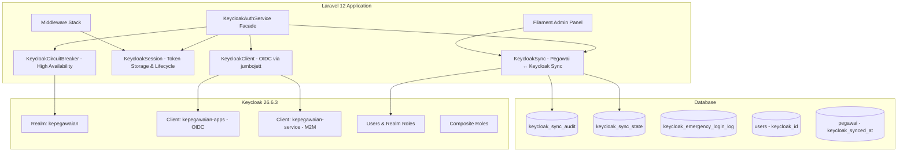
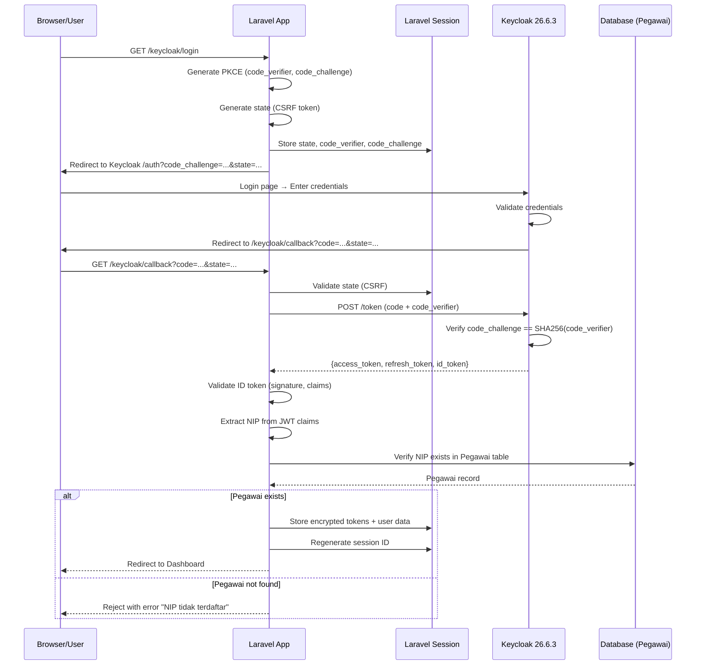
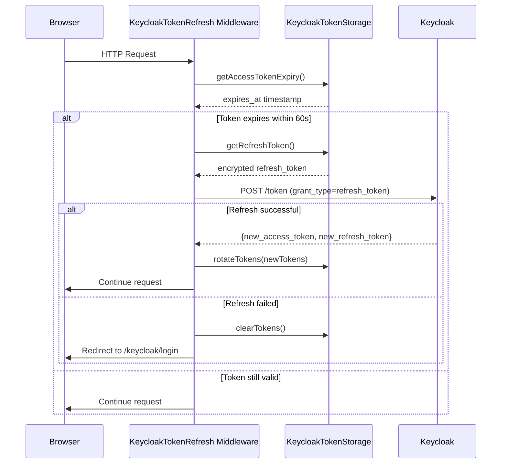
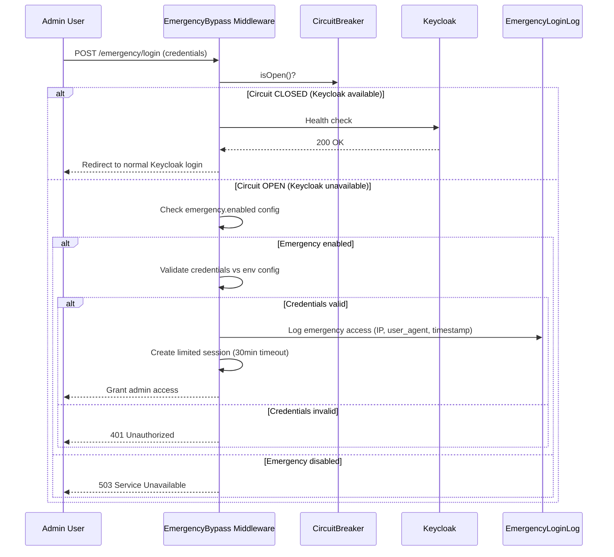
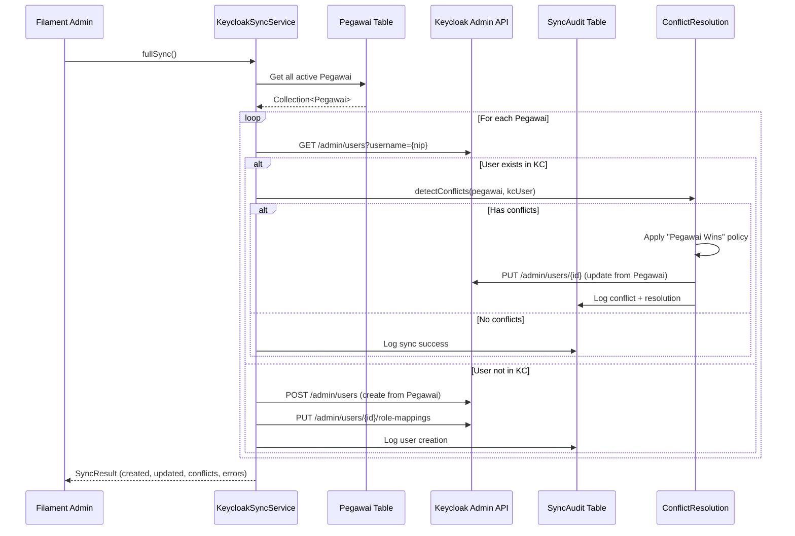

# Design Document: Keycloak IAM Migration

## Overview

Dokumen desain ini mendefinisikan migrasi sistem Identity and Access Management (IAM) dari custom implementation ke Keycloak 26.6.3 menggunakan **Big Bang approach** dengan **Wrapper Pattern** untuk backward compatibility. Sistem ini dibangun di atas Laravel 12 dengan PHP 8.4, menggunakan library `jumbojett/openid-connect-php` untuk implementasi OIDC Authorization Code + PKCE flow.

Migrasi mencakup: autentikasi pengguna melalui Keycloak sebagai Identity Provider, sinkronisasi data Pegawai ↔ Keycloak users, conflict resolution dengan kebijakan "Pegawai Wins", circuit breaker pattern untuk high availability, emergency bypass untuk admin saat Keycloak tidak tersedia, serta admin panel berbasis Filament untuk manajemen sinkronisasi.

Strategi yang dipilih adalah Big Bang (single phase deployment) karena ini adalah greenfield development environment, menghindari kompleksitas hybrid state antara sistem lama dan baru.

## Architecture



## Sequence Diagrams

### OIDC Authorization Code + PKCE Login Flow



### Token Refresh Flow



### Emergency Bypass Flow



### Sync Operations Flow



## Components and Interfaces

### Component 1: KeycloakClient

**Purpose**: Mengelola komunikasi OIDC dengan Keycloak server via library jumbojett/openid-connect-php.

**Interface**:
```php
interface KeycloakClientInterface
{
    /**
     * Membangun authorization URL untuk redirect ke Keycloak login page.
     */
    public function buildAuthorizationUrl(string $redirectUri): AuthorizationRequest;

    /**
     * Menukar authorization code dengan token set (access, refresh, id).
     */
    public function exchangeCode(string $code, string $codeVerifier, string $redirectUri): TokenResult;

    /**
     * Refresh access token menggunakan refresh token.
     */
    public function refreshToken(string $refreshToken): TokenResult;

    /**
     * Validasi dan decode ID token (JWT signature verification).
     */
    public function validateIdToken(string $idToken): IdTokenClaims;

    /**
     * Logout user dari Keycloak session.
     */
    public function logout(string $refreshToken): void;

    /**
     * Silent SSO check (prompt=none).
     */
    public function silentCheck(string $redirectUri): AuthorizationRequest;
}
```

**Responsibilities**:
- Mengelola OIDC protocol communication
- JWT signature validation menggunakan Keycloak public key
- PKCE flow handling (code_challenge, code_verifier)
- Token exchange dan refresh operations

### Component 2: KeycloakTokenStorage

**Purpose**: Menyimpan dan mengelola token lifecycle dalam Laravel encrypted session.

**Interface**:
```php
interface KeycloakTokenStorageInterface
{
    /**
     * Menyimpan token set ke session (encrypted).
     */
    public function storeTokens(TokenResult $tokens): void;

    /**
     * Mengambil access token dari session.
     */
    public function getAccessToken(): ?string;

    /**
     * Mengambil refresh token (decrypted) dari session.
     */
    public function getRefreshToken(): ?string;

    /**
     * Mendapatkan waktu expiry access token.
     */
    public function getAccessTokenExpiry(): ?CarbonInterface;

    /**
     * Rotate tokens (simpan baru, invalidasi lama).
     */
    public function rotateTokens(TokenResult $newTokens): void;

    /**
     * Hapus semua token dari session.
     */
    public function clearTokens(): void;

    /**
     * Cek apakah access token masih valid.
     */
    public function isTokenValid(): bool;
}
```

**Responsibilities**:
- Enkripsi refresh token sebelum disimpan di session
- Token rotation pada setiap refresh
- Expiry tracking untuk proactive refresh
- Session cleanup pada logout

### Component 3: KeycloakSyncService

**Purpose**: Sinkronisasi data Pegawai dengan Keycloak users (CRUD operations via Admin API).

**Interface**:
```php
interface KeycloakSyncServiceInterface
{
    /**
     * Full sync semua Pegawai aktif ke Keycloak.
     */
    public function fullSync(): SyncResult;

    /**
     * Incremental sync (Pegawai berubah dalam 24 jam terakhir).
     */
    public function incrementalSync(): SyncResult;

    /**
     * Sync single Pegawai ke Keycloak.
     */
    public function syncPegawai(Pegawai $pegawai): SyncResult;

    /**
     * Disable user di Keycloak.
     */
    public function disableUser(string $nip): void;

    /**
     * Cek apakah user dengan NIP tertentu ada di Keycloak.
     */
    public function userExists(string $nip): bool;

    /**
     * Health check koneksi ke Keycloak.
     */
    public function healthCheck(): HealthStatus;
}
```

**Responsibilities**:
- Full sync, incremental sync, dan single sync operations
- Conflict detection dan resolution (Pegawai Wins policy)
- Audit logging untuk setiap operasi sync
- Role mapping dari Pegawai roles ke Keycloak realm roles

### Component 4: KeycloakCircuitBreaker

**Purpose**: Implementasi circuit breaker pattern untuk melindungi aplikasi saat Keycloak tidak tersedia.

**Interface**:
```php
interface CircuitBreakerInterface
{
    /**
     * Eksekusi operasi dengan circuit breaker protection.
     */
    public function call(callable $operation): mixed;

    /**
     * Cek apakah circuit sedang open (blocking requests).
     */
    public function isOpen(): bool;

    /**
     * Dapatkan state saat ini (closed, open, half_open).
     */
    public function getState(): string;

    /**
     * Reset circuit breaker ke closed state.
     */
    public function reset(): void;

    /**
     * Dapatkan jumlah failure berturut-turut.
     */
    public function getFailureCount(): int;
}
```

**Responsibilities**:
- Track consecutive failures ke Keycloak
- Transition state: CLOSED → OPEN (setelah 5 failures)
- Transition state: OPEN → HALF_OPEN (setelah 30s recovery timeout)
- Transition state: HALF_OPEN → CLOSED (setelah 2 consecutive successes)
- Graceful degradation saat circuit open

### Component 5: ConflictResolution

**Purpose**: Menangani konflik data antara Pegawai (source of truth) dan Keycloak user.

**Interface**:
```php
interface ConflictResolutionInterface
{
    /**
     * Deteksi konflik antara data Pegawai dan Keycloak user.
     */
    public function detectConflicts(Pegawai $pegawai, array $keycloakUser): array;

    /**
     * Resolve konflik berdasarkan policy (default: Pegawai Wins).
     */
    public function resolve(ConflictType $type, Pegawai $pegawai, ?array $keycloakUser): ConflictResult;

    /**
     * Dapatkan policy yang aktif.
     */
    public function getPolicy(): ConflictPolicy;
}
```

**Responsibilities**:
- Deteksi 4 jenis konflik: DataMismatch, StatusConflict, RoleOverride, IdentifierChange
- Apply resolution policy (Pegawai Wins sebagai default)
- Log semua konflik ke audit table
- Provide data untuk admin UI conflict resolution

## Data Models

### Model 1: TokenResult

```php
readonly class TokenResult
{
    public function __construct(
        public string $accessToken,
        public string $refreshToken,
        public string $idToken,
        public int $expiresIn,
        public int $refreshExpiresIn,
        public string $tokenType = 'Bearer',
    ) {}
}
```

**Validation Rules**:
- `accessToken` tidak boleh kosong
- `refreshToken` tidak boleh kosong
- `expiresIn` harus positif integer
- `tokenType` harus 'Bearer'

### Model 2: IdTokenClaims

```php
readonly class IdTokenClaims
{
    public function __construct(
        public string $sub,
        public string $nip,
        public string $email,
        public string $name,
        public array $roles,
        public array $permissions,
        public int $exp,
        public int $iat,
        public string $iss,
    ) {}
}
```

**Validation Rules**:
- `sub` harus valid UUID dari Keycloak
- `nip` harus 18 digit angka (format NIP ASN)
- `exp` harus di masa depan (token belum expired)
- `iss` harus match dengan Keycloak realm URL

### Model 3: SyncResult

```php
readonly class SyncResult
{
    public function __construct(
        public bool $success,
        public int $created = 0,
        public int $updated = 0,
        public int $skipped = 0,
        public int $conflicts = 0,
        public int $errors = 0,
        public array $errorDetails = [],
        public ?string $syncType = null,
        public ?CarbonInterface $completedAt = null,
    ) {}
}
```

### Model 4: PkcePair

```php
readonly class PkcePair
{
    public function __construct(
        public string $verifier,
        public string $challenge,
        public string $method = 'S256',
    ) {}
}
```

**Validation Rules**:
- `verifier` harus 43-128 karakter, base64url encoded
- `challenge` harus BASE64URL(SHA256(verifier))
- `method` harus 'S256' (plain tidak didukung)

### Model 5: HealthStatus

```php
readonly class HealthStatus
{
    public function __construct(
        public bool $isHealthy,
        public string $circuitState,
        public int $failureCount,
        public ?CarbonInterface $lastSuccessAt,
        public ?CarbonInterface $lastFailureAt,
        public ?string $lastError = null,
    ) {}
}
```

### Model 6: Keycloak Session Data (Session Structure)

```php
// session('keycloak') structure
[
    'tokens' => [
        'access_token' => 'eyJ...',
        'refresh_token' => 'encrypted...', 
        'expires_at' => '2024-01-01T12:05:00Z',
    ],
    'user' => [
        'sub' => 'uuid-from-keycloak',
        'nip' => '198501152010011001',
        'email' => 'user@email.com',
        'name' => 'Nama Lengkap',
    ],
    'permissions' => ['cuti.view', 'cuti.create', ...],
    'roles' => ['operator', 'pegawai'],
]
```

### Database Schema: keycloak_sync_audit

```php
Schema::create('keycloak_sync_audit', function (Blueprint $table) {
    $table->id();
    $table->string('event_type'); // conflict, create, update, delete, sync_failure
    $table->foreignId('pegawai_id')->nullable()->constrained()->nullOnDelete();
    $table->string('nip')->index();
    $table->string('conflict_type')->nullable();
    $table->json('pegawai_snapshot')->nullable();
    $table->json('keycloak_snapshot')->nullable();
    $table->json('resolution')->nullable();
    $table->string('resolved_by'); // system, admin, user
    $table->foreignId('caused_by')->nullable()->constrained('users')->nullOnDelete();
    $table->string('caused_by_nip')->nullable();
    $table->timestamps();

    $table->index(['event_type', 'created_at']);
    $table->index(['nip', 'created_at']);
});
```

### Database Schema: keycloak_sync_state

```php
Schema::create('keycloak_sync_state', function (Blueprint $table) {
    $table->id();
    $table->string('last_sync_at');
    $table->string('last_sync_type'); // full, incremental
    $table->integer('total_synced')->default(0);
    $table->integer('total_conflicts')->default(0);
    $table->json('sync_metadata')->nullable();
    $table->timestamps();
});
```

### Database Schema: keycloak_emergency_login_log

```php
Schema::create('keycloak_emergency_login_log', function (Blueprint $table) {
    $table->id();
    $table->foreignId('user_id')->nullable()->constrained()->nullOnDelete();
    $table->string('username'); // hashed for security
    $table->string('ip_address');
    $table->string('user_agent')->nullable();
    $table->timestamp('logged_in_at');
    $table->timestamp('logged_out_at')->nullable();
    $table->timestamps();

    $table->index(['logged_in_at']);
});
```

### Database Modifications

| Table | Column | Type | Purpose |
|-------|--------|------|---------|
| `users` | `keycloak_id` | `string, nullable` | Link Laravel user ke Keycloak UUID |
| `pegawai` | `keycloak_synced_at` | `timestamp, nullable` | Track kapan terakhir sync |
| `pegawai` | `keycloak_user_id` | `string, nullable` | Keycloak user UUID |


## Algorithmic Pseudocode

### Algorithm 1: OIDC Authorization Code + PKCE Login

```php
/**
 * ALGORITHM: handleLogin
 * INPUT: Request $request
 * OUTPUT: RedirectResponse ke Keycloak authorization endpoint
 *
 * PRECONDITIONS:
 * - Keycloak server tersedia (circuit breaker closed)
 * - Config keycloak.client_id dan keycloak.realm terisi
 *
 * POSTCONDITIONS:
 * - Session berisi oauth_state (state, code_verifier, code_challenge, expires_at)
 * - User di-redirect ke Keycloak login page dengan PKCE params
 */
public function login(Request $request): RedirectResponse
{
    // Step 1: Generate PKCE pair (RFC 7636)
    $codeVerifier = base64url_encode(random_bytes(64)); // 43-128 chars
    $codeChallenge = base64url_encode(hash('sha256', $codeVerifier, true));
    
    // Step 2: Generate state untuk CSRF protection
    $state = bin2hex(random_bytes(32));
    
    // Step 3: Store di session dengan TTL
    session()->put('keycloak.oauth_state', [
        'state' => $state,
        'code_verifier' => $codeVerifier,
        'code_challenge' => $codeChallenge,
        'redirect_uri' => route('keycloak.callback'),
        'created_at' => now()->toIso8601String(),
        'expires_at' => now()->addMinutes(10)->toIso8601String(),
    ]);
    
    // Step 4: Build authorization URL
    $authUrl = sprintf(
        '%s/realms/%s/protocol/openid-connect/auth?%s',
        config('keycloak.base_url'),
        config('keycloak.realm'),
        http_build_query([
            'client_id' => config('keycloak.client.id'),
            'response_type' => 'code',
            'scope' => implode(' ', config('keycloak.scopes')),
            'redirect_uri' => route('keycloak.callback'),
            'state' => $state,
            'code_challenge' => $codeChallenge,
            'code_challenge_method' => 'S256',
        ])
    );
    
    return redirect()->away($authUrl);
}
```

### Algorithm 2: Callback Handler (Token Exchange)

```php
/**
 * ALGORITHM: handleCallback
 * INPUT: Request $request (dengan query params: code, state)
 * OUTPUT: RedirectResponse ke dashboard atau error page
 *
 * PRECONDITIONS:
 * - Session berisi valid oauth_state
 * - Request memiliki 'code' dan 'state' query params
 * - State belum expired (< 10 menit)
 *
 * POSTCONDITIONS:
 * - Jika sukses: session berisi encrypted tokens + user claims + permissions
 * - Jika gagal: user di-redirect ke login dengan error message
 * - oauth_state dihapus dari session setelah diproses
 *
 * LOOP INVARIANTS: N/A (no loops)
 */
public function callback(Request $request): RedirectResponse
{
    // Step 1: Validate state (CSRF protection)
    $oauthState = session()->pull('keycloak.oauth_state');
    
    if (!$oauthState || !hash_equals($oauthState['state'], $request->query('state', ''))) {
        throw new KeycloakException('Invalid state parameter', KeycloakException::INVALID_TOKEN);
    }
    
    // Step 2: Check state expiry
    if (now()->isAfter(Carbon::parse($oauthState['expires_at']))) {
        throw new KeycloakException('OAuth state expired', KeycloakException::TOKEN_EXPIRED);
    }
    
    // Step 3: Exchange authorization code for tokens
    $tokenResult = $this->keycloakClient->exchangeCode(
        code: $request->query('code'),
        codeVerifier: $oauthState['code_verifier'],
        redirectUri: $oauthState['redirect_uri']
    );
    
    // Step 4: Validate ID token (JWT signature + claims)
    $claims = $this->keycloakClient->validateIdToken($tokenResult->idToken);
    
    // Step 5: Extract NIP dan verify di Pegawai table
    $pegawai = Pegawai::where('nip', $claims->nip)->first();
    
    if (!$pegawai) {
        throw new KeycloakException(
            "NIP {$claims->nip} tidak terdaftar dalam sistem kepegawaian",
            KeycloakException::USER_NOT_FOUND
        );
    }
    
    // Step 6: Store tokens di encrypted session
    $this->tokenStorage->storeTokens($tokenResult);
    
    // Step 7: Store user claims dan permissions
    session()->put('keycloak.user', [
        'sub' => $claims->sub,
        'nip' => $claims->nip,
        'email' => $claims->email,
        'name' => $claims->name,
    ]);
    session()->put('keycloak.permissions', $claims->permissions);
    session()->put('keycloak.roles', $claims->roles);
    
    // Step 8: Regenerate session (prevent session fixation)
    session()->regenerate();
    
    // Step 9: Login user ke Laravel auth
    Auth::login($pegawai->user);
    
    return redirect()->intended('/dashboard');
}
```

### Algorithm 3: Token Refresh (Middleware)

```php
/**
 * ALGORITHM: refreshTokenIfNeeded
 * INPUT: Request $request, Closure $next
 * OUTPUT: Response (continue atau redirect ke login)
 *
 * PRECONDITIONS:
 * - User memiliki active session
 * - Token storage berisi access_token dan refresh_token
 *
 * POSTCONDITIONS:
 * - Jika token valid: request dilanjutkan tanpa perubahan
 * - Jika token perlu refresh: tokens di-rotate dengan yang baru
 * - Jika refresh gagal: session dihapus, redirect ke login
 *
 * LOOP INVARIANTS: N/A
 */
public function handle(Request $request, Closure $next): Response
{
    // Skip untuk route yang tidak perlu auth
    if ($this->shouldSkip($request)) {
        return $next($request);
    }
    
    $expiry = $this->tokenStorage->getAccessTokenExpiry();
    $refreshThreshold = config('keycloak.tokens.refresh_before_seconds', 60);
    
    // Proactive refresh: refresh sebelum token benar-benar expired
    if ($expiry && $expiry->diffInSeconds(now()) < $refreshThreshold) {
        try {
            $refreshToken = $this->tokenStorage->getRefreshToken();
            $newTokens = $this->circuitBreaker->call(
                fn () => $this->keycloakClient->refreshToken($refreshToken)
            );
            
            // Rotate: simpan token baru, old refresh token di-invalidate oleh Keycloak
            $this->tokenStorage->rotateTokens($newTokens);
            
        } catch (KeycloakCircuitOpenException $e) {
            // Circuit open: Keycloak unavailable
            // Jika token masih valid (belum benar-benar expired), lanjutkan
            if ($this->tokenStorage->isTokenValid()) {
                return $next($request);
            }
            // Token benar-benar expired + Keycloak down = logout
            return $this->forceLogout($request);
            
        } catch (KeycloakException $e) {
            // Refresh gagal (token revoked, dll)
            return $this->forceLogout($request);
        }
    }
    
    return $next($request);
}
```

### Algorithm 4: Circuit Breaker State Machine

```php
/**
 * ALGORITHM: circuitBreakerCall
 * INPUT: callable $operation
 * OUTPUT: mixed (result dari operation) atau throw exception
 *
 * PRECONDITIONS:
 * - $operation adalah callable yang berkomunikasi dengan Keycloak
 * - Cache/storage tersedia untuk menyimpan circuit state
 *
 * POSTCONDITIONS:
 * - Jika CLOSED: operasi dijalankan, failure/success di-track
 * - Jika OPEN dan belum recovery timeout: throw CircuitOpenException
 * - Jika OPEN dan sudah recovery timeout: transition ke HALF_OPEN, coba operasi
 * - Jika HALF_OPEN dan sukses N kali: transition ke CLOSED
 * - Jika HALF_OPEN dan gagal: kembali ke OPEN
 *
 * STATE TRANSITIONS:
 * CLOSED → OPEN: setelah FAILURE_THRESHOLD (5) consecutive failures
 * OPEN → HALF_OPEN: setelah RECOVERY_TIMEOUT (30s) berlalu
 * HALF_OPEN → CLOSED: setelah SUCCESS_THRESHOLD (2) consecutive successes
 * HALF_OPEN → OPEN: setelah 1 failure
 */
public function call(callable $operation): mixed
{
    $state = $this->getState();
    
    if ($state === self::STATE_OPEN) {
        if ($this->shouldTryRecovery()) {
            $this->transitionTo(self::STATE_HALF_OPEN);
        } else {
            throw new KeycloakCircuitOpenException(
                'Keycloak unavailable. Circuit is open. ' .
                "Failures: {$this->getFailureCount()}/{$this->failureThreshold}"
            );
        }
    }
    
    try {
        $result = $operation();
        $this->recordSuccess();
        return $result;
    } catch (Exception $e) {
        $this->recordFailure($e);
        throw $e;
    }
}

private function recordSuccess(): void
{
    $this->consecutiveSuccesses++;
    $this->consecutiveFailures = 0;
    $this->lastSuccessAt = now();
    
    if ($this->getState() === self::STATE_HALF_OPEN 
        && $this->consecutiveSuccesses >= self::SUCCESS_THRESHOLD) {
        $this->transitionTo(self::STATE_CLOSED);
    }
}

private function recordFailure(Exception $e): void
{
    $this->consecutiveFailures++;
    $this->consecutiveSuccesses = 0;
    $this->lastFailureAt = now();
    $this->lastError = $e->getMessage();
    
    if ($this->getState() === self::STATE_HALF_OPEN) {
        $this->transitionTo(self::STATE_OPEN);
    } elseif ($this->consecutiveFailures >= self::FAILURE_THRESHOLD) {
        $this->transitionTo(self::STATE_OPEN);
    }
}
```

### Algorithm 5: Full Sync Operation

```php
/**
 * ALGORITHM: fullSync
 * INPUT: none (mengambil semua Pegawai aktif dari database)
 * OUTPUT: SyncResult
 *
 * PRECONDITIONS:
 * - Keycloak Admin API tersedia (service account authenticated)
 * - Circuit breaker dalam state CLOSED atau HALF_OPEN
 * - Service account memiliki manage-users permission di realm kepegawaian
 *
 * POSTCONDITIONS:
 * - Semua Pegawai aktif telah di-sync ke Keycloak (create/update)
 * - Konflik terdeteksi dan di-resolve menggunakan Pegawai Wins policy
 * - keycloak_sync_state diupdate dengan hasil sync terakhir
 * - keycloak_sync_audit berisi log untuk setiap operasi
 * - pegawai.keycloak_synced_at diupdate untuk yang berhasil sync
 *
 * LOOP INVARIANTS:
 * - Untuk setiap iterasi: total processed = created + updated + skipped + errors
 * - Audit log entry dibuat untuk setiap pegawai yang diproses
 */
public function fullSync(): SyncResult
{
    $pegawaiList = Pegawai::where('status', 'aktif')->get();
    
    $created = 0;
    $updated = 0;
    $skipped = 0;
    $conflicts = 0;
    $errors = 0;
    $errorDetails = [];
    
    foreach ($pegawaiList as $pegawai) {
        // INVARIANT: created + updated + skipped + errors == jumlah iterasi sejauh ini
        try {
            $kcUser = $this->findKeycloakUser($pegawai->nip);
            
            if ($kcUser === null) {
                // User belum ada di Keycloak → create
                $this->createKeycloakUser($pegawai);
                $this->assignRoles($pegawai);
                $created++;
                $this->logAudit('create', $pegawai);
            } else {
                // User sudah ada → check conflicts
                $detectedConflicts = $this->conflictResolver->detectConflicts($pegawai, $kcUser);
                
                if (!empty($detectedConflicts)) {
                    // Resolve dengan Pegawai Wins policy
                    foreach ($detectedConflicts as $conflict) {
                        $this->conflictResolver->resolve($conflict, $pegawai, $kcUser);
                    }
                    $this->updateKeycloakUser($pegawai, $kcUser['id']);
                    $conflicts += count($detectedConflicts);
                    $updated++;
                } else {
                    $skipped++;
                }
            }
            
            // Update sync timestamp
            $pegawai->update(['keycloak_synced_at' => now()]);
            
        } catch (Exception $e) {
            $errors++;
            $errorDetails[] = [
                'nip' => $pegawai->nip,
                'error' => $e->getMessage(),
            ];
            $this->logAudit('sync_failure', $pegawai, error: $e->getMessage());
        }
    }
    
    // Update sync state
    KeycloakSyncState::updateOrCreate(
        ['id' => 1],
        [
            'last_sync_at' => now(),
            'last_sync_type' => 'full',
            'total_synced' => $created + $updated,
            'total_conflicts' => $conflicts,
        ]
    );
    
    return new SyncResult(
        success: $errors === 0,
        created: $created,
        updated: $updated,
        skipped: $skipped,
        conflicts: $conflicts,
        errors: $errors,
        errorDetails: $errorDetails,
        syncType: 'full',
        completedAt: now(),
    );
}
```

### Algorithm 6: Emergency Bypass Authentication

```php
/**
 * ALGORITHM: emergencyLogin
 * INPUT: Request $request (username, password)
 * OUTPUT: RedirectResponse ke admin panel atau error
 *
 * PRECONDITIONS:
 * - config('keycloak.emergency.enabled') === true
 * - Circuit breaker dalam state OPEN (Keycloak tidak tersedia)
 * - Request memiliki username dan password
 *
 * POSTCONDITIONS:
 * - Jika valid: admin session dibuat dengan timeout 30 menit
 * - Emergency access di-log ke keycloak_emergency_login_log
 * - Session ditandai sebagai emergency mode
 * - Jika invalid: request ditolak + rate limited
 */
public function emergencyLogin(Request $request): RedirectResponse
{
    // Step 1: Verify emergency mode is enabled
    if (!config('keycloak.emergency.enabled')) {
        abort(503, 'Emergency access tidak diaktifkan');
    }
    
    // Step 2: Verify Keycloak is actually down (prevent abuse)
    if (!$this->circuitBreaker->isOpen()) {
        return redirect()->route('keycloak.login')
            ->with('info', 'Keycloak tersedia, gunakan login normal');
    }
    
    // Step 3: Validate credentials against env config
    $validUsername = config('keycloak.emergency.username');
    $validPassword = config('keycloak.emergency.password');
    
    if (!hash_equals($validUsername, $request->input('username'))
        || !Hash::check($request->input('password'), $validPassword)) {
        return back()->withErrors(['credentials' => 'Kredensial emergency tidak valid']);
    }
    
    // Step 4: Create limited session
    session()->regenerate();
    session()->put('keycloak.emergency_mode', true);
    session()->put('keycloak.emergency_expires_at', 
        now()->addMinutes(config('keycloak.emergency.session_timeout_minutes', 30))
    );
    session()->put('keycloak.roles', config('keycloak.emergency.allowed_roles'));
    
    // Step 5: Log emergency access
    KeycloakEmergencyLoginLog::create([
        'username' => hash('sha256', $request->input('username')),
        'ip_address' => $request->ip(),
        'user_agent' => $request->userAgent(),
        'logged_in_at' => now(),
    ]);
    
    return redirect()->route('filament.admin.pages.dashboard');
}
```

## Key Functions with Formal Specifications

### Function 1: PkceGenerator::generate()

```php
public function generate(): PkcePair
```

**Preconditions:**
- `random_bytes()` tersedia (PHP 7.0+)
- Extension OpenSSL atau libsodium aktif

**Postconditions:**
- `$pair->verifier` memiliki panjang 43-128 karakter
- `$pair->verifier` hanya berisi karakter base64url ([A-Za-z0-9\-\_])
- `$pair->challenge === base64url(sha256($pair->verifier))`
- `$pair->method === 'S256'`

**Loop Invariants:** N/A

### Function 2: KeycloakTokenStorage::rotateTokens()

```php
public function rotateTokens(TokenResult $newTokens): void
```

**Preconditions:**
- `$newTokens` berisi valid access_token dan refresh_token
- Session tersedia dan writable
- Encryption key (APP_KEY) tersedia

**Postconditions:**
- Session `keycloak.tokens.access_token` berisi token baru
- Session `keycloak.tokens.refresh_token` berisi token baru (encrypted)
- Session `keycloak.tokens.expires_at` diupdate sesuai `$newTokens->expiresIn`
- Token lama tidak lagi tersimpan di session
- Keycloak menolak refresh token lama (rotated by server)

**Loop Invariants:** N/A

### Function 3: ConflictResolution::detectConflicts()

```php
public function detectConflicts(Pegawai $pegawai, array $keycloakUser): array
```

**Preconditions:**
- `$pegawai` adalah instance valid dengan NIP, email, dan roles
- `$keycloakUser` adalah array dari Keycloak Admin API response
- `$keycloakUser` memiliki field: email, enabled, firstName, lastName, attributes

**Postconditions:**
- Return array of `ConflictType` (bisa kosong jika tidak ada konflik)
- Tidak ada side effects pada `$pegawai` atau `$keycloakUser`
- Setiap konflik terdeteksi memiliki type yang valid dari enum `ConflictType`

**Loop Invariants:**
- Untuk setiap field yang dicek: hasil perbandingan konsisten (deterministic)

### Function 4: KeycloakCircuitBreaker::shouldTryRecovery()

```php
private function shouldTryRecovery(): bool
```

**Preconditions:**
- Circuit state adalah OPEN
- `$this->lastFailureAt` tidak null
- Cache/storage untuk state tersedia

**Postconditions:**
- Return `true` jika `now() - lastFailureAt >= RECOVERY_TIMEOUT`
- Return `false` jika belum waktunya recovery
- Tidak mengubah state circuit

**Loop Invariants:** N/A

### Function 5: KeycloakSyncService::createKeycloakUser()

```php
private function createKeycloakUser(Pegawai $pegawai): string
```

**Preconditions:**
- Service account ter-autentikasi ke Keycloak Admin API
- `$pegawai` memiliki NIP, nama, dan email yang valid
- User dengan NIP tersebut belum ada di Keycloak

**Postconditions:**
- User baru dibuat di Keycloak realm `kepegawaian`
- Username di Keycloak = NIP pegawai
- Email, firstName, lastName di-set dari data Pegawai
- `attributes.nip` di-set di Keycloak user
- User di-set `enabled = true`
- Return Keycloak user ID (UUID)

**Loop Invariants:** N/A

## Example Usage

### Contoh 1: Login Flow (Controller)

```php
// app/Http/Controllers/Auth/KeycloakAuthController.php

class KeycloakAuthController extends Controller
{
    public function __construct(
        private KeycloakClientInterface $keycloakClient,
        private KeycloakTokenStorageInterface $tokenStorage,
        private CircuitBreakerInterface $circuitBreaker,
    ) {}

    public function login(): RedirectResponse
    {
        $authRequest = $this->circuitBreaker->call(
            fn () => $this->keycloakClient->buildAuthorizationUrl(
                route('keycloak.callback')
            )
        );

        return redirect()->away($authRequest->getFullUrl());
    }

    public function callback(Request $request): RedirectResponse
    {
        // Validate state
        $oauthState = session()->pull('keycloak.oauth_state');
        abort_unless(
            $oauthState && hash_equals($oauthState['state'], $request->query('state', '')),
            403,
            'Invalid state parameter'
        );

        // Exchange code for tokens
        $tokens = $this->circuitBreaker->call(
            fn () => $this->keycloakClient->exchangeCode(
                $request->query('code'),
                $oauthState['code_verifier'],
                $oauthState['redirect_uri']
            )
        );

        // Validate and extract claims
        $claims = $this->keycloakClient->validateIdToken($tokens->idToken);

        // Verify pegawai exists
        $pegawai = Pegawai::where('nip', $claims->nip)->firstOrFail();

        // Store session data
        $this->tokenStorage->storeTokens($tokens);
        session()->put('keycloak.user', [
            'sub' => $claims->sub,
            'nip' => $claims->nip,
            'email' => $claims->email,
            'name' => $claims->name,
        ]);
        session()->put('keycloak.permissions', $claims->permissions);
        session()->put('keycloak.roles', $claims->roles);
        session()->regenerate();

        Auth::login($pegawai->user);

        return redirect()->intended('/dashboard');
    }

    public function logout(Request $request): RedirectResponse
    {
        $refreshToken = $this->tokenStorage->getRefreshToken();

        if ($refreshToken) {
            $this->circuitBreaker->call(
                fn () => $this->keycloakClient->logout($refreshToken)
            );
        }

        $this->tokenStorage->clearTokens();
        session()->forget('keycloak');
        Auth::logout();
        $request->session()->invalidate();
        $request->session()->regenerateToken();

        return redirect('/');
    }
}
```

### Contoh 2: Middleware Token Refresh

```php
// app/Http/Middleware/KeycloakTokenRefresh.php

class KeycloakTokenRefresh
{
    public function __construct(
        private KeycloakClientInterface $keycloakClient,
        private KeycloakTokenStorageInterface $tokenStorage,
        private CircuitBreakerInterface $circuitBreaker,
    ) {}

    public function handle(Request $request, Closure $next): Response
    {
        if (!Auth::check() || $this->shouldSkip($request)) {
            return $next($request);
        }

        $expiry = $this->tokenStorage->getAccessTokenExpiry();
        $threshold = config('keycloak.tokens.refresh_before_seconds', 60);

        if ($expiry && $expiry->diffInSeconds(now()) < $threshold) {
            try {
                $newTokens = $this->circuitBreaker->call(
                    fn () => $this->keycloakClient->refreshToken(
                        $this->tokenStorage->getRefreshToken()
                    )
                );
                $this->tokenStorage->rotateTokens($newTokens);
            } catch (KeycloakCircuitOpenException) {
                if (!$this->tokenStorage->isTokenValid()) {
                    return redirect()->route('keycloak.login');
                }
            } catch (KeycloakException) {
                $this->tokenStorage->clearTokens();
                Auth::logout();
                return redirect()->route('keycloak.login');
            }
        }

        return $next($request);
    }

    private function shouldSkip(Request $request): bool
    {
        return $request->is('keycloak/*', 'emergency/*', '_health');
    }
}
```

### Contoh 3: Artisan Sync Command

```php
// app/Console/Commands/Keycloak/SyncUsersCommand.php

class SyncUsersCommand extends Command
{
    protected $signature = 'keycloak:sync 
        {--type=full : Tipe sync (full|incremental)} 
        {--nip= : Sync pegawai spesifik by NIP}';

    protected $description = 'Sinkronisasi data Pegawai ke Keycloak';

    public function handle(KeycloakSyncServiceInterface $syncService): int
    {
        if ($nip = $this->option('nip')) {
            $pegawai = Pegawai::where('nip', $nip)->firstOrFail();
            $result = $syncService->syncPegawai($pegawai);
        } elseif ($this->option('type') === 'incremental') {
            $result = $syncService->incrementalSync();
        } else {
            $result = $syncService->fullSync();
        }

        $this->info("Sync selesai: {$result->created} dibuat, {$result->updated} diupdate, {$result->conflicts} konflik");

        return $result->success ? self::SUCCESS : self::FAILURE;
    }
}
```

## Correctness Properties

*A property is a characteristic or behavior that should hold true across all valid executions of a system-essentially, a formal statement about what the system should do. Properties serve as the bridge between human-readable specifications and machine-verifiable correctness guarantees.*

### Property 1: PKCE Integrity

*For any* generated PKCE pair, the code_verifier SHALL have length between 43-128 characters containing only base64url characters ([A-Za-z0-9\-\_]), the code_challenge SHALL equal BASE64URL(SHA256(code_verifier)), and the method SHALL always be 'S256'.

**Validates: Requirements 1.1, 11.1, 11.2, 11.3, 11.4**

### Property 2: State CSRF Protection

*For any* callback request, the request is accepted if and only if the state parameter matches the stored session state AND the state has not expired (less than 10 minutes old). All other cases result in rejection with a 403 error.

**Validates: Requirements 1.4, 1.5**

### Property 3: Authorization URL Completeness

*For any* valid Keycloak configuration, the generated authorization URL SHALL contain all required query parameters: client_id, response_type=code, scope, redirect_uri, state, code_challenge, and code_challenge_method=S256.

**Validates: Requirement 1.3**

### Property 4: NIP Verification Gate

*For any* login attempt, authentication succeeds if and only if the NIP extracted from the validated JWT claims exists in the Pegawai table with active status. All login attempts with unregistered or inactive NIP are rejected.

**Validates: Requirements 2.2, 2.3**

### Property 5: User Claims Storage Completeness

*For any* successful login, the session SHALL contain the complete user claims (sub, nip, email, name), all permissions, and all roles exactly as provided in the validated ID token claims.

**Validates: Requirement 2.4**

### Property 6: Session Regeneration on Login

*For any* successful authentication, the session ID after login SHALL differ from the session ID before login, preventing session fixation attacks.

**Validates: Requirement 3.1**

### Property 7: Token Encryption at Rest

*For any* refresh token stored in the session, the stored value SHALL be an encrypted representation that differs from the original plaintext, AND decrypting the stored value SHALL produce the original refresh token.

**Validates: Requirement 3.2**

### Property 8: Session Cleanup on Logout

*For any* logout operation, the session SHALL not contain any Keycloak tokens, user claims, permissions, or roles after completion. The session SHALL be invalidated and the CSRF token regenerated.

**Validates: Requirement 3.4**

### Property 9: Proactive Token Refresh Trigger

*For any* authenticated request where the access token expiry is within 60 seconds of current time, the middleware SHALL trigger a token refresh attempt.

**Validates: Requirement 4.1**

### Property 10: Token Rotation Consistency

*For any* successful token refresh, the session SHALL contain only the new Token_Set (new access_token and new refresh_token), and the old refresh token SHALL no longer be present in the session.

**Validates: Requirements 4.2, 4.3**

### Property 11: Circuit Breaker State Machine

*For any* sequence of operations, the CircuitBreaker SHALL maintain valid state transitions: CLOSED→OPEN occurs when consecutive failures reach 5, OPEN→HALF_OPEN occurs when 30 seconds elapse since last failure, HALF_OPEN→CLOSED occurs when 2 consecutive successes are achieved, and HALF_OPEN→OPEN occurs on any single failure. No other state transitions are valid.

**Validates: Requirements 5.1, 5.2, 5.3, 5.4, 5.5, 5.6**

### Property 12: Pegawai Wins Policy

*For any* conflict between Pegawai data and Keycloak user data, the resolution SHALL always use Pegawai data as the final value, and the resulting Keycloak user SHALL match the Pegawai data for all conflicted fields.

**Validates: Requirements 8.2, 8.3**

### Property 13: Conflict Detection Purity

*For any* invocation of conflict detection between a Pegawai and a Keycloak user, neither the Pegawai object nor the Keycloak user data SHALL be mutated after the detection operation completes.

**Validates: Requirement 8.5**

### Property 14: Sync Audit Completeness

*For any* sync operation that creates a user, encounters a conflict, or fails for a Pegawai, a corresponding audit entry SHALL exist in keycloak_sync_audit with the correct event_type, NIP, and relevant snapshots or error details.

**Validates: Requirements 8.4, 9.1, 9.2, 9.3**

### Property 15: Sync Count Invariant

*For any* sync operation result, the sum of created + updated + skipped + errors SHALL equal the total number of Pegawai records processed.

**Validates: Requirement 6.6**

### Property 16: Active-Only Sync Filter

*For any* full sync execution, only Pegawai records with active status SHALL be processed. No inactive Pegawai SHALL be included in sync operations.

**Validates: Requirement 6.1**

### Property 17: Incremental Sync Time Window

*For any* incremental sync execution, only Pegawai records modified within the last 24 hours SHALL be processed. Records older than 24 hours since last modification SHALL be excluded.

**Validates: Requirement 7.1**

### Property 18: Sync Idempotency

*For any* set of unchanged Pegawai data, executing fullSync() multiple times SHALL produce the same final state in Keycloak. A Pegawai that already matches its Keycloak user SHALL be skipped without API calls.

**Validates: Requirements 14.1, 14.2**

### Property 19: Emergency Access Guard

*For any* emergency login attempt, access is granted if and only if the CircuitBreaker is in OPEN state AND emergency access is enabled in configuration AND credentials are valid. All other combinations result in rejection.

**Validates: Requirements 10.1, 10.2, 10.3**

### Property 20: Emergency Session Timeout

*For any* successful emergency login, the created session SHALL have an expiry timestamp set to exactly 30 minutes from the login time.

**Validates: Requirement 10.4**

### Property 21: Emergency Audit Trail

*For any* emergency login attempt (successful or failed), a log entry SHALL exist in keycloak_emergency_login_log with the hashed username, IP address, user_agent, and timestamp.

**Validates: Requirement 10.6**

### Property 22: Permission Enforcement

*For any* request to a protected resource, access is granted if and only if the user's session contains the required permission for that resource. Requests without the required permission SHALL receive a 403 response.

**Validates: Requirements 13.3, 13.4**

### Property 23: Middleware Path Exclusion

*For any* request matching the paths keycloak/*, emergency/*, or _health, the token refresh middleware SHALL skip processing and pass the request through without attempting token refresh.

**Validates: Requirement 13.2**

## Error Handling

### Error Scenario 1: Keycloak Unreachable (Network Error)

**Condition**: HTTP request ke Keycloak gagal (timeout, connection refused, DNS failure)
**Response**: Circuit breaker mencatat failure, throw `KeycloakException::NETWORK_ERROR`
**Recovery**: 
- Jika user sudah punya valid session → request dilanjutkan (degraded mode)
- Jika login baru → tampilkan halaman "Service temporarily unavailable"
- Admin → emergency bypass tersedia jika diaktifkan

### Error Scenario 2: Token Expired dan Refresh Gagal

**Condition**: Access token expired, refresh token juga expired atau revoked
**Response**: Clear all tokens dari session, logout user, redirect ke login
**Recovery**: User harus login ulang melalui Keycloak

### Error Scenario 3: Invalid State Parameter (CSRF Attack)

**Condition**: State di callback tidak cocok dengan session
**Response**: Abort 403 "Invalid state parameter", log security event
**Recovery**: User harus memulai login flow dari awal

### Error Scenario 4: NIP Tidak Terdaftar

**Condition**: JWT claims berisi NIP yang tidak ada di tabel Pegawai
**Response**: Reject login, tampilkan error "NIP tidak terdaftar dalam sistem"
**Recovery**: Admin perlu sync user terlebih dahulu, atau tambahkan data Pegawai

### Error Scenario 5: Circuit Breaker Open

**Condition**: 5 consecutive failures ke Keycloak
**Response**: Semua request ke Keycloak langsung ditolak tanpa mencoba (fast fail)
**Recovery**: 
- Otomatis retry setelah 30 detik (HALF_OPEN state)
- Manual reset via admin panel atau artisan command

### Error Scenario 6: Sync Conflict - User Disabled di Keycloak

**Condition**: Pegawai aktif tapi user disabled di Keycloak
**Response**: Block access untuk pegawai tersebut, log ke audit
**Recovery**: Admin perlu investigate di Keycloak dan re-enable jika valid

## Testing Strategy

### Unit Testing Approach

Fokus pada isolated testing untuk setiap komponen:
- **PkceGenerator**: Verify RFC 7636 compliance (length, encoding, hash)
- **ConflictResolution**: Test setiap conflict type dan resolution policy
- **CircuitBreaker**: Test state transitions (CLOSED→OPEN→HALF_OPEN→CLOSED)
- **TokenStorage**: Test encryption/decryption, rotation, dan expiry check

### Property-Based Testing Approach

**Property Test Library**: Pest + custom property assertions

- PKCE code_verifier selalu 43-128 karakter dengan base64url chars
- Circuit breaker state machine selalu valid (no impossible transitions)
- Sync operation selalu menghasilkan audit entry
- Emergency login selalu di-log

### Integration Testing Approach

```php
// Tests menggunakan Pest dengan mock Keycloak server

// Authentication flow
test('user can login via keycloak', function () { ... });
test('invalid state parameter is rejected', function () { ... });
test('user not in pegawai table is rejected', function () { ... });
test('expired tokens trigger refresh', function () { ... });

// Circuit breaker
test('circuit opens after 5 failures', function () { ... });
test('circuit transitions to half-open after timeout', function () { ... });

// Sync operations
test('full sync creates missing users in keycloak', function () { ... });
test('conflict resolution applies pegawai wins policy', function () { ... });

// Emergency bypass
test('emergency login works when keycloak is down', function () { ... });
test('emergency login is blocked when disabled', function () { ... });
```

## Performance Considerations

- **Token Refresh**: Proactive refresh (60s sebelum expiry) menghindari latency saat token sudah expired
- **Circuit Breaker Cache**: State disimpan di cache (Redis/file) untuk fast lookup tanpa DB query
- **Sync Batching**: Full sync memproses pegawai per-batch (100 records) untuk menghindari memory overflow
- **Session Storage**: Menggunakan Laravel default session driver (database/redis) untuk scalability
- **Silent SSO Check**: Menggunakan `prompt=none` untuk zero-interaction session validation

## Security Considerations

1. **PKCE Required** — Selalu gunakan S256 method untuk Authorization Code flow (mencegah authorization code interception)
2. **JWT Validation** — Validate signature secara lokal menggunakan Keycloak public key (JWKS endpoint)
3. **Token Storage** — Refresh token dienkripsi sebelum disimpan di session menggunakan APP_KEY
4. **NIP Validation** — Selalu validate NIP exists di Pegawai table (mencegah unauthorized access)
5. **Client Secrets** — Disimpan di environment variables, never hardcoded
6. **HTTPS Only** — Production wajib menggunakan HTTPS untuk semua komunikasi
7. **State Expiry** — OAuth state expires setelah 10 menit (mencegah replay attack)
8. **Session Regeneration** — Session ID di-regenerate setelah login (mencegah session fixation)
9. **Emergency Credentials** — Password di-hash, username di-hash untuk audit log
10. **Rate Limiting** — Emergency login endpoint di-throttle untuk mencegah brute force

## Dependencies

| Package | Version | Purpose |
|---------|---------|---------|
| `jumbojett/openid-connect-php` | latest | OIDC client library untuk PHP |
| `laravel/framework` | ^12 | Application framework |
| `filament/filament` | ^3.x | Admin panel untuk sync management |
| `pestphp/pest` | ^4 | Testing framework |
| `ext-openssl` | * | Kriptografi untuk PKCE dan JWT |

### Keycloak Infrastructure

| Component | Version | Purpose |
|-----------|---------|---------|
| Keycloak Server | 26.6.3 | Identity Provider |
| Realm | `kepegawaian` | Tenant isolation |
| Client `kepegawaian-apps` | OIDC | User authentication |
| Client `kepegawaian-service` | Client Credentials | M2M / Admin API |
