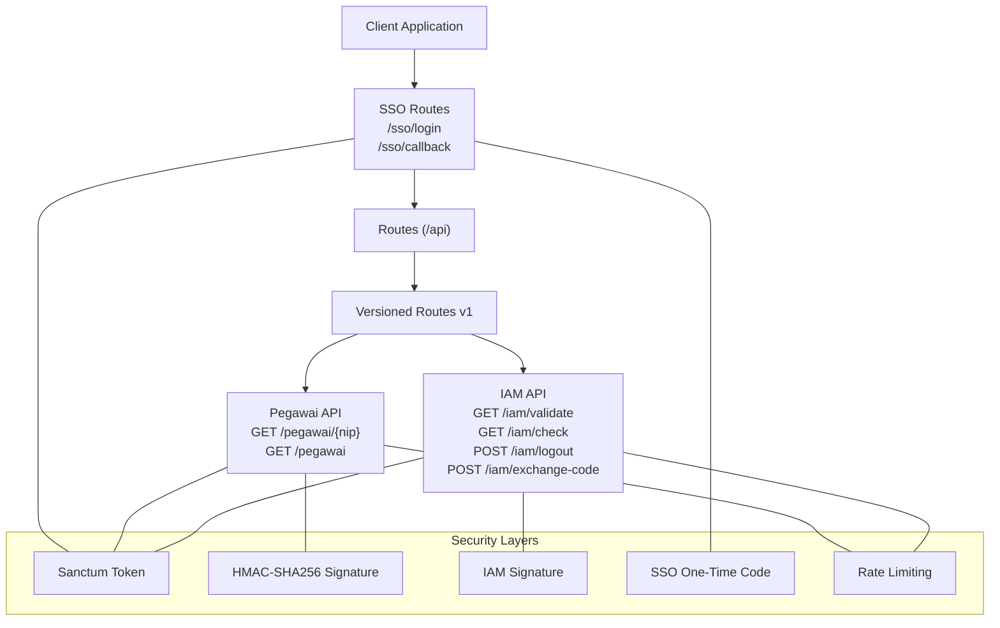
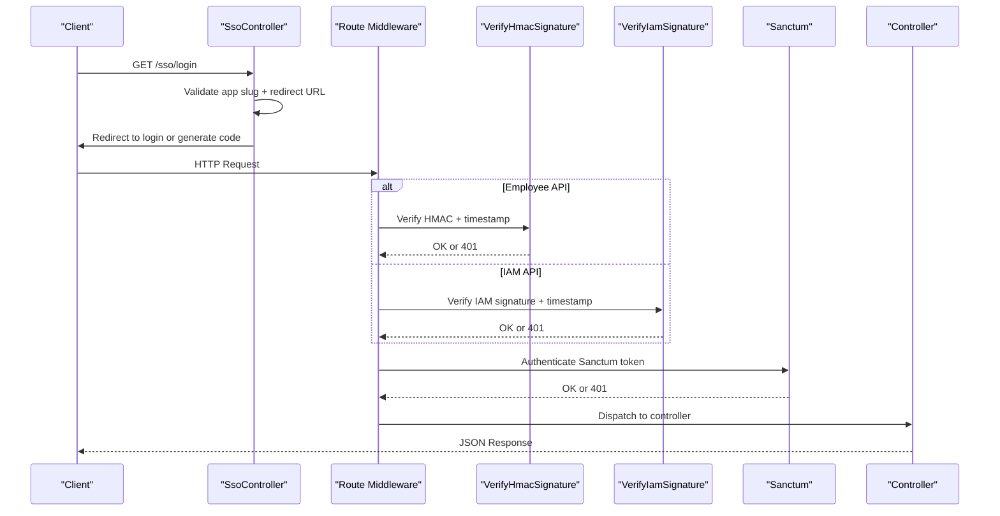
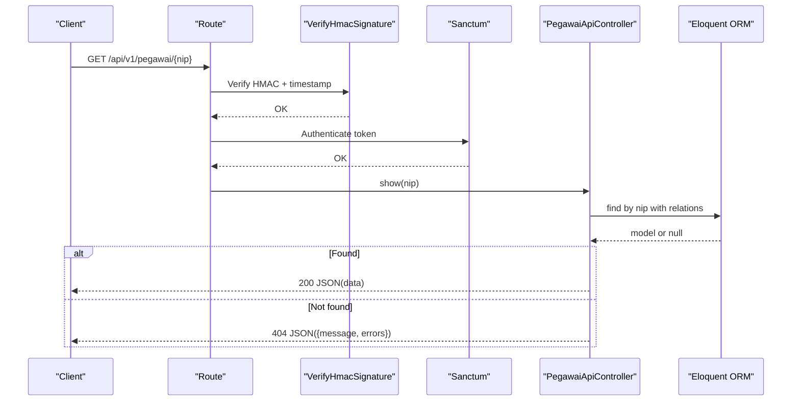
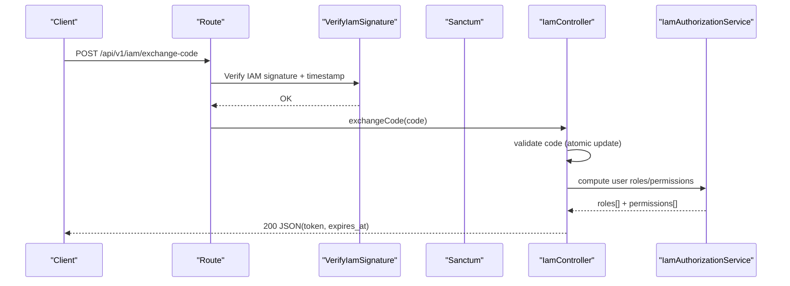
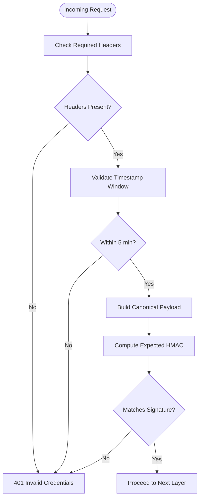
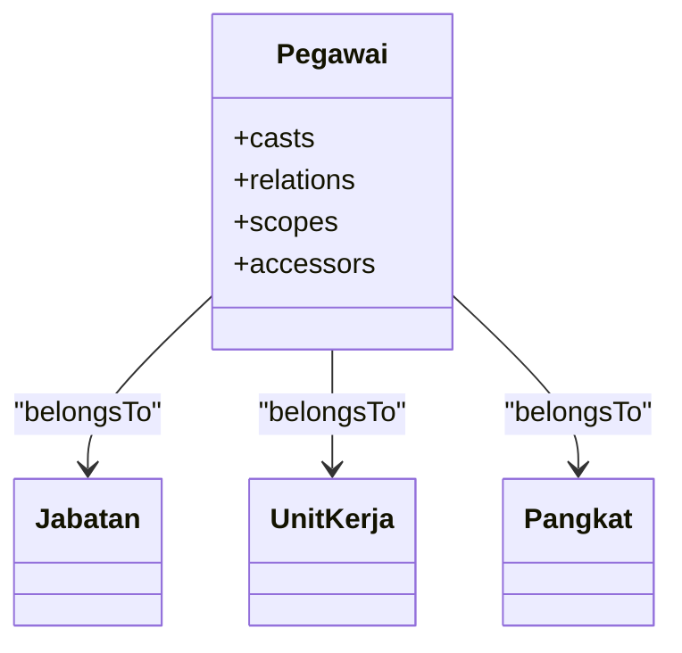
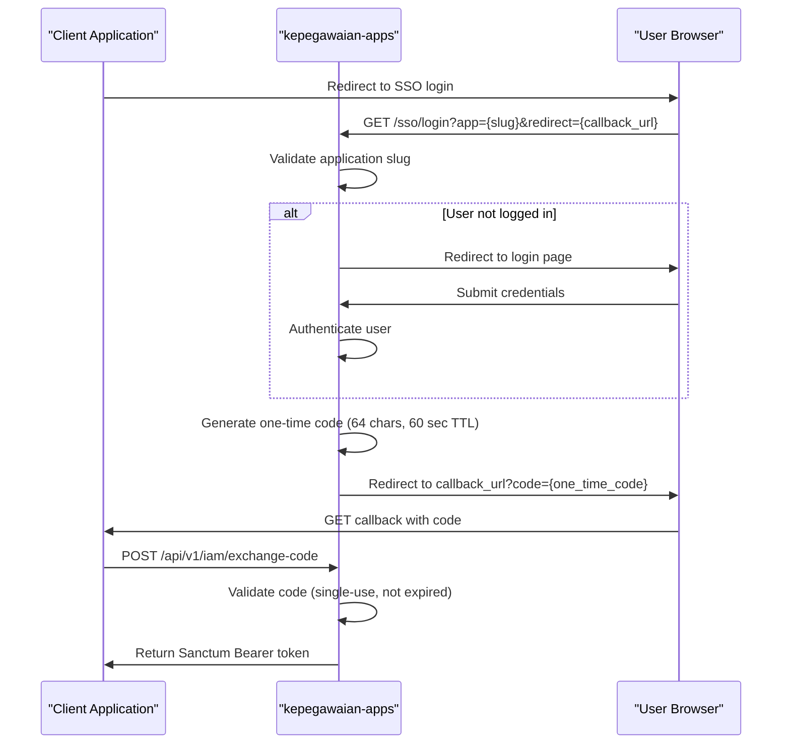
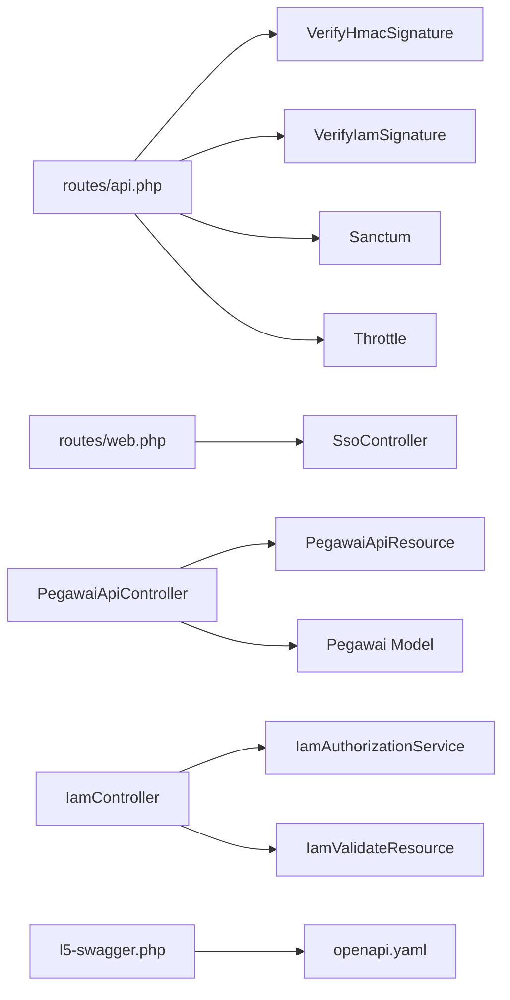

# API Documentation

<cite>
**Referenced Files in This Document**
- [routes/api.php](file://routes/api.php)
- [routes/web.php](file://routes/web.php)
- [PegawaiApiController.php](file://app/Http/Controllers/Api/PegawaiApiController.php)
- [IamController.php](file://app/Http/Controllers/Api/IamController.php)
- [SsoController.php](file://app/Http/Controllers/SsoController.php)
- [VerifyHmacSignature.php](file://app/Http/Middleware/VerifyHmacSignature.php)
- [VerifyIamSignature.php](file://app/Http/Middleware/VerifyIamSignature.php)
- [IamAuthorizationService.php](file://app/Services/IamAuthorizationService.php)
- [PegawaiApiResource.php](file://app/Http/Resources/PegawaiApiResource.php)
- [IamValidateResource.php](file://app/Http/Resources/IamValidateResource.php)
- [sanctum.php](file://config/sanctum.php)
- [iam.php](file://config/iam.php)
- [l5-swagger.php](file://config/l5-swagger.php)
- [Pegawai.php](file://app/Models/Pegawai.php)
- [StorePegawaiRequest.php](file://app/Http/Requests/Kepegawaian/StorePegawaiRequest.php)
- [UpdatePegawaiRequest.php](file://app/Http/Requests/Kepegawaian/UpdatePegawaiRequest.php)
- [PegawaiValidationRules.php](file://app/Concerns/PegawaiValidationRules.php)
- [docs/sso-api/README.md](file://docs/sso-api/README.md)
- [docs/sso-api/openapi.yaml](file://docs/sso-api/openapi.yaml)
- [docs/sso-api/authentication.md](file://docs/sso-api/authentication.md)
- [docs/sso-api/endpoints.md](file://docs/sso-api/endpoints.md)
- [docs/sso-api/integration/laravel.md](file://docs/sso-api/integration/laravel.md)
- [docs/sso-api/integration/ci4.md](file://docs/sso-api/integration/ci4.md)
- [docs/sso-api/integration/fastapi.md](file://docs/sso-api/integration/fastapi.md)
- [docs/sso-api/integration/express.md](file://docs/sso-api/integration/express.md)
</cite>

## Update Summary
**Changes Made**
- Enhanced Swagger UI asset serving mechanism for production environments
- Updated configuration in config/l5-swagger.php from 'vendor/swagger-api/swagger-ui/dist/' to 'public/vendor/swagger-api/swagger-ui/dist/'
- Improved asset delivery reliability through Laravel's asset() helper integration
- Enhanced documentation for Swagger UI accessibility and configuration

## Table of Contents
1. [Introduction](#introduction)
2. [Project Structure](#project-structure)
3. [Core Components](#core-components)
4. [Architecture Overview](#architecture-overview)
5. [Detailed Component Analysis](#detailed-component-analysis)
6. [SSO API Documentation](#sso-api-documentation)
7. [Framework Integration Guides](#framework-integration-guides)
8. [Dependency Analysis](#dependency-analysis)
9. [Performance Considerations](#performance-considerations)
10. [Troubleshooting Guide](#troubleshooting-guide)
11. [Conclusion](#conclusion)
12. [Appendices](#appendices)

## Introduction
This document describes the Kepegawaian Apps RESTful APIs for employee management, monitoring, and Identity and Access Management (IAM). The system now includes comprehensive Single Sign-On (SSO) capabilities with enhanced Swagger UI integration, OpenAPI 3.0 specification, and framework-specific integration guides. It covers HTTP methods, URL patterns, request/response schemas, authentication and security layers, rate limiting, versioning, and integration guidelines. It also includes common use cases, client implementation patterns, performance tips, and testing/debugging guidance.

## Project Structure
The API surface is organized under versioned routes with layered security and SSO capabilities:
- Versioned base paths: /api/v1 and /api/v1/iam
- SSO entry points: /sso/login and /sso/callback
- Security layers:
  - Authentication: Laravel Sanctum personal access tokens
  - Integrity: HMAC-SHA256 signatures with timestamps
  - Authorization: Application roles and permissions (IAM)
  - SSO: One-time codes with expiration and validation
  - Rate limiting: Per-endpoint throttles

**Diagram sources**
- [routes/api.php:1-48](file://routes/api.php#L1-L48)
- [routes/web.php:30-32](file://routes/web.php#L30-L32)
- [PegawaiApiController.php:11-20](file://app/Http/Controllers/Api/PegawaiApiController.php#L11-L20)
- [IamController.php:13-15](file://app/Http/Controllers/Api/IamController.php#L13-L15)

**Section sources**
- [routes/api.php:1-48](file://routes/api.php#L1-L48)
- [routes/web.php:30-32](file://routes/web.php#L30-L32)

## Core Components
- Employee API (v1):
  - Single lookup by NIP (18 digits)
  - Batch lookup by array of NIPs (max 50)
  - Search by name with optional status filter
- IAM API (v1/iam):
  - Validate current user and permissions
  - Check permission presence
  - Logout current token
  - Exchange SSO code for scoped token
- SSO API (v1):
  - SSO login entry point with application validation
  - SSO callback with code generation and redirection
  - One-time code validation and expiration handling

Security and configuration:
- Sanctum guard and token behavior
- HMAC-SHA256 signature verification with timestamp windows
- IAM signature verification using encrypted secrets
- SSO code validation with 60-second TTL and single-use constraint
- Rate limits per endpoint group

**Section sources**
- [routes/api.php:21-47](file://routes/api.php#L21-L47)
- [routes/web.php:30-32](file://routes/web.php#L30-L32)
- [sanctum.php:10-88](file://config/sanctum.php#L10-L88)
- [VerifyHmacSignature.php:17-65](file://app/Http/Middleware/VerifyHmacSignature.php#L17-L65)
- [VerifyIamSignature.php:11-61](file://app/Http/Middleware/VerifyIamSignature.php#L11-L61)

## Architecture Overview
The API enforces five layers of protection for Kepegawaian integrations:
- Transport: HTTPS
- Authentication: Sanctum personal access tokens
- Integrity: HMAC-SHA256 signatures with timestamp validation
- Authorization: IAM roles and permissions
- SSO: One-time codes with expiration and validation
- Availability: Rate limiting

**Diagram sources**
- [routes/api.php:21-47](file://routes/api.php#L21-L47)
- [routes/web.php:30-32](file://routes/web.php#L30-L32)
- [SsoController.php:15-39](file://app/Http/Controllers/SsoController.php#L15-L39)
- [VerifyHmacSignature.php:25-63](file://app/Http/Middleware/VerifyHmacSignature.php#L25-L63)
- [VerifyIamSignature.php:15-59](file://app/Http/Middleware/VerifyIamSignature.php#L15-L59)
- [sanctum.php:40-41](file://config/sanctum.php#L40-L41)

## Detailed Component Analysis

### Employee API (v1)
Endpoints:
- GET /api/v1/pegawai/{nip}
  - Path parameter: nip (18 digits)
  - Response: data as PegawaiApiResource
  - Errors: 404 when not found
- GET /api/v1/pegawai
  - Query parameters:
    - nip[] (array, max 50, each 18 digits) — preferred when present
    - search (string) — full-text search on name
    - status=aktif (optional) — filters to active employees
  - Response: data collection with meta (total, per_page)
  - Errors: 422 validation errors for invalid inputs

Request headers (Employee API):
- X-Timestamp: Unix timestamp
- X-Signature: HMAC-SHA256 signature of canonicalized payload

Security:
- Requires Sanctum token
- Requires HMAC signature verification

Rate limit:
- 60 requests per minute

Response schema (PegawaiApiResource):
- Fields:
  - nip: string
  - nama: string
  - jabatan: string or null
  - unit_kerja: string or null
  - status_pegawai: enum value or null
  - foto_url: string or null
  - pangkat_nama: string or null
  - pangkat_kode: string or null
  - pangkat_golongan: string or null
  - tingkat_perjalanan: "A" | "B" | "C" | null
  - no_telepon: string or null
  - email: string or null

Validation rules (client-side guidance):
- nip: 18 digits, unique, numeric
- email: unique per record
- Enum fields constrained by server-side enums

Example request (single lookup):
- Method: GET
- URL: /api/v1/pegawai/123456789012345678
- Headers: X-Timestamp, X-Signature, Authorization: Bearer <token>

Example response (single):
- Status: 200
- Body: {"data": { ... fields from PegawaiApiResource ... }}

Example response (batch/search):
- Status: 200
- Body: {"data": [...], "meta": {"total": 0, "per_page": 20}, "not_found": [...]}

Error response (not found):
- Status: 404
- Body: {"message": "Pegawai tidak ditemukan", "errors": {"nip": ["NIP tidak terdaftar"]}}

**Diagram sources**
- [routes/api.php:21-31](file://routes/api.php#L21-L31)
- [PegawaiApiController.php:27-41](file://app/Http/Controllers/Api/PegawaiApiController.php#L27-L41)
- [VerifyHmacSignature.php:25-63](file://app/Http/Middleware/VerifyHmacSignature.php#L25-L63)
- [sanctum.php:40-41](file://config/sanctum.php#L40-L41)

**Section sources**
- [routes/api.php:21-31](file://routes/api.php#L21-L31)
- [PegawaiApiController.php:27-111](file://app/Http/Controllers/Api/PegawaiApiController.php#L27-L111)
- [PegawaiApiResource.php:19-61](file://app/Http/Resources/PegawaiApiResource.php#L19-L61)
- [VerifyHmacSignature.php:25-63](file://app/Http/Middleware/VerifyHmacSignature.php#L25-L63)
- [sanctum.php:40-41](file://config/sanctum.php#L40-L41)

### IAM API (v1/iam)
Endpoints:
- GET /api/v1/iam/validate
  - Returns user info, roles, permissions, and token expiry
- GET /api/v1/iam/check?permission=...
  - Checks if user has a specific permission in the application context
- POST /api/v1/iam/logout
  - Invalidates current token
- POST /api/v1/iam/exchange-code
  - Exchanges a short-lived SSO code for a scoped Sanctum token

Request headers (IAM API):
- X-App-Key: API key identifying the client application
- X-Timestamp: Unix timestamp
- X-Signature: HMAC-SHA256 signature of canonicalized payload

Security:
- Requires Sanctum token for validate/check/logout
- Requires IAM signature verification for exchange-code
- Rate limits differ per endpoint group

Rate limits:
- validate/check/logout: 120 per minute
- exchange-code: 10 per minute

Response schemas:
- Validate: user, roles[], permissions[], token_expires_at
- Check: allowed:boolean, permission:string
- Logout: message
- Exchange code: token, token_type, expires_at

**Diagram sources**
- [routes/api.php:33-47](file://routes/api.php#L33-L47)
- [IamController.php:53-89](file://app/Http/Controllers/Api/IamController.php#L53-L89)
- [VerifyIamSignature.php:15-59](file://app/Http/Middleware/VerifyIamSignature.php#L15-L59)
- [IamAuthorizationService.php:16-43](file://app/Services/IamAuthorizationService.php#L16-L43)

**Section sources**
- [routes/api.php:33-47](file://routes/api.php#L33-L47)
- [IamController.php:17-89](file://app/Http/Controllers/Api/IamController.php#L17-L89)
- [IamValidateResource.php:7-18](file://app/Http/Resources/IamValidateResource.php#L7-L18)
- [IamAuthorizationService.php:7-44](file://app/Services/IamAuthorizationService.php#L7-L44)
- [VerifyIamSignature.php:15-59](file://app/Http/Middleware/VerifyIamSignature.php#L15-L59)

### Authentication and Security
Authentication:
- Sanctum personal access tokens
  - Guard: web
  - Expiration: configurable
  - Token prefix: configurable

HMAC-SHA256 (Employee API):
- Headers: X-Timestamp, X-Signature
- Payload canonicalization includes method, path, sorted query string, body SHA-256, and timestamp
- Secret configured via kepegawaian.secret_key
- Anti-replay window: ±5 minutes

IAM Signature (IAM API):
- Headers: X-App-Key, X-Timestamp, X-Signature
- Payload canonicalization identical to HMAC
- Secret derived from encrypted api_secret_hash stored per application
- Anti-replay window: ±5 minutes

SSO Security:
- One-time codes: 64-character random strings
- TTL: 60 seconds
- Single-use only
- Host validation: redirect URL must match registered application domain exactly
- Self-service special case: direct redirect for internal applications

**Diagram sources**
- [VerifyHmacSignature.php:25-63](file://app/Http/Middleware/VerifyHmacSignature.php#L25-L63)
- [VerifyIamSignature.php:15-59](file://app/Http/Middleware/VerifyIamSignature.php#L15-L59)

**Section sources**
- [sanctum.php:40-53](file://config/sanctum.php#L40-L53)
- [VerifyHmacSignature.php:25-63](file://app/Http/Middleware/VerifyHmacSignature.php#L25-L63)
- [VerifyIamSignature.php:15-59](file://app/Http/Middleware/VerifyIamSignature.php#L15-L59)

### Data Models and Validation (for client guidance)
Employee model highlights:
- Enum casts for gender, religion, marital status, blood type, status kepegawaian, status pegawai
- Relations: jabatan, unitKerja, pangkat
- Scopes: aktif, byUnitKerja, byGolongan
- Accessors: namaPangkatLengkapAttribute

Validation rules (client guidance):
- nip: 18 digits, unique, numeric
- email: unique, valid format
- Enum fields validated server-side
- Foreign keys: ref_pangkat_id, ref_jabatan_id, ref_unit_kerja_id must exist

**Diagram sources**
- [Pegawai.php:24-208](file://app/Models/Pegawai.php#L24-L208)

**Section sources**
- [Pegawai.php:24-65](file://app/Models/Pegawai.php#L24-L65)
- [Pegawai.php:67-82](file://app/Models/Pegawai.php#L67-L82)
- [PegawaiValidationRules.php:16-49](file://app/Concerns/PegawaiValidationRules.php#L16-L49)
- [StorePegawaiRequest.php:27-30](file://app/Http/Requests/Kepegawaian/StorePegawaiRequest.php#L27-L30)
- [UpdatePegawaiRequest.php:20-30](file://app/Http/Requests/Kepegawaian/UpdatePegawaiRequest.php#L20-L30)

## SSO API Documentation

### SSO Login Flow
The SSO system provides centralized authentication across the PA Penajam ecosystem. Applications delegate user authentication to kepegawaian-apps through a standardized flow.

**Diagram sources**
- [docs/sso-api/README.md:19-65](file://docs/sso-api/README.md#L19-L65)
- [SsoController.php:15-39](file://app/Http/Controllers/SsoController.php#L15-L39)

### SSO Endpoints

#### SSO Login Entry Point
**GET /sso/login**
- Purpose: Redirect browser user to centralized login
- Query Parameters:
  - `app` (required): Application slug registered in admin panel
  - `redirect` (required): Callback URL in client application (must match registered domain exactly)
- Response: HTTP 302 redirect to login or callback with code
- Security: Validates application registration and redirect URL host

#### SSO Callback Handler
**GET /sso/callback** *(authenticated route)*
- Purpose: Generate SSO code and redirect to client application
- Behavior: 
  - If user not logged in: redirects to login page
  - If user logged in: generates one-time code and redirects to callback URL
  - Special case: direct redirect for internal kepegawaian applications
- Security: Validates session, generates unique 64-character codes with 60-second TTL

#### SSO Code Exchange
**POST /api/v1/iam/exchange-code**
- Purpose: Convert one-time SSO code to Sanctum Bearer token
- Headers: X-App-Key, X-Timestamp, X-Signature (HMAC required)
- Body: `{ "code": "64-character-code" }`
- Response: `{ "token": "...", "token_type": "Bearer", "expires_at": timestamp }`
- Security: Atomic code validation, single-use enforcement, 10 RPM rate limit

### SSO Security Model
The SSO system implements four layers of security:

| Layer | Mechanism | Description |
|-------|-----------|-------------|
| 1 | **Sanctum Token** | User identification with 8-hour TTL |
| 2 | **X-App-Key** | Application identification |
| 3 | **X-Signature (HMAC-SHA256)** | Anti-tampering and anti-replay (5-minute window) |
| 4 | **One-time SSO Code** | 64-character code with 60-second expiration |

### Rate Limits
- `POST /api/v1/iam/exchange-code`: 10 requests per minute per IP
- `GET /api/v1/iam/validate`: 120 requests per minute per IP  
- `GET /api/v1/iam/check`: 120 requests per minute per IP
- `POST /api/v1/iam/logout`: 120 requests per minute per IP
- `GET /sso/login`: No rate limit (web route)

**Section sources**
- [docs/sso-api/README.md:19-118](file://docs/sso-api/README.md#L19-L118)
- [docs/sso-api/openapi.yaml:206-466](file://docs/sso-api/openapi.yaml#L206-L466)
- [docs/sso-api/endpoints.md:1-240](file://docs/sso-api/endpoints.md#L1-L240)
- [routes/web.php:30-32](file://routes/web.php#L30-L32)
- [SsoController.php:15-92](file://app/Http/Controllers/SsoController.php#L15-L92)

## Framework Integration Guides

### Laravel Integration
The Laravel integration provides a complete solution with middleware, service classes, and route handlers.

**Key Components:**
- Configuration in `config/iam.php` with environment variables
- `IamSignatureService` for HMAC signature generation
- `VerifyIamSession` middleware for route protection
- `SsoCallbackController` for handling SSO callbacks
- Session-based token storage (server-side only)

**Implementation Highlights:**
- Automatic SSO redirection with proper callback URL generation
- Cached IAM validation data with 60-second TTL
- Permission-based middleware for fine-grained access control
- Support for both group protection and individual permission checks

**Section sources**
- [docs/sso-api/integration/laravel.md:1-272](file://docs/sso-api/integration/laravel.md#L1-L272)

### CodeIgniter 4 Integration
The CI4 integration offers a modular approach with filters, libraries, and controllers.

**Key Components:**
- `Config/Iam` for application configuration
- `Libraries/IamSignature` for HMAC calculations
- `Filters/IamFilter` for route protection
- `Controllers/SsoCallbackController` for callback handling
- Built-in caching system using CodeIgniter's cache library

**Implementation Highlights:**
- PSR-4 compliant class structure
- Comprehensive error handling and validation
- Flexible session management with cache persistence
- Support for both group and individual permission checks

**Section sources**
- [docs/sso-api/integration/ci4.md:1-323](file://docs/sso-api/integration/ci4.md#L1-L323)

### FastAPI (Python) Integration
The FastAPI integration provides modern asynchronous capabilities with dependency injection.

**Key Components:**
- `config/iam.py` for environment configuration
- `services/iam_signature.py` for HMAC signature generation
- `dependencies/iam_auth.py` with dependency injection system
- Asynchronous HTTP client using `httpx.AsyncClient`
- In-memory caching with manual TTL management

**Implementation Highlights:**
- Full async/await support for high-performance applications
- Dependency injection for clean code architecture
- Configurable caching with Redis support for production
- Comprehensive type hints and validation

**Section sources**
- [docs/sso-api/integration/fastapi.md:1-258](file://docs/sso-api/integration/fastapi.md#L1-L258)

### Express.js Integration
The Express.js integration offers a lightweight approach with middleware and session management.

**Key Components:**
- `src/services/iamSignature.js` for HMAC calculations
- `src/middleware/iamAuth.js` for route protection
- `src/routes/sso.js` for SSO callback routing
- `express-session` for server-side session storage
- In-memory caching with TTL support

**Implementation Highlights:**
- Simple and straightforward implementation
- Easy to integrate with existing Express applications
- Configurable session security with HTTP-only cookies
- Support for both group and individual permission checks

**Section sources**
- [docs/sso-api/integration/express.md:1-267](file://docs/sso-api/integration/express.md#L1-L267)

## Dependency Analysis
Key dependencies and relationships:
- Routes depend on middleware stacks for security and rate limiting
- Controllers depend on Eloquent models and services for authorization
- Resources transform models to standardized JSON shapes
- Configuration files define guard behavior and IAM token lifetimes
- SSO controllers handle web routes for login and callback flows
- Swagger integration generates OpenAPI 3.0 specifications automatically

**Diagram sources**
- [routes/api.php:21-47](file://routes/api.php#L21-L47)
- [routes/web.php:30-32](file://routes/web.php#L30-L32)
- [PegawaiApiController.php:6-10](file://app/Http/Controllers/Api/PegawaiApiController.php#L6-L10)
- [IamController.php:5-11](file://app/Http/Controllers/Api/IamController.php#L5-L11)
- [SsoController.php:1-14](file://app/Http/Controllers/SsoController.php#L1-L14)
- [l5-swagger.php:4-51](file://config/l5-swagger.php#L4-L51)
- [PegawaiApiResource.php:5-6](file://app/Http/Resources/PegawaiApiResource.php#L5-L6)
- [IamAuthorizationService.php:5-6](file://app/Services/IamAuthorizationService.php#L5-L6)
- [IamValidateResource.php:5-6](file://app/Http/Resources/IamValidateResource.php#L5-L6)

**Section sources**
- [routes/api.php:21-47](file://routes/api.php#L21-L47)
- [routes/web.php:30-32](file://routes/web.php#L30-L32)
- [PegawaiApiController.php:6-10](file://app/Http/Controllers/Api/PegawaiApiController.php#L6-L10)
- [IamController.php:5-11](file://app/Http/Controllers/Api/IamController.php#L5-L11)
- [SsoController.php:1-14](file://app/Http/Controllers/SsoController.php#L1-L14)

## Performance Considerations
- Prefer batch lookups (nip[]) over multiple single requests when retrieving many employees
- Use pagination-friendly search with status=aktif to reduce result sets
- Keep request bodies minimal; avoid sending unnecessary data for signed payloads
- Cache IAM permission lists client-side when appropriate to reduce repeated checks
- Monitor rate limit thresholds and implement client-side backoff
- **SSO Optimization**: Cache IAM validation results for 60 seconds to minimize round trips
- **SSO Security**: Implement proper session storage (server-side only) to prevent XSS attacks
- **SSO Performance**: Use Redis for distributed caching in production environments

## Troubleshooting Guide
Common issues and resolutions:
- 401 Invalid credentials
  - Ensure X-Timestamp is within ±5 minutes
  - Verify X-Signature matches computed HMAC-SHA256
  - Confirm Sanctum token is present and valid
- 400 Invalid or expired code (IAM exchange-code)
  - Ensure code is exactly 64 characters and not yet used/expired
  - Verify application key and secret alignment
  - Check that SSO code TTL hasn't exceeded 60 seconds
- 422 Validation errors
  - Check nip length/format and uniqueness
  - Ensure enum values match server-side enums
  - Verify redirect URL host matches registered application domain
- 404 Not found (employee lookup)
  - Confirm NIP exists and is 18 digits
- 429 Too Many Requests
  - Respect per-endpoint rate limits (60, 120, 10 RPM)
  - Implement exponential backoff for retry logic
- SSO Integration Issues
  - Verify application slug exists and is active in admin panel
  - Ensure redirect URL domain exactly matches registered application URL
  - Check that callback URLs are properly encoded
  - Validate HMAC signature calculation in client implementation

Debugging tips:
- Log canonical payload construction and computed signature locally for verification
- Use timestamp from server clock to compute signatures
- Enable structured logging for signature mismatches and configuration errors
- **SSO Debugging**: Monitor SSO code generation and validation in database
- **SSO Testing**: Use test applications with proper redirect URL configuration

**Section sources**
- [VerifyHmacSignature.php:30-44](file://app/Http/Middleware/VerifyHmacSignature.php#L30-L44)
- [VerifyIamSignature.php:21-33](file://app/Http/Middleware/VerifyIamSignature.php#L21-L33)
- [IamController.php:55-69](file://app/Http/Controllers/Api/IamController.php#L55-L69)
- [PegawaiApiController.php:69-72](file://app/Http/Controllers/Api/PegawaiApiController.php#L69-L72)
- [docs/sso-api/README.md:108-118](file://docs/sso-api/README.md#L108-L118)

## Conclusion
The Kepegawaian Apps API provides secure, versioned endpoints for employee data retrieval, IAM operations, and comprehensive SSO capabilities. The system now includes enhanced Swagger UI integration with improved asset serving mechanisms for production environments, OpenAPI 3.0 specification, and framework-specific integration guides for Laravel, CodeIgniter 4, FastAPI, and Express.js. By combining Sanctum tokens, HMAC signatures, IAM signatures, SSO codes, and rate limiting, the system ensures confidentiality, integrity, availability, and authorization. The addition of comprehensive SSO documentation and integration guides makes it easier for developers to implement secure, scalable authentication across the PA Penajam ecosystem.

## Appendices

### Endpoint Reference

- Employee API (v1)
  - GET /api/v1/pegawai/{nip}
    - Headers: X-Timestamp, X-Signature, Authorization: Bearer <token>
    - Response: 200 JSON with data field; 404 when not found
  - GET /api/v1/pegawai
    - Query: nip[] (array, max 50), search (string), status=aktif
    - Response: 200 JSON with data and meta; 422 for invalid inputs

- IAM API (v1/iam)
  - GET /api/v1/iam/validate
    - Headers: X-Timestamp, X-Signature, Authorization: Bearer <token>
    - Response: user, roles, permissions, token_expires_at
  - GET /api/v1/iam/check?permission=slug
    - Headers: X-Timestamp, X-Signature, Authorization: Bearer <token>
    - Response: allowed:boolean
  - POST /api/v1/iam/logout
    - Headers: X-Timestamp, X-Signature, Authorization: Bearer <token>
    - Response: message
  - POST /api/v1/iam/exchange-code
    - Headers: X-App-Key, X-Timestamp, X-Signature
    - Body: code (64 chars)
    - Response: token, token_type, expires_at

- SSO API (v1)
  - GET /sso/login?app={slug}&redirect={callback_url}
    - Response: 302 redirect to login or callback with code
  - GET /sso/callback *(authenticated)*
    - Response: 302 redirect to callback URL with code
  - POST /api/v1/iam/exchange-code *(server-to-server)*
    - Response: token, token_type, expires_at

### Request/Response Examples

- Single employee lookup
  - Request: GET /api/v1/pegawai/123456789012345678
  - Headers: X-Timestamp, X-Signature, Authorization: Bearer <token>
  - Response: 200 {"data": {...fields...}}
  - Error: 404 {"message": "...", "errors": {"nip": ["..."]}}

- Batch employee lookup
  - Request: GET /api/v1/pegawai?nip[]=123456789012345678&nip[]=987654321098765432
  - Headers: X-Timestamp, X-Signature, Authorization: Bearer <token>
  - Response: 200 {"data": [...], "not_found": [...]}

- IAM validate
  - Request: GET /api/v1/iam/validate
  - Headers: X-Timestamp, X-Signature, Authorization: Bearer <token>
  - Response: 200 {"user": {...}, "roles": [...], "permissions": [...], "token_expires_at": 1234567890}

- IAM exchange code
  - Request: POST /api/v1/iam/exchange-code
  - Headers: X-App-Key, X-Timestamp, X-Signature
  - Body: {"code": "a64-char-string"}
  - Response: 200 {"token": "...", "token_type": "Bearer", "expires_at": 1234567890}

- SSO Login Flow
  - Request: GET /sso/login?app=attendance&redirect=https://attendance.pa-penajam.go.id/sso/callback
  - Response: 302 Location: https://attendance.pa-penajam.go.id/sso/callback?code={64-char-code}
  - Error: 422 for invalid redirect URL or 404 for inactive application

### Configuration Notes
- Sanctum
  - Guard: web
  - Expiration: null (tokens do not expire automatically)
  - Token prefix: configurable
- IAM
  - token_ttl_hours: defaults to 8 hours
  - sso_code_ttl_seconds: defaults to 60 seconds
  - app_slug: defaults to "kepegawaian"
- SSO
  - One-time code length: 64 characters
  - Code TTL: 60 seconds
  - Host validation: exact domain match required
  - Self-service special case: direct redirect for internal applications

### Swagger UI Integration
**Updated** Enhanced asset serving mechanism for production environments

- OpenAPI 3.0 specification available at `/docs/sso-api/openapi.yaml`
- Swagger UI accessible at `/api/documentation`
- Automatic documentation generation with L5 Swagger package
- Real-time API testing and interactive documentation
- Schema validation and example responses
- **Enhanced Asset Delivery**: Improved reliability through Laravel's asset() helper integration
- **Production-Ready Configuration**: Assets served from 'public/vendor/swagger-api/swagger-ui/dist/' for optimal performance

**Section sources**
- [sanctum.php:40-68](file://config/sanctum.php#L40-L68)
- [iam.php:4-8](file://config/iam.php#L4-L8)
- [l5-swagger.php:26](file://config/l5-swagger.php#L26)
- [docs/sso-api/openapi.yaml:1-466](file://docs/sso-api/openapi.yaml#L1-L466)
- [docs/sso-api/README.md:94-118](file://docs/sso-api/README.md#L94-L118)