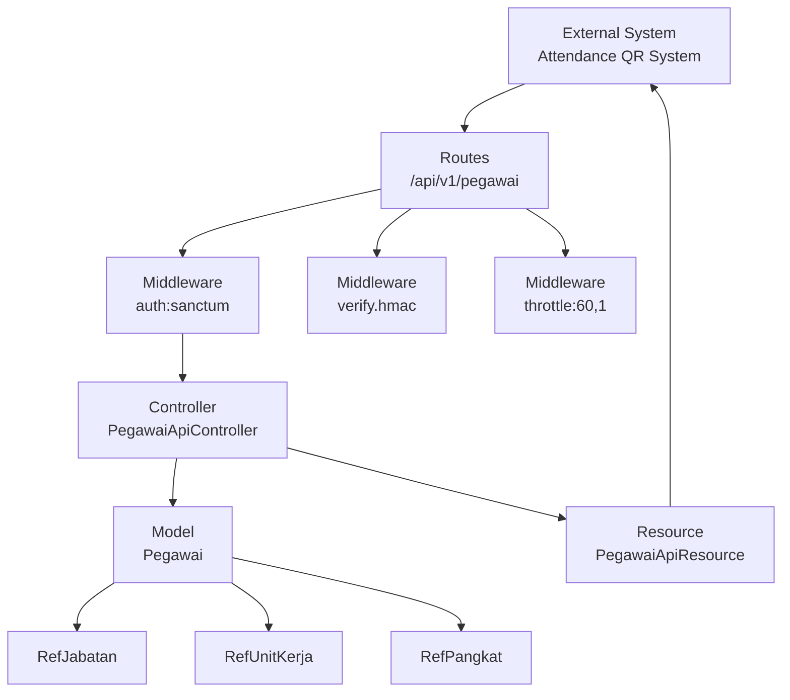
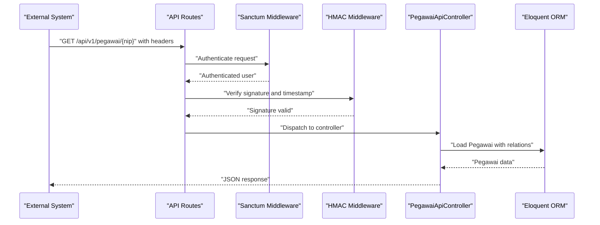
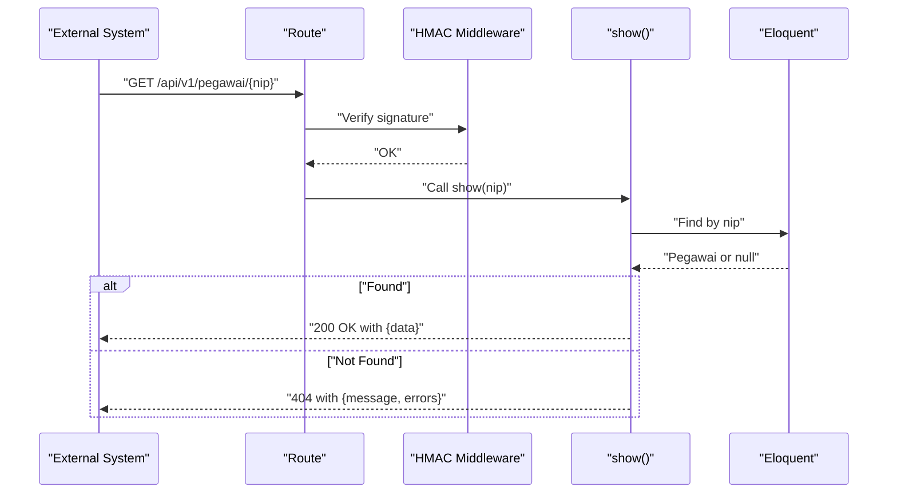
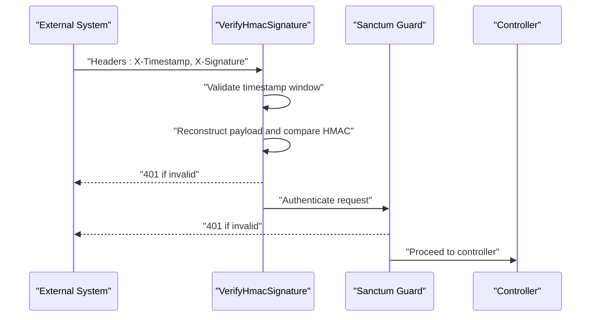
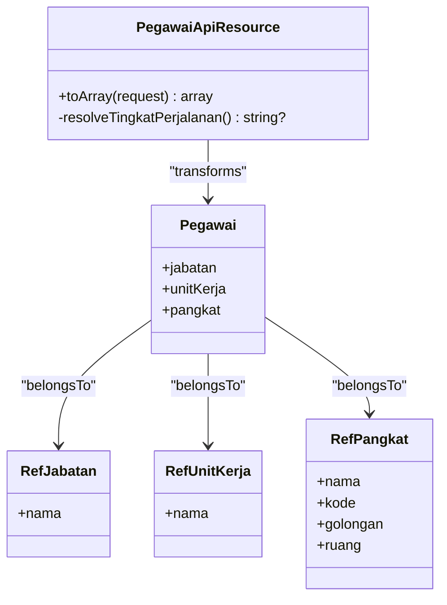
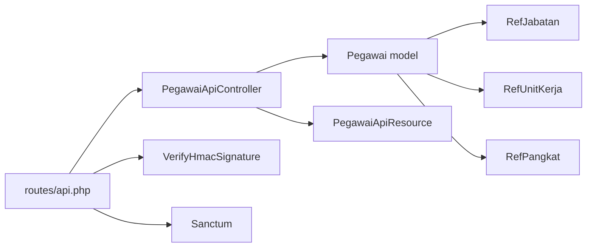

# Employee Management API

<cite>
**Referenced Files in This Document**
- [routes/api.php](file://routes/api.php)
- [app/Http/Controllers/Api/PegawaiApiController.php](file://app/Http/Controllers/Api/PegawaiApiController.php)
- [app/Http/Resources/PegawaiApiResource.php](file://app/Http/Resources/PegawaiApiResource.php)
- [app/Http/Middleware/VerifyHmacSignature.php](file://app/Http/Middleware/VerifyHmacSignature.php)
- [app/Models/Pegawai.php](file://app/Models/Pegawai.php)
- [app/Models/RefJabatan.php](file://app/Models/RefJabatan.php)
- [app/Models/RefUnitKerja.php](file://app/Models/RefUnitKerja.php)
- [app/Models/RefPangkat.php](file://app/Models/RefPangkat.php)
- [config/kepegawaian.php](file://config/kepegawaian.php)
- [config/sanctum.php](file://config/sanctum.php)
- [tests/Feature/Api/PegawaiApiTest.php](file://tests/Feature/Api/PegawaiApiTest.php)
</cite>

## Table of Contents
1. [Introduction](#introduction)
2. [Project Structure](#project-structure)
3. [Core Components](#core-components)
4. [Architecture Overview](#architecture-overview)
5. [Detailed Component Analysis](#detailed-component-analysis)
6. [Dependency Analysis](#dependency-analysis)
7. [Performance Considerations](#performance-considerations)
8. [Troubleshooting Guide](#troubleshooting-guide)
9. [Conclusion](#conclusion)
10. [Appendices](#appendices)

## Introduction
This document describes the Employee Management API endpoints designed for integration with external systems such as attendance QR systems. It covers:
- RESTful endpoints for single NIP lookup and batch/search retrieval
- Authentication and security layers using Laravel Sanctum tokens and HMAC signature verification
- Request and response schemas for employee data
- Validation rules for NIP format, batch sizes, and search parameters
- Error handling scenarios and practical integration examples

## Project Structure
The API is implemented under the API routing group with layered middleware for security and rate limiting. The controller orchestrates data retrieval and transformation, while the resource handles standardized JSON output. Supporting models define relationships to position, unit, and rank data.

**Diagram sources**
- [routes/api.php:21-31](file://routes/api.php#L21-L31)
- [app/Http/Controllers/Api/PegawaiApiController.php:20-112](file://app/Http/Controllers/Api/PegawaiApiController.php#L20-L112)
- [app/Http/Resources/PegawaiApiResource.php:19-61](file://app/Http/Resources/PegawaiApiResource.php#L19-L61)
- [app/Models/Pegawai.php:24-209](file://app/Models/Pegawai.php#L24-L209)
- [app/Models/RefJabatan.php:11-35](file://app/Models/RefJabatan.php#L11-L35)
- [app/Models/RefUnitKerja.php:12-49](file://app/Models/RefUnitKerja.php#L12-L49)
- [app/Models/RefPangkat.php:10-34](file://app/Models/RefPangkat.php#L10-L34)

**Section sources**
- [routes/api.php:21-31](file://routes/api.php#L21-L31)

## Core Components
- Routes: Define the base path, middleware stack, and endpoint patterns for single and batch/search retrieval.
- Controller: Implements business logic for single lookup, batch retrieval, and search with prioritization rules.
- Resource: Transforms model data into a normalized JSON structure suitable for external consumers.
- Middleware: Enforces Sanctum authentication and HMAC signature verification with timestamp validation.
- Models: Define relationships to position, unit, and rank data, and scopes for filtering.

**Section sources**
- [routes/api.php:21-31](file://routes/api.php#L21-L31)
- [app/Http/Controllers/Api/PegawaiApiController.php:20-112](file://app/Http/Controllers/Api/PegawaiApiController.php#L20-L112)
- [app/Http/Resources/PegawaiApiResource.php:19-61](file://app/Http/Resources/PegawaiApiResource.php#L19-L61)
- [app/Http/Middleware/VerifyHmacSignature.php:17-65](file://app/Http/Middleware/VerifyHmacSignature.php#L17-L65)
- [app/Models/Pegawai.php:24-209](file://app/Models/Pegawai.php#L24-L209)

## Architecture Overview
The API enforces four layers of security:
1. Transport security via HTTPS
2. Authentication via Laravel Sanctum tokens
3. Request integrity via HMAC-SHA256 signatures
4. DDoS protection via per-endpoint rate limiting

**Diagram sources**
- [routes/api.php:21-31](file://routes/api.php#L21-L31)
- [app/Http/Middleware/VerifyHmacSignature.php:25-62](file://app/Http/Middleware/VerifyHmacSignature.php#L25-L62)
- [app/Http/Controllers/Api/PegawaiApiController.php:27-41](file://app/Http/Controllers/Api/PegawaiApiController.php#L27-L41)

## Detailed Component Analysis

### Endpoint: GET /api/v1/pegawai/{nip}
- Purpose: Retrieve a single employee by 18-digit NIP.
- Path parameter: {nip} must match exactly 18 digits.
- Authentication: Requires a valid Sanctum token.
- Signature: Must pass HMAC verification with X-Timestamp and X-Signature headers.
- Response: JSON object containing a top-level data field with transformed employee data.
- Error handling:
  - 404 Not Found when NIP does not exist.
  - 401 Unauthorized for missing or invalid credentials.
  - 422 Unprocessable Entity for invalid NIP format.

**Diagram sources**
- [routes/api.php:26-27](file://routes/api.php#L26-L27)
- [app/Http/Middleware/VerifyHmacSignature.php:25-62](file://app/Http/Middleware/VerifyHmacSignature.php#L25-L62)
- [app/Http/Controllers/Api/PegawaiApiController.php:27-41](file://app/Http/Controllers/Api/PegawaiApiController.php#L27-L41)

**Section sources**
- [routes/api.php:26-27](file://routes/api.php#L26-L27)
- [app/Http/Controllers/Api/PegawaiApiController.php:27-41](file://app/Http/Controllers/Api/PegawaiApiController.php#L27-L41)
- [tests/Feature/Api/PegawaiApiTest.php:108-117](file://tests/Feature/Api/PegawaiApiTest.php#L108-L117)

### Endpoint: GET /api/v1/pegawai
- Purpose: Batch lookup by NIP array or search by name with optional status filter.
- Modes:
  - Batch lookup: nip[] parameter (array of up to 50 NIPs, each exactly 18 digits)
  - Search: search (name pattern) and status (default: aktif)
- Priority: If nip[] is present, batch mode takes precedence over search.
- Authentication: Requires a valid Sanctum token.
- Signature: Must pass HMAC verification with X-Timestamp and X-Signature headers.
- Response:
  - Batch mode: { data: [...], not_found: [...] }
  - Search mode: { data: [...], meta: { total, per_page } }
- Error handling:
  - 401 Unauthorized for missing or invalid credentials.
  - 422 Unprocessable Entity for invalid NIP format, exceeding batch limit, or malformed queries.

**Diagram sources**
- [app/Http/Controllers/Api/PegawaiApiController.php:52-110](file://app/Http/Controllers/Api/PegawaiApiController.php#L52-L110)
- [tests/Feature/Api/PegawaiApiTest.php:119-172](file://tests/Feature/Api/PegawaiApiTest.php#L119-L172)

**Section sources**
- [app/Http/Controllers/Api/PegawaiApiController.php:52-110](file://app/Http/Controllers/Api/PegawaiApiController.php#L52-L110)
- [tests/Feature/Api/PegawaiApiTest.php:119-172](file://tests/Feature/Api/PegawaiApiTest.php#L119-L172)

### Authentication and Security
- Sanctum Authentication:
  - Requires a valid Sanctum token in the Authorization header.
  - Configuration supports stateful domains and token prefix settings.
- HMAC Signature Verification:
  - Validates X-Timestamp and X-Signature headers.
  - Rejects requests older than 5 minutes (anti-replay).
  - Computes HMAC-SHA256 over METHOD:PATH:SORTED_QUERY:BODY_SHA256:TIMESTAMP using a shared secret.
  - Secret key is configured via ATTENDANCE_HMAC_SECRET in environment.
- Rate Limiting:
  - Throttle:60,1 applied to pegawai endpoints to prevent abuse.

**Diagram sources**
- [app/Http/Middleware/VerifyHmacSignature.php:25-62](file://app/Http/Middleware/VerifyHmacSignature.php#L25-L62)
- [config/sanctum.php:40-85](file://config/sanctum.php#L40-L85)
- [config/kepegawaian.php:15](file://config/kepegawaian.php#L15)

**Section sources**
- [app/Http/Middleware/VerifyHmacSignature.php:25-62](file://app/Http/Middleware/VerifyHmacSignature.php#L25-L62)
- [config/kepegawaian.php:15](file://config/kepegawaian.php#L15)
- [config/sanctum.php:40-85](file://config/sanctum.php#L40-L85)
- [routes/api.php:22](file://routes/api.php#L22)

### Response Schema: Employee Data
The API transforms internal model data into a standardized JSON structure for external consumption. The resource maps fields and enriches with derived values.

**Diagram sources**
- [app/Http/Resources/PegawaiApiResource.php:19-61](file://app/Http/Resources/PegawaiApiResource.php#L19-L61)
- [app/Models/Pegawai.php:67-82](file://app/Models/Pegawai.php#L67-L82)
- [app/Models/RefJabatan.php:18-24](file://app/Models/RefJabatan.php#L18-L24)
- [app/Models/RefUnitKerja.php:19-24](file://app/Models/RefUnitKerja.php#L19-L24)
- [app/Models/RefPangkat.php:17-24](file://app/Models/RefPangkat.php#L17-L24)

Field mapping summary:
- nip → nip
- nama_lengkap → nama
- jabatan → jabatan (from relation)
- unit_kerja → unit_kerja (from relation)
- status_pegawai → status_pegawai (enum value)
- foto → foto_url (asset URL if present)
- pangkat_nama → pangkat->nama
- pangkat_kode → pangkat->kode
- pangkat_golongan → formatted string "nama / golongan/ruang"
- tingkat_perjalanan → derived from golongan/ruang
- no_telepon → no_telepon
- email → email

**Section sources**
- [app/Http/Resources/PegawaiApiResource.php:26-44](file://app/Http/Resources/PegawaiApiResource.php#L26-L44)
- [app/Models/Pegawai.php:67-82](file://app/Models/Pegawai.php#L67-L82)

### Validation Rules
- Single lookup NIP:
  - Must be exactly 18 digits.
- Batch lookup nip[]:
  - Array with maximum 50 items.
  - Each item must be exactly 18 digits.
- Search:
  - Optional status defaults to aktif.
  - search parameter uses LIKE %term% against nama_lengkap.
  - Results limited to 20 entries; total count returned separately.

**Section sources**
- [routes/api.php:27](file://routes/api.php#L27)
- [app/Http/Controllers/Api/PegawaiApiController.php:69-72](file://app/Http/Controllers/Api/PegawaiApiController.php#L69-L72)
- [app/Http/Controllers/Api/PegawaiApiController.php:94-99](file://app/Http/Controllers/Api/PegawaiApiController.php#L94-L99)
- [tests/Feature/Api/PegawaiApiTest.php:133-143](file://tests/Feature/Api/PegawaiApiTest.php#L133-L143)
- [tests/Feature/Api/PegawaiApiTest.php:178-215](file://tests/Feature/Api/PegawaiApiTest.php#L178-L215)

### Error Handling
Common HTTP responses:
- 401 Unauthorized:
  - Missing or invalid Sanctum token.
  - Missing or invalid HMAC headers.
  - Tampered query string after signing.
  - Expired timestamp (> 5 minutes).
- 404 Not Found:
  - Single lookup NIP not found.
- 422 Unprocessable Entity:
  - Invalid NIP format (not 18 digits).
  - Too many NIPs in batch (> 50).
  - Malformed search parameters.

**Section sources**
- [app/Http/Middleware/VerifyHmacSignature.php:31-43](file://app/Http/Middleware/VerifyHmacSignature.php#L31-L43)
- [app/Http/Controllers/Api/PegawaiApiController.php:33-38](file://app/Http/Controllers/Api/PegawaiApiController.php#L33-L38)
- [tests/Feature/Api/PegawaiApiTest.php:37-81](file://tests/Feature/Api/PegawaiApiTest.php#L37-L81)
- [tests/Feature/Api/PegawaiApiTest.php:108-117](file://tests/Feature/Api/PegawaiApiTest.php#L108-L117)
- [tests/Feature/Api/PegawaiApiTest.php:133-143](file://tests/Feature/Api/PegawaiApiTest.php#L133-L143)
- [tests/Feature/Api/PegawaiApiTest.php:178-215](file://tests/Feature/Api/PegawaiApiTest.php#L178-L215)

### Practical Examples and Integration Patterns
- Single lookup:
  - Method: GET
  - Path: /api/v1/pegawai/{nip}
  - Headers: X-Timestamp, X-Signature, Accept: application/json
  - Body: none
  - Response: { data: { nip, nama, jabatan, unit_kerja, status_pegawai, foto_url, pangkat_nama, pangkat_kode, pangkat_golongan, tingkat_perjalanan, no_telepon, email } }
- Batch lookup:
  - Method: GET
  - Path: /api/v1/pegawai?nip[]=...
  - Query: nip[] (array of up to 50 NIPs, each 18 digits)
  - Response: { data: [...], not_found: [...] }
- Search:
  - Method: GET
  - Path: /api/v1/pegawai?search=...&status=aktif
  - Query: search (string), status (optional, default aktif)
  - Response: { data: [...], meta: { total, per_page: 20 } }

Integration tips:
- Always sign requests with HMAC-SHA256 using the shared secret and include X-Timestamp and X-Signature.
- Use Sanctum to obtain a valid token for authentication.
- Respect rate limits (60 requests per minute).
- Handle not_found in batch mode to reconcile absent NIPs.

**Section sources**
- [routes/api.php:26-30](file://routes/api.php#L26-L30)
- [app/Http/Controllers/Api/PegawaiApiController.php:52-110](file://app/Http/Controllers/Api/PegawaiApiController.php#L52-L110)
- [tests/Feature/Api/PegawaiApiTest.php:119-172](file://tests/Feature/Api/PegawaiApiTest.php#L119-L172)

## Dependency Analysis
The controller depends on the model and resource to assemble responses. The middleware enforces security policies before reaching the controller. Routes bind endpoints to controller actions with parameter constraints.

**Diagram sources**
- [routes/api.php:21-31](file://routes/api.php#L21-L31)
- [app/Http/Controllers/Api/PegawaiApiController.php:20-112](file://app/Http/Controllers/Api/PegawaiApiController.php#L20-L112)
- [app/Http/Resources/PegawaiApiResource.php:19-61](file://app/Http/Resources/PegawaiApiResource.php#L19-L61)
- [app/Models/Pegawai.php:24-209](file://app/Models/Pegawai.php#L24-L209)

**Section sources**
- [routes/api.php:21-31](file://routes/api.php#L21-L31)
- [app/Http/Controllers/Api/PegawaiApiController.php:20-112](file://app/Http/Controllers/Api/PegawaiApiController.php#L20-L112)

## Performance Considerations
- Eager loading: Controller loads related data (jabatan, unitKerja, pangkat) to avoid N+1 queries.
- Batch mode: Uses IN clause for efficient retrieval of multiple NIPs.
- Search limit: Caps results to 20 entries to control response size and latency.
- Rate limiting: Prevents abuse and ensures fair usage across clients.

[No sources needed since this section provides general guidance]

## Troubleshooting Guide
- 401 Unauthorized:
  - Confirm Sanctum token is included and valid.
  - Verify HMAC headers (X-Timestamp and X-Signature) are present and correct.
  - Ensure the shared secret matches the server configuration.
- 404 Not Found:
  - Validate the NIP format is exactly 18 digits.
  - Check that the NIP exists in the system.
- 422 Unprocessable Entity:
  - For batch mode: ensure nip[] length ≤ 50 and each NIP is 18 digits.
  - For search mode: verify query parameters and status values.
- Rate limit exceeded:
  - Implement client-side retry with exponential backoff.
  - Reduce request frequency or consolidate requests.

**Section sources**
- [app/Http/Middleware/VerifyHmacSignature.php:31-43](file://app/Http/Middleware/VerifyHmacSignature.php#L31-L43)
- [app/Http/Controllers/Api/PegawaiApiController.php:33-38](file://app/Http/Controllers/Api/PegawaiApiController.php#L33-L38)
- [tests/Feature/Api/PegawaiApiTest.php:37-81](file://tests/Feature/Api/PegawaiApiTest.php#L37-L81)
- [tests/Feature/Api/PegawaiApiTest.php:108-117](file://tests/Feature/Api/PegawaiApiTest.php#L108-L117)
- [tests/Feature/Api/PegawaiApiTest.php:133-143](file://tests/Feature/Api/PegawaiApiTest.php#L133-L143)
- [tests/Feature/Api/PegawaiApiTest.php:178-215](file://tests/Feature/Api/PegawaiApiTest.php#L178-L215)

## Conclusion
The Employee Management API provides secure, standardized endpoints for retrieving employee data. By combining Sanctum authentication with HMAC signature verification and strict validation rules, it ensures reliable integration with external systems such as attendance QR systems. Following the documented request/response schemas and error handling patterns will enable robust integrations.

[No sources needed since this section summarizes without analyzing specific files]

## Appendices

### Appendix A: Endpoint Reference
- GET /api/v1/pegawai/{nip}
  - Path parameter: nip (18 digits)
  - Query: none
  - Response: { data: Employee }
- GET /api/v1/pegawai
  - Query parameters:
    - nip[] (array, max 50, each 18 digits) — Batch mode
    - search (string) — Search mode
    - status (string, default aktif) — Search mode
  - Response (Batch): { data: [Employee...], not_found: [nip...] }
  - Response (Search): { data: [Employee...], meta: { total, per_page: 20 } }

**Section sources**
- [routes/api.php:26-30](file://routes/api.php#L26-L30)
- [app/Http/Controllers/Api/PegawaiApiController.php:52-110](file://app/Http/Controllers/Api/PegawaiApiController.php#L52-L110)

### Appendix B: HMAC Signing Payload Construction
- Construct payload: METHOD:PATH:SORTED_QUERY:BODY_SHA256:TIMESTAMP
- Sort query parameters by key.
- Compute SHA256 of request body (or empty string if none).
- Use shared secret from configuration.

**Section sources**
- [app/Http/Middleware/VerifyHmacSignature.php:46-55](file://app/Http/Middleware/VerifyHmacSignature.php#L46-L55)
- [config/kepegawaian.php:15](file://config/kepegawaian.php#L15)