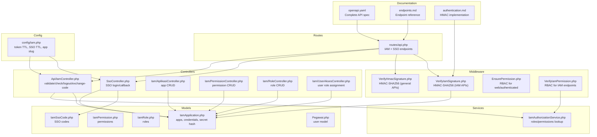
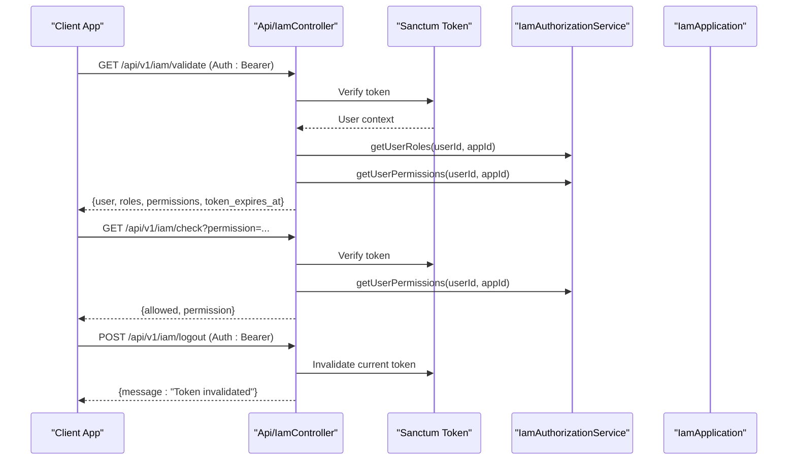
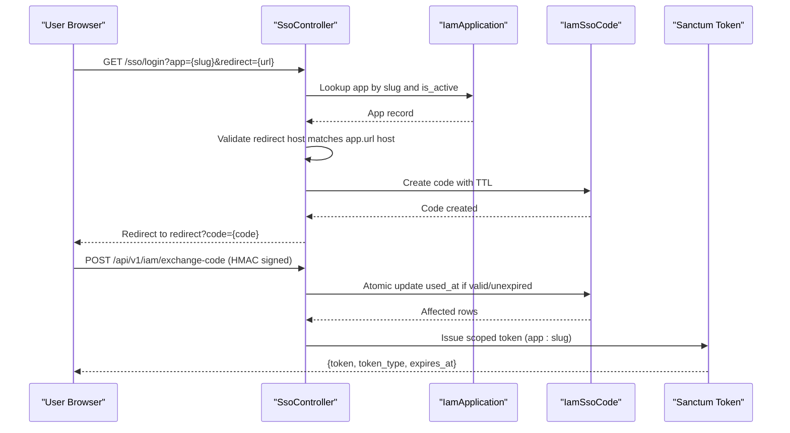
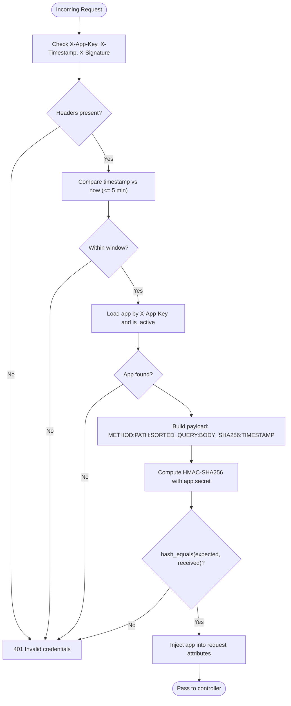
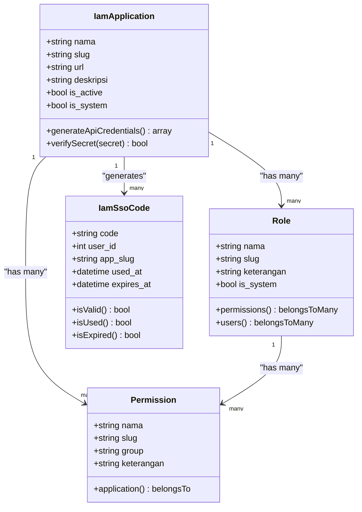
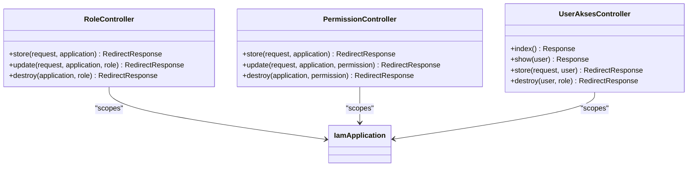
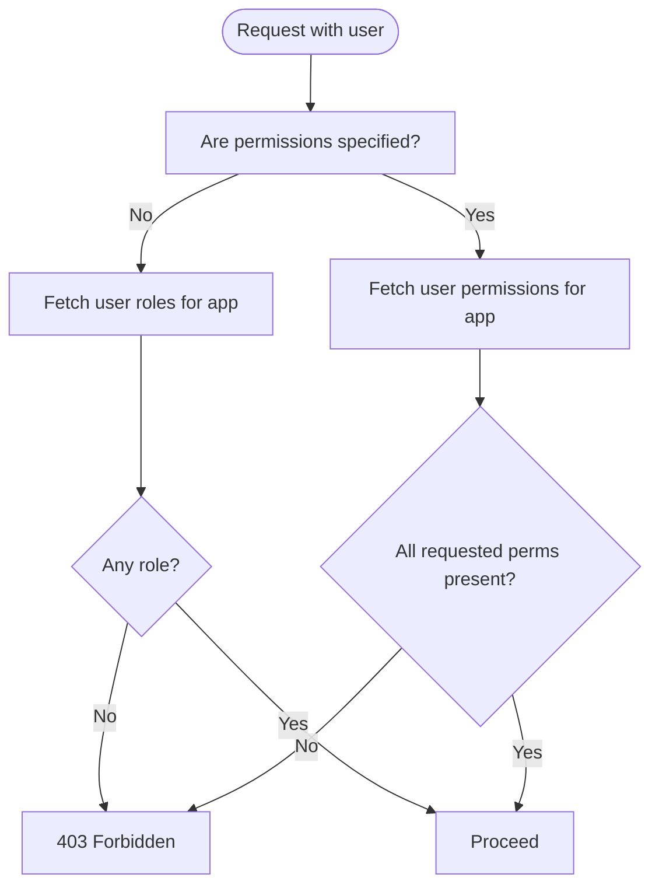
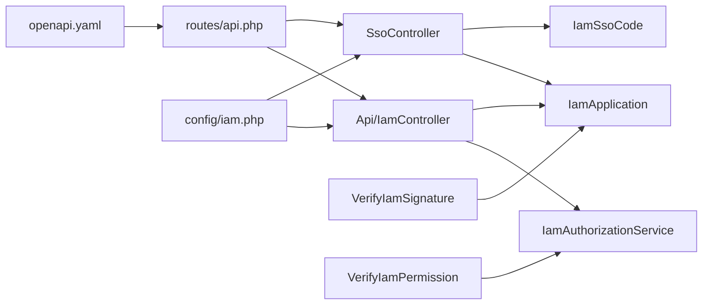
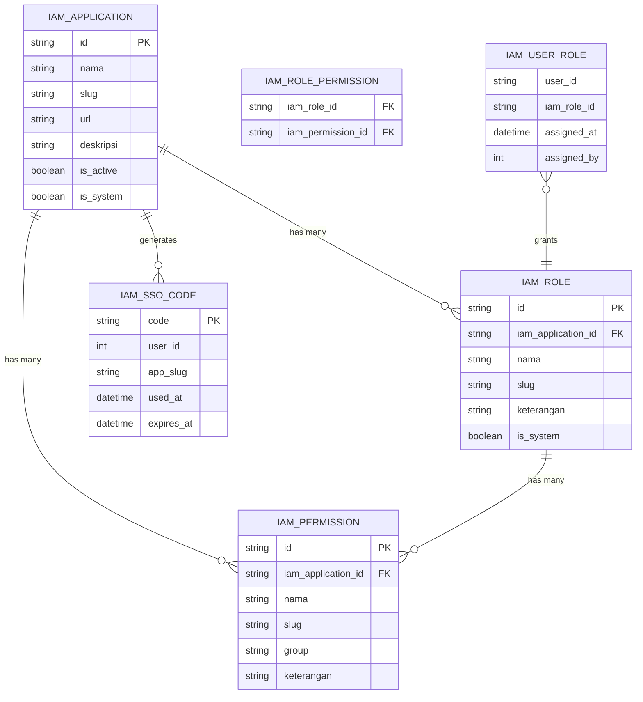

# IAM Authentication API

<cite>
**Referenced Files in This Document**
- [routes/api.php](file://routes/api.php)
- [config/iam.php](file://config/iam.php)
- [app/Http/Controllers/Api/IamController.php](file://app/Http/Controllers/Api/IamController.php)
- [app/Http/Controllers/SsoController.php](file://app/Http/Controllers/SsoController.php)
- [app/Http/Controllers/Iam/AplikasiController.php](file://app/Http/Controllers/Iam/AplikasiController.php)
- [app/Http/Controllers/Iam/PermissionController.php](file://app/Http/Controllers/Iam/PermissionController.php)
- [app/Http/Controllers/Iam/RoleController.php](file://app/Http/Controllers/Iam/RoleController.php)
- [app/Http/Controllers/Iam/UserAksesController.php](file://app/Http/Controllers/Iam/UserAksesController.php)
- [app/Http/Middleware/VerifyHmacSignature.php](file://app/Http/Middleware/VerifyHmacSignature.php)
- [app/Http/Middleware/VerifyIamSignature.php](file://app/Http/Middleware/VerifyIamSignature.php)
- [app/Http/Middleware/EnsurePermission.php](file://app/Http/Middleware/EnsurePermission.php)
- [app/Http/Middleware/VerifyIamPermission.php](file://app/Http/Middleware/VerifyIamPermission.php)
- [app/Services/IamAuthorizationService.php](file://app/Services/IamAuthorizationService.php)
- [app/Models/IamApplication.php](file://app/Models/IamApplication.php)
- [app/Models/IamPermission.php](file://app/Models/IamPermission.php)
- [app/Models/IamRole.php](file://app/Models/IamRole.php)
- [app/Models/IamSsoCode.php](file://app/Models/IamSsoCode.php)
- [app/Models/Pegawai.php](file://app/Models/Pegawai.php)
- [app/Http/Resources/IamValidateResource.php](file://app/Http/Resources/IamValidateResource.php)
- [docs/sso-api/openapi.yaml](file://docs/sso-api/openapi.yaml)
- [docs/sso-api/endpoints.md](file://docs/sso-api/endpoints.md)
- [docs/sso-api/authentication.md](file://docs/sso-api/authentication.md)
</cite>

## Update Summary
**Changes Made**
- Added comprehensive SSO API endpoints documentation with detailed request/response schemas
- Enhanced security requirements documentation including HMAC signature verification
- Added rate limiting policies for all API endpoints
- Included complete OpenAPI specification and integration examples
- Documented SSO flow with detailed sequence diagrams
- Added security considerations and troubleshooting guides

## Table of Contents
1. [Introduction](#introduction)
2. [Project Structure](#project-structure)
3. [Core Components](#core-components)
4. [Architecture Overview](#architecture-overview)
5. [Detailed Component Analysis](#detailed-component-analysis)
6. [SSO API Endpoints](#sso-api-endpoints)
7. [Security Implementation](#security-implementation)
8. [Rate Limiting Policies](#rate-limiting-policies)
9. [Integration Examples](#integration-examples)
10. [Dependency Analysis](#dependency-analysis)
11. [Performance Considerations](#performance-considerations)
12. [Troubleshooting Guide](#troubleshooting-guide)
13. [Conclusion](#conclusion)
14. [Appendices](#appendices)

## Introduction
This document describes the Identity and Access Management (IAM) Authentication API, focusing on:
- Application registration and credential lifecycle
- Token-based authentication and session-based single sign-on (SSO)
- Permission verification and role-based access control
- HMAC signature verification for secure API communication
- Complete SSO API endpoints with detailed schemas and integration patterns
- Security considerations and comprehensive troubleshooting

The IAM API is designed with layered security: HTTPS transport, Laravel Sanctum tokens for authenticated sessions, HMAC-SHA256 signatures for request integrity, and rate limiting to mitigate abuse. The system supports both server-to-server API integrations and browser-based SSO flows.

## Project Structure
IAM endpoints are primarily defined under the API routes and implemented by dedicated controllers. Middleware enforces signature verification and permission checks. Supporting models and services encapsulate application credentials, permissions, and authorization logic. The SSO system includes dedicated controllers for login flows and code exchange.



**Diagram sources**
- [routes/api.php:1-48](file://routes/api.php#L1-L48)
- [app/Http/Controllers/Api/IamController.php:1-91](file://app/Http/Controllers/Api/IamController.php#L1-L91)
- [app/Http/Controllers/SsoController.php:1-92](file://app/Http/Controllers/SsoController.php#L1-L92)
- [app/Http/Middleware/VerifyIamSignature.php:1-61](file://app/Http/Middleware/VerifyIamSignature.php#L1-L61)
- [app/Services/IamAuthorizationService.php:1-45](file://app/Services/IamAuthorizationService.php#L1-L45)
- [app/Models/IamApplication.php:1-100](file://app/Models/IamApplication.php#L1-L100)
- [app/Models/IamSsoCode.php:1-53](file://app/Models/IamSsoCode.php#L1-L53)
- [config/iam.php:1-9](file://config/iam.php#L1-L9)
- [docs/sso-api/openapi.yaml:1-466](file://docs/sso-api/openapi.yaml#L1-L466)
- [docs/sso-api/endpoints.md:1-240](file://docs/sso-api/endpoints.md#L1-L240)
- [docs/sso-api/authentication.md:1-111](file://docs/sso-api/authentication.md#L1-L111)

**Section sources**
- [routes/api.php:1-48](file://routes/api.php#L1-L48)
- [config/iam.php:1-9](file://config/iam.php#L1-L9)

## Core Components
- IAM API endpoints: validate, check, logout, exchange-code
- SSO gateway: login and callback for session-based SSO
- Application registry: CRUD for applications and credential lifecycle
- RBAC: roles, permissions, and user role assignments
- Authorization service: centralized roles/permissions retrieval
- Middleware: HMAC signature verification and permission enforcement
- Resources: standardized user info in validate responses
- SSO code management: secure one-time code generation and validation
- Complete API documentation: OpenAPI specification and integration guides

**Section sources**
- [app/Http/Controllers/Api/IamController.php:1-91](file://app/Http/Controllers/Api/IamController.php#L1-L91)
- [app/Http/Controllers/SsoController.php:1-92](file://app/Http/Controllers/SsoController.php#L1-L92)
- [app/Http/Controllers/Iam/AplikasiController.php:1-129](file://app/Http/Controllers/Iam/AplikasiController.php#L1-L129)
- [app/Services/IamAuthorizationService.php:1-45](file://app/Services/IamAuthorizationService.php#L1-L45)
- [app/Models/IamSsoCode.php:1-53](file://app/Models/IamSsoCode.php#L1-L53)
- [docs/sso-api/openapi.yaml:1-466](file://docs/sso-api/openapi.yaml#L1-L466)

## Architecture Overview
IAM integrates three primary flows:
- Application validation and permission inspection via token-authenticated endpoints
- Token exchange for session-based SSO using short-lived codes
- HMAC-secured API communications for external integrations



**Diagram sources**
- [routes/api.php:33-40](file://routes/api.php#L33-L40)
- [app/Http/Controllers/Api/IamController.php:17-51](file://app/Http/Controllers/Api/IamController.php#L17-L51)
- [app/Services/IamAuthorizationService.php:16-43](file://app/Services/IamAuthorizationService.php#L16-L43)
- [app/Http/Middleware/VerifyIamSignature.php:15-59](file://app/Http/Middleware/VerifyIamSignature.php#L15-L59)

## Detailed Component Analysis

### IAM API Endpoints
- Base path: /api/v1/iam
- Throttling: IAM endpoints use a stricter throttle than general APIs
- Authentication: Sanctum tokens for validate/check/logout; exchange-code requires HMAC signature verification

Endpoints:
- GET /validate
  - Requires: Bearer token
  - Returns: user profile, roles, permissions, and token expiry
- GET /check?permission=slug
  - Requires: Bearer token
  - Returns: allowed flag and requested permission
- POST /logout
  - Requires: Bearer token
  - Returns: token invalidation confirmation
- POST /exchange-code
  - Requires: HMAC signature (X-App-Key, X-Timestamp, X-Signature)
  - Validates SSO code and issues a scoped Sanctum token

Security layers:
- Transport: HTTPS
- Authentication: Sanctum tokens
- Integrity: HMAC-SHA256 signatures
- Rate limiting: per-endpoint throttles

**Section sources**
- [routes/api.php:33-47](file://routes/api.php#L33-L47)
- [app/Http/Controllers/Api/IamController.php:17-91](file://app/Http/Controllers/Api/IamController.php#L17-L91)
- [app/Http/Middleware/VerifyIamSignature.php:15-59](file://app/Http/Middleware/VerifyIamSignature.php#L15-L59)

### Session-Based Single Sign-On (SSO)
- Login endpoint validates app slug and redirect host, generates a short-lived code, and redirects back with the code
- Callback endpoint handles post-login redirection and code generation
- Exchange endpoint consumes the code atomically, verifies expiry and ownership, and issues a scoped token



**Diagram sources**
- [app/Http/Controllers/SsoController.php:15-92](file://app/Http/Controllers/SsoController.php#L15-L92)
- [app/Http/Controllers/Api/IamController.php:53-89](file://app/Http/Controllers/Api/IamController.php#L53-L89)
- [app/Models/IamApplication.php:12-100](file://app/Models/IamApplication.php#L12-L100)
- [app/Models/IamSsoCode.php:1-53](file://app/Models/IamSsoCode.php#L1-53)

**Section sources**
- [app/Http/Controllers/SsoController.php:15-92](file://app/Http/Controllers/SsoController.php#L15-L92)
- [app/Http/Controllers/Api/IamController.php:53-89](file://app/Http/Controllers/Api/IamController.php#L53-L89)

### HMAC Signature Verification
Two variants are implemented:

- General HMAC verification (for non-IAM endpoints):
  - Uses a shared secret from configuration
  - Payload: METHOD:PATH:SORTED_QUERY:BODY_SHA256:TIMESTAMP
  - Rejects timestamps older than 5 minutes
  - Enforced by route middleware

- IAM-specific HMAC verification:
  - Uses per-application API secret (encrypted at rest)
  - Payload identical to general variant
  - Enforces timestamp window and signature equality
  - Injects the authenticated application into the request attributes



**Diagram sources**
- [app/Http/Middleware/VerifyIamSignature.php:15-59](file://app/Http/Middleware/VerifyIamSignature.php#L15-L59)
- [app/Models/IamApplication.php:85-100](file://app/Models/IamApplication.php#L85-L100)

**Section sources**
- [app/Http/Middleware/VerifyHmacSignature.php:25-63](file://app/Http/Middleware/VerifyHmacSignature.php#L25-L63)
- [app/Http/Middleware/VerifyIamSignature.php:15-59](file://app/Http/Middleware/VerifyIamSignature.php#L15-L59)
- [app/Models/IamApplication.php:67-100](file://app/Models/IamApplication.php#L67-L100)

### Application Registration and Credentials
- Applications are registered with name, slug, URL, and optional description
- On creation or regeneration, a unique API key and encrypted API secret are generated
- The API secret is returned only once during creation and is never exposed again
- Applications can be activated/deactivated and edited (system apps are protected)



**Diagram sources**
- [app/Models/IamApplication.php:12-100](file://app/Models/IamApplication.php#L12-L100)
- [app/Models/IamPermission.php:9-26](file://app/Models/IamPermission.php#L9-L26)
- [app/Models/IamRole.php:13-58](file://app/Models/IamRole.php#L13-L58)
- [app/Models/IamSsoCode.php:9-53](file://app/Models/IamSsoCode.php#L9-L53)

**Section sources**
- [app/Http/Controllers/Iam/AplikasiController.php:41-107](file://app/Http/Controllers/Iam/AplikasiController.php#L41-L107)
- [app/Models/IamApplication.php:33-50](file://app/Models/IamApplication.php#L33-L50)

### Permission and Role Management
- Permissions are scoped to an application and grouped optionally
- Roles belong to an application and can be assigned multiple permissions
- Users receive roles that grant them permission slugs
- Controllers enforce IDOR (Insecure Direct Object Reference) by scoping updates/deletes to the owning application



**Diagram sources**
- [app/Http/Controllers/Iam/RoleController.php:14-63](file://app/Http/Controllers/Iam/RoleController.php#L14-L63)
- [app/Http/Controllers/Iam/PermissionController.php:14-50](file://app/Http/Controllers/Iam/PermissionController.php#L14-L50)
- [app/Http/Controllers/Iam/UserAksesController.php:16-48](file://app/Http/Controllers/Iam/UserAksesController.php#L16-L48)

**Section sources**
- [app/Http/Controllers/Iam/RoleController.php:14-63](file://app/Http/Controllers/Iam/RoleController.php#L14-L63)
- [app/Http/Controllers/Iam/PermissionController.php:14-50](file://app/Http/Controllers/Iam/PermissionController.php#L14-L50)
- [app/Http/Controllers/Iam/UserAksesController.php:16-48](file://app/Http/Controllers/Iam/UserAksesController.php#L16-L48)

### Authorization and Permission Enforcement
- EnsurePermission middleware enforces permissions for authenticated users in web contexts
- VerifyIamPermission middleware enforces permissions for IAM endpoints, caching the application lookup and validating user roles/permissions
- IamAuthorizationService centralizes permission and role retrieval for reuse



**Diagram sources**
- [app/Http/Middleware/VerifyIamPermission.php:16-51](file://app/Http/Middleware/VerifyIamPermission.php#L16-L51)
- [app/Services/IamAuthorizationService.php:16-43](file://app/Services/IamAuthorizationService.php#L16-L43)

**Section sources**
- [app/Http/Middleware/EnsurePermission.php:11-35](file://app/Http/Middleware/EnsurePermission.php#L11-L35)
- [app/Http/Middleware/VerifyIamPermission.php:16-51](file://app/Http/Middleware/VerifyIamPermission.php#L16-L51)
- [app/Services/IamAuthorizationService.php:16-43](file://app/Services/IamAuthorizationService.php#L16-L43)

## SSO API Endpoints

### SSO Login Entry Point
**Endpoint:** `GET /sso/login`

**Description:**
Redirect browser user to centralized kepegawaian-apps login page. This is a web route (not an API) - opened from browser, not called server-to-server.

**Query Parameters:**
| Parameter | Required | Description |
|-----------|----------|-------------|
| `app` | Yes | Application slug registered in IAM admin panel |
| `redirect` | Yes | Callback URL in your application (must have same domain as registered URL) |

**Flow:**
- If user **not logged in** to kepegawaian-apps → show login page, continue SSO after successful login
- If user **already logged in** → immediately generate one-time code and redirect to `redirect` URL

**Response:** HTTP redirect to `{redirect}?code={64_char_code}`

**Error Codes:**
- `404 Not Found` - Application slug not found or inactive
- `422 Unprocessable Entity` - Invalid redirect URL or redirect host mismatch

### Code Exchange Endpoint
**Endpoint:** `POST /api/v1/iam/exchange-code`

**Description:**
Exchange SSO one-time code for Sanctum Bearer token. Called **server-to-server** (not from browser).

**Rate Limit:** 10 requests per minute per IP

**Headers:**
```
X-App-Key: {api_key}
X-Timestamp: {unix_timestamp}
X-Signature: {hmac_sha256}
Content-Type: application/json
```

**Request Body:**
```json
{
  "code": "abc123...64chars"
}
```

**Response 200 - Success:**
```json
{
  "token": "1|AbCdEfGhIjKlMnOpQrStUvWxYz...",
  "token_type": "Bearer",
  "expires_at": 1745152256
}
```

**Response 400 - Invalid code:**
```json
{
  "message": "Invalid or expired code"
}
```

**Response 422 - Invalid format:**
```json
{
  "message": "The code field is required.",
  "errors": {
    "code": ["Code must be exactly 64 characters"]
  }
}
```

**Error Conditions:**
- Code already used (`400`)
- Code expired (>60 seconds) (`400`)
- Code belongs to different application (`400`)
- Invalid code format (not 64 characters) (`422`)

### Token Validation Endpoint
**Endpoint:** `GET /api/v1/iam/validate`

**Description:**
Validate Bearer token and retrieve user information along with roles & permissions for the calling application.

**Rate Limit:** 120 requests per minute per IP

**Headers:**
```
Authorization: Bearer {sanctum_token}
X-App-Key: {api_key}
X-Timestamp: {unix_timestamp}
X-Signature: {hmac_sha256}
```

**Response 200 - Success:**
```json
{
  "user": {
    "id": "01JRXXXXXXXXXXXXXXXXXXXXXXXX",
    "name": "Budi Santoso",
    "email": "budi@pa-penajam.go.id",
    "nip": "199107132020121003"
  },
  "roles": ["operator"],
  "permissions": ["absensi:create", "rekap:read"],
  "token_expires_at": 1745152256
}
```

**Response 401 - Invalid token:**
```json
{
  "message": "Unauthenticated."
}
```

**Important:** If user has no roles in the application, `roles` and `permissions` will be empty arrays - not a 403 error. Access decisions are made by the client application.

### Permission Check Endpoint
**Endpoint:** `GET /api/v1/iam/check`

**Description:**
Check if authenticated user has a specific permission for the calling application. Good for simple middleware that doesn't need all data from `/validate`.

**Rate Limit:** 120 requests per minute per IP

**Headers:** Same as `/validate`

**Query Parameters:**
| Parameter | Required | Description |
|-----------|----------|-------------|
| `permission` | Yes | Permission slug (format: `resource:action`) |

**Response 200:**
```json
{
  "allowed": true,
  "permission": "absensi:create"
}
```

**Note:** This endpoint uses the same cache as `/validate` - no additional database round-trips if called within 60 seconds of `/validate`.

### Logout Endpoint
**Endpoint:** `POST /api/v1/iam/logout`

**Description:**
Invalidate Sanctum token. After logout, the token cannot be used on any endpoint.

**Rate Limit:** 120 requests per minute per IP

**Headers:**
```
Authorization: Bearer {sanctum_token}
X-App-Key: {api_key}
X-Timestamp: {unix_timestamp}
X-Signature: {hmac_sha256}
```

**Response 200:**
```json
{
  "message": "Token invalidated"
}
```

**Important:** After calling this endpoint, client application must remove the token from server-side session and redirect user to login page.

**Section sources**
- [docs/sso-api/endpoints.md:1-240](file://docs/sso-api/endpoints.md#L1-L240)
- [docs/sso-api/openapi.yaml:206-466](file://docs/sso-api/openapi.yaml#L206-L466)
- [routes/api.php:21-47](file://routes/api.php#L21-L47)

## Security Implementation

### HMAC Signature Requirements
All API requests require three headers:
- `X-App-Key`: Your application API key
- `X-Timestamp`: Current Unix timestamp (seconds, not milliseconds)
- `X-Signature`: HMAC-SHA256 of the payload

**Timestamp Validation:**
- Requests with timestamps more than 5 minutes different from server time are rejected
- Ensure server time is synchronized with NTP

**Payload Construction:**
```
payload = METHOD + ":" + PATH + ":" + SORTED_QUERY + ":" + BODY_SHA256 + ":" + TIMESTAMP
```

**Component Details:**
- `METHOD`: HTTP method in uppercase (GET, POST, etc.)
- `PATH`: URL path without query string
- `SORTED_QUERY`: Query string with keys sorted alphabetically and URL-encoded
- `BODY_SHA256`: SHA-256 hash of raw request body
- `TIMESTAMP`: Value from `X-Timestamp` header

**Implementation Notes:**
- Sort query parameters before encoding: `ksort()` (PHP), `sorted()` (Python), `Object.keys().sort()` (JavaScript)
- Use lowercase hex output for HMAC (not base64)
- For requests without query string, `SORTED_QUERY` is an empty string (not omitted)
- For GET requests without body, `BODY_SHA256` is SHA-256 of empty string

### SSO Security Features
- **One-time codes:** Each SSO code is used only once and expires after 60 seconds
- **Cross-application protection:** Code validation ensures codes can only be used by the application they were generated for
- **Domain validation:** Redirect URLs must have the exact same host as the registered application URL
- **Atomic operations:** Code exchange uses atomic database updates to prevent race conditions
- **Scoped tokens:** Tokens are limited to specific applications using Laravel Sanctum's token abilities

### Error Handling
All authentication failures return generic "Invalid credentials" messages to prevent information disclosure:
- Invalid API key or inactive application
- Incorrect signature
- Expired timestamp (>5 minutes)
- Invalid or expired SSO code
- Malformed request format

**Section sources**
- [docs/sso-api/authentication.md:1-111](file://docs/sso-api/authentication.md#L1-L111)
- [app/Http/Middleware/VerifyIamSignature.php:15-59](file://app/Http/Middleware/VerifyIamSignature.php#L15-L59)
- [app/Http/Middleware/VerifyHmacSignature.php:25-63](file://app/Http/Middleware/VerifyHmacSignature.php#L25-L63)

## Rate Limiting Policies

### Endpoint-Specific Limits
| Endpoint | Method | Rate Limit | Purpose |
|----------|--------|------------|---------|
| `/sso/login` | GET | No limit | Web route - user interaction |
| `/api/v1/iam/exchange-code` | POST | 10 per minute | Sensitive SSO endpoint |
| `/api/v1/iam/validate` | GET | 120 per minute | User data endpoint |
| `/api/v1/iam/check` | GET | 120 per minute | Permission check endpoint |
| `/api/v1/iam/logout` | POST | 120 per minute | Token management |

### Throttling Implementation
- **Per-IP rate limiting:** Each client IP address is tracked separately
- **Time window:** 1-minute sliding windows for all limits
- **HTTP 429 responses:** Rate limit exceeded returns 429 Too Many Requests
- **Exceeding limits:** Subsequent requests are blocked until window resets

### Protection Against Abuse
- **SSO code limits:** 10 exchanges per minute prevents brute force attacks
- **Token endpoint limits:** 120 requests per minute protects against enumeration attacks
- **Timestamp validation:** Prevents replay attacks by rejecting old requests
- **HMAC validation:** Ensures request integrity and origin authentication

**Section sources**
- [routes/api.php:21-47](file://routes/api.php#L21-L47)
- [docs/sso-api/endpoints.md:231-240](file://docs/sso-api/endpoints.md#L231-L240)

## Integration Examples

### Server-to-Server Integration (Code Exchange)
```javascript
// Example: Exchange SSO code for token
const axios = require('axios');

const exchangeCode = async (code, apiKey, apiSecret) => {
  const timestamp = Math.floor(Date.now() / 1000);
  const payload = `POST:/api/v1/iam/exchange-code::${hash}: ${timestamp}`;
  const signature = hmacSHA256(payload, apiSecret);
  
  try {
    const response = await axios.post(
      'https://kepegawaian.pa-penajam.go.id/api/v1/iam/exchange-code',
      { code },
      {
        headers: {
          'X-App-Key': apiKey,
          'X-Timestamp': timestamp.toString(),
          'X-Signature': signature,
          'Content-Type': 'application/json'
        }
      }
    );
    
    return response.data; // { token, token_type, expires_at }
  } catch (error) {
    console.error('Exchange failed:', error.response?.data);
    throw error;
  }
};
```

### Browser-Based SSO Flow
```javascript
// Step 1: Redirect user to SSO login
function initiateSSOLogin(appSlug, redirectUrl) {
  const loginUrl = `https://kepegawaian.pa-penajam.go.id/sso/login?app=${appSlug}&redirect=${encodeURIComponent(redirectUrl)}`;
  window.location.href = loginUrl;
}

// Step 2: Handle callback with code
function handleSSOCallback() {
  const urlParams = new URLSearchParams(window.location.search);
  const code = urlParams.get('code');
  
  if (code) {
    // Exchange code for token (server-side)
    exchangeCode(code, API_KEY, API_SECRET)
      .then(tokenData => {
        // Store token securely
        sessionStorage.setItem('iam_token', tokenData.token);
        // Redirect to application
        window.location.href = '/dashboard';
      })
      .catch(error => {
        console.error('SSO failed:', error);
      });
  }
}
```

### Permission Checking
```javascript
// Check user permissions
const checkPermission = async (permission, token, apiKey, apiSecret) => {
  const timestamp = Math.floor(Date.now() / 1000);
  const payload = `GET:/api/v1/iam/check:permission=${encodeURIComponent(permission)}::${timestamp}`;
  const signature = hmacSHA256(payload, apiSecret);
  
  const response = await axios.get(
    `https://kepegawaian.pa-penajam.go.id/api/v1/iam/check?permission=${permission}`,
    {
      headers: {
        'Authorization': `Bearer ${token}`,
        'X-App-Key': apiKey,
        'X-Timestamp': timestamp.toString(),
        'X-Signature': signature
      }
    }
  );
  
  return response.data.allowed;
};
```

**Section sources**
- [docs/sso-api/authentication.md:76-111](file://docs/sso-api/authentication.md#L76-L111)
- [docs/sso-api/endpoints.md:42-240](file://docs/sso-api/endpoints.md#L42-L240)

## Dependency Analysis
IAM endpoints depend on:
- Sanctum tokens for authenticated sessions
- HMAC middleware for request integrity
- Application registry for per-app secrets and scopes
- Authorization service for permission/role resolution
- Config values for token and SSO code lifetimes
- SSO code database for secure code management



**Diagram sources**
- [routes/api.php:1-48](file://routes/api.php#L1-L48)
- [app/Http/Controllers/Api/IamController.php:15-91](file://app/Http/Controllers/Api/IamController.php#L15-L91)
- [app/Http/Controllers/SsoController.php:13-92](file://app/Http/Controllers/SsoController.php#L13-L92)
- [app/Http/Middleware/VerifyIamSignature.php:15-59](file://app/Http/Middleware/VerifyIamSignature.php#L15-L59)
- [app/Http/Middleware/VerifyIamPermission.php:14-53](file://app/Http/Middleware/VerifyIamPermission.php#L14-L53)
- [app/Services/IamAuthorizationService.php:7-44](file://app/Services/IamAuthorizationService.php#L7-L44)
- [app/Models/IamApplication.php:12-100](file://app/Models/IamApplication.php#L12-L100)
- [app/Models/IamSsoCode.php:9-53](file://app/Models/IamSsoCode.php#L9-L53)
- [config/iam.php:4-8](file://config/iam.php#L4-L8)
- [docs/sso-api/openapi.yaml:1-466](file://docs/sso-api/openapi.yaml#L1-L466)

**Section sources**
- [routes/api.php:1-48](file://routes/api.php#L1-L48)
- [app/Services/IamAuthorizationService.php:16-43](file://app/Services/IamAuthorizationService.php#L16-L43)
- [app/Models/IamApplication.php:12-100](file://app/Models/IamApplication.php#L12-L100)
- [app/Models/IamSsoCode.php:9-53](file://app/Models/IamSsoCode.php#L9-L53)

## Performance Considerations
- Use caching for application lookups in permission middleware to reduce database queries
- Keep permission lists minimal and leverage role-based aggregation
- Apply appropriate throttle rates per endpoint to prevent abuse
- Prefer scoped tokens with narrow audiences to reduce overhead
- Cache `/validate` responses in client applications for 60 seconds to reduce round-trips
- Use atomic operations for SSO code exchanges to prevent race conditions
- Implement proper connection pooling for database operations

## Troubleshooting Guide

### Common Authentication Errors
- **401 Invalid credentials**
  - Missing or incorrect HMAC headers (X-App-Key, X-Timestamp, X-Signature)
  - Expired timestamp (> 5 minutes)
  - Incorrect signature
  - Invalid or inactive API key
- **400 Invalid or expired code**
  - Code does not match, already used, or expired (>60 seconds)
  - Code belongs to different application
- **403 Forbidden**
  - User lacks required permissions or roles for the target application
- **422 Unprocessable Entity**
  - SSO redirect host mismatch or invalid app slug
  - Invalid code format (not exactly 64 characters)
- **429 Too Many Requests**
  - Rate limit exceeded for the endpoint
- **500 Service configuration error**
  - Shared HMAC secret not configured (for general APIs)

### SSO Flow Issues
- **Login redirect fails**
  - Verify application slug exists and is active
  - Ensure redirect URL has same host as registered application URL
  - Check browser cookies and session state
- **Code exchange fails**
  - Verify code was generated within last 60 seconds
  - Ensure code hasn't been used already
  - Check application credentials and HMAC signature
- **Token validation fails**
  - Verify token hasn't expired
  - Check token scope matches the application
  - Ensure proper Bearer token format

### Security and Compliance
- **Information disclosure prevention**
  - All authentication failures return generic messages
  - Never expose API secrets in client-side code
  - Use HTTPS-only for all API communications
- **Audit trail**
  - All authentication attempts are logged
  - Monitor for suspicious patterns and repeated failures
  - Regularly review access logs for unauthorized attempts

**Section sources**
- [app/Http/Middleware/VerifyHmacSignature.php:31-44](file://app/Http/Middleware/VerifyHmacSignature.php#L31-L44)
- [app/Http/Middleware/VerifyIamSignature.php:21-33](file://app/Http/Middleware/VerifyIamSignature.php#L21-L33)
- [app/Http/Controllers/Api/IamController.php:67-69](file://app/Http/Controllers/Api/IamController.php#L67-L69)
- [app/Http/Middleware/VerifyIamPermission.php:20-34](file://app/Http/Middleware/VerifyIamPermission.php#L20-L34)
- [app/Http/Controllers/SsoController.php:62-68](file://app/Http/Controllers/SsoController.php#L62-L68)
- [config/iam.php:5-8](file://config/iam.php#L5-L8)

## Conclusion
The IAM Authentication API provides a robust, layered security model combining Sanctum tokens, HMAC signatures, and strict RBAC. It supports application registration, permission verification, and secure SSO token exchange with comprehensive rate limiting and security features. The complete OpenAPI specification and integration examples enable seamless integration with various client applications. Proper configuration of secrets, timestamps, and throttling ensures secure and reliable operation across all deployment scenarios.

## Appendices

### Complete API Endpoints Reference

#### SSO Endpoints
- **GET** `/sso/login`
  - **Auth:** None (web route)
  - **Rate limit:** None
  - **Purpose:** SSO login entry point
  - **Response:** HTTP redirect with code parameter

- **POST** `/api/v1/iam/exchange-code`
  - **Auth:** HMAC only
  - **Rate limit:** 10 per minute
  - **Purpose:** Exchange SSO code for Bearer token
  - **Response:** Token with expiration

#### IAM Endpoints
- **GET** `/api/v1/iam/validate`
  - **Auth:** Bearer + HMAC
  - **Rate limit:** 120 per minute
  - **Purpose:** Validate token and fetch user info
  - **Response:** User, roles, permissions, token expiry

- **GET** `/api/v1/iam/check?permission=slug`
  - **Auth:** Bearer + HMAC
  - **Rate limit:** 120 per minute
  - **Purpose:** Check single permission
  - **Response:** Allowed flag and requested permission

- **POST** `/api/v1/iam/logout`
  - **Auth:** Bearer + HMAC
  - **Rate limit:** 120 per minute
  - **Purpose:** Invalidate current token
  - **Response:** Confirmation message

**Section sources**
- [routes/api.php:21-47](file://routes/api.php#L21-L47)
- [docs/sso-api/endpoints.md:231-240](file://docs/sso-api/endpoints.md#L231-L240)

### HMAC Signature Implementation

#### Required Headers
- `X-App-Key`: Application API key
- `X-Timestamp`: Unix timestamp (seconds)
- `X-Signature`: HMAC-SHA256 signature

#### Payload Construction
```
METHOD:PATH:SORTED_QUERY:BODY_SHA256:TIMESTAMP
```

#### Implementation Requirements
- **Timestamp window:** ±5 minutes
- **Query sorting:** Alphabetical order by key
- **Encoding:** URL-encode query parameters
- **Body hashing:** SHA-256 of raw request body
- **Output format:** Lowercase hex for HMAC

#### Error Messages
All authentication failures return:
```json
{
  "message": "Invalid credentials"
}
```

**Section sources**
- [docs/sso-api/authentication.md:15-111](file://docs/sso-api/authentication.md#L15-L111)
- [app/Http/Middleware/VerifyIamSignature.php:35-59](file://app/Http/Middleware/VerifyIamSignature.php#L35-L59)

### Configuration Options

#### IAM Configuration
- `IAM_TOKEN_TTL_HOURS`: Default token lifetime (default: 8 hours)
- `IAM_SSO_CODE_TTL`: SSO code lifetime in seconds (default: 60 seconds)
- `IAM_APP_SLUG`: Default application slug for internal checks

#### General Configuration
- `kepegawaian.secret_key`: Shared HMAC secret for general APIs
- Database configuration for application credentials and SSO codes

**Section sources**
- [config/iam.php:5-8](file://config/iam.php#L5-L8)
- [app/Http/Middleware/VerifyHmacSignature.php:40-44](file://app/Http/Middleware/VerifyHmacSignature.php#L40-L44)

### Data Models Overview



**Diagram sources**
- [app/Models/IamApplication.php:12-100](file://app/Models/IamApplication.php#L12-L100)
- [app/Models/IamPermission.php:9-26](file://app/Models/IamPermission.php#L9-L26)
- [app/Models/IamRole.php:13-58](file://app/Models/IamRole.php#L13-L58)
- [app/Models/IamSsoCode.php:9-53](file://app/Models/IamSsoCode.php#L9-L53)

### Security Best Practices

#### API Security
- Never store API secrets in client-side code
- Use HTTPS for all API communications
- Implement proper error handling without information disclosure
- Regularly rotate API secrets
- Monitor rate limit violations

#### SSO Security
- Validate redirect URLs against registered application domains
- Use atomic operations for code exchanges
- Implement proper session management
- Log all SSO activities for audit purposes

#### Performance Optimization
- Cache token validation results
- Use connection pooling for database operations
- Implement proper indexing on frequently queried fields
- Monitor API performance and adjust rate limits as needed

**Section sources**
- [docs/sso-api/authentication.md:102-111](file://docs/sso-api/authentication.md#L102-L111)
- [app/Http/Middleware/VerifyIamSignature.php:15-59](file://app/Http/Middleware/VerifyIamSignature.php#L15-L59)
- [app/Models/IamSsoCode.php:47-53](file://app/Models/IamSsoCode.php#L47-L53)