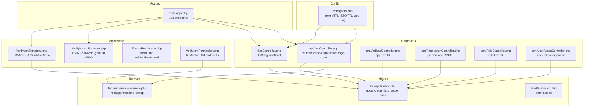
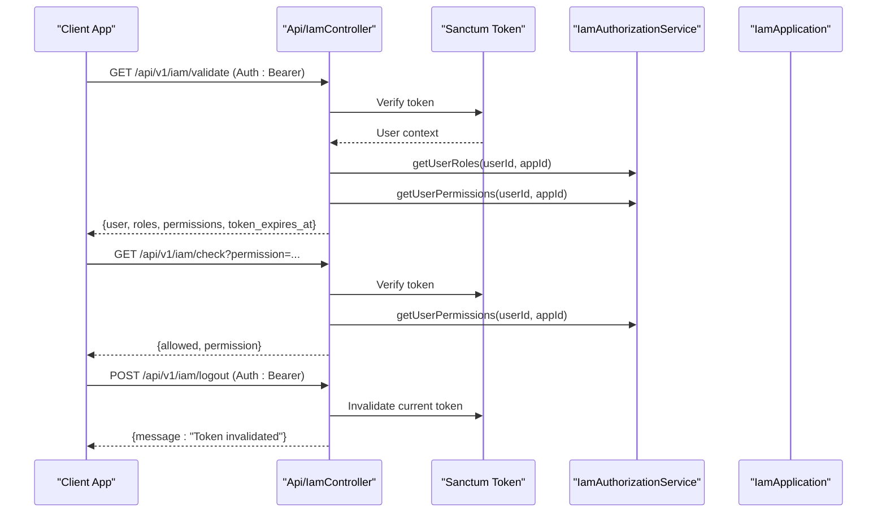
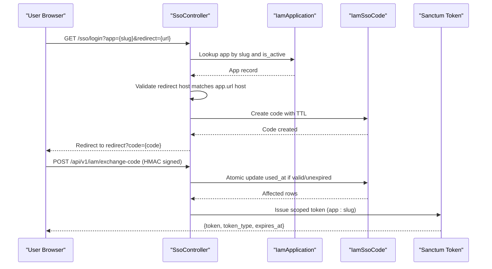
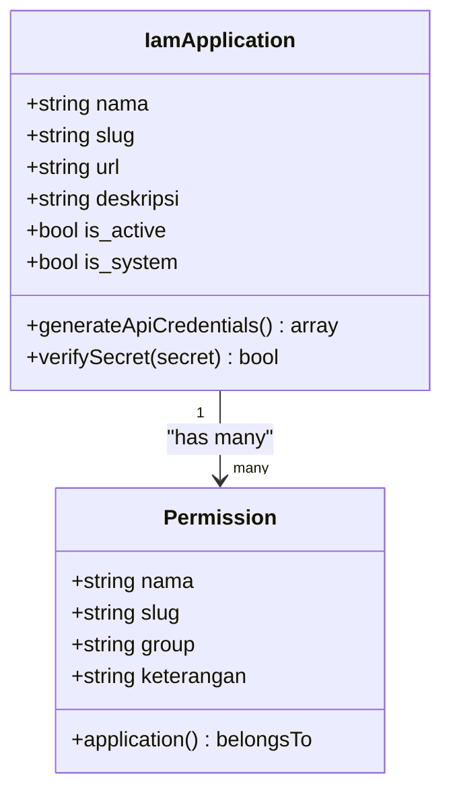
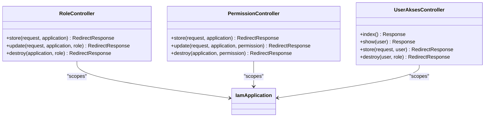
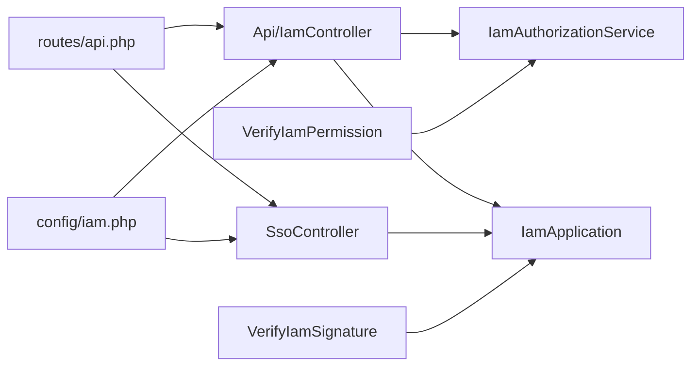
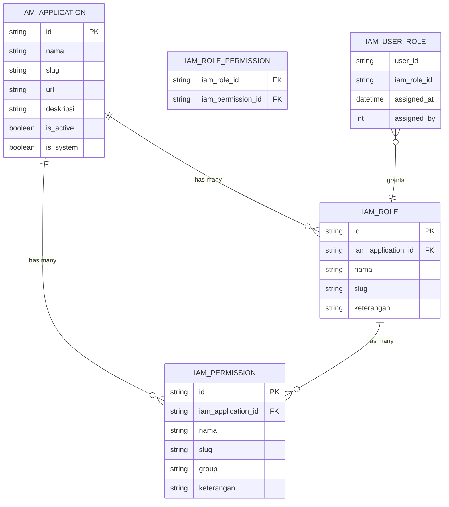

# IAM Authentication API

<cite>
**Referenced Files in This Document**
- [routes/api.php](file://routes/api.php)
- [config/iam.php](file://config/iam.php)
- [app/Http/Controllers/Api/IamController.php](file://app/Http/Controllers/Api/IamController.php)
- [app/Http/Controllers/SsoController.php](file://app/Http/Controllers/SsoController.php)
- [app/Http/Controllers/Iam/AplikasiController.php](file://app/Http/Controllers/Iam/AplikasiController.php)
- [app/Http/Controllers/Iam/PermissionController.php](file://app/Http/Controllers/Iam/PermissionController.php)
- [app/Http/Controllers/Iam/RoleController.php](file://app/Http/Controllers/Iam/RoleController.php)
- [app/Http/Controllers/Iam/UserAksesController.php](file://app/Http/Controllers/Iam/UserAksesController.php)
- [app/Http/Middleware/VerifyHmacSignature.php](file://app/Http/Middleware/VerifyHmacSignature.php)
- [app/Http/Middleware/VerifyIamSignature.php](file://app/Http/Middleware/VerifyIamSignature.php)
- [app/Http/Middleware/EnsurePermission.php](file://app/Http/Middleware/EnsurePermission.php)
- [app/Http/Middleware/VerifyIamPermission.php](file://app/Http/Middleware/VerifyIamPermission.php)
- [app/Services/IamAuthorizationService.php](file://app/Services/IamAuthorizationService.php)
- [app/Models/IamApplication.php](file://app/Models/IamApplication.php)
- [app/Models/IamPermission.php](file://app/Models/IamPermission.php)
- [app/Http/Resources/IamValidateResource.php](file://app/Http/Resources/IamValidateResource.php)
</cite>

## Table of Contents
1. [Introduction](#introduction)
2. [Project Structure](#project-structure)
3. [Core Components](#core-components)
4. [Architecture Overview](#architecture-overview)
5. [Detailed Component Analysis](#detailed-component-analysis)
6. [Dependency Analysis](#dependency-analysis)
7. [Performance Considerations](#performance-considerations)
8. [Troubleshooting Guide](#troubleshooting-guide)
9. [Conclusion](#conclusion)
10. [Appendices](#appendices)

## Introduction
This document describes the Identity and Access Management (IAM) Authentication API, focusing on:
- Application registration and credential lifecycle
- Token-based authentication and session-based single sign-on (SSO)
- Permission verification and role-based access control
- HMAC signature verification for secure API communication
- Request/response schemas and integration patterns
- Security considerations and troubleshooting

The IAM API is designed with layered security: HTTPS transport, Laravel Sanctum tokens for authenticated sessions, HMAC-SHA256 signatures for request integrity, and rate limiting to mitigate abuse.

## Project Structure
IAM endpoints are primarily defined under the API routes and implemented by dedicated controllers. Middleware enforces signature verification and permission checks. Supporting models and services encapsulate application credentials, permissions, and authorization logic.

**Diagram sources**
- [routes/api.php:1-48](file://routes/api.php#L1-L48)
- [app/Http/Controllers/Api/IamController.php:1-91](file://app/Http/Controllers/Api/IamController.php#L1-L91)
- [app/Http/Controllers/SsoController.php:1-85](file://app/Http/Controllers/SsoController.php#L1-L85)
- [app/Http/Controllers/Iam/AplikasiController.php:1-129](file://app/Http/Controllers/Iam/AplikasiController.php#L1-L129)
- [app/Http/Controllers/Iam/PermissionController.php:1-52](file://app/Http/Controllers/Iam/PermissionController.php#L1-L52)
- [app/Http/Controllers/Iam/RoleController.php:1-65](file://app/Http/Controllers/Iam/RoleController.php#L1-L65)
- [app/Http/Controllers/Iam/UserAksesController.php:1-50](file://app/Http/Controllers/Iam/UserAksesController.php#L1-L50)
- [app/Http/Middleware/VerifyHmacSignature.php:1-65](file://app/Http/Middleware/VerifyHmacSignature.php#L1-L65)
- [app/Http/Middleware/VerifyIamSignature.php:1-61](file://app/Http/Middleware/VerifyIamSignature.php#L1-L61)
- [app/Http/Middleware/EnsurePermission.php:1-37](file://app/Http/Middleware/EnsurePermission.php#L1-L37)
- [app/Http/Middleware/VerifyIamPermission.php:1-54](file://app/Http/Middleware/VerifyIamPermission.php#L1-L54)
- [app/Services/IamAuthorizationService.php:1-45](file://app/Services/IamAuthorizationService.php#L1-L45)
- [app/Models/IamApplication.php:1-96](file://app/Models/IamApplication.php#L1-L96)
- [app/Models/IamPermission.php:1-22](file://app/Models/IamPermission.php#L1-L22)
- [config/iam.php:1-9](file://config/iam.php#L1-L9)

**Section sources**
- [routes/api.php:1-48](file://routes/api.php#L1-L48)
- [config/iam.php:1-9](file://config/iam.php#L1-L9)

## Core Components
- IAM API endpoints: validate, check, logout, exchange-code
- SSO gateway: login and callback for session-based SSO
- Application registry: CRUD for applications and credential lifecycle
- RBAC: roles, permissions, and user role assignments
- Authorization service: centralized roles/permissions retrieval
- Middleware: HMAC signature verification and permission enforcement
- Resources: standardized user info in validate responses

**Section sources**
- [app/Http/Controllers/Api/IamController.php:1-91](file://app/Http/Controllers/Api/IamController.php#L1-L91)
- [app/Http/Controllers/SsoController.php:1-85](file://app/Http/Controllers/SsoController.php#L1-L85)
- [app/Http/Controllers/Iam/AplikasiController.php:1-129](file://app/Http/Controllers/Iam/AplikasiController.php#L1-L129)
- [app/Http/Controllers/Iam/PermissionController.php:1-52](file://app/Http/Controllers/Iam/PermissionController.php#L1-L52)
- [app/Http/Controllers/Iam/RoleController.php:1-65](file://app/Http/Controllers/Iam/RoleController.php#L1-L65)
- [app/Http/Controllers/Iam/UserAksesController.php:1-50](file://app/Http/Controllers/Iam/UserAksesController.php#L1-L50)
- [app/Services/IamAuthorizationService.php:1-45](file://app/Services/IamAuthorizationService.php#L1-L45)
- [app/Http/Resources/IamValidateResource.php:1-19](file://app/Http/Resources/IamValidateResource.php#L1-L19)

## Architecture Overview
IAM integrates three primary flows:
- Application validation and permission inspection via token-authenticated endpoints
- Token exchange for session-based SSO using short-lived codes
- HMAC-secured API communications for external integrations

**Diagram sources**
- [routes/api.php:33-40](file://routes/api.php#L33-L40)
- [app/Http/Controllers/Api/IamController.php:17-51](file://app/Http/Controllers/Api/IamController.php#L17-L51)
- [app/Services/IamAuthorizationService.php:16-43](file://app/Services/IamAuthorizationService.php#L16-L43)
- [app/Http/Middleware/VerifyIamSignature.php:15-59](file://app/Http/Middleware/VerifyIamSignature.php#L15-L59)

## Detailed Component Analysis

### IAM API Endpoints
- Base path: /api/v1/iam
- Throttling: IAM endpoints use a stricter throttle than general APIs
- Authentication: Sanctum tokens for validate/check/logout; exchange-code requires HMAC signature verification

Endpoints:
- GET /validate
  - Requires: Bearer token
  - Returns: user profile, roles, permissions, and token expiry
- GET /check?permission=slug
  - Requires: Bearer token
  - Returns: allowed flag and requested permission
- POST /logout
  - Requires: Bearer token
  - Returns: token invalidation confirmation
- POST /exchange-code
  - Requires: HMAC signature (X-App-Key, X-Timestamp, X-Signature)
  - Validates SSO code and issues a scoped Sanctum token

Security layers:
- Transport: HTTPS
- Authentication: Sanctum tokens
- Integrity: HMAC-SHA256 signatures
- Rate limiting: per-endpoint throttles

**Section sources**
- [routes/api.php:33-47](file://routes/api.php#L33-L47)
- [app/Http/Controllers/Api/IamController.php:17-91](file://app/Http/Controllers/Api/IamController.php#L17-L91)
- [app/Http/Middleware/VerifyIamSignature.php:15-59](file://app/Http/Middleware/VerifyIamSignature.php#L15-L59)

### Session-Based Single Sign-On (SSO)
- Login endpoint validates app slug and redirect host, generates a short-lived code, and redirects back with the code
- Callback endpoint handles post-login redirection and code generation
- Exchange endpoint consumes the code atomically, verifies expiry and ownership, and issues a scoped token

**Diagram sources**
- [app/Http/Controllers/SsoController.php:15-83](file://app/Http/Controllers/SsoController.php#L15-L83)
- [app/Http/Controllers/Api/IamController.php:53-89](file://app/Http/Controllers/Api/IamController.php#L53-L89)
- [app/Models/IamApplication.php:12-96](file://app/Models/IamApplication.php#L12-L96)

**Section sources**
- [app/Http/Controllers/SsoController.php:15-83](file://app/Http/Controllers/SsoController.php#L15-L83)
- [app/Http/Controllers/Api/IamController.php:53-89](file://app/Http/Controllers/Api/IamController.php#L53-L89)

### HMAC Signature Verification
Two variants are implemented:

- General HMAC verification (for non-IAM endpoints):
  - Uses a shared secret from configuration
  - Payload: METHOD:PATH:SORTED_QUERY:BODY_SHA256:TIMESTAMP
  - Rejects timestamps older than 5 minutes
  - Enforced by route middleware

- IAM-specific HMAC verification:
  - Uses per-application API secret (encrypted at rest)
  - Payload identical to general variant
  - Enforces timestamp window and signature equality
  - Injects the authenticated application into the request attributes

**Diagram sources**
- [app/Http/Middleware/VerifyIamSignature.php:15-59](file://app/Http/Middleware/VerifyIamSignature.php#L15-L59)
- [app/Models/IamApplication.php:85-94](file://app/Models/IamApplication.php#L85-L94)

**Section sources**
- [app/Http/Middleware/VerifyHmacSignature.php:25-63](file://app/Http/Middleware/VerifyHmacSignature.php#L25-L63)
- [app/Http/Middleware/VerifyIamSignature.php:15-59](file://app/Http/Middleware/VerifyIamSignature.php#L15-L59)
- [app/Models/IamApplication.php:67-94](file://app/Models/IamApplication.php#L67-L94)

### Application Registration and Credentials
- Applications are registered with name, slug, URL, and optional description
- On creation or regeneration, a unique API key and encrypted API secret are generated
- The API secret is returned only once during creation and is never exposed again
- Applications can be activated/deactivated and edited (system apps are protected)

**Diagram sources**
- [app/Models/IamApplication.php:12-96](file://app/Models/IamApplication.php#L12-L96)
- [app/Models/IamPermission.php:9-22](file://app/Models/IamPermission.php#L9-L22)

**Section sources**
- [app/Http/Controllers/Iam/AplikasiController.php:41-107](file://app/Http/Controllers/Iam/AplikasiController.php#L41-L107)
- [app/Models/IamApplication.php:33-50](file://app/Models/IamApplication.php#L33-L50)

### Permission and Role Management
- Permissions are scoped to an application and grouped optionally
- Roles belong to an application and can be assigned multiple permissions
- Users receive roles that grant them permission slugs
- Controllers enforce IDOR (Insecure Direct Object Reference) by scoping updates/deletes to the owning application

**Diagram sources**
- [app/Http/Controllers/Iam/RoleController.php:14-63](file://app/Http/Controllers/Iam/RoleController.php#L14-L63)
- [app/Http/Controllers/Iam/PermissionController.php:14-50](file://app/Http/Controllers/Iam/PermissionController.php#L14-L50)
- [app/Http/Controllers/Iam/UserAksesController.php:16-48](file://app/Http/Controllers/Iam/UserAksesController.php#L16-L48)

**Section sources**
- [app/Http/Controllers/Iam/RoleController.php:14-63](file://app/Http/Controllers/Iam/RoleController.php#L14-L63)
- [app/Http/Controllers/Iam/PermissionController.php:14-50](file://app/Http/Controllers/Iam/PermissionController.php#L14-L50)
- [app/Http/Controllers/Iam/UserAksesController.php:16-48](file://app/Http/Controllers/Iam/UserAksesController.php#L16-L48)

### Authorization and Permission Enforcement
- EnsurePermission middleware enforces permissions for authenticated users in web contexts
- VerifyIamPermission middleware enforces permissions for IAM endpoints, caching the application lookup and validating user roles/permissions
- IamAuthorizationService centralizes permission and role retrieval for reuse

**Diagram sources**
- [app/Http/Middleware/VerifyIamPermission.php:16-51](file://app/Http/Middleware/VerifyIamPermission.php#L16-L51)
- [app/Services/IamAuthorizationService.php:16-43](file://app/Services/IamAuthorizationService.php#L16-L43)

**Section sources**
- [app/Http/Middleware/EnsurePermission.php:11-35](file://app/Http/Middleware/EnsurePermission.php#L11-L35)
- [app/Http/Middleware/VerifyIamPermission.php:16-51](file://app/Http/Middleware/VerifyIamPermission.php#L16-L51)
- [app/Services/IamAuthorizationService.php:16-43](file://app/Services/IamAuthorizationService.php#L16-L43)

## Dependency Analysis
IAM endpoints depend on:
- Sanctum tokens for authenticated sessions
- HMAC middleware for request integrity
- Application registry for per-app secrets and scopes
- Authorization service for permission/role resolution
- Config values for token and SSO code lifetimes

**Diagram sources**
- [routes/api.php:1-48](file://routes/api.php#L1-L48)
- [app/Http/Controllers/Api/IamController.php:15-91](file://app/Http/Controllers/Api/IamController.php#L15-L91)
- [app/Http/Controllers/SsoController.php:13-85](file://app/Http/Controllers/SsoController.php#L13-L85)
- [app/Http/Middleware/VerifyIamSignature.php:15-59](file://app/Http/Middleware/VerifyIamSignature.php#L15-L59)
- [app/Http/Middleware/VerifyIamPermission.php:14-53](file://app/Http/Middleware/VerifyIamPermission.php#L14-L53)
- [app/Services/IamAuthorizationService.php:7-44](file://app/Services/IamAuthorizationService.php#L7-L44)
- [app/Models/IamApplication.php:12-96](file://app/Models/IamApplication.php#L12-L96)
- [config/iam.php:4-8](file://config/iam.php#L4-L8)

**Section sources**
- [routes/api.php:1-48](file://routes/api.php#L1-L48)
- [app/Services/IamAuthorizationService.php:16-43](file://app/Services/IamAuthorizationService.php#L16-L43)
- [app/Models/IamApplication.php:12-96](file://app/Models/IamApplication.php#L12-L96)

## Performance Considerations
- Use caching for application lookups in permission middleware to reduce database queries
- Keep permission lists minimal and leverage role-based aggregation
- Apply appropriate throttle rates per endpoint to prevent abuse
- Prefer scoped tokens with narrow audiences to reduce overhead

[No sources needed since this section provides general guidance]

## Troubleshooting Guide
Common errors and causes:
- 401 Invalid credentials
  - Missing or incorrect HMAC headers (X-App-Key, X-Timestamp, X-Signature)
  - Expired timestamp (> 5 minutes)
  - Incorrect signature
- 400 Invalid or expired code
  - Code does not match, already used, or expired
- 403 Forbidden
  - User lacks required permissions or roles for the target application
- 422 Unprocessable Entity
  - SSO redirect host mismatch or invalid app slug
- 500 Service configuration error
  - Shared HMAC secret not configured

Operational tips:
- Verify HMAC payload construction and sorting of query parameters
- Confirm application is active and credentials are correct
- Ensure redirect URL host matches the registered application URL host
- Check token TTL and SSO code TTL configuration values

**Section sources**
- [app/Http/Middleware/VerifyHmacSignature.php:31-44](file://app/Http/Middleware/VerifyHmacSignature.php#L31-L44)
- [app/Http/Middleware/VerifyIamSignature.php:21-33](file://app/Http/Middleware/VerifyIamSignature.php#L21-L33)
- [app/Http/Controllers/Api/IamController.php:67-69](file://app/Http/Controllers/Api/IamController.php#L67-L69)
- [app/Http/Middleware/VerifyIamPermission.php:20-34](file://app/Http/Middleware/VerifyIamPermission.php#L20-L34)
- [app/Http/Controllers/SsoController.php:62-68](file://app/Http/Controllers/SsoController.php#L62-L68)
- [config/iam.php:5-8](file://config/iam.php#L5-L8)

## Conclusion
The IAM Authentication API provides a robust, layered security model combining Sanctum tokens, HMAC signatures, and strict RBAC. It supports application registration, permission verification, and secure SSO token exchange. Proper configuration of secrets, timestamps, and throttling ensures secure and reliable operation.

[No sources needed since this section summarizes without analyzing specific files]

## Appendices

### API Endpoints Reference

- GET /api/v1/iam/validate
  - Auth: Bearer token
  - Response: user profile, roles, permissions, token_expires_at
- GET /api/v1/iam/check?permission=slug
  - Auth: Bearer token
  - Response: allowed flag and requested permission
- POST /api/v1/iam/logout
  - Auth: Bearer token
  - Response: token invalidation confirmation
- POST /api/v1/iam/exchange-code
  - Auth: HMAC signature (X-App-Key, X-Timestamp, X-Signature)
  - Body: code (64-character string)
  - Response: token, token_type, expires_at

**Section sources**
- [routes/api.php:33-47](file://routes/api.php#L33-L47)
- [app/Http/Controllers/Api/IamController.php:17-91](file://app/Http/Controllers/Api/IamController.php#L17-L91)

### Request Signing (HMAC) Specification
- Required headers:
  - X-App-Key: application API key
  - X-Timestamp: Unix timestamp
  - X-Signature: HMAC-SHA256 of the payload
- Payload format:
  - METHOD:PATH:SORTED_QUERY:BODY_SHA256:TIMESTAMP
  - Query parameters must be sorted by key before serialization
  - Body SHA256 is computed from raw request body
- Validation:
  - Reject if timestamp differs from now by more than 5 minutes
  - Reject if signature does not match computed HMAC
  - For IAM endpoints, the application secret is decrypted from the stored hash

**Section sources**
- [app/Http/Middleware/VerifyIamSignature.php:35-53](file://app/Http/Middleware/VerifyIamSignature.php#L35-L53)
- [app/Models/IamApplication.php:85-94](file://app/Models/IamApplication.php#L85-L94)

### Configuration Options
- IAM_TOKEN_TTL_HOURS: default token lifetime for SSO tokens
- IAM_SSO_CODE_TTL: default lifetime for SSO codes
- IAM_APP_SLUG: default application slug for internal permission checks

**Section sources**
- [config/iam.php:5-8](file://config/iam.php#L5-L8)

### Data Models Overview

**Diagram sources**
- [app/Models/IamApplication.php:12-96](file://app/Models/IamApplication.php#L12-L96)
- [app/Models/IamPermission.php:9-22](file://app/Models/IamPermission.php#L9-L22)