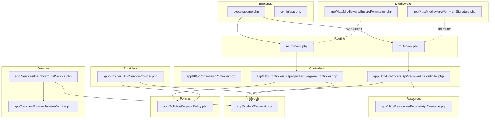
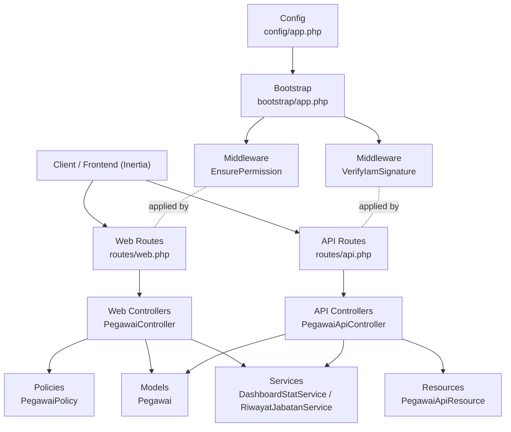
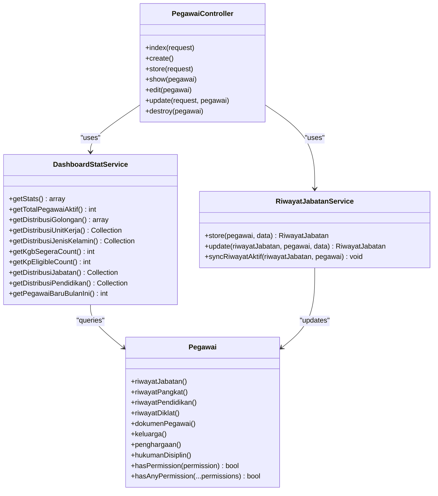
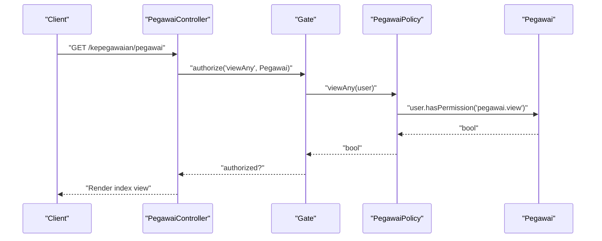
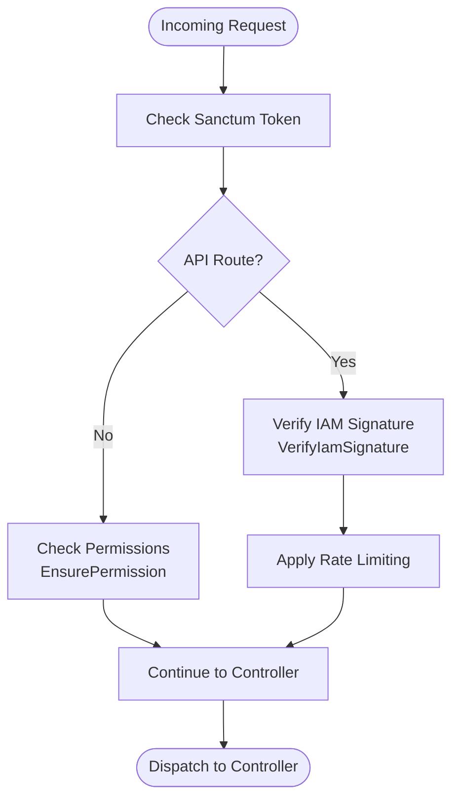
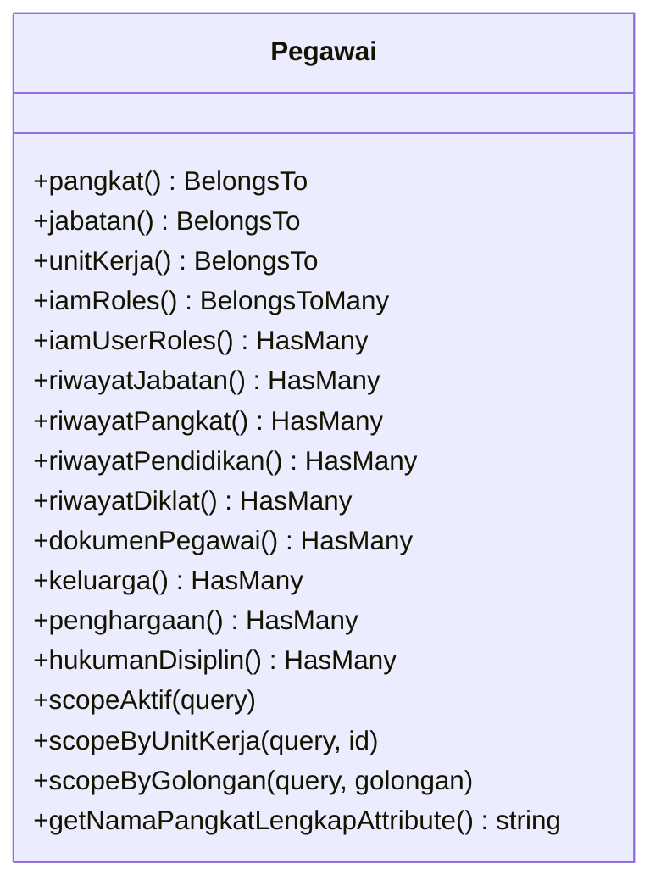
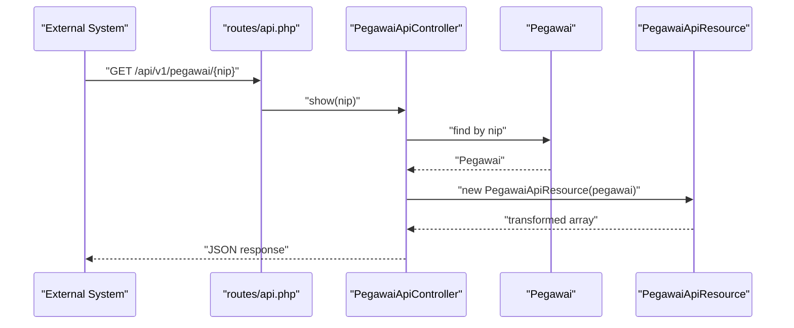
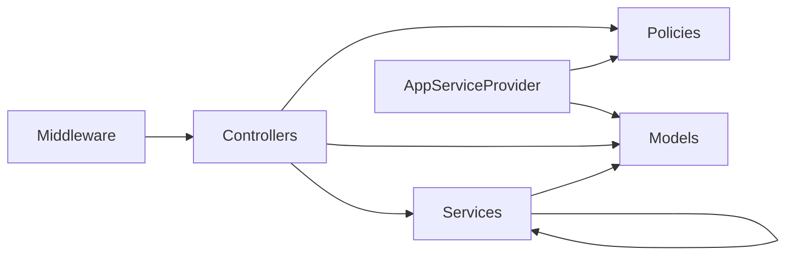

# Backend Architecture

<cite>
**Referenced Files in This Document**
- [bootstrap/app.php](file://bootstrap/app.php)
- [config/app.php](file://config/app.php)
- [routes/web.php](file://routes/web.php)
- [routes/api.php](file://routes/api.php)
- [app/Http/Controllers/Controller.php](file://app/Http/Controllers/Controller.php)
- [app/Http/Controllers/Kepegawaian/PegawaiController.php](file://app/Http/Controllers/Kepegawaian/PegawaiController.php)
- [app/Http/Controllers/Api/PegawaiApiController.php](file://app/Http/Controllers/Api/PegawaiApiController.php)
- [app/Http/Resources/PegawaiApiResource.php](file://app/Http/Resources/PegawaiApiResource.php)
- [app/Http/Middleware/EnsurePermission.php](file://app/Http/Middleware/EnsurePermission.php)
- [app/Http/Middleware/VerifyIamSignature.php](file://app/Http/Middleware/VerifyIamSignature.php)
- [app/Models/Pegawai.php](file://app/Models/Pegawai.php)
- [app/Policies/PegawaiPolicy.php](file://app/Policies/PegawaiPolicy.php)
- [app/Services/DashboardStatService.php](file://app/Services/DashboardStatService.php)
- [app/Services/RiwayatJabatanService.php](file://app/Services/RiwayatJabatanService.php)
- [app/Providers/AppServiceProvider.php](file://app/Providers/AppServiceProvider.php)
</cite>

## Table of Contents
1. [Introduction](#introduction)
2. [Project Structure](#project-structure)
3. [Core Components](#core-components)
4. [Architecture Overview](#architecture-overview)
5. [Detailed Component Analysis](#detailed-component-analysis)
6. [Dependency Analysis](#dependency-analysis)
7. [Performance Considerations](#performance-considerations)
8. [Troubleshooting Guide](#troubleshooting-guide)
9. [Conclusion](#conclusion)

## Introduction
This document explains the backend architecture of a Laravel-based Kepegawaian (Pegawai/HR) application. It focuses on the enhanced MVC structure with a service layer, and how controllers, models, services, and policies collaborate to separate concerns, enforce permissions, and encapsulate business logic. The architecture integrates middleware for authentication, authorization, and signature verification, and leverages Inertia for a modern frontend experience. Bootstrapping, configuration management, and extensibility patterns are documented to guide both backend developers and Laravel specialists.

## Project Structure
The backend follows Laravel conventions with a layered architecture:
- Routing: HTTP routes define entry points for web and API traffic.
- Controllers: Handle requests, delegate to services, and render views/resources.
- Models: Define Eloquent relationships, scopes, enums, and casts.
- Services: Encapsulate business logic and coordinate domain operations.
- Policies: Enforce authorization decisions per model/resource.
- Middleware: Apply cross-cutting concerns like permission checks and signature verification.
- Providers: Register bindings and configure defaults during application bootstrap.

**Diagram sources**
- [bootstrap/app.php:11-35](file://bootstrap/app.php#L11-L35)
- [config/app.php:1-127](file://config/app.php#L1-L127)
- [routes/web.php:1-139](file://routes/web.php#L1-L139)
- [routes/api.php:1-48](file://routes/api.php#L1-L48)
- [app/Http/Controllers/Controller.php:1-11](file://app/Http/Controllers/Controller.php#L1-L11)
- [app/Http/Controllers/Kepegawaian/PegawaiController.php:1-224](file://app/Http/Controllers/Kepegawaian/PegawaiController.php#L1-L224)
- [app/Http/Controllers/Api/PegawaiApiController.php:1-112](file://app/Http/Controllers/Api/PegawaiApiController.php#L1-L112)
- [app/Http/Resources/PegawaiApiResource.php:1-61](file://app/Http/Resources/PegawaiApiResource.php#L1-L61)
- [app/Models/Pegawai.php:1-209](file://app/Models/Pegawai.php#L1-L209)
- [app/Policies/PegawaiPolicy.php:1-34](file://app/Policies/PegawaiPolicy.php#L1-L34)
- [app/Services/DashboardStatService.php:1-148](file://app/Services/DashboardStatService.php#L1-L148)
- [app/Services/RiwayatJabatanService.php:1-50](file://app/Services/RiwayatJabatanService.php#L1-L50)
- [app/Http/Middleware/EnsurePermission.php:1-37](file://app/Http/Middleware/EnsurePermission.php#L1-L37)
- [app/Http/Middleware/VerifyIamSignature.php:1-61](file://app/Http/Middleware/VerifyIamSignature.php#L1-L61)
- [app/Providers/AppServiceProvider.php:1-60](file://app/Providers/AppServiceProvider.php#L1-L60)

**Section sources**
- [bootstrap/app.php:11-35](file://bootstrap/app.php#L11-L35)
- [config/app.php:1-127](file://config/app.php#L1-L127)
- [routes/web.php:1-139](file://routes/web.php#L1-L139)
- [routes/api.php:1-48](file://routes/api.php#L1-L48)

## Core Components
- Controllers: Thin orchestration points that authorize actions, gather inputs, and render responses. Examples:
  - Web controller for employee CRUD and self-service: [PegawaiController:1-224](file://app/Http/Controllers/Kepegawaian/PegawaiController.php#L1-L224)
  - API controller for external integrations: [PegawaiApiController:1-112](file://app/Http/Controllers/Api/PegawaiApiController.php#L1-L112)
- Models: Eloquent models with relationships, scopes, enums, and casts:
  - Employee model with IAM-aware permissions and rich relations: [Pegawai:1-209](file://app/Models/Pegawai.php#L1-L209)
- Services: Business logic encapsulation:
  - Dashboard statistics aggregation: [DashboardStatService:1-148](file://app/Services/DashboardStatService.php#L1-L148)
  - Riwayat Jabatan synchronization and transactional updates: [RiwayatJabatanService:1-50](file://app/Services/RiwayatJabatanService.php#L1-L50)
- Policies: Authorization decisions per model:
  - Employee policy enforcing permission slugs: [PegawaiPolicy:1-34](file://app/Policies/PegawaiPolicy.php#L1-L34)
- Middleware: Cross-cutting concerns:
  - Permission enforcement: [EnsurePermission:1-37](file://app/Http/Middleware/EnsurePermission.php#L1-L37)
  - IAM signature verification: [VerifyIamSignature:1-61](file://app/Http/Middleware/VerifyIamSignature.php#L1-L61)
- Providers: Application bootstrap and policy registration:
  - Global defaults and policy binding: [AppServiceProvider:1-60](file://app/Providers/AppServiceProvider.php#L1-L60)

**Section sources**
- [app/Http/Controllers/Kepegawaian/PegawaiController.php:1-224](file://app/Http/Controllers/Kepegawaian/PegawaiController.php#L1-L224)
- [app/Http/Controllers/Api/PegawaiApiController.php:1-112](file://app/Http/Controllers/Api/PegawaiApiController.php#L1-L112)
- [app/Models/Pegawai.php:1-209](file://app/Models/Pegawai.php#L1-L209)
- [app/Services/DashboardStatService.php:1-148](file://app/Services/DashboardStatService.php#L1-L148)
- [app/Services/RiwayatJabatanService.php:1-50](file://app/Services/RiwayatJabatanService.php#L1-L50)
- [app/Policies/PegawaiPolicy.php:1-34](file://app/Policies/PegawaiPolicy.php#L1-L34)
- [app/Http/Middleware/EnsurePermission.php:1-37](file://app/Http/Middleware/EnsurePermission.php#L1-L37)
- [app/Http/Middleware/VerifyIamSignature.php:1-61](file://app/Http/Middleware/VerifyIamSignature.php#L1-L61)
- [app/Providers/AppServiceProvider.php:1-60](file://app/Providers/AppServiceProvider.php#L1-L60)

## Architecture Overview
The backend employs a layered MVC pattern enhanced with a service layer:
- Controllers handle HTTP requests and delegate to services for business logic.
- Services encapsulate domain operations, ensuring testability and reuse.
- Models represent domain entities with rich relationships and scopes.
- Policies centralize authorization logic.
- Middleware enforces authentication, permissions, and signature verification.
- Routing defines entry points and applies middleware stacks.

**Diagram sources**
- [routes/web.php:1-139](file://routes/web.php#L1-L139)
- [routes/api.php:1-48](file://routes/api.php#L1-L48)
- [app/Http/Controllers/Kepegawaian/PegawaiController.php:1-224](file://app/Http/Controllers/Kepegawaian/PegawaiController.php#L1-L224)
- [app/Http/Controllers/Api/PegawaiApiController.php:1-112](file://app/Http/Controllers/Api/PegawaiApiController.php#L1-L112)
- [app/Http/Resources/PegawaiApiResource.php:1-61](file://app/Http/Resources/PegawaiApiResource.php#L1-L61)
- [app/Models/Pegawai.php:1-209](file://app/Models/Pegawai.php#L1-L209)
- [app/Policies/PegawaiPolicy.php:1-34](file://app/Policies/PegawaiPolicy.php#L1-L34)
- [app/Services/DashboardStatService.php:1-148](file://app/Services/DashboardStatService.php#L1-L148)
- [app/Services/RiwayatJabatanService.php:1-50](file://app/Services/RiwayatJabatanService.php#L1-L50)
- [app/Http/Middleware/EnsurePermission.php:1-37](file://app/Http/Middleware/EnsurePermission.php#L1-L37)
- [app/Http/Middleware/VerifyIamSignature.php:1-61](file://app/Http/Middleware/VerifyIamSignature.php#L1-L61)
- [bootstrap/app.php:11-35](file://bootstrap/app.php#L11-L35)
- [config/app.php:1-127](file://config/app.php#L1-L127)

## Detailed Component Analysis

### MVC Enhanced with Service Layer
- Controllers remain thin, delegating business logic to services.
- Services encapsulate complex operations, coordinate transactions, and interact with models.
- Example: [RiwayatJabatanService:1-50](file://app/Services/RiwayatJabatanService.php#L1-L50) performs transactional writes and synchronizes active records.
- Example: [DashboardStatService:1-148](file://app/Services/DashboardStatService.php#L1-L148) aggregates statistics using model queries and service composition.

**Diagram sources**
- [app/Http/Controllers/Kepegawaian/PegawaiController.php:1-224](file://app/Http/Controllers/Kepegawaian/PegawaiController.php#L1-L224)
- [app/Services/DashboardStatService.php:1-148](file://app/Services/DashboardStatService.php#L1-L148)
- [app/Services/RiwayatJabatanService.php:1-50](file://app/Services/RiwayatJabatanService.php#L1-L50)
- [app/Models/Pegawai.php:1-209](file://app/Models/Pegawai.php#L1-L209)

**Section sources**
- [app/Services/DashboardStatService.php:1-148](file://app/Services/DashboardStatService.php#L1-L148)
- [app/Services/RiwayatJabatanService.php:1-50](file://app/Services/RiwayatJabatanService.php#L1-L50)
- [app/Models/Pegawai.php:1-209](file://app/Models/Pegawai.php#L1-L209)

### Controllers, Policies, and Authorization Flow
- Controllers authorize actions using policies and gates.
- Example: [PegawaiController:1-224](file://app/Http/Controllers/Kepegawaian/PegawaiController.php#L1-L224) uses gate authorization for each action.
- Policy: [PegawaiPolicy:1-34](file://app/Policies/PegawaiPolicy.php#L1-L34) enforces permission slugs like pegawai.view, pegawai.create, etc.
- Provider binds policy to model: [AppServiceProvider](file://app/Providers/AppServiceProvider.php#L30).

**Diagram sources**
- [app/Http/Controllers/Kepegawaian/PegawaiController.php:30-32](file://app/Http/Controllers/Kepegawaian/PegawaiController.php#L30-L32)
- [app/Policies/PegawaiPolicy.php:9-12](file://app/Policies/PegawaiPolicy.php#L9-L12)
- [app/Models/Pegawai.php:141-146](file://app/Models/Pegawai.php#L141-L146)
- [app/Providers/AppServiceProvider.php:30](file://app/Providers/AppServiceProvider.php#L30)

**Section sources**
- [app/Http/Controllers/Kepegawaian/PegawaiController.php:30-32](file://app/Http/Controllers/Kepegawaian/PegawaiController.php#L30-L32)
- [app/Policies/PegawaiPolicy.php:1-34](file://app/Policies/PegawaiPolicy.php#L1-L34)
- [app/Providers/AppServiceProvider.php:30](file://app/Providers/AppServiceProvider.php#L30)

### Middleware Integration and Security
- Web routes apply permission middleware to enforce IAM permissions: [EnsurePermission:1-37](file://app/Http/Middleware/EnsurePermission.php#L1-L37).
- API routes apply signature verification and throttling:
  - [VerifyIamSignature:1-61](file://app/Http/Middleware/VerifyIamSignature.php#L1-L61) validates HMAC signatures and injects application context.
  - [routes/api.php:22-47](file://routes/api.php#L22-L47) applies auth:sanctum, signature verification, and rate limiting.

**Diagram sources**
- [routes/api.php:22-47](file://routes/api.php#L22-L47)
- [app/Http/Middleware/EnsurePermission.php:11-35](file://app/Http/Middleware/EnsurePermission.php#L11-L35)
- [app/Http/Middleware/VerifyIamSignature.php:15-59](file://app/Http/Middleware/VerifyIamSignature.php#L15-L59)

**Section sources**
- [routes/api.php:22-47](file://routes/api.php#L22-L47)
- [app/Http/Middleware/EnsurePermission.php:1-37](file://app/Http/Middleware/EnsurePermission.php#L1-L37)
- [app/Http/Middleware/VerifyIamSignature.php:1-61](file://app/Http/Middleware/VerifyIamSignature.php#L1-L61)

### Model Relationships and Scopes
- The [Pegawai:1-209](file://app/Models/Pegawai.php#L1-L209) model defines:
  - Reference relationships (pangkat, jabatan, unitKerja)
  - IAM role/permission relationships (iamRoles, iamUserRoles)
  - Domain relationships (riwayatJabatan, riwayatPangkat, riwayatPendidikan, riwayatDiklat, dokumenPegawai, keluarga, penghargaan, hukumanDisiplin)
  - Scopes (aktif, byUnitKerja, byGolongan)
  - Accessors (e.g., nama pangkat lengkap)
- These relationships enable controllers and services to compose complex queries efficiently.

**Diagram sources**
- [app/Models/Pegawai.php:67-137](file://app/Models/Pegawai.php#L67-L137)
- [app/Models/Pegawai.php:179-196](file://app/Models/Pegawai.php#L179-L196)
- [app/Models/Pegawai.php:200-208](file://app/Models/Pegawai.php#L200-L208)

**Section sources**
- [app/Models/Pegawai.php:1-209](file://app/Models/Pegawai.php#L1-L209)

### API Resource Transformation
- The [PegawaiApiController:1-112](file://app/Http/Controllers/Api/PegawaiApiController.php#L1-L112) returns JSON responses.
- Data transformation is handled by [PegawaiApiResource:1-61](file://app/Http/Resources/PegawaiApiResource.php#L1-L61), which maps model attributes to API-friendly keys and computes derived fields.

**Diagram sources**
- [routes/api.php:26-31](file://routes/api.php#L26-L31)
- [app/Http/Controllers/Api/PegawaiApiController.php:27-41](file://app/Http/Controllers/Api/PegawaiApiController.php#L27-L41)
- [app/Http/Resources/PegawaiApiResource.php:26-44](file://app/Http/Resources/PegawaiApiResource.php#L26-L44)

**Section sources**
- [app/Http/Controllers/Api/PegawaiApiController.php:1-112](file://app/Http/Controllers/Api/PegawaiApiController.php#L1-L112)
- [app/Http/Resources/PegawaiApiResource.php:1-61](file://app/Http/Resources/PegawaiApiResource.php#L1-L61)

### Practical Examples

- Service Layer Implementation
  - Transactional riwayat jabatan updates and synchronization:
    - [RiwayatJabatanService::store:11-22](file://app/Services/RiwayatJabatanService.php#L11-L22)
    - [RiwayatJabatanService::update:24-35](file://app/Services/RiwayatJabatanService.php#L24-L35)
    - [RiwayatJabatanService::syncRiwayatAktif:37-48](file://app/Services/RiwayatJabatanService.php#L37-L48)
  - Dashboard statistics aggregation:
    - [DashboardStatService::getStats:16-29](file://app/Services/DashboardStatService.php#L16-L29)
    - [DashboardStatService::getDistribusiUnitKerja:62-73](file://app/Services/DashboardStatService.php#L62-L73)

- Model Relationships
  - Employee to reference and domain relationships:
    - [Pegawai::pangkat:69-72](file://app/Models/Pegawai.php#L69-L72)
    - [Pegawai::riwayatJabatan:99-102](file://app/Models/Pegawai.php#L99-L102)
    - [Pegawai::riwayatPangkat:114-117](file://app/Models/Pegawai.php#L114-L117)
    - [Pegawai::riwayatPendidikan:109-112](file://app/Models/Pegawai.php#L109-L112)
    - [Pegawai::riwayatDiklat:104-107](file://app/Models/Pegawai.php#L104-L107)
    - [Pegawai::dokumenPegawai:119-122](file://app/Models/Pegawai.php#L119-L122)
    - [Pegawai::keluarga:124-127](file://app/Models/Pegawai.php#L124-L127)
    - [Pegawai::penghargaan:129-132](file://app/Models/Pegawai.php#L129-L132)
    - [Pegawai::hukumanDisiplin:134-137](file://app/Models/Pegawai.php#L134-L137)

- Middleware Usage
  - Web routes with permission middleware:
    - [routes/web.php:35-63](file://routes/web.php#L35-L63) groups protected under auth, verified, and iam.permission.
  - API routes with signature and throttling:
    - [routes/api.php:22-31](file://routes/api.php#L22-L31) protects NIP lookup with auth:sanctum, verify.hmac, throttle.

**Section sources**
- [app/Services/RiwayatJabatanService.php:11-48](file://app/Services/RiwayatJabatanService.php#L11-L48)
- [app/Services/DashboardStatService.php:16-73](file://app/Services/DashboardStatService.php#L16-L73)
- [app/Models/Pegawai.php:69-137](file://app/Models/Pegawai.php#L69-L137)
- [routes/web.php:35-63](file://routes/web.php#L35-L63)
- [routes/api.php:22-31](file://routes/api.php#L22-L31)

## Dependency Analysis
- Controllers depend on:
  - Policies for authorization
  - Models for data access and relationships
  - Services for business logic
- Services depend on:
  - Models and database transactions
  - Other services for composed operations
- Middleware depends on:
  - Route definitions and request context
- Providers bind:
  - Policies to models
  - Global defaults (date serialization, password rules, DB safety)

**Diagram sources**
- [app/Http/Controllers/Kepegawaian/PegawaiController.php:1-224](file://app/Http/Controllers/Kepegawaian/PegawaiController.php#L1-L224)
- [app/Policies/PegawaiPolicy.php:1-34](file://app/Policies/PegawaiPolicy.php#L1-L34)
- [app/Models/Pegawai.php:1-209](file://app/Models/Pegawai.php#L1-L209)
- [app/Services/DashboardStatService.php:1-148](file://app/Services/DashboardStatService.php#L1-L148)
- [app/Services/RiwayatJabatanService.php:1-50](file://app/Services/RiwayatJabatanService.php#L1-L50)
- [app/Http/Middleware/EnsurePermission.php:1-37](file://app/Http/Middleware/EnsurePermission.php#L1-L37)
- [app/Http/Middleware/VerifyIamSignature.php:1-61](file://app/Http/Middleware/VerifyIamSignature.php#L1-L61)
- [app/Providers/AppServiceProvider.php:1-60](file://app/Providers/AppServiceProvider.php#L1-L60)

**Section sources**
- [app/Providers/AppServiceProvider.php:30](file://app/Providers/AppServiceProvider.php#L30)

## Performance Considerations
- Use eager loading to prevent N+1 queries in controllers and services.
- Prefer scopes and filtered queries to minimize data transfer.
- Batch operations and transaction boundaries in services reduce contention.
- Resource transformation keeps payloads lean for API consumers.
- Middleware ordering affects latency; keep signature verification and throttling close to route definitions.

## Troubleshooting Guide
- Unauthorized Access
  - Ensure routes are grouped under required middleware and that users have IAM permissions.
  - Verify policy bindings in provider and permission slugs used by the user.
  - References:
    - [routes/web.php:35-63](file://routes/web.php#L35-L63)
    - [app/Policies/PegawaiPolicy.php:9-12](file://app/Policies/PegawaiPolicy.php#L9-L12)
    - [app/Providers/AppServiceProvider.php:30](file://app/Providers/AppServiceProvider.php#L30)
- Signature Validation Failures
  - Confirm X-App-Key, X-Timestamp, and X-Signature headers are present and within the allowed window.
  - Validate application secret hashing and decryption.
  - References:
    - [app/Http/Middleware/VerifyIamSignature.php:15-59](file://app/Http/Middleware/VerifyIamSignature.php#L15-L59)
    - [routes/api.php:34-47](file://routes/api.php#L34-L47)
- API Response Issues
  - Validate resource transformation and ensure related data is loaded.
  - References:
    - [app/Http/Resources/PegawaiApiResource.php:26-44](file://app/Http/Resources/PegawaiApiResource.php#L26-L44)
    - [app/Http/Controllers/Api/PegawaiApiController.php:27-41](file://app/Http/Controllers/Api/PegawaiApiController.php#L27-L41)

**Section sources**
- [routes/web.php:35-63](file://routes/web.php#L35-L63)
- [app/Policies/PegawaiPolicy.php:9-12](file://app/Policies/PegawaiPolicy.php#L9-L12)
- [app/Providers/AppServiceProvider.php:30](file://app/Providers/AppServiceProvider.php#L30)
- [app/Http/Middleware/VerifyIamSignature.php:15-59](file://app/Http/Middleware/VerifyIamSignature.php#L15-L59)
- [routes/api.php:34-47](file://routes/api.php#L34-L47)
- [app/Http/Resources/PegawaiApiResource.php:26-44](file://app/Http/Resources/PegawaiApiResource.php#L26-L44)
- [app/Http/Controllers/Api/PegawaiApiController.php:27-41](file://app/Http/Controllers/Api/PegawaiApiController.php#L27-L41)

## Conclusion
The backend architecture blends Laravel’s MVC with a robust service layer, clear authorization via policies, and middleware-driven security. Controllers remain thin, services encapsulate business logic, and models provide rich relationships and scopes. Middleware ensures secure and rate-limited access for both web and API surfaces. This design promotes maintainability, testability, and scalability while aligning with modern Laravel practices.