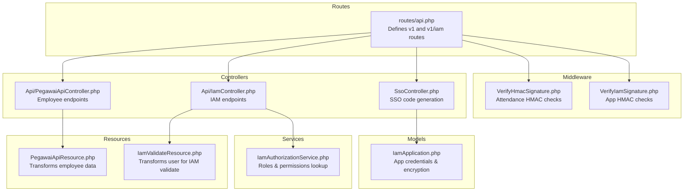
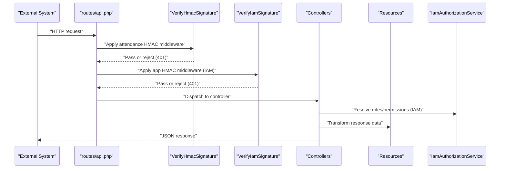
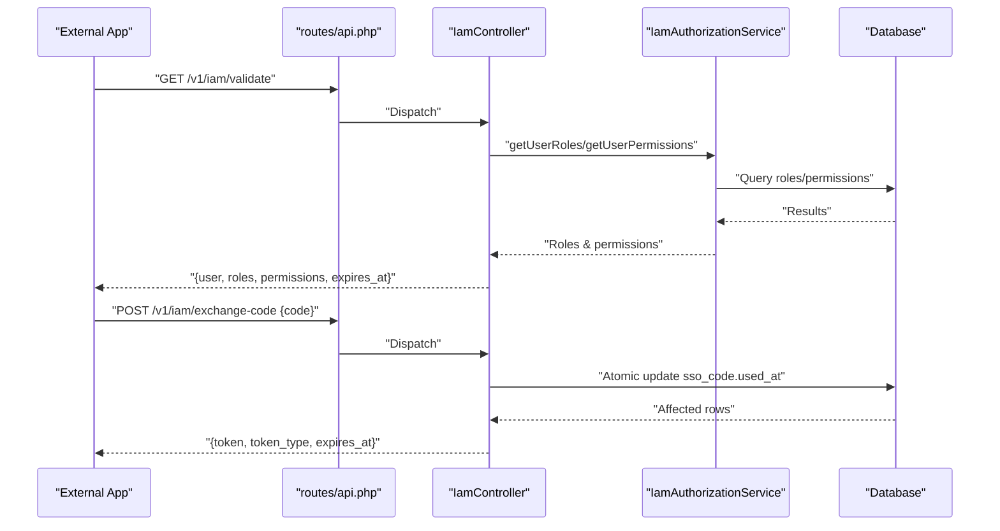
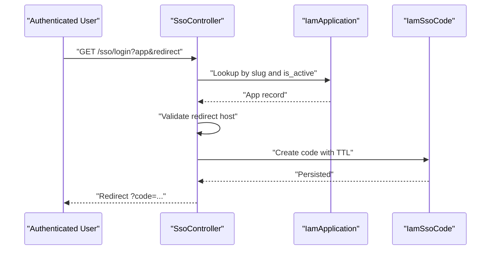
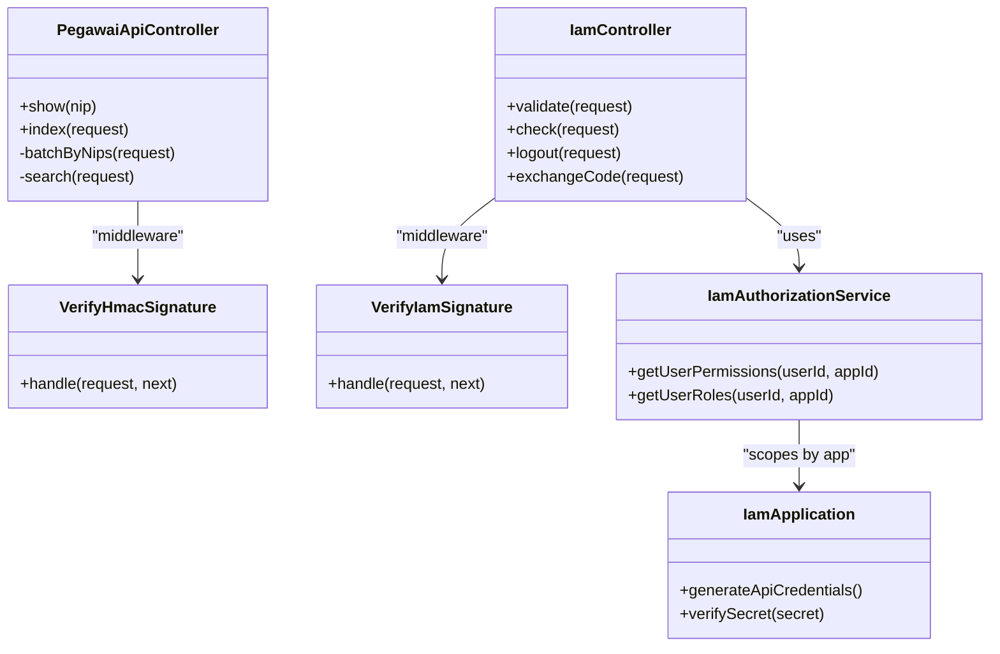

# API Controllers

<cite>
**Referenced Files in This Document**
- [PegawaiApiController.php](file://app/Http/Controllers/Api/PegawaiApiController.php)
- [IamController.php](file://app/Http/Controllers/Api/IamController.php)
- [SsoController.php](file://app/Http/Controllers/SsoController.php)
- [PegawaiApiResource.php](file://app/Http/Resources/PegawaiApiResource.php)
- [IamValidateResource.php](file://app/Http/Resources/IamValidateResource.php)
- [api.php](file://routes/api.php)
- [VerifyHmacSignature.php](file://app/Http/Middleware/VerifyHmacSignature.php)
- [VerifyIamSignature.php](file://app/Http/Middleware/VerifyIamSignature.php)
- [IamAuthorizationService.php](file://app/Services/IamAuthorizationService.php)
- [IamApplication.php](file://app/Models/IamApplication.php)
- [kepegawaian.php](file://config/kepegawaian.php)
- [iam.php](file://config/iam.php)
- [PegawaiApiTest.php](file://tests/Feature/Api/PegawaiApiTest.php)
- [IamValidateTest.php](file://tests/Feature/Iam/IamValidateTest.php)
</cite>

## Table of Contents
1. [Introduction](#introduction)
2. [Project Structure](#project-structure)
3. [Core Components](#core-components)
4. [Architecture Overview](#architecture-overview)
5. [Detailed Component Analysis](#detailed-component-analysis)
6. [Dependency Analysis](#dependency-analysis)
7. [Performance Considerations](#performance-considerations)
8. [Troubleshooting Guide](#troubleshooting-guide)
9. [Conclusion](#conclusion)
10. [Appendices](#appendices)

## Introduction
This document explains the API Controller group focused on external integration and API endpoint implementations. It covers:
- Employee API controller for RESTful endpoints, data serialization, and external system integration
- IAM API controller for authentication, authorization, and SSO gateway functionality
- Concrete examples of request/response handling, authentication requirements, rate limiting, and error response formatting
- API versioning, backward compatibility, security considerations, and integration patterns with external systems
- The relationship between API resources, service layer, and frontend consumption patterns

## Project Structure
The API surface is organized under the Api namespace with dedicated controllers, resources, middleware, and route groups. External integrations are secured with layered middleware and rate limiting.

**Diagram sources**
- [api.php:1-48](file://routes/api.php#L1-L48)
- [PegawaiApiController.php:1-112](file://app/Http/Controllers/Api/PegawaiApiController.php#L1-L112)
- [IamController.php:1-91](file://app/Http/Controllers/Api/IamController.php#L1-L91)
- [SsoController.php:1-85](file://app/Http/Controllers/SsoController.php#L1-L85)
- [PegawaiApiResource.php:1-61](file://app/Http/Resources/PegawaiApiResource.php#L1-L61)
- [IamValidateResource.php:1-19](file://app/Http/Resources/IamValidateResource.php#L1-L19)
- [VerifyHmacSignature.php:1-65](file://app/Http/Middleware/VerifyHmacSignature.php#L1-L65)
- [VerifyIamSignature.php:1-61](file://app/Http/Middleware/VerifyIamSignature.php#L1-L61)
- [IamAuthorizationService.php:1-45](file://app/Services/IamAuthorizationService.php#L1-L45)
- [IamApplication.php:1-96](file://app/Models/IamApplication.php#L1-L96)

**Section sources**
- [api.php:1-48](file://routes/api.php#L1-L48)
- [PegawaiApiController.php:1-112](file://app/Http/Controllers/Api/PegawaiApiController.php#L1-L112)
- [IamController.php:1-91](file://app/Http/Controllers/Api/IamController.php#L1-L91)
- [SsoController.php:1-85](file://app/Http/Controllers/SsoController.php#L1-L85)
- [PegawaiApiResource.php:1-61](file://app/Http/Resources/PegawaiApiResource.php#L1-L61)
- [IamValidateResource.php:1-19](file://app/Http/Resources/IamValidateResource.php#L1-L19)
- [VerifyHmacSignature.php:1-65](file://app/Http/Middleware/VerifyHmacSignature.php#L1-L65)
- [VerifyIamSignature.php:1-61](file://app/Http/Middleware/VerifyIamSignature.php#L1-L61)
- [IamAuthorizationService.php:1-45](file://app/Services/IamAuthorizationService.php#L1-L45)
- [IamApplication.php:1-96](file://app/Models/IamApplication.php#L1-L96)

## Core Components
- Employee API controller
  - Provides single and batch lookup by NIP and search by name with optional status filter
  - Returns structured JSON with data and metadata; handles not_found for batch requests
  - Uses Sanctum auth and HMAC signature verification middleware
- IAM API controller
  - Validates current user, checks permissions, logs out current token, and exchanges SSO code for a scoped token
  - Uses application HMAC signature verification and Sanctum auth for protected endpoints
- SSO gateway
  - Generates a short-lived SSO code bound to a registered application and redirect host
  - Redirects the user back to the application with the code
- Data resources
  - Transforms employee records to a stable API shape with renamed and computed fields
  - Transforms user info for IAM validate responses
- Authorization service
  - Resolves user roles and permissions scoped to a specific application
- Middleware
  - HMAC-SHA256 signature verification with timestamp anti-replay and body hash validation
  - Application signature verification with encrypted secret retrieval
- Configuration
  - HMAC secret for attendance integration and IAM TTLs for tokens and SSO codes

**Section sources**
- [PegawaiApiController.php:11-112](file://app/Http/Controllers/Api/PegawaiApiController.php#L11-L112)
- [IamController.php:13-91](file://app/Http/Controllers/Api/IamController.php#L13-L91)
- [SsoController.php:13-85](file://app/Http/Controllers/SsoController.php#L13-L85)
- [PegawaiApiResource.php:8-61](file://app/Http/Resources/PegawaiApiResource.php#L8-L61)
- [IamValidateResource.php:7-19](file://app/Http/Resources/IamValidateResource.php#L7-L19)
- [IamAuthorizationService.php:7-45](file://app/Services/IamAuthorizationService.php#L7-L45)
- [VerifyHmacSignature.php:9-65](file://app/Http/Middleware/VerifyHmacSignature.php#L9-L65)
- [VerifyIamSignature.php:11-61](file://app/Http/Middleware/VerifyIamSignature.php#L11-L61)
- [kepegawaian.php:3-16](file://config/kepegawaian.php#L3-L16)
- [iam.php:3-9](file://config/iam.php#L3-L9)

## Architecture Overview
The API architecture enforces four layers of security for external integrations:
- Transport: HTTPS
- Authentication: Sanctum personal access tokens
- Integrity: HMAC-SHA256 signatures with timestamp validation
- Rate limiting: Per-endpoint throttling to prevent abuse

**Diagram sources**
- [api.php:13-17](file://routes/api.php#L13-L17)
- [VerifyHmacSignature.php:25-63](file://app/Http/Middleware/VerifyHmacSignature.php#L25-L63)
- [VerifyIamSignature.php:15-59](file://app/Http/Middleware/VerifyIamSignature.php#L15-L59)
- [IamController.php:17-29](file://app/Http/Controllers/Api/IamController.php#L17-L29)
- [IamAuthorizationService.php:16-43](file://app/Services/IamAuthorizationService.php#L16-L43)
- [PegawaiApiController.php:27-41](file://app/Http/Controllers/Api/PegawaiApiController.php#L27-L41)

## Detailed Component Analysis

### Employee API Controller
Responsibilities:
- Single lookup by 18-digit NIP with eager-loaded relations
- Batch lookup by array of NIPs (max 50) with not_found reporting
- Search by name with optional status filter and pagination metadata
- Serialization via PegawaiApiResource

Key behaviors:
- Validation and error handling for missing or invalid NIPs
- Priority of batch mode when both nip[] and search are present
- Structured response with data, meta, and not_found fields

**Diagram sources**
- [PegawaiApiController.php:52-110](file://app/Http/Controllers/Api/PegawaiApiController.php#L52-L110)

**Section sources**
- [PegawaiApiController.php:27-110](file://app/Http/Controllers/Api/PegawaiApiController.php#L27-L110)
- [PegawaiApiResource.php:26-61](file://app/Http/Resources/PegawaiApiResource.php#L26-L61)

### IAM API Controller
Endpoints:
- validate: returns user identity, roles, permissions, and token expiry
- check(permission): evaluates a permission against user’s roles
- logout: invalidates current token
- exchange-code: converts a short-lived SSO code into a scoped Sanctum token

Security:
- Protected by Sanctum auth and application HMAC signature verification
- exchange-code is highly rate-limited to mitigate brute-force attempts

**Diagram sources**
- [IamController.php:17-89](file://app/Http/Controllers/Api/IamController.php#L17-L89)
- [IamAuthorizationService.php:16-43](file://app/Services/IamAuthorizationService.php#L16-L43)
- [api.php:34-47](file://routes/api.php#L34-L47)

**Section sources**
- [IamController.php:17-89](file://app/Http/Controllers/Api/IamController.php#L17-L89)
- [IamAuthorizationService.php:16-43](file://app/Services/IamAuthorizationService.php#L16-L43)

### SSO Gateway Controller
Responsibilities:
- Accepts app slug and redirect URL
- Validates app registration and active status
- Ensures redirect host matches registered app host
- Creates a short-lived SSO code and redirects back to the app with the code

**Diagram sources**
- [SsoController.php:15-83](file://app/Http/Controllers/SsoController.php#L15-L83)
- [IamApplication.php:12-96](file://app/Models/IamApplication.php#L12-L96)

**Section sources**
- [SsoController.php:15-83](file://app/Http/Controllers/SsoController.php#L15-L83)
- [IamApplication.php:33-50](file://app/Models/IamApplication.php#L33-L50)

### Data Serialization Patterns
- Employee API resource
  - Renames fields for API consumers (e.g., full name to name)
  - Computes derived fields (e.g., combined rank details, travel level)
  - Handles nullable relations and assets
- IAM validate resource
  - Minimal user representation suitable for downstream apps

**Section sources**
- [PegawaiApiResource.php:26-61](file://app/Http/Resources/PegawaiApiResource.php#L26-L61)
- [IamValidateResource.php:9-18](file://app/Http/Resources/IamValidateResource.php#L9-L18)

### External System Integration
- Attendance QR System integration
  - Secured by Sanctum + HMAC signature verification
  - Enforced via route middleware and configuration-driven shared secret
- IAM application integration
  - Secured by application HMAC signature verification using encrypted secrets
  - Scoped tokens per application with limited lifetimes

**Section sources**
- [api.php:13-17](file://routes/api.php#L13-L17)
- [VerifyHmacSignature.php:25-63](file://app/Http/Middleware/VerifyHmacSignature.php#L25-L63)
- [VerifyIamSignature.php:15-59](file://app/Http/Middleware/VerifyIamSignature.php#L15-L59)
- [kepegawaian.php:3-16](file://config/kepegawaian.php#L3-L16)
- [IamApplication.php:72-94](file://app/Models/IamApplication.php#L72-L94)

## Dependency Analysis

**Diagram sources**
- [PegawaiApiController.php:20-112](file://app/Http/Controllers/Api/PegawaiApiController.php#L20-L112)
- [IamController.php:13-91](file://app/Http/Controllers/Api/IamController.php#L13-L91)
- [IamAuthorizationService.php:7-45](file://app/Services/IamAuthorizationService.php#L7-L45)
- [VerifyHmacSignature.php:17-65](file://app/Http/Middleware/VerifyHmacSignature.php#L17-L65)
- [VerifyIamSignature.php:11-61](file://app/Http/Middleware/VerifyIamSignature.php#L11-L61)
- [IamApplication.php:12-96](file://app/Models/IamApplication.php#L12-L96)

**Section sources**
- [PegawaiApiController.php:20-112](file://app/Http/Controllers/Api/PegawaiApiController.php#L20-L112)
- [IamController.php:13-91](file://app/Http/Controllers/Api/IamController.php#L13-L91)
- [IamAuthorizationService.php:7-45](file://app/Services/IamAuthorizationService.php#L7-L45)
- [VerifyHmacSignature.php:17-65](file://app/Http/Middleware/VerifyHmacSignature.php#L17-L65)
- [VerifyIamSignature.php:11-61](file://app/Http/Middleware/VerifyIamSignature.php#L11-L61)
- [IamApplication.php:12-96](file://app/Models/IamApplication.php#L12-L96)

## Performance Considerations
- Eager loading of relations reduces N+1 queries for employee endpoints
- Batch limits (<=50 NIPs) constrain query size and memory footprint
- Pagination metadata supports scalable client-side rendering
- Rate limiting prevents abuse and ensures fair usage across clients

[No sources needed since this section provides general guidance]

## Troubleshooting Guide
Common issues and resolutions:
- 401 Unauthorized
  - Missing or invalid X-Timestamp/X-Signature headers
  - Expired timestamp (>5 minutes window)
  - Incorrect HMAC signature or wrong shared secret
  - Unauthenticated requests (missing Sanctum token)
- 400 Bad Request
  - Invalid or expired SSO code during exchange-code
- 404 Not Found
  - NIP not found in single lookup
- 422 Unprocessable Entity
  - Invalid NIP format (must be 18 digits)
  - Too many NIPs in batch (>50)
  - Tampered query string after signing
- 429 Too Many Requests
  - Exceeded rate limit thresholds (varies by endpoint)

**Section sources**
- [VerifyHmacSignature.php:35-60](file://app/Http/Middleware/VerifyHmacSignature.php#L35-L60)
- [VerifyIamSignature.php:25-53](file://app/Http/Middleware/VerifyIamSignature.php#L25-L53)
- [PegawaiApiController.php:69-72](file://app/Http/Controllers/Api/PegawaiApiController.php#L69-L72)
- [IamController.php:55-69](file://app/Http/Controllers/Api/IamController.php#L55-L69)
- [PegawaiApiTest.php:37-81](file://tests/Feature/Api/PegawaiApiTest.php#L37-L81)
- [IamValidateTest.php:37-52](file://tests/Feature/Iam/IamValidateTest.php#L37-L52)

## Conclusion
The API Controller group implements robust, layered security and predictable data shaping for external integrations. Employee endpoints support efficient single, batch, and search operations, while IAM endpoints provide secure validation, authorization checks, logout, and SSO token exchange. Middleware and configuration enforce integrity and availability, and tests validate critical behaviors and error handling.

[No sources needed since this section summarizes without analyzing specific files]

## Appendices

### API Versioning and Backward Compatibility
- Versioned base paths: v1 for employee endpoints, v1/iam for IAM endpoints
- Backward compatibility strategy
  - Keep existing v1 endpoints unchanged
  - Introduce new features under new versioned routes
  - Maintain stable field names and shapes in resources

**Section sources**
- [api.php:22-47](file://routes/api.php#L22-L47)

### Security Considerations
- HMAC-SHA256 with timestamp validation protects against replay and tampering
- Encrypted application secrets enable signature verification without exposing plaintext
- Scoped tokens per application minimize blast radius
- Rate limiting protects sensitive endpoints

**Section sources**
- [VerifyHmacSignature.php:25-63](file://app/Http/Middleware/VerifyHmacSignature.php#L25-L63)
- [VerifyIamSignature.php:15-59](file://app/Http/Middleware/VerifyIamSignature.php#L15-L59)
- [IamApplication.php:85-94](file://app/Models/IamApplication.php#L85-L94)
- [api.php:22-47](file://routes/api.php#L22-L47)

### Integration Patterns with External Systems
- Attendance QR System
  - Use Sanctum tokens and HMAC signatures
  - Send X-Timestamp and X-Signature headers
  - Respect rate limits and error responses
- IAM Applications
  - Use application HMAC signatures with X-App-Key
  - Exchange SSO codes for scoped tokens
  - Validate permissions via check endpoint before privileged actions

**Section sources**
- [api.php:13-17](file://routes/api.php#L13-L17)
- [VerifyHmacSignature.php:25-63](file://app/Http/Middleware/VerifyHmacSignature.php#L25-L63)
- [VerifyIamSignature.php:15-59](file://app/Http/Middleware/VerifyIamSignature.php#L15-L59)
- [IamController.php:53-89](file://app/Http/Controllers/Api/IamController.php#L53-L89)