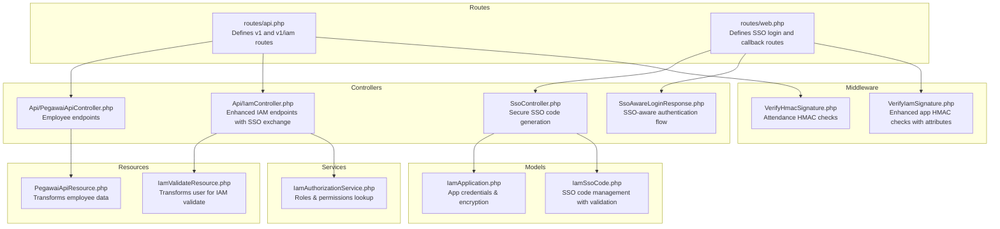
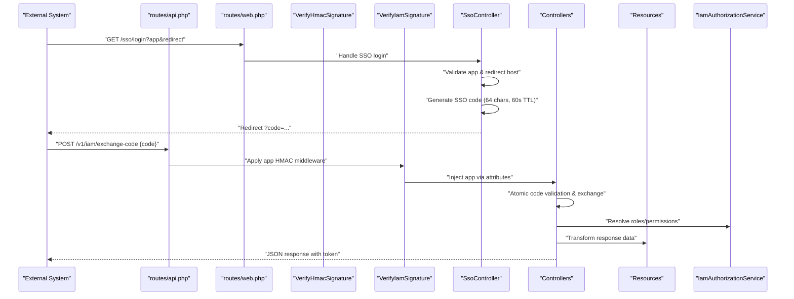
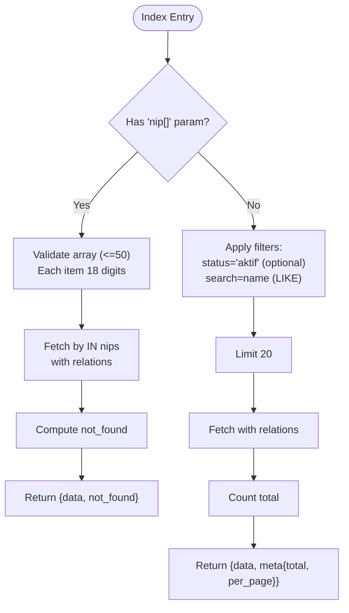
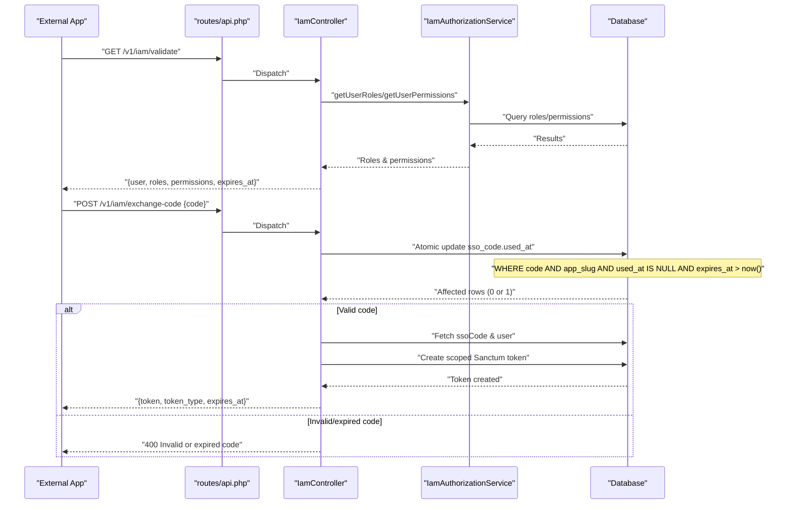
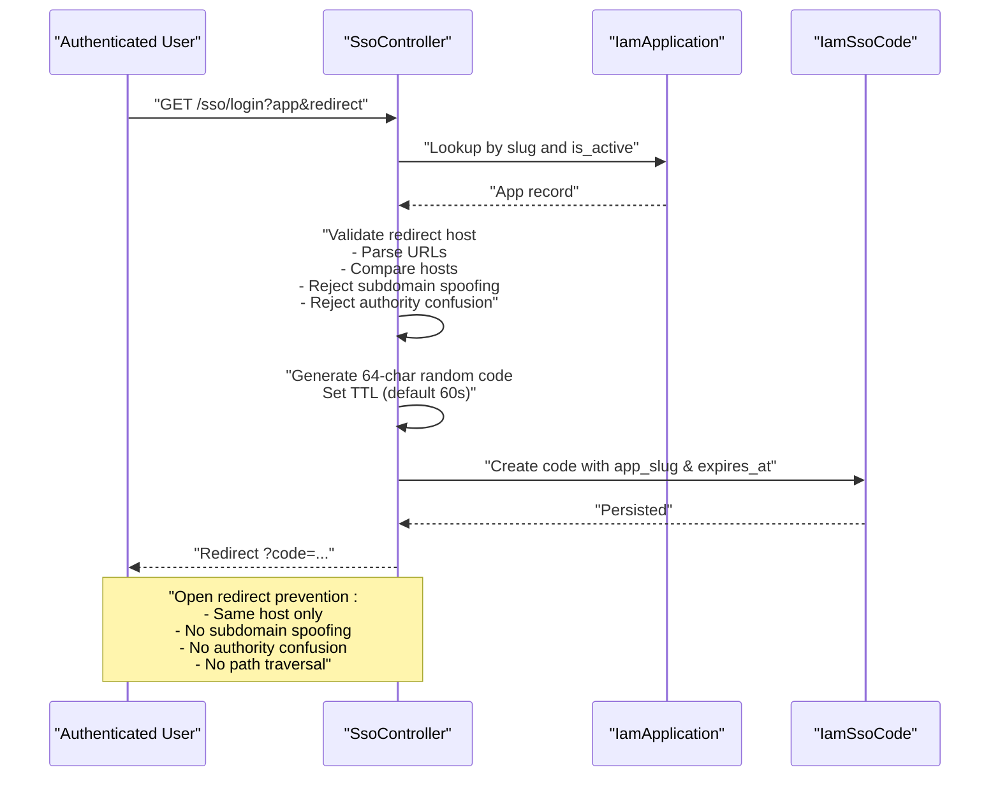
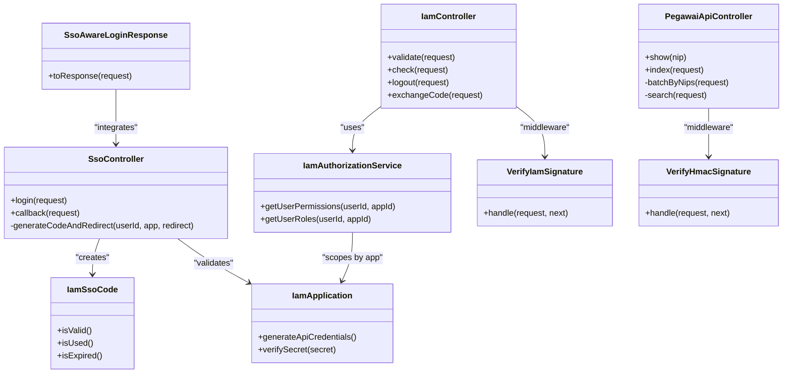

# API Controllers

<cite>
**Referenced Files in This Document**
- [PegawaiApiController.php](file://app/Http/Controllers/Api/PegawaiApiController.php)
- [IamController.php](file://app/Http/Controllers/Api/IamController.php)
- [SsoController.php](file://app/Http/Controllers/SsoController.php)
- [SsoAwareLoginResponse.php](file://app/Http/Responses/SsoAwareLoginResponse.php)
- [PegawaiApiResource.php](file://app/Http/Resources/PegawaiApiResource.php)
- [IamValidateResource.php](file://app/Http/Resources/IamValidateResource.php)
- [api.php](file://routes/api.php)
- [web.php](file://routes/web.php)
- [VerifyHmacSignature.php](file://app/Http/Middleware/VerifyHmacSignature.php)
- [VerifyIamSignature.php](file://app/Http/Middleware/VerifyIamSignature.php)
- [IamAuthorizationService.php](file://app/Services/IamAuthorizationService.php)
- [IamApplication.php](file://app/Models/IamApplication.php)
- [IamSsoCode.php](file://app/Models/IamSsoCode.php)
- [kepegawaian.php](file://config/kepegawaian.php)
- [iam.php](file://config/iam.php)
- [PegawaiApiTest.php](file://tests/Feature/Api/PegawaiApiTest.php)
- [IamValidateTest.php](file://tests/Feature/Iam/IamValidateTest.php)
- [SsoLoginTest.php](file://tests/Feature/Iam/SsoLoginTest.php)
- [SsoCallbackTest.php](file://tests/Feature/Iam/SsoCallbackTest.php)
- [IamExchangeCodeTest.php](file://tests/Feature/Iam/IamExchangeCodeTest.php)
</cite>

## Update Summary
**Changes Made**
- Enhanced SSO gateway implementation with improved security measures and middleware integration
- Added comprehensive SSO code exchange functionality in IAM controllers
- Improved middleware integration for SSO authentication with better error handling
- Updated SSO controller with enhanced open redirect prevention and session management
- Added SSO-aware login response for seamless authentication flow

## Table of Contents
1. [Introduction](#introduction)
2. [Project Structure](#project-structure)
3. [Core Components](#core-components)
4. [Architecture Overview](#architecture-overview)
5. [Detailed Component Analysis](#detailed-component-analysis)
6. [Dependency Analysis](#dependency-analysis)
7. [Performance Considerations](#performance-considerations)
8. [Troubleshooting Guide](#troubleshooting-guide)
9. [Conclusion](#conclusion)
10. [Appendices](#appendices)

## Introduction
This document explains the API Controller group focused on external integration and API endpoint implementations. It covers:
- Employee API controller for RESTful endpoints, data serialization, and external system integration
- IAM API controller for authentication, authorization, and SSO gateway functionality
- Enhanced SSO gateway implementation with secure code exchange and improved middleware integration
- Concrete examples of request/response handling, authentication requirements, rate limiting, and error response formatting
- API versioning, backward compatibility, security considerations, and integration patterns with external systems
- The relationship between API resources, service layer, and frontend consumption patterns

## Project Structure
The API surface is organized under the Api namespace with dedicated controllers, resources, middleware, and route groups. External integrations are secured with layered middleware and rate limiting. The SSO gateway provides secure authentication flows with enhanced security measures.

**Diagram sources**
- [api.php:1-48](file://routes/api.php#L1-L48)
- [web.php:30-32](file://routes/web.php#L30-L32)
- [PegawaiApiController.php:1-112](file://app/Http/Controllers/Api/PegawaiApiController.php#L1-L112)
- [IamController.php:1-91](file://app/Http/Controllers/Api/IamController.php#L1-L91)
- [SsoController.php:1-92](file://app/Http/Controllers/SsoController.php#L1-L92)
- [SsoAwareLoginResponse.php:1-28](file://app/Http/Responses/SsoAwareLoginResponse.php#L1-L28)
- [PegawaiApiResource.php:1-61](file://app/Http/Resources/PegawaiApiResource.php#L1-L61)
- [IamValidateResource.php:1-19](file://app/Http/Resources/IamValidateResource.php#L1-L19)
- [VerifyHmacSignature.php:1-65](file://app/Http/Middleware/VerifyHmacSignature.php#L1-L65)
- [VerifyIamSignature.php:1-61](file://app/Http/Middleware/VerifyIamSignature.php#L1-L61)
- [IamAuthorizationService.php:1-45](file://app/Services/IamAuthorizationService.php#L1-L45)
- [IamApplication.php:1-96](file://app/Models/IamApplication.php#L1-L96)
- [IamSsoCode.php:1-53](file://app/Models/IamSsoCode.php#L1-L53)

**Section sources**
- [api.php:1-48](file://routes/api.php#L1-L48)
- [web.php:30-32](file://routes/web.php#L30-L32)
- [PegawaiApiController.php:1-112](file://app/Http/Controllers/Api/PegawaiApiController.php#L1-L112)
- [IamController.php:1-91](file://app/Http/Controllers/Api/IamController.php#L1-L91)
- [SsoController.php:1-92](file://app/Http/Controllers/SsoController.php#L1-L92)
- [SsoAwareLoginResponse.php:1-28](file://app/Http/Responses/SsoAwareLoginResponse.php#L1-L28)
- [PegawaiApiResource.php:1-61](file://app/Http/Resources/PegawaiApiResource.php#L1-L61)
- [IamValidateResource.php:1-19](file://app/Http/Resources/IamValidateResource.php#L1-L19)
- [VerifyHmacSignature.php:1-65](file://app/Http/Middleware/VerifyHmacSignature.php#L1-L65)
- [VerifyIamSignature.php:1-61](file://app/Http/Middleware/VerifyIamSignature.php#L1-L61)
- [IamAuthorizationService.php:1-45](file://app/Services/IamAuthorizationService.php#L1-L45)
- [IamApplication.php:1-96](file://app/Models/IamApplication.php#L1-L96)
- [IamSsoCode.php:1-53](file://app/Models/IamSsoCode.php#L1-L53)

## Core Components
- Employee API controller
  - Provides single and batch lookup by NIP and search by name with optional status filter
  - Returns structured JSON with data and metadata; handles not_found for batch requests
  - Uses Sanctum auth and HMAC signature verification middleware
- Enhanced IAM API controller with SSO integration
  - Validates current user, checks permissions, logs out current token, and exchanges SSO code for a scoped token
  - Uses application HMAC signature verification and Sanctum auth for protected endpoints
  - Implements atomic code exchange with cross-app protection and expiration validation
- Secure SSO gateway
  - Generates short-lived SSO codes with enhanced open redirect prevention
  - Manages session-based SSO flow with proper validation and cleanup
  - Supports both external applications and self-service SSO scenarios
- SSO-aware authentication response
  - Integrates seamlessly with Fortify authentication flow
  - Handles SSO session continuation after successful login
- Data resources
  - Transforms employee records to a stable API shape with renamed and computed fields
  - Transforms user info for IAM validate responses
- Authorization service
  - Resolves user roles and permissions scoped to a specific application
- Enhanced middleware
  - HMAC-SHA256 signature verification with timestamp anti-replay and body hash validation
  - Application signature verification with encrypted secret retrieval and attribute injection
- Configuration
  - HMAC secret for attendance integration and IAM TTLs for tokens and SSO codes
  - Enhanced SSO configuration with app slug and security parameters

**Section sources**
- [PegawaiApiController.php:11-112](file://app/Http/Controllers/Api/PegawaiApiController.php#L11-L112)
- [IamController.php:13-91](file://app/Http/Controllers/Api/IamController.php#L13-L91)
- [SsoController.php:13-92](file://app/Http/Controllers/SsoController.php#L13-L92)
- [SsoAwareLoginResponse.php:8-28](file://app/Http/Responses/SsoAwareLoginResponse.php#L8-L28)
- [PegawaiApiResource.php:8-61](file://app/Http/Resources/PegawaiApiResource.php#L8-L61)
- [IamValidateResource.php:7-19](file://app/Http/Resources/IamValidateResource.php#L7-L19)
- [IamAuthorizationService.php:7-45](file://app/Services/IamAuthorizationService.php#L7-L45)
- [VerifyHmacSignature.php:9-65](file://app/Http/Middleware/VerifyHmacSignature.php#L9-L65)
- [VerifyIamSignature.php:11-61](file://app/Http/Middleware/VerifyIamSignature.php#L11-L61)
- [kepegawaian.php:3-16](file://config/kepegawaian.php#L3-L16)
- [iam.php:3-9](file://config/iam.php#L3-L9)

## Architecture Overview
The API architecture enforces four layers of security for external integrations with enhanced SSO capabilities:
- Transport: HTTPS
- Authentication: Sanctum personal access tokens
- Integrity: HMAC-SHA256 signatures with timestamp validation
- Rate limiting: Per-endpoint throttling to prevent abuse
- SSO Integration: Secure code-based authentication with atomic exchange and cross-app protection

**Diagram sources**
- [api.php:42-47](file://routes/api.php#L42-L47)
- [web.php:30-32](file://routes/web.php#L30-L32)
- [VerifyIamSignature.php:15-59](file://app/Http/Middleware/VerifyIamSignature.php#L15-L59)
- [IamController.php:53-89](file://app/Http/Controllers/Api/IamController.php#L53-L89)
- [SsoController.php:15-90](file://app/Http/Controllers/SsoController.php#L15-L90)
- [IamAuthorizationService.php:16-43](file://app/Services/IamAuthorizationService.php#L16-L43)

## Detailed Component Analysis

### Employee API Controller
Responsibilities:
- Single lookup by 18-digit NIP with eager-loaded relations
- Batch lookup by array of NIPs (max 50) with not_found reporting
- Search by name with optional status filter and pagination metadata
- Serialization via PegawaiApiResource

Key behaviors:
- Validation and error handling for missing or invalid NIPs
- Priority of batch mode when both nip[] and search are present
- Structured response with data, meta, and not_found fields

**Diagram sources**
- [PegawaiApiController.php:52-110](file://app/Http/Controllers/Api/PegawaiApiController.php#L52-L110)

**Section sources**
- [PegawaiApiController.php:27-110](file://app/Http/Controllers/Api/PegawaiApiController.php#L27-L110)
- [PegawaiApiResource.php:26-61](file://app/Http/Resources/PegawaiApiResource.php#L26-L61)

### Enhanced IAM API Controller with SSO Integration
Endpoints:
- validate: returns user identity, roles, permissions, and token expiry
- check(permission): evaluates a permission against user's roles
- logout: invalidates current token
- exchange-code: converts a short-lived SSO code into a scoped Sanctum token with enhanced security

Enhanced security features:
- Protected by Sanctum auth and application HMAC signature verification
- exchange-code uses atomic database operations to prevent race conditions
- Cross-application code protection prevents token theft between apps
- Enhanced rate limiting (10 requests per minute) for sensitive exchange endpoint
- Scoped tokens per application with custom token names and permissions

**Diagram sources**
- [IamController.php:17-89](file://app/Http/Controllers/Api/IamController.php#L17-L89)
- [IamAuthorizationService.php:16-43](file://app/Services/IamAuthorizationService.php#L16-L43)
- [api.php:42-47](file://routes/api.php#L42-L47)

**Section sources**
- [IamController.php:17-89](file://app/Http/Controllers/Api/IamController.php#L17-L89)
- [IamAuthorizationService.php:16-43](file://app/Services/IamAuthorizationService.php#L16-L43)

### Secure SSO Gateway Controller
Responsibilities:
- Accepts app slug and redirect URL with enhanced validation
- Validates app registration, active status, and redirect host security
- Generates secure 64-character SSO codes with configurable TTL (default 60 seconds)
- Implements comprehensive open redirect prevention measures
- Manages session-based SSO flow with proper cleanup

Enhanced security features:
- Host validation prevents subdomain spoofing and URL authority confusion
- Session-based flow for non-authenticated users with automatic cleanup
- Self-service SSO handling for internal applications
- Atomic code generation with proper database constraints

**Diagram sources**
- [SsoController.php:15-90](file://app/Http/Controllers/SsoController.php#L15-L90)
- [IamApplication.php:12-96](file://app/Models/IamApplication.php#L12-L96)

**Section sources**
- [SsoController.php:15-90](file://app/Http/Controllers/SsoController.php#L15-L90)
- [IamApplication.php:33-50](file://app/Models/IamApplication.php#L33-L50)
- [SsoLoginTest.php:49-77](file://tests/Feature/Iam/SsoLoginTest.php#L49-L77)

### SSO-Aware Authentication Response
Responsibilities:
- Integrates with Laravel Fortify authentication flow
- Handles SSO session continuation after successful login
- Provides seamless redirect experience for SSO-enabled applications
- Maintains compatibility with JSON API responses

Key behaviors:
- Checks for active SSO session after login
- Redirects to SSO callback for SSO-enabled applications
- Falls back to standard Fortify intended redirect for regular authentication
- Supports both web and JSON API responses

**Section sources**
- [SsoAwareLoginResponse.php:8-28](file://app/Http/Responses/SsoAwareLoginResponse.php#L8-L28)

### Data Serialization Patterns
- Employee API resource
  - Renames fields for API consumers (e.g., full name to name)
  - Computes derived fields (e.g., combined rank details, travel level)
  - Handles nullable relations and assets
- IAM validate resource
  - Minimal user representation suitable for downstream apps
  - Includes role and permission scoping for application-specific contexts

**Section sources**
- [PegawaiApiResource.php:26-61](file://app/Http/Resources/PegawaiApiResource.php#L26-L61)
- [IamValidateResource.php:9-18](file://app/Http/Resources/IamValidateResource.php#L9-L18)

### External System Integration
- Attendance QR System integration
  - Secured by Sanctum + HMAC signature verification
  - Enforced via route middleware and configuration-driven shared secret
- Enhanced IAM application integration
  - Secured by application HMAC signature verification using encrypted secrets
  - Scoped tokens per application with limited lifetimes
  - Atomic SSO code exchange prevents race conditions and cross-app theft
  - Comprehensive rate limiting protects sensitive endpoints

**Section sources**
- [api.php:13-17](file://routes/api.php#L13-L17)
- [VerifyHmacSignature.php:25-63](file://app/Http/Middleware/VerifyHmacSignature.php#L25-L63)
- [VerifyIamSignature.php:15-59](file://app/Http/Middleware/VerifyIamSignature.php#L15-L59)
- [kepegawaian.php:3-16](file://config/kepegawaian.php#L3-L16)
- [IamApplication.php:72-94](file://app/Models/IamApplication.php#L72-L94)

## Dependency Analysis

**Diagram sources**
- [PegawaiApiController.php:20-112](file://app/Http/Controllers/Api/PegawaiApiController.php#L20-L112)
- [IamController.php:13-91](file://app/Http/Controllers/Api/IamController.php#L13-L91)
- [SsoController.php:13-92](file://app/Http/Controllers/SsoController.php#L13-L92)
- [SsoAwareLoginResponse.php:15-26](file://app/Http/Responses/SsoAwareLoginResponse.php#L15-L26)
- [IamAuthorizationService.php:7-45](file://app/Services/IamAuthorizationService.php#L7-L45)
- [VerifyHmacSignature.php:17-65](file://app/Http/Middleware/VerifyHmacSignature.php#L17-L65)
- [VerifyIamSignature.php:11-61](file://app/Http/Middleware/VerifyIamSignature.php#L11-L61)
- [IamApplication.php:12-96](file://app/Models/IamApplication.php#L12-L96)
- [IamSsoCode.php:27-52](file://app/Models/IamSsoCode.php#L27-L52)

**Section sources**
- [PegawaiApiController.php:20-112](file://app/Http/Controllers/Api/PegawaiApiController.php#L20-L112)
- [IamController.php:13-91](file://app/Http/Controllers/Api/IamController.php#L13-L91)
- [SsoController.php:13-92](file://app/Http/Controllers/SsoController.php#L13-L92)
- [SsoAwareLoginResponse.php:15-26](file://app/Http/Responses/SsoAwareLoginResponse.php#L15-L26)
- [IamAuthorizationService.php:7-45](file://app/Services/IamAuthorizationService.php#L7-L45)
- [VerifyHmacSignature.php:17-65](file://app/Http/Middleware/VerifyHmacSignature.php#L17-L65)
- [VerifyIamSignature.php:11-61](file://app/Http/Middleware/VerifyIamSignature.php#L11-L61)
- [IamApplication.php:12-96](file://app/Models/IamApplication.php#L12-L96)
- [IamSsoCode.php:27-52](file://app/Models/IamSsoCode.php#L27-L52)

## Performance Considerations
- Eager loading of relations reduces N+1 queries for employee endpoints
- Batch limits (<=50 NIPs) constrain query size and memory footprint
- Pagination metadata supports scalable client-side rendering
- Rate limiting prevents abuse and ensures fair usage across clients
- Atomic database operations in SSO exchange eliminate race conditions
- Enhanced SSO code validation reduces unnecessary database queries
- Session-based SSO flow minimizes repeated authentication overhead

## Troubleshooting Guide
Common issues and resolutions:
- 401 Unauthorized
  - Missing or invalid X-Timestamp/X-Signature headers
  - Expired timestamp (>5 minutes window)
  - Incorrect HMAC signature or wrong shared secret
  - Unauthenticated requests (missing Sanctum token)
- 400 Bad Request (SSO Exchange)
  - Invalid or expired SSO code during exchange-code
  - Code already used or cross-application attempt
  - Code expired more than 60 seconds ago
- 404 Not Found
  - NIP not found in single lookup
  - Unknown application in SSO login
- 422 Unprocessable Entity
  - Invalid NIP format (must be 18 digits)
  - Too many NIPs in batch (>50)
  - Tampered query string after signing
  - Invalid app parameter in SSO login
  - Open redirect violation (different host/domain)
- 429 Too Many Requests
  - Exceeded rate limit thresholds (varies by endpoint)
  - SSO exchange endpoint limited to 10 requests per minute
  - IAM validate/check endpoints limited to 120 requests per minute
- SSO Flow Issues
  - Session cleanup problems after callback
  - Redirect URL validation failures
  - Authentication loop with SSO-aware response

**Section sources**
- [VerifyHmacSignature.php:35-60](file://app/Http/Middleware/VerifyHmacSignature.php#L35-L60)
- [VerifyIamSignature.php:25-53](file://app/Http/Middleware/VerifyIamSignature.php#L25-L53)
- [PegawaiApiController.php:69-72](file://app/Http/Controllers/Api/PegawaiApiController.php#L69-L72)
- [IamController.php:55-69](file://app/Http/Controllers/Api/IamController.php#L55-L69)
- [SsoController.php:67-90](file://app/Http/Controllers/SsoController.php#L67-L90)
- [PegawaiApiTest.php:37-81](file://tests/Feature/Api/PegawaiApiTest.php#L37-L81)
- [IamValidateTest.php:37-52](file://tests/Feature/Iam/IamValidateTest.php#L37-L52)
- [SsoLoginTest.php:8-88](file://tests/Feature/Iam/SsoLoginTest.php#L8-L88)
- [IamExchangeCodeTest.php:104-136](file://tests/Feature/Iam/IamExchangeCodeTest.php#L104-L136)

## Conclusion
The API Controller group implements robust, layered security and predictable data shaping for external integrations with enhanced SSO capabilities. Employee endpoints support efficient single, batch, and search operations, while enhanced IAM endpoints provide secure validation, authorization checks, logout, and atomic SSO token exchange. The SSO gateway provides secure authentication flows with comprehensive open redirect prevention and session management. Middleware and configuration enforce integrity and availability, and comprehensive tests validate critical behaviors and security measures.

## Appendices

### API Versioning and Backward Compatibility
- Versioned base paths: v1 for employee endpoints, v1/iam for IAM endpoints
- Backward compatibility strategy
  - Keep existing v1 endpoints unchanged
  - Introduce new features under new versioned routes
  - Maintain stable field names and shapes in resources
  - Enhanced SSO integration maintains backward compatibility

**Section sources**
- [api.php:22-47](file://routes/api.php#L22-L47)

### Security Considerations
- HMAC-SHA256 with timestamp validation protects against replay and tampering
- Encrypted application secrets enable signature verification without exposing plaintext
- Scoped tokens per application minimize blast radius
- Rate limiting protects sensitive endpoints
- Atomic database operations prevent race conditions in SSO exchange
- Comprehensive open redirect prevention protects against malicious redirects
- Enhanced SSO code validation prevents cross-application token theft
- Session-based SSO flow maintains security while improving user experience

**Section sources**
- [VerifyHmacSignature.php:25-63](file://app/Http/Middleware/VerifyHmacSignature.php#L25-L63)
- [VerifyIamSignature.php:15-59](file://app/Http/Middleware/VerifyIamSignature.php#L15-L59)
- [IamApplication.php:85-94](file://app/Models/IamApplication.php#L85-L94)
- [IamSsoCode.php:32-45](file://app/Models/IamSsoCode.php#L32-L45)
- [SsoController.php:67-90](file://app/Http/Controllers/SsoController.php#L67-L90)
- [api.php:22-47](file://routes/api.php#L22-L47)

### Integration Patterns with External Systems
- Attendance QR System
  - Use Sanctum tokens and HMAC signatures
  - Send X-Timestamp and X-Signature headers
  - Respect rate limits and error responses
- Enhanced IAM Applications
  - Use application HMAC signatures with X-App-Key
  - Implement secure SSO flow: GET /sso/login → receive code → POST /v1/iam/exchange-code
  - Validate permissions via check endpoint before privileged actions
  - Handle SSO-aware authentication with seamless session management
- SSO Integration Best Practices
  - Always validate redirect URLs against registered application domains
  - Implement proper error handling for SSO code exchange failures
  - Use atomic operations for SSO code validation and token generation
  - Configure appropriate TTL values for SSO codes and tokens

**Section sources**
- [api.php:13-17](file://routes/api.php#L13-L17)
- [VerifyHmacSignature.php:25-63](file://app/Http/Middleware/VerifyHmacSignature.php#L25-L63)
- [VerifyIamSignature.php:15-59](file://app/Http/Middleware/VerifyIamSignature.php#L15-L59)
- [IamController.php:53-89](file://app/Http/Controllers/Api/IamController.php#L53-L89)
- [SsoController.php:15-90](file://app/Http/Controllers/SsoController.php#L15-L90)
- [SsoAwareLoginResponse.php:15-26](file://app/Http/Responses/SsoAwareLoginResponse.php#L15-L26)