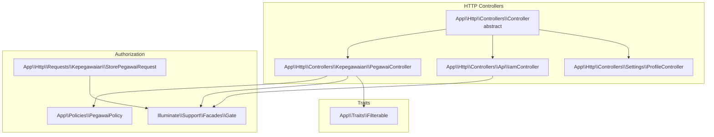
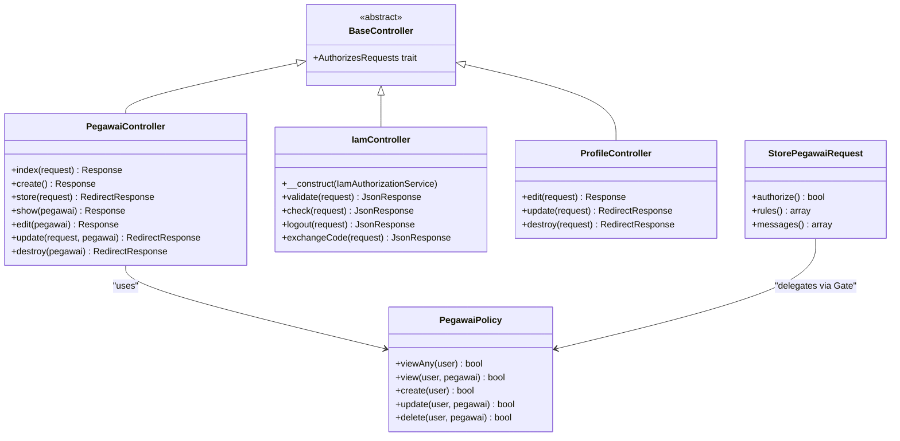
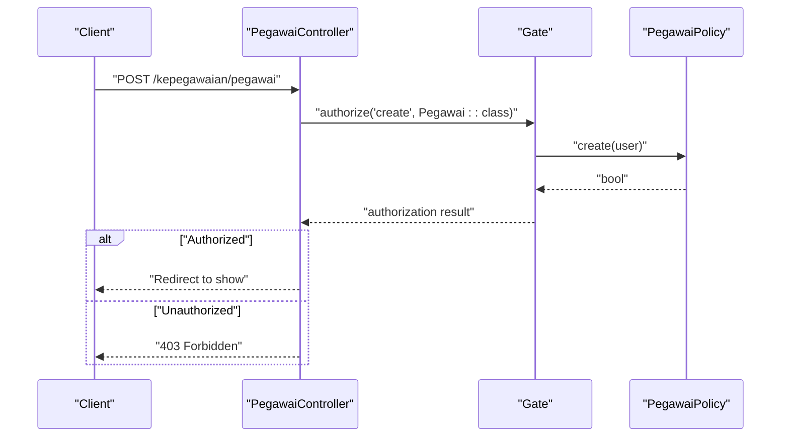
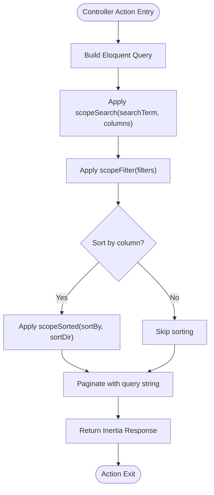
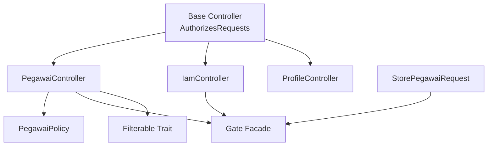

# Base Controller

<cite>
**Referenced Files in This Document**
- [Controller.php](file://app/Http/Controllers/Controller.php)
- [PegawaiController.php](file://app/Http/Controllers/Kepegawaian/PegawaiController.php)
- [IamController.php](file://app/Http/Controllers/Api/IamController.php)
- [PegawaiPolicy.php](file://app/Policies/PegawaiPolicy.php)
- [StorePegawaiRequest.php](file://app/Http/Requests/Kepegawaian/StorePegawaiRequest.php)
- [Filterable.php](file://app/Traits/Filterable.php)
- [ProfileController.php](file://app/Http/Controllers/Settings/ProfileController.php)
</cite>

## Table of Contents
1. [Introduction](#introduction)
2. [Project Structure](#project-structure)
3. [Core Components](#core-components)
4. [Architecture Overview](#architecture-overview)
5. [Detailed Component Analysis](#detailed-component-analysis)
6. [Dependency Analysis](#dependency-analysis)
7. [Performance Considerations](#performance-considerations)
8. [Troubleshooting Guide](#troubleshooting-guide)
9. [Conclusion](#conclusion)

## Introduction
This document explains the Base Controller class and how it establishes consistent authorization patterns across the application. The Base Controller defines a shared foundation for all specialized controllers, enabling uniform use of Laravel's authorization mechanisms and common controller behaviors. We analyze how the abstract base controller integrates with authorization traits, how specialized controllers extend it, and how consistent authorization patterns are enforced through policies, form requests, and middleware.

## Project Structure
The Base Controller resides in the HTTP Controllers namespace and is extended by all specialized controllers. Specialized controllers demonstrate consistent authorization usage via policies and form requests, while traits encapsulate shared controller behaviors such as filtering and sorting.

**Diagram sources**
- [Controller.php:7-10](file://app/Http/Controllers/Controller.php#L7-L10)
- [PegawaiController.php:25-224](file://app/Http/Controllers/Kepegawaian/PegawaiController.php#L25-L224)
- [IamController.php:13-91](file://app/Http/Controllers/Api/IamController.php#L13-L91)
- [ProfileController.php:15-61](file://app/Http/Controllers/Settings/ProfileController.php#L15-L61)
- [PegawaiPolicy.php:7-34](file://app/Policies/PegawaiPolicy.php#L7-L34)
- [StorePegawaiRequest.php:10-51](file://app/Http/Requests/Kepegawaian/StorePegawaiRequest.php#L10-L51)
- [Filterable.php:7-48](file://app/Traits/Filterable.php#L7-L48)

**Section sources**
- [Controller.php:1-11](file://app/Http/Controllers/Controller.php#L1-L11)
- [PegawaiController.php:1-224](file://app/Http/Controllers/Kepegawaian/PegawaiController.php#L1-L224)
- [IamController.php:1-91](file://app/Http/Controllers/Api/IamController.php#L1-L91)
- [ProfileController.php:1-61](file://app/Http/Controllers/Settings/ProfileController.php#L1-L61)
- [PegawaiPolicy.php:1-34](file://app/Policies/PegawaiPolicy.php#L1-L34)
- [StorePegawaiRequest.php:1-51](file://app/Http/Requests/Kepegawaian/StorePegawaiRequest.php#L1-L51)
- [Filterable.php:1-48](file://app/Traits/Filterable.php#L1-L48)

## Core Components
- Base Controller: An abstract controller that uses Laravel’s AuthorizesRequests trait to enable authorization capabilities across all specialized controllers.
- Specialized Controllers: Extend the Base Controller and implement consistent authorization patterns using policies and form requests.
- Authorization Mechanisms: Policies define capability checks; form requests delegate authorization via the authorize method; Gate facade supports programmatic checks.
- Shared Behaviors: Traits encapsulate reusable controller logic such as filtering, searching, and sorting.

Key implementation references:
- Base Controller with AuthorizesRequests trait: [Controller.php:7-10](file://app/Http/Controllers/Controller.php#L7-L10)
- Specialized controller extending Base Controller: [PegawaiController.php:25](file://app/Http/Controllers/Kepegawaian/PegawaiController.php#L25)
- Programmatic authorization via Gate: [PegawaiController.php:32](file://app/Http/Controllers/Kepegawaian/PegawaiController.php#L32), [PegawaiController.php:120](file://app/Http/Controllers/Kepegawaian/PegawaiController.php#L120), [PegawaiController.php:143](file://app/Http/Controllers/Kepegawaian/PegawaiController.php#L143), [PegawaiController.php:155](file://app/Http/Controllers/Kepegawaian/PegawaiController.php#L155), [PegawaiController.php:177](file://app/Http/Controllers/Kepegawaian/PegawaiController.php#L177), [PegawaiController.php:201](file://app/Http/Controllers/Kepegawaian/PegawaiController.php#L201), [PegawaiController.php:217](file://app/Http/Controllers/Kepegawaian/PegawaiController.php#L217)
- Policy-based authorization: [PegawaiPolicy.php:9-32](file://app/Policies/PegawaiPolicy.php#L9-L32)
- Form request authorization delegation: [StorePegawaiRequest.php:17-20](file://app/Http/Requests/Kepegawaian/StorePegawaiRequest.php#L17-L20)
- Shared filtering behavior: [Filterable.php:9-46](file://app/Traits/Filterable.php#L9-L46)

**Section sources**
- [Controller.php:7-10](file://app/Http/Controllers/Controller.php#L7-L10)
- [PegawaiController.php:25-224](file://app/Http/Controllers/Kepegawaian/PegawaiController.php#L25-L224)
- [PegawaiPolicy.php:7-34](file://app/Policies/PegawaiPolicy.php#L7-L34)
- [StorePegawaiRequest.php:10-51](file://app/Http/Requests/Kepegawaian/StorePegawaiRequest.php#L10-L51)
- [Filterable.php:7-48](file://app/Traits/Filterable.php#L7-L48)

## Architecture Overview
The Base Controller centralizes authorization capabilities for all controllers. Specialized controllers inherit these capabilities and enforce consistent authorization patterns through policies and form requests. The diagram below maps the Base Controller and its specialized extensions, along with authorization integrations.

**Diagram sources**
- [Controller.php:7-10](file://app/Http/Controllers/Controller.php#L7-L10)
- [PegawaiController.php:25-224](file://app/Http/Controllers/Kepegawaian/PegawaiController.php#L25-L224)
- [IamController.php:13-91](file://app/Http/Controllers/Api/IamController.php#L13-L91)
- [ProfileController.php:15-61](file://app/Http/Controllers/Settings/ProfileController.php#L15-L61)
- [PegawaiPolicy.php:7-34](file://app/Policies/PegawaiPolicy.php#L7-L34)
- [StorePegawaiRequest.php:10-51](file://app/Http/Requests/Kepegawaian/StorePegawaiRequest.php#L10-L51)

## Detailed Component Analysis

### Base Controller: Abstract Foundation
The Base Controller defines a shared foundation for all specialized controllers. It uses Laravel’s AuthorizesRequests trait, which provides methods for authorizing actions and managing access decisions consistently across the application.

- Purpose: Centralize authorization capabilities for all controllers.
- Implementation: [Controller.php:7-10](file://app/Http/Controllers/Controller.php#L7-L10)

Benefits:
- Uniform authorization methods across controllers.
- Consistent integration with policies and form requests.
- Simplified controller lifecycle and reduced duplication.

**Section sources**
- [Controller.php:7-10](file://app/Http/Controllers/Controller.php#L7-L10)

### Specialized Controllers: Extending the Base Controller
Specialized controllers extend the Base Controller and implement consistent authorization patterns. Examples include:
- Resource controller for pegawai operations with policy-driven checks.
- API controller for IAM operations with programmatic authorization.
- Settings controller for user profile management.

Representative references:
- Resource controller extending Base Controller: [PegawaiController.php:25](file://app/Http/Controllers/Kepegawaian/PegawaiController.php#L25)
- API controller extending Base Controller: [IamController.php:13](file://app/Http/Controllers/Api/IamController.php#L13)
- Settings controller extending Base Controller: [ProfileController.php:15](file://app/Http/Controllers/Settings/ProfileController.php#L15)

**Section sources**
- [PegawaiController.php:25-224](file://app/Http/Controllers/Kepegawaian/PegawaiController.php#L25-L224)
- [IamController.php:13-91](file://app/Http/Controllers/Api/IamController.php#L13-L91)
- [ProfileController.php:15-61](file://app/Http/Controllers/Settings/ProfileController.php#L15-L61)

### Authorization Patterns: Policies, Gate, and Form Requests
Consistent authorization patterns are enforced across controllers using:
- Policies: Define capability checks for domain-specific actions.
- Gate facade: Used programmatically within controllers for fine-grained checks.
- Form requests: Delegate authorization via the authorize method, delegating to policies.

Representative references:
- Policy-based authorization: [PegawaiPolicy.php:9-32](file://app/Policies/PegawaiPolicy.php#L9-L32)
- Programmatic authorization via Gate: [PegawaiController.php:32](file://app/Http/Controllers/Kepegawaian/PegawaiController.php#L32), [PegawaiController.php:120](file://app/Http/Controllers/Kepegawaian/PegawaiController.php#L120), [PegawaiController.php:143](file://app/Http/Controllers/Kepegawaian/PegawaiController.php#L143), [PegawaiController.php:155](file://app/Http/Controllers/Kepegawaian/PegawaiController.php#L155), [PegawaiController.php:177](file://app/Http/Controllers/Kepegawaian/PegawaiController.php#L177), [PegawaiController.php:201](file://app/Http/Controllers/Kepegawaian/PegawaiController.php#L201), [PegawaiController.php:217](file://app/Http/Controllers/Kepegawaian/PegawaiController.php#L217)
- Form request authorization delegation: [StorePegawaiRequest.php:17-20](file://app/Http/Requests/Kepegawaian/StorePegawaiRequest.php#L17-L20)

**Diagram sources**
- [PegawaiController.php:141-148](file://app/Http/Controllers/Kepegawaian/PegawaiController.php#L141-L148)
- [PegawaiPolicy.php:19-22](file://app/Policies/PegawaiPolicy.php#L19-L22)

**Section sources**
- [PegawaiPolicy.php:7-34](file://app/Policies/PegawaiPolicy.php#L7-L34)
- [PegawaiController.php:30-222](file://app/Http/Controllers/Kepegawaian/PegawaiController.php#L30-L222)
- [StorePegawaiRequest.php:10-51](file://app/Http/Requests/Kepegawaian/StorePegawaiRequest.php#L10-L51)

### Shared Controller Behaviors: Filtering and Sorting
Shared controller behaviors are encapsulated in traits to reduce duplication and promote consistency. The Filterable trait provides:
- Search across multiple columns.
- Filter by key-value pairs.
- Dynamic sorting by column and direction.

Representative references:
- Trait definition: [Filterable.php:9-46](file://app/Traits/Filterable.php#L9-L46)
- Usage in controller: [PegawaiController.php:44-79](file://app/Http/Controllers/Kepegawaian/PegawaiController.php#L44-L79)

**Diagram sources**
- [Filterable.php:9-46](file://app/Traits/Filterable.php#L9-L46)
- [PegawaiController.php:44-79](file://app/Http/Controllers/Kepegawaian/PegawaiController.php#L44-L79)

**Section sources**
- [Filterable.php:7-48](file://app/Traits/Filterable.php#L7-L48)
- [PegawaiController.php:44-79](file://app/Http/Controllers/Kepegawaian/PegawaiController.php#L44-L79)

### Controller Lifecycle and Dependency Injection Patterns
Controllers follow a consistent lifecycle:
- Constructor injection for services and dependencies.
- Action methods receive request objects and model instances.
- Authorization checks occur at the beginning of sensitive actions.
- Responses are rendered via Inertia for SPA-style interactions.

Representative references:
- Constructor injection in API controller: [IamController.php:15](file://app/Http/Controllers/Api/IamController.php#L15)
- Action method with authorization and response: [PegawaiController.php:30-113](file://app/Http/Controllers/Kepegawaian/PegawaiController.php#L30-L113)
- Settings controller lifecycle: [ProfileController.php:20-59](file://app/Http/Controllers/Settings/ProfileController.php#L20-L59)

Best practices:
- Use constructor injection for services.
- Centralize authorization checks early in actions.
- Return Inertia responses for SPA navigation.
- Keep controllers thin; delegate heavy logic to services and policies.

**Section sources**
- [IamController.php:13-91](file://app/Http/Controllers/Api/IamController.php#L13-L91)
- [PegawaiController.php:25-224](file://app/Http/Controllers/Kepegawaian/PegawaiController.php#L25-L224)
- [ProfileController.php:15-61](file://app/Http/Controllers/Settings/ProfileController.php#L15-L61)

## Dependency Analysis
The Base Controller couples specialized controllers to Laravel’s authorization ecosystem. Dependencies flow from controllers to policies, Gate, and traits, ensuring consistent behavior across the application.

**Diagram sources**
- [Controller.php:7-10](file://app/Http/Controllers/Controller.php#L7-L10)
- [PegawaiController.php:25-224](file://app/Http/Controllers/Kepegawaian/PegawaiController.php#L25-L224)
- [IamController.php:13-91](file://app/Http/Controllers/Api/IamController.php#L13-L91)
- [ProfileController.php:15-61](file://app/Http/Controllers/Settings/ProfileController.php#L15-L61)
- [PegawaiPolicy.php:7-34](file://app/Policies/PegawaiPolicy.php#L7-L34)
- [StorePegawaiRequest.php:10-51](file://app/Http/Requests/Kepegawaian/StorePegawaiRequest.php#L10-L51)
- [Filterable.php:7-48](file://app/Traits/Filterable.php#L7-L48)

**Section sources**
- [Controller.php:7-10](file://app/Http/Controllers/Controller.php#L7-L10)
- [PegawaiController.php:25-224](file://app/Http/Controllers/Kepegawaian/PegawaiController.php#L25-L224)
- [IamController.php:13-91](file://app/Http/Controllers/Api/IamController.php#L13-L91)
- [ProfileController.php:15-61](file://app/Http/Controllers/Settings/ProfileController.php#L15-L61)
- [PegawaiPolicy.php:7-34](file://app/Policies/PegawaiPolicy.php#L7-L34)
- [StorePegawaiRequest.php:10-51](file://app/Http/Requests/Kepegawaian/StorePegawaiRequest.php#L10-L51)
- [Filterable.php:7-48](file://app/Traits/Filterable.php#L7-L48)

## Performance Considerations
- Centralized authorization reduces overhead by leveraging Laravel’s built-in mechanisms.
- Early authorization checks prevent unnecessary processing in unauthorized flows.
- Shared traits minimize repeated logic and improve maintainability.
- Use eager loading in controllers to avoid N+1 queries when rendering views.

## Troubleshooting Guide
Common issues and resolutions:
- Unauthorized access responses: Ensure policies return appropriate boolean values and that form requests delegate authorization correctly.
  - References: [PegawaiPolicy.php:9-32](file://app/Policies/PegawaiPolicy.php#L9-L32), [StorePegawaiRequest.php:17-20](file://app/Http/Requests/Kepegawaian/StorePegawaiRequest.php#L17-L20)
- Missing authorization checks: Verify that controllers call authorization methods at the start of sensitive actions.
  - References: [PegawaiController.php:32](file://app/Http/Controllers/Kepegawaian/PegawaiController.php#L32), [PegawaiController.php:120](file://app/Http/Controllers/Kepegawaian/PegawaiController.php#L120), [PegawaiController.php:143](file://app/Http/Controllers/Kepegawaian/PegawaiController.php#L143), [PegawaiController.php:155](file://app/Http/Controllers/Kepegawaian/PegawaiController.php#L155), [PegawaiController.php:177](file://app/Http/Controllers/Kepegawaian/PegawaiController.php#L177), [PegawaiController.php:201](file://app/Http/Controllers/Kepegawaian/PegawaiController.php#L201), [PegawaiController.php:217](file://app/Http/Controllers/Kepegawaian/PegawaiController.php#L217)
- Trait usage errors: Confirm that models using Filterable implement the trait and that query scopes are applied correctly.
  - References: [Filterable.php:9-46](file://app/Traits/Filterable.php#L9-L46), [PegawaiController.php:44-79](file://app/Http/Controllers/Kepegawaian/PegawaiController.php#L44-L79)

**Section sources**
- [PegawaiPolicy.php:7-34](file://app/Policies/PegawaiPolicy.php#L7-L34)
- [StorePegawaiRequest.php:10-51](file://app/Http/Requests/Kepegawaian/StorePegawaiRequest.php#L10-L51)
- [PegawaiController.php:30-222](file://app/Http/Controllers/Kepegawaian/PegawaiController.php#L30-L222)
- [Filterable.php:7-48](file://app/Traits/Filterable.php#L7-L48)

## Conclusion
The Base Controller establishes a consistent foundation for authorization and shared behaviors across the application. By extending the Base Controller, specialized controllers inherit standardized authorization patterns, reducing duplication and improving maintainability. Policies, Gate, and form requests work together to enforce capability checks, while traits encapsulate reusable controller logic. Following these patterns ensures predictable behavior, secure access controls, and scalable development practices.