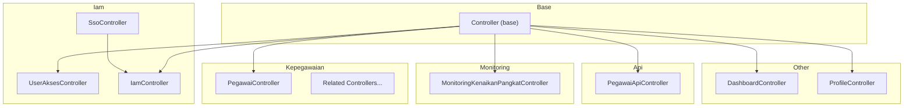
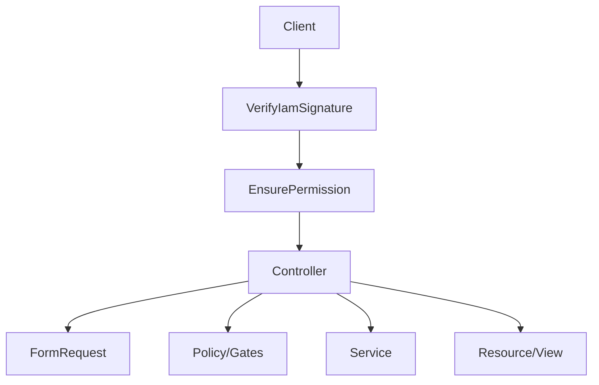
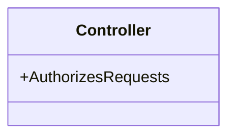
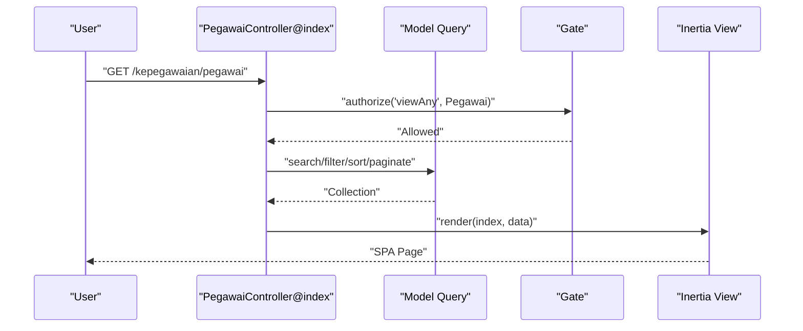
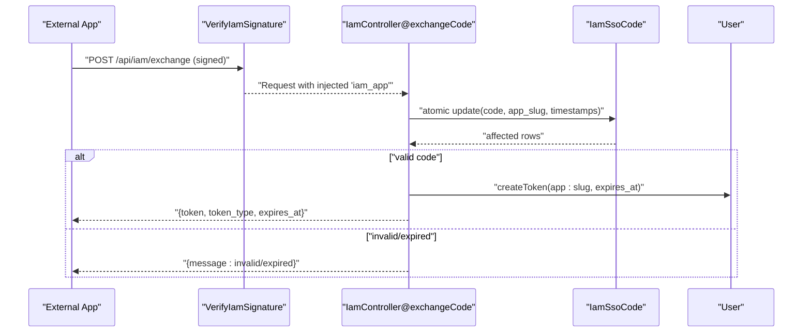
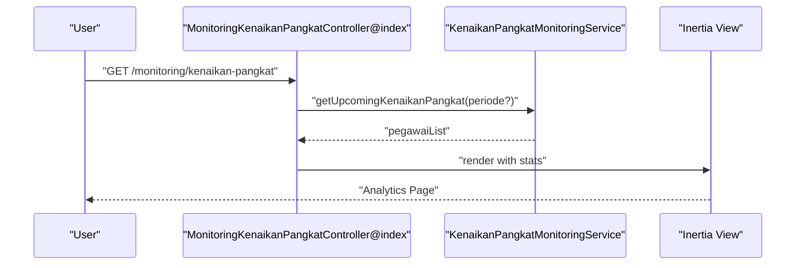
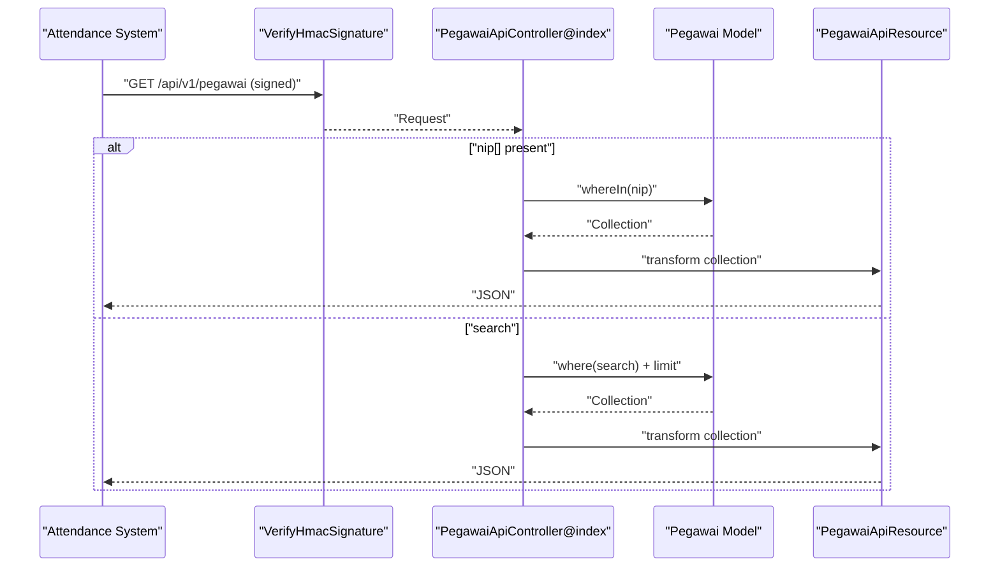
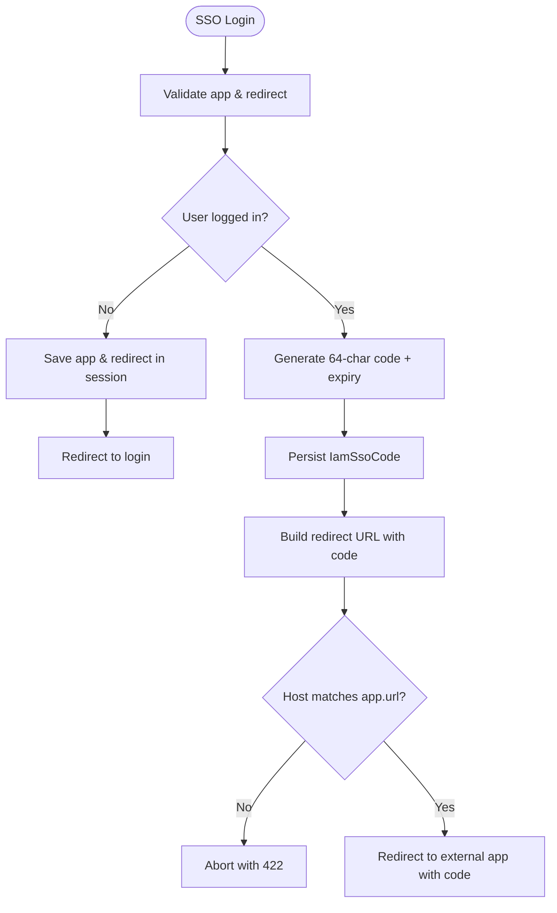
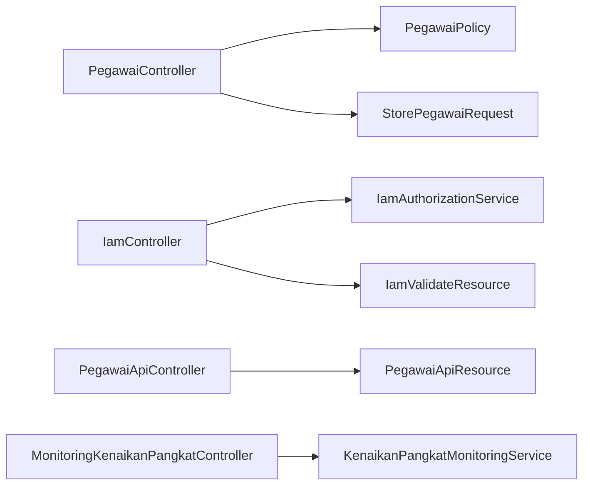

# Controller Layer

<cite>
**Referenced Files in This Document**
- [Controller.php](file://app/Http/Controllers/Controller.php)
- [PegawaiController.php](file://app/Http/Controllers/Kepegawaian/PegawaiController.php)
- [UserAksesController.php](file://app/Http/Controllers/Iam/UserAksesController.php)
- [MonitoringKenaikanPangkatController.php](file://app/Http/Controllers/Monitoring/MonitoringKenaikanPangkatController.php)
- [IamController.php](file://app/Http/Controllers/Api/IamController.php)
- [PegawaiApiController.php](file://app/Http/Controllers/Api/PegawaiApiController.php)
- [StorePegawaiRequest.php](file://app/Http/Requests/Kepegawaian/StorePegawaiRequest.php)
- [VerifyIamSignature.php](file://app/Http/Middleware/VerifyIamSignature.php)
- [EnsurePermission.php](file://app/Http/Middleware/EnsurePermission.php)
- [IamValidateResource.php](file://app/Http/Resources/IamValidateResource.php)
- [IamAuthorizationService.php](file://app/Services/IamAuthorizationService.php)
- [PegawaiPolicy.php](file://app/Policies/PegawaiPolicy.php)
- [DashboardController.php](file://app/Http/Controllers/DashboardController.php)
- [ProfileController.php](file://app/Http/Controllers/Settings/ProfileController.php)
- [SsoController.php](file://app/Http/Controllers/SsoController.php)
</cite>

## Table of Contents
1. [Introduction](#introduction)
2. [Project Structure](#project-structure)
3. [Core Components](#core-components)
4. [Architecture Overview](#architecture-overview)
5. [Detailed Component Analysis](#detailed-component-analysis)
6. [Dependency Analysis](#dependency-analysis)
7. [Performance Considerations](#performance-considerations)
8. [Troubleshooting Guide](#troubleshooting-guide)
9. [Conclusion](#conclusion)

## Introduction
This document explains the Controller Layer of the Laravel application, focusing on implementation patterns, request handling, response formatting, and authorization integration. It documents the controller hierarchy across Kepegawaian (employee management), Iam (identity and access management), Monitoring (analytics), and Api (external integration) domains. It also covers middleware integration, service-layer collaboration, policy enforcement, and resource transformation patterns, with concrete examples drawn from the codebase.

## Project Structure
Controllers are organized by feature domains under app/Http/Controllers:
- Base controller class provides shared authorization capabilities.
- Kepegawaian controllers manage employee records and related histories.
- Iam controllers handle identity access and role assignments.
- Monitoring controllers expose analytical dashboards.
- Api controllers serve external systems with secure endpoints.
- Additional controllers support dashboard, settings, and SSO flows.

**Diagram sources**
- [Controller.php:1-11](file://app/Http/Controllers/Controller.php#L1-L11)
- [PegawaiController.php:1-224](file://app/Http/Controllers/Kepegawaian/PegawaiController.php#L1-L224)
- [UserAksesController.php:1-50](file://app/Http/Controllers/Iam/UserAksesController.php#L1-L50)
- [IamController.php:1-91](file://app/Http/Controllers/Api/IamController.php#L1-L91)
- [MonitoringKenaikanPangkatController.php:1-32](file://app/Http/Controllers/Monitoring/MonitoringKenaikanPangkatController.php#L1-L32)
- [PegawaiApiController.php:1-112](file://app/Http/Controllers/Api/PegawaiApiController.php#L1-L112)
- [DashboardController.php:1-19](file://app/Http/Controllers/DashboardController.php#L1-L19)
- [ProfileController.php:1-61](file://app/Http/Controllers/Settings/ProfileController.php#L1-L61)
- [SsoController.php:1-85](file://app/Http/Controllers/SsoController.php#L1-L85)

**Section sources**
- [Controller.php:1-11](file://app/Http/Controllers/Controller.php#L1-L11)
- [PegawaiController.php:1-224](file://app/Http/Controllers/Kepegawaian/PegawaiController.php#L1-L224)
- [UserAksesController.php:1-50](file://app/Http/Controllers/Iam/UserAksesController.php#L1-L50)
- [IamController.php:1-91](file://app/Http/Controllers/Api/IamController.php#L1-L91)
- [MonitoringKenaikanPangkatController.php:1-32](file://app/Http/Controllers/Monitoring/MonitoringKenaikanPangkatController.php#L1-L32)
- [PegawaiApiController.php:1-112](file://app/Http/Controllers/Api/PegawaiApiController.php#L1-L112)
- [DashboardController.php:1-19](file://app/Http/Controllers/DashboardController.php#L1-L19)
- [ProfileController.php:1-61](file://app/Http/Controllers/Settings/ProfileController.php#L1-L61)
- [SsoController.php:1-85](file://app/Http/Controllers/SsoController.php#L1-L85)

## Core Components
- Base controller: Provides authorization capabilities via AuthorizesRequests trait.
- Domain controllers:
  - Kepegawaian: Employee CRUD, filtering, sorting, and paginated listings.
  - Iam: Role assignment, permission checks, and SSO token exchange.
  - Monitoring: Analytics dashboards powered by service-layer queries.
  - Api: Secure endpoints for external integrations with HMAC verification and resource transformation.
- Request validation: Strong-typed FormRequest classes encapsulate authorization and validation rules.
- Middleware: Signature verification, permission gating, and request shaping.
- Policies: Authorization decisions for domain resources.
- Resource transformation: JSON resources for API responses.

**Section sources**
- [Controller.php:1-11](file://app/Http/Controllers/Controller.php#L1-L11)
- [PegawaiController.php:1-224](file://app/Http/Controllers/Kepegawaian/PegawaiController.php#L1-L224)
- [UserAksesController.php:1-50](file://app/Http/Controllers/Iam/UserAksesController.php#L1-L50)
- [MonitoringKenaikanPangkatController.php:1-32](file://app/Http/Controllers/Monitoring/MonitoringKenaikanPangkatController.php#L1-L32)
- [IamController.php:1-91](file://app/Http/Controllers/Api/IamController.php#L1-L91)
- [PegawaiApiController.php:1-112](file://app/Http/Controllers/Api/PegawaiApiController.php#L1-L112)
- [StorePegawaiRequest.php:1-51](file://app/Http/Requests/Kepegawaian/StorePegawaiRequest.php#L1-L51)
- [VerifyIamSignature.php:1-61](file://app/Http/Middleware/VerifyIamSignature.php#L1-L61)
- [EnsurePermission.php:1-37](file://app/Http/Middleware/EnsurePermission.php#L1-L37)
- [IamValidateResource.php:1-19](file://app/Http/Resources/IamValidateResource.php#L1-L19)
- [IamAuthorizationService.php:1-45](file://app/Services/IamAuthorizationService.php#L1-L45)
- [PegawaiPolicy.php:1-34](file://app/Policies/PegawaiPolicy.php#L1-L34)

## Architecture Overview
The Controller Layer follows a layered pattern:
- Controllers orchestrate requests, delegate to services for business logic, and transform results into responses.
- Authorization is enforced via policies and gates, and optionally via middleware.
- Requests are validated using FormRequest classes, which also enforce authorization.
- Responses are formatted using Inertia for SPA rendering or JSON resources for APIs.

**Diagram sources**
- [VerifyIamSignature.php:1-61](file://app/Http/Middleware/VerifyIamSignature.php#L1-L61)
- [EnsurePermission.php:1-37](file://app/Http/Middleware/EnsurePermission.php#L1-L37)
- [PegawaiController.php:1-224](file://app/Http/Controllers/Kepegawaian/PegawaiController.php#L1-L224)
- [StorePegawaiRequest.php:1-51](file://app/Http/Requests/Kepegawaian/StorePegawaiRequest.php#L1-L51)
- [PegawaiPolicy.php:1-34](file://app/Policies/PegawaiPolicy.php#L1-L34)
- [IamController.php:1-91](file://app/Http/Controllers/Api/IamController.php#L1-L91)
- [IamAuthorizationService.php:1-45](file://app/Services/IamAuthorizationService.php#L1-L45)
- [IamValidateResource.php:1-19](file://app/Http/Resources/IamValidateResource.php#L1-L19)

## Detailed Component Analysis

### Base Controller
- Purpose: Centralizes authorization capabilities for all controllers.
- Pattern: Minimal base class extending the framework’s base with AuthorizesRequests.

**Diagram sources**
- [Controller.php:1-11](file://app/Http/Controllers/Controller.php#L1-L11)

**Section sources**
- [Controller.php:1-11](file://app/Http/Controllers/Controller.php#L1-L11)

### Kepegawaian: Employee Management (PegawaiController)
- Responsibilities:
  - Index: Paginated listing with search, filters, and dynamic sorts across related references.
  - Create/Edit: Render forms with reference data and enum options.
  - Store/Update: Persist validated data; optional password updates.
  - Show: Load comprehensive related history for display.
  - Destroy: Soft-delete and redirect.
- Authorization:
  - Uses Gate::authorize for action-level checks.
  - Policies define permission slugs for each action.
- Request validation:
  - StorePegawaiRequest authorizes and validates creation inputs.
- Response:
  - Uses Inertia::render for SPA views.

**Diagram sources**
- [PegawaiController.php:25-113](file://app/Http/Controllers/Kepegawaian/PegawaiController.php#L25-L113)
- [PegawaiPolicy.php:1-34](file://app/Policies/PegawaiPolicy.php#L1-L34)

**Section sources**
- [PegawaiController.php:1-224](file://app/Http/Controllers/Kepegawaian/PegawaiController.php#L1-L224)
- [PegawaiPolicy.php:1-34](file://app/Policies/PegawaiPolicy.php#L1-L34)
- [StorePegawaiRequest.php:1-51](file://app/Http/Requests/Kepegawaian/StorePegawaiRequest.php#L1-L51)

### Iam: Identity Access Management
- UserAksesController:
  - Lists users with IAM roles and applications.
  - Shows role assignments and available apps.
  - Assigns roles and removes assignments.
- IamController:
  - Validates current user and returns roles/permissions scoped to the requesting application.
  - Checks a specific permission against the user’s permissions.
  - Logs out current token.
  - Exchanges a short-lived SSO code for a scoped personal access token with HMAC verification middleware.
- Authorization:
  - Policies and gates guard domain actions.
  - IamAuthorizationService centralizes permission/role retrieval.
- Middleware:
  - VerifyIamSignature validates HMAC signatures and injects application context.
  - EnsurePermission enforces permission presence for protected routes.

**Diagram sources**
- [IamController.php:53-89](file://app/Http/Controllers/Api/IamController.php#L53-L89)
- [VerifyIamSignature.php:15-59](file://app/Http/Middleware/VerifyIamSignature.php#L15-L59)

**Section sources**
- [UserAksesController.php:1-50](file://app/Http/Controllers/Iam/UserAksesController.php#L1-L50)
- [IamController.php:1-91](file://app/Http/Controllers/Api/IamController.php#L1-L91)
- [IamAuthorizationService.php:1-45](file://app/Services/IamAuthorizationService.php#L1-L45)
- [VerifyIamSignature.php:1-61](file://app/Http/Middleware/VerifyIamSignature.php#L1-L61)
- [EnsurePermission.php:1-37](file://app/Http/Middleware/EnsurePermission.php#L1-L37)

### Monitoring: Analytics Dashboards
- MonitoringKenaikanPangkatController:
  - Accepts a period parameter.
  - Delegates to KenaikanPangkatMonitoringService to compute upcoming promotions.
  - Renders an Inertia view with stats and lists.

**Diagram sources**
- [MonitoringKenaikanPangkatController.php:11-31](file://app/Http/Controllers/Monitoring/MonitoringKenaikanPangkatController.php#L11-L31)

**Section sources**
- [MonitoringKenaikanPangkatController.php:1-32](file://app/Http/Controllers/Monitoring/MonitoringKenaikanPangkatController.php#L1-L32)

### Api: External Integrations
- IamController:
  - validate: Returns user profile, roles, permissions, and token expiry.
  - check: Verifies a requested permission against the user’s permissions.
  - logout: Revokes current token.
  - exchangeCode: Atomic code redemption and scoped token issuance.
- PegawaiApiController:
  - show: Single NIP lookup with 404 handling.
  - index: Supports batch NIPs (priority) or search with status and pagination.
  - Uses resource transformation for API responses.

**Diagram sources**
- [PegawaiApiController.php:52-110](file://app/Http/Controllers/Api/PegawaiApiController.php#L52-L110)

**Section sources**
- [IamController.php:1-91](file://app/Http/Controllers/Api/IamController.php#L1-L91)
- [IamValidateResource.php:1-19](file://app/Http/Resources/IamValidateResource.php#L1-L19)
- [PegawaiApiController.php:1-112](file://app/Http/Controllers/Api/PegawaiApiController.php#L1-L112)

### Supporting Controllers
- DashboardController: Orchestrates dashboard statistics via a service.
- ProfileController: Handles profile updates and deletion with request validation.
- SsoController: Manages SSO login initiation, callback, and code generation with strict redirect host validation.

**Diagram sources**
- [SsoController.php:15-83](file://app/Http/Controllers/SsoController.php#L15-L83)

**Section sources**
- [DashboardController.php:1-19](file://app/Http/Controllers/DashboardController.php#L1-L19)
- [ProfileController.php:1-61](file://app/Http/Controllers/Settings/ProfileController.php#L1-L61)
- [SsoController.php:1-85](file://app/Http/Controllers/SsoController.php#L1-L85)

## Dependency Analysis
- Controller-to-Service:
  - Monitoring controllers depend on dedicated services for analytics computations.
- Controller-to-Policy/Gates:
  - Kepegawaian controllers use Gate::authorize and policies for fine-grained checks.
- Controller-to-Request:
  - Strong-typed FormRequest classes encapsulate validation and authorization.
- Controller-to-Middleware:
  - Api endpoints rely on VerifyIamSignature for HMAC verification and EnsurePermission for permission checks.
- Controller-to-Resource:
  - Api controllers transform models into JSON resources for consistent payloads.

**Diagram sources**
- [PegawaiController.php:1-224](file://app/Http/Controllers/Kepegawaian/PegawaiController.php#L1-L224)
- [PegawaiPolicy.php:1-34](file://app/Policies/PegawaiPolicy.php#L1-L34)
- [StorePegawaiRequest.php:1-51](file://app/Http/Requests/Kepegawaian/StorePegawaiRequest.php#L1-L51)
- [IamController.php:1-91](file://app/Http/Controllers/Api/IamController.php#L1-L91)
- [IamAuthorizationService.php:1-45](file://app/Services/IamAuthorizationService.php#L1-L45)
- [IamValidateResource.php:1-19](file://app/Http/Resources/IamValidateResource.php#L1-L19)
- [PegawaiApiController.php:1-112](file://app/Http/Controllers/Api/PegawaiApiController.php#L1-L112)
- [MonitoringKenaikanPangkatController.php:1-32](file://app/Http/Controllers/Monitoring/MonitoringKenaikanPangkatController.php#L1-L32)

**Section sources**
- [PegawaiController.php:1-224](file://app/Http/Controllers/Kepegawaian/PegawaiController.php#L1-L224)
- [IamController.php:1-91](file://app/Http/Controllers/Api/IamController.php#L1-L91)
- [IamAuthorizationService.php:1-45](file://app/Services/IamAuthorizationService.php#L1-L45)
- [IamValidateResource.php:1-19](file://app/Http/Resources/IamValidateResource.php#L1-L19)
- [PegawaiApiController.php:1-112](file://app/Http/Controllers/Api/PegawaiApiController.php#L1-L112)
- [MonitoringKenaikanPangkatController.php:1-32](file://app/Http/Controllers/Monitoring/MonitoringKenaikanPangkatController.php#L1-L32)

## Performance Considerations
- Eager loading: Controllers load related models to avoid N+1 queries (e.g., PegawaiController loads multiple relations).
- Pagination: Index endpoints paginate results to limit memory and response size.
- Selectivity: Queries filter by indexed/frequent filters (e.g., unit, status, jabatan, pangkat).
- Atomic operations: Api token exchange uses a single atomic update to prevent race conditions.
- Resource transformation: API controllers use resource classes to minimize payload size and normalize data.

[No sources needed since this section provides general guidance]

## Troubleshooting Guide
- Unauthorized access:
  - Ensure policies grant required permissions and Gate::authorize is invoked for actions.
  - Confirm middleware EnsurePermission is applied to routes requiring permissions.
- Signature validation failures:
  - Verify X-App-Key, X-Timestamp, and X-Signature headers are present and within the allowed window.
  - Confirm application is active and secret decryption succeeds.
- Token exchange errors:
  - Check code validity, app slug, usage, and expiration before redemption.
  - Ensure transaction wraps the update and token creation.
- SSO redirect host mismatch:
  - Validate redirect URL host matches the registered application host.
- Request validation errors:
  - Review FormRequest rules and messages for precise error reporting.

**Section sources**
- [PegawaiPolicy.php:1-34](file://app/Policies/PegawaiPolicy.php#L1-L34)
- [EnsurePermission.php:1-37](file://app/Http/Middleware/EnsurePermission.php#L1-L37)
- [VerifyIamSignature.php:1-61](file://app/Http/Middleware/VerifyIamSignature.php#L1-L61)
- [IamController.php:53-89](file://app/Http/Controllers/Api/IamController.php#L53-L89)
- [SsoController.php:60-83](file://app/Http/Controllers/SsoController.php#L60-L83)
- [StorePegawaiRequest.php:1-51](file://app/Http/Requests/Kepegawaian/StorePegawaiRequest.php#L1-L51)

## Conclusion
The Controller Layer demonstrates robust Laravel patterns: centralized authorization, strong request validation, service-driven business logic, and consistent response formatting. The Kepegawaian controllers provide comprehensive employee management with rich filtering and pagination. Iam controllers integrate secure identity workflows with middleware-based signature verification and scoped token issuance. Monitoring controllers deliver analytics insights via services, while Api controllers enable secure external integrations with resource transformation and atomic operations.