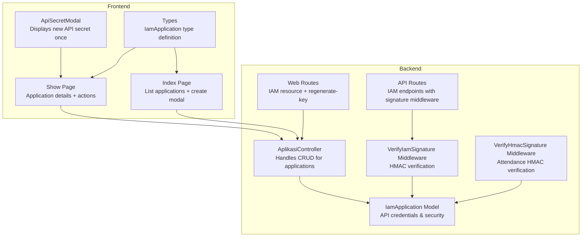
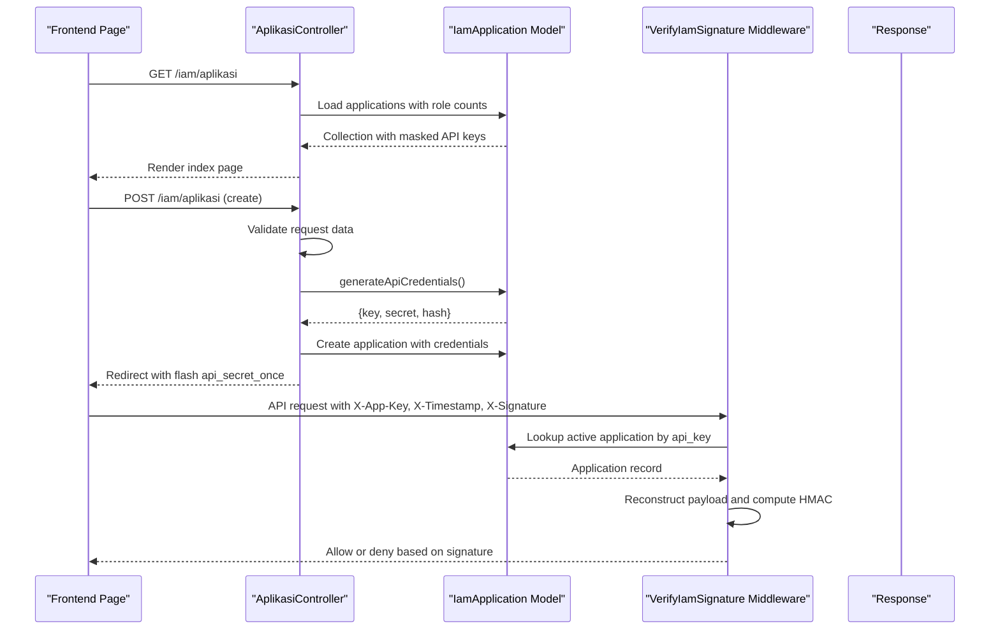
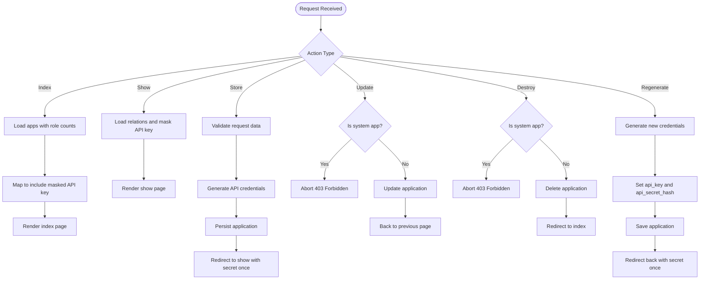
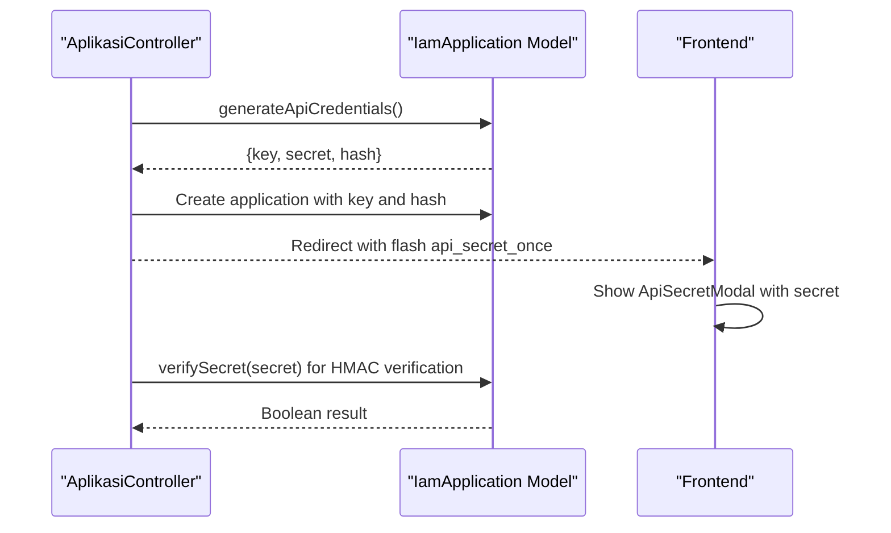
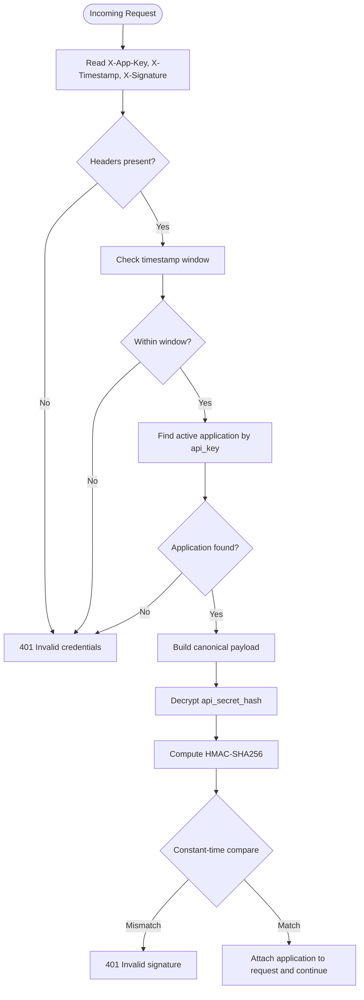
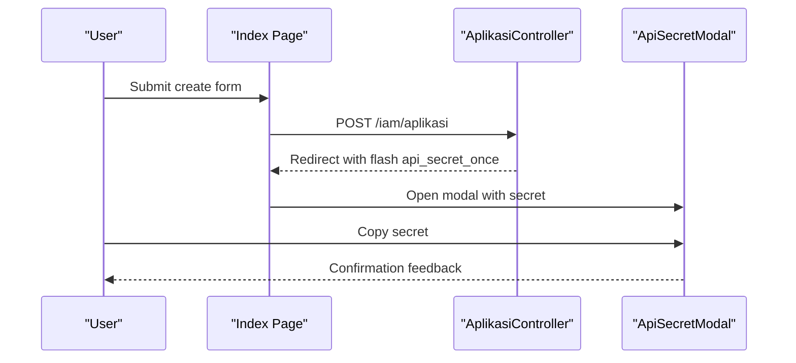
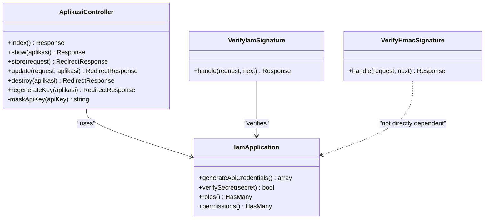

# Application Management Controller

<cite>
**Referenced Files in This Document**
- [AplikasiController.php](file://app/Http/Controllers/Iam/AplikasiController.php)
- [IamApplication.php](file://app/Models/IamApplication.php)
- [VerifyIamSignature.php](file://app/Http/Middleware/VerifyIamSignature.php)
- [VerifyHmacSignature.php](file://app/Http/Middleware/VerifyHmacSignature.php)
- [web.php](file://routes/web.php)
- [api.php](file://routes/api.php)
- [index.tsx](file://resources/js/pages/iam/aplikasi/index.tsx)
- [show.tsx](file://resources/js/pages/iam/aplikasi/show.tsx)
- [ApiSecretModal.tsx](file://resources/js/components/iam/ApiSecretModal.tsx)
- [iam.ts](file://resources/js/types/iam.ts)
- [AplikasiControllerTest.php](file://tests/Feature/Iam/AplikasiControllerTest.php)
</cite>

## Table of Contents
1. [Introduction](#introduction)
2. [Project Structure](#project-structure)
3. [Core Components](#core-components)
4. [Architecture Overview](#architecture-overview)
5. [Detailed Component Analysis](#detailed-component-analysis)
6. [Dependency Analysis](#dependency-analysis)
7. [Performance Considerations](#performance-considerations)
8. [Troubleshooting Guide](#troubleshooting-guide)
9. [Conclusion](#conclusion)

## Introduction
This document provides comprehensive technical documentation for the Application Management Controller responsible for IAM application registration and management. It covers the complete CRUD lifecycle for applications, including creation with API key generation, display with masked API keys, updates with validation, and deletion with system application protection. It also explains the API credential generation process, HMAC signature verification patterns, and security considerations for API key handling. The guide includes concrete examples of controller methods, request validation rules, response formatting, and integration with frontend application management interfaces. Special attention is given to the maskApiKey utility method, system application restrictions, and proper error handling for unauthorized operations.

## Project Structure
The Application Management feature spans backend controllers, models, middleware, routing, and frontend pages/components. The controller orchestrates application lifecycle operations, while the model manages API credentials and security-related fields. Middleware enforces signature verification for secure API communication. Frontend pages integrate with the backend to present forms, lists, and modals for managing applications.

**Diagram sources**
- [AplikasiController.php:11-129](file://app/Http/Controllers/Iam/AplikasiController.php#L11-L129)
- [IamApplication.php:12-96](file://app/Models/IamApplication.php#L12-L96)
- [VerifyIamSignature.php:15-61](file://app/Http/Middleware/VerifyIamSignature.php#L15-L61)
- [VerifyHmacSignature.php:25-65](file://app/Http/Middleware/VerifyHmacSignature.php#L25-L65)
- [web.php:114-136](file://routes/web.php#L114-L136)
- [api.php:33-47](file://routes/api.php#L33-L47)
- [index.tsx:47-433](file://resources/js/pages/iam/aplikasi/index.tsx#L47-L433)
- [show.tsx:52-804](file://resources/js/pages/iam/aplikasi/show.tsx#L52-L804)
- [ApiSecretModal.tsx:17-55](file://resources/js/components/iam/ApiSecretModal.tsx#L17-L55)
- [iam.ts:3-17](file://resources/js/types/iam.ts#L3-L17)

**Section sources**
- [AplikasiController.php:11-129](file://app/Http/Controllers/Iam/AplikasiController.php#L11-L129)
- [web.php:114-136](file://routes/web.php#L114-L136)

## Core Components
- Application Management Controller: Implements index, show, store, update, destroy, and regenerateKey methods. It masks API keys for display, validates inputs, enforces system application protection, and integrates with frontend flows.
- IamApplication Model: Manages fillable fields, hidden sensitive fields, automatic credential generation during creation, and provides methods to generate credentials and verify secrets.
- Signature Verification Middleware: Enforces HMAC-SHA256 signature verification for IAM API endpoints with timestamp validation and secure payload reconstruction.
- Frontend Pages and Components: Provide forms for creating applications, displaying application details, and showing the newly generated API secret once.

**Section sources**
- [AplikasiController.php:13-129](file://app/Http/Controllers/Iam/AplikasiController.php#L13-L129)
- [IamApplication.php:16-96](file://app/Models/IamApplication.php#L16-L96)
- [VerifyIamSignature.php:15-61](file://app/Http/Middleware/VerifyIamSignature.php#L15-L61)
- [index.tsx:47-433](file://resources/js/pages/iam/aplikasi/index.tsx#L47-L433)
- [show.tsx:52-804](file://resources/js/pages/iam/aplikasi/show.tsx#L52-L804)
- [ApiSecretModal.tsx:17-55](file://resources/js/components/iam/ApiSecretModal.tsx#L17-L55)

## Architecture Overview
The system follows a layered architecture:
- Presentation Layer: Inertia pages render application management UI and handle user interactions.
- Controller Layer: AplikasiController coordinates business logic and delegates to the model.
- Domain Layer: IamApplication encapsulates application data, API credential lifecycle, and security checks.
- Infrastructure Layer: Middleware verifies signatures and timestamps for secure API communication.
- Routing Layer: Web routes define resource endpoints and special actions; API routes apply middleware for signature verification.

**Diagram sources**
- [AplikasiController.php:13-129](file://app/Http/Controllers/Iam/AplikasiController.php#L13-L129)
- [IamApplication.php:72-96](file://app/Models/IamApplication.php#L72-L96)
- [VerifyIamSignature.php:15-61](file://app/Http/Middleware/VerifyIamSignature.php#L15-L61)
- [web.php:114-136](file://routes/web.php#L114-L136)
- [api.php:33-47](file://routes/api.php#L33-L47)

## Detailed Component Analysis

### Application Management Controller (CRUD Operations)
- Index: Loads applications with role counts, maps each to include a masked API key, and renders the index page.
- Show: Loads application relations, masks the API key for display, and renders the show page.
- Store: Validates input fields, generates API credentials via the model, persists the application, and redirects to the show page with the new API secret shown once.
- Update: Prevents modification of system applications, validates fields, and updates the application.
- Destroy: Prevents deletion of system applications and deletes the application.
- Regenerate Key: Generates new API credentials, sets sensitive fields manually (not mass-assignable), saves, and shows the new secret once.

**Diagram sources**
- [AplikasiController.php:13-129](file://app/Http/Controllers/Iam/AplikasiController.php#L13-L129)

**Section sources**
- [AplikasiController.php:13-129](file://app/Http/Controllers/Iam/AplikasiController.php#L13-L129)
- [AplikasiControllerTest.php:37-79](file://tests/Feature/Iam/AplikasiControllerTest.php#L37-L79)

### API Credential Generation and Secret Handling
- Credential Generation: The model generates a unique API key and a random secret, then stores a reversible encrypted hash of the secret for verification.
- Secret Exposure: The secret is returned once after creation and is not persisted in plaintext; it is shown in a modal and then only available temporarily in the frontend state.
- Verification: The model provides a method to verify a plaintext secret against the stored encrypted hash using constant-time comparison.

**Diagram sources**
- [IamApplication.php:72-96](file://app/Models/IamApplication.php#L72-L96)
- [AplikasiController.php:50-61](file://app/Http/Controllers/Iam/AplikasiController.php#L50-L61)
- [ApiSecretModal.tsx:17-55](file://resources/js/components/iam/ApiSecretModal.tsx#L17-L55)

**Section sources**
- [IamApplication.php:72-96](file://app/Models/IamApplication.php#L72-L96)
- [AplikasiController.php:50-61](file://app/Http/Controllers/Iam/AplikasiController.php#L50-L61)

### HMAC Signature Verification Patterns
- Payload Construction: The middleware reconstructs a canonical payload combining HTTP method, path, sorted query string, body SHA-256 digest, and timestamp.
- Signature Verification: Computes HMAC-SHA256 using the decrypted secret and compares it to the received signature using constant-time comparison.
- Timestamp Validation: Rejects requests outside a fixed time window to prevent replay attacks.
- Active Application Check: Ensures the application is active and exists before verifying the signature.

**Diagram sources**
- [VerifyIamSignature.php:15-61](file://app/Http/Middleware/VerifyIamSignature.php#L15-L61)
- [IamApplication.php:85-96](file://app/Models/IamApplication.php#L85-L96)

**Section sources**
- [VerifyIamSignature.php:15-61](file://app/Http/Middleware/VerifyIamSignature.php#L15-L61)
- [IamApplication.php:85-96](file://app/Models/IamApplication.php#L85-L96)

### Frontend Integration and User Experience
- Index Page: Displays a table of applications with role counts, status badges, and action buttons. Includes a modal to create new applications and a confirmation dialog for deletions. Shows the newly generated API secret once via a modal.
- Show Page: Presents application details, including masked API key display, role and permission management, and controls to regenerate keys and manage nested resources.
- Modal Component: Provides a one-time display of the API secret with copy-to-clipboard functionality.

**Diagram sources**
- [index.tsx:47-433](file://resources/js/pages/iam/aplikasi/index.tsx#L47-L433)
- [show.tsx:52-804](file://resources/js/pages/iam/aplikasi/show.tsx#L52-L804)
- [ApiSecretModal.tsx:17-55](file://resources/js/components/iam/ApiSecretModal.tsx#L17-L55)
- [AplikasiController.php:58-61](file://app/Http/Controllers/Iam/AplikasiController.php#L58-L61)

**Section sources**
- [index.tsx:47-433](file://resources/js/pages/iam/aplikasi/index.tsx#L47-L433)
- [show.tsx:52-804](file://resources/js/pages/iam/aplikasi/show.tsx#L52-L804)
- [ApiSecretModal.tsx:17-55](file://resources/js/components/iam/ApiSecretModal.tsx#L17-L55)

### Security Considerations and Best Practices
- System Application Protection: Updates and deletions are blocked for system applications to prevent tampering with core services.
- Masked Display: API keys are masked when rendered in the UI to avoid accidental exposure.
- Secure Storage: Secrets are stored as encrypted hashes that can be decrypted for HMAC verification, ensuring integrity without exposing plaintext.
- Constant-Time Comparison: Signature verification uses constant-time comparison to mitigate timing attacks.
- Timestamp Window: Middleware enforces a strict timestamp window to prevent replay attacks.
- Route-Level Guards: Web routes restrict access to authorized users with IAM permissions; API routes enforce signature verification and rate limiting.

**Section sources**
- [AplikasiController.php:65-90](file://app/Http/Controllers/Iam/AplikasiController.php#L65-L90)
- [IamApplication.php:24-26](file://app/Models/IamApplication.php#L24-L26)
- [VerifyIamSignature.php:25-27](file://app/Http/Middleware/VerifyIamSignature.php#L25-L27)
- [web.php:114-136](file://routes/web.php#L114-L136)
- [api.php:33-47](file://routes/api.php#L33-L47)

## Dependency Analysis
The controller depends on the model for credential generation and verification, and relies on middleware for secure API access. Frontend pages depend on typed interfaces and shared components for consistent UX and data handling.

**Diagram sources**
- [AplikasiController.php:11-129](file://app/Http/Controllers/Iam/AplikasiController.php#L11-L129)
- [IamApplication.php:12-96](file://app/Models/IamApplication.php#L12-L96)
- [VerifyIamSignature.php:11-61](file://app/Http/Middleware/VerifyIamSignature.php#L11-L61)
- [VerifyHmacSignature.php:17-65](file://app/Http/Middleware/VerifyHmacSignature.php#L17-L65)

**Section sources**
- [AplikasiController.php:11-129](file://app/Http/Controllers/Iam/AplikasiController.php#L11-L129)
- [IamApplication.php:12-96](file://app/Models/IamApplication.php#L12-L96)
- [VerifyIamSignature.php:11-61](file://app/Http/Middleware/VerifyIamSignature.php#L11-L61)
- [VerifyHmacSignature.php:17-65](file://app/Http/Middleware/VerifyHmacSignature.php#L17-L65)

## Performance Considerations
- Query Efficiency: The index action uses eager loading with count aggregation to minimize N+1 queries and reduce rendering overhead.
- Minimal Data Transfer: The model hides sensitive fields from JSON responses, reducing payload sizes.
- Middleware Overhead: Signature verification adds computational cost; ensure appropriate server capacity and consider caching where feasible.
- Frontend Rendering: Masking and conditional UI elements are handled efficiently with React memoization and controlled components.

[No sources needed since this section provides general guidance]

## Troubleshooting Guide
Common issues and resolutions:
- Unauthorized Access: Ensure the user has the required IAM permission; otherwise, access is denied.
- System Application Modifications: Attempts to update or delete system applications are blocked with a 403 error.
- Missing Signature Headers: API requests missing required headers are rejected with 401.
- Expired Timestamp: Requests outside the allowed time window are rejected with 401.
- Invalid Signature: Signature mismatch triggers 401; verify payload construction and secret alignment.
- API Secret Exposure: The secret is shown only once after creation; re-generate if needed.

**Section sources**
- [AplikasiController.php:65-90](file://app/Http/Controllers/Iam/AplikasiController.php#L65-L90)
- [VerifyIamSignature.php:21-27](file://app/Http/Middleware/VerifyIamSignature.php#L21-L27)
- [AplikasiControllerTest.php:51-57](file://tests/Feature/Iam/AplikasiControllerTest.php#L51-L57)

## Conclusion
The Application Management Controller provides a secure, user-friendly interface for registering and managing IAM applications. It enforces system application protection, handles API credential generation and verification, and integrates seamlessly with frontend components for a smooth user experience. The middleware ensures robust signature verification and timestamp validation, while the model encapsulates security-sensitive operations. Together, these components deliver a reliable foundation for application lifecycle management within the IAM ecosystem.