# IAM Controllers

<cite>
**Referenced Files in This Document**
- [AplikasiController.php](file://app/Http/Controllers/Iam/AplikasiController.php)
- [PermissionController.php](file://app/Http/Controllers/Iam/PermissionController.php)
- [RoleController.php](file://app/Http/Controllers/Iam/RoleController.php)
- [UserAksesController.php](file://app/Http/Controllers/Iam/UserAksesController.php)
- [VerifyIamSignature.php](file://app/Http/Middleware/VerifyIamSignature.php)
- [VerifyIamPermission.php](file://app/Http/Middleware/VerifyIamPermission.php)
- [VerifyHmacSignature.php](file://app/Http/Middleware/VerifyHmacSignature.php)
- [IamApplication.php](file://app/Models/IamApplication.php)
- [IamPermission.php](file://app/Models/IamPermission.php)
- [IamRole.php](file://app/Models/IamRole.php)
- [IamUserRole.php](file://app/Models/IamUserRole.php)
- [IamSsoCode.php](file://app/Models/IamSsoCode.php)
- [IamAuthorizationService.php](file://app/Services/IamAuthorizationService.php)
- [SsoController.php](file://app/Http/Controllers/SsoController.php)
- [iam.php](file://config/iam.php)
</cite>

## Table of Contents
1. [Introduction](#introduction)
2. [Project Structure](#project-structure)
3. [Core Components](#core-components)
4. [Architecture Overview](#architecture-overview)
5. [Detailed Component Analysis](#detailed-component-analysis)
6. [Dependency Analysis](#dependency-analysis)
7. [Performance Considerations](#performance-considerations)
8. [Troubleshooting Guide](#troubleshooting-guide)
9. [Conclusion](#conclusion)
10. [Appendices](#appendices)

## Introduction
This document explains the Identity and Access Management (IAM) controller implementations in the application. It focuses on four controller groups:
- Application management controller for registering and managing third-party applications and their API credentials
- Permission management controller for defining and scoping permissions per application
- Role management controller for grouping permissions into roles scoped to applications
- User access controller for assigning roles to users and viewing access assignments

It also documents API key generation and secure credential handling, permission assignment mechanisms, user role management, HMAC signature verification, SSO integration patterns, authorization validation, security considerations, audit logging, and integration points with IAM models, service layer, and frontend authentication flows.

## Project Structure
IAM controllers reside under app/Http/Controllers/Iam and integrate with IAM Eloquent models, middleware for signature verification and permission checks, and a dedicated service for authorization computations. SSO integration is handled by a dedicated controller and supporting models.

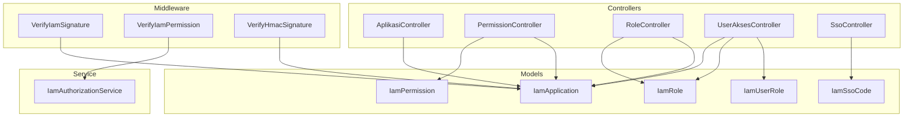

**Diagram sources**
- [AplikasiController.php:11-128](file://app/Http/Controllers/Iam/AplikasiController.php#L11-L128)
- [PermissionController.php:12-51](file://app/Http/Controllers/Iam/PermissionController.php#L12-L51)
- [RoleController.php:12-64](file://app/Http/Controllers/Iam/RoleController.php#L12-L64)
- [UserAksesController.php:14-49](file://app/Http/Controllers/Iam/UserAksesController.php#L14-L49)
- [SsoController.php:13-84](file://app/Http/Controllers/SsoController.php#L13-L84)
- [VerifyIamSignature.php:11-60](file://app/Http/Middleware/VerifyIamSignature.php#L11-L60)
- [VerifyIamPermission.php:12-53](file://app/Http/Middleware/VerifyIamPermission.php#L12-L53)
- [VerifyHmacSignature.php:17-64](file://app/Http/Middleware/VerifyHmacSignature.php#L17-L64)
- [IamApplication.php:12-95](file://app/Models/IamApplication.php#L12-L95)
- [IamPermission.php:9-21](file://app/Models/IamPermission.php#L9-L21)
- [IamRole.php:10-37](file://app/Models/IamRole.php#L10-L37)
- [IamUserRole.php:7-32](file://app/Models/IamUserRole.php#L7-L32)
- [IamSsoCode.php:9-52](file://app/Models/IamSsoCode.php#L9-L52)
- [IamAuthorizationService.php:7-44](file://app/Services/IamAuthorizationService.php#L7-L44)

**Section sources**
- [AplikasiController.php:11-128](file://app/Http/Controllers/Iam/AplikasiController.php#L11-L128)
- [PermissionController.php:12-51](file://app/Http/Controllers/Iam/PermissionController.php#L12-L51)
- [RoleController.php:12-64](file://app/Http/Controllers/Iam/RoleController.php#L12-L64)
- [UserAksesController.php:14-49](file://app/Http/Controllers/Iam/UserAksesController.php#L14-L49)
- [SsoController.php:13-84](file://app/Http/Controllers/SsoController.php#L13-L84)
- [VerifyIamSignature.php:11-60](file://app/Http/Middleware/VerifyIamSignature.php#L11-L60)
- [VerifyIamPermission.php:12-53](file://app/Http/Middleware/VerifyIamPermission.php#L12-L53)
- [VerifyHmacSignature.php:17-64](file://app/Http/Middleware/VerifyHmacSignature.php#L17-L64)
- [IamApplication.php:12-95](file://app/Models/IamApplication.php#L12-L95)
- [IamPermission.php:9-21](file://app/Models/IamPermission.php#L9-L21)
- [IamRole.php:10-37](file://app/Models/IamRole.php#L10-L37)
- [IamUserRole.php:7-32](file://app/Models/IamUserRole.php#L7-L32)
- [IamSsoCode.php:9-52](file://app/Models/IamSsoCode.php#L9-L52)
- [IamAuthorizationService.php:7-44](file://app/Services/IamAuthorizationService.php#L7-L44)
- [iam.php:4-8](file://config/iam.php#L4-L8)

## Core Components
- Application management controller
  - Lists applications with masked API keys
  - Shows application details with related roles and permissions
  - Creates new applications with generated API credentials
  - Updates application metadata and activation status
  - Deletes applications with protection against system apps
  - Regenerates API keys and secrets with secure hashing
  - Masks API keys for safe display
- Permission management controller
  - Creates permissions scoped to an application
  - Updates and deletes permissions with IDOR protection
  - Enforces uniqueness of slugs within the application scope
- Role management controller
  - Creates roles scoped to an application with permission attachments
  - Updates roles with permission synchronization
  - Deletes roles with protection against system roles
  - Validates permission IDs belong to the same application
- User access controller
  - Lists users with their IAM roles and applications
  - Shows a user’s access assignments and available active applications
  - Assigns roles to users with audit fields
  - Revokes user roles

**Section sources**
- [AplikasiController.php:13-127](file://app/Http/Controllers/Iam/AplikasiController.php#L13-L127)
- [PermissionController.php:14-50](file://app/Http/Controllers/Iam/PermissionController.php#L14-L50)
- [RoleController.php:14-63](file://app/Http/Controllers/Iam/RoleController.php#L14-L63)
- [UserAksesController.php:16-48](file://app/Http/Controllers/Iam/UserAksesController.php#L16-L48)

## Architecture Overview
IAM controllers coordinate with models, middleware, and a service to enforce authorization and secure integrations. The middleware stack verifies signatures for internal and external integrations, while the service centralizes permission and role resolution for authorization checks.

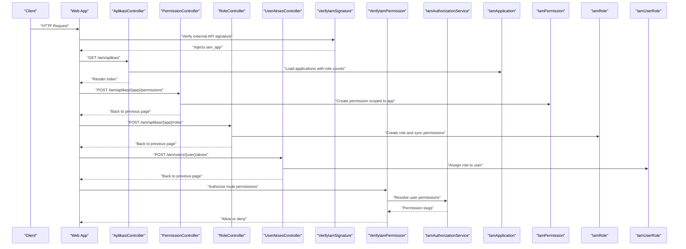

**Diagram sources**
- [AplikasiController.php:13-61](file://app/Http/Controllers/Iam/AplikasiController.php#L13-L61)
- [PermissionController.php:14-25](file://app/Http/Controllers/Iam/PermissionController.php#L14-L25)
- [RoleController.php:14-31](file://app/Http/Controllers/Iam/RoleController.php#L14-L31)
- [UserAksesController.php:33-41](file://app/Http/Controllers/Iam/UserAksesController.php#L33-L41)
- [VerifyIamSignature.php:15-59](file://app/Http/Middleware/VerifyIamSignature.php#L15-L59)
- [VerifyIamPermission.php:16-52](file://app/Http/Middleware/VerifyIamPermission.php#L16-L52)
- [IamAuthorizationService.php:16-43](file://app/Services/IamAuthorizationService.php#L16-L43)
- [IamApplication.php:57-65](file://app/Models/IamApplication.php#L57-L65)
- [IamPermission.php:17-20](file://app/Models/IamPermission.php#L17-L20)
- [IamRole.php:23-36](file://app/Models/IamRole.php#L23-L36)
- [IamUserRole.php:18-26](file://app/Models/IamUserRole.php#L18-L26)

## Detailed Component Analysis

### Application Management Controller
Responsibilities:
- List applications with role counts and masked API keys
- Show application details with nested roles and permissions
- Create applications with generated API key and secret hash
- Update application metadata and activation flag
- Delete applications with system-app protection
- Regenerate API credentials securely and return secret once
- Mask API keys for safe display

Key methods and flows:
- Index: Load applications with role counts, transform to display-friendly structure
- Show: Load roles and permissions, mask API key for display
- Store: Validate input, generate credentials via model factory method, persist, and flash secret once
- Update: Validate input, prevent modification of system apps
- Destroy: Prevent deletion of system apps
- Regenerate key: Generate new credentials, set sensitive fields manually, save, and flash secret once
- Mask API key: Display leading/trailing segments with asterisks

Security and validation:
- API credentials are generated with encryption and hidden from JSON
- System applications are protected from modification and deletion
- API key display masking prevents exposure during UI rendering

**Section sources**
- [AplikasiController.php:13-127](file://app/Http/Controllers/Iam/AplikasiController.php#L13-L127)
- [IamApplication.php:33-50](file://app/Models/IamApplication.php#L33-L50)
- [IamApplication.php:72-79](file://app/Models/IamApplication.php#L72-L79)
- [IamApplication.php:85-94](file://app/Models/IamApplication.php#L85-L94)

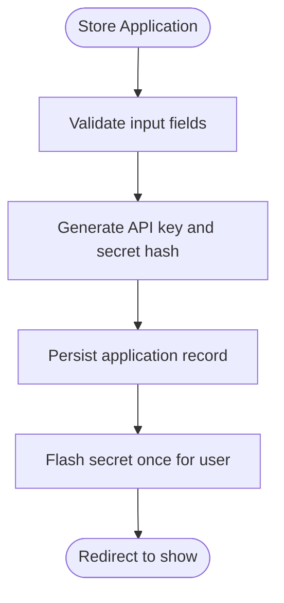

**Diagram sources**
- [AplikasiController.php:41-61](file://app/Http/Controllers/Iam/AplikasiController.php#L41-L61)
- [IamApplication.php:72-79](file://app/Models/IamApplication.php#L72-L79)

### Permission Management Controller
Responsibilities:
- Create permissions scoped to an application with unique slugs
- Update permissions with IDOR protection
- Delete permissions with IDOR protection

Key validations:
- Slug uniqueness scoped to the application
- IDOR checks ensuring permission belongs to the requested application
- Array validation for permission updates

**Section sources**
- [PermissionController.php:14-50](file://app/Http/Controllers/Iam/PermissionController.php#L14-L50)
- [IamPermission.php:17-20](file://app/Models/IamPermission.php#L17-L20)

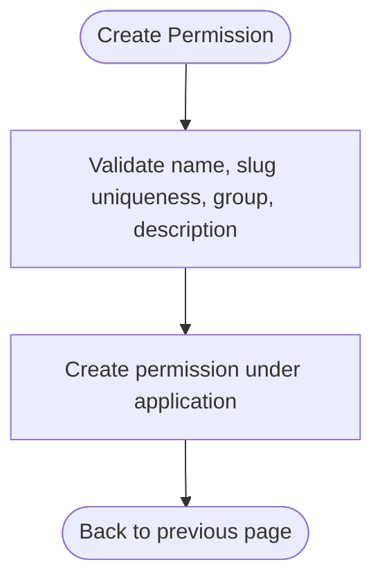

**Diagram sources**
- [PermissionController.php:14-25](file://app/Http/Controllers/Iam/PermissionController.php#L14-L25)
- [IamPermission.php:13-15](file://app/Models/IamPermission.php#L13-L15)

### Role Management Controller
Responsibilities:
- Create roles scoped to an application with optional permission attachments
- Update roles with permission synchronization
- Delete roles with system-role protection
- Validate that permission IDs belong to the same application

Key validations:
- Slug uniqueness scoped to the application
- Permission existence and ownership checks
- System role protection against modification/deletion

**Section sources**
- [RoleController.php:14-63](file://app/Http/Controllers/Iam/RoleController.php#L14-L63)
- [IamRole.php:23-36](file://app/Models/IamRole.php#L23-L36)
- [IamPermission.php:17-20](file://app/Models/IamPermission.php#L17-L20)

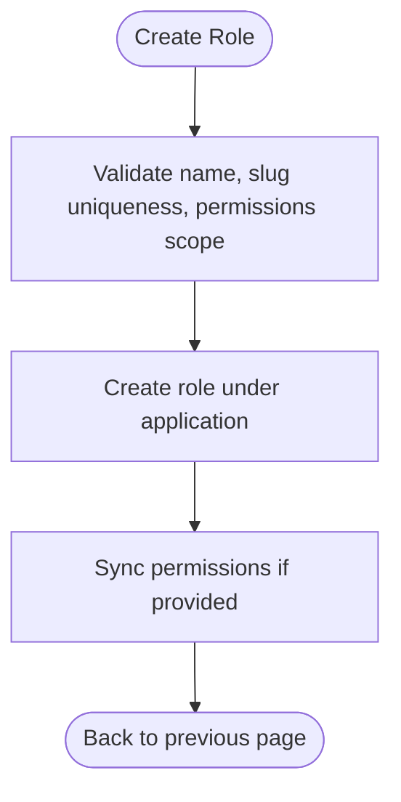

**Diagram sources**
- [RoleController.php:14-31](file://app/Http/Controllers/Iam/RoleController.php#L14-L31)
- [IamRole.php:14-16](file://app/Models/IamRole.php#L14-L16)

### User Access Controller
Responsibilities:
- List users with their IAM roles and associated applications
- Show a user’s access assignments and available active applications
- Assign roles to users with audit timestamps and assigned-by references
- Revoke user roles

**Section sources**
- [UserAksesController.php:16-48](file://app/Http/Controllers/Iam/UserAksesController.php#L16-L48)
- [IamUserRole.php:18-26](file://app/Models/IamUserRole.php#L18-L26)

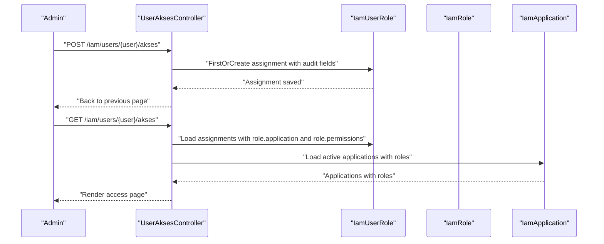

**Diagram sources**
- [UserAksesController.php:22-31](file://app/Http/Controllers/Iam/UserAksesController.php#L22-L31)
- [UserAksesController.php:33-41](file://app/Http/Controllers/Iam/UserAksesController.php#L33-L41)
- [IamUserRole.php:18-26](file://app/Models/IamUserRole.php#L18-L26)
- [IamApplication.php:57-65](file://app/Models/IamApplication.php#L57-L65)

### HMAC Signature Verification (External API)
Purpose:
- Secure inbound API requests from external applications
- Prevent replay attacks via timestamp validation
- Verify message integrity with HMAC-SHA256

Processing logic:
- Extract required headers (API key, timestamp, signature)
- Validate timestamp window (default 5 minutes)
- Resolve application by API key and activation status
- Reconstruct canonical payload from method, path, sorted query string, body hash, and timestamp
- Decrypt stored secret and compute expected HMAC
- Constant-time comparison to mitigate timing attacks
- Inject resolved application into request attributes

**Section sources**
- [VerifyIamSignature.php:15-59](file://app/Http/Middleware/VerifyIamSignature.php#L15-L59)
- [IamApplication.php:85-94](file://app/Models/IamApplication.php#L85-L94)

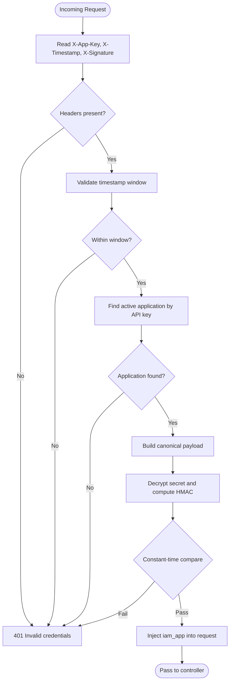

**Diagram sources**
- [VerifyIamSignature.php:15-59](file://app/Http/Middleware/VerifyIamSignature.php#L15-L59)
- [IamApplication.php:85-94](file://app/Models/IamApplication.php#L85-L94)

### HMAC Signature Verification (Internal API)
Purpose:
- Secure internal API endpoints with HMAC-SHA256
- Prevent replay and tampering with timestamp validation

Processing logic:
- Validate presence of timestamp and signature headers
- Enforce timestamp window (5 minutes)
- Retrieve shared secret from configuration
- Reconstruct canonical payload and compute expected HMAC
- Constant-time comparison for security
- Proceed to next middleware/controller

**Section sources**
- [VerifyHmacSignature.php:25-63](file://app/Http/Middleware/VerifyHmacSignature.php#L25-L63)

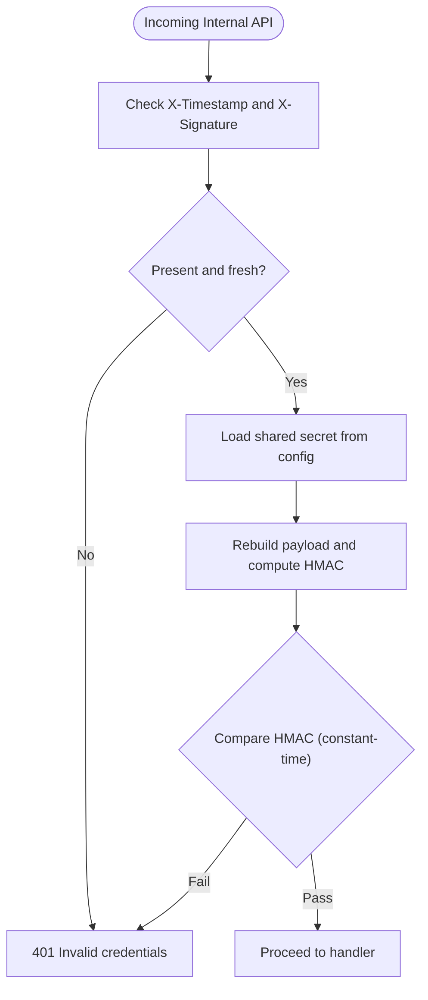

**Diagram sources**
- [VerifyHmacSignature.php:25-63](file://app/Http/Middleware/VerifyHmacSignature.php#L25-L63)

### Authorization Validation (Route-level)
Purpose:
- Enforce permission-based access control for routes
- Support both application membership checks and explicit permission checks

Processing logic:
- Ensure user is authenticated
- Resolve target application by slug with caching
- Without permission arguments: require at least one role in the application
- With permission arguments: require all specified permissions to be granted to the user
- Use service layer to resolve user permissions and roles

**Section sources**
- [VerifyIamPermission.php:16-52](file://app/Http/Middleware/VerifyIamPermission.php#L16-L52)
- [IamAuthorizationService.php:16-43](file://app/Services/IamAuthorizationService.php#L16-L43)
- [iam.php](file://config/iam.php#L7)

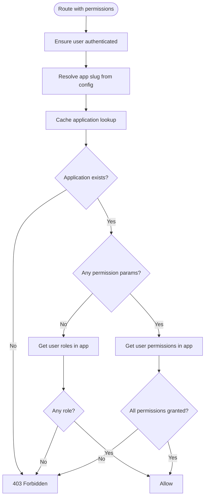

**Diagram sources**
- [VerifyIamPermission.php:16-52](file://app/Http/Middleware/VerifyIamPermission.php#L16-L52)
- [IamAuthorizationService.php:16-43](file://app/Services/IamAuthorizationService.php#L16-L43)
- [iam.php](file://config/iam.php#L7)

### SSO Integration Pattern
Purpose:
- Facilitate single sign-on from external applications back to the portal
- Enforce redirect host validation and short-lived authorization codes

Processing logic:
- Validate incoming request for app slug and redirect URL
- Locate active application by slug
- If user not authenticated, stash app and redirect for login
- After login, generate a random code bound to the user and application with expiration
- Enforce that redirect host matches registered application host
- Append code to redirect URL and issue final redirect

**Section sources**
- [SsoController.php:15-83](file://app/Http/Controllers/SsoController.php#L15-L83)
- [IamSsoCode.php:32-45](file://app/Models/IamSsoCode.php#L32-L45)
- [iam.php](file://config/iam.php#L6)

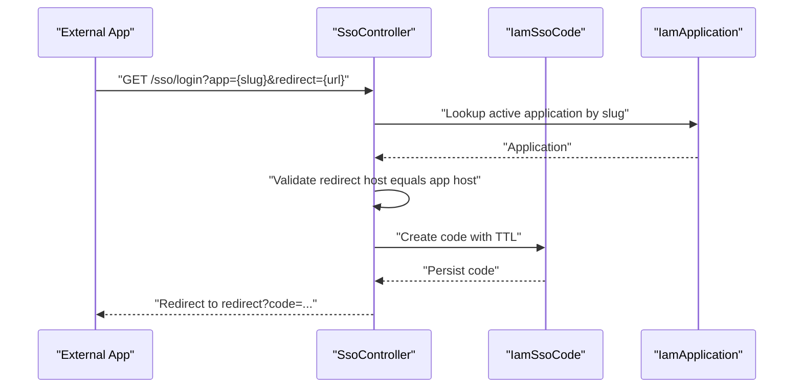

**Diagram sources**
- [SsoController.php:15-83](file://app/Http/Controllers/SsoController.php#L15-L83)
- [IamSsoCode.php:32-45](file://app/Models/IamSsoCode.php#L32-L45)
- [IamApplication.php:57-65](file://app/Models/IamApplication.php#L57-L65)

## Dependency Analysis
IAM controllers depend on:
- Models for persistence and relationships
- Middleware for signature verification and authorization
- Service for centralized permission/role resolution
- Configuration for application slug and TTLs

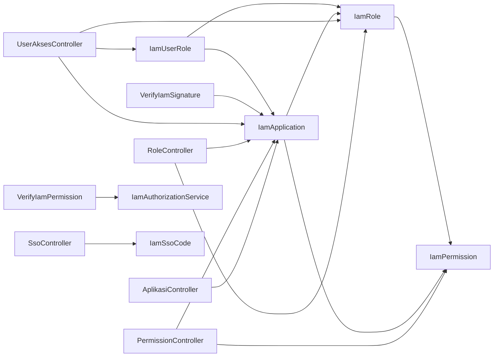

**Diagram sources**
- [AplikasiController.php:5-6](file://app/Http/Controllers/Iam/AplikasiController.php#L5-L6)
- [PermissionController.php:6-7](file://app/Http/Controllers/Iam/PermissionController.php#L6-L7)
- [RoleController.php:6-7](file://app/Http/Controllers/Iam/RoleController.php#L6-L7)
- [UserAksesController.php:6-9](file://app/Http/Controllers/Iam/UserAksesController.php#L6-L9)
- [VerifyIamSignature.php](file://app/Http/Middleware/VerifyIamSignature.php#L5)
- [VerifyIamPermission.php:5-6](file://app/Http/Middleware/VerifyIamPermission.php#L5-L6)
- [IamAuthorizationService.php](file://app/Services/IamAuthorizationService.php#L5)
- [SsoController.php:5-6](file://app/Http/Controllers/SsoController.php#L5-L6)
- [IamApplication.php:57-65](file://app/Models/IamApplication.php#L57-L65)
- [IamPermission.php:17-20](file://app/Models/IamPermission.php#L17-L20)
- [IamRole.php:23-36](file://app/Models/IamRole.php#L23-L36)
- [IamUserRole.php:18-26](file://app/Models/IamUserRole.php#L18-L26)
- [IamSsoCode.php:27-30](file://app/Models/IamSsoCode.php#L27-L30)

**Section sources**
- [AplikasiController.php:5-6](file://app/Http/Controllers/Iam/AplikasiController.php#L5-L6)
- [PermissionController.php:6-7](file://app/Http/Controllers/Iam/PermissionController.php#L6-L7)
- [RoleController.php:6-7](file://app/Http/Controllers/Iam/RoleController.php#L6-L7)
- [UserAksesController.php:6-9](file://app/Http/Controllers/Iam/UserAksesController.php#L6-L9)
- [VerifyIamSignature.php](file://app/Http/Middleware/VerifyIamSignature.php#L5)
- [VerifyIamPermission.php:5-6](file://app/Http/Middleware/VerifyIamPermission.php#L5-L6)
- [IamAuthorizationService.php](file://app/Services/IamAuthorizationService.php#L5)
- [SsoController.php:5-6](file://app/Http/Controllers/SsoController.php#L5-L6)

## Performance Considerations
- Caching application lookups: The permission middleware caches the application record by slug for one hour to reduce repeated database queries.
- Efficient eager loading: Controllers load related models with counts and nested relations to minimize N+1 queries.
- Minimal data exposure: Hidden attributes and masked API keys reduce unnecessary data transfer.
- Batch operations: Role permission synchronization uses a single sync operation to avoid multiple round-trips.

Recommendations:
- Monitor cache hit rates for application lookups.
- Consider pagination for large datasets in listing endpoints.
- Add database indexes on frequently filtered columns (e.g., application slugs, role slugs, permission slugs).

**Section sources**
- [VerifyIamPermission.php:28-30](file://app/Http/Middleware/VerifyIamPermission.php#L28-L30)
- [AplikasiController.php:15-22](file://app/Http/Controllers/Iam/AplikasiController.php#L15-L22)
- [UserAksesController.php:18-30](file://app/Http/Controllers/Iam/UserAksesController.php#L18-L30)

## Troubleshooting Guide
Common issues and resolutions:
- Invalid credentials (401)
  - Missing or malformed headers for signature verification
  - Expired timestamp outside the allowed window
  - Nonexistent or inactive application key
- Invalid signature (401)
  - Incorrect HMAC computation or tampered payload
  - Mismatched shared secret or encrypted secret retrieval failure
- Unauthenticated (401)
  - Route protected by permission middleware without a logged-in user
- Forbidden (403)
  - Missing required permissions or roles for the target application
  - Attempted modification or deletion of system applications or roles
- Redirect host mismatch (422)
  - SSO redirect URL does not match the registered application host

Audit and logging:
- Signature middleware logs critical configuration errors when secrets are missing
- Consider adding structured logs for failed verifications and authorization denials

**Section sources**
- [VerifyIamSignature.php:21-27](file://app/Http/Middleware/VerifyIamSignature.php#L21-L27)
- [VerifyIamSignature.php:44-53](file://app/Http/Middleware/VerifyIamSignature.php#L44-L53)
- [VerifyIamPermission.php:20-24](file://app/Http/Middleware/VerifyIamPermission.php#L20-L24)
- [VerifyIamPermission.php:32-34](file://app/Http/Middleware/VerifyIamPermission.php#L32-L34)
- [AplikasiController.php:65-67](file://app/Http/Controllers/Iam/AplikasiController.php#L65-L67)
- [RoleController.php:35-35](file://app/Http/Controllers/Iam/RoleController.php#L35-L35)
- [SsoController.php:62-68](file://app/Http/Controllers/SsoController.php#L62-L68)
- [VerifyHmacSignature.php:42-43](file://app/Http/Middleware/VerifyHmacSignature.php#L42-L43)

## Conclusion
The IAM controllers provide a cohesive, secure, and scalable foundation for managing applications, permissions, roles, and user access. They leverage middleware for robust signature verification, a service layer for centralized authorization logic, and carefully scoped validations to prevent IDOR and protect system resources. SSO integration ensures secure handoff to external applications with strict redirect host validation and short-lived codes. Together, these components support strong security, maintainable operations, and seamless integration with frontend authentication flows.

## Appendices

### API Key Generation and Credential Handling
- Applications auto-generate API keys and secrets during creation
- Secrets are stored as encrypted hashes and never exposed
- Regeneration produces new key/secret pair and returns the plaintext secret once
- Frontend displays masked API keys for safety

**Section sources**
- [IamApplication.php:37-49](file://app/Models/IamApplication.php#L37-L49)
- [IamApplication.php:72-79](file://app/Models/IamApplication.php#L72-L79)
- [IamApplication.php:85-94](file://app/Models/IamApplication.php#L85-L94)
- [AplikasiController.php:97-107](file://app/Http/Controllers/Iam/AplikasiController.php#L97-L107)
- [AplikasiController.php:113-127](file://app/Http/Controllers/Iam/AplikasiController.php#L113-L127)

### Permission Assignment Mechanisms
- Permissions are scoped to applications and validated for uniqueness
- Roles encapsulate sets of permissions and are validated against the owning application
- Users receive roles through a junction model with audit fields

**Section sources**
- [PermissionController.php:16-22](file://app/Http/Controllers/Iam/PermissionController.php#L16-L22)
- [RoleController.php:20-29](file://app/Http/Controllers/Iam/RoleController.php#L20-L29)
- [IamUserRole.php:9-11](file://app/Models/IamUserRole.php#L9-L11)

### User Role Management Processes
- Listing users with their roles and applications
- Showing detailed access assignments and available applications
- Assigning roles with timestamps and assigned-by tracking
- Revoking roles cleanly

**Section sources**
- [UserAksesController.php:16-31](file://app/Http/Controllers/Iam/UserAksesController.php#L16-L31)
- [UserAksesController.php:33-48](file://app/Http/Controllers/Iam/UserAksesController.php#L33-L48)

### HMAC Signature Verification Details
- Canonical payload construction includes method, path, sorted query string, body hash, and timestamp
- Constant-time comparisons prevent timing attacks
- Timestamp windows mitigate replay risks

**Section sources**
- [VerifyIamSignature.php:35-46](file://app/Http/Middleware/VerifyIamSignature.php#L35-L46)
- [VerifyHmacSignature.php:46-58](file://app/Http/Middleware/VerifyHmacSignature.php#L46-L58)

### SSO Integration Details
- Redirect host validation ensures trust boundaries
- Short-lived codes with pruning support
- Configurable TTL for SSO codes

**Section sources**
- [SsoController.php:62-68](file://app/Http/Controllers/SsoController.php#L62-L68)
- [IamSsoCode.php:47-51](file://app/Models/IamSsoCode.php#L47-L51)
- [iam.php](file://config/iam.php#L6)