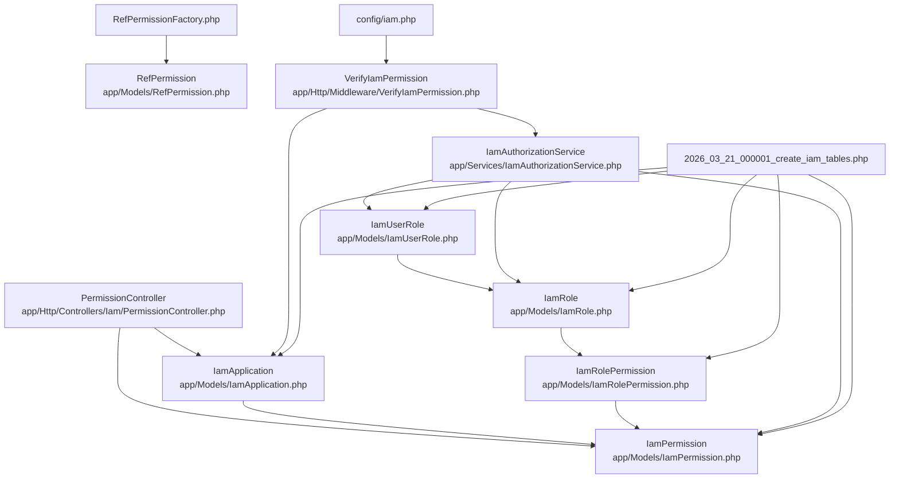
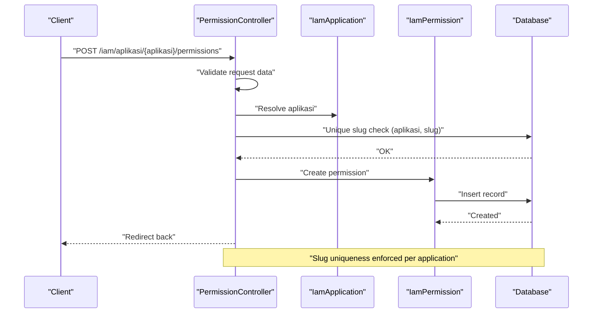
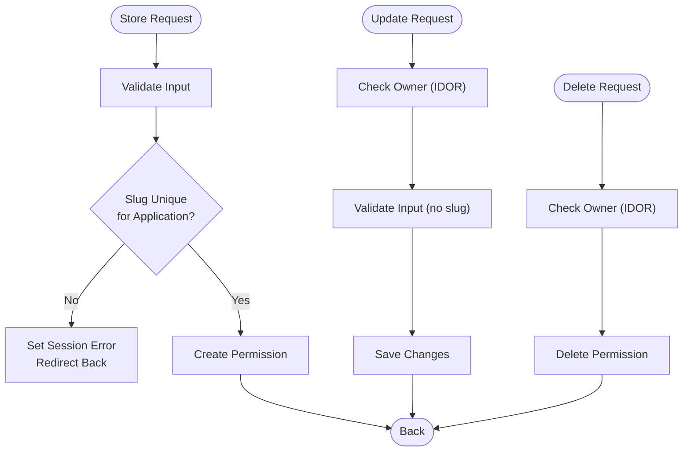
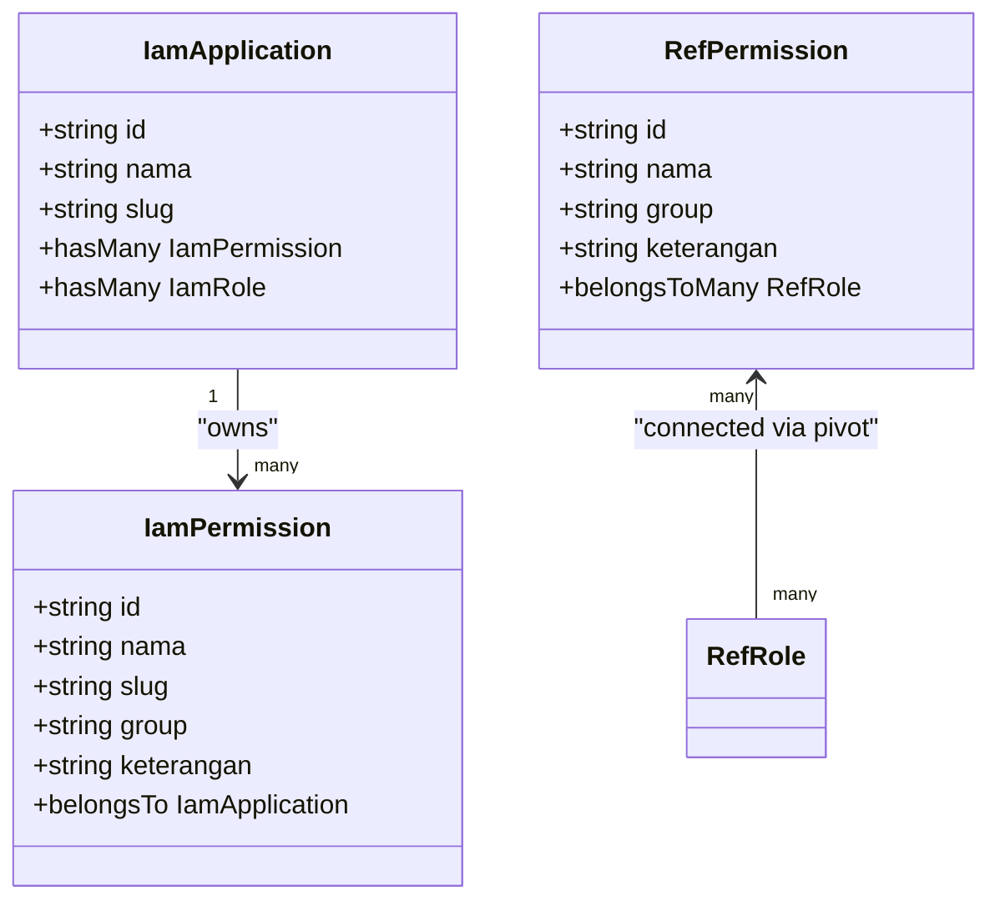
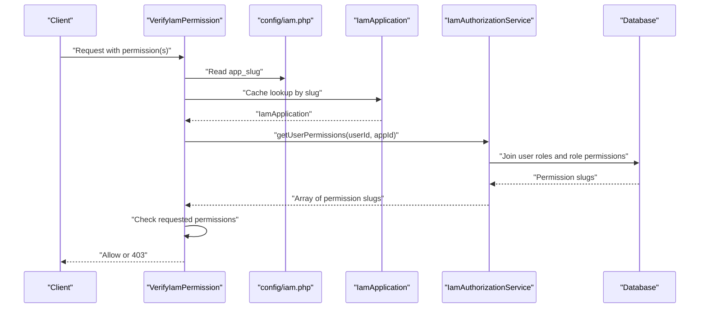
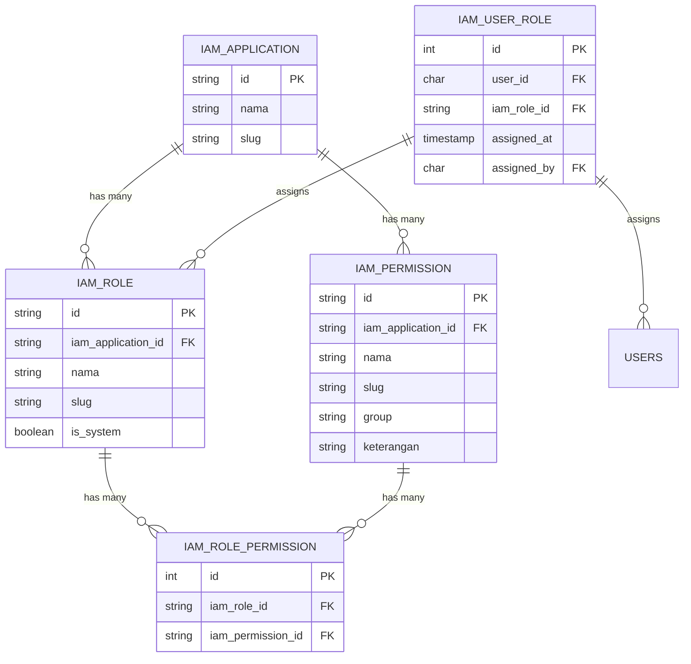
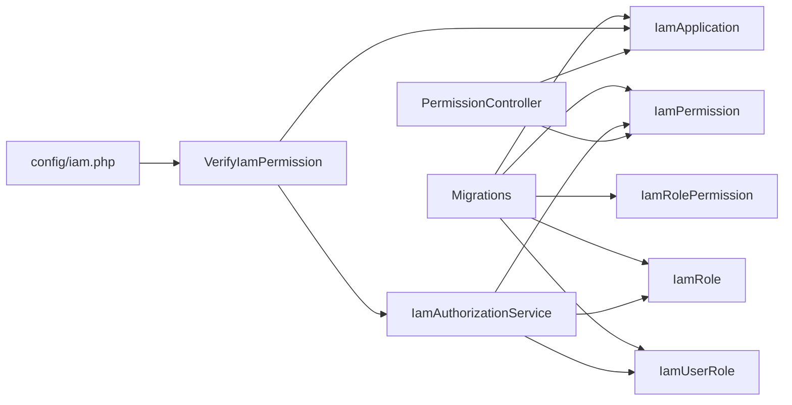

# Permission Management Controller

<cite>
**Referenced Files in This Document**
- [PermissionController.php](file://app/Http/Controllers/Iam/PermissionController.php)
- [IamPermission.php](file://app/Models/IamPermission.php)
- [RefPermission.php](file://app/Models/RefPermission.php)
- [VerifyIamPermission.php](file://app/Http/Middleware/VerifyIamPermission.php)
- [IamAuthorizationService.php](file://app/Services/IamAuthorizationService.php)
- [IamApplication.php](file://app/Models/IamApplication.php)
- [IamRole.php](file://app/Models/IamRole.php)
- [IamRolePermission.php](file://app/Models/IamRolePermission.php)
- [IamUserRole.php](file://app/Models/IamUserRole.php)
- [iam.php](file://config/iam.php)
- [2026_03_21_000001_create_iam_tables.php](file://database/migrations/2026_03_21_000001_create_iam_tables.php)
- [RefPermissionFactory.php](file://database/factories/RefPermissionFactory.php)
- [PermissionControllerTest.php](file://tests/Feature/Iam/PermissionControllerTest.php)
- [show.tsx](file://resources/js/pages/iam/aplikasi/show.tsx)
</cite>

## Table of Contents
1. [Introduction](#introduction)
2. [Project Structure](#project-structure)
3. [Core Components](#core-components)
4. [Architecture Overview](#architecture-overview)
5. [Detailed Component Analysis](#detailed-component-analysis)
6. [Dependency Analysis](#dependency-analysis)
7. [Performance Considerations](#performance-considerations)
8. [Troubleshooting Guide](#troubleshooting-guide)
9. [Conclusion](#conclusion)
10. [Appendices](#appendices)

## Introduction
This document provides comprehensive guidance for the Permission Management Controller, focusing on dynamic permission creation, validation, and enforcement. It explains CRUD operations for permissions, validation rules for permission names and descriptions, and integration with the reference permission system. It also clarifies the relationship between IamPermission and RefPermission models, permission validation patterns, enforcement mechanisms across the application, naming conventions, hierarchical permission structures, and audit logging considerations for permission changes.

## Project Structure
The permission management system spans controllers, models, middleware, services, configuration, migrations, factories, and frontend UI components. The controller orchestrates permission CRUD operations scoped to an application. Models define the data structures and relationships. Middleware enforces permissions at runtime. The service encapsulates authorization queries. Configuration defines application-level settings. Migrations establish the database schema. Factories support seeding and testing. Tests validate behavior and error handling.

**Diagram sources**
- [PermissionController.php:1-52](file://app/Http/Controllers/Iam/PermissionController.php#L1-L52)
- [IamApplication.php:1-96](file://app/Models/IamApplication.php#L1-L96)
- [IamPermission.php:1-22](file://app/Models/IamPermission.php#L1-L22)
- [RefPermission.php:1-30](file://app/Models/RefPermission.php#L1-L30)
- [VerifyIamPermission.php:1-54](file://app/Http/Middleware/VerifyIamPermission.php#L1-L54)
- [IamAuthorizationService.php:1-45](file://app/Services/IamAuthorizationService.php#L1-L45)
- [IamRole.php:1-38](file://app/Models/IamRole.php#L1-L38)
- [IamRolePermission.php:1-23](file://app/Models/IamRolePermission.php#L1-L23)
- [IamUserRole.php:1-33](file://app/Models/IamUserRole.php#L1-L33)
- [iam.php:1-9](file://config/iam.php#L1-L9)
- [2026_03_21_000001_create_iam_tables.php:1-113](file://database/migrations/2026_03_21_000001_create_iam_tables.php#L1-L113)
- [RefPermissionFactory.php:1-21](file://database/factories/RefPermissionFactory.php#L1-L21)

**Section sources**
- [PermissionController.php:1-52](file://app/Http/Controllers/Iam/PermissionController.php#L1-L52)
- [IamApplication.php:1-96](file://app/Models/IamApplication.php#L1-L96)
- [IamPermission.php:1-22](file://app/Models/IamPermission.php#L1-L22)
- [RefPermission.php:1-30](file://app/Models/RefPermission.php#L1-L30)
- [VerifyIamPermission.php:1-54](file://app/Http/Middleware/VerifyIamPermission.php#L1-L54)
- [IamAuthorizationService.php:1-45](file://app/Services/IamAuthorizationService.php#L1-L45)
- [IamRole.php:1-38](file://app/Models/IamRole.php#L1-L38)
- [IamRolePermission.php:1-23](file://app/Models/IamRolePermission.php#L1-L23)
- [IamUserRole.php:1-33](file://app/Models/IamUserRole.php#L1-L33)
- [iam.php:1-9](file://config/iam.php#L1-L9)
- [2026_03_21_000001_create_iam_tables.php:1-113](file://database/migrations/2026_03_21_000001_create_iam_tables.php#L1-L113)
- [RefPermissionFactory.php:1-21](file://database/factories/RefPermissionFactory.php#L1-L21)

## Core Components
- PermissionController: Handles permission creation, updates, and deletions with validation and IDOR protection.
- IamPermission: Application-scoped permission entity with slug uniqueness within an application.
- RefPermission: Reference permission entity used by the reference role system; not directly managed by the PermissionController.
- VerifyIamPermission: Middleware that enforces permissions for incoming requests.
- IamAuthorizationService: Service that resolves effective permissions for a user within an application.
- IamApplication: Container for permissions and roles; provides API credentials and caching.
- IamRole and IamRolePermission: Role-to-permission relationship for assigning permissions to roles.
- IamUserRole: Assignment of roles to users.
- Configuration: IAM settings including app slug.
- Migrations: Database schema for IAM entities.
- Frontend UI: Permission management interface for adding and removing permissions.

**Section sources**
- [PermissionController.php:1-52](file://app/Http/Controllers/Iam/PermissionController.php#L1-L52)
- [IamPermission.php:1-22](file://app/Models/IamPermission.php#L1-L22)
- [RefPermission.php:1-30](file://app/Models/RefPermission.php#L1-L30)
- [VerifyIamPermission.php:1-54](file://app/Http/Middleware/VerifyIamPermission.php#L1-L54)
- [IamAuthorizationService.php:1-45](file://app/Services/IamAuthorizationService.php#L1-L45)
- [IamApplication.php:1-96](file://app/Models/IamApplication.php#L1-L96)
- [IamRole.php:1-38](file://app/Models/IamRole.php#L1-L38)
- [IamRolePermission.php:1-23](file://app/Models/IamRolePermission.php#L1-L23)
- [IamUserRole.php:1-33](file://app/Models/IamUserRole.php#L1-L33)
- [iam.php:1-9](file://config/iam.php#L1-L9)
- [2026_03_21_000001_create_iam_tables.php:1-113](file://database/migrations/2026_03_21_000001_create_iam_tables.php#L1-L113)
- [show.tsx:1-867](file://resources/js/pages/iam/aplikasi/show.tsx#L1-L867)

## Architecture Overview
The Permission Management Controller operates within an application-scoped RBAC model. Permissions are owned by applications and assigned to roles, which are assigned to users. Runtime enforcement occurs via middleware that resolves effective permissions for the configured application slug.

**Diagram sources**
- [PermissionController.php:14-25](file://app/Http/Controllers/Iam/PermissionController.php#L14-L25)
- [IamApplication.php:62-65](file://app/Models/IamApplication.php#L62-L65)
- [IamPermission.php:13-15](file://app/Models/IamPermission.php#L13-L15)
- [2026_03_21_000001_create_iam_tables.php:42-54](file://database/migrations/2026_03_21_000001_create_iam_tables.php#L42-L54)

**Section sources**
- [PermissionController.php:14-25](file://app/Http/Controllers/Iam/PermissionController.php#L14-L25)
- [IamApplication.php:62-65](file://app/Models/IamApplication.php#L62-L65)
- [IamPermission.php:13-15](file://app/Models/IamPermission.php#L13-L15)
- [2026_03_21_000001_create_iam_tables.php:42-54](file://database/migrations/2026_03_21_000001_create_am_tables.php#L42-L54)

## Detailed Component Analysis

### PermissionController: CRUD Operations and Validation
- Purpose: Manage application-scoped permissions with strict validation and IDOR protection.
- Validation rules:
  - Name: required, string, max length 100.
  - Slug: required, string, unique per application.
  - Group: optional, string, max length 50.
  - Description: optional, string.
- IDOR protection: Ensures the permission belongs to the requested application before update/delete.
- Responses: Redirect back to previous page after successful operations.

**Diagram sources**
- [PermissionController.php:14-50](file://app/Http/Controllers/Iam/PermissionController.php#L14-L50)

**Section sources**
- [PermissionController.php:14-50](file://app/Http/Controllers/Iam/PermissionController.php#L14-L50)
- [PermissionControllerTest.php:16-50](file://tests/Feature/Iam/PermissionControllerTest.php#L16-L50)

### IamPermission vs RefPermission: Relationship and Scope
- IamPermission:
  - Application-scoped permission with unique slug per application.
  - Used by the PermissionController for CRUD operations.
  - Linked to IamApplication via foreign key.
- RefPermission:
  - Reference permission used by the reference role system.
  - Not managed by the PermissionController.
  - Connected to roles via a pivot table.

**Diagram sources**
- [IamApplication.php:62-65](file://app/Models/IamApplication.php#L62-L65)
- [IamPermission.php:17-20](file://app/Models/IamPermission.php#L17-L20)
- [RefPermission.php:25-28](file://app/Models/RefPermission.php#L25-L28)

**Section sources**
- [IamPermission.php:1-22](file://app/Models/IamPermission.php#L1-L22)
- [RefPermission.php:1-30](file://app/Models/RefPermission.php#L1-L30)
- [IamApplication.php:1-96](file://app/Models/IamApplication.php#L1-L96)

### Runtime Permission Enforcement
- Middleware: VerifyIamPermission
  - Resolves current application by slug from configuration.
  - Caches application lookup for performance.
  - Supports two modes:
    - Without permission parameters: checks user has roles in the application.
    - With permission parameters: checks user has all specified permissions.
  - Uses IamAuthorizationService to compute effective permissions.
- Authorization Service:
  - getUserPermissions(userId, applicationId): Returns unique permission slugs for a user within an application.
  - getUserRoles(userId, applicationId): Returns role slugs for a user within an application.

**Diagram sources**
- [VerifyIamPermission.php:16-52](file://app/Http/Middleware/VerifyIamPermission.php#L16-L52)
- [IamAuthorizationService.php:16-26](file://app/Services/IamAuthorizationService.php#L16-L26)
- [iam.php:7-8](file://config/iam.php#L7-L8)

**Section sources**
- [VerifyIamPermission.php:1-54](file://app/Http/Middleware/VerifyIamPermission.php#L1-L54)
- [IamAuthorizationService.php:1-45](file://app/Services/IamAuthorizationService.php#L1-L45)
- [iam.php:1-9](file://config/iam.php#L1-L9)

### Hierarchical Permission Structures and Role-Based Access Control
- Roles and Permissions:
  - Roles belong to an application and are linked to permissions via a pivot table.
  - Users are assigned roles via IamUserRole.
- Effective Permissions:
  - Effective permissions are derived from a user’s roles within an application.
  - The service aggregates permissions across all roles to produce a unique list of permission slugs.

**Diagram sources**
- [2026_03_21_000001_create_iam_tables.php:14-84](file://database/migrations/2026_03_21_000001_create_iam_tables.php#L14-L84)
- [IamRole.php:28-36](file://app/Models/IamRole.php#L28-L36)
- [IamRolePermission.php:1-23](file://app/Models/IamRolePermission.php#L1-L23)
- [IamUserRole.php:1-33](file://app/Models/IamUserRole.php#L1-L33)

**Section sources**
- [IamRole.php:1-38](file://app/Models/IamRole.php#L1-L38)
- [IamRolePermission.php:1-23](file://app/Models/IamRolePermission.php#L1-L23)
- [IamUserRole.php:1-33](file://app/Models/IamUserRole.php#L1-L33)
- [2026_03_21_000001_create_iam_tables.php:1-113](file://database/migrations/2026_03_21_000001_create_iam_tables.php#L1-L113)

### Permission Naming Conventions and Validation Patterns
- Naming conventions:
  - Use concise, descriptive names suitable for programmatic use.
  - Prefer dot notation for hierarchical grouping (e.g., module.action).
  - Keep slugs unique within an application.
- Validation patterns:
  - Name: required, string, max 100 characters.
  - Slug: required, unique per application, string.
  - Group: optional, string, max 50 characters.
  - Description: optional, string.

**Section sources**
- [PermissionController.php:16-21](file://app/Http/Controllers/Iam/PermissionController.php#L16-L21)
- [2026_03_21_000001_create_iam_tables.php:42-54](file://database/migrations/2026_03_21_000001_create_iam_tables.php#L42-L54)

### Audit Logging for Permission Changes
- Recommendation: Implement audit logs for permission lifecycle events (create, update, delete) to track changes and support compliance.
- Suggested fields: actor, timestamp, action, affected permission, application, justification (if applicable).
- Storage: Dedicated audit table or event sourcing mechanism.

[No sources needed since this section provides general guidance]

### Examples of Permission Creation Workflows
- Backend workflow:
  - Validate input (name, slug, group, description).
  - Enforce slug uniqueness within the application.
  - Persist permission and redirect back.
- Frontend workflow:
  - Open “Add Permission” dialog.
  - Enter name and optional description.
  - Submit form; UI handles errors and resets on success.

**Section sources**
- [PermissionController.php:14-25](file://app/Http/Controllers/Iam/PermissionController.php#L14-L25)
- [show.tsx:505-610](file://resources/js/pages/iam/aplikasi/show.tsx#L505-L610)
- [PermissionControllerTest.php:40-50](file://tests/Feature/Iam/PermissionControllerTest.php#L40-L50)

### Validation Error Handling
- Slug duplication within an application triggers session errors.
- IDOR protection returns 404 for attempts to modify permissions outside the current application scope.

**Section sources**
- [PermissionControllerTest.php:16-38](file://tests/Feature/Iam/PermissionControllerTest.php#L16-L38)
- [PermissionController.php:29-45](file://app/Http/Controllers/Iam/PermissionController.php#L29-L45)

## Dependency Analysis
- Controller depends on:
  - IamApplication for scoping.
  - IamPermission for persistence.
  - Laravel validation rules for input sanitization.
- Middleware depends on:
  - IamApplication for app resolution.
  - IamAuthorizationService for permission computation.
  - Configuration for app slug.
- Service depends on:
  - Eloquent relationships to compute effective permissions.
- Models depend on:
  - Migrations for schema correctness.
  - Pivot tables for many-to-many relationships.

**Diagram sources**
- [PermissionController.php:1-52](file://app/Http/Controllers/Iam/PermissionController.php#L1-L52)
- [VerifyIamPermission.php:1-54](file://app/Http/Middleware/VerifyIamPermission.php#L1-L54)
- [IamAuthorizationService.php:1-45](file://app/Services/IamAuthorizationService.php#L1-L45)
- [iam.php:1-9](file://config/iam.php#L1-L9)
- [2026_03_21_000001_create_iam_tables.php:1-113](file://database/migrations/2026_03_21_000001_create_iam_tables.php#L1-L113)

**Section sources**
- [PermissionController.php:1-52](file://app/Http/Controllers/Iam/PermissionController.php#L1-L52)
- [VerifyIamPermission.php:1-54](file://app/Http/Middleware/VerifyIamPermission.php#L1-L54)
- [IamAuthorizationService.php:1-45](file://app/Services/IamAuthorizationService.php#L1-L45)
- [iam.php:1-9](file://config/iam.php#L1-L9)
- [2026_03_21_000001_create_iam_tables.php:1-113](file://database/migrations/2026_03_21_000001_create_iam_tables.php#L1-L113)

## Performance Considerations
- Cache application lookup: The middleware caches the resolved application by slug for one hour to reduce repeated database queries.
- Efficient permission retrieval: The authorization service uses eager loading and aggregation to minimize database round trips.
- Indexing: Ensure unique indexes on application+slug combinations for fast conflict detection.

**Section sources**
- [VerifyIamPermission.php:27-30](file://app/Http/Middleware/VerifyIamPermission.php#L27-L30)
- [IamAuthorizationService.php:18-25](file://app/Services/IamAuthorizationService.php#L18-L25)
- [2026_03_21_000001_create_iam_tables.php:39-65](file://database/migrations/2026_03_21_000001_create_iam_tables.php#L39-L65)

## Troubleshooting Guide
- Slug conflict within an application:
  - Symptom: Session error for slug field after submission.
  - Resolution: Choose a unique slug within the application scope.
- IDOR protection triggered:
  - Symptom: 404 response when editing/deleting a permission belonging to another application.
  - Resolution: Ensure the permission belongs to the selected application.
- Missing permissions at runtime:
  - Symptom: 403 Forbidden when accessing protected routes.
  - Resolution: Assign roles with required permissions to the user; verify app slug configuration.

**Section sources**
- [PermissionControllerTest.php:16-50](file://tests/Feature/Iam/PermissionControllerTest.php#L16-L50)
- [VerifyIamPermission.php:36-51](file://app/Http/Middleware/VerifyIamPermission.php#L36-L51)
- [iam.php:7-8](file://config/iam.php#L7-L8)

## Conclusion
The Permission Management Controller provides a robust foundation for dynamic permission creation, validation, and enforcement. By enforcing application scoping, validating inputs, and integrating with middleware and authorization services, it ensures secure and maintainable RBAC within applications. Clear naming conventions, unique slugs, and optional grouping support scalable permission hierarchies. Extending with audit logging and leveraging caching and efficient queries further improves reliability and performance.

## Appendices
- Reference permission seeding:
  - Use the reference permission factory to generate seeded reference permissions for testing and development.

**Section sources**
- [RefPermissionFactory.php:1-21](file://database/factories/RefPermissionFactory.php#L1-L21)