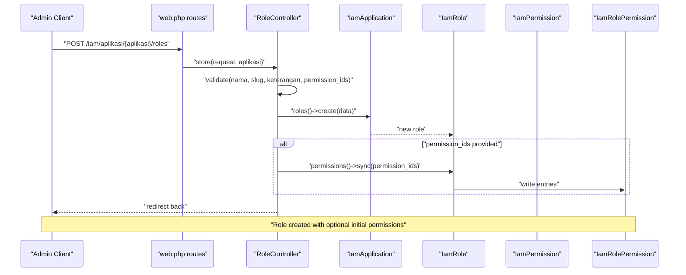
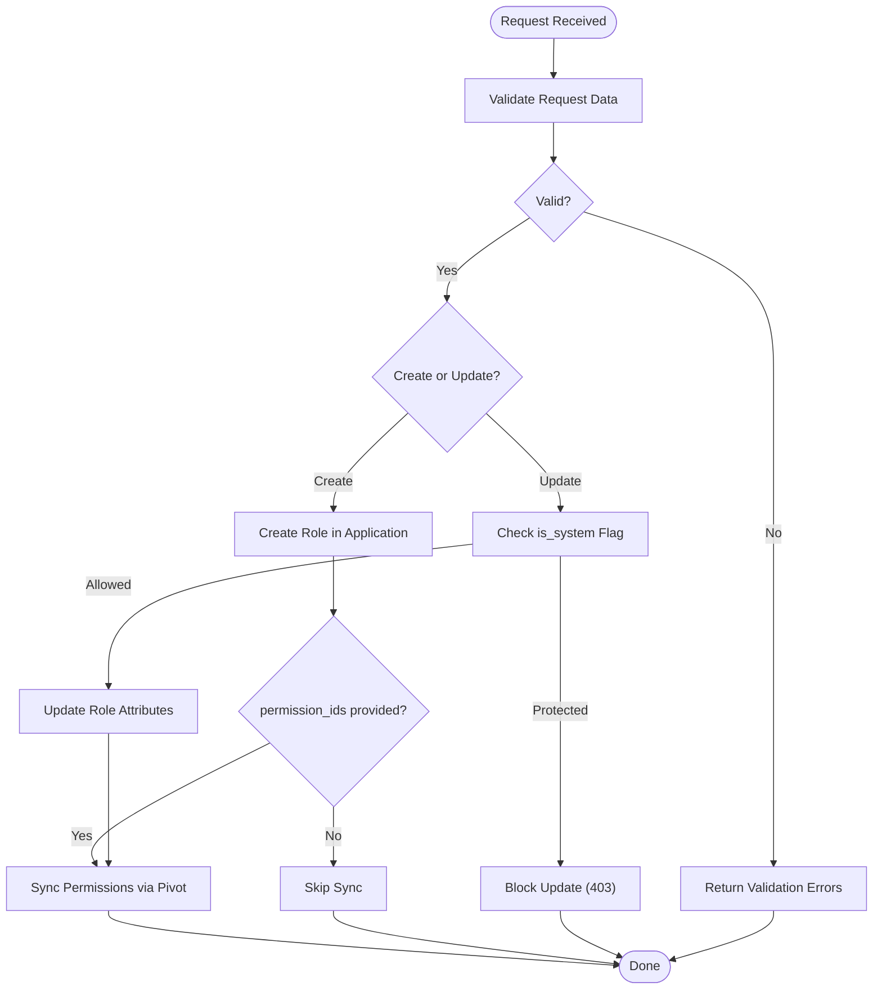
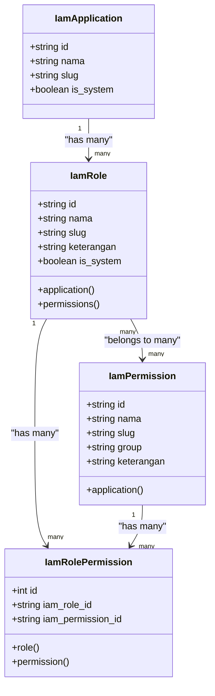
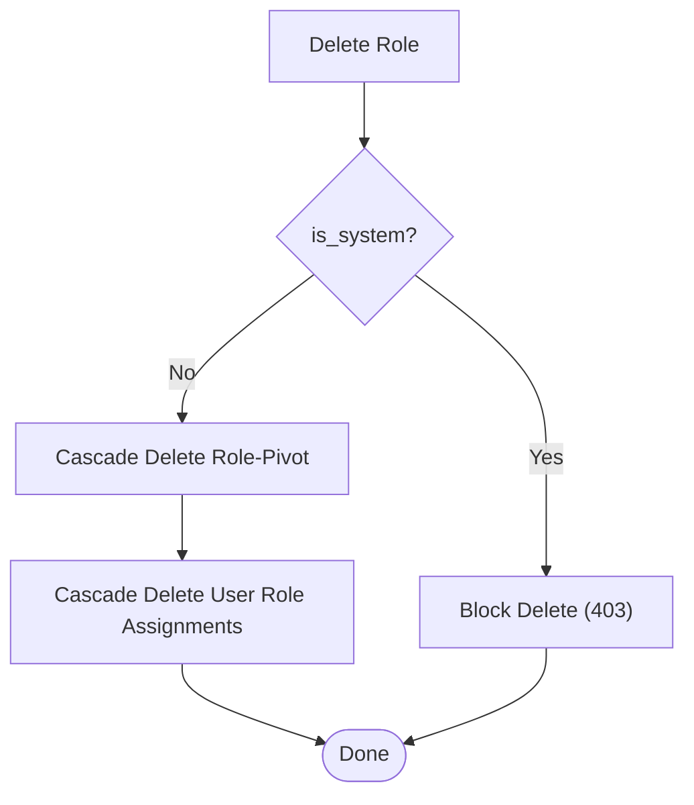
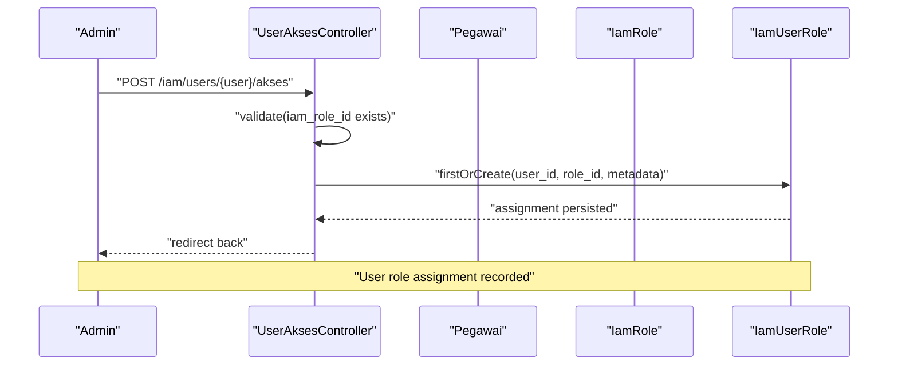
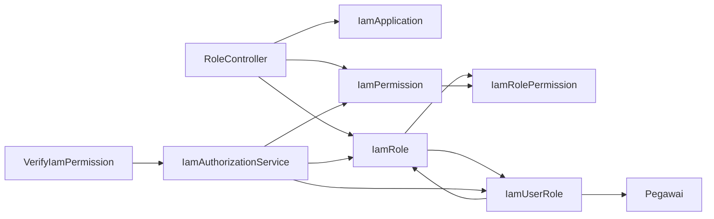

# Role Management Controller

<cite>
**Referenced Files in This Document**
- [RoleController.php](file://app/Http/Controllers/Iam/RoleController.php)
- [IamRole.php](file://app/Models/IamRole.php)
- [IamRolePermission.php](file://app/Models/IamRolePermission.php)
- [IamPermission.php](file://app/Models/IamPermission.php)
- [IamUserRole.php](file://app/Models/IamUserRole.php)
- [create_iam_tables.php](file://database/migrations/2026_03_21_000001_create_iam_tables.php)
- [web.php](file://routes/web.php)
- [IamAuthorizationService.php](file://app/Services/IamAuthorizationService.php)
- [VerifyIamPermission.php](file://app/Http/Middleware/VerifyIamPermission.php)
- [RoleControllerTest.php](file://tests/Feature/Iam/RoleControllerTest.php)
- [UserAksesController.php](file://app/Http/Controllers/Iam/UserAksesController.php)
</cite>

## Table of Contents
1. [Introduction](#introduction)
2. [Project Structure](#project-structure)
3. [Core Components](#core-components)
4. [Architecture Overview](#architecture-overview)
5. [Detailed Component Analysis](#detailed-component-analysis)
6. [Dependency Analysis](#dependency-analysis)
7. [Performance Considerations](#performance-considerations)
8. [Troubleshooting Guide](#troubleshooting-guide)
9. [Conclusion](#conclusion)

## Introduction
This document provides comprehensive technical documentation for the Role Management Controller within the Identity and Access Management (IAM) subsystem. It focuses on role creation, permission assignment, and role hierarchy management. The documentation covers role CRUD operations, permission attachment workflows, validation rules for role definitions, and the relationships among IamRole, IamRolePermission, and permission assignment patterns. It also explains protected role handling, dynamic permission updates, cascade deletion behavior, and integration with user role assignment systems.

## Project Structure
The role management functionality spans controller, model, middleware, service, route, and test layers. The controller orchestrates role lifecycle operations, models define the domain entities and their relationships, middleware enforces permission checks, and services encapsulate authorization queries. Routes expose the REST endpoints for role management nested under application contexts.

```mermaid
graph TB
subgraph "IAM Layer"
RC["RoleController<br/>POST/PUT/DELETE roles"]
PAC["PermissionController<br/>manages permissions"]
UAC["UserAksesController<br/>assigns roles to users"]
AS["IamAuthorizationService<br/>fetches user permissions/roles"]
MW["VerifyIamPermission<br/>middleware"]
end
subgraph "Domain Models"
AR["IamApplication"]
RL["IamRole"]
PM["IamPermission"]
RP["IamRolePermission<br/>pivot"]
UR["IamUserRole<br/>pivot"]
end
subgraph "Persistence"
MIG["create_iam_tables migration"]
end
RC --> RL
RC --> AR
PAC --> PM
PAC --> AR
UAC --> RL
UAC --> UR
AS --> UR
AS --> RL
AS --> PM
MW --> AS
RL <-- RP
PM <-- RP
RL <-- UR
AR --> RL
AR --> PM
MIG --> AR
MIG --> RL
MIG --> PM
MIG --> RP
MIG --> UR
```

**Diagram sources**
- [RoleController.php:14-63](file://app/Http/Controllers/Iam/RoleController.php#L14-L63)
- [IamRole.php:10-37](file://app/Models/IamRole.php#L10-L37)
- [IamRolePermission.php:7-22](file://app/Models/IamRolePermission.php#L7-L22)
- [IamPermission.php:9-21](file://app/Models/IamPermission.php#L9-L21)
- [IamUserRole.php:7-32](file://app/Models/IamUserRole.php#L7-L32)
- [create_iam_tables.php:14-84](file://database/migrations/2026_03_21_000001_create_iam_tables.php#L14-L84)
- [web.php:114-136](file://routes/web.php#L114-L136)
- [IamAuthorizationService.php:7-44](file://app/Services/IamAuthorizationService.php#L7-L44)
- [VerifyIamPermission.php:12-53](file://app/Http/Middleware/VerifyIamPermission.php#L12-L53)

**Section sources**
- [web.php:114-136](file://routes/web.php#L114-L136)
- [create_iam_tables.php:14-84](file://database/migrations/2026_03_21_000001_create_iam_tables.php#L14-L84)

## Core Components
- RoleController: Implements role creation, update, and deletion with strict validation and IDOR protection. It supports attaching permissions during creation and synchronizing permissions during updates.
- IamRole: Eloquent model representing roles scoped to an application, with soft deletes and a protected flag for system roles.
- IamRolePermission: Pivot model linking roles to permissions.
- IamPermission: Eloquent model representing application-scoped permissions.
- IamUserRole: Pivot model linking users to roles with assignment metadata.
- IamAuthorizationService: Service that resolves effective permissions and roles per application for a given user.
- VerifyIamPermission: Middleware that enforces permission checks against resolved user permissions.
- Routes: Expose nested endpoints under the IAM section for managing roles and permissions.

**Section sources**
- [RoleController.php:14-63](file://app/Http/Controllers/Iam/RoleController.php#L14-L63)
- [IamRole.php:10-37](file://app/Models/IamRole.php#L10-L37)
- [IamRolePermission.php:7-22](file://app/Models/IamRolePermission.php#L7-L22)
- [IamPermission.php:9-21](file://app/Models/IamPermission.php#L9-L21)
- [IamUserRole.php:7-32](file://app/Models/IamUserRole.php#L7-L32)
- [IamAuthorizationService.php:16-43](file://app/Services/IamAuthorizationService.php#L16-L43)
- [VerifyIamPermission.php:16-51](file://app/Http/Middleware/VerifyIamPermission.php#L16-L51)
- [web.php:123-135](file://routes/web.php#L123-L135)

## Architecture Overview
The role management architecture follows a layered design:
- Presentation: Web routes expose IAM endpoints for role CRUD and permission CRUD.
- Application: RoleController validates inputs, enforces IDOR, and manages role-permission attachments.
- Domain: Models define entities and relationships; migrations define schema and constraints.
- Persistence: Database schema enforces referential integrity and cascading behavior.
- Authorization: Middleware and service resolve effective permissions for runtime enforcement.



**Diagram sources**
- [web.php:124-124](file://routes/web.php#L124-L124)
- [RoleController.php:14-31](file://app/Http/Controllers/Iam/RoleController.php#L14-L31)
- [IamRole.php:28-36](file://app/Models/IamRole.php#L28-L36)
- [create_iam_tables.php:56-66](file://database/migrations/2026_03_21_000001_create_iam_tables.php#L56-L66)

## Detailed Component Analysis

### RoleController: Role CRUD and Permission Attachment
- Validation rules:
  - Name and slug are required and slug uniqueness is scoped to the application.
  - Description is optional.
  - Permission IDs must belong to the same application.
- Creation workflow:
  - Validates input and creates a role under the target application.
  - Optionally syncs permission assignments via pivot table.
- Update workflow:
  - Enforces IDOR by verifying the role belongs to the application.
  - Prevents modification of system roles.
  - Updates attributes and synchronizes permissions.
- Deletion workflow:
  - Prevents deletion of system roles.
  - Enforces IDOR.
  - Deletes the role; cascading delete removes role-permission pivots.



**Diagram sources**
- [RoleController.php:14-63](file://app/Http/Controllers/Iam/RoleController.php#L14-L63)

**Section sources**
- [RoleController.php:14-63](file://app/Http/Controllers/Iam/RoleController.php#L14-L63)
- [RoleControllerTest.php:16-38](file://tests/Feature/Iam/RoleControllerTest.php#L16-L38)

### IamRole, IamRolePermission, and Permission Assignment Patterns
- IamRole:
  - Belongs to an application.
  - Has many permissions via a many-to-many relationship.
  - Supports soft deletes and a boolean flag indicating system role.
- IamRolePermission:
  - Pivot linking roles to permissions.
  - Tracks timestamps for auditability.
- Permission assignment pattern:
  - During creation/update, the controller syncs permission IDs to maintain an exact set of attached permissions.
  - This replaces previous attachments with the provided set, ensuring idempotent updates.



**Diagram sources**
- [IamRole.php:23-36](file://app/Models/IamRole.php#L23-L36)
- [IamRolePermission.php:13-21](file://app/Models/IamRolePermission.php#L13-L21)
- [IamPermission.php:17-20](file://app/Models/IamPermission.php#L17-L20)
- [create_iam_tables.php:28-66](file://database/migrations/2026_03_21_000001_create_iam_tables.php#L28-L66)

**Section sources**
- [IamRole.php:10-37](file://app/Models/IamRole.php#L10-L37)
- [IamRolePermission.php:7-22](file://app/Models/IamRolePermission.php#L7-L22)
- [IamPermission.php:9-21](file://app/Models/IamPermission.php#L9-L21)
- [create_iam_tables.php:28-66](file://database/migrations/2026_03_21_000001_create_iam_tables.php#L28-L66)

### Protected Role System and Cascade Handling
- Protected roles:
  - System roles cannot be modified or deleted.
  - Update and delete actions explicitly check the system flag and block unauthorized operations.
- Cascade handling:
  - Deleting a role cascades to remove role-permission pivots.
  - Application deletion cascades to roles, which cascade to role-permission pivots.
  - User role assignment records are removed when roles are deleted.



**Diagram sources**
- [RoleController.php:53-63](file://app/Http/Controllers/Iam/RoleController.php#L53-L63)
- [create_iam_tables.php:32-32](file://database/migrations/2026_03_21_000001_create_iam_tables.php#L32-L32)
- [create_iam_tables.php:60-66](file://database/migrations/2026_03_21_000001_create_iam_tables.php#L60-L66)
- [create_iam_tables.php:76-76](file://database/migrations/2026_03_21_000001_create_iam_tables.php#L76-L76)

**Section sources**
- [RoleController.php:35-55](file://app/Http/Controllers/Iam/RoleController.php#L35-L55)
- [create_iam_tables.php:32-32](file://database/migrations/2026_03_21_000001_create_iam_tables.php#L32-L32)
- [create_iam_tables.php:60-66](file://database/migrations/2026_03_21_000001_create_iam_tables.php#L60-L66)
- [create_iam_tables.php:76-76](file://database/migrations/2026_03_21_000001_create_iam_tables.php#L76-L76)

### Integration with User Role Assignment Systems
- UserAksesController:
  - Lists users and their role assignments.
  - Shows available applications and roles for assignment.
  - Assigns roles to users with validation and records who assigned and when.
  - Removes role assignments for users.
- Effective permissions resolution:
  - IamAuthorizationService aggregates all permissions from a user's roles within a specific application.
  - VerifyIamPermission middleware uses this service to enforce permission checks.



**Diagram sources**
- [UserAksesController.php:33-41](file://app/Http/Controllers/Iam/UserAksesController.php#L33-L41)
- [IamUserRole.php:9-16](file://app/Models/IamUserRole.php#L9-L16)

**Section sources**
- [UserAksesController.php:16-48](file://app/Http/Controllers/Iam/UserAksesController.php#L16-L48)
- [IamAuthorizationService.php:16-43](file://app/Services/IamAuthorizationService.php#L16-L43)
- [VerifyIamPermission.php:16-51](file://app/Http/Middleware/VerifyIamPermission.php#L16-L51)

### Validation Rules for Role Definitions
- Name and slug:
  - Required, string, max length enforced.
  - Slug uniqueness is scoped to the application to prevent conflicts within the same application.
- Description:
  - Optional, string with max length.
- Permission IDs:
  - Must be an array.
  - Each ID must exist and belong to the same application as the role.

These validations ensure consistent role definitions and prevent cross-application permission leakage.

**Section sources**
- [RoleController.php:16-23](file://app/Http/Controllers/Iam/RoleController.php#L16-L23)

### Examples

#### Role Creation with Initial Permissions
- Endpoint: POST /iam/aplikasi/{aplikasi}/roles
- Behavior:
  - Validates role attributes and permission IDs.
  - Creates the role under the specified application.
  - Attaches provided permissions via synchronization.

**Section sources**
- [web.php:124-124](file://routes/web.php#L124-L124)
- [RoleController.php:14-31](file://app/Http/Controllers/Iam/RoleController.php#L14-L31)

#### Dynamic Permission Updates
- Endpoint: PUT /iam/aplikasi/{aplikasi}/roles/{role}
- Behavior:
  - Validates inputs scoped to the application.
  - Prevents modification of system roles.
  - Synchronizes permissions to match the provided set.

**Section sources**
- [web.php:125-125](file://routes/web.php#L125-L125)
- [RoleController.php:33-51](file://app/Http/Controllers/Iam/RoleController.php#L33-L51)

#### Role Deletion with Cascade Handling
- Endpoint: DELETE /iam/aplikasi/{aplikasi}/roles/{role}
- Behavior:
  - Blocks deletion of system roles.
  - Ensures IDOR protection.
  - Cascades deletions to role-permission pivots and user role assignments.

**Section sources**
- [web.php:126-126](file://routes/web.php#L126-L126)
- [RoleController.php:53-63](file://app/Http/Controllers/Iam/RoleController.php#L53-L63)
- [create_iam_tables.php:60-66](file://database/migrations/2026_03_21_000001_create_iam_tables.php#L60-L66)
- [create_iam_tables.php:76-76](file://database/migrations/2026_03_21_000001_create_iam_tables.php#L76-L76)

#### Integration with User Role Assignment
- Assigning a role to a user:
  - Endpoint: POST /iam/users/{user}/akses
  - Validates role existence and creates an assignment record with metadata.
- Removing a role from a user:
  - Endpoint: DELETE /iam/users/{user}/akses/{role}

**Section sources**
- [web.php:134-135](file://routes/web.php#L134-L135)
- [UserAksesController.php:33-48](file://app/Http/Controllers/Iam/UserAksesController.php#L33-L48)

## Dependency Analysis
The controller depends on application-scoped models and leverages Laravel’s ORM relationships and pivot tables. Middleware and services depend on these models to compute effective permissions. Routes bind controller actions to specific endpoints.



**Diagram sources**
- [RoleController.php:14-63](file://app/Http/Controllers/Iam/RoleController.php#L14-L63)
- [IamAuthorizationService.php:16-43](file://app/Services/IamAuthorizationService.php#L16-L43)
- [VerifyIamPermission.php:16-51](file://app/Http/Middleware/VerifyIamPermission.php#L16-L51)
- [IamUserRole.php:18-31](file://app/Models/IamUserRole.php#L18-L31)

**Section sources**
- [RoleController.php:14-63](file://app/Http/Controllers/Iam/RoleController.php#L14-L63)
- [IamAuthorizationService.php:16-43](file://app/Services/IamAuthorizationService.php#L16-L43)
- [VerifyIamPermission.php:16-51](file://app/Http/Middleware/VerifyIamPermission.php#L16-L51)

## Performance Considerations
- Permission resolution:
  - IamAuthorizationService aggregates permissions across a user’s roles and applications. Consider caching results per user and application to reduce repeated joins and aggregations.
- Middleware overhead:
  - VerifyIamPermission fetches the application by slug and caches it. Keep the cache TTL reasonable to balance freshness and performance.
- Database constraints:
  - Unique indexes on application+slug for roles and permissions prevent duplicates and support fast lookups.
  - Cascade deletes ensure referential integrity but can trigger cascades on large datasets; monitor impact during bulk operations.

[No sources needed since this section provides general guidance]

## Troubleshooting Guide
- IDOR protection failures:
  - Tests demonstrate that attempting to update or delete a role belonging to another application returns 404. Ensure application scoping is enforced in requests.
- Slug uniqueness violations:
  - Creating a role with a duplicate slug within the same application triggers validation errors. Adjust slug values to be unique per application.
- Protected role modifications:
  - Attempting to update or delete a system role results in 403. Verify the role’s system flag and avoid modifying protected roles.
- Permission attachment issues:
  - Permission IDs must belong to the same application as the role. Cross-application permission IDs are rejected by validation.

**Section sources**
- [RoleControllerTest.php:16-50](file://tests/Feature/Iam/RoleControllerTest.php#L16-L50)
- [RoleController.php:35-55](file://app/Http/Controllers/Iam/RoleController.php#L35-L55)

## Conclusion
The Role Management Controller provides a robust foundation for role lifecycle management within the IAM subsystem. It enforces strong validation, prevents IDOR and protected role tampering, and integrates seamlessly with permission and user assignment systems. The schema and service layer ensure efficient permission resolution and consistent enforcement across the application.