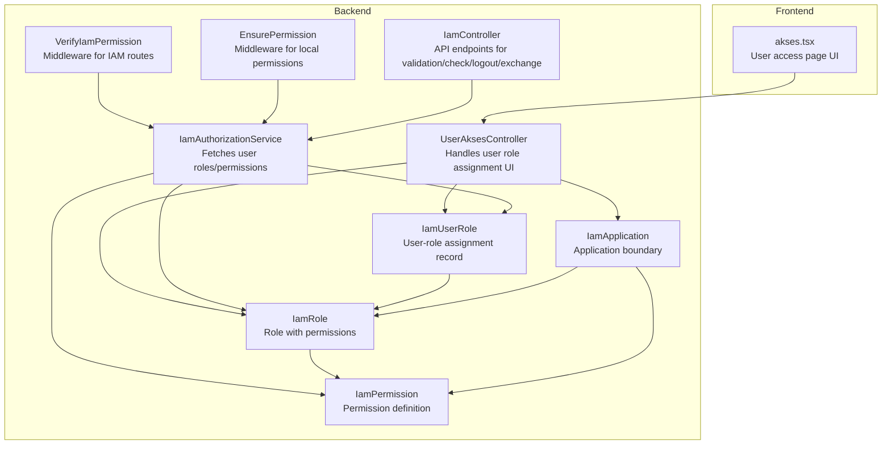
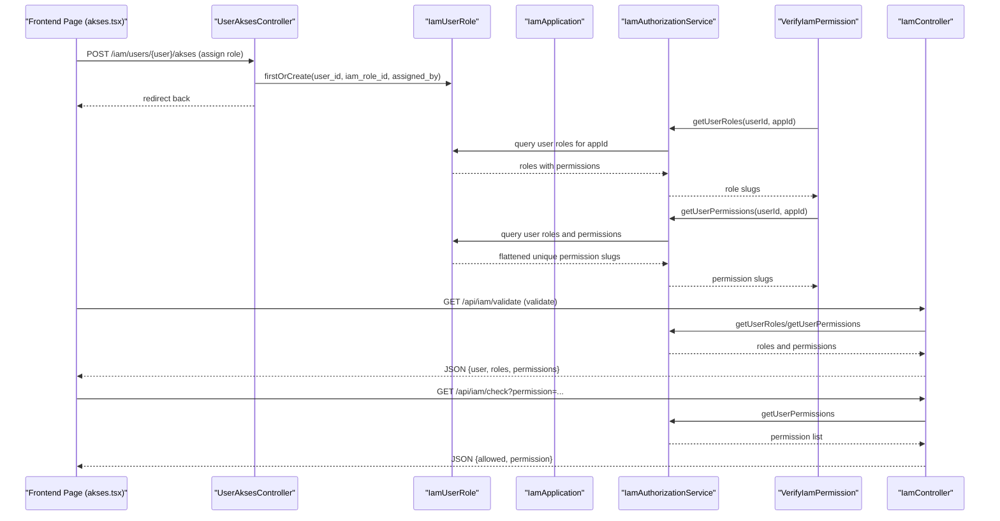
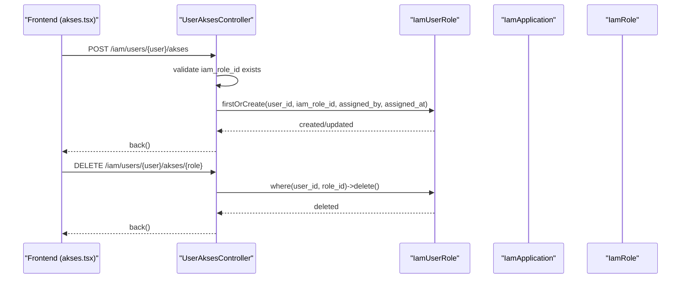
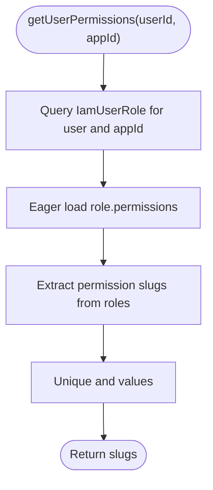
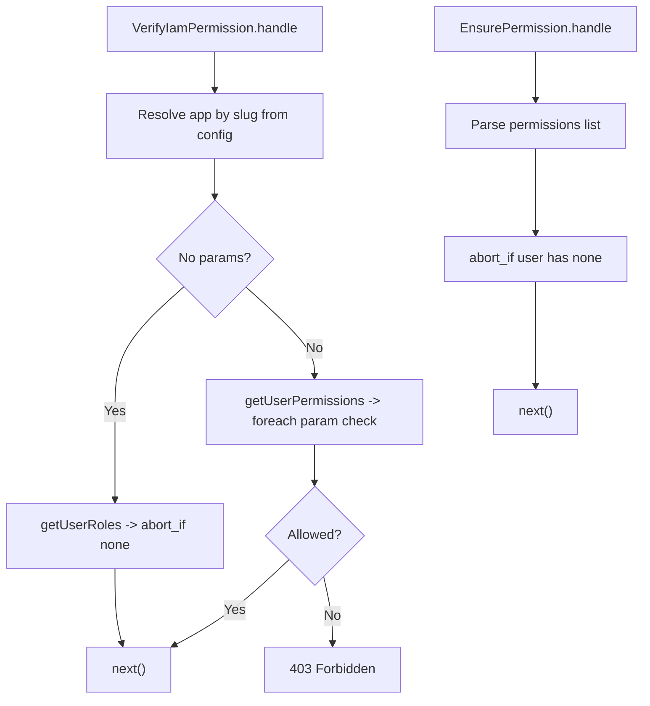
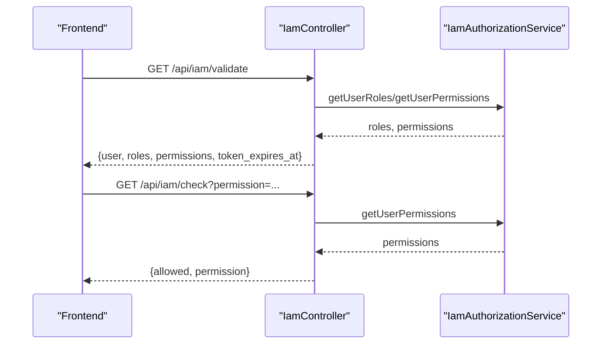
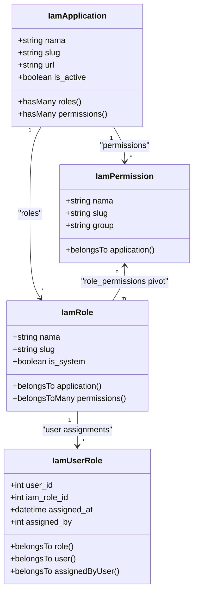
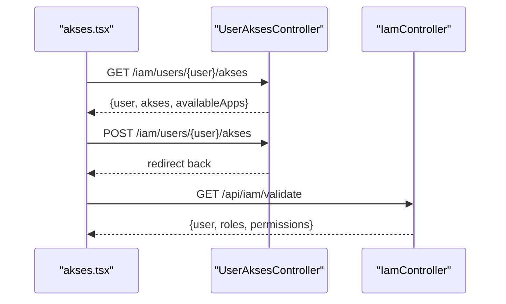
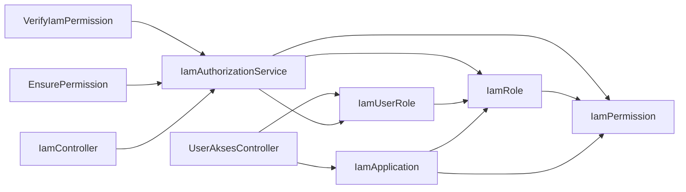

# User Access Controller

<cite>
**Referenced Files in This Document**
- [UserAksesController.php](file://app/Http/Controllers/Iam/UserAksesController.php)
- [IamAuthorizationService.php](file://app/Services/IamAuthorizationService.php)
- [VerifyIamPermission.php](file://app/Http/Middleware/VerifyIamPermission.php)
- [EnsurePermission.php](file://app/Http/Middleware/EnsurePermission.php)
- [IamController.php](file://app/Http/Controllers/Api/IamController.php)
- [IamUserRole.php](file://app/Models/IamUserRole.php)
- [IamRole.php](file://app/Models/IamRole.php)
- [IamPermission.php](file://app/Models/IamPermission.php)
- [IamApplication.php](file://app/Models/IamApplication.php)
- [akses.tsx](file://resources/js/pages/iam/users/akses.tsx)
- [iam.php](file://config/iam.php)
- [2026_03_21_000001_create_iam_tables.php](file://database/migrations/2026_03_21_000001_create_iam_tables.php)
- [2026-03-21-iam-sso-design.md](file://docs/superpowers/specs/2026-03-21-iam-sso-design.md)
</cite>

## Table of Contents
1. [Introduction](#introduction)
2. [Project Structure](#project-structure)
3. [Core Components](#core-components)
4. [Architecture Overview](#architecture-overview)
5. [Detailed Component Analysis](#detailed-component-analysis)
6. [Dependency Analysis](#dependency-analysis)
7. [Performance Considerations](#performance-considerations)
8. [Troubleshooting Guide](#troubleshooting-guide)
9. [Conclusion](#conclusion)

## Introduction
This document describes the User Access Controller (UAC) subsystem responsible for managing user role assignments, validating permissions, and enforcing access control across applications. It explains how users, roles, and permissions relate through the IamUserRole model, how role assignment is validated, and how permission inheritance works. It also covers integration with the user management interface, examples of role updates and permission checks, conflict resolution, cascading effects, and audit trails for access modifications.

## Project Structure
The UAC spans backend controllers, middleware, services, models, and frontend pages:
- Backend controllers manage user access CRUD operations.
- Middleware enforces permission checks at runtime.
- Services encapsulate authorization queries for roles and permissions.
- Models define the RBAC data model and relationships.
- Frontend pages render user access management UI and submit requests.

**Diagram sources**
- [UserAksesController.php:14-49](file://app/Http/Controllers/Iam/UserAksesController.php#L14-L49)
- [IamAuthorizationService.php:7-44](file://app/Services/IamAuthorizationService.php#L7-L44)
- [VerifyIamPermission.php:12-53](file://app/Http/Middleware/VerifyIamPermission.php#L12-L53)
- [EnsurePermission.php:9-36](file://app/Http/Middleware/EnsurePermission.php#L9-L36)
- [IamController.php:13-91](file://app/Http/Controllers/Api/IamController.php#L13-L91)
- [IamUserRole.php:7-32](file://app/Models/IamUserRole.php#L7-L32)
- [IamRole.php:10-37](file://app/Models/IamRole.php#L10-L37)
- [IamPermission.php:9-21](file://app/Models/IamPermission.php#L9-L21)
- [IamApplication.php:12-43](file://app/Models/IamApplication.php#L12-L43)
- [akses.tsx:44-431](file://resources/js/pages/iam/users/akses.tsx#L44-L431)

**Section sources**
- [UserAksesController.php:14-49](file://app/Http/Controllers/Iam/UserAksesController.php#L14-L49)
- [IamAuthorizationService.php:7-44](file://app/Services/IamAuthorizationService.php#L7-L44)
- [VerifyIamPermission.php:12-53](file://app/Http/Middleware/VerifyIamPermission.php#L12-L53)
- [EnsurePermission.php:9-36](file://app/Http/Middleware/EnsurePermission.php#L9-L36)
- [IamController.php:13-91](file://app/Http/Controllers/Api/IamController.php#L13-L91)
- [IamUserRole.php:7-32](file://app/Models/IamUserRole.php#L7-L32)
- [IamRole.php:10-37](file://app/Models/IamRole.php#L10-L37)
- [IamPermission.php:9-21](file://app/Models/IamPermission.php#L9-L21)
- [IamApplication.php:12-43](file://app/Models/IamApplication.php#L12-L43)
- [akses.tsx:44-431](file://resources/js/pages/iam/users/akses.tsx#L44-L431)

## Core Components
- UserAksesController: Provides the user access management UI and handles adding/removing roles for users.
- IamAuthorizationService: Centralized service to compute effective user permissions and roles scoped to an application.
- VerifyIamPermission: Middleware that validates user roles/permissions for IAM-scoped routes.
- EnsurePermission: Middleware for enforcing local policy-based permissions.
- IamController: API endpoints for validating user access, checking permissions, logout, and exchanging SSO codes.
- Models: IamUserRole, IamRole, IamPermission, IamApplication define the RBAC schema and relationships.
- Frontend akses.tsx: Renders user access records, available applications and roles, and submits role assignment requests.

Key responsibilities:
- Role assignment workflows: Add/remove roles to users with audit trail (assigned_at, assigned_by).
- Permission verification: Compute effective permissions per application for a user.
- Access control enforcement: Middleware gating routes based on roles or specific permissions.
- Frontend integration: UI to select application and role, display assigned roles and permissions, and revoke access.

**Section sources**
- [UserAksesController.php:16-48](file://app/Http/Controllers/Iam/UserAksesController.php#L16-L48)
- [IamAuthorizationService.php:16-43](file://app/Services/IamAuthorizationService.php#L16-L43)
- [VerifyIamPermission.php:16-51](file://app/Http/Middleware/VerifyIamPermission.php#L16-L51)
- [EnsurePermission.php:11-34](file://app/Http/Middleware/EnsurePermission.php#L11-L34)
- [IamController.php:17-89](file://app/Http/Controllers/Api/IamController.php#L17-L89)
- [IamUserRole.php:9-31](file://app/Models/IamUserRole.php#L9-L31)
- [IamRole.php:14-36](file://app/Models/IamRole.php#L14-L36)
- [IamPermission.php:13-20](file://app/Models/IamPermission.php#L13-L20)
- [IamApplication.php:16-26](file://app/Models/IamApplication.php#L16-L26)
- [akses.tsx:114-145](file://resources/js/pages/iam/users/akses.tsx#L114-L145)

## Architecture Overview
The UAC architecture separates concerns across controllers, middleware, services, and models, with a clear separation between application-scoped IAM permissions and local policy permissions.

**Diagram sources**
- [akses.tsx:114-145](file://resources/js/pages/iam/users/akses.tsx#L114-L145)
- [UserAksesController.php:33-42](file://app/Http/Controllers/Iam/UserAksesController.php#L33-L42)
- [IamAuthorizationService.php:16-43](file://app/Services/IamAuthorizationService.php#L16-L43)
- [VerifyIamPermission.php:16-51](file://app/Http/Middleware/VerifyIamPermission.php#L16-L51)
- [IamController.php:17-44](file://app/Http/Controllers/Api/IamController.php#L17-L44)

## Detailed Component Analysis

### UserAksesController: Role Assignment and Access Management
Responsibilities:
- Index: Lists users with their IAM role assignments.
- Show: Displays a user’s assigned roles, permissions, and who assigned them, plus available applications and roles.
- Store: Assigns a role to a user with validation and audit trail.
- Destroy: Revokes a role assignment.

Behavior highlights:
- Validation ensures the target role exists.
- Audit trail captures who assigned the role and when.
- Available applications filtered by active status and include roles for selection.

**Diagram sources**
- [UserAksesController.php:16-48](file://app/Http/Controllers/Iam/UserAksesController.php#L16-L48)
- [IamUserRole.php:9-16](file://app/Models/IamUserRole.php#L9-L16)
- [akses.tsx:114-145](file://resources/js/pages/iam/users/akses.tsx#L114-L145)

**Section sources**
- [UserAksesController.php:16-48](file://app/Http/Controllers/Iam/UserAksesController.php#L16-L48)
- [akses.tsx:114-145](file://resources/js/pages/iam/users/akses.tsx#L114-L145)

### IamAuthorizationService: Permission and Role Resolution
Responsibilities:
- getUserPermissions(userId, applicationId): Returns unique permission slugs for a user within an application by traversing user-role-permission graph.
- getUserRoles(userId, applicationId): Returns role slugs for a user within an application.

Design notes:
- Uses eager loading to minimize N+1 queries.
- Deduplicates permission slugs to avoid duplicates from overlapping roles.
- Application scoping ensures permissions are only resolved within the intended application boundary.

**Diagram sources**
- [IamAuthorizationService.php:16-26](file://app/Services/IamAuthorizationService.php#L16-L26)

**Section sources**
- [IamAuthorizationService.php:16-43](file://app/Services/IamAuthorizationService.php#L16-L43)

### Middleware: Access Control Enforcement
Two middleware enforce access control differently:

- VerifyIamPermission: Enforces IAM-scoped permissions and roles.
  - Resolves application by slug from config.
  - If no permission arguments provided: requires at least one role in the application.
  - If permission arguments provided: checks each requested permission against computed user permissions.
  - Uses caching for application lookup.

- EnsurePermission: Enforces local policy permissions.
  - Parses comma-separated permission lists and trims whitespace.
  - Requires user to have any of the specified permissions.

**Diagram sources**
- [VerifyIamPermission.php:16-51](file://app/Http/Middleware/VerifyIamPermission.php#L16-L51)
- [EnsurePermission.php:11-34](file://app/Http/Middleware/EnsurePermission.php#L11-L34)

**Section sources**
- [VerifyIamPermission.php:16-51](file://app/Http/Middleware/VerifyIamPermission.php#L16-L51)
- [EnsurePermission.php:11-34](file://app/Http/Middleware/EnsurePermission.php#L11-L34)

### API Endpoints: Validation, Check, Logout, Exchange
Endpoints under IamController provide runtime access validation and SSO token exchange:
- validate: Returns user info, roles, permissions, and token expiry for the current application.
- check: Checks if a user has a specific permission in the current application.
- logout: Invalidates the current personal access token.
- exchangeCode: Exchanges a short-lived SSO code for a scoped personal access token.

**Diagram sources**
- [IamController.php:17-44](file://app/Http/Controllers/Api/IamController.php#L17-L44)
- [IamAuthorizationService.php:16-26](file://app/Services/IamAuthorizationService.php#L16-L26)

**Section sources**
- [IamController.php:17-89](file://app/Http/Controllers/Api/IamController.php#L17-L89)

### Models: RBAC Data Model and Relationships
The RBAC model defines:
- IamApplication: Application boundary with unique slug and API credentials.
- IamRole: Roles within an application with unique slug per application.
- IamPermission: Permissions within an application with optional grouping.
- IamUserRole: Junction table linking users to roles with audit fields.

**Diagram sources**
- [IamApplication.php:16-26](file://app/Models/IamApplication.php#L16-L26)
- [IamRole.php:23-36](file://app/Models/IamRole.php#L23-L36)
- [IamPermission.php:17-20](file://app/Models/IamPermission.php#L17-L20)
- [IamUserRole.php:18-31](file://app/Models/IamUserRole.php#L18-L31)
- [2026_03_21_000001_create_iam_tables.php:14-66](file://database/migrations/2026_03_21_000001_create_iam_tables.php#L14-L66)

**Section sources**
- [IamApplication.php:16-26](file://app/Models/IamApplication.php#L16-L26)
- [IamRole.php:23-36](file://app/Models/IamRole.php#L23-L36)
- [IamPermission.php:17-20](file://app/Models/IamPermission.php#L17-L20)
- [IamUserRole.php:18-31](file://app/Models/IamUserRole.php#L18-L31)
- [2026_03_21_000001_create_iam_tables.php:14-66](file://database/migrations/2026_03_21_000001_create_iam_tables.php#L14-L66)

### Frontend Integration: User Access Management UI
The frontend page supports:
- Listing available applications and roles filtered by application selection.
- Adding a role assignment with validation and feedback.
- Displaying assigned roles grouped by application with permissions preview.
- Revoking roles with confirmation modal.

**Diagram sources**
- [akses.tsx:44-431](file://resources/js/pages/iam/users/akses.tsx#L44-L431)
- [UserAksesController.php:22-31](file://app/Http/Controllers/Iam/UserAksesController.php#L22-L31)
- [IamController.php:17-29](file://app/Http/Controllers/Api/IamController.php#L17-L29)

**Section sources**
- [akses.tsx:44-431](file://resources/js/pages/iam/users/akses.tsx#L44-L431)
- [UserAksesController.php:22-31](file://app/Http/Controllers/Iam/UserAksesController.php#L22-L31)
- [IamController.php:17-29](file://app/Http/Controllers/Api/IamController.php#L17-L29)

## Dependency Analysis
- Controllers depend on models and services to resolve data and enforce business rules.
- Middleware depends on services to compute effective permissions and roles.
- Frontend depends on controller endpoints and API responses to render and submit data.
- Models define strict foreign key relationships and unique constraints to prevent conflicts.

**Diagram sources**
- [UserAksesController.php:6-8](file://app/Http/Controllers/Iam/UserAksesController.php#L6-L8)
- [VerifyIamPermission.php:5-6](file://app/Http/Middleware/VerifyIamPermission.php#L5-L6)
- [EnsurePermission.php:5-6](file://app/Http/Middleware/EnsurePermission.php#L5-L6)
- [IamController.php:8](file://app/Http/Controllers/Api/IamController.php#L8)
- [IamAuthorizationService.php:5](file://app/Services/IamAuthorizationService.php#L5)
- [IamUserRole.php:18-21](file://app/Models/IamUserRole.php#L18-L21)
- [IamRole.php:28-35](file://app/Models/IamRole.php#L28-L35)
- [IamPermission.php:17-20](file://app/Models/IamPermission.php#L17-L20)
- [IamApplication.php:23-26](file://app/Models/IamApplication.php#L23-L26)

**Section sources**
- [UserAksesController.php:6-8](file://app/Http/Controllers/Iam/UserAksesController.php#L6-L8)
- [VerifyIamPermission.php:5-6](file://app/Http/Middleware/VerifyIamPermission.php#L5-L6)
- [EnsurePermission.php:5-6](file://app/Http/Middleware/EnsurePermission.php#L5-L6)
- [IamController.php:8](file://app/Http/Controllers/Api/IamController.php#L8)
- [IamAuthorizationService.php:5](file://app/Services/IamAuthorizationService.php#L5)
- [IamUserRole.php:18-21](file://app/Models/IamUserRole.php#L18-L21)
- [IamRole.php:28-35](file://app/Models/IamRole.php#L28-L35)
- [IamPermission.php:17-20](file://app/Models/IamPermission.php#L17-L20)
- [IamApplication.php:23-26](file://app/Models/IamApplication.php#L23-L26)

## Performance Considerations
- Eager loading: Services load related roles and permissions to avoid N+1 queries.
- Caching: Middleware caches application lookup by slug for 1 hour.
- Unique deduplication: Permission slugs are uniqued to reduce downstream checks.
- Pagination: User listing uses pagination to limit payload size.

Recommendations:
- Consider indexing frequent filter columns (e.g., user_id, iam_application_id) if query volume grows.
- Monitor cache invalidation strategy for application metadata changes.
- Batch role assignment operations if assigning many roles at once.

[No sources needed since this section provides general guidance]

## Troubleshooting Guide
Common issues and resolutions:
- Unauthenticated requests: Both middlewares return appropriate responses when no user is present.
- Application not found: Verify application slug in config and ensure the application exists and is active.
- Permission denied: Confirm the user has at least one role in the application or possesses the required permission slug.
- Role assignment fails: Ensure the role exists and belongs to the correct application.
- Conflicts: Unique constraint on user-role prevents duplicate assignments; firstOrCreate handles this gracefully.
- Audit trail: assigned_at and assigned_by are recorded for every assignment; use them to track changes.

**Section sources**
- [VerifyIamPermission.php:20-24](file://app/Http/Middleware/VerifyIamPermission.php#L20-L24)
- [VerifyIamPermission.php:32-34](file://app/Http/Middleware/VerifyIamPermission.php#L32-L34)
- [EnsurePermission.php:15-21](file://app/Http/Middleware/EnsurePermission.php#L15-L21)
- [UserAksesController.php:35-40](file://app/Http/Controllers/Iam/UserAksesController.php#L35-L40)
- [IamUserRole.php:9-16](file://app/Models/IamUserRole.php#L9-L16)

## Conclusion
The User Access Controller integrates controllers, middleware, services, and models to provide robust role assignment, permission validation, and access control enforcement. It scopes permissions to applications, maintains audit trails, and offers both UI and API integrations for seamless user management. The design balances clarity, performance, and security while supporting future enhancements.