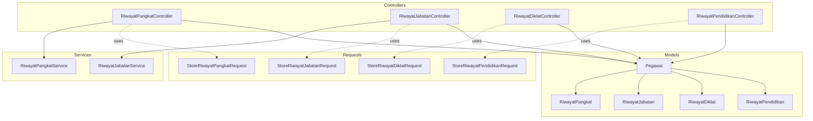
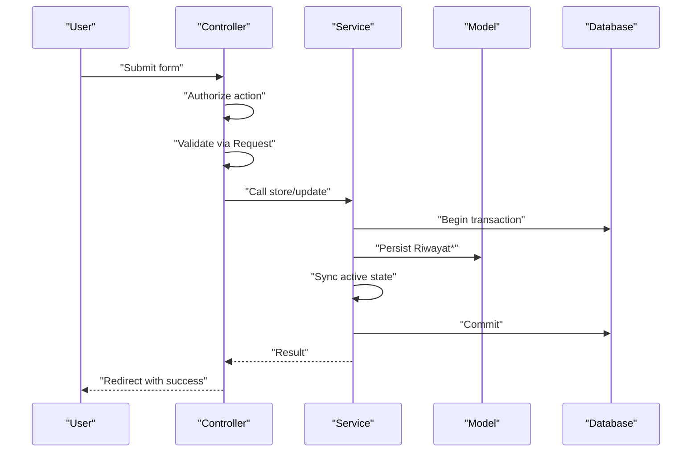
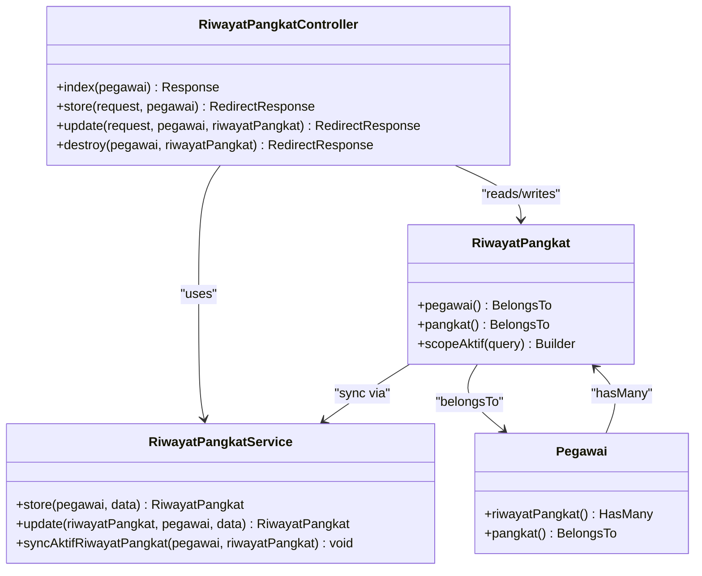
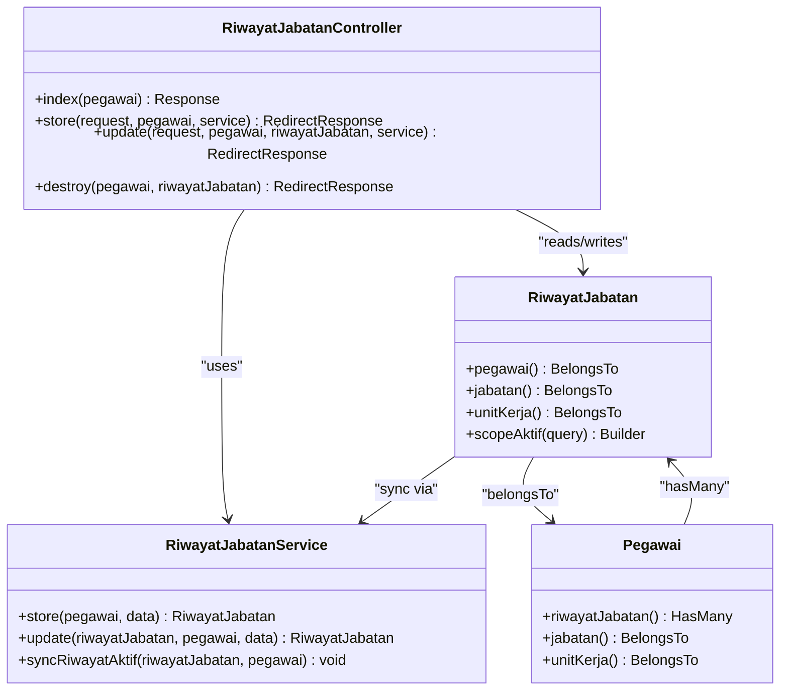
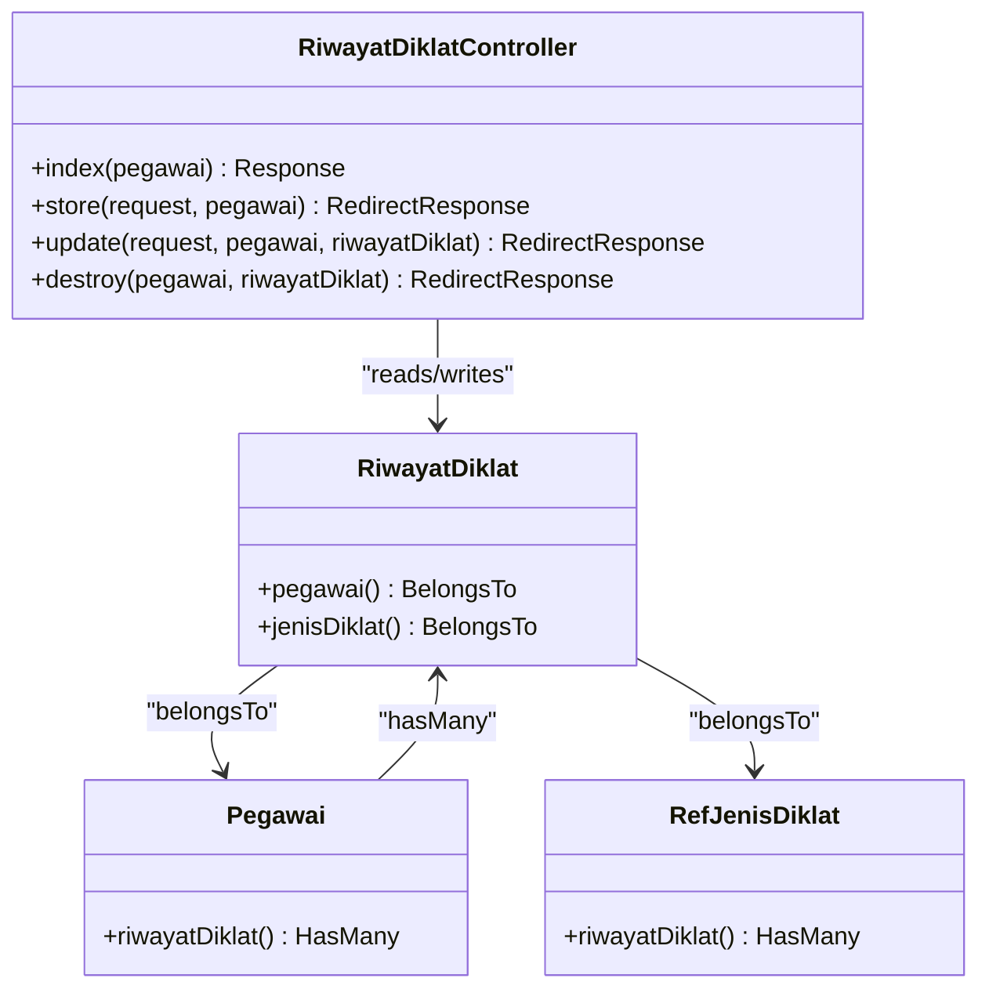
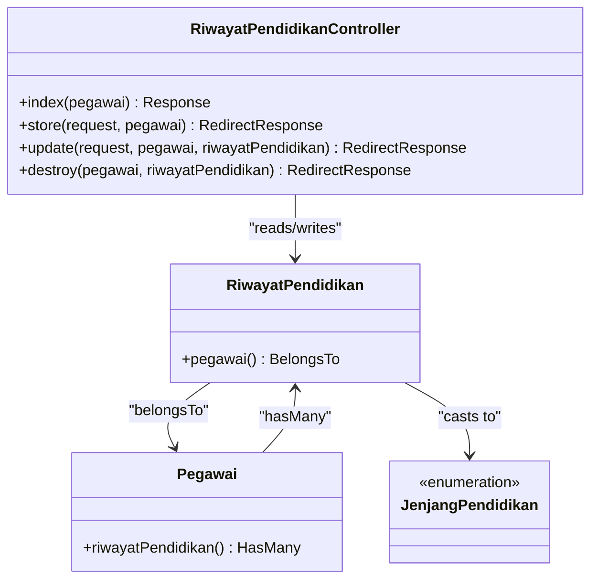
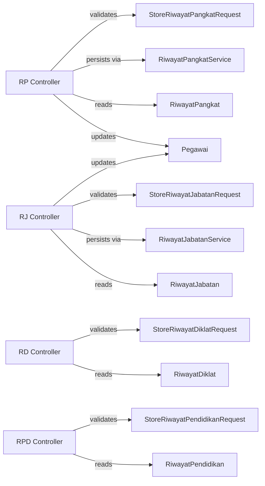

# Career Progression Controllers

<cite>
**Referenced Files in This Document**
- [RiwayatPangkatController.php](file://app/Http/Controllers/Kepegawaian/RiwayatPangkatController.php)
- [RiwayatJabatanController.php](file://app/Http/Controllers/Kepegawaian/RiwayatJabatanController.php)
- [RiwayatDiklatController.php](file://app/Http/Controllers/Kepegawaian/RiwayatDiklatController.php)
- [RiwayatPendidikanController.php](file://app/Http/Controllers/Kepegawaian/RiwayatPendidikanController.php)
- [RiwayatPangkatService.php](file://app/Services/RiwayatPangkatService.php)
- [RiwayatJabatanService.php](file://app/Services/RiwayatJabatanService.php)
- [StoreRiwayatPangkatRequest.php](file://app/Http/Requests/Kepegawaian/StoreRiwayatPangkatRequest.php)
- [StoreRiwayatJabatanRequest.php](file://app/Http/Requests/Kepegawaian/StoreRiwayatJabatanRequest.php)
- [StoreRiwayatDiklatRequest.php](file://app/Http/Requests/Kepegawaian/StoreRiwayatDiklatRequest.php)
- [StoreRiwayatPendidikanRequest.php](file://app/Http/Requests/Kepegawaian/StoreRiwayatPendidikanRequest.php)
- [Pegawai.php](file://app/Models/Pegawai.php)
- [RiwayatPangkat.php](file://app/Models/RiwayatPangkat.php)
- [RiwayatJabatan.php](file://app/Models/RiwayatJabatan.php)
- [RiwayatDiklat.php](file://app/Models/RiwayatDiklat.php)
- [RiwayatPendidikan.php](file://app/Models/RiwayatPendidikan.php)
</cite>

## Table of Contents
1. [Introduction](#introduction)
2. [Project Structure](#project-structure)
3. [Core Components](#core-components)
4. [Architecture Overview](#architecture-overview)
5. [Detailed Component Analysis](#detailed-component-analysis)
6. [Dependency Analysis](#dependency-analysis)
7. [Performance Considerations](#performance-considerations)
8. [Troubleshooting Guide](#troubleshooting-guide)
9. [Conclusion](#conclusion)

## Introduction
This document explains the career progression tracking controllers that manage historical records for civil servants: RiwayatPangkatController (rank advancement), RiwayatJabatanController (position changes), RiwayatDiklatController (professional training), and RiwayatPendidikanController (educational background). It covers shared patterns across controllers (CRUD, authorization, validation, and UI rendering), specialized behaviors per controller (active record synchronization, reference options, and ordering), and integration with the main Pegawai model and related reference entities.

## Project Structure
Each controller follows a consistent MVC pattern:
- Controller handles HTTP requests, authorization, and renders Inertia views.
- Request classes define strict validation rules.
- Services encapsulate transactional logic for active-state synchronization.
- Models define relations, casting, and scopes.
- UI components consume the rendered props to render forms and tables.

**Diagram sources**
- [RiwayatPangkatController.php:17-118](file://app/Http/Controllers/Kepegawaian/RiwayatPangkatController.php#L17-L118)
- [RiwayatJabatanController.php:18-106](file://app/Http/Controllers/Kepegawaian/RiwayatJabatanController.php#L18-L106)
- [RiwayatDiklatController.php:16-92](file://app/Http/Controllers/Kepegawaian/RiwayatDiklatController.php#L16-L92)
- [RiwayatPendidikanController.php:16-93](file://app/Http/Controllers/Kepegawaian/RiwayatPendidikanController.php#L16-L93)
- [RiwayatPangkatService.php:9-55](file://app/Services/RiwayatPangkatService.php#L9-L55)
- [RiwayatJabatanService.php:9-50](file://app/Services/RiwayatJabatanService.php#L9-L50)
- [StoreRiwayatPangkatRequest.php:8-52](file://app/Http/Requests/Kepegawaian/StoreRiwayatPangkatRequest.php#L8-L52)
- [StoreRiwayatJabatanRequest.php:7-48](file://app/Http/Requests/Kepegawaian/StoreRiwayatJabatanRequest.php#L7-L48)
- [StoreRiwayatDiklatRequest.php:8-49](file://app/Http/Requests/Kepegawaian/StoreRiwayatDiklatRequest.php#L8-L49)
- [StoreRiwayatPendidikanRequest.php:10-53](file://app/Http/Requests/Kepegawaian/StoreRiwayatPendidikanRequest.php#L10-L53)
- [Pegawai.php:24-138](file://app/Models/Pegawai.php#L24-L138)
- [RiwayatPangkat.php:11-59](file://app/Models/RiwayatPangkat.php#L11-L59)
- [RiwayatJabatan.php:11-59](file://app/Models/RiwayatJabatan.php#L11-L59)
- [RiwayatDiklat.php:10-51](file://app/Models/RiwayatDiklat.php#L10-L51)
- [RiwayatPendidikan.php:11-42](file://app/Models/RiwayatPendidikan.php#L11-L42)

**Section sources**
- [RiwayatPangkatController.php:17-118](file://app/Http/Controllers/Kepegawaian/RiwayatPangkatController.php#L17-L118)
- [RiwayatJabatanController.php:18-106](file://app/Http/Controllers/Kepegawaian/RiwayatJabatanController.php#L18-L106)
- [RiwayatDiklatController.php:16-92](file://app/Http/Controllers/Kepegawaian/RiwayatDiklatController.php#L16-L92)
- [RiwayatPendidikanController.php:16-93](file://app/Http/Controllers/Kepegawaian/RiwayatPendidikanController.php#L16-L93)

## Core Components
- Controllers
  - RiwayatPangkatController: Manages rank history with active-state synchronization and updates the current pangkat on the Pegawai record.
  - RiwayatJabatanController: Manages position and unit history with active-state synchronization and updates current jabatan and unit on Pegawai.
  - RiwayatDiklatController: Manages professional training records with reference classification by jenis diklat.
  - RiwayatPendidikanController: Manages educational background using enumerated jenjang values.
- Services
  - RiwayatPangkatService: Ensures only one active RiwayatPangkat per Pegawai and updates the Pegawai’s ref_pangkat_id accordingly.
  - RiwayatJabatanService: Ensures only one active RiwayatJabatan per Pegawai and updates the Pegawai’s ref_jabatan_id and ref_unit_kerja_id.
- Requests
  - Strict validation rules per controller to enforce data integrity and meaningful defaults.
- Models and Relations
  - Each Riwayat* model belongs to Pegawai and optionally to a reference model (e.g., RefPangkat, RefJabatan, RefUnitKerja, RefJenisDiklat).
  - ScopeAktif helpers filter active records.

**Section sources**
- [RiwayatPangkatService.php:9-55](file://app/Services/RiwayatPangkatService.php#L9-L55)
- [RiwayatJabatanService.php:9-50](file://app/Services/RiwayatJabatanService.php#L9-L50)
- [StoreRiwayatPangkatRequest.php:8-52](file://app/Http/Requests/Kepegawaian/StoreRiwayatPangkatRequest.php#L8-L52)
- [StoreRiwayatJabatanRequest.php:7-48](file://app/Http/Requests/Kepegawaian/StoreRiwayatJabatanRequest.php#L7-L48)
- [StoreRiwayatDiklatRequest.php:8-49](file://app/Http/Requests/Kepegawaian/StoreRiwayatDiklatRequest.php#L8-L49)
- [StoreRiwayatPendidikanRequest.php:10-53](file://app/Http/Requests/Kepegawaian/StoreRiwayatPendidikanRequest.php#L10-L53)
- [Pegawai.php:97-117](file://app/Models/Pegawai.php#L97-L117)
- [RiwayatPangkat.php:44-57](file://app/Models/RiwayatPangkat.php#L44-L57)
- [RiwayatJabatan.php:39-57](file://app/Models/RiwayatJabatan.php#L39-L57)
- [RiwayatDiklat.php:41-49](file://app/Models/RiwayatDiklat.php#L41-L49)
- [RiwayatPendidikan.php:37-41](file://app/Models/RiwayatPendidikan.php#L37-L41)

## Architecture Overview
The controllers delegate persistence and active-state logic to services, while validation is enforced by dedicated request classes. The UI receives structured props for rendering lists and forms.

**Diagram sources**
- [RiwayatPangkatController.php:87-94](file://app/Http/Controllers/Kepegawaian/RiwayatPangkatController.php#L87-L94)
- [RiwayatJabatanController.php:76-83](file://app/Http/Controllers/Kepegawaian/RiwayatJabatanController.php#L76-L83)
- [RiwayatPangkatService.php:11-22](file://app/Services/RiwayatPangkatService.php#L11-L22)
- [RiwayatJabatanService.php:11-22](file://app/Services/RiwayatJabatanService.php#L11-L22)

## Detailed Component Analysis

### RiwayatPangkatController
- Purpose: Manage historical rank promotions with active-state enforcement and current pangkat synchronization.
- Authorization: Uses policy gates for view and update actions scoped to the Pegawai resource.
- Validation: Enforced by StoreRiwayatPangkatRequest and UpdateRiwayatPangkatRequest.
- Active synchronization: Delegated to RiwayatPangkatService to ensure only one active record and to update Pegawai.ref_pangkat_id.
- Ordering: Lists ordered by is_aktif desc, then tmt desc, then created_at desc.
- UI props: Includes pegawai summary, store URL, list of riwayatPangkat with nested ref_pangkat details, and refPangkatOptions.

**Diagram sources**
- [RiwayatPangkatController.php:17-118](file://app/Http/Controllers/Kepegawaian/RiwayatPangkatController.php#L17-L118)
- [RiwayatPangkatService.php:9-55](file://app/Services/RiwayatPangkatService.php#L9-L55)
- [RiwayatPangkat.php:11-59](file://app/Models/RiwayatPangkat.php#L11-L59)
- [Pegawai.php:97-117](file://app/Models/Pegawai.php#L97-L117)

**Section sources**
- [RiwayatPangkatController.php:21-85](file://app/Http/Controllers/Kepegawaian/RiwayatPangkatController.php#L21-L85)
- [RiwayatPangkatController.php:87-116](file://app/Http/Controllers/Kepegawaian/RiwayatPangkatController.php#L87-L116)
- [RiwayatPangkatService.php:39-53](file://app/Services/RiwayatPangkatService.php#L39-L53)
- [StoreRiwayatPangkatRequest.php:15-29](file://app/Http/Requests/Kepegawaian/StoreRiwayatPangkatRequest.php#L15-L29)

### RiwayatJabatanController
- Purpose: Manage historical positions and units with active-state enforcement and current jabatan/unit synchronization.
- Authorization: Policy gates for view and update.
- Validation: Enforced by StoreRiwayatJabatanRequest and UpdateRiwayatJabatanRequest.
- Active synchronization: Delegated to RiwayatJabatanService to ensure only one active record and to update Pegawai.ref_jabatan_id and ref_unit_kerja_id.
- Ordering: Lists ordered by is_aktif desc, then tmt desc, then tanggal_sk desc.
- UI props: Includes pegawai summary, store URL, list with nested jabatan and unitKerja, and reference options for jabatan and unit_kerja.

**Diagram sources**
- [RiwayatJabatanController.php:18-106](file://app/Http/Controllers/Kepegawaian/RiwayatJabatanController.php#L18-L106)
- [RiwayatJabatanService.php:9-50](file://app/Services/RiwayatJabatanService.php#L9-L50)
- [RiwayatJabatan.php:11-59](file://app/Models/RiwayatJabatan.php#L11-L59)
- [Pegawai.php:97-117](file://app/Models/Pegawai.php#L97-L117)

**Section sources**
- [RiwayatJabatanController.php:20-74](file://app/Http/Controllers/Kepegawaian/RiwayatJabatanController.php#L20-L74)
- [RiwayatJabatanController.php:76-104](file://app/Http/Controllers/Kepegawaian/RiwayatJabatanController.php#L76-L104)
- [RiwayatJabatanService.php:37-48](file://app/Services/RiwayatJabatanService.php#L37-L48)
- [StoreRiwayatJabatanRequest.php:14-26](file://app/Http/Requests/Kepegawaian/StoreRiwayatJabatanRequest.php#L14-L26)

### RiwayatDiklatController
- Purpose: Manage professional training records with optional jenis diklat classification.
- Authorization: Policy gates for view and update.
- Validation: Enforced by StoreRiwayatDiklatRequest and UpdateRiwayatDiklatRequest.
- Ordering: Lists ordered by tanggal_mulai desc.
- UI props: Includes pegawai summary, store URL, list with nested jenisDiklat, and jenisDiklatOptions.

**Diagram sources**
- [RiwayatDiklatController.php:16-92](file://app/Http/Controllers/Kepegawaian/RiwayatDiklatController.php#L16-L92)
- [RiwayatDiklat.php:10-51](file://app/Models/RiwayatDiklat.php#L10-L51)
- [Pegawai.php:104-107](file://app/Models/Pegawai.php#L104-L107)

**Section sources**
- [RiwayatDiklatController.php:18-59](file://app/Http/Controllers/Kepegawaian/RiwayatDiklatController.php#L18-L59)
- [RiwayatDiklatController.php:61-90](file://app/Http/Controllers/Kepegawaian/RiwayatDiklatController.php#L61-L90)
- [StoreRiwayatDiklatRequest.php:20-34](file://app/Http/Requests/Kepegawaian/StoreRiwayatDiklatRequest.php#L20-L34)

### RiwayatPendidikanController
- Purpose: Manage educational background using enumerated jenjang values.
- Authorization: Policy gates for view and update.
- Validation: Enforced by StoreRiwayatPendidikanRequest and UpdateRiwayatPendidikanRequest.
- Ordering: Lists ordered by tahun_lulus desc, then tanggal_ijazah desc, then created_at desc.
- UI props: Includes pegawai summary, store URL, list with jenjang value/label, and jenjangOptions derived from the enum.

**Diagram sources**
- [RiwayatPendidikanController.php:16-93](file://app/Http/Controllers/Kepegawaian/RiwayatPendidikanController.php#L16-L93)
- [RiwayatPendidikan.php:11-42](file://app/Models/RiwayatPendidikan.php#L11-L42)
- [Pegawai.php:109-112](file://app/Models/Pegawai.php#L109-L112)

**Section sources**
- [RiwayatPendidikanController.php:18-59](file://app/Http/Controllers/Kepegawaian/RiwayatPendidikanController.php#L18-L59)
- [RiwayatPendidikanController.php:62-91](file://app/Http/Controllers/Kepegawaian/RiwayatPendidikanController.php#L62-L91)
- [StoreRiwayatPendidikanRequest.php:25-36](file://app/Http/Requests/Kepegawaian/StoreRiwayatPendidikanRequest.php#L25-L36)

## Dependency Analysis
- Controllers depend on:
  - Gate authorization for policy checks.
  - Request classes for validation.
  - Services for transactional persistence and active-state synchronization (pangkat and jabatan).
  - Models for relations and scopes.
- Controllers render Inertia responses with structured props for UI consumption.
- UI components rely on controller-provided URLs for store/update/delete actions.

**Diagram sources**
- [RiwayatPangkatController.php:87-116](file://app/Http/Controllers/Kepegawaian/RiwayatPangkatController.php#L87-L116)
- [RiwayatJabatanController.php:76-104](file://app/Http/Controllers/Kepegawaian/RiwayatJabatanController.php#L76-L104)
- [RiwayatDiklatController.php:61-90](file://app/Http/Controllers/Kepegawaian/RiwayatDiklatController.php#L61-L90)
- [RiwayatPendidikanController.php:62-91](file://app/Http/Controllers/Kepegawaian/RiwayatPendidikanController.php#L62-L91)
- [StoreRiwayatPangkatRequest.php:8-52](file://app/Http/Requests/Kepegawaian/StoreRiwayatPangkatRequest.php#L8-L52)
- [StoreRiwayatJabatanRequest.php:7-48](file://app/Http/Requests/Kepegawaian/StoreRiwayatJabatanRequest.php#L7-L48)
- [StoreRiwayatDiklatRequest.php:8-49](file://app/Http/Requests/Kepegawaian/StoreRiwayatDiklatRequest.php#L8-L49)
- [StoreRiwayatPendidikanRequest.php:10-53](file://app/Http/Requests/Kepegawaian/StoreRiwayatPendidikanRequest.php#L10-L53)
- [RiwayatPangkatService.php:9-55](file://app/Services/RiwayatPangkatService.php#L9-L55)
- [RiwayatJabatanService.php:9-50](file://app/Services/RiwayatJabatanService.php#L9-L50)
- [RiwayatPangkat.php:11-59](file://app/Models/RiwayatPangkat.php#L11-L59)
- [RiwayatJabatan.php:11-59](file://app/Models/RiwayatJabatan.php#L11-L59)
- [RiwayatDiklat.php:10-51](file://app/Models/RiwayatDiklat.php#L10-L51)
- [RiwayatPendidikan.php:11-42](file://app/Models/RiwayatPendidikan.php#L11-L42)
- [Pegawai.php:24-138](file://app/Models/Pegawai.php#L24-L138)

**Section sources**
- [RiwayatPangkatController.php:21-85](file://app/Http/Controllers/Kepegawaian/RiwayatPangkatController.php#L21-L85)
- [RiwayatJabatanController.php:20-74](file://app/Http/Controllers/Kepegawaian/RiwayatJabatanController.php#L20-L74)
- [RiwayatDiklatController.php:18-59](file://app/Http/Controllers/Kepegawaian/RiwayatDiklatController.php#L18-L59)
- [RiwayatPendidikanController.php:18-59](file://app/Http/Controllers/Kepegawaian/RiwayatPendidikanController.php#L18-L59)

## Performance Considerations
- Eager loading: Controllers load related references (e.g., pangkat, jabatan, unitKerja, jenisDiklat) to minimize N+1 queries.
- Ordering: Sorting by is_aktif desc and date fields ensures chronological and active-first presentation.
- Transactions: Services wrap updates in transactions to maintain consistency during active-state synchronization.
- UI rendering: Controllers map collections to arrays with minimal field selection to reduce payload sizes.

[No sources needed since this section provides general guidance]

## Troubleshooting Guide
- Authorization failures
  - Ensure the authenticated user has the appropriate permissions for the target Pegawai resource. Gate checks occur before any operation.
- Validation errors
  - Review request-specific messages returned by the validation classes to identify invalid fields (e.g., dates, numeric ranges, enum values).
- Active-state conflicts
  - If multiple active records appear after updates, verify that the service’s synchronization logic ran and updated other records to inactive.
- Reference mismatches
  - Confirm that foreign keys (ref_pangkat_id, ref_jabatan_id, ref_unit_kerja_id, ref_jenis_diklat_id) exist in their respective reference tables.

**Section sources**
- [RiwayatPangkatController.php:23-116](file://app/Http/Controllers/Kepegawaian/RiwayatPangkatController.php#L23-L116)
- [RiwayatJabatanController.php:22-104](file://app/Http/Controllers/Kepegawaian/RiwayatJabatanController.php#L22-L104)
- [RiwayatDiklatController.php:20-90](file://app/Http/Controllers/Kepegawaian/RiwayatDiklatController.php#L20-L90)
- [RiwayatPendidikanController.php:20-91](file://app/Http/Controllers/Kepegawaian/RiwayatPendidikanController.php#L20-L91)
- [StoreRiwayatPangkatRequest.php:31-50](file://app/Http/Requests/Kepegawaian/StoreRiwayatPangkatRequest.php#L31-L50)
- [StoreRiwayatJabatanRequest.php:28-46](file://app/Http/Requests/Kepegawaian/StoreRiwayatJabatanRequest.php#L28-L46)
- [StoreRiwayatDiklatRequest.php:36-47](file://app/Http/Requests/Kepegawaian/StoreRiwayatDiklatRequest.php#L36-L47)
- [StoreRiwayatPendidikanRequest.php:38-51](file://app/Http/Requests/Kepegawaian/StoreRiwayatPendidikanRequest.php#L38-L51)

## Conclusion
These controllers implement a consistent, robust pattern for managing historical career data:
- Shared patterns: Authorization via policies, strict validation via request classes, Inertia rendering, and relation-driven data retrieval.
- Specialized behaviors: Active-state synchronization for rank and position updates, reference-driven classifications for training and education, and enum-backed jenjang values.
- Integration: Tight coupling with the Pegawai model and its related reference entities ensures accurate historical tracking and current-position inference.