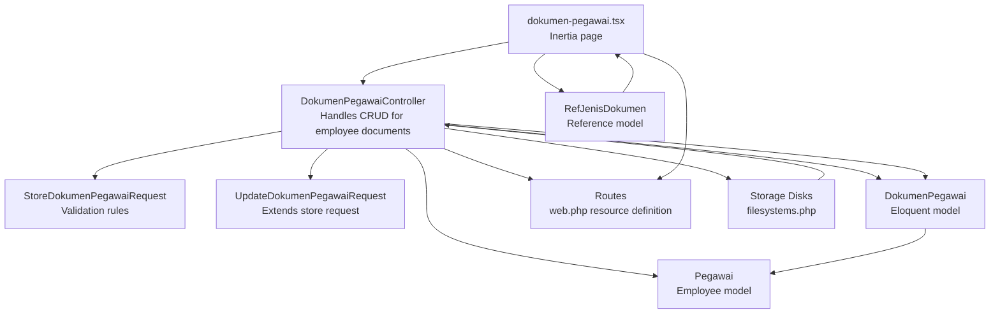
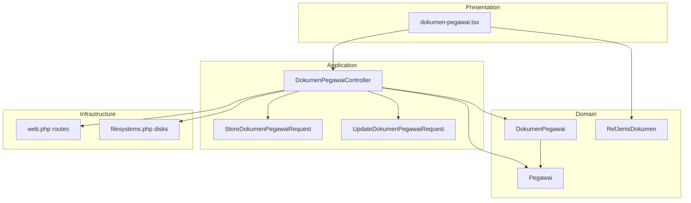
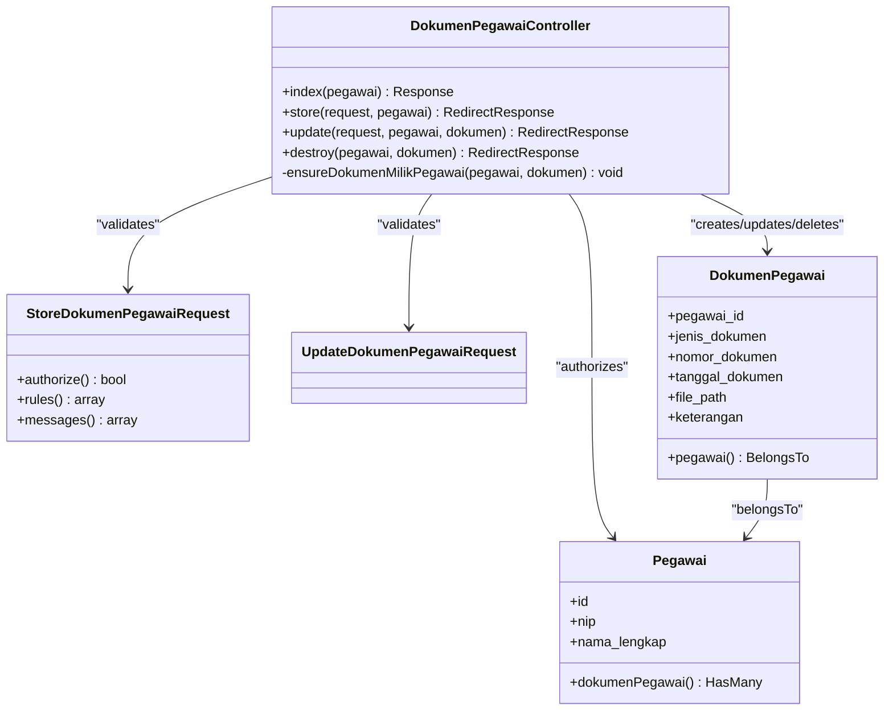
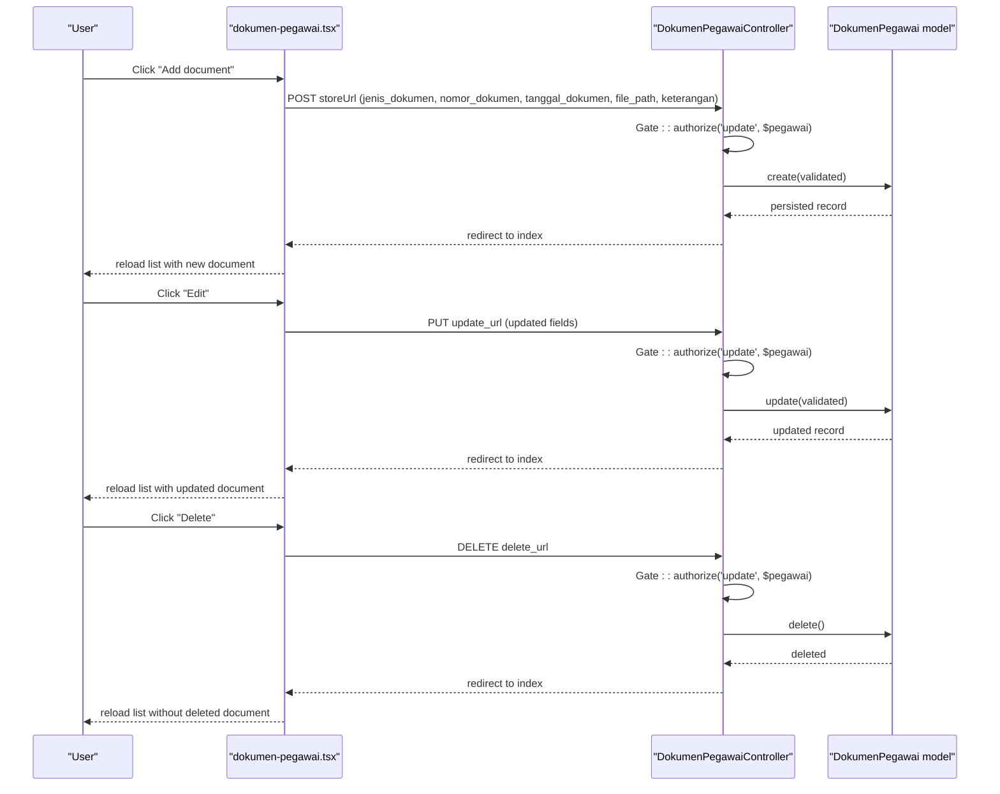
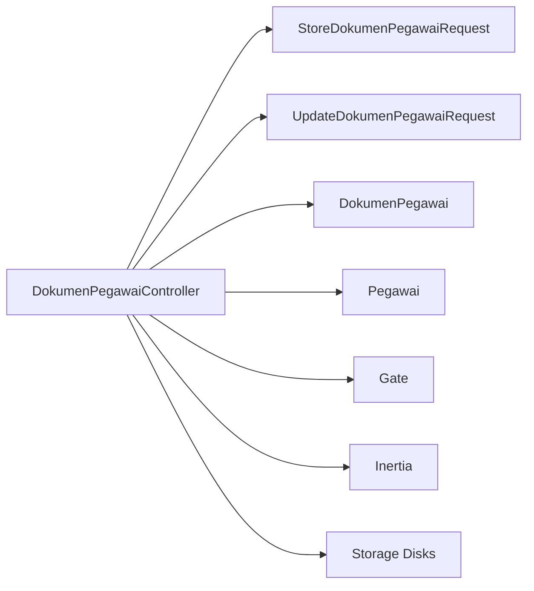

# Document Management Controller

<cite>
**Referenced Files in This Document**
- [DokumenPegawaiController.php](file://app/Http/Controllers/Kepegawaian/DokumenPegawaiController.php)
- [StoreDokumenPegawaiRequest.php](file://app/Http/Requests/Kepegawaian/StoreDokumenPegawaiRequest.php)
- [UpdateDokumenPegawaiRequest.php](file://app/Http/Requests/Kepegawaian/UpdateDokumenPegawaiRequest.php)
- [DokumenPegawai.php](file://app/Models/DokumenPegawai.php)
- [Pegawai.php](file://app/Models/Pegawai.php)
- [RefJenisDokumen.php](file://app/Models/RefJenisDokumen.php)
- [2026_03_15_032846_create_dokumen_pegawai_table.php](file://database/migrations/2026_03_15_032846_create_dokumen_pegawai_table.php)
- [2026_03_15_162757_create_ref_jenis_dokumen_table.php](file://database/migrations/2026_03_15_162757_create_ref_jenis_dokumen_table.php)
- [web.php](file://routes/web.php)
- [filesystems.php](file://config/filesystems.php)
- [dokumen-pegawai.tsx](file://resources/js/pages/kepegawaian/pegawai/dokumen-pegawai.tsx)
- [DokumenPegawaiTest.php](file://tests/Feature/Kepegawaian/DokumenPegawaiTest.php)
</cite>

## Table of Contents
1. [Introduction](#introduction)
2. [Project Structure](#project-structure)
3. [Core Components](#core-components)
4. [Architecture Overview](#architecture-overview)
5. [Detailed Component Analysis](#detailed-component-analysis)
6. [Dependency Analysis](#dependency-analysis)
7. [Performance Considerations](#performance-considerations)
8. [Troubleshooting Guide](#troubleshooting-guide)
9. [Conclusion](#conclusion)
10. [Appendices](#appendices)

## Introduction
This document provides comprehensive documentation for the employee document management controller focused on the DokumenPegawaiController. It explains the complete document lifecycle including upload handling, validation rules, storage integration, and retrieval mechanisms. It documents the form request validation patterns for document types, file size limits, and format restrictions. It also covers the relationship with reference models for document classification, attachment procedures, and document status tracking. Authorization patterns for document access, file security considerations, and audit logging requirements are detailed. Practical examples of document upload workflows, validation error handling, file download procedures, and document status management are included, along with integration notes for cloud storage services, file naming conventions, and document metadata management.

## Project Structure
The document management feature spans backend controllers, requests, models, migrations, routes, and frontend pages. The following diagram shows the primary components involved in the document lifecycle.

**Diagram sources**
- [DokumenPegawaiController.php:15-91](file://app/Http/Controllers/Kepegawaian/DokumenPegawaiController.php#L15-L91)
- [StoreDokumenPegawaiRequest.php:7-35](file://app/Http/Requests/Kepegawaian/StoreDokumenPegawaiRequest.php#L7-L35)
- [UpdateDokumenPegawaiRequest.php:5](file://app/Http/Requests/Kepegawaian/UpdateDokumenPegawaiRequest.php#L5)
- [DokumenPegawai.php:10-37](file://app/Models/DokumenPegawai.php#L10-L37)
- [Pegawai.php:24-122](file://app/Models/Pegawai.php#L24-L122)
- [web.php:93-97](file://routes/web.php#L93-L97)
- [filesystems.php:31-61](file://config/filesystems.php#L31-L61)
- [dokumen-pegawai.tsx:86-401](file://resources/js/pages/kepegawaian/pegawai/dokumen-pegawai.tsx#L86-L401)
- [RefJenisDokumen.php:10-28](file://app/Models/RefJenisDokumen.php#L10-L28)

**Section sources**
- [DokumenPegawaiController.php:15-91](file://app/Http/Controllers/Kepegawaian/DokumenPegawaiController.php#L15-L91)
- [web.php:93-97](file://routes/web.php#L93-L97)

## Core Components
- DokumenPegawaiController: Orchestrates document listing, creation, updates, and deletion for a specific employee. It enforces authorization policies and ensures documents belong to the targeted employee.
- StoreDokumenPegawaiRequest and UpdateDokumenPegawaiRequest: Define validation rules and messages for document attributes such as document type, number, date, file path, and description.
- DokumenPegawai model: Represents the document record with fillable attributes, casting for dates, soft deletes, and belongs-to relationship to Pegawai.
- Pegawai model: Defines the employee entity and the has-many relationship to DokumenPegawai.
- Reference model RefJenisDokumen: Provides a classification reference for document types.
- Routes: Resource routes define the REST endpoints for document management under the kepegawaian.pegawai.dokumen namespace.
- Frontend page dokumen-pegawai.tsx: Presents the UI for listing, adding, editing, and deleting documents, and submitting forms via Inertia.

**Section sources**
- [DokumenPegawaiController.php:17-90](file://app/Http/Controllers/Kepegawaian/DokumenPegawaiController.php#L17-L90)
- [StoreDokumenPegawaiRequest.php:14-34](file://app/Http/Requests/Kepegawaian/StoreDokumenPegawaiRequest.php#L14-L34)
- [UpdateDokumenPegawaiRequest.php:5](file://app/Http/Requests/Kepegawaian/UpdateDokumenPegawaiRequest.php#L5)
- [DokumenPegawai.php:16-36](file://app/Models/DokumenPegawai.php#L16-L36)
- [Pegawai.php:119-122](file://app/Models/Pegawai.php#L119-L122)
- [RefJenisDokumen.php:17-20](file://app/Models/RefJenisDokumen.php#L17-L20)
- [web.php:93-97](file://routes/web.php#L93-L97)
- [dokumen-pegawai.tsx:86-401](file://resources/js/pages/kepegawaian/pegawai/dokumen-pegawai.tsx#L86-L401)

## Architecture Overview
The document management feature follows a layered architecture:
- Presentation Layer: Inertia page renders the document list and form, submits actions via AJAX.
- Application Layer: DokumenPegawaiController handles HTTP requests, applies authorization, and orchestrates persistence.
- Domain Layer: Eloquent models encapsulate document and employee relationships and persistence.
- Infrastructure Layer: Storage disks (local, public, S3) provide file storage integration.

**Diagram sources**
- [dokumen-pegawai.tsx:86-401](file://resources/js/pages/kepegawaian/pegawai/dokumen-pegawai.tsx#L86-L401)
- [DokumenPegawaiController.php:15-91](file://app/Http/Controllers/Kepegawaian/DokumenPegawaiController.php#L15-L91)
- [StoreDokumenPegawaiRequest.php:7-35](file://app/Http/Requests/Kepegawaian/StoreDokumenPegawaiRequest.php#L7-L35)
- [UpdateDokumenPegawaiRequest.php:5](file://app/Http/Requests/Kepegawaian/UpdateDokumenPegawaiRequest.php#L5)
- [DokumenPegawai.php:10-37](file://app/Models/DokumenPegawai.php#L10-L37)
- [Pegawai.php:24-122](file://app/Models/Pegawai.php#L24-L122)
- [RefJenisDokumen.php:10-28](file://app/Models/RefJenisDokumen.php#L10-L28)
- [web.php:93-97](file://routes/web.php#L93-L97)
- [filesystems.php:31-61](file://config/filesystems.php#L31-L61)

## Detailed Component Analysis

### DokumenPegawaiController
Responsibilities:
- Index: Loads an employee’s documents with ordering and renders the Inertia page with URLs for store/update/delete.
- Store: Authorizes update action on the employee, validates input via StoreDokumenPegawaiRequest, persists the record, and redirects.
- Update: Authorizes update, ensures the document belongs to the employee, validates via UpdateDokumenPegawaiRequest, updates, and redirects.
- Destroy: Authorizes update, ensures ownership, deletes the record, and redirects.
- Ownership check: Private method ensures the document’s pegawai_id matches the requested employee.

Authorization and policies:
- Uses Gate::authorize('view', $pegawai) for index.
- Uses Gate::authorize('update', $pegawai) for store/update/destroy.
- Additional ownership guard via ensureDokumenMilikPegawai to prevent cross-employee edits/deletes.

Data loading and rendering:
- Eager loads dokumenPegawai ordered by jenis_dokumen, tanggal_dokumen desc, and created_at desc.
- Maps dokumen to a simplified structure with update_url and delete_url for UI actions.

**Section sources**
- [DokumenPegawaiController.php:17-90](file://app/Http/Controllers/Kepegawaian/DokumenPegawaiController.php#L17-L90)

#### Controller Class Diagram

**Diagram sources**
- [DokumenPegawaiController.php:15-91](file://app/Http/Controllers/Kepegawaian/DokumenPegawaiController.php#L15-L91)
- [StoreDokumenPegawaiRequest.php:7-35](file://app/Http/Requests/Kepegawaian/StoreDokumenPegawaiRequest.php#L7-L35)
- [UpdateDokumenPegawaiRequest.php:5](file://app/Http/Requests/Kepegawaian/UpdateDokumenPegawaiRequest.php#L5)
- [DokumenPegawai.php:10-37](file://app/Models/DokumenPegawai.php#L10-L37)
- [Pegawai.php:24-122](file://app/Models/Pegawai.php#L24-L122)

### Form Request Validation Patterns
Validation rules:
- jenis_dokumen: required, string, max 100.
- nomor_dokumen: nullable, string, max 100.
- tanggal_dokumen: nullable, date.
- file_path: nullable, string, max 500.
- keterangan: nullable, string.

Messages:
- Clear localized messages for required and length constraints.

Notes:
- The current implementation stores a file_path string. There is no built-in file upload handling in the controller or requests; uploads are not implemented in the backend for this controller.

**Section sources**
- [StoreDokumenPegawaiRequest.php:14-34](file://app/Http/Requests/Kepegawaian/StoreDokumenPegawaiRequest.php#L14-L34)

### Data Model and Relationships
DokumenPegawai:
- Fillable fields include pegawai_id, jenis_dokumen, nomor_dokumen, tanggal_dokumen, file_path, keterangan.
- Casts tanggal_dokumen to date and deleted_at to datetime.
- Soft-deleted to support non-destructive removal.
- Belongs to Pegawai.

Pegawai:
- Has many DokumenPegawai via dokumenPegawai().

Reference model RefJenisDokumen:
- Provides reference entries for document types (e.g., KTP, NPWP, Ijazah, SK CPNS, SK PNS, SK Pangkat, SK Jabatan, Kartu Pegawai, KARIS/KARSU, BPJS, Lainnya).

**Section sources**
- [DokumenPegawai.php:16-36](file://app/Models/DokumenPegawai.php#L16-L36)
- [Pegawai.php:119-122](file://app/Models/Pegawai.php#L119-L122)
- [RefJenisDokumen.php:17-20](file://app/Models/RefJenisDokumen.php#L17-L20)

### Database Schema
- dokumen_pegawai table:
  - id (ulid), pegawai_id (foreignUlid constrained to pegawai), jenis_dokumen (string, 100), nomor_dokumen (string, 100, nullable), tanggal_dokumen (date, nullable), file_path (string, 500, nullable), keterangan (text, nullable), timestamps, softDeletes.
- ref_jenis_dokumen table:
  - id (ulid), nama (string), keterangan (text, nullable), timestamps, softDeletes.

**Section sources**
- [2026_03_15_032846_create_dokumen_pegawai_table.php:11-21](file://database/migrations/2026_03_15_032846_create_dokumen_pegawai_table.php#L11-L21)
- [2026_03_15_162757_create_ref_jenis_dokumen_table.php:11-17](file://database/migrations/2026_03_15_162757_create_ref_jenis_dokumen_table.php#L11-L17)

### Routing and Authorization
- Resource routes under kepegawaian.pegawai.dokumen define index, store, update, and destroy actions.
- Authorization:
  - Gate::authorize('view', $pegawai) for index.
  - Gate::authorize('update', $pegawai) for store/update/destroy.
  - Additional ownership check via ensureDokumenMilikPegawai to prevent unauthorized edits/deletes.

**Section sources**
- [web.php:93-97](file://routes/web.php#L93-L97)
- [DokumenPegawaiController.php:19, 55, 67, 78, 89:19-89](file://app/Http/Controllers/Kepegawaian/DokumenPegawaiController.php#L19-L89)

### Frontend Integration and Workflow
- The Inertia page dokumen-pegawai.tsx:
  - Renders a table of documents with actions to edit and delete.
  - Provides a modal form to add or edit document details including jenis_dokumen, nomor_dokumen, tanggal_dokumen, file_path, and keterangan.
  - Submits via router.post for create and router.put for update; router.delete for removal.
  - Uses predefined jenisDokumenOptions for selection.

**Diagram sources**
- [dokumen-pegawai.tsx:131-154](file://resources/js/pages/kepegawaian/pegawai/dokumen-pegawai.tsx#L131-L154)
- [DokumenPegawaiController.php:53-85](file://app/Http/Controllers/Kepegawaian/DokumenPegawaiController.php#L53-L85)
- [DokumenPegawai.php:16-23](file://app/Models/DokumenPegawai.php#L16-L23)

### File Upload Handling and Storage Integration
Current implementation:
- The controller does not implement file upload handling; it accepts a file_path string and stores it in the database.
- No middleware or service integration for actual file uploads is present in the controller or requests.

Storage disks:
- local: storage_path('app/private'), served locally.
- public: storage_path('app/public'), publicly accessible via APP_URL/storage.
- s3: configurable AWS S3 disk.

Recommendations:
- To implement secure file uploads, integrate with the storage disks (local/private or public/S3) using Laravel’s filesystem APIs.
- Add validation for file extensions and size limits in the form request.
- Generate unique filenames and store only safe paths in file_path.
- Enforce access control so only authorized users can access stored files.

**Section sources**
- [filesystems.php:31-61](file://config/filesystems.php#L31-L61)
- [DokumenPegawaiController.php:53-85](file://app/Http/Controllers/Kepegawaian/DokumenPegawaiController.php#L53-L85)
- [StoreDokumenPegawaiRequest.php:14-22](file://app/Http/Requests/Kepegawaian/StoreDokumenPegawaiRequest.php#L14-L22)

### Document Retrieval and Download Procedures
- Retrieval:
  - The index action loads documents and passes them to the frontend with update_url and delete_url.
  - The frontend displays file_path as a link if present.
- Download:
  - Current frontend opens file_path in a new tab. If file_path points to a public URL, it is accessible directly.
  - For private files, implement a dedicated download endpoint that checks authorization and serves the file via storage disk.

**Section sources**
- [DokumenPegawaiController.php:17-51](file://app/Http/Controllers/Kepegawaian/DokumenPegawaiController.php#L17-L51)
- [dokumen-pegawai.tsx:238-249](file://resources/js/pages/kepegawaian/pegawai/dokumen-pegawai.tsx#L238-L249)

### Document Status Tracking
- Soft deletes are supported via softDeletes in the DokumenPegawai model and migration.
- Tests demonstrate that deletion marks the record as trashed while keeping it retrievable via withTrashed.

**Section sources**
- [DokumenPegawai.php:12, 29:12-29](file://app/Models/DokumenPegawai.php#L12-L29)
- [2026_03_15_032846_create_dokumen_pegawai_table.php:20](file://database/migrations/2026_03_15_032846_create_dokumen_pegawai_table.php#L20)
- [DokumenPegawaiTest.php:106-112](file://tests/Feature/Kepegawaian/DokumenPegawaiTest.php#L106-L112)

### Authorization Patterns and Security Considerations
- Gate-based authorization:
  - view: required to see the document list.
  - update: required to create, update, or delete documents.
- Ownership enforcement:
  - ensureDokumenMilikPegawai prevents cross-editing/deleting documents.
- Frontend safeguards:
  - router methods (post/put/delete) enforce CSRF and preserve scroll for UX.
- File security:
  - Since file_path is stored as a string, ensure file_path values correspond to controlled storage paths and implement proper access controls for private files.

**Section sources**
- [DokumenPegawaiController.php:19, 55, 67, 78, 89:19-89](file://app/Http/Controllers/Kepegawaian/DokumenPegawaiController.php#L19-L89)
- [dokumen-pegawai.tsx:131-154](file://resources/js/pages/kepegawaian/pegawai/dokumen-pegawai.tsx#L131-L154)

### Audit Logging Requirements
- Recommended additions:
  - Log create/update/delete events with actor (user), target (pegawai_id, dokumen_id), and changes made.
  - Use database triggers or application-level observers to capture audit trails.
  - Store logs in a dedicated audit table with timestamps and JSON metadata for changes.

[No sources needed since this section provides general guidance]

## Dependency Analysis
The controller depends on:
- Form requests for validation.
- Eloquent models for persistence and relationships.
- Gate for authorization.
- Inertia for rendering.
- Storage disks for file access.

**Diagram sources**
- [DokumenPegawaiController.php:5-13](file://app/Http/Controllers/Kepegawaian/DokumenPegawaiController.php#L5-L13)
- [StoreDokumenPegawaiRequest.php:7](file://app/Http/Requests/Kepegawaian/StoreDokumenPegawaiRequest.php#L7)
- [UpdateDokumenPegawaiRequest.php:5](file://app/Http/Requests/Kepegawaian/UpdateDokumenPegawaiRequest.php#L5)
- [DokumenPegawai.php:10-37](file://app/Models/DokumenPegawai.php#L10-L37)
- [Pegawai.php:24-122](file://app/Models/Pegawai.php#L24-L122)
- [filesystems.php:31-61](file://config/filesystems.php#L31-L61)

**Section sources**
- [DokumenPegawaiController.php:5-13](file://app/Http/Controllers/Kepegawaian/DokumenPegawaiController.php#L5-L13)

## Performance Considerations
- Eager load dokumenPegawai with appropriate ordering to minimize N+1 queries.
- Use pagination for large document lists if needed.
- Keep file_path short and avoid unnecessary long absolute URLs.
- Consider indexing frequently queried columns (e.g., pegawai_id, jenis_dokumen) in the database.

[No sources needed since this section provides general guidance]

## Troubleshooting Guide
Common issues and resolutions:
- Validation errors:
  - Ensure jenis_dokumen is provided and within max length; check messages for required and max-length violations.
  - Verify tanggal_dokumen is a valid date if provided.
- Authorization failures:
  - Confirm the user has the update permission for the target employee.
  - Ensure the document belongs to the requested employee; otherwise, a 404 is returned.
- Deletion behavior:
  - Documents are soft-deleted; use withTrashed to retrieve deleted records during debugging.

**Section sources**
- [StoreDokumenPegawaiRequest.php:25-34](file://app/Http/Requests/Kepegawaian/StoreDokumenPegawaiRequest.php#L25-L34)
- [DokumenPegawaiController.php:67, 78, 89:67-89](file://app/Http/Controllers/Kepegawaian/DokumenPegawaiController.php#L67-L89)
- [DokumenPegawaiTest.php:114-125](file://tests/Feature/Kepegawaian/DokumenPegawaiTest.php#L114-L125)

## Conclusion
The DokumenPegawaiController provides a clean, authorization-aware interface for managing employee documents. While the current implementation stores a file_path string without integrated file upload handling, the architecture supports future enhancements for secure file storage and access control. The validation rules, relationships, and soft-delete capabilities enable robust document lifecycle management. Extending the controller with file upload services, stricter validation, and audit logging will further strengthen the system.

[No sources needed since this section summarizes without analyzing specific files]

## Appendices

### Practical Examples

- Document upload workflow (conceptual):
  - User selects a file in the frontend.
  - Frontend posts to a dedicated upload endpoint (to be implemented) to store the file on the selected disk.
  - Backend returns a signed or safe file_path.
  - Frontend submits the form with the file_path to the controller’s store endpoint.

- Validation error handling:
  - On invalid jenis_dokumen, the session carries errors; the frontend displays them and retains form values.

- File download procedure:
  - For public files, file_path can be opened directly.
  - For private files, implement a download route that checks permissions and serves the file from the chosen disk.

- Document status management:
  - Use soft deletes to archive documents; restore by restoring the record.

[No sources needed since this section provides general guidance]