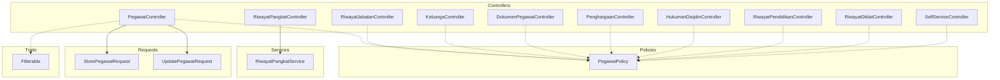
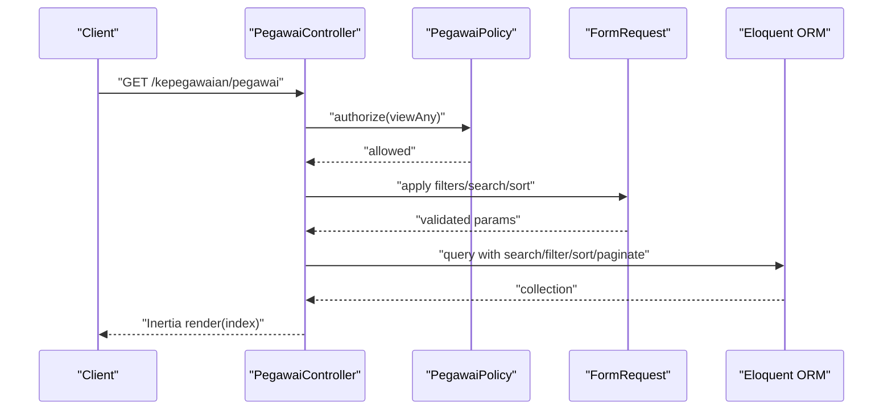
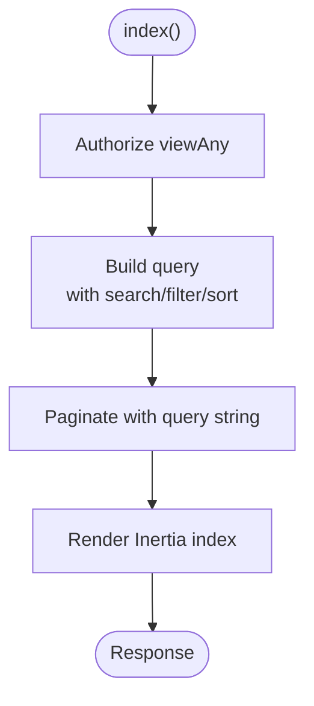
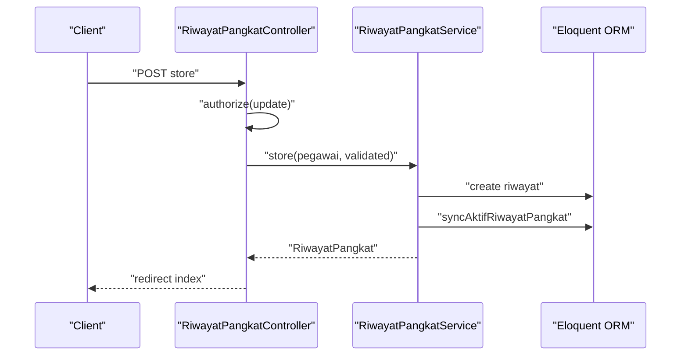
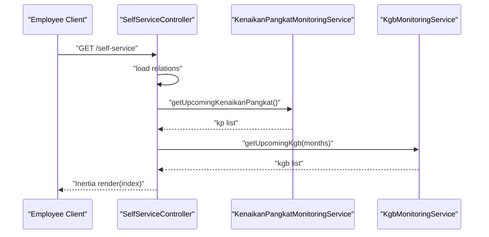

# Kepegawaian Controllers

<cite>
**Referenced Files in This Document**
- [PegawaiController.php](file://app/Http/Controllers/Kepegawaian/PegawaiController.php)
- [RiwayatPangkatController.php](file://app/Http/Controllers/Kepegawaian/RiwayatPangkatController.php)
- [RiwayatJabatanController.php](file://app/Http/Controllers/Kepegawaian/RiwayatJabatanController.php)
- [KeluargaController.php](file://app/Http/Controllers/Kepegawaian/KeluargaController.php)
- [DokumenPegawaiController.php](file://app/Http/Controllers/Kepegawaian/DokumenPegawaiController.php)
- [PenghargaanController.php](file://app/Http/Controllers/Kepegawaian/PenghargaanController.php)
- [HukumanDisiplinController.php](file://app/Http/Controllers/Kepegawaian/HukumanDisiplinController.php)
- [RiwayatPendidikanController.php](file://app/Http/Controllers/Kepegawaian/RiwayatPendidikanController.php)
- [RiwayatDiklatController.php](file://app/Http/Controllers/Kepegawaian/RiwayatDiklatController.php)
- [SelfServiceController.php](file://app/Http/Controllers/Kepegawaian/SelfServiceController.php)
- [StorePegawaiRequest.php](file://app/Http/Requests/Kepegawaian/StorePegawaiRequest.php)
- [UpdatePegawaiRequest.php](file://app/Http/Requests/Kepegawaian/UpdatePegawaiRequest.php)
- [PegawaiPolicy.php](file://app/Policies/PegawaiPolicy.php)
- [Filterable.php](file://app/Traits/Filterable.php)
- [RiwayatPangkatService.php](file://app/Services/RiwayatPangkatService.php)
</cite>

## Table of Contents
1. [Introduction](#introduction)
2. [Project Structure](#project-structure)
3. [Core Components](#core-components)
4. [Architecture Overview](#architecture-overview)
5. [Detailed Component Analysis](#detailed-component-analysis)
6. [Dependency Analysis](#dependency-analysis)
7. [Performance Considerations](#performance-considerations)
8. [Troubleshooting Guide](#troubleshooting-guide)
9. [Conclusion](#conclusion)
10. [Appendices](#appendices)

## Introduction
This document explains the Kepegawaian Controller group responsible for employee data management and related lifecycle records. It covers the controller hierarchy for employee master data, career progression tracking (pangkat and jabatan), family relationships, awards, disciplinary actions, and document management. It documents CRUD operations, search and filtering, form request validation patterns, resource transformation methods, authorization and policy enforcement, service-layer integration, and frontend integration patterns. Concrete examples are drawn from PegawaiController, RiwayatPangkatController, RiwayatJabatanController, and supporting controllers.

## Project Structure
The Kepegawaian domain is organized under app/Http/Controllers/Kepegawaian with dedicated controllers per entity and a SelfServiceController for portal access. Supporting components include Form Requests for validation, Policies for authorization, Traits for reusable query helpers, and Services for complex business logic.

**Diagram sources**
- [PegawaiController.php:25-224](file://app/Http/Controllers/Kepegawaian/PegawaiController.php#L25-L224)
- [RiwayatPangkatController.php:17-118](file://app/Http/Controllers/Kepegawaian/RiwayatPangkatController.php#L17-L118)
- [RiwayatJabatanController.php:18-106](file://app/Http/Controllers/Kepegawaian/RiwayatJabatanController.php#L18-L106)
- [KeluargaController.php:15-91](file://app/Http/Controllers/Kepegawaian/KeluargaController.php#L15-L91)
- [DokumenPegawaiController.php:15-92](file://app/Http/Controllers/Kepegawaian/DokumenPegawaiController.php#L15-L92)
- [PenghargaanController.php:16-90](file://app/Http/Controllers/Kepegawaian/PenghargaanController.php#L16-L90)
- [HukumanDisiplinController.php:16-91](file://app/Http/Controllers/Kepegawaian/HukumanDisiplinController.php#L16-L91)
- [RiwayatPendidikanController.php:16-93](file://app/Http/Controllers/Kepegawaian/RiwayatPendidikanController.php#L16-L93)
- [RiwayatDiklatController.php:16-92](file://app/Http/Controllers/Kepegawaian/RiwayatDiklatController.php#L16-L92)
- [SelfServiceController.php:13-96](file://app/Http/Controllers/Kepegawaian/SelfServiceController.php#L13-L96)
- [StorePegawaiRequest.php:10-51](file://app/Http/Requests/Kepegawaian/StorePegawaiRequest.php#L10-L51)
- [UpdatePegawaiRequest.php:7-32](file://app/Http/Requests/Kepegawaian/UpdatePegawaiRequest.php#L7-L32)
- [PegawaiPolicy.php:7-34](file://app/Policies/PegawaiPolicy.php#L7-L34)
- [Filterable.php:7-48](file://app/Traits/Filterable.php#L7-L48)
- [RiwayatPangkatService.php:9-55](file://app/Services/RiwayatPangkatService.php#L9-L55)

**Section sources**
- [PegawaiController.php:25-224](file://app/Http/Controllers/Kepegawaian/PegawaiController.php#L25-L224)
- [RiwayatPangkatController.php:17-118](file://app/Http/Controllers/Kepegawaian/RiwayatPangkatController.php#L17-L118)
- [RiwayatJabatanController.php:18-106](file://app/Http/Controllers/Kepegawaian/RiwayatJabatanController.php#L18-L106)
- [KeluargaController.php:15-91](file://app/Http/Controllers/Kepegawaian/KeluargaController.php#L15-L91)
- [DokumenPegawaiController.php:15-92](file://app/Http/Controllers/Kepegawaian/DokumenPegawaiController.php#L15-L92)
- [PenghargaanController.php:16-90](file://app/Http/Controllers/Kepegawaian/PenghargaanController.php#L16-L90)
- [HukumanDisiplinController.php:16-91](file://app/Http/Controllers/Kepegawaian/HukumanDisiplinController.php#L16-L91)
- [RiwayatPendidikanController.php:16-93](file://app/Http/Controllers/Kepegawaian/RiwayatPendidikanController.php#L16-L93)
- [RiwayatDiklatController.php:16-92](file://app/Http/Controllers/Kepegawaian/RiwayatDiklatController.php#L16-L92)
- [SelfServiceController.php:13-96](file://app/Http/Controllers/Kepegawaian/SelfServiceController.php#L13-L96)

## Core Components
- Employee Master Data: PegawaiController handles listing, creating, viewing, editing, updating, and deleting employees, with search, filter, and sort capabilities.
- Career Progression Tracking:
  - RiwayatPangkatController manages promotion records with service-layer synchronization of the active record and linked employee’s current pangkat.
  - RiwayatJabatanController manages position history with references to jabatan and unit kerja.
- Family Relationships: KeluargaController manages dependents and family members linked to an employee.
- Awards and Disciplinary Actions: PenghargaanController and HukumanDisiplinController manage recognition and discipline records.
- Documents: DokumenPegawaiController manages uploaded documents associated with an employee.
- Education and Training: RiwayatPendidikanController and RiwayatDiklatController manage academic and training records.
- Self-Service Portal: SelfServiceController exposes a portal for employees to view personal info and related monitoring insights.

**Section sources**
- [PegawaiController.php:25-224](file://app/Http/Controllers/Kepegawaian/PegawaiController.php#L25-L224)
- [RiwayatPangkatController.php:17-118](file://app/Http/Controllers/Kepegawaian/RiwayatPangkatController.php#L17-L118)
- [RiwayatJabatanController.php:18-106](file://app/Http/Controllers/Kepegawaian/RiwayatJabatanController.php#L18-L106)
- [KeluargaController.php:15-91](file://app/Http/Controllers/Kepegawaian/KeluargaController.php#L15-L91)
- [DokumenPegawaiController.php:15-92](file://app/Http/Controllers/Kepegawaian/DokumenPegawaiController.php#L15-L92)
- [PenghargaanController.php:16-90](file://app/Http/Controllers/Kepegawaian/PenghargaanController.php#L16-L90)
- [HukumanDisiplinController.php:16-91](file://app/Http/Controllers/Kepegawaian/HukumanDisiplinController.php#L16-L91)
- [RiwayatPendidikanController.php:16-93](file://app/Http/Controllers/Kepegawaian/RiwayatPendidikanController.php#L16-L93)
- [RiwayatDiklatController.php:16-92](file://app/Http/Controllers/Kepegawaian/RiwayatDiklatController.php#L16-L92)
- [SelfServiceController.php:13-96](file://app/Http/Controllers/Kepegawaian/SelfServiceController.php#L13-L96)

## Architecture Overview
The controllers follow a layered pattern:
- HTTP Layer: Controllers orchestrate requests, enforce authorization, delegate to services where needed, and render Inertia responses.
- Validation Layer: Form Requests encapsulate validation rules and authorization gates.
- Policy Layer: Policies define capability checks for each action.
- Service Layer: Services encapsulate complex business logic (e.g., syncing active pangkat).
- Persistence Layer: Eloquent models and scopes handle queries and relationships.

**Diagram sources**
- [PegawaiController.php:30-113](file://app/Http/Controllers/Kepegawaian/PegawaiController.php#L30-L113)
- [PegawaiPolicy.php:9-12](file://app/Policies/PegawaiPolicy.php#L9-L12)
- [Filterable.php:9-46](file://app/Traits/Filterable.php#L9-L46)

## Detailed Component Analysis

### Employee Master Data: PegawaiController
- Responsibilities:
  - Listing with search, filter, and sort; eager loading of related career and demographic data.
  - Create, view, edit, update, and delete with authorization checks.
  - Enumerations passed to frontend for consistent UI behavior.
- Search and Filtering:
  - Uses a shared Filterable trait for search across NIP and name, and filter by unit, status, and optional joins for jabatan and pangkat.
  - Sort supports multiple fields including derived fields via subqueries.
- Authorization:
  - Gates enforced via authorize() for each action.
- Resource Transformation:
  - Returns paginated collections and filter option sets for UI.

**Diagram sources**
- [PegawaiController.php:30-113](file://app/Http/Controllers/Kepegawaian/PegawaiController.php#L30-L113)
- [Filterable.php:9-46](file://app/Traits/Filterable.php#L9-L46)

**Section sources**
- [PegawaiController.php:25-224](file://app/Http/Controllers/Kepegawaian/PegawaiController.php#L25-L224)
- [Filterable.php:7-48](file://app/Traits/Filterable.php#L7-L48)
- [PegawaiPolicy.php:9-12](file://app/Policies/PegawaiPolicy.php#L9-L12)

### Career Progression: RiwayatPangkatController
- Responsibilities:
  - Manage promotion records (riwayat pangkat) for a specific employee.
  - Enforce ownership checks and update active flag via RiwayatPangkatService.
- Authorization:
  - Requires update permission on the employee context.
- Service Integration:
  - Delegates creation/update to RiwayatPangkatService, which ensures only one active record per employee and updates the linked employee’s current pangkat.

**Diagram sources**
- [RiwayatPangkatController.php:87-94](file://app/Http/Controllers/Kepegawaian/RiwayatPangkatController.php#L87-L94)
- [RiwayatPangkatService.php:11-22](file://app/Services/RiwayatPangkatService.php#L11-L22)

**Section sources**
- [RiwayatPangkatController.php:17-118](file://app/Http/Controllers/Kepegawaian/RiwayatPangkatController.php#L17-L118)
- [RiwayatPangkatService.php:9-55](file://app/Services/RiwayatPangkatService.php#L9-L55)

### Career Progression: RiwayatJabatanController
- Responsibilities:
  - Manage position history for an employee with references to jabatan and unit kerja.
  - Provides reference lists for dropdowns.
- Authorization:
  - Requires update permission on the employee context.

**Section sources**
- [RiwayatJabatanController.php:18-106](file://app/Http/Controllers/Kepegawaian/RiwayatJabatanController.php#L18-L106)

### Family Relationships: KeluargaController
- Responsibilities:
  - Manage dependents and family members for an employee.
  - Ownership checks ensure records belong to the targeted employee.
- Authorization:
  - Requires update permission on the employee context.

**Section sources**
- [KeluargaController.php:15-91](file://app/Http/Controllers/Kepegawaian/KeluargaController.php#L15-L91)

### Documents: DokumenPegawaiController
- Responsibilities:
  - Manage uploaded documents for an employee with ordering and ownership checks.
- Authorization:
  - Requires update permission on the employee context.

**Section sources**
- [DokumenPegawaiController.php:15-92](file://app/Http/Controllers/Kepegawaian/DokumenPegawaiController.php#L15-L92)

### Awards: PenghargaanController
- Responsibilities:
  - Manage award records with reference to jenis penghargaan.
- Authorization:
  - Requires update permission on the employee context.

**Section sources**
- [PenghargaanController.php:16-90](file://app/Http/Controllers/Kepegawaian/PenghargaanController.php#L16-L90)

### Disciplinary Actions: HukumanDisiplinController
- Responsibilities:
  - Manage discipline records with reference to jenis hukuman disiplin.
- Authorization:
  - Requires update permission on the employee context.

**Section sources**
- [HukumanDisiplinController.php:16-91](file://app/Http/Controllers/Kepegawaian/HukumanDisiplinController.php#L16-L91)

### Education: RiwayatPendidikanController
- Responsibilities:
  - Manage educational history with jenjang options mapped to frontend labels.
- Authorization:
  - Requires update permission on the employee context.

**Section sources**
- [RiwayatPendidikanController.php:16-93](file://app/Http/Controllers/Kepegawaian/RiwayatPendidikanController.php#L16-L93)

### Training: RiwayatDiklatController
- Responsibilities:
  - Manage training records with jenis diklat references.
- Authorization:
  - Requires update permission on the employee context.

**Section sources**
- [RiwayatDiklatController.php:16-92](file://app/Http/Controllers/Kepegawaian/RiwayatDiklatController.php#L16-L92)

### Self-Service Portal: SelfServiceController
- Responsibilities:
  - Serve a self-service experience for employees to view personal info and related monitoring insights (e.g., upcoming KGB and Kenaikan Pangkat).
- Data Loading:
  - Uses relation loading tailored for index and detail views.
- Monitoring Services:
  - Integrates with KgbMonitoringService and KenaikanPangkatMonitoringService to surface relevant info.

**Diagram sources**
- [SelfServiceController.php:20-96](file://app/Http/Controllers/Kepegawaian/SelfServiceController.php#L20-L96)

**Section sources**
- [SelfServiceController.php:13-96](file://app/Http/Controllers/Kepegawaian/SelfServiceController.php#L13-L96)

## Dependency Analysis
- Controllers depend on:
  - Policies for authorization checks.
  - Form Requests for validation and authorization gating.
  - Services for complex operations (e.g., RiwayatPangkatService).
  - Eloquent models and relationships for persistence.
- Shared traits (Filterable) enable consistent search/filter/sort across controllers.
- Frontend integration leverages Inertia rendering with structured props for each view.

```mermaid
classDiagram
class PegawaiController
class RiwayatPangkatController
class RiwayatJabatanController
class KeluargaController
class DokumenPegawaiController
class PenghargaanController
class HukumanDisiplinController
class RiwayatPendidikanController
class RiwayatDiklatController
class SelfServiceController
class StorePegawaiRequest
class UpdatePegawaiRequest
class PegawaiPolicy
class Filterable
class RiwayatPangkatService
PegawaiController --> StorePegawaiRequest : "uses"
PegawaiController --> UpdatePegawaiRequest : "uses"
PegawaiController ..> PegawaiPolicy : "authorizes"
PegawaiController ..> Filterable : "scopes"
RiwayatPangkatController --> RiwayatPangkatService : "delegates"
RiwayatPangkatController ..> PegawaiPolicy : "authorizes"
RiwayatJabatanController ..> PegawaiPolicy : "authorizes"
KeluargaController ..> PegawaiPolicy : "authorizes"
DokumenPegawaiController ..> PegawaiPolicy : "authorizes"
PenghargaanController ..> PegawaiPolicy : "authorizes"
HukumanDisiplinController ..> PegawaiPolicy : "authorizes"
RiwayatPendidikanController ..> PegawaiPolicy : "authorizes"
RiwayatDiklatController ..> PegawaiPolicy : "authorizes"
SelfServiceController ..> PegawaiPolicy : "authorizes"
```

**Diagram sources**
- [PegawaiController.php:13-23](file://app/Http/Controllers/Kepegawaian/PegawaiController.php#L13-L23)
- [RiwayatPangkatController.php:11-19](file://app/Http/Controllers/Kepegawaian/RiwayatPangkatController.php#L11-L19)
- [RiwayatJabatanController.php:12-18](file://app/Http/Controllers/Kepegawaian/RiwayatJabatanController.php#L12-L18)
- [KeluargaController.php:11-15](file://app/Http/Controllers/Kepegawaian/KeluargaController.php#L11-L15)
- [DokumenPegawaiController.php:11-15](file://app/Http/Controllers/Kepegawaian/DokumenPegawaiController.php#L11-L15)
- [PenghargaanController.php:12-16](file://app/Http/Controllers/Kepegawaian/PenghargaanController.php#L12-L16)
- [HukumanDisiplinController.php:12-16](file://app/Http/Controllers/Kepegawaian/HukumanDisiplinController.php#L12-L16)
- [RiwayatPendidikanController.php:12-14](file://app/Http/Controllers/Kepegawaian/RiwayatPendidikanController.php#L12-L14)
- [RiwayatDiklatController.php:12-14](file://app/Http/Controllers/Kepegawaian/RiwayatDiklatController.php#L12-L14)
- [SelfServiceController.php:15-18](file://app/Http/Controllers/Kepegawaian/SelfServiceController.php#L15-L18)
- [StorePegawaiRequest.php:10-51](file://app/Http/Requests/Kepegawaian/StorePegawaiRequest.php#L10-L51)
- [UpdatePegawaiRequest.php:7-32](file://app/Http/Requests/Kepegawaian/UpdatePegawaiRequest.php#L7-L32)
- [PegawaiPolicy.php:7-34](file://app/Policies/PegawaiPolicy.php#L7-L34)
- [Filterable.php:7-48](file://app/Traits/Filterable.php#L7-L48)
- [RiwayatPangkatService.php:9-55](file://app/Services/RiwayatPangkatService.php#L9-L55)

**Section sources**
- [PegawaiController.php:25-224](file://app/Http/Controllers/Kepegawaian/PegawaiController.php#L25-L224)
- [RiwayatPangkatController.php:17-118](file://app/Http/Controllers/Kepegawaian/RiwayatPangkatController.php#L17-L118)
- [RiwayatJabatanController.php:18-106](file://app/Http/Controllers/Kepegawaian/RiwayatJabatanController.php#L18-L106)
- [KeluargaController.php:15-91](file://app/Http/Controllers/Kepegawaian/KeluargaController.php#L15-L91)
- [DokumenPegawaiController.php:15-92](file://app/Http/Controllers/Kepegawaian/DokumenPegawaiController.php#L15-L92)
- [PenghargaanController.php:16-90](file://app/Http/Controllers/Kepegawaian/PenghargaanController.php#L16-L90)
- [HukumanDisiplinController.php:16-91](file://app/Http/Controllers/Kepegawaian/HukumanDisiplinController.php#L16-L91)
- [RiwayatPendidikanController.php:16-93](file://app/Http/Controllers/Kepegawaian/RiwayatPendidikanController.php#L16-L93)
- [RiwayatDiklatController.php:16-92](file://app/Http/Controllers/Kepegawaian/RiwayatDiklatController.php#L16-L92)
- [SelfServiceController.php:13-96](file://app/Http/Controllers/Kepegawaian/SelfServiceController.php#L13-L96)
- [StorePegawaiRequest.php:10-51](file://app/Http/Requests/Kepegawaian/StorePegawaiRequest.php#L10-L51)
- [UpdatePegawaiRequest.php:7-32](file://app/Http/Requests/Kepegawaian/UpdatePegawaiRequest.php#L7-L32)
- [PegawaiPolicy.php:7-34](file://app/Policies/PegawaiPolicy.php#L7-L34)
- [Filterable.php:7-48](file://app/Traits/Filterable.php#L7-L48)
- [RiwayatPangkatService.php:9-55](file://app/Services/RiwayatPangkatService.php#L9-L55)

## Performance Considerations
- Use eager loading to avoid N+1 queries (already applied in controllers for related data).
- Prefer filtered and sorted queries with appropriate indexes on searchable/filterable columns.
- Pagination reduces payload sizes for listing screens.
- Transactional updates in services (e.g., syncing active pangkat) ensure data consistency with minimal overhead.

[No sources needed since this section provides general guidance]

## Troubleshooting Guide
- Authorization Failures:
  - Ensure the user has the required permission for the action (e.g., pegawai.view, pegawai.create). Policies gate all actions.
- Ownership Validation:
  - Controllers include explicit checks to ensure records belong to the targeted employee (e.g., KeluargaController, RiwayatPangkatController).
- Validation Errors:
  - Form Requests provide localized messages for common validation failures (e.g., NIP length/format, unique constraints, enum validity).
- Sorting and Filtering:
  - Confirm that sort_by and filter keys match model columns and relationships; use the Filterable trait for consistent behavior.

**Section sources**
- [PegawaiPolicy.php:9-32](file://app/Policies/PegawaiPolicy.php#L9-L32)
- [KeluargaController.php:86-90](file://app/Http/Controllers/Kepegawaian/KeluargaController.php#L86-L90)
- [RiwayatPangkatController.php:100-112](file://app/Http/Controllers/Kepegawaian/RiwayatPangkatController.php#L100-L112)
- [StorePegawaiRequest.php:32-49](file://app/Http/Requests/Kepegawaian/StorePegawaiRequest.php#L32-L49)

## Conclusion
The Kepegawaian Controllers implement a cohesive, authorization-enforced, and service-integrated architecture for managing employee data and related records. They leverage shared traits for search/filter/sort, robust Form Request validation, and clear separation of concerns between controllers, services, and policies. The self-service portal further demonstrates frontend integration via Inertia while exposing curated monitoring insights.

[No sources needed since this section summarizes without analyzing specific files]

## Appendices

### CRUD Operations Summary
- Employee Master Data (PegawaiController):
  - Index: search, filter, sort, paginate.
  - Create: validated store request, authorization.
  - View/Edit: load related data, enums for UI.
  - Update: safe attribute updates, optional password hashing.
  - Delete: authorization and removal.
- Career Records:
  - RiwayatPangkatController: store/update/delete with active sync.
  - RiwayatJabatanController: store/update/delete with references.
- Family, Documents, Awards, Disciplinary Actions, Education, Training:
  - Consistent store/update/delete with authorization and ownership checks.

**Section sources**
- [PegawaiController.php:141-222](file://app/Http/Controllers/Kepegawaian/PegawaiController.php#L141-L222)
- [RiwayatPangkatController.php:87-116](file://app/Http/Controllers/Kepegawaian/RiwayatPangkatController.php#L87-L116)
- [RiwayatJabatanController.php:76-104](file://app/Http/Controllers/Kepegawaian/RiwayatJabatanController.php#L76-L104)
- [KeluargaController.php:55-84](file://app/Http/Controllers/Kepegawaian/KeluargaController.php#L55-L84)
- [DokumenPegawaiController.php:53-90](file://app/Http/Controllers/Kepegawaian/DokumenPegawaiController.php#L53-L90)
- [PenghargaanController.php:54-83](file://app/Http/Controllers/Kepegawaian/PenghargaanController.php#L54-L83)
- [HukumanDisiplinController.php:55-84](file://app/Http/Controllers/Kepegawaian/HukumanDisiplinController.php#L55-L84)
- [RiwayatPendidikanController.php:62-91](file://app/Http/Controllers/Kepegawaian/RiwayatPendidikanController.php#L62-L91)
- [RiwayatDiklatController.php:61-90](file://app/Http/Controllers/Kepegawaian/RiwayatDiklatController.php#L61-L90)

### Search and Filtering Implementation
- Search: uses Filterable::search on NIP and name.
- Filter: uses Filterable::filter on multiple attributes.
- Sort: supports direct column sorts and derived sorts via subqueries.

**Section sources**
- [PegawaiController.php:44-78](file://app/Http/Controllers/Kepegawaian/PegawaiController.php#L44-L78)
- [Filterable.php:9-46](file://app/Traits/Filterable.php#L9-L46)

### Form Request Validation Patterns
- StorePegawaiRequest: centralized validation rules via a shared trait, with localized messages.
- UpdatePegawaiRequest: extends store with additional password rules and dynamic rule composition.

**Section sources**
- [StorePegawaiRequest.php:10-51](file://app/Http/Requests/Kepegawaian/StorePegawaiRequest.php#L10-L51)
- [UpdatePegawaiRequest.php:7-32](file://app/Http/Requests/Kepegawaian/UpdatePegawaiRequest.php#L7-L32)

### Resource Transformation Methods
- Controllers transform Eloquent collections into arrays suitable for Inertia props, including labels, formatted dates, and nested references.

**Section sources**
- [RiwayatPangkatController.php:46-84](file://app/Http/Controllers/Kepegawaian/RiwayatPangkatController.php#L46-L84)
- [RiwayatJabatanController.php:41-73](file://app/Http/Controllers/Kepegawaian/RiwayatJabatanController.php#L41-L73)
- [KeluargaController.php:31-52](file://app/Http/Controllers/Kepegawaian/KeluargaController.php#L31-L52)
- [DokumenPegawaiController.php:32-50](file://app/Http/Controllers/Kepegawaian/DokumenPegawaiController.php#L32-L50)
- [PenghargaanController.php:32-51](file://app/Http/Controllers/Kepegawaian/PenghargaanController.php#L32-L51)
- [HukumanDisiplinController.php:31-52](file://app/Http/Controllers/Kepegawaian/HukumanDisiplinController.php#L31-L52)
- [RiwayatPendidikanController.php:33-59](file://app/Http/Controllers/Kepegawaian/RiwayatPendidikanController.php#L33-L59)
- [RiwayatDiklatController.php:33-58](file://app/Http/Controllers/Kepegawaian/RiwayatDiklatController.php#L33-L58)

### Authorization and Policy Enforcement
- Policies define granular permissions per action and entity.
- Controllers call authorize() for each operation.

**Section sources**
- [PegawaiPolicy.php:7-34](file://app/Policies/PegawaiPolicy.php#L7-L34)
- [PegawaiController.php:32-221](file://app/Http/Controllers/Kepegawaian/PegawaiController.php#L32-L221)

### Service Layer Integration
- RiwayatPangkatService encapsulates transactional creation/update and active record synchronization.

**Section sources**
- [RiwayatPangkatService.php:9-55](file://app/Services/RiwayatPangkatService.php#L9-L55)

### Frontend Integration Patterns
- Controllers render views via Inertia with structured props for forms, tables, and tabs.
- SelfServiceController loads relations and passes monitoring data to the self-service pages.

**Section sources**
- [PegawaiController.php:81-112](file://app/Http/Controllers/Kepegawaian/PegawaiController.php#L81-L112)
- [SelfServiceController.php:20-38](file://app/Http/Controllers/Kepegawaian/SelfServiceController.php#L20-L38)