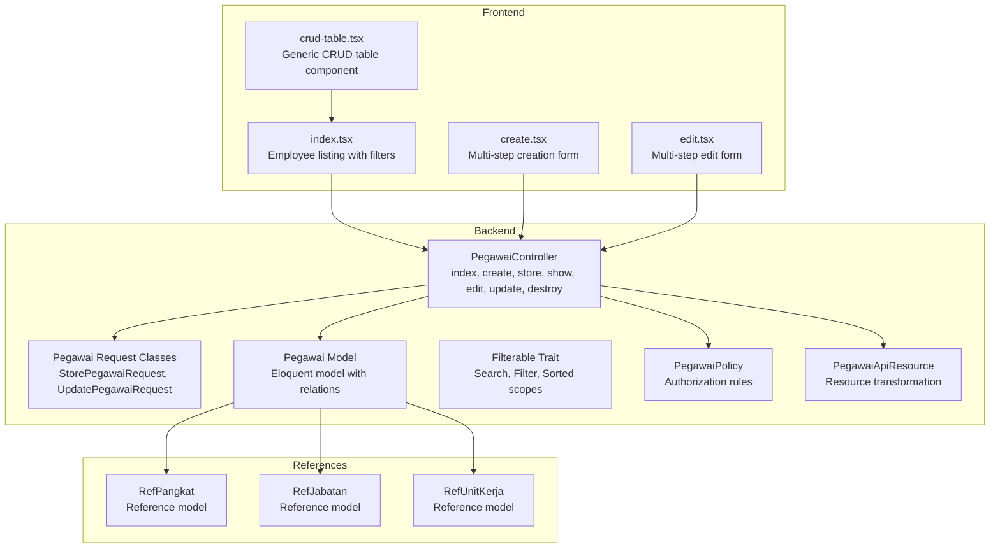
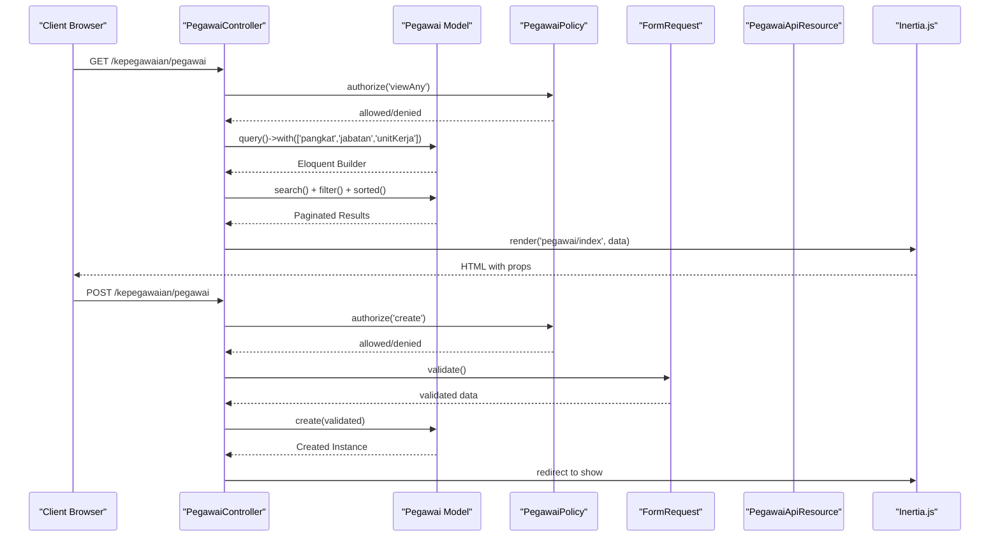
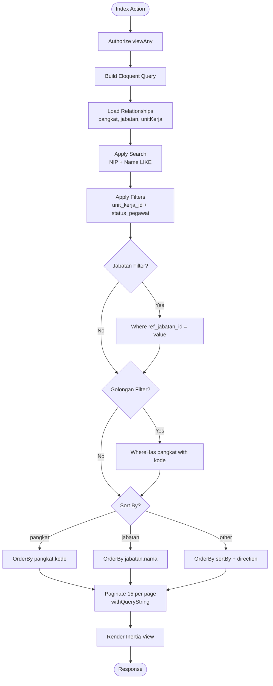
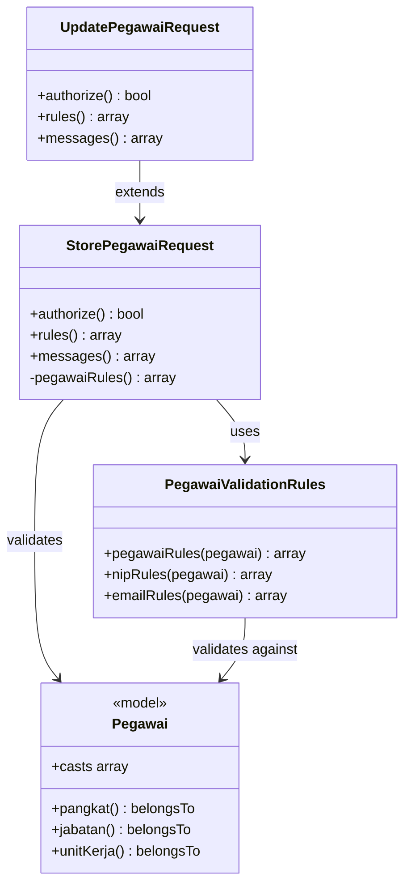
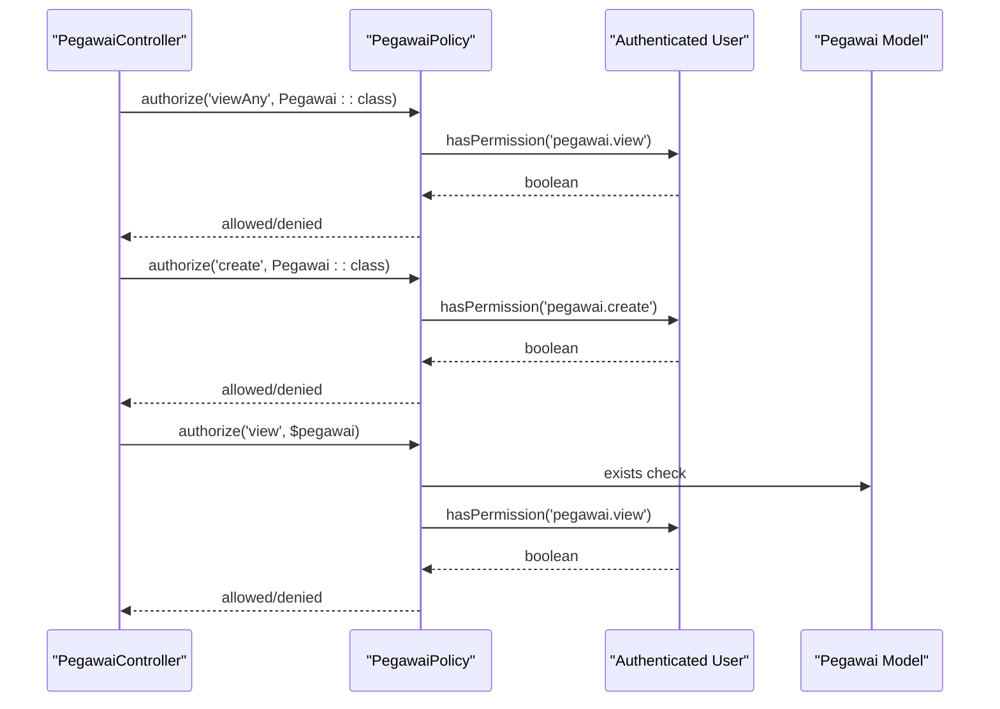
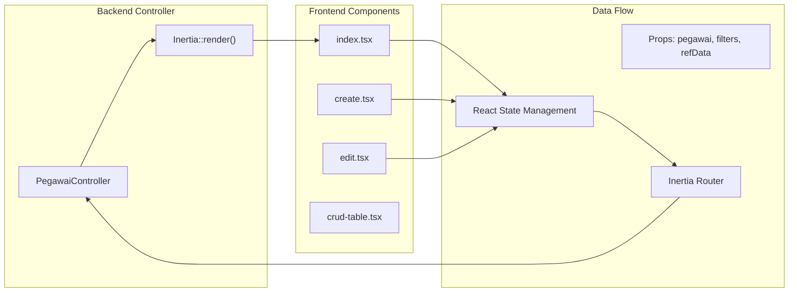
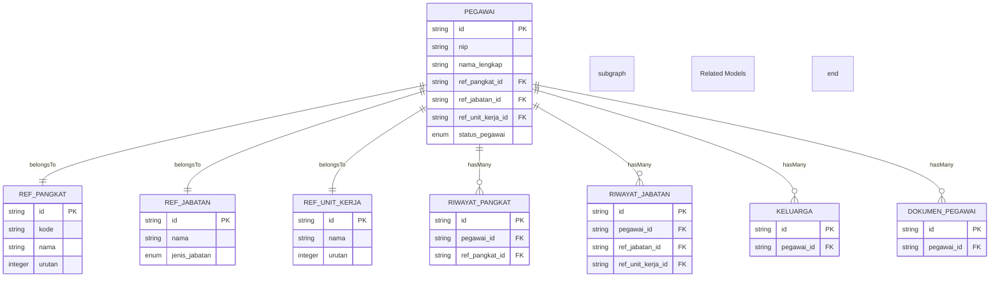
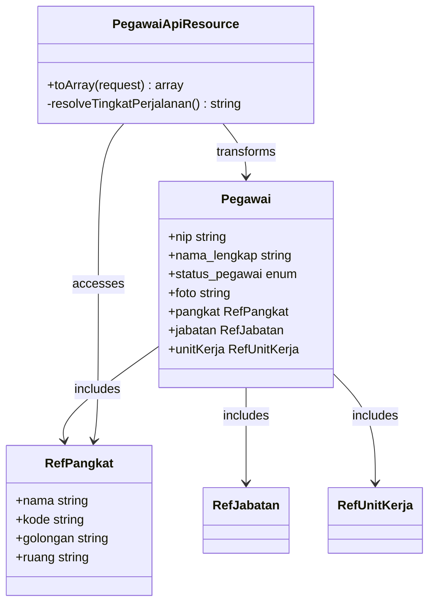
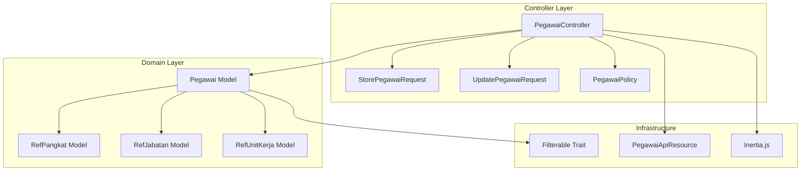

# Pegawai Controller

<cite>
**Referenced Files in This Document**
- [PegawaiController.php](file://app/Http/Controllers/Kepegawaian/PegawaiController.php)
- [StorePegawaiRequest.php](file://app/Http/Requests/Kepegawaian/StorePegawaiRequest.php)
- [UpdatePegawaiRequest.php](file://app/Http/Requests/Kepegawaian/UpdatePegawaiRequest.php)
- [Pegawai.php](file://app/Models/Pegawai.php)
- [PegawaiPolicy.php](file://app/Policies/PegawaiPolicy.php)
- [Filterable.php](file://app/Traits/Filterable.php)
- [RefPangkat.php](file://app/Models/RefPangkat.php)
- [RefJabatan.php](file://app/Models/RefJabatan.php)
- [PegawaiApiResource.php](file://app/Http/Resources/PegawaiApiResource.php)
- [index.tsx](file://resources/js/pages/kepegawaian/pegawai/index.tsx)
- [create.tsx](file://resources/js/pages/kepegawaian/pegawai/create.tsx)
- [edit.tsx](file://resources/js/pages/kepegawaian/pegawai/edit.tsx)
- [crud-table.tsx](file://resources/js/components/kepegawaian/crud-table.tsx)
- [PegawaiValidationRules.php](file://app/Concerns/PegawaiValidationRules.php)
- [StatusPegawai.php](file://app/Enums/StatusPegawai.php)
</cite>

## Table of Contents
1. [Introduction](#introduction)
2. [Project Structure](#project-structure)
3. [Core Components](#core-components)
4. [Architecture Overview](#architecture-overview)
5. [Detailed Component Analysis](#detailed-component-analysis)
6. [Dependency Analysis](#dependency-analysis)
7. [Performance Considerations](#performance-considerations)
8. [Troubleshooting Guide](#troubleshooting-guide)
9. [Conclusion](#conclusion)

## Introduction
This document provides comprehensive documentation for the PegawaiController, which manages employee records in the kepegawaian (civil service) module. It covers the complete CRUD implementation, advanced search and filtering, sophisticated sorting mechanisms, form validation with enum integration, authorization via Laravel policies, Inertia.js integration for frontend rendering, and pagination. The controller interacts with reference models (RefPangkat, RefJabatan, RefUnitKerja) and demonstrates practical examples of search queries, filter combinations, and data presentation patterns.

## Project Structure
The PegawaiController resides in the Kepegawaian namespace alongside related controllers, requests, models, policies, traits, and resources. Frontend components are implemented using Inertia.js with React, providing a seamless SPA experience for employee management operations.

**Diagram sources**
- [PegawaiController.php:25-224](file://app/Http/Controllers/Kepegawaian/PegawaiController.php#L25-L224)
- [StorePegawaiRequest.php:10-51](file://app/Http/Requests/Kepegawaian/StorePegawaiRequest.php#L10-L51)
- [UpdatePegawaiRequest.php:7-32](file://app/Http/Requests/Kepegawaian/UpdatePegawaiRequest.php#L7-L32)
- [Pegawai.php:24-209](file://app/Models/Pegawai.php#L24-L209)
- [Filterable.php:7-48](file://app/Traits/Filterable.php#L7-L48)
- [PegawaiPolicy.php:7-34](file://app/Policies/PegawaiPolicy.php#L7-L34)
- [PegawaiApiResource.php:19-61](file://app/Http/Resources/PegawaiApiResource.php#L19-L61)
- [index.tsx:91-487](file://resources/js/pages/kepegawaian/pegawai/index.tsx#L91-L487)
- [create.tsx:44-603](file://resources/js/pages/kepegawaian/pegawai/create.tsx#L44-L603)
- [edit.tsx:63-646](file://resources/js/pages/kepegawaian/pegawai/edit.tsx#L63-L646)
- [crud-table.tsx:28-96](file://resources/js/components/kepegawaian/crud-table.tsx#L28-L96)

**Section sources**
- [PegawaiController.php:25-224](file://app/Http/Controllers/Kepegawaian/PegawaiController.php#L25-L224)
- [index.tsx:91-487](file://resources/js/pages/kepegawaian/pegawai/index.tsx#L91-L487)

## Core Components
The PegawaiController implements a full CRUD interface with advanced search and filtering capabilities. Key components include:

- **Index Method**: Advanced search with NIP and name matching, multi-column filtering, and sophisticated sorting
- **Create/Edit Forms**: Multi-step forms with enum validation and reference model selection
- **Show Method**: Comprehensive data loading with eager relationships for detailed view
- **Authorization**: Policy-based access control for all operations
- **Validation**: Form request classes with enum integration and custom rules
- **Frontend Integration**: Inertia.js rendering with TypeScript components

**Section sources**
- [PegawaiController.php:30-113](file://app/Http/Controllers/Kepegawaian/PegawaiController.php#L30-L113)
- [PegawaiController.php:118-194](file://app/Http/Controllers/Kepegawaian/PegawaiController.php#L118-L194)
- [PegawaiController.php:153-170](file://app/Http/Controllers/Kepegawaian/PegawaiController.php#L153-L170)

## Architecture Overview
The controller follows Laravel's MVC pattern with clear separation of concerns:

**Diagram sources**
- [PegawaiController.php:30-113](file://app/Http/Controllers/Kepegawaian/PegawaiController.php#L30-L113)
- [PegawaiController.php:141-148](file://app/Http/Controllers/Kepegawaian/PegawaiController.php#L141-L148)
- [PegawaiPolicy.php:9-22](file://app/Policies/PegawaiPolicy.php#L9-L22)
- [StorePegawaiRequest.php:17-30](file://app/Http/Requests/Kepegawaian/StorePegawaiRequest.php#L17-L30)

## Detailed Component Analysis

### Index Method - Advanced Search and Filtering
The index method implements sophisticated search and filtering capabilities:

**Diagram sources**
- [PegawaiController.php:44-79](file://app/Http/Controllers/Kepegawaian/PegawaiController.php#L44-L79)

Key filtering features:
- **Advanced Search**: Searches across NIP and nama_lengkap columns using LIKE operator
- **Multi-column Filter**: Supports unit_kerja_id and status_pegawai filters
- **Relationship Filters**: Jabatan filter on ref_jabatan_id, Golongan filter via whereHas on pangkat.kode
- **Sophisticated Sorting**: Supports nama, nip, pangkat, and jabatan sorting with proper joins

**Section sources**
- [PegawaiController.php:30-113](file://app/Http/Controllers/Kepegawaian/PegawaiController.php#L30-L113)
- [Filterable.php:9-46](file://app/Traits/Filterable.php#L9-L46)

### Form Validation and Enum Integration
The controller leverages comprehensive form validation with enum integration:

**Diagram sources**
- [StorePegawaiRequest.php:10-51](file://app/Http/Requests/Kepegawaian/StorePegawaiRequest.php#L10-L51)
- [UpdatePegawaiRequest.php:7-32](file://app/Http/Requests/Kepegawaian/UpdatePegawaiRequest.php#L7-L32)
- [PegawaiValidationRules.php:14-78](file://app/Concerns/PegawaiValidationRules.php#L14-L78)
- [Pegawai.php:24-65](file://app/Models/Pegawai.php#L24-L65)

Validation patterns include:
- **Enum Validation**: Uses Rule::enum() for all enum fields (JenisKelamin, Agama, StatusPerkawinan, etc.)
- **Unique Constraints**: Validates NIP and email uniqueness with proper ignore logic
- **Format Validation**: NIP validation enforces 18-digit numeric format
- **Custom Messages**: Comprehensive error messages for each validation rule

**Section sources**
- [StorePegawaiRequest.php:27-49](file://app/Http/Requests/Kepegawaian/StorePegawaiRequest.php#L27-L49)
- [PegawaiValidationRules.php:16-77](file://app/Concerns/PegawaiValidationRules.php#L16-L77)

### Authorization and Policies
The controller implements comprehensive authorization using Laravel policies:

**Diagram sources**
- [PegawaiPolicy.php:9-32](file://app/Policies/PegawaiPolicy.php#L9-L32)
- [PegawaiController.php:32-221](file://app/Http/Controllers/Kepegawaian/PegawaiController.php#L32-L221)

Authorization rules:
- **View Any**: Requires 'pegawai.view' permission
- **Create**: Requires 'pegawai.create' permission  
- **View Individual**: Requires 'pegawai.view' permission and existing record
- **Update/Delete**: Requires appropriate permissions and existing record

**Section sources**
- [PegawaiPolicy.php:9-32](file://app/Policies/PegawaiPolicy.php#L9-L32)
- [PegawaiController.php:32-221](file://app/Http/Controllers/Kepegawaian/PegawaiController.php#L32-L221)

### Frontend Integration with Inertia.js
The controller integrates seamlessly with Inertia.js for modern frontend rendering:

**Diagram sources**
- [PegawaiController.php:81-112](file://app/Http/Controllers/Kepegawaian/PegawaiController.php#L81-L112)
- [index.tsx:91-487](file://resources/js/pages/kepegawaian/pegawai/index.tsx#L91-L487)
- [create.tsx:44-603](file://resources/js/pages/kepegawaian/pegawai/create.tsx#L44-L603)
- [edit.tsx:63-646](file://resources/js/pages/kepegawaian/pegawai/edit.tsx#L63-L646)

Frontend features:
- **Dynamic Filtering**: Real-time search with debounced input, filter dropdowns for golongan, jabatan, unit_kerja, and status_pegawai
- **Sorting Controls**: Clickable column headers with visual sort indicators
- **Multi-step Forms**: Structured forms with validation feedback
- **Responsive Design**: Mobile-friendly table with horizontal scrolling

**Section sources**
- [index.tsx:101-249](file://resources/js/pages/kepegawaian/pegawai/index.tsx#L101-L249)
- [create.tsx:53-93](file://resources/js/pages/kepegawaian/pegawai/create.tsx#L53-L93)
- [edit.tsx:88-128](file://resources/js/pages/kepegawaian/pegawai/edit.tsx#L88-L128)

### Relationship Management and Data Loading
The controller demonstrates sophisticated relationship management:

**Diagram sources**
- [Pegawai.php:69-137](file://app/Models/Pegawai.php#L69-L137)
- [RefPangkat.php:10-34](file://app/Models/RefPangkat.php#L10-L34)
- [RefJabatan.php:11-35](file://app/Models/RefJabatan.php#L11-L35)

**Section sources**
- [Pegawai.php:69-137](file://app/Models/Pegawai.php#L69-L137)
- [PegawaiController.php:157-169](file://app/Http/Controllers/Kepegawaian/PegawaiController.php#L157-L169)

### Resource Transformation
The controller supports both Inertia rendering and API resource transformation:

**Diagram sources**
- [PegawaiApiResource.php:19-61](file://app/Http/Resources/PegawaiApiResource.php#L19-L61)
- [Pegawai.php:24-209](file://app/Models/Pegawai.php#L24-L209)

Resource transformation features:
- **Field Mapping**: Renames fields for API consumers (nama_lengkap → nama, etc.)
- **Relationship Access**: Extracts related model data (jabatan.nama, unit_kerja.nama)
- **Computed Fields**: Generates tingkat_perjalanan based on pangkat golongan/ruang
- **Asset URLs**: Converts relative image paths to full URLs

**Section sources**
- [PegawaiApiResource.php:26-59](file://app/Http/Resources/PegawaiApiResource.php#L26-L59)

## Dependency Analysis
The controller exhibits strong cohesion with clear dependency relationships:

**Diagram sources**
- [PegawaiController.php:25-224](file://app/Http/Controllers/Kepegawaian/PegawaiController.php#L25-L224)
- [Pegawai.php:26-27](file://app/Models/Pegawai.php#L26-L27)

Key dependencies:
- **Model Relationships**: Strong typing with proper foreign key constraints
- **Trait Integration**: Filterable trait provides reusable query building capabilities
- **Policy Integration**: Centralized authorization logic
- **Resource Transformation**: Consistent data shaping for different consumption contexts

**Section sources**
- [PegawaiController.php:25-224](file://app/Http/Controllers/Kepegawaian/PegawaiController.php#L25-L224)
- [Pegawai.php:26-27](file://app/Models/Pegawai.php#L26-L27)

## Performance Considerations
The implementation includes several performance optimizations:

- **Eager Loading**: Strategic use of with() to prevent N+1 query problems
- **Database Joins**: Proper join usage for sorting on related fields
- **Pagination**: Efficient 15-record pagination with query string preservation
- **Index Usage**: Appropriate indexing on frequently filtered columns (nip, nama_lengkap, ref_*_id)
- **Query Optimization**: Conditional query building prevents unnecessary operations

Recommendations:
- Add database indexes on ref_pangkat.kode, ref_jabatan.nama, and ref_unit_kerja.nama for better sorting performance
- Consider implementing database-level search indexes for full-text search capability
- Cache reference data that rarely changes (RefPangkat, RefJabatan, RefUnitKerja)

## Troubleshooting Guide
Common issues and solutions:

**Authorization Failures**:
- Verify user has appropriate permissions (pegawai.view, pegawai.create, etc.)
- Check policy method signatures and permission slugs
- Ensure user roles are properly assigned in the IAM system

**Validation Errors**:
- NIP uniqueness conflicts: Check for existing records with same NIP
- Email uniqueness conflicts: Validate against existing user accounts
- Enum validation failures: Ensure enum values match exactly (case-sensitive)

**Search and Filter Issues**:
- Empty search terms: Controller handles empty strings gracefully
- Filter combinations: Multiple filters are applied with AND logic
- Sorting performance: Consider adding database indexes for sorted columns

**Frontend Integration Problems**:
- Inertia route mismatches: Verify route names match controller actions
- Form state synchronization: Check that form data matches backend field names
- Pagination state: Ensure query string parameters are preserved correctly

**Section sources**
- [PegawaiPolicy.php:9-32](file://app/Policies/PegawaiPolicy.php#L9-L32)
- [StorePegawaiRequest.php:32-49](file://app/Http/Requests/Kepegawaian/StorePegawaiRequest.php#L32-L49)
- [index.tsx:101-149](file://resources/js/pages/kepegawaian/pegawai/index.tsx#L101-L149)

## Conclusion
The PegawaiController demonstrates a comprehensive implementation of employee management operations with modern Laravel practices. It successfully combines advanced search and filtering, sophisticated sorting mechanisms, robust validation with enum integration, comprehensive authorization, and seamless Inertia.js integration. The controller's architecture supports scalability through proper separation of concerns, reusable traits, and clear dependency management. The implementation serves as a solid foundation for enterprise-level employee management systems while maintaining excellent user experience through thoughtful frontend integration.