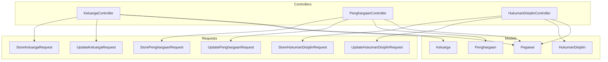
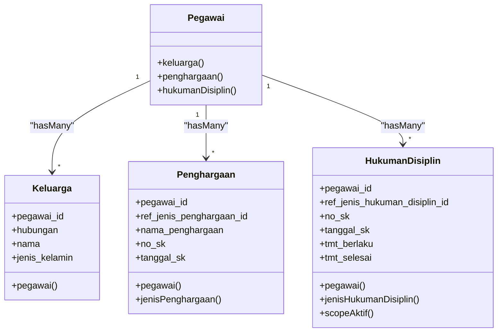
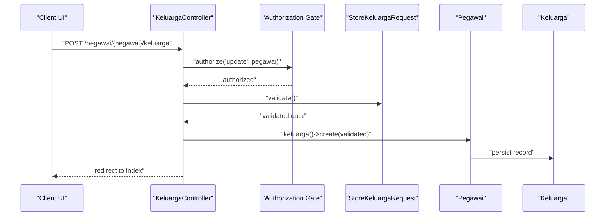
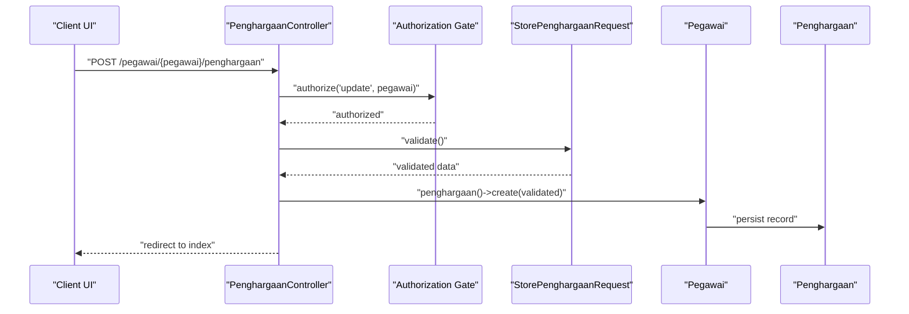
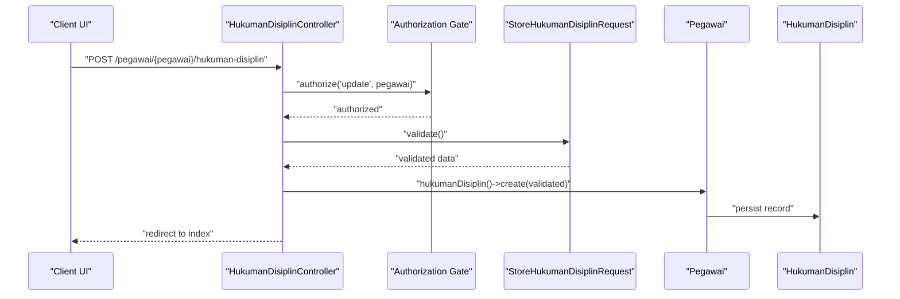
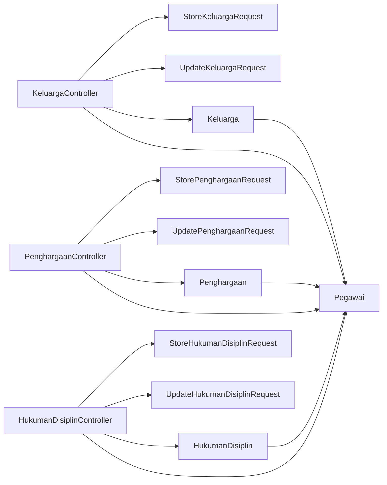

# Personal and Family Controllers

<cite>
**Referenced Files in This Document**
- [KeluargaController.php](file://app/Http/Controllers/Kepegawaian/KeluargaController.php)
- [PenghargaanController.php](file://app/Http/Controllers/Kepegawaian/PenghargaanController.php)
- [HukumanDisiplinController.php](file://app/Http/Controllers/Kepegawaian/HukumanDisiplinController.php)
- [StoreKeluargaRequest.php](file://app/Http/Requests/Kepegawaian/StoreKeluargaRequest.php)
- [UpdateKeluargaRequest.php](file://app/Http/Requests/Kepegawaian/UpdateKeluargaRequest.php)
- [StorePenghargaanRequest.php](file://app/Http/Requests/Kepegawaian/StorePenghargaanRequest.php)
- [UpdatePenghargaanRequest.php](file://app/Http/Requests/Kepegawaian/UpdatePenghargaanRequest.php)
- [StoreHukumanDisiplinRequest.php](file://app/Http/Requests/Kepegawaian/StoreHukumanDisiplinRequest.php)
- [UpdateHukumanDisiplinRequest.php](file://app/Http/Requests/Kepegawaian/UpdateHukumanDisiplinRequest.php)
- [Keluarga.php](file://app/Models/Keluarga.php)
- [Penghargaan.php](file://app/Models/Penghargaan.php)
- [HukumanDisiplin.php](file://app/Models/HukumanDisiplin.php)
- [Pegawai.php](file://app/Models/Pegawai.php)
- [HubunganKeluarga.php](file://app/Enums/HubunganKeluarga.php)
- [JenisKelamin.php](file://app/Enums/JenisKelamin.php)
</cite>

## Table of Contents
1. [Introduction](#introduction)
2. [Project Structure](#project-structure)
3. [Core Components](#core-components)
4. [Architecture Overview](#architecture-overview)
5. [Detailed Component Analysis](#detailed-component-analysis)
6. [Dependency Analysis](#dependency-analysis)
7. [Performance Considerations](#performance-considerations)
8. [Troubleshooting Guide](#troubleshooting-guide)
9. [Conclusion](#conclusion)
10. [Appendices](#appendices)

## Introduction
This document explains the personal and family data controllers that manage family relationships, awards, and disciplinary actions for pegawai (civil servants). It covers:
- Family relationship management: spouse and child records, emergency contact handling, and kinship validation
- Recognition and disciplinary record management: award tracking, disciplinary action documentation, and performance evaluation handling
- Form validation patterns for sensitive personal data, relationship type classifications, and administrative approval workflows
- Integration with the Pegawai model for family member associations, award and discipline record linking
- Authorization patterns, data privacy considerations, data retention policies, and audit trail requirements
- Practical examples for creating family relationships, award nomination processes, and disciplinary procedure documentation

## Project Structure
The relevant implementation is organized under the Kepegawaian namespace with dedicated controllers, form requests, and models:
- Controllers: KeluargaController, PenghargaanController, HukumanDisiplinController
- Form Requests: StoreKeluargaRequest, UpdateKeluargaRequest, StorePenghargaanRequest, UpdatePenghargaanRequest, StoreHukumanDisiplinRequest, UpdateHukumanDisiplinRequest
- Models: Pegawai, Keluarga, Penghargaan, HukumanDisiplin
- Enums: HubunganKeluarga, JenisKelamin

**Diagram sources**
- [KeluargaController.php:15-90](file://app/Http/Controllers/Kepegawaian/KeluargaController.php#L15-L90)
- [PenghargaanController.php:16-89](file://app/Http/Controllers/Kepegawaian/PenghargaanController.php#L16-L89)
- [HukumanDisiplinController.php:16-90](file://app/Http/Controllers/Kepegawaian/HukumanDisiplinController.php#L16-L90)
- [StoreKeluargaRequest.php:10-46](file://app/Http/Requests/Kepegawaian/StoreKeluargaRequest.php#L10-L46)
- [UpdateKeluargaRequest.php:10-46](file://app/Http/Requests/Kepegawaian/UpdateKeluargaRequest.php#L10-L46)
- [StorePenghargaanRequest.php:7-38](file://app/Http/Requests/Kepegawaian/StorePenghargaanRequest.php#L7-L38)
- [UpdatePenghargaanRequest.php:7-38](file://app/Http/Requests/Kepegawaian/UpdatePenghargaanRequest.php#L7-L38)
- [StoreHukumanDisiplinRequest.php:7-44](file://app/Http/Requests/Kepegawaian/StoreHukumanDisiplinRequest.php#L7-L44)
- [UpdateHukumanDisiplinRequest.php:7-44](file://app/Http/Requests/Kepegawaian/UpdateHukumanDisiplinRequest.php#L7-L44)
- [Keluarga.php:12-44](file://app/Models/Keluarga.php#L12-L44)
- [Penghargaan.php:10-43](file://app/Models/Penghargaan.php#L10-L43)
- [HukumanDisiplin.php:11-57](file://app/Models/HukumanDisiplin.php#L11-L57)
- [Pegawai.php:24-137](file://app/Models/Pegawai.php#L24-L137)

**Section sources**
- [KeluargaController.php:1-91](file://app/Http/Controllers/Kepegawaian/KeluargaController.php#L1-L91)
- [PenghargaanController.php:1-90](file://app/Http/Controllers/Kepegawaian/PenghargaanController.php#L1-L90)
- [HukumanDisiplinController.php:1-91](file://app/Http/Controllers/Kepegawaian/HukumanDisiplinController.php#L1-L91)

## Core Components
- KeluargaController: Manages family members linked to a pegawai, including CRUD operations, ordering, and authorization checks
- PenghargaanController: Manages award records linked to a pegawai, including CRUD operations and reference classification
- HukumanDisiplinController: Manages disciplinary action records linked to a pegawai, including CRUD operations and active status scoping
- Form Requests: Centralize validation rules and messages for each operation
- Models: Define relationships, casting, soft deletes, and scopes for data integrity and queries
- Enums: Provide standardized relationship types and gender classifications

Key responsibilities:
- Authorization: Controllers enforce view/update permissions via policy gates
- Data integrity: Models define fillable attributes, casts, and relations
- Validation: Requests define strict rules for sensitive personal data and dates
- Ordering and presentation: Controllers map and order lists for UI rendering

**Section sources**
- [KeluargaController.php:17-53](file://app/Http/Controllers/Kepegawaian/KeluargaController.php#L17-L53)
- [PenghargaanController.php:18-51](file://app/Http/Controllers/Kepegawaian/PenghargaanController.php#L18-L51)
- [HukumanDisiplinController.php:18-52](file://app/Http/Controllers/Kepegawaian/HukumanDisiplinController.php#L18-L52)
- [StoreKeluargaRequest.php:17-29](file://app/Http/Requests/Kepegawaian/StoreKeluargaRequest.php#L17-L29)
- [UpdateKeluargaRequest.php:17-29](file://app/Http/Requests/Kepegawaian/UpdateKeluargaRequest.php#L17-L29)
- [StorePenghargaanRequest.php:14-24](file://app/Http/Requests/Kepegawaian/StorePenghargaanRequest.php#L14-L24)
- [UpdatePenghargaanRequest.php:14-24](file://app/Http/Requests/Kepegawaian/UpdatePenghargaanRequest.php#L14-L24)
- [StoreHukumanDisiplinRequest.php:14-26](file://app/Http/Requests/Kepegawaian/StoreHukumanDisiplinRequest.php#L14-L26)
- [UpdateHukumanDisiplinRequest.php:14-26](file://app/Http/Requests/Kepegawaian/UpdateHukumanDisiplinRequest.php#L14-L26)
- [Keluarga.php:18-43](file://app/Models/Keluarga.php#L18-L43)
- [Penghargaan.php:16-42](file://app/Models/Penghargaan.php#L16-L42)
- [HukumanDisiplin.php:17-57](file://app/Models/HukumanDisiplin.php#L17-L57)
- [Pegawai.php:124-137](file://app/Models/Pegawai.php#L124-L137)

## Architecture Overview
The controllers act as orchestrators for family, award, and disciplinary data. They rely on:
- Gate-based authorization to ensure only authorized users can view or modify records
- Form requests for validation and message handling
- Models for persistence, relationships, and derived attributes
- Enumerations for standardized values and labels

**Diagram sources**
- [Pegawai.php:124-137](file://app/Models/Pegawai.php#L124-L137)
- [Keluarga.php:40-43](file://app/Models/Keluarga.php#L40-L43)
- [Penghargaan.php:34-42](file://app/Models/Penghargaan.php#L34-L42)
- [HukumanDisiplin.php:39-47](file://app/Models/HukumanDisiplin.php#L39-L47)

## Detailed Component Analysis

### Family Relationship Management (KeluargaController)
Responsibilities:
- Render family tab with ordered family members grouped by relationship type and name
- Create new family members with validated inputs
- Update existing family member records with validation
- Delete family member records with ownership verification
- Enforce authorization for view/update actions

Validation patterns:
- Relationship type constrained to predefined enum values
- Gender constrained to predefined enum values
- Date fields validated for correctness
- String length limits enforced
- Messages localized for user feedback

Authorization and ownership:
- View requires authorization against the target pegawai
- Update/delete require authorization and ownership check via helper method

**Diagram sources**
- [KeluargaController.php:55-62](file://app/Http/Controllers/Kepegawaian/KeluargaController.php#L55-L62)
- [StoreKeluargaRequest.php:17-29](file://app/Http/Requests/Kepegawaian/StoreKeluargaRequest.php#L17-L29)
- [Pegawai.php:124-127](file://app/Models/Pegawai.php#L124-L127)
- [Keluarga.php:18-28](file://app/Models/Keluarga.php#L18-L28)

Practical example: Creating a family relationship
- Navigate to the family tab for a pegawai
- Submit a form with relationship type, name, birth details, gender, occupation, education, and notes
- On success, the record appears in the family list ordered by relationship and name

Emergency contact handling
- The family member model includes optional fields suitable for emergency contacts (name, place of birth, date of birth, gender, occupation, education, notes)
- Use the relationship type to distinguish primary contacts (e.g., spouse) and other dependents (e.g., children)

Kinship validation
- Relationship types are constrained to predefined values ensuring consistent classification
- Gender values are validated against standardized enumerations

**Section sources**
- [KeluargaController.php:17-53](file://app/Http/Controllers/Kepegawaian/KeluargaController.php#L17-L53)
- [StoreKeluargaRequest.php:17-29](file://app/Http/Requests/Kepegawaian/StoreKeluargaRequest.php#L17-L29)
- [UpdateKeluargaRequest.php:17-29](file://app/Http/Requests/Kepegawaian/UpdateKeluargaRequest.php#L17-L29)
- [Keluarga.php:18-43](file://app/Models/Keluarga.php#L18-L43)
- [HubunganKeluarga.php:5-23](file://app/Enums/HubunganKeluarga.php#L5-L23)
- [JenisKelamin.php:5-17](file://app/Enums/JenisKelamin.php#L5-L17)

### Recognition and Disciplinary Records (PenghargaanController and HukumanDisiplinController)
Award tracking (PenghargaanController):
- Render award list ordered by award date and name
- Create award records with optional classification reference
- Update and delete award records with ownership verification
- Provide selectable award type options from reference table

Disciplinary action documentation (HukumanDisiplinController):
- Render disciplinary records ordered by effective date
- Create records with required fields including number, award date, effective period, violation description, issuing official, and notes
- Update and delete records with ownership verification
- Provide selectable discipline type options from reference table
- Scope active records using a dedicated scope

**Diagram sources**
- [PenghargaanController.php:54-61](file://app/Http/Controllers/Kepegawaian/PenghargaanController.php#L54-L61)
- [StorePenghargaanRequest.php:14-24](file://app/Http/Requests/Kepegawaian/StorePenghargaanRequest.php#L14-L24)
- [Pegawai.php:129-132](file://app/Models/Pegawai.php#L129-L132)
- [Penghargaan.php:16-24](file://app/Models/Penghargaan.php#L16-L24)

**Diagram sources**
- [HukumanDisiplinController.php:55-62](file://app/Http/Controllers/Kepegawaian/HukumanDisiplinController.php#L55-L62)
- [StoreHukumanDisiplinRequest.php:14-26](file://app/Http/Requests/Kepegawaian/StoreHukumanDisiplinRequest.php#L14-L26)
- [Pegawai.php:134-137](file://app/Models/Pegawai.php#L134-L137)
- [HukumanDisiplin.php:17-27](file://app/Models/HukumanDisiplin.php#L17-L27)

Practical example: Award nomination process
- Select award type (optional), enter award name, number, award date, issuing official, and notes
- Save the record; it appears in the list sorted by date and name

Practical example: Disciplinary procedure documentation
- Enter number, award date, effective start date, optional end date (must be on or after start), violation description, issuing official, and notes
- Save the record; it appears in the list sorted by effective date

**Section sources**
- [PenghargaanController.php:18-51](file://app/Http/Controllers/Kepegawaian/PenghargaanController.php#L18-L51)
- [HukumanDisiplinController.php:18-52](file://app/Http/Controllers/Kepegawaian/HukumanDisiplinController.php#L18-L52)
- [StorePenghargaanRequest.php:14-24](file://app/Http/Requests/Kepegawaian/StorePenghargaanRequest.php#L14-L24)
- [UpdatePenghargaanRequest.php:14-24](file://app/Http/Requests/Kepegawaian/UpdatePenghargaanRequest.php#L14-L24)
- [StoreHukumanDisiplinRequest.php:14-26](file://app/Http/Requests/Kepegawaian/StoreHukumanDisiplinRequest.php#L14-L26)
- [UpdateHukumanDisiplinRequest.php:14-26](file://app/Http/Requests/Kepegawaian/UpdateHukumanDisiplinRequest.php#L14-L26)
- [Penghargaan.php:16-42](file://app/Models/Penghargaan.php#L16-L42)
- [HukumanDisiplin.php:17-57](file://app/Models/HukumanDisiplin.php#L17-L57)

### Data Privacy, Retention, and Audit Trails
- Soft deletes: Family, award, and disciplinary records support soft deletion, enabling recovery and audit trail maintenance
- Ownership checks: Controllers verify that records belong to the targeted pegawai before updates or deletions
- Authorization gates: View/update actions require appropriate permissions, preventing unauthorized access
- Data retention: While explicit retention periods are not defined in the controllers, soft-deleted records remain queryable, supporting historical audits

Recommendations:
- Define explicit retention schedules per record type and enforce periodic purges
- Log administrative actions (create/update/delete) with timestamps and actor identifiers
- Restrict access to sensitive fields based on role permissions

**Section sources**
- [Keluarga.php:14-14](file://app/Models/Keluarga.php#L14-L14)
- [Penghargaan.php:12-12](file://app/Models/Penghargaan.php#L12-L12)
- [HukumanDisiplin.php:13-13](file://app/Models/HukumanDisiplin.php#L13-L13)
- [KeluargaController.php:86-89](file://app/Http/Controllers/Kepegawaian/KeluargaController.php#L86-L89)
- [PenghargaanController.php:85-88](file://app/Http/Controllers/Kepegawaian/PenghargaanController.php#L85-L88)
- [HukumanDisiplinController.php:86-89](file://app/Http/Controllers/Kepegawaian/HukumanDisiplinController.php#L86-L89)

## Dependency Analysis
Relationships among controllers, requests, and models:

**Diagram sources**
- [KeluargaController.php:5-13](file://app/Http/Controllers/Kepegawaian/KeluargaController.php#L5-L13)
- [PenghargaanController.php:5-14](file://app/Http/Controllers/Kepegawaian/PenghargaanController.php#L5-L14)
- [HukumanDisiplinController.php:5-14](file://app/Http/Controllers/Kepegawaian/HukumanDisiplinController.php#L5-L14)
- [StoreKeluargaRequest.php:5-8](file://app/Http/Requests/Kepegawaian/StoreKeluargaRequest.php#L5-L8)
- [UpdateKeluargaRequest.php:5-8](file://app/Http/Requests/Kepegawaian/UpdateKeluargaRequest.php#L5-L8)
- [StorePenghargaanRequest.php:5-6](file://app/Http/Requests/Kepegawaian/StorePenghargaanRequest.php#L5-L6)
- [UpdatePenghargaanRequest.php:5-6](file://app/Http/Requests/Kepegawaian/UpdatePenghargaanRequest.php#L5-L6)
- [StoreHukumanDisiplinRequest.php:5-6](file://app/Http/Requests/Kepegawaian/StoreHukumanDisiplinRequest.php#L5-L6)
- [UpdateHukumanDisiplinRequest.php:5-6](file://app/Http/Requests/Kepegawaian/UpdateHukumanDisiplinRequest.php#L5-L6)
- [Keluarga.php:40-43](file://app/Models/Keluarga.php#L40-L43)
- [Penghargaan.php:34-37](file://app/Models/Penghargaan.php#L34-L37)
- [HukumanDisiplin.php:39-42](file://app/Models/HukumanDisiplin.php#L39-L42)

**Section sources**
- [KeluargaController.php:5-13](file://app/Http/Controllers/Kepegawaian/KeluargaController.php#L5-L13)
- [PenghargaanController.php:5-14](file://app/Http/Controllers/Kepegawaian/PenghargaanController.php#L5-L14)
- [HukumanDisiplinController.php:5-14](file://app/Http/Controllers/Kepegawaian/HukumanDisiplinController.php#L5-L14)
- [Keluarga.php:40-43](file://app/Models/Keluarga.php#L40-L43)
- [Penghargaan.php:34-37](file://app/Models/Penghargaan.php#L34-L37)
- [HukumanDisiplin.php:39-42](file://app/Models/HukumanDisiplin.php#L39-L42)

## Performance Considerations
- Indexing: Ensure foreign keys (pegawai_id) and frequently queried columns (dates, hubungan) are indexed in the database
- Ordering: Controllers apply ordering in PHP; consider moving ordering to SQL for large datasets
- Pagination: Introduce pagination for long lists of family members, awards, and disciplinary records
- Casting: Models cast dates efficiently; avoid redundant conversions in controllers
- Soft deletes: Use scopes to filter deleted rows when building lists

[No sources needed since this section provides general guidance]

## Troubleshooting Guide
Common issues and resolutions:
- Authorization failures: Ensure the current user has the required permission to view or update pegawai records
- Ownership mismatch: When updating or deleting, verify the record belongs to the selected pegawai
- Validation errors: Review form request messages for required fields, date formats, and value constraints
- Active records filtering: For disciplinary records, use the active scope to focus on currently applicable entries

**Section sources**
- [KeluargaController.php:19-19](file://app/Http/Controllers/Kepegawaian/KeluargaController.php#L19-L19)
- [PenghargaanController.php:20-20](file://app/Http/Controllers/Kepegawaian/PenghargaanController.php#L20-L20)
- [HukumanDisiplinController.php:20-20](file://app/Http/Controllers/Kepegawaian/HukumanDisiplinController.php#L20-L20)
- [KeluargaController.php:86-89](file://app/Http/Controllers/Kepegawaian/KeluargaController.php#L86-L89)
- [PenghargaanController.php:85-88](file://app/Http/Controllers/Kepegawaian/PenghargaanController.php#L85-L88)
- [HukumanDisiplinController.php:86-89](file://app/Http/Controllers/Kepegawaian/HukumanDisiplinController.php#L86-L89)
- [StoreKeluargaRequest.php:31-45](file://app/Http/Requests/Kepegawaian/StoreKeluargaRequest.php#L31-L45)
- [StoreHukumanDisiplinRequest.php:28-43](file://app/Http/Requests/Kepegawaian/StoreHukumanDisiplinRequest.php#L28-L43)
- [HukumanDisiplin.php:49-57](file://app/Models/HukumanDisiplin.php#L49-L57)

## Conclusion
The controllers provide robust, secure management of family relationships, awards, and disciplinary actions. They enforce authorization, validate sensitive data, maintain ownership, and integrate seamlessly with the Pegawai model. By leveraging enums, scopes, and soft deletes, the system supports compliance, auditability, and maintainability. Applying recommended performance and privacy enhancements will further strengthen operational reliability.

[No sources needed since this section summarizes without analyzing specific files]

## Appendices

### Practical Examples

Family relationship creation
- Open the family tab for a pegawai
- Fill in relationship type, name, place and date of birth, gender, occupation, education, and notes
- Submit the form; the new record appears in the list

Award nomination process
- Select an award type (optional), enter award name, number, award date, issuing official, and notes
- Save the record; it appears in the award list sorted by date and name

Disciplinary procedure documentation
- Enter number, award date, effective start date, optional end date (must be on or after start), violation description, issuing official, and notes
- Save the record; it appears in the disciplinary list sorted by effective date

[No sources needed since this section provides general guidance]