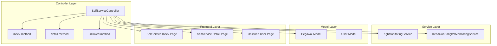
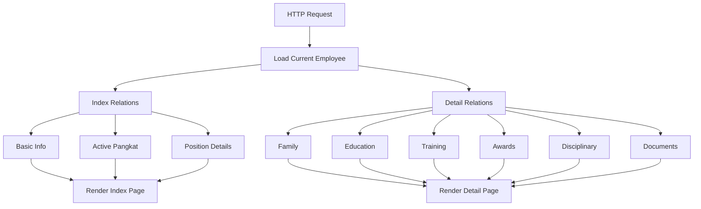
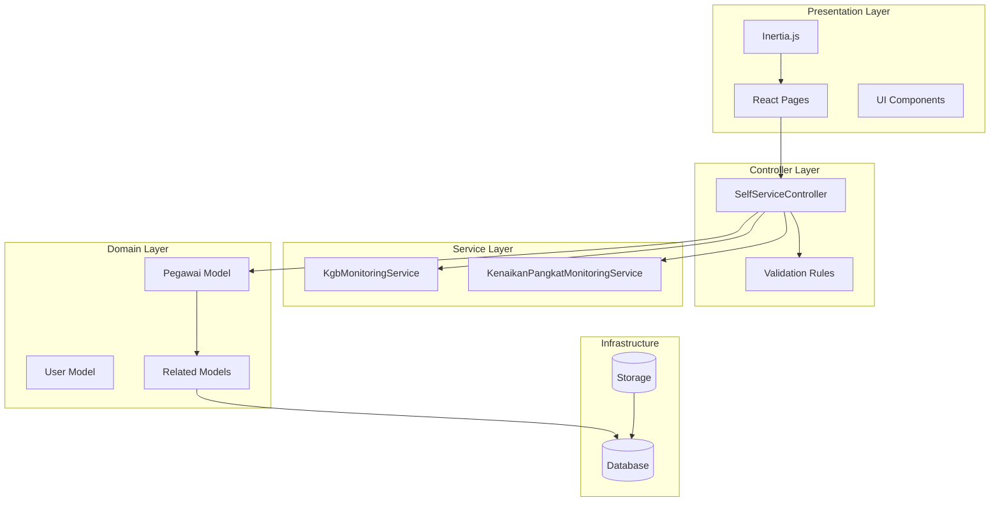
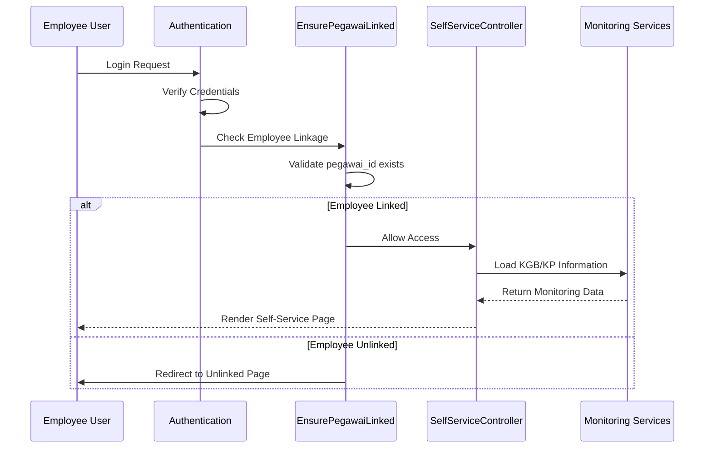
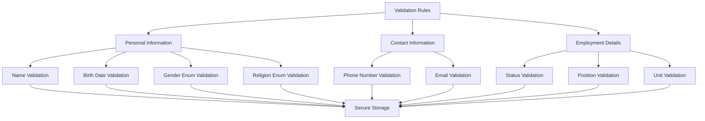
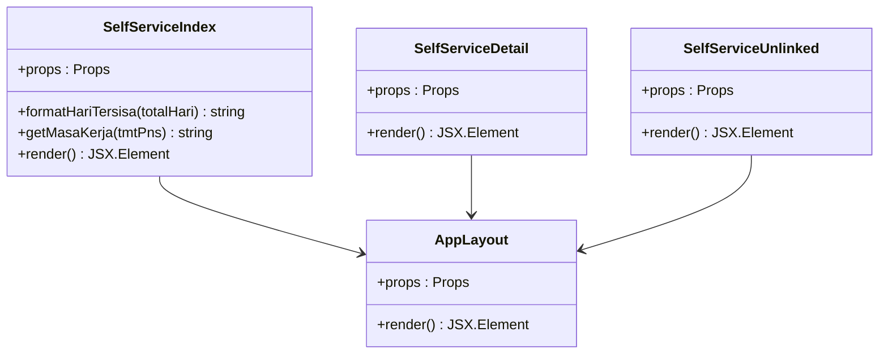
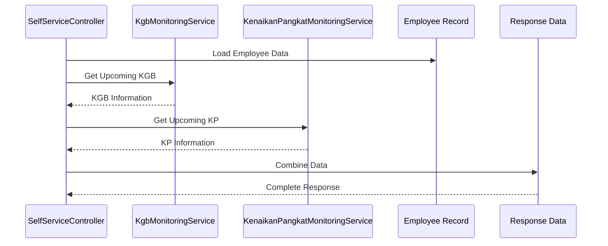
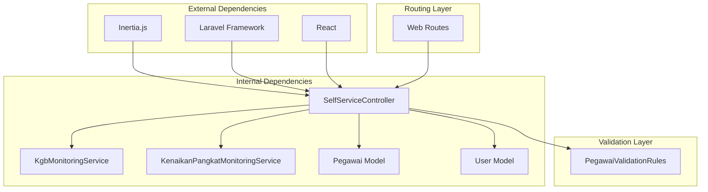

# Self-Service Controller

<cite>
**Referenced Files in This Document**
- [SelfServiceController.php](file://app/Http/Controllers/Kepegawaian/SelfServiceController.php)
- [web.php](file://routes/web.php)
- [SelfServiceAccessTest.php](file://tests/Feature/SelfService/SelfServiceAccessTest.php)
- [index.tsx](file://resources/js/pages/self-service/index.tsx)
- [detail.tsx](file://resources/js/pages/self-service/detail.tsx)
- [unlinked.tsx](file://resources/js/pages/self-service/unlinked.tsx)
- [PegawaiValidationRules.php](file://app/Concerns/PegawaiValidationRules.php)
- [KgbMonitoringService.php](file://app/Services/KgbMonitoringService.php)
- [KenaikanPangkatMonitoringService.php](file://app/Services/KenaikanPangkatMonitoringService.php)
</cite>

## Table of Contents
1. [Introduction](#introduction)
2. [Project Structure](#project-structure)
3. [Core Components](#core-components)
4. [Architecture Overview](#architecture-overview)
5. [Detailed Component Analysis](#detailed-component-analysis)
6. [Dependency Analysis](#dependency-analysis)
7. [Performance Considerations](#performance-considerations)
8. [Troubleshooting Guide](#troubleshooting-guide)
9. [Conclusion](#conclusion)

## Introduction

The SelfServiceController serves as the cornerstone of the employee self-service portal, providing authenticated employees with read-only access to their personal data and key HR information. This controller implements a comprehensive self-service architecture that balances user accessibility with strict security controls, ensuring employees can view their information while preventing unauthorized modifications or cross-access to other employees' data.

The self-service portal leverages Laravel's Inertia.js integration to deliver a seamless single-page application experience, combining robust backend validation with modern frontend interactions. The controller orchestrates data loading, relationship management, and service integration to present employees with their complete personnel profile, upcoming HR milestones, and organizational information.

## Project Structure

The self-service implementation follows a structured MVC pattern with clear separation of concerns:

**Diagram sources**
- [SelfServiceController.php:13-95](file://app/Http/Controllers/Kepegawaian/SelfServiceController.php#L13-L95)
- [web.php:106-112](file://routes/web.php#L106-L112)

**Section sources**
- [SelfServiceController.php:1-96](file://app/Http/Controllers/Kepegawaian/SelfServiceController.php#L1-L96)
- [web.php:106-112](file://routes/web.php#L106-L112)

## Core Components

### Controller Implementation

The SelfServiceController implements three primary methods that serve different aspects of the self-service experience:

**Index Method**: Provides employees with a comprehensive dashboard view of their personal information, including position details, recent career history, and upcoming HR milestones. The method loads essential relationships and integrates monitoring services to display KGB (Government Salary Increase) and KP (Promotion) information.

**Detail Method**: Offers an in-depth view of all employee records, presenting complete personnel data across multiple categories including personal information, family details, education history, training records, awards, disciplinary actions, and official documents.

**Unlinked Method**: Handles scenarios where employee accounts are not properly linked to personnel records, providing clear guidance for administrators.

### Data Loading Strategies

The controller employs sophisticated relationship loading strategies to optimize database queries and reduce N+1 query problems:

**Diagram sources**
- [SelfServiceController.php:45-80](file://app/Http/Controllers/Kepegawaian/SelfServiceController.php#L45-L80)

**Section sources**
- [SelfServiceController.php:20-43](file://app/Http/Controllers/Kepegawaian/SelfServiceController.php#L20-L43)
- [SelfServiceController.php:51-80](file://app/Http/Controllers/Kepegawaian/SelfServiceController.php#L51-L80)

## Architecture Overview

The self-service architecture implements a layered approach with clear boundaries between presentation, business logic, and data access layers:

**Diagram sources**
- [SelfServiceController.php:13-18](file://app/Http/Controllers/Kepegawaian/SelfServiceController.php#L13-L18)
- [web.php:15-15](file://routes/web.php#L15-L15)

The architecture ensures that:

- **Security**: All data access is scoped to the authenticated user's employee record
- **Performance**: Eager loading minimizes database queries
- **Maintainability**: Clear separation of concerns enables easy testing and modification
- **Scalability**: Service layer abstraction allows for easy extension

**Section sources**
- [SelfServiceController.php:13-18](file://app/Http/Controllers/Kepegawaian/SelfServiceController.php#L13-L18)
- [web.php:106-112](file://routes/web.php#L106-L112)

## Detailed Component Analysis

### Authorization and Access Control

The self-service portal implements a multi-layered authorization strategy that ensures only properly linked employees can access their data:

**Diagram sources**
- [web.php:106-112](file://routes/web.php#L106-L112)
- [SelfServiceAccessTest.php:51-94](file://tests/Feature/SelfService/SelfServiceAccessTest.php#L51-L94)

The authorization system enforces several critical security policies:

- **Employee-Only Access**: Only users with linked employee records can access self-service
- **Data Isolation**: Employees cannot access other employees' data
- **Role-Based Restrictions**: Viewer role users are restricted from administrative routes
- **Session Management**: Maintains secure session state throughout the user journey

### Data Validation and Security

The self-service implementation incorporates comprehensive validation rules to ensure data integrity and security:

**Diagram sources**
- [PegawaiValidationRules.php:16-50](file://app/Concerns/PegawaiValidationRules.php#L16-L50)

The validation system implements:

- **Required Field Enforcement**: Critical fields cannot be empty
- **Format Validation**: Phone numbers, emails, and other formatted fields
- **Enum Safety**: All categorical data validated against predefined enumerations
- **Unique Constraints**: Prevents duplicate identifiers like NIP numbers

**Section sources**
- [PegawaiValidationRules.php:16-77](file://app/Concerns/PegawaiValidationRules.php#L16-L77)
- [SelfServiceAccessTest.php:63-81](file://tests/Feature/SelfService/SelfServiceAccessTest.php#L63-L81)

### Frontend Integration Patterns

The self-service portal utilizes modern React patterns with Inertia.js for seamless server-client communication:

**Diagram sources**
- [index.tsx:150-408](file://resources/js/pages/self-service/index.tsx#L150-L408)
- [detail.tsx:26-30](file://resources/js/pages/self-service/detail.tsx#L26-L30)

The frontend components implement:

- **Responsive Design**: Adapts to various screen sizes and devices
- **Progressive Enhancement**: Graceful degradation for JavaScript-disabled clients
- **Accessibility**: WCAG-compliant design patterns
- **Performance Optimization**: Efficient rendering and minimal re-renders

**Section sources**
- [index.tsx:150-408](file://resources/js/pages/self-service/index.tsx#L150-L408)
- [detail.tsx:26-30](file://resources/js/pages/self-service/detail.tsx#L26-L30)

### Monitoring Integration

The self-service portal integrates with HR monitoring services to provide employees with important career-related information:

**Diagram sources**
- [SelfServiceController.php:82-94](file://app/Http/Controllers/Kepegawaian/SelfServiceController.php#L82-L94)
- [KgbMonitoringService.php:1507-1510](file://app/Services/KgbMonitoringService.php#L1507-L1510)
- [KenaikanPangkatMonitoringService.php:1614-1617](file://app/Services/KenaikanPangkatMonitoringService.php#L1614-L1617)

The monitoring integration provides:

- **KGB Tracking**: Next Government Salary Increase date and remaining days
- **KP Planning**: Promotion eligibility and timeline information
- **Real-time Updates**: Dynamic calculation of HR milestones
- **Status Indicators**: Color-coded status for quick understanding

**Section sources**
- [SelfServiceController.php:82-94](file://app/Http/Controllers/Kepegawaian/SelfServiceController.php#L82-L94)

## Dependency Analysis

The SelfServiceController maintains dependencies on several key components that collectively enable the self-service functionality:

**Diagram sources**
- [SelfServiceController.php:6-11](file://app/Http/Controllers/Kepegawaian/SelfServiceController.php#L6-L11)
- [web.php:15-15](file://routes/web.php#L15-L15)

The dependency structure ensures:

- **Loose Coupling**: Services are injected via constructor injection
- **Clear Interfaces**: Well-defined contracts between components
- **Testability**: Easy mocking and testing of dependencies
- **Maintainability**: Independent evolution of components

**Section sources**
- [SelfServiceController.php:15-18](file://app/Http/Controllers/Kepegawaian/SelfServiceController.php#L15-L18)
- [web.php:106-112](file://routes/web.php#L106-L112)

## Performance Considerations

The self-service implementation incorporates several performance optimization strategies:

### Query Optimization
- **Eager Loading**: Strategic loading of relationships to prevent N+1 queries
- **Selectivity**: Loading only required fields to minimize memory usage
- **Caching**: Leveraging Laravel's caching mechanisms for frequently accessed data

### Frontend Performance
- **Component Splitting**: Lazy loading of heavy components
- **State Management**: Efficient state updates to minimize re-renders
- **Bundle Optimization**: Tree shaking and code splitting for optimal loading

### Service Layer Efficiency
- **Batch Operations**: Combining multiple monitoring queries into single operations
- **Result Caching**: Storing computed results for short periods
- **Database Indexing**: Proper indexing strategies for frequently queried fields

## Troubleshooting Guide

### Common Issues and Solutions

**Authentication Failures**
- Verify user credentials and session state
- Check IAM permission middleware configuration
- Ensure proper user role assignment

**Data Access Problems**
- Confirm employee record linkage in user profile
- Verify database relationships and foreign key constraints
- Check service layer connectivity to monitoring systems

**Performance Issues**
- Monitor query execution times and optimize slow queries
- Implement appropriate caching strategies
- Review frontend bundle sizes and loading times

**Security Concerns**
- Regular security audits of authorization logic
- Input validation verification
- Session management review

**Section sources**
- [SelfServiceAccessTest.php:51-94](file://tests/Feature/SelfService/SelfServiceAccessTest.php#L51-L94)

## Conclusion

The SelfServiceController represents a comprehensive implementation of employee self-service functionality within the kepegawaian application. Through careful architectural design, robust security measures, and modern development practices, it provides employees with secure, efficient access to their personal HR information while maintaining strict data isolation and authorization controls.

The controller's modular design, comprehensive validation system, and integration with monitoring services demonstrates best practices in enterprise application development. Its implementation serves as a foundation for future enhancements while maintaining backward compatibility and extensibility.

The self-service portal successfully balances user experience with security requirements, providing a model for similar implementations in government and enterprise environments. Its architecture supports scalability, maintainability, and performance optimization while ensuring compliance with HR data protection standards.