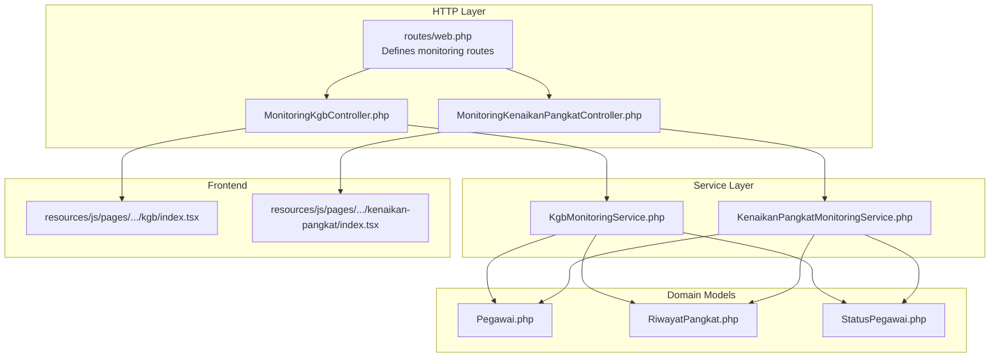
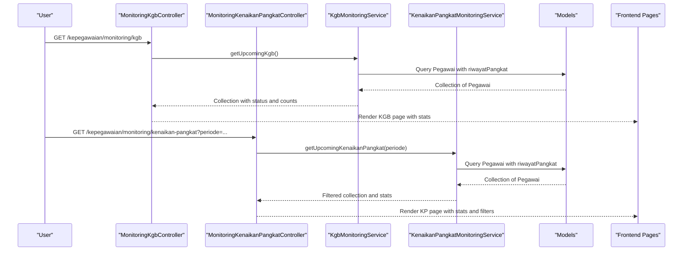
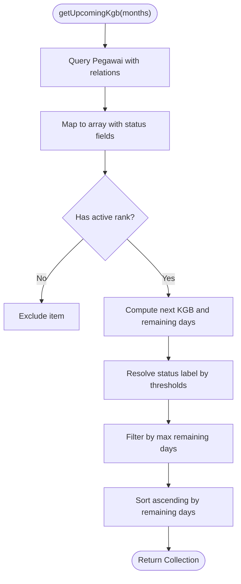
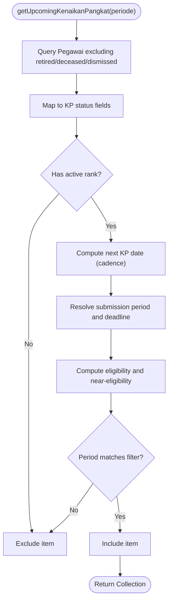
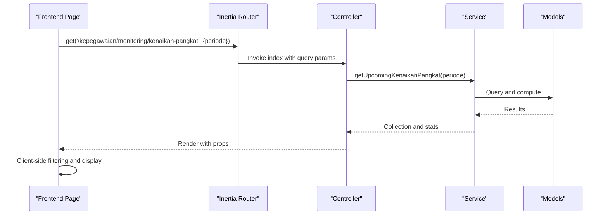
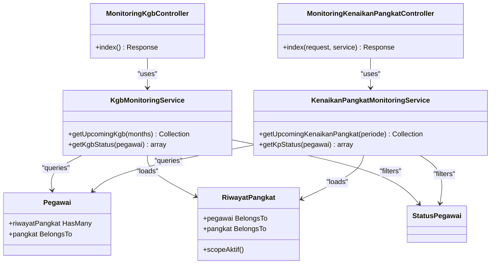
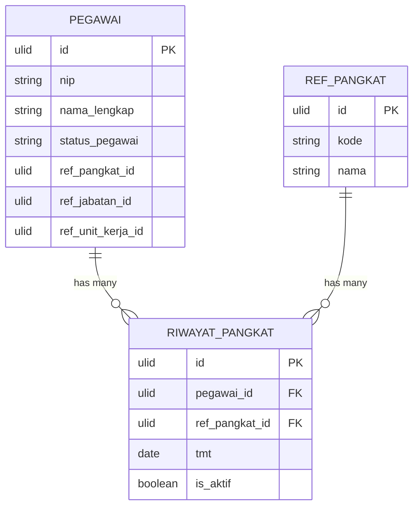

# Monitoring Controllers

<cite>
**Referenced Files in This Document**
- [MonitoringKgbController.php](file://app/Http/Controllers/Monitoring/MonitoringKgbController.php)
- [MonitoringKenaikanPangkatController.php](file://app/Http/Controllers/Monitoring/MonitoringKenaikanPangkatController.php)
- [KgbMonitoringService.php](file://app/Services/KgbMonitoringService.php)
- [KenaikanPangkatMonitoringService.php](file://app/Services/KenaikanPangkatMonitoringService.php)
- [Pegawai.php](file://app/Models/Pegawai.php)
- [RiwayatPangkat.php](file://app/Models/RiwayatPangkat.php)
- [StatusPegawai.php](file://app/Enums/StatusPegawai.php)
- [web.php](file://routes/web.php)
- [index.tsx (KGB)](file://resources/js/pages/kepegawaian/monitoring/kgb/index.tsx)
- [index.tsx (KP)](file://resources/js/pages/kepegawaian/monitoring/kenaikan-pangkat/index.tsx)
- [2026_03_15_031012_create_riwayat_pangkat_table.php](file://database/migrations/2026_03_15_031012_create_riwayat_pangkat_table.php)
- [2026_03_15_024651_create_pegawai_table.php](file://database/migrations/2026_03_15_024651_create_pegawai_table.php)
</cite>

## Table of Contents
1. [Introduction](#introduction)
2. [Project Structure](#project-structure)
3. [Core Components](#core-components)
4. [Architecture Overview](#architecture-overview)
5. [Detailed Component Analysis](#detailed-component-analysis)
6. [Dependency Analysis](#dependency-analysis)
7. [Performance Considerations](#performance-considerations)
8. [Troubleshooting Guide](#troubleshooting-guide)
9. [Conclusion](#conclusion)
10. [Appendices](#appendices)

## Introduction
This document explains the Monitoring Controllers responsible for eligibility tracking and analytics for two key personnel lifecycle events:
- KGB (Promotion-in-Grade or Salary Advance) monitoring: calculates upcoming KGB dates, remaining days, and risk-based status categories.
- KP (Promotion) monitoring: tracks promotion eligibility timelines, period of submission, and deadline proximity.

It covers backend controller responsibilities, service-layer algorithms, frontend dashboard integration patterns, and operational considerations such as performance optimization, caching, real-time processing, and reporting.

## Project Structure
The monitoring feature spans controllers, services, models, migrations, and frontend pages:
- Controllers orchestrate HTTP requests and render Inertia pages.
- Services encapsulate eligibility and analytics logic.
- Models define relationships and scopes used by services.
- Frontend pages render dashboards, filters, and statistics.

**Diagram sources**
- [web.php:39-43](file://routes/web.php#L39-L43)
- [MonitoringKgbController.php:16-30](file://app/Http/Controllers/Monitoring/MonitoringKgbController.php#L16-L30)
- [MonitoringKenaikanPangkatController.php:13-30](file://app/Http/Controllers/Monitoring/MonitoringKenaikanPangkatController.php#L13-L30)
- [KgbMonitoringService.php:14-52](file://app/Services/KgbMonitoringService.php#L14-L52)
- [KenaikanPangkatMonitoringService.php:13-62](file://app/Services/KenaikanPangkatMonitoringService.php#L13-L62)
- [Pegawai.php:99-117](file://app/Models/Pegawai.php#L99-L117)
- [RiwayatPangkat.php:54-57](file://app/Models/RiwayatPangkat.php#L54-L57)
- [StatusPegawai.php:5-23](file://app/Enums/StatusPegawai.php#L5-L23)
- [index.tsx (KGB):87-248](file://resources/js/pages/kepegawaian/monitoring/kgb/index.tsx#L87-L248)
- [index.tsx (KP):72-305](file://resources/js/pages/kepegawaian/monitoring/kenaikan-pangkat/index.tsx#L72-L305)

**Section sources**
- [web.php:39-43](file://routes/web.php#L39-L43)
- [MonitoringKgbController.php:16-30](file://app/Http/Controllers/Monitoring/MonitoringKgbController.php#L16-L30)
- [MonitoringKenaikanPangkatController.php:13-30](file://app/Http/Controllers/Monitoring/MonitoringKenaikanPangkatController.php#L13-L30)
- [index.tsx (KGB):87-248](file://resources/js/pages/kepegawaian/monitoring/kgb/index.tsx#L87-L248)
- [index.tsx (KP):72-305](file://resources/js/pages/kepegawaian/monitoring/kenaikan-pangkat/index.tsx#L72-L305)

## Core Components
- MonitoringKgbController: Fetches upcoming KGB candidates and renders the KGB dashboard with status counts.
- MonitoringKenaikanPangkatController: Filters and renders KP eligibility data with optional period filtering.
- KgbMonitoringService: Computes KGB due dates, remaining days, and categorizes risk status.
- KenaikanPangkatMonitoringService: Computes next KP promotion date, submission period, deadlines, and eligibility status.
- Models and enums: Define relations, scopes, and statuses used by services.

**Section sources**
- [MonitoringKgbController.php:10-31](file://app/Http/Controllers/Monitoring/MonitoringKgbController.php#L10-L31)
- [MonitoringKenaikanPangkatController.php:11-31](file://app/Http/Controllers/Monitoring/MonitoringKenaikanPangkatController.php#L11-L31)
- [KgbMonitoringService.php:12-99](file://app/Services/KgbMonitoringService.php#L12-L99)
- [KenaikanPangkatMonitoringService.php:11-122](file://app/Services/KenaikanPangkatMonitoringService.php#L11-L122)
- [Pegawai.php:99-117](file://app/Models/Pegawai.php#L99-L117)
- [RiwayatPangkat.php:54-57](file://app/Models/RiwayatPangkat.php#L54-L57)
- [StatusPegawai.php:5-23](file://app/Enums/StatusPegawai.php#L5-L23)

## Architecture Overview
The monitoring controllers act as orchestrators:
- Controllers receive HTTP requests, delegate to services, and pass aggregated data to Inertia pages.
- Services encapsulate domain logic and database queries.
- Frontend pages render cards, tables, and filters, and support client-side sorting and filtering.

**Diagram sources**
- [web.php:39-43](file://routes/web.php#L39-L43)
- [MonitoringKgbController.php:16-30](file://app/Http/Controllers/Monitoring/MonitoringKgbController.php#L16-L30)
- [MonitoringKenaikanPangkatController.php:13-30](file://app/Http/Controllers/Monitoring/MonitoringKenaikanPangkatController.php#L13-L30)
- [KgbMonitoringService.php:14-52](file://app/Services/KgbMonitoringService.php#L14-L52)
- [KenaikanPangkatMonitoringService.php:13-62](file://app/Services/KenaikanPangkatMonitoringService.php#L13-L62)
- [index.tsx (KGB):87-248](file://resources/js/pages/kepegawaian/monitoring/kgb/index.tsx#L87-L248)
- [index.tsx (KP):72-305](file://resources/js/pages/kepegawaian/monitoring/kenaikan-pangkat/index.tsx#L72-L305)

## Detailed Component Analysis

### KGB Monitoring Controller and Service
- Controller responsibility:
  - Calls service to fetch upcoming KGB candidates within a configurable window.
  - Computes status counts and passes them to the frontend.
- Service logic:
  - Loads active KGB date from latest active pension rank record.
  - Calculates next KGB date by adding a fixed cadence and computes remaining days.
  - Categorizes risk status based on remaining days thresholds.
  - Filters out employees without active rank records.

**Diagram sources**
- [KgbMonitoringService.php:14-52](file://app/Services/KgbMonitoringService.php#L14-L52)
- [KgbMonitoringService.php:54-70](file://app/Services/KgbMonitoringService.php#L54-L70)
- [KgbMonitoringService.php:83-98](file://app/Services/KgbMonitoringService.php#L83-L98)

**Section sources**
- [MonitoringKgbController.php:16-30](file://app/Http/Controllers/Monitoring/MonitoringKgbController.php#L16-L30)
- [KgbMonitoringService.php:14-52](file://app/Services/KgbMonitoringService.php#L14-L52)
- [KgbMonitoringService.php:54-70](file://app/Services/KgbMonitoringService.php#L54-L70)
- [KgbMonitoringService.php:83-98](file://app/Services/KgbMonitoringService.php#L83-L98)
- [index.tsx (KGB):87-248](file://resources/js/pages/kepegawaian/monitoring/kgb/index.tsx#L87-L248)

### KP (Promotion) Monitoring Controller and Service
- Controller responsibility:
  - Accepts optional period filter (April/October).
  - Delegates to service and renders KP dashboard with eligibility stats and filters.
- Service logic:
  - Determines next KP promotion date by adding a cadence to the active rank’s effective date.
  - Resolves submission period and deadline based on the next KP date.
  - Computes eligibility and near-eligibility windows.
  - Optionally filters by submission period.

**Diagram sources**
- [KenaikanPangkatMonitoringService.php:13-62](file://app/Services/KenaikanPangkatMonitoringService.php#L13-L62)
- [KenaikanPangkatMonitoringService.php:64-95](file://app/Services/KenaikanPangkatMonitoringService.php#L64-L95)
- [KenaikanPangkatMonitoringService.php:97-120](file://app/Services/KenaikanPangkatMonitoringService.php#L97-L120)

**Section sources**
- [MonitoringKenaikanPangkatController.php:13-30](file://app/Http/Controllers/Monitoring/MonitoringKenaikanPangkatController.php#L13-L30)
- [KenaikanPangkatMonitoringService.php:13-62](file://app/Services/KenaikanPangkatMonitoringService.php#L13-L62)
- [KenaikanPangkatMonitoringService.php:64-95](file://app/Services/KenaikanPangkatMonitoringService.php#L64-L95)
- [KenaikanPangkatMonitoringService.php:97-120](file://app/Services/KenaikanPangkatMonitoringService.php#L97-L120)
- [index.tsx (KP):72-305](file://resources/js/pages/kepegawaian/monitoring/kenaikan-pangkat/index.tsx#L72-L305)

### Frontend Dashboard Integration Patterns
- KGB dashboard:
  - Renders summary cards for total and categorized statuses.
  - Provides a client-side status filter and a sortable table of candidates.
- KP dashboard:
  - Renders summary cards for total and eligibility categories.
  - Supports period and status filters; updates route state without reload.
  - Shows submission period and deadline with remaining-day indicator.

**Diagram sources**
- [index.tsx (KP):176-184](file://resources/js/pages/kepegawaian/monitoring/kenaikan-pangkat/index.tsx#L176-L184)
- [MonitoringKenaikanPangkatController.php:13-30](file://app/Http/Controllers/Monitoring/MonitoringKenaikanPangkatController.php#L13-L30)
- [KenaikanPangkatMonitoringService.php:13-62](file://app/Services/KenaikanPangkatMonitoringService.php#L13-L62)

**Section sources**
- [index.tsx (KGB):87-248](file://resources/js/pages/kepegawaian/monitoring/kgb/index.tsx#L87-L248)
- [index.tsx (KP):72-305](file://resources/js/pages/kepegawaian/monitoring/kenaikan-pangkat/index.tsx#L72-L305)

## Dependency Analysis
- Controllers depend on services for data computation.
- Services depend on models and enums for relations, scopes, and status values.
- Frontend pages depend on controller-provided props and Inertia rendering.

**Diagram sources**
- [MonitoringKgbController.php:10-31](file://app/Http/Controllers/Monitoring/MonitoringKgbController.php#L10-L31)
- [MonitoringKenaikanPangkatController.php:11-31](file://app/Http/Controllers/Monitoring/MonitoringKenaikanPangkatController.php#L11-L31)
- [KgbMonitoringService.php:12-99](file://app/Services/KgbMonitoringService.php#L12-L99)
- [KenaikanPangkatMonitoringService.php:11-122](file://app/Services/KenaikanPangkatMonitoringService.php#L11-L122)
- [Pegawai.php:99-117](file://app/Models/Pegawai.php#L99-L117)
- [RiwayatPangkat.php:54-57](file://app/Models/RiwayatPangkat.php#L54-L57)
- [StatusPegawai.php:5-23](file://app/Enums/StatusPegawai.php#L5-L23)

**Section sources**
- [MonitoringKgbController.php:10-31](file://app/Http/Controllers/Monitoring/MonitoringKgbController.php#L10-L31)
- [MonitoringKenaikanPangkatController.php:11-31](file://app/Http/Controllers/Monitoring/MonitoringKenaikanPangkatController.php#L11-L31)
- [KgbMonitoringService.php:12-99](file://app/Services/KgbMonitoringService.php#L12-L99)
- [KenaikanPangkatMonitoringService.php:11-122](file://app/Services/KenaikanPangkatMonitoringService.php#L11-L122)
- [Pegawai.php:99-117](file://app/Models/Pegawai.php#L99-L117)
- [RiwayatPangkat.php:54-57](file://app/Models/RiwayatPangkat.php#L54-L57)
- [StatusPegawai.php:5-23](file://app/Enums/StatusPegawai.php#L5-L23)

## Performance Considerations
- Database efficiency:
  - Use eager loading for related records to avoid N+1 queries.
  - Apply scopes (e.g., active rank) to reduce dataset size early.
  - Filter by status enums to exclude retirees/deceased/dismissed where applicable.
- Computation cost:
  - Prefer server-side filtering and sorting for large lists; client-side filtering is acceptable for moderate sizes.
  - Cache computed collections per refresh cycle if data changes infrequently.
- Real-time processing:
  - For near-real-time dashboards, schedule periodic recomputation jobs and invalidate caches on significant data changes.
- Reporting:
  - Aggregate counts server-side to minimize frontend work.
  - Paginate or limit results for very large organizations.

[No sources needed since this section provides general guidance]

## Troubleshooting Guide
- Missing active rank:
  - Services throw exceptions when no active rank exists; ensure data integrity and handle gracefully in controllers.
- Incorrect status categorization:
  - Verify thresholds and cadence assumptions align with policy.
- Filtering anomalies:
  - Confirm frontend filters match backend logic (e.g., period matching).
- Route and permission:
  - Ensure monitoring routes are registered and protected by appropriate middleware.

**Section sources**
- [KgbMonitoringService.php:58-60](file://app/Services/KgbMonitoringService.php#L58-L60)
- [KenaikanPangkatMonitoringService.php:73-75](file://app/Services/KenaikanPangkatMonitoringService.php#L73-L75)
- [web.php:39-43](file://routes/web.php#L39-L43)

## Conclusion
The Monitoring Controllers provide robust eligibility tracking for KGB and KP events. Services encapsulate deterministic algorithms for date calculations, period resolution, and status categorization. Frontend pages deliver interactive dashboards with filtering and summary metrics. With proper caching, scheduled recomputation, and efficient queries, the system scales to large datasets while maintaining responsiveness.

[No sources needed since this section summarizes without analyzing specific files]

## Appendices

### Data Model Relationships

**Diagram sources**
- [2026_03_15_024651_create_pegawai_table.php:14-48](file://database/migrations/2026_03_15_024651_create_pegawai_table.php#L14-L48)
- [2026_03_15_031012_create_riwayat_pangkat_table.php:14-29](file://database/migrations/2026_03_15_031012_create_riwayat_pangkat_table.php#L14-L29)
- [Pegawai.php:69-82](file://app/Models/Pegawai.php#L69-L82)
- [RiwayatPangkat.php:44-51](file://app/Models/RiwayatPangkat.php#L44-L51)