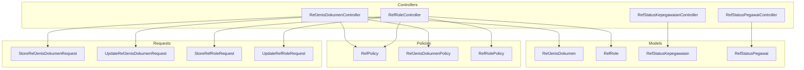
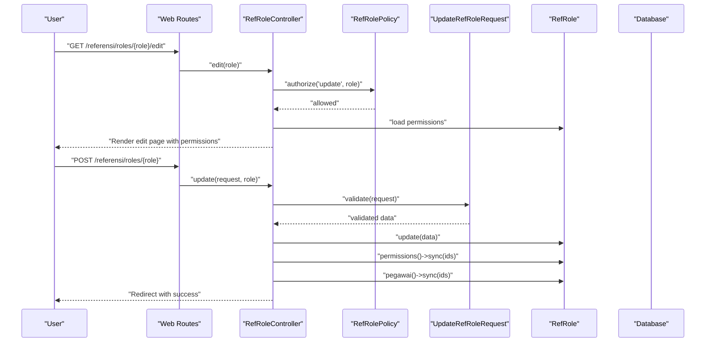
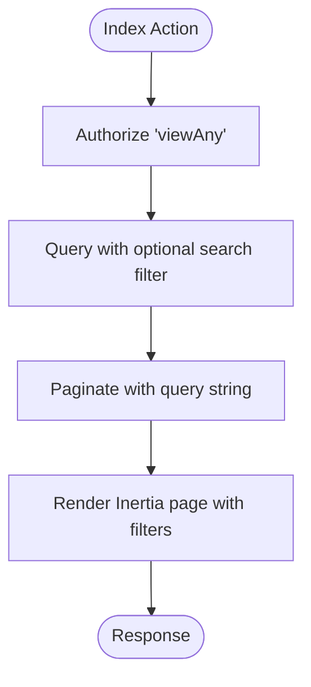
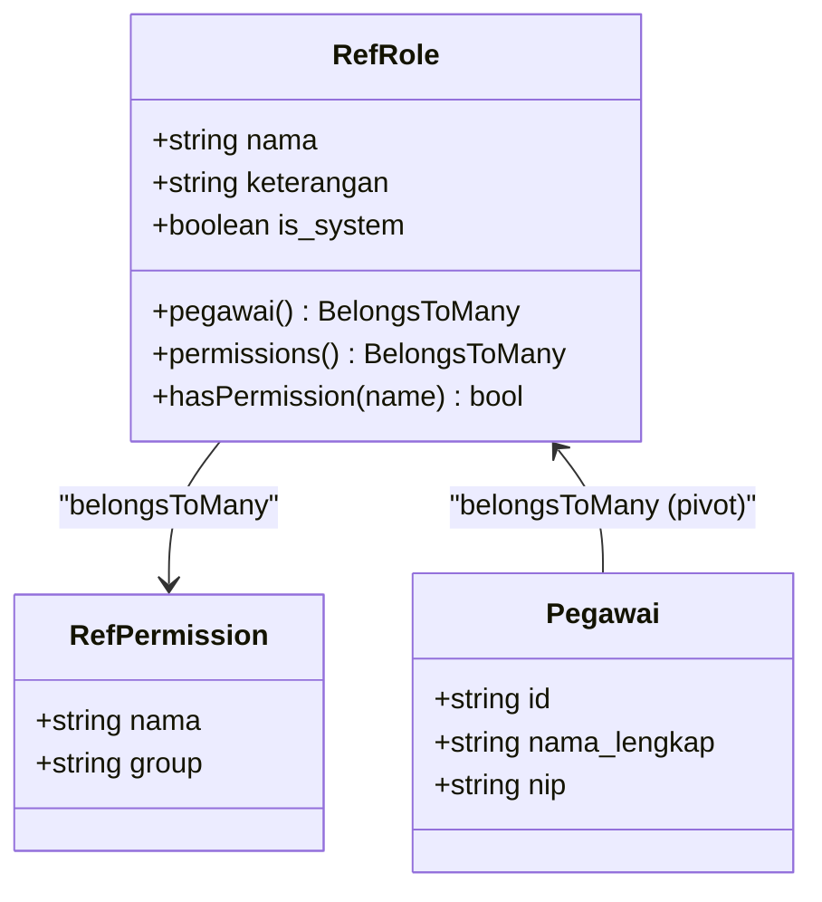
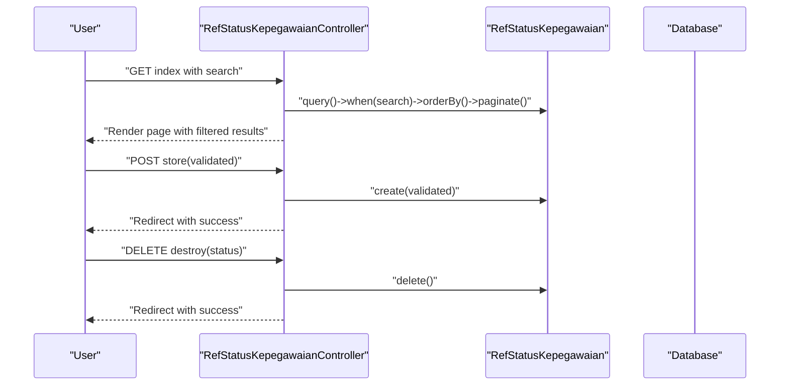
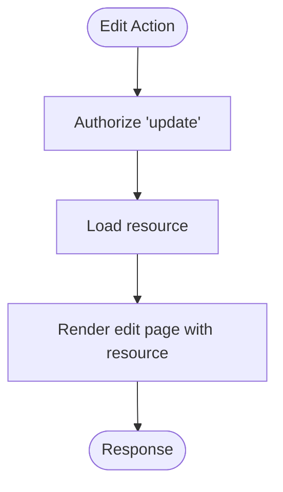
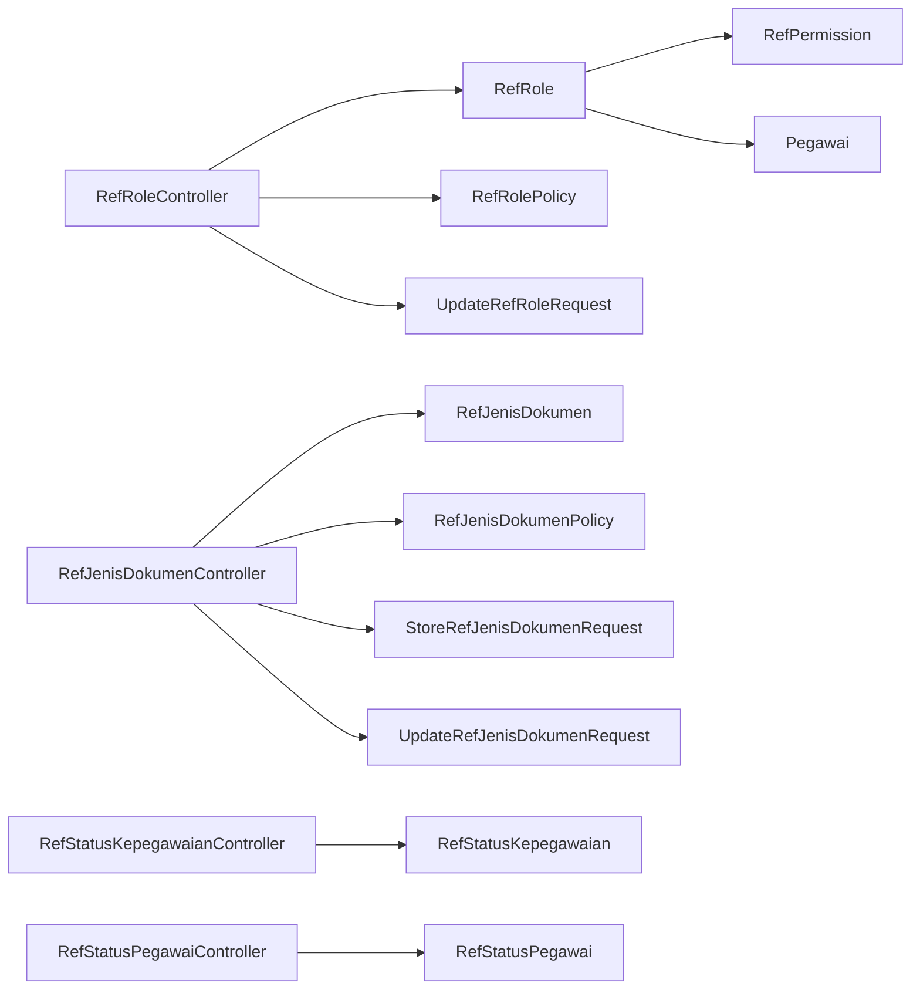

# Reference Data Controllers

<cite>
**Referenced Files in This Document**
- [RefJenisDokumenController.php](file://app/Http/Controllers/Referensi/RefJenisDokumenController.php)
- [RefRoleController.php](file://app/Http/Controllers/Referensi/RefRoleController.php)
- [RefStatusKepegawaianController.php](file://app/Http/Controllers/Referensi/RefStatusKepegawaianController.php)
- [RefStatusPegawaiController.php](file://app/Http/Controllers/Referensi/RefStatusPegawaiController.php)
- [StoreRefJenisDokumenRequest.php](file://app/Http/Requests/Referensi/StoreRefJenisDokumenRequest.php)
- [UpdateRefJenisDokumenRequest.php](file://app/Http/Requests/Referensi/UpdateRefJenisDokumenRequest.php)
- [StoreRefRoleRequest.php](file://app/Http/Requests/Referensi/StoreRefRoleRequest.php)
- [UpdateRefRoleRequest.php](file://app/Http/Requests/Referensi/UpdateRefRoleRequest.php)
- [RefJenisDokumen.php](file://app/Models/RefJenisDokumen.php)
- [RefRole.php](file://app/Models/RefRole.php)
- [RefStatusKepegawaian.php](file://app/Models/RefStatusKepegawaian.php)
- [RefStatusPegawai.php](file://app/Models/RefStatusPegawai.php)
- [RefPolicy.php](file://app/Policies/RefPolicy.php)
- [RefJenisDokumenPolicy.php](file://app/Policies/RefJenisDokumenPolicy.php)
- [RefRolePolicy.php](file://app/Policies/RefRolePolicy.php)
- [web.php](file://routes/web.php)
- [index.tsx](file://resources/pages/referensi/jenis-dokumen/index.tsx)
- [create.tsx](file://resources/pages/referensi/jenis-dokumen/create.tsx)
- [edit.tsx](file://resources/pages/referensi/jenis-dokumen/edit.tsx)
- [enum-select.tsx](file://resources/js/components/kepegawaian/enum-select.tsx)
</cite>

## Table of Contents
1. [Introduction](#introduction)
2. [Project Structure](#project-structure)
3. [Core Components](#core-components)
4. [Architecture Overview](#architecture-overview)
5. [Detailed Component Analysis](#detailed-component-analysis)
6. [Dependency Analysis](#dependency-analysis)
7. [Performance Considerations](#performance-considerations)
8. [Troubleshooting Guide](#troubleshooting-guide)
9. [Conclusion](#conclusion)

## Introduction
This document explains the Reference Data Controller group responsible for managing static data used across the Kepegawaian system. It covers four controllers: document type controller, role management controller, employment status controller, and employee status controller. The focus is on CRUD patterns, validation rules, lookup optimization, data integrity, cascading updates, and integration with main entities. It also addresses performance considerations for frequently accessed reference data, caching strategies, and consistency patterns, along with relationships to reference models, factory patterns, and frontend selection components.

## Project Structure
The Reference Data feature follows a layered structure:
- Controllers under app/Http/Controllers/Referensi implement CRUD actions and orchestrate authorization, validation, and rendering.
- Models under app/Models represent reference entities with fillable attributes and relationships.
- Policies under app/Policies enforce permission-based access control.
- Form Requests under app/Http/Requests/Referensi validate input and enforce uniqueness and existence rules.
- Frontend pages under resources/pages/referensi handle listing, creation, and editing UI flows.

**Diagram sources**
- [RefJenisDokumenController.php:13-77](file://app/Http/Controllers/Referensi/RefJenisDokumenController.php#L13-L77)
- [RefRoleController.php:15-131](file://app/Http/Controllers/Referensi/RefRoleController.php#L15-L131)
- [RefStatusKepegawaianController.php:13-80](file://app/Http/Controllers/Referensi/RefStatusKepegawaianController.php#L13-L80)
- [RefStatusPegawaiController.php:13-68](file://app/Http/Controllers/Referensi/RefStatusPegawaiController.php#L13-L68)
- [RefJenisDokumen.php:10-28](file://app/Models/RefJenisDokumen.php#L10-L28)
- [RefRole.php:11-43](file://app/Models/RefRole.php#L11-L43)
- [RefStatusKepegawaian.php:10-29](file://app/Models/RefStatusKepegawaian.php#L10-L29)
- [RefStatusPegawai.php:10-29](file://app/Models/RefStatusPegawai.php#L10-L29)
- [RefPolicy.php:7-43](file://app/Policies/RefPolicy.php#L7-L43)
- [RefJenisDokumenPolicy.php:7-43](file://app/Policies/RefJenisDokumenPolicy.php#L7-L43)
- [RefRolePolicy.php:8-48](file://app/Policies/RefRolePolicy.php#L8-L48)
- [StoreRefJenisDokumenRequest.php:9-32](file://app/Http/Requests/Referensi/StoreRefJenisDokumenRequest.php#L9-L32)
- [UpdateRefJenisDokumenRequest.php:8-41](file://app/Http/Requests/Referensi/UpdateRefJenisDokumenRequest.php#L8-L41)
- [StoreRefRoleRequest.php:9-35](file://app/Http/Requests/Referensi/StoreRefRoleRequest.php#L9-L35)
- [UpdateRefRoleRequest.php:8-45](file://app/Http/Requests/Referensi/UpdateRefRoleRequest.php#L8-L45)

**Section sources**
- [RefJenisDokumenController.php:13-77](file://app/Http/Controllers/Referensi/RefJenisDokumenController.php#L13-L77)
- [RefRoleController.php:15-131](file://app/Http/Controllers/Referensi/RefRoleController.php#L15-L131)
- [RefStatusKepegawaianController.php:13-80](file://app/Http/Controllers/Referensi/RefStatusKepegawaianController.php#L13-L80)
- [RefStatusPegawaiController.php:13-68](file://app/Http/Controllers/Referensi/RefStatusPegawaiController.php#L13-L68)

## Core Components
- Document Type Controller (RefJenisDokumenController): Manages document type reference entries with search, create, update, and delete operations. Uses dedicated form requests for validation and applies soft deletes.
- Role Management Controller (RefRoleController): Manages roles with associated permissions and assigned pegawai. Supports permission sync, employee assignment sync, and system role protection.
- Employment Status Controller (RefStatusKepegawaianController): Manages employment statuses with searchable listing and CRUD operations.
- Employee Status Controller (RefStatusPegawaiController): Manages employee statuses with searchable listing and CRUD operations.

Each controller adheres to a consistent pattern:
- Authorization via policies before each action.
- Validation via form requests with explicit rules and messages.
- Pagination and optional search filters for listing views.
- Inertia rendering for SPA-like UX with flash messaging for feedback.

**Section sources**
- [RefJenisDokumenController.php:15-31](file://app/Http/Controllers/Referensi/RefJenisDokumenController.php#L15-L31)
- [RefRoleController.php:17-36](file://app/Http/Controllers/Referensi/RefRoleController.php#L17-L36)
- [RefStatusKepegawaianController.php:15-34](file://app/Http/Controllers/Referensi/RefStatusKepegawaianController.php#L15-L34)
- [RefStatusPegawaiController.php:15-31](file://app/Http/Controllers/Referensi/RefStatusPegawaiController.php#L15-L31)

## Architecture Overview
The controllers coordinate with models, policies, and form requests to maintain clean separation of concerns. Authorization is enforced centrally via policies, while validation is encapsulated in form requests. Listing pages support search and pagination, and edit pages load related data for selection components.

**Diagram sources**
- [RefRoleController.php:66-90](file://app/Http/Controllers/Referensi/RefRoleController.php#L66-L90)
- [RefRoleController.php:92-107](file://app/Http/Controllers/Referensi/RefRoleController.php#L92-L107)
- [RefRolePolicy.php:24-28](file://app/Policies/RefRolePolicy.php#L24-L28)
- [UpdateRefRoleRequest.php:17-34](file://app/Http/Requests/Referensi/UpdateRefRoleRequest.php#L17-L34)
- [RefRole.php:28-37](file://app/Models/RefRole.php#L28-L37)

## Detailed Component Analysis

### Document Type Controller Pattern
- Responsibilities:
  - List document types with optional search on name.
  - Create new document types with unique name validation.
  - Edit existing document types with unique name validation excluding current record.
  - Delete document types with soft deletes.
- Validation:
  - Unique name constraint enforced at database level via rules.
  - Length constraints and nullable fields handled in form requests.
- Authorization:
  - Uses RefJenisDokumenPolicy inherited from RefPolicy.
- Frontend Integration:
  - Pages under resources/pages/referensi/jenis-dokumen provide listing, create, and edit views.

**Diagram sources**
- [RefJenisDokumenController.php:15-31](file://app/Http/Controllers/Referensi/RefJenisDokumenController.php#L15-L31)
- [RefJenisDokumenPolicy.php:9-12](file://app/Policies/RefJenisDokumenPolicy.php#L9-L12)

**Section sources**
- [RefJenisDokumenController.php:15-31](file://app/Http/Controllers/Referensi/RefJenisDokumenController.php#L15-L31)
- [StoreRefJenisDokumenRequest.php:16-22](file://app/Http/Requests/Referensi/StoreRefJenisDokumenRequest.php#L16-L22)
- [UpdateRefJenisDokumenRequest.php:17-30](file://app/Http/Requests/Referensi/UpdateRefJenisDokumenRequest.php#L17-L30)
- [RefJenisDokumenPolicy.php:9-12](file://app/Policies/RefJenisDokumenPolicy.php#L9-L12)

### Role Management Controller Pattern
- Responsibilities:
  - List roles with counts of permissions and assigned pegawai.
  - Create roles with optional permission assignments.
  - Edit roles with preloaded permissions and paginated pegawai search.
  - Update roles with permission and employee sync operations.
  - Delete roles with system role protection and dependency checks.
- Validation:
  - Unique role name enforcement.
  - Permissions array validation with existence checks.
  - Employee IDs array validation with existence checks.
- Authorization:
  - Uses RefRolePolicy with special handling for system roles.
- Relationships:
  - Many-to-many with RefPermission and Pegawai.
  - Helper method to check permission membership.

**Diagram sources**
- [RefRole.php:11-43](file://app/Models/RefRole.php#L11-L43)
- [RefRolePolicy.php:30-37](file://app/Policies/RefRolePolicy.php#L30-L37)

**Section sources**
- [RefRoleController.php:17-36](file://app/Http/Controllers/Referensi/RefRoleController.php#L17-L36)
- [RefRoleController.php:53-64](file://app/Http/Controllers/Referensi/RefRoleController.php#L53-L64)
- [RefRoleController.php:66-90](file://app/Http/Controllers/Referensi/RefRoleController.php#L66-L90)
- [RefRoleController.php:92-107](file://app/Http/Controllers/Referensi/RefRoleController.php#L92-L107)
- [RefRoleController.php:109-130](file://app/Http/Controllers/Referensi/RefRoleController.php#L109-L130)
- [StoreRefRoleRequest.php:16-24](file://app/Http/Requests/Referensi/StoreRefRoleRequest.php#L16-L24)
- [UpdateRefRoleRequest.php:17-34](file://app/Http/Requests/Referensi/UpdateRefRoleRequest.php#L17-L34)
- [RefRole.php:28-42](file://app/Models/RefRole.php#L28-L42)
- [RefRolePolicy.php:30-37](file://app/Policies/RefRolePolicy.php#L30-L37)

### Employment Status Controller Pattern
- Responsibilities:
  - List employment statuses with searchable name/code filters.
  - Create/update/delete with validation and soft deletes.
- Validation:
  - Search combines code and name matching.
  - Unique constraints enforced via form requests.

**Diagram sources**
- [RefStatusKepegawaianController.php:15-34](file://app/Http/Controllers/Referensi/RefStatusKepegawaianController.php#L15-L34)
- [RefStatusKepegawaianController.php:43-50](file://app/Http/Controllers/Referensi/RefStatusKepegawaianController.php#L43-L50)
- [RefStatusKepegawaianController.php:70-79](file://app/Http/Controllers/Referensi/RefStatusKepegawaianController.php#L70-L79)

**Section sources**
- [RefStatusKepegawaianController.php:15-34](file://app/Http/Controllers/Referensi/RefStatusKepegawaianController.php#L15-L34)
- [RefStatusKepegawaianController.php:43-50](file://app/Http/Controllers/Referensi/RefStatusKepegawaianController.php#L43-L50)
- [RefStatusKepegawaianController.php:70-79](file://app/Http/Controllers/Referensi/RefStatusKepegawaianController.php#L70-L79)

### Employee Status Controller Pattern
- Responsibilities:
  - List employee statuses with searchable name/code filters.
  - Create/update/delete with validation and soft deletes.

**Diagram sources**
- [RefStatusPegawaiController.php:47-52](file://app/Http/Controllers/Referensi/RefStatusPegawaiController.php#L47-L52)

**Section sources**
- [RefStatusPegawaiController.php:15-31](file://app/Http/Controllers/Referensi/RefStatusPegawaiController.php#L15-L31)
- [RefStatusPegawaiController.php:40-45](file://app/Http/Controllers/Referensi/RefStatusPegawaiController.php#L40-L45)
- [RefStatusPegawaiController.php:54-59](file://app/Http/Controllers/Referensi/RefStatusPegawaiController.php#L54-L59)

## Dependency Analysis
- Controllers depend on:
  - Models for persistence and relationships.
  - Policies for authorization checks.
  - Form Requests for validation and sanitization.
- Controllers render views via Inertia, which integrate with frontend pages.
- Relationships:
  - RefRole has many-to-many relationships with RefPermission and Pegawai.
  - All reference models use soft deletes and ULIDs.

**Diagram sources**
- [RefRoleController.php:15-131](file://app/Http/Controllers/Referensi/RefRoleController.php#L15-L131)
- [RefRole.php:28-37](file://app/Models/RefRole.php#L28-L37)
- [RefJenisDokumenController.php:13-77](file://app/Http/Controllers/Referensi/RefJenisDokumenController.php#L13-L77)
- [RefJenisDokumen.php:10-28](file://app/Models/RefJenisDokumen.php#L10-L28)
- [RefStatusKepegawaianController.php:13-80](file://app/Http/Controllers/Referensi/RefStatusKepegawaianController.php#L13-L80)
- [RefStatusKepegawaian.php:10-29](file://app/Models/RefStatusKepegawaian.php#L10-L29)
- [RefStatusPegawaiController.php:13-68](file://app/Http/Controllers/Referensi/RefStatusPegawaiController.php#L13-L68)
- [RefStatusPegawai.php:10-29](file://app/Models/RefStatusPegawai.php#L10-L29)

**Section sources**
- [RefRole.php:28-37](file://app/Models/RefRole.php#L28-L37)
- [RefJenisDokumen.php:10-28](file://app/Models/RefJenisDokumen.php#L10-L28)
- [RefStatusKepegawaian.php:10-29](file://app/Models/RefStatusKepegawaian.php#L10-L29)
- [RefStatusPegawai.php:10-29](file://app/Models/RefStatusPegawai.php#L10-L29)

## Performance Considerations
- Frequently accessed reference data:
  - Use eager loading for relationships in listing actions (e.g., permission and pegawai counts).
  - Apply pagination to avoid large result sets.
  - Add database indexes on frequently searched columns (name, kode) and foreign keys.
- Caching strategies:
  - Cache small, stable reference lists (e.g., status lists) with appropriate tags for invalidation on change.
  - Use cache tags to invalidate related cached views when reference records change.
- Data consistency:
  - Enforce uniqueness at the database level via unique constraints in form requests.
  - Use transactions for multi-step updates (e.g., role permission sync) to maintain atomicity.
- Lookup optimization:
  - Prefer exact matches for codes and enums; fallback to LIKE only for free-text search.
  - Limit SELECT fields to only those needed for listing and selection components.

[No sources needed since this section provides general guidance]

## Troubleshooting Guide
- Authorization failures:
  - Ensure user has required permissions for referensi CRUD operations. Policies delegate to a shared permission set.
- Validation errors:
  - Review form request rules for unique constraints and length limits. Messages guide users on corrections.
- Deletion blocked:
  - System roles cannot be deleted; ensure the target is not marked as system.
  - Roles with assigned pegawai cannot be deleted; reassign employees to another role first.
- Cascading updates:
  - Permission and employee assignments are synced via sync operations; verify arrays passed include only existing IDs.

**Section sources**
- [RefPolicy.php:9-32](file://app/Policies/RefPolicy.php#L9-L32)
- [RefRolePolicy.php:30-37](file://app/Policies/RefRolePolicy.php#L30-L37)
- [StoreRefJenisDokumenRequest.php:16-22](file://app/Http/Requests/Referensi/StoreRefJenisDokumenRequest.php#L16-L22)
- [UpdateRefJenisDokumenRequest.php:17-30](file://app/Http/Requests/Referensi/UpdateRefJenisDokumenRequest.php#L17-L30)
- [StoreRefRoleRequest.php:16-24](file://app/Http/Requests/Referensi/StoreRefRoleRequest.php#L16-L24)
- [UpdateRefRoleRequest.php:17-34](file://app/Http/Requests/Referensi/UpdateRefRoleRequest.php#L17-L34)

## Conclusion
The Reference Data Controllers implement a consistent, secure, and scalable pattern for managing static data. They leverage policies for authorization, form requests for validation, and Eloquent relationships for integrity. The controllers integrate with frontend selection components and support efficient lookups through pagination and targeted queries. By applying caching and indexing strategies, the system maintains performance for frequently accessed reference data while preserving data consistency and user experience.