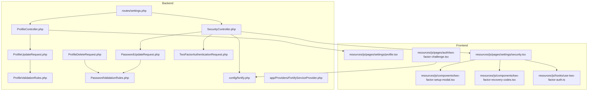
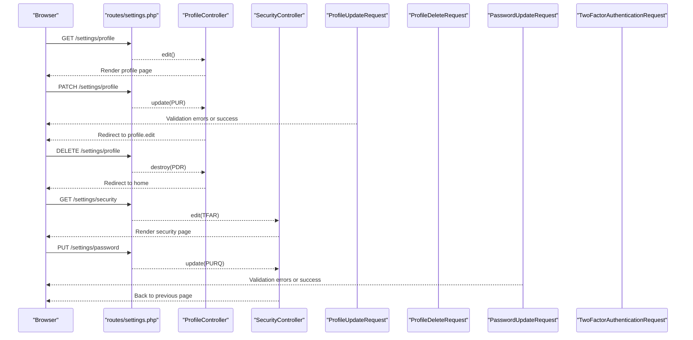
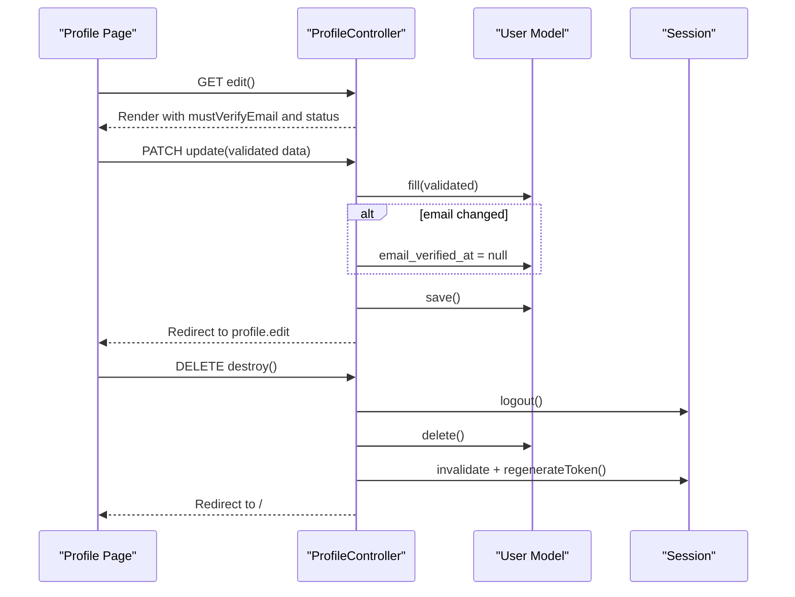
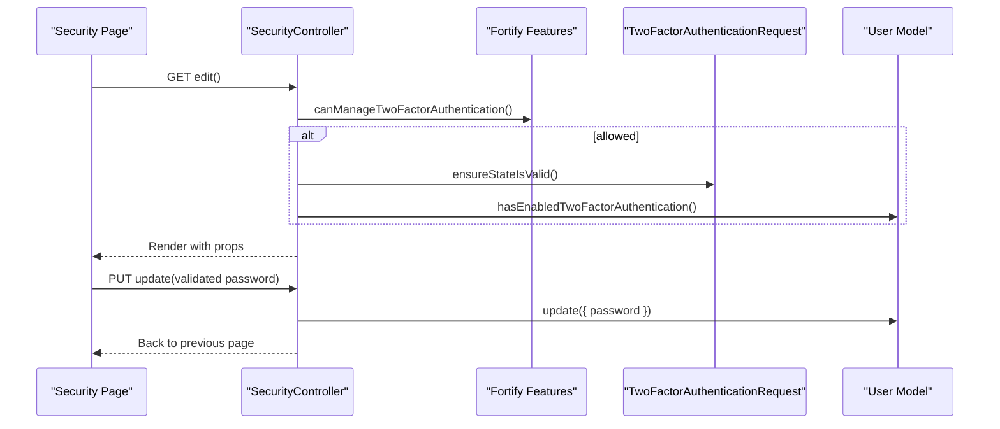
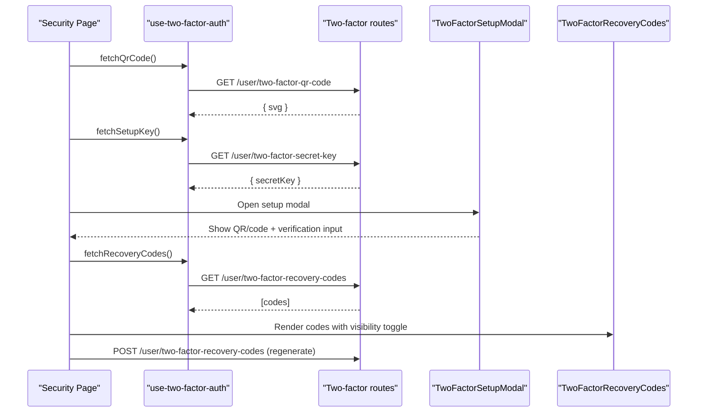
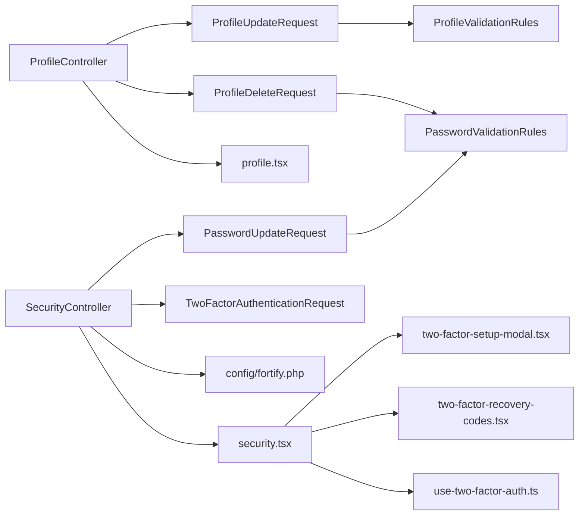

# Settings Controllers

<cite>
**Referenced Files in This Document**
- [ProfileController.php](file://app/Http/Controllers/Settings/ProfileController.php)
- [SecurityController.php](file://app/Http/Controllers/Settings/SecurityController.php)
- [ProfileUpdateRequest.php](file://app/Http/Requests/Settings/ProfileUpdateRequest.php)
- [ProfileDeleteRequest.php](file://app/Http/Requests/Settings/ProfileDeleteRequest.php)
- [PasswordUpdateRequest.php](file://app/Http/Requests/Settings/PasswordUpdateRequest.php)
- [TwoFactorAuthenticationRequest.php](file://app/Http/Requests/Settings/TwoFactorAuthenticationRequest.php)
- [ProfileValidationRules.php](file://app/Concerns/ProfileValidationRules.php)
- [PasswordValidationRules.php](file://app/Concerns/PasswordValidationRules.php)
- [settings.php](file://routes/settings.php)
- [profile.tsx](file://resources/js/pages/settings/profile.tsx)
- [security.tsx](file://resources/js/pages/settings/security.tsx)
- [two-factor-setup-modal.tsx](file://resources/js/components/two-factor-setup-modal.tsx)
- [two-factor-recovery-codes.tsx](file://resources/js/components/two-factor-recovery-codes.tsx)
- [two-factor-challenge.tsx](file://resources/js/pages/auth/two-factor-challenge.tsx)
- [use-two-factor-auth.ts](file://resources/js/hooks/use-two-factor-auth.ts)
- [fortify.php](file://config/fortify.php)
- [FortifyServiceProvider.php](file://app/Providers/FortifyServiceProvider.php)
</cite>

## Table of Contents
1. [Introduction](#introduction)
2. [Project Structure](#project-structure)
3. [Core Components](#core-components)
4. [Architecture Overview](#architecture-overview)
5. [Detailed Component Analysis](#detailed-component-analysis)
6. [Dependency Analysis](#dependency-analysis)
7. [Performance Considerations](#performance-considerations)
8. [Troubleshooting Guide](#troubleshooting-guide)
9. [Conclusion](#conclusion)

## Introduction
This document explains the Settings Controllers responsible for user profile management and security settings. It covers:
- Profile controller for updating personal information, handling email verification, and account deletion
- Security controller for password updates, two-factor authentication (2FA) management, and recovery code handling
- Concrete workflows, validation patterns, and integration with authentication systems
- Frontend settings interfaces and UX considerations

## Project Structure
The Settings feature spans backend controllers and requests, frontend pages and components, and configuration for authentication features.

**Diagram sources**
- [ProfileController.php:15-60](file://app/Http/Controllers/Settings/ProfileController.php#L15-L60)
- [SecurityController.php:15-58](file://app/Http/Controllers/Settings/SecurityController.php#L15-L58)
- [ProfileUpdateRequest.php:9-22](file://app/Http/Requests/Settings/ProfileUpdateRequest.php#L9-L22)
- [ProfileDeleteRequest.php:9-24](file://app/Http/Requests/Settings/ProfileDeleteRequest.php#L9-L24)
- [PasswordUpdateRequest.php:9-25](file://app/Http/Requests/Settings/PasswordUpdateRequest.php#L9-L25)
- [TwoFactorAuthenticationRequest.php:9-22](file://app/Http/Requests/Settings/TwoFactorAuthenticationRequest.php#L9-L22)
- [ProfileValidationRules.php:8-50](file://app/Concerns/ProfileValidationRules.php#L8-L50)
- [PasswordValidationRules.php:8-29](file://app/Concerns/PasswordValidationRules.php#L8-L29)
- [settings.php:1-25](file://routes/settings.php#L1-L25)
- [profile.tsx:1-151](file://resources/js/pages/settings/profile.tsx#L1-L151)
- [security.tsx:1-263](file://resources/js/pages/settings/security.tsx#L1-L263)
- [two-factor-setup-modal.tsx:243-286](file://resources/js/components/two-factor-setup-modal.tsx#L243-L286)
- [two-factor-recovery-codes.tsx:1-164](file://resources/js/components/two-factor-recovery-codes.tsx#L1-L164)
- [use-two-factor-auth.ts:1-82](file://resources/js/hooks/use-two-factor-auth.ts#L1-L82)
- [two-factor-challenge.tsx:1-82](file://resources/js/pages/auth/two-factor-challenge.tsx#L1-L82)
- [fortify.php:146-154](file://config/fortify.php#L146-L154)
- [FortifyServiceProvider.php:54-101](file://app/Providers/FortifyServiceProvider.php#L54-L101)

**Section sources**
- [settings.php:1-25](file://routes/settings.php#L1-L25)

## Core Components
- ProfileController: Renders profile settings, updates personal info, and deletes the account. It integrates with email verification and logout flows.
- SecurityController: Manages password updates and two-factor authentication settings. It conditionally applies a password confirmation middleware based on Fortify configuration.
- Form Requests and Validation Traits: Centralize validation rules for profile updates, password changes, and 2FA state handling.
- Frontend Settings Pages: Provide user-friendly forms for profile editing and security controls, including 2FA setup and recovery code management.

**Section sources**
- [ProfileController.php:15-60](file://app/Http/Controllers/Settings/ProfileController.php#L15-L60)
- [SecurityController.php:15-58](file://app/Http/Controllers/Settings/SecurityController.php#L15-L58)
- [ProfileUpdateRequest.php:9-22](file://app/Http/Requests/Settings/ProfileUpdateRequest.php#L9-L22)
- [PasswordUpdateRequest.php:9-25](file://app/Http/Requests/Settings/PasswordUpdateRequest.php#L9-L25)
- [TwoFactorAuthenticationRequest.php:9-22](file://app/Http/Requests/Settings/TwoFactorAuthenticationRequest.php#L9-L22)
- [ProfileValidationRules.php:8-50](file://app/Concerns/ProfileValidationRules.php#L8-L50)
- [PasswordValidationRules.php:8-29](file://app/Concerns/PasswordValidationRules.php#L8-L29)
- [profile.tsx:1-151](file://resources/js/pages/settings/profile.tsx#L1-L151)
- [security.tsx:1-263](file://resources/js/pages/settings/security.tsx#L1-L263)

## Architecture Overview
The Settings feature follows a layered pattern:
- Routes define protected endpoints for profile and security actions.
- Controllers orchestrate user interactions, enforce middleware, and delegate to form requests for validation.
- Form requests encapsulate validation rules using shared traits.
- Frontend pages render settings UI and integrate with controllers via Inertia actions.

**Diagram sources**
- [settings.php:7-24](file://routes/settings.php#L7-L24)
- [ProfileController.php:20-59](file://app/Http/Controllers/Settings/ProfileController.php#L20-L59)
- [SecurityController.php:31-57](file://app/Http/Controllers/Settings/SecurityController.php#L31-L57)
- [ProfileUpdateRequest.php:18-21](file://app/Http/Requests/Settings/ProfileUpdateRequest.php#L18-L21)
- [ProfileDeleteRequest.php:18-23](file://app/Http/Requests/Settings/ProfileDeleteRequest.php#L18-L23)
- [PasswordUpdateRequest.php:18-24](file://app/Http/Requests/Settings/PasswordUpdateRequest.php#L18-L24)
- [TwoFactorAuthenticationRequest.php:18-21](file://app/Http/Requests/Settings/TwoFactorAuthenticationRequest.php#L18-L21)

## Detailed Component Analysis

### Profile Controller
Responsibilities:
- Render profile settings page with email verification status and session status.
- Update user profile with validated attributes; mark email unverified when changed.
- Delete user account after logout, session invalidation, and CSRF token regeneration.

**Diagram sources**
- [ProfileController.php:20-59](file://app/Http/Controllers/Settings/ProfileController.php#L20-L59)
- [profile.tsx:38-147](file://resources/js/pages/settings/profile.tsx#L38-L147)

Validation and rules:
- Name and email validation rules are centralized in a trait and applied via the profile update request.
- Email uniqueness respects the current user ID to avoid conflicts.

**Section sources**
- [ProfileController.php:15-60](file://app/Http/Controllers/Settings/ProfileController.php#L15-L60)
- [ProfileUpdateRequest.php:9-22](file://app/Http/Requests/Settings/ProfileUpdateRequest.php#L9-L22)
- [ProfileValidationRules.php:15-49](file://app/Concerns/ProfileValidationRules.php#L15-L49)
- [profile.tsx:38-147](file://resources/js/pages/settings/profile.tsx#L38-L147)

### Security Controller
Responsibilities:
- Conditionally require password confirmation for accessing security settings based on Fortify configuration.
- Render security settings page with 2FA capability flags and state checks.
- Update user password using validated inputs.

**Diagram sources**
- [SecurityController.php:31-57](file://app/Http/Controllers/Settings/SecurityController.php#L31-L57)
- [TwoFactorAuthenticationRequest.php:11-21](file://app/Http/Requests/Settings/TwoFactorAuthenticationRequest.php#L11-L21)
- [security.tsx:59-259](file://resources/js/pages/settings/security.tsx#L59-L259)

Middleware behavior:
- A password confirmation middleware is applied to the edit action when Fortify’s two-factor settings require it.

**Section sources**
- [SecurityController.php:15-58](file://app/Http/Controllers/Settings/SecurityController.php#L15-L58)
- [fortify.php:146-154](file://config/fortify.php#L146-L154)
- [security.tsx:59-259](file://resources/js/pages/settings/security.tsx#L59-L259)

### Two-Factor Authentication Management
End-to-end flow for enabling 2FA and managing recovery codes:
- Fetch QR code SVG and manual setup key
- Present setup modal with verification steps
- Generate and display recovery codes
- Allow regenerating codes securely

**Diagram sources**
- [use-two-factor-auth.ts:33-82](file://resources/js/hooks/use-two-factor-auth.ts#L33-L82)
- [two-factor-setup-modal.tsx:243-286](file://resources/js/components/two-factor-setup-modal.tsx#L243-L286)
- [two-factor-recovery-codes.tsx:1-164](file://resources/js/components/two-factor-recovery-codes.tsx#L1-L164)
- [security.tsx:200-258](file://resources/js/pages/settings/security.tsx#L200-L258)

Challenge flow:
- During login, users enter a 6-digit code or a recovery code depending on mode.

**Section sources**
- [two-factor-challenge.tsx:16-82](file://resources/js/pages/auth/two-factor-challenge.tsx#L16-L82)

### Password Updates
Validation and UX:
- Current password and new password confirmation are validated server-side.
- On validation errors, focus is returned to the appropriate input field in the frontend.

**Section sources**
- [PasswordUpdateRequest.php:18-24](file://app/Http/Requests/Settings/PasswordUpdateRequest.php#L18-L24)
- [PasswordValidationRules.php:15-28](file://app/Concerns/PasswordValidationRules.php#L15-L28)
- [security.tsx:88-167](file://resources/js/pages/settings/security.tsx#L88-L167)

### Account Deletion
Flow:
- Requires current password confirmation via the delete request rules.
- Logs out the user, deletes the record, invalidates the session, and regenerates the CSRF token.

**Section sources**
- [ProfileDeleteRequest.php:18-23](file://app/Http/Requests/Settings/ProfileDeleteRequest.php#L18-L23)
- [ProfileController.php:47-59](file://app/Http/Controllers/Settings/ProfileController.php#L47-L59)
- [profile.tsx:146](file://resources/js/pages/settings/profile.tsx#L146)

## Dependency Analysis
- Controllers depend on:
  - Form requests for validation
  - Fortify features for 2FA capability and middleware decisions
  - Inertia for rendering frontend pages
- Frontend pages depend on:
  - Inertia actions bound to controllers
  - React hooks for 2FA state and recovery code management
  - Components for modal and recovery code UI

**Diagram sources**
- [ProfileController.php:15-60](file://app/Http/Controllers/Settings/ProfileController.php#L15-L60)
- [SecurityController.php:15-58](file://app/Http/Controllers/Settings/SecurityController.php#L15-L58)
- [ProfileUpdateRequest.php:9-22](file://app/Http/Requests/Settings/ProfileUpdateRequest.php#L9-L22)
- [ProfileDeleteRequest.php:9-24](file://app/Http/Requests/Settings/ProfileDeleteRequest.php#L9-L24)
- [PasswordUpdateRequest.php:9-25](file://app/Http/Requests/Settings/PasswordUpdateRequest.php#L9-L25)
- [TwoFactorAuthenticationRequest.php:9-22](file://app/Http/Requests/Settings/TwoFactorAuthenticationRequest.php#L9-L22)
- [ProfileValidationRules.php:8-50](file://app/Concerns/ProfileValidationRules.php#L8-L50)
- [PasswordValidationRules.php:8-29](file://app/Concerns/PasswordValidationRules.php#L8-L29)
- [fortify.php:146-154](file://config/fortify.php#L146-L154)
- [profile.tsx:1-151](file://resources/js/pages/settings/profile.tsx#L1-L151)
- [security.tsx:1-263](file://resources/js/pages/settings/security.tsx#L1-L263)
- [two-factor-setup-modal.tsx:243-286](file://resources/js/components/two-factor-setup-modal.tsx#L243-L286)
- [two-factor-recovery-codes.tsx:1-164](file://resources/js/components/two-factor-recovery-codes.tsx#L1-L164)
- [use-two-factor-auth.ts:1-82](file://resources/js/hooks/use-two-factor-auth.ts#L1-L82)

**Section sources**
- [settings.php:1-25](file://routes/settings.php#L1-L25)
- [FortifyServiceProvider.php:54-101](file://app/Providers/FortifyServiceProvider.php#L54-L101)

## Performance Considerations
- Keep validation rules minimal and focused to reduce overhead on each request.
- Use Inertia’s preserveScroll option to avoid unnecessary re-fetches on successful saves.
- For 2FA operations, batch UI fetches (QR code, secret key, recovery codes) to minimize network round trips.
- Apply rate limiting for password updates and 2FA operations as configured in Fortify.

## Troubleshooting Guide
Common issues and resolutions:
- Email verification prompt persists after changing email:
  - The controller sets the email verification timestamp to null when the email changes; ensure the frontend displays the resend verification prompt accordingly.
- Password update fails with validation errors:
  - Confirm the current password matches and the new password meets complexity rules; the frontend focuses the appropriate input on errors.
- Two-factor setup not visible:
  - Verify Fortify’s two-factor feature is enabled and the middleware allows access to the edit action.
- Recovery codes empty or unavailable:
  - Trigger fetching recovery codes and handle errors gracefully; ensure the endpoint returns a list of codes.

**Section sources**
- [ProfileController.php:35-39](file://app/Http/Controllers/Settings/ProfileController.php#L35-L39)
- [PasswordUpdateRequest.php:18-24](file://app/Http/Requests/Settings/PasswordUpdateRequest.php#L18-L24)
- [security.tsx:88-167](file://resources/js/pages/settings/security.tsx#L88-L167)
- [fortify.php:146-154](file://config/fortify.php#L146-L154)
- [two-factor-recovery-codes.tsx:73-81](file://resources/js/components/two-factor-recovery-codes.tsx#L73-L81)

## Conclusion
The Settings Controllers provide a cohesive, secure, and user-friendly surface for managing user profiles and security preferences. They leverage Laravel’s validation and Fortify features, maintain clear separation of concerns through form requests and traits, and integrate tightly with the frontend settings pages and components. Following the documented workflows and best practices ensures robust validation, resilient 2FA management, and a smooth user experience.