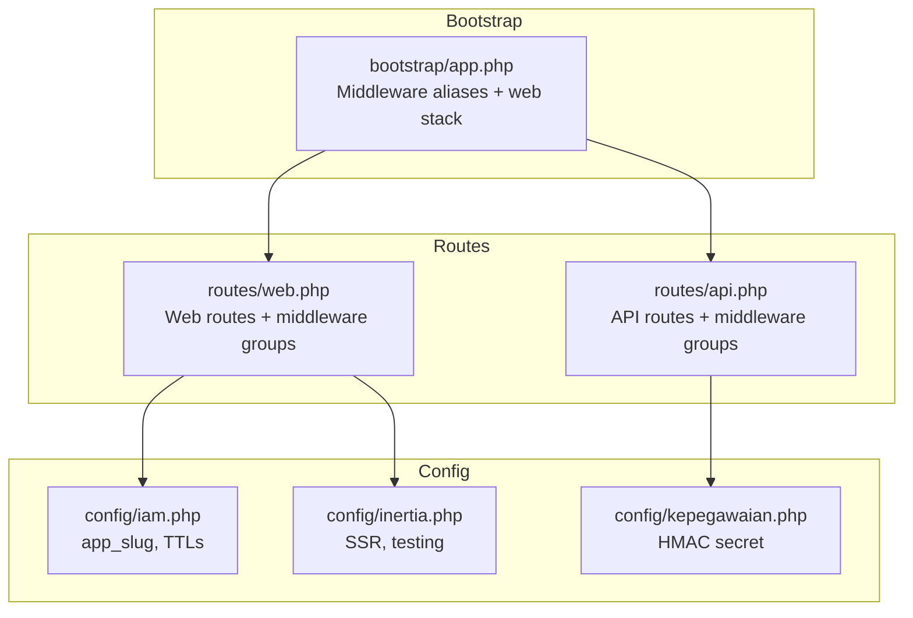
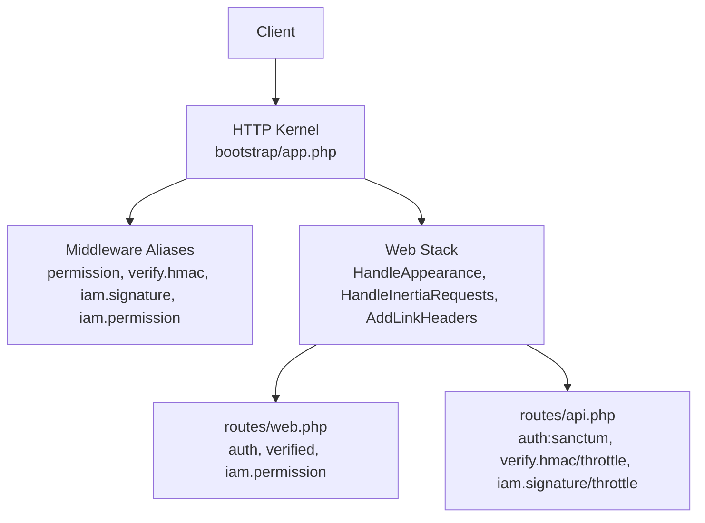
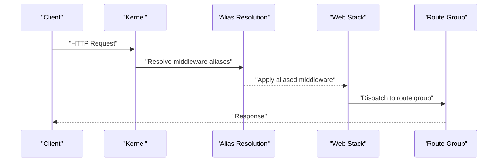
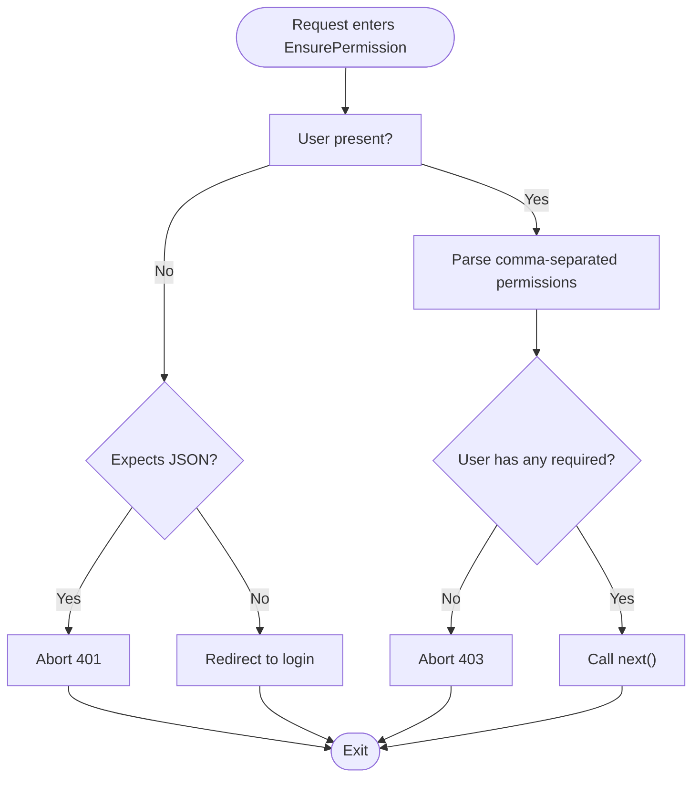
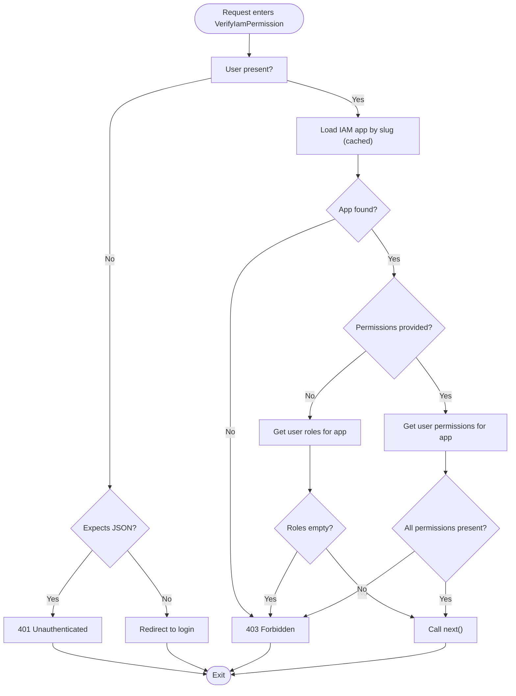
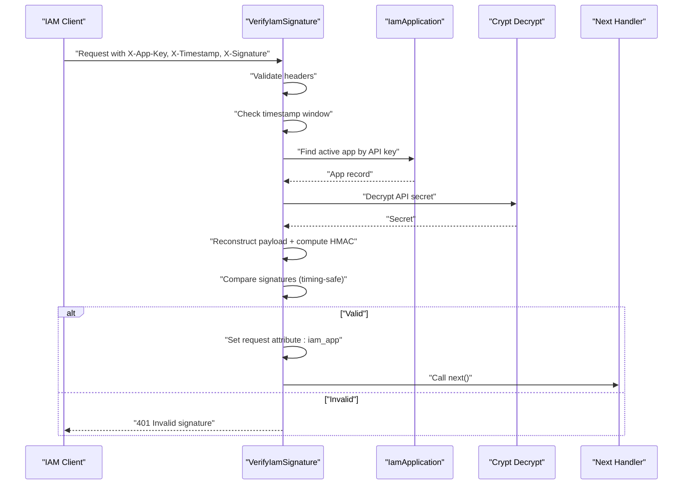
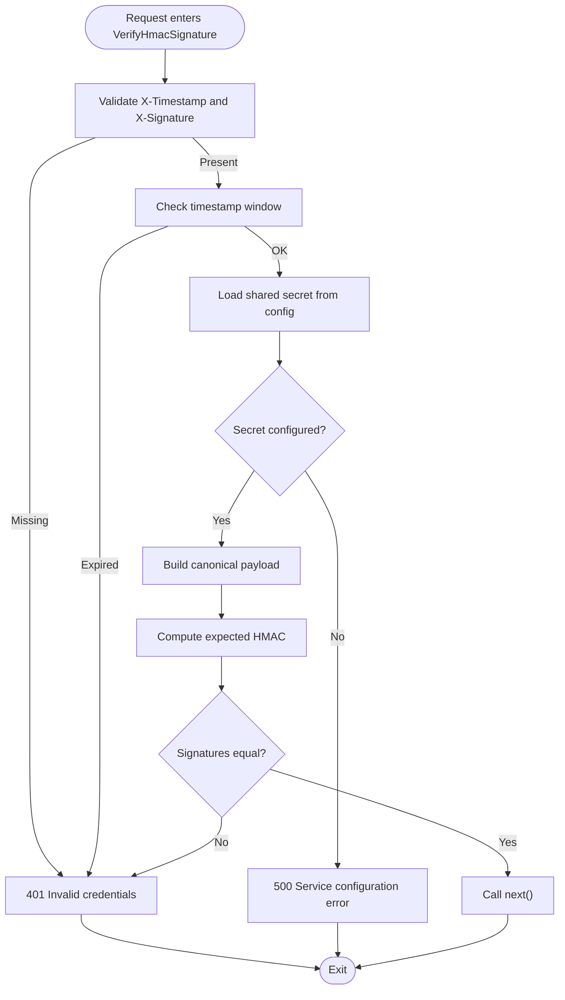
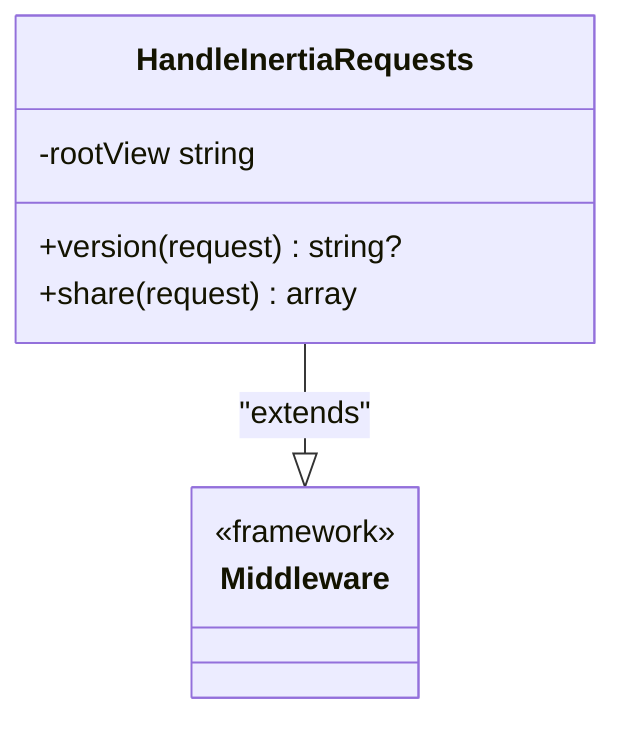
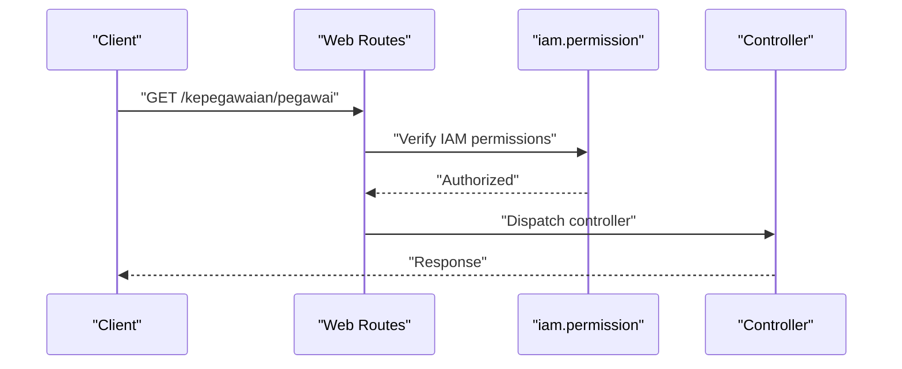
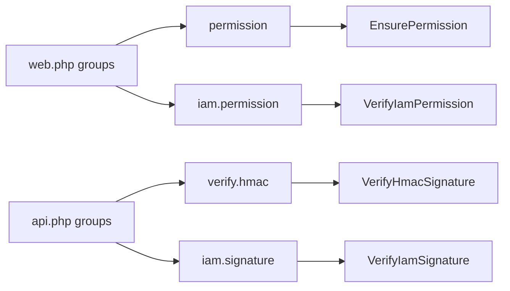

# Middleware Integration

<cite>
**Referenced Files in This Document**
- [EnsurePermission.php](file://app/Http/Middleware/EnsurePermission.php)
- [HandleInertiaRequests.php](file://app/Http/Middleware/HandleInertiaRequests.php)
- [VerifyIamPermission.php](file://app/Http/Middleware/VerifyIamPermission.php)
- [VerifyIamSignature.php](file://app/Http/Middleware/VerifyIamSignature.php)
- [VerifyHmacSignature.php](file://app/Http/Middleware/VerifyHmacSignature.php)
- [app.php](file://bootstrap/app.php)
- [web.php](file://routes/web.php)
- [api.php](file://routes/api.php)
- [iam.php](file://config/iam.php)
- [inertia.php](file://config/inertia.php)
- [kepegawaian.php](file://config/kepegawaian.php)
</cite>

## Table of Contents
1. [Introduction](#introduction)
2. [Project Structure](#project-structure)
3. [Core Components](#core-components)
4. [Architecture Overview](#architecture-overview)
5. [Detailed Component Analysis](#detailed-component-analysis)
6. [Dependency Analysis](#dependency-analysis)
7. [Performance Considerations](#performance-considerations)
8. [Troubleshooting Guide](#troubleshooting-guide)
9. [Conclusion](#conclusion)
10. [Appendices](#appendices)

## Introduction
This document explains middleware integration in the Laravel application, focusing on the request processing pipeline, middleware registration, execution order, and patterns for request/response modification. It documents the middleware stack including authorization enforcement via EnsurePermission and VerifyIamPermission, full-stack React integration via HandleInertiaRequests, and IAM verification middlewares. It also covers middleware chaining, conditional execution, error handling, testing approaches, performance considerations, and patterns for developing custom middleware.

## Project Structure
The middleware stack is configured centrally during application bootstrapping and registered as aliases. Route groups apply middleware to specific HTTP domains (web and API). Configuration files define runtime parameters for IAM and Inertia SSR.

**Diagram sources**
- [app.php:18-32](file://bootstrap/app.php#L18-L32)
- [web.php:31-63](file://routes/web.php#L31-L63)
- [api.php:22-47](file://routes/api.php#L22-L47)
- [iam.php:4-8](file://config/iam.php#L4-L8)
- [inertia.php:18-23](file://config/inertia.php#L18-L23)
- [kepegawaian.php:15](file://config/kepegawaian.php#L15)

**Section sources**
- [app.php:18-32](file://bootstrap/app.php#L18-L32)
- [web.php:25-136](file://routes/web.php#L25-L136)
- [api.php:7-47](file://routes/api.php#L7-L47)
- [iam.php:4-8](file://config/iam.php#L4-L8)
- [inertia.php:18-23](file://config/inertia.php#L18-L23)
- [kepegawaian.php:15](file://config/kepegawaian.php#L15)

## Core Components
- EnsurePermission: Authorizes requests based on user permissions. Supports comma-separated permission lists and handles JSON vs HTML responses.
- VerifyIamPermission: IAM-aware authorization that validates user roles/permissions against an application context, with caching and optional parameterized checks.
- VerifyIamSignature: Verifies HMAC signatures for IAM-originated API requests, enforces timestamp windows, and injects application metadata into the request.
- VerifyHmacSignature: Verifies HMAC signatures for third-party integrations (e.g., attendance QR system), with strict timestamp validation and timing-safe comparisons.
- HandleInertiaRequests: Extends the Inertia base middleware to share app-wide data (user roles/permissions, app name, sidebar state) and manage SSR.

These components collectively secure and enrich the request lifecycle for both web and API traffic.

**Section sources**
- [EnsurePermission.php:11-35](file://app/Http/Middleware/EnsurePermission.php#L11-L35)
- [VerifyIamPermission.php:16-52](file://app/Http/Middleware/VerifyIamPermission.php#L16-L52)
- [VerifyIamSignature.php:15-59](file://app/Http/Middleware/VerifyIamSignature.php#L15-L59)
- [VerifyHmacSignature.php:25-63](file://app/Http/Middleware/VerifyHmacSignature.php#L25-L63)
- [HandleInertiaRequests.php:17-43](file://app/Http/Middleware/HandleInertiaRequests.php#L17-L43)

## Architecture Overview
The middleware stack is registered as aliases and appended to the web stack. Route groups attach middleware to specific paths. API routes enforce layered security (Sanctum, signature verification, throttling). Web routes enforce authentication, email verification, and IAM permissions.

**Diagram sources**
- [app.php:18-32](file://bootstrap/app.php#L18-L32)
- [web.php:31-136](file://routes/web.php#L31-L136)
- [api.php:22-47](file://routes/api.php#L22-L47)

## Detailed Component Analysis

### Middleware Registration and Execution Order
- Aliases: permission, verify.hmac, iam.signature, iam.permission are registered for convenient use in route definitions.
- Web stack: HandleAppearance, HandleInertiaRequests, and asset preloading headers are appended to the web stack.
- Execution order: Middleware runs in the order defined in the stack and per route group. Route groups can prepend or append middleware to alter order for specific paths.

**Diagram sources**
- [app.php:19-32](file://bootstrap/app.php#L19-L32)
- [web.php:31-63](file://routes/web.php#L31-L63)
- [api.php:22-47](file://routes/api.php#L22-L47)

**Section sources**
- [app.php:18-32](file://bootstrap/app.php#L18-L32)
- [web.php:31-136](file://routes/web.php#L31-L136)
- [api.php:22-47](file://routes/api.php#L22-L47)

### EnsurePermission: Authorization Enforcement
- Purpose: Enforce permission-based access control for authenticated users.
- Behavior:
  - Rejects unauthenticated users with JSON 401 or redirects to login.
  - Accepts comma-delimited permission lists; trims and filters empty entries.
  - Denies access with 403 if user lacks any required permission.
  - Continues pipeline otherwise.

**Diagram sources**
- [EnsurePermission.php:11-35](file://app/Http/Middleware/EnsurePermission.php#L11-L35)

**Section sources**
- [EnsurePermission.php:11-35](file://app/Http/Middleware/EnsurePermission.php#L11-L35)
- [web.php:114](file://routes/web.php#L114)

### VerifyIamPermission: IAM-Aware Authorization
- Purpose: Enforce IAM-based permissions for application contexts.
- Behavior:
  - Rejects unauthenticated users with JSON 401 or redirects to login.
  - Resolves target application by slug with cached lookup.
  - Without parameters: ensures user belongs to the application (role exists).
  - With parameters: verifies user has all specified permissions.
  - Continues pipeline otherwise.

**Diagram sources**
- [VerifyIamPermission.php:16-52](file://app/Http/Middleware/VerifyIamPermission.php#L16-L52)
- [iam.php:7](file://config/iam.php#L7)

**Section sources**
- [VerifyIamPermission.php:16-52](file://app/Http/Middleware/VerifyIamPermission.php#L16-L52)
- [iam.php:7](file://config/iam.php#L7)
- [web.php:35](file://routes/web.php#L35)

### VerifyIamSignature: IAM Request Integrity
- Purpose: Verify HMAC-SHA256 signatures for IAM-originated API requests.
- Behavior:
  - Validates presence of X-App-Key, X-Timestamp, X-Signature headers.
  - Enforces timestamp window to prevent replay attacks.
  - Loads active application by API key and decrypts secret.
  - Reconstructs canonical payload and compares HMAC digest using timing-safe comparison.
  - Injects resolved application into request attributes for downstream handlers.

**Diagram sources**
- [VerifyIamSignature.php:15-59](file://app/Http/Middleware/VerifyIamSignature.php#L15-L59)

**Section sources**
- [VerifyIamSignature.php:15-59](file://app/Http/Middleware/VerifyIamSignature.php#L15-L59)
- [api.php:43-47](file://routes/api.php#L43-L47)

### VerifyHmacSignature: Third-Party Integration
- Purpose: Verify HMAC-SHA256 signatures for external systems (e.g., attendance QR system).
- Behavior:
  - Validates presence of X-Timestamp and X-Signature headers.
  - Enforces timestamp window to prevent replay attacks.
  - Retrieves shared secret from configuration and reconstructs payload.
  - Computes expected HMAC and compares using timing-safe comparison.
  - Continues pipeline otherwise.

**Diagram sources**
- [VerifyHmacSignature.php:25-63](file://app/Http/Middleware/VerifyHmacSignature.php#L25-L63)
- [kepegawaian.php:15](file://config/kepegawaian.php#L15)

**Section sources**
- [VerifyHmacSignature.php:25-63](file://app/Http/Middleware/VerifyHmacSignature.php#L25-L63)
- [api.php:22-31](file://routes/api.php#L22-L31)
- [kepegawaian.php:15](file://config/kepegawaian.php#L15)

### HandleInertiaRequests: Full-Stack React Integration
- Purpose: Share authenticated user data, roles, permissions, and UI preferences with frontend.
- Behavior:
  - Extends Inertia base middleware.
  - Shares app name, user profile, roles, flattened permissions, and sidebar state.
  - Manages SSR configuration and asset preloading headers.

**Diagram sources**
- [HandleInertiaRequests.php:8-43](file://app/Http/Middleware/HandleInertiaRequests.php#L8-L43)

**Section sources**
- [HandleInertiaRequests.php:17-43](file://app/Http/Middleware/HandleInertiaRequests.php#L17-L43)
- [inertia.php:18-23](file://config/inertia.php#L18-L23)
- [app.php:28-32](file://bootstrap/app.php#L28-L32)

### Route-Level Middleware Chaining and Conditional Execution
- Web routes:
  - General authenticated dashboards require auth and verified.
  - Protected CRUD routes require auth, verified, and iam.permission.
  - IAM admin routes require auth, verified, and iam.permission with explicit permission slug.
- API routes:
  - Attendance integration requires auth:sanctum, verify.hmac, and throttle.
  - IAM validation/logout endpoints require auth:sanctum and iam.signature with throttle.
  - SSO exchange endpoint requires iam.signature and throttle.

**Diagram sources**
- [web.php:35-63](file://routes/web.php#L35-L63)
- [web.php:114](file://routes/web.php#L114)

**Section sources**
- [web.php:31-136](file://routes/web.php#L31-L136)
- [api.php:22-47](file://routes/api.php#L22-L47)

## Dependency Analysis
- Alias-to-class mapping:
  - permission → EnsurePermission
  - verify.hmac → VerifyHmacSignature
  - iam.signature → VerifyIamSignature
  - iam.permission → VerifyIamPermission
- Route dependencies:
  - Web routes depend on auth, email verification, and IAM permission middleware.
  - API routes depend on Sanctum, signature verification, and throttling.
- Configuration dependencies:
  - VerifyIamPermission depends on IAM app slug from config.
  - VerifyHmacSignature depends on shared secret from config.
  - HandleInertiaRequests depends on Inertia SSR configuration.

**Diagram sources**
- [app.php:19-24](file://bootstrap/app.php#L19-L24)
- [web.php:31-136](file://routes/web.php#L31-L136)
- [api.php:22-47](file://routes/api.php#L22-L47)

**Section sources**
- [app.php:19-24](file://bootstrap/app.php#L19-L24)
- [web.php:31-136](file://routes/web.php#L31-L136)
- [api.php:22-47](file://routes/api.php#L22-L47)

## Performance Considerations
- Caching:
  - VerifyIamPermission caches the IAM application lookup for one hour to reduce database queries.
- Asset preloading:
  - AddLinkHeadersForPreloadedAssets reduces initial load latency for assets.
- Throttling:
  - API endpoints apply rate limits to mitigate abuse and protect backend resources.
- SSR:
  - Inertia SSR can improve perceived performance for initial page loads; ensure SSR bundle availability and health checks.

**Section sources**
- [VerifyIamPermission.php:27-30](file://app/Http/Middleware/VerifyIamPermission.php#L27-L30)
- [app.php:31](file://bootstrap/app.php#L31)
- [api.php:22](file://routes/api.php#L22)
- [inertia.php:18-23](file://config/inertia.php#L18-L23)

## Troubleshooting Guide
- 401 Unauthorized:
  - Ensure proper authentication (auth or Sanctum) and required headers (X-Timestamp, X-Signature, X-App-Key).
  - Verify timestamp freshness within allowed window.
- 403 Forbidden:
  - Confirm user has required permissions or belongs to the IAM application when no permissions are specified.
- 500 Service configuration error:
  - Check that the shared secret is configured for external HMAC verification.
- Redirect loops:
  - Ensure auth middleware precedes permission middleware in route groups.
- Frontend data missing:
  - Verify HandleInertiaRequests shares user roles/permissions and SSR settings.

**Section sources**
- [VerifyIamSignature.php:21-27](file://app/Http/Middleware/VerifyIamSignature.php#L21-L27)
- [VerifyHmacSignature.php:35-44](file://app/Http/Middleware/VerifyHmacSignature.php#L35-L44)
- [VerifyIamPermission.php:32-34](file://app/Http/Middleware/VerifyIamPermission.php#L32-L34)
- [kepegawaian.php:15](file://config/kepegawaian.php#L15)
- [HandleInertiaRequests.php:17-43](file://app/Http/Middleware/HandleInertiaRequests.php#L17-L43)

## Conclusion
The middleware stack integrates robust authorization, signature verification, and full-stack React support. Aliases simplify route configuration, while route groups enable fine-grained control over middleware chaining. IAM-specific middlewares enforce contextual permissions and integrity, and Inertia middleware streamlines frontend integration. Proper configuration and caching yield strong security and performance characteristics.

## Appendices
- Middleware testing approaches:
  - Use Laravel’s routing and middleware testing helpers to assert middleware behavior.
  - Mock request headers (e.g., X-Timestamp, X-Signature) and verify responses.
  - Test permission checks by simulating user roles and permissions.
  - Validate SSR sharing by asserting shared data in responses.
- Custom middleware development patterns:
  - Keep middleware single-responsibility and composable.
  - Use configuration files for secrets and slugs.
  - Apply caching for expensive lookups.
  - Prefer timing-safe comparisons and strict header validation.