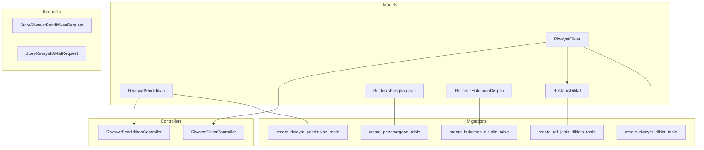
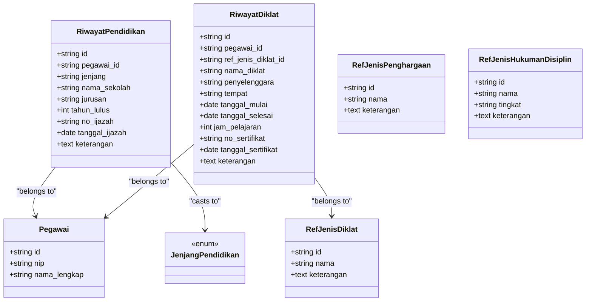
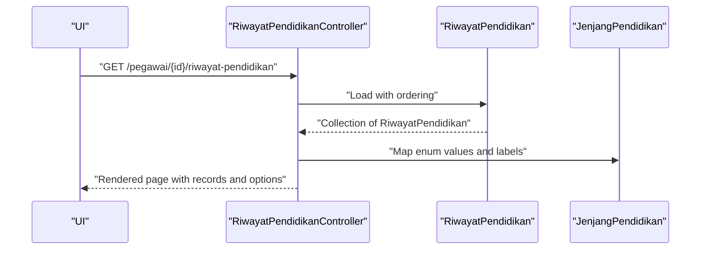
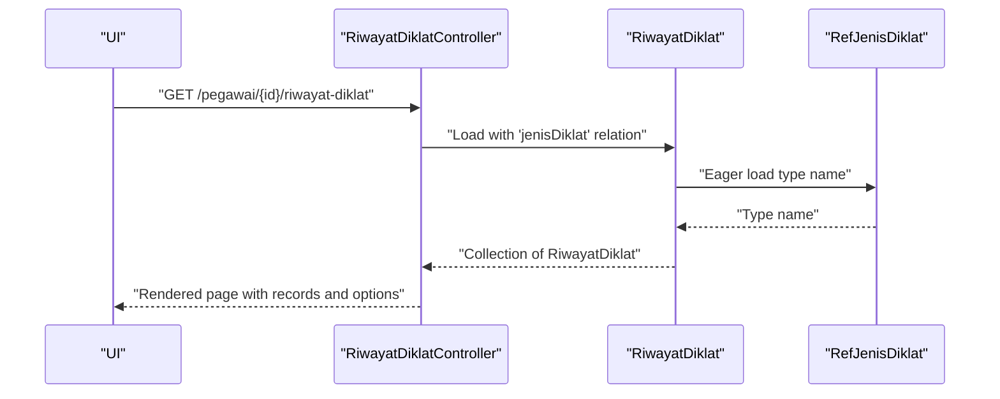
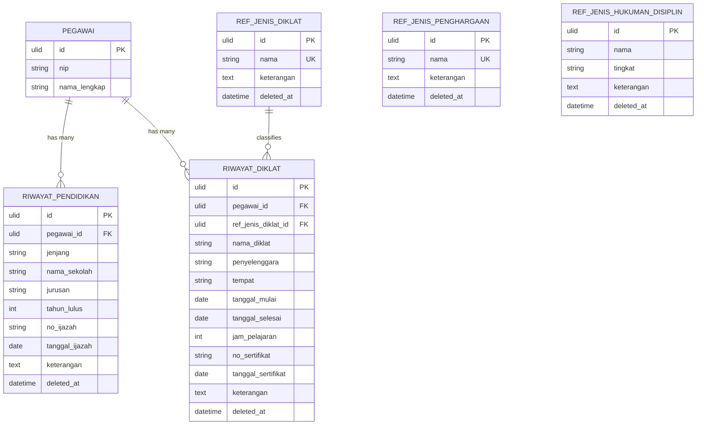
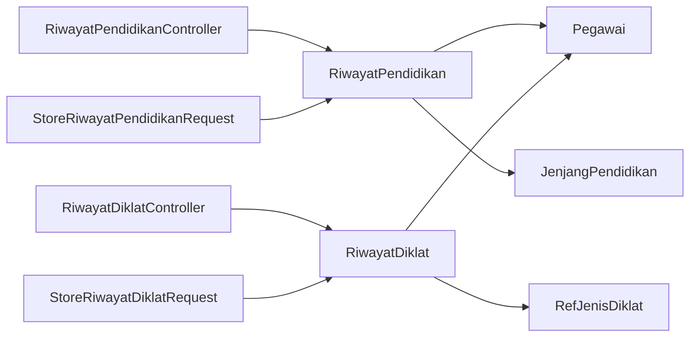

# Academic Records

<cite>
**Referenced Files in This Document**
- [RiwayatPendidikan.php](file://app/Models/RiwayatPendidikan.php)
- [RiwayatDiklat.php](file://app/Models/RiwayatDiklat.php)
- [RefJenisDiklat.php](file://app/Models/RefJenisDiklat.php)
- [RefJenisPenghargaan.php](file://app/Models/RefJenisPenghargaan.php)
- [RefJenisHukumanDisiplin.php](file://app/Models/RefJenisHukumanDisiplin.php)
- [JenjangPendidikan.php](file://app/Enums/JenjangPendidikan.php)
- [RiwayatPendidikanController.php](file://app/Http/Controllers/Kepegawaian/RiwayatPendidikanController.php)
- [RiwayatDiklatController.php](file://app/Http/Controllers/Kepegawaian/RiwayatDiklatController.php)
- [StoreRiwayatPendidikanRequest.php](file://app/Http/Requests/Kepegawaian/StoreRiwayatPendidikanRequest.php)
- [StoreRiwayatDiklatRequest.php](file://app/Http/Requests/Kepegawaian/StoreRiwayatDiklatRequest.php)
- [2026_03_15_030821_create_riwayat_pendidikan_table.php](file://database/migrations/2026_03_15_030821_create_riwayat_pendidikan_table.php)
- [2026_03_15_030915_create_riwayat_diklat_table.php](file://database/migrations/2026_03_15_030915_create_riwayat_diklat_table.php)
- [2026_03_15_022210_create_ref_jenis_diklats_table.php](file://database/migrations/2026_03_15_022210_create_ref_jenis_diklats_table.php)
- [2026_03_15_032747_create_penghargaan_table.php](file://database/migrations/2026_03_15_032747_create_penghargaan_table.php)
- [2026_03_15_032715_create_hukuman_disiplin_table.php](file://database/migrations/2026_03_15_032715_create_hukuman_disiplin_table.php)
</cite>

## Table of Contents
1. [Introduction](#introduction)
2. [Project Structure](#project-structure)
3. [Core Components](#core-components)
4. [Architecture Overview](#architecture-overview)
5. [Detailed Component Analysis](#detailed-component-analysis)
6. [Dependency Analysis](#dependency-analysis)
7. [Performance Considerations](#performance-considerations)
8. [Troubleshooting Guide](#troubleshooting-guide)
9. [Conclusion](#conclusion)
10. [Appendices](#appendices)

## Introduction
This document provides a comprehensive data model specification for Academic Records within the Educational and Training Management domain. It focuses on:
- Formal education history via RiwayatPendidikan
- Professional training and courses via RiwayatDiklat
- Reference models RefJenisDiklat, RefJenisPenghargaan, and RefJenisHukumanDisiplin
It explains field definitions, qualification types, classification hierarchies, and relationship patterns with employee profiles. It also documents validation rules for educational credentials, training completion tracking, and certification management, and includes practical examples for querying educational history and training completion status.

## Project Structure
The Academic Records module spans models, controllers, form requests, migrations, and enums. The structure follows Laravel conventions:
- Models define Eloquent relationships and attribute casting
- Controllers orchestrate UI rendering and persistence
- Form requests encapsulate validation rules
- Migrations define relational schemas
- Enums standardize classification values

**Diagram sources**
- [RiwayatPendidikan.php:11-41](file://app/Models/RiwayatPendidikan.php#L11-L41)
- [RiwayatDiklat.php:10-50](file://app/Models/RiwayatDiklat.php#L10-L50)
- [RefJenisDiklat.php:10-28](file://app/Models/RefJenisDiklat.php#L10-L28)
- [RefJenisPenghargaan.php:10-28](file://app/Models/RefJenisPenghargaan.php#L10-L28)
- [RefJenisHukumanDisiplin.php:10-29](file://app/Models/RefJenisHukumanDisiplin.php#L10-L29)
- [RiwayatPendidikanController.php:16-92](file://app/Http/Controllers/Kepegawaian/RiwayatPendidikanController.php#L16-L92)
- [RiwayatDiklatController.php:16-91](file://app/Http/Controllers/Kepegawaian/RiwayatDiklatController.php#L16-L91)
- [StoreRiwayatPendidikanRequest.php:10-52](file://app/Http/Requests/Kepegawaian/StoreRiwayatPendidikanRequest.php#L10-L52)
- [StoreRiwayatDiklatRequest.php:8-48](file://app/Http/Requests/Kepegawaian/StoreRiwayatDiklatRequest.php#L8-L48)
- [2026_03_15_030821_create_riwayat_pendidikan_table.php:7-36](file://database/migrations/2026_03_15_030821_create_riwayat_pendidikan_table.php#L7-L36)
- [2026_03_15_030915_create_riwayat_diklat_table.php:7-39](file://database/migrations/2026_03_15_030915_create_riwayat_diklat_table.php#L7-L39)
- [2026_03_15_022210_create_ref_jenis_diklats_table.php:7-30](file://database/migrations/2026_03_15_022210_create_ref_jenis_diklats_table.php#L7-L30)
- [2026_03_15_032747_create_penghargaan_table.php:7-35](file://database/migrations/2026_03_15_032747_create_penghargaan_table.php#L7-L35)
- [2026_03_15_032715_create_hukuman_disiplin_table.php:7-37](file://database/migrations/2026_03_15_032715_create_hukuman_disiplin_table.php#L7-L37)

**Section sources**
- [RiwayatPendidikan.php:11-41](file://app/Models/RiwayatPendidikan.php#L11-L41)
- [RiwayatDiklat.php:10-50](file://app/Models/RiwayatDiklat.php#L10-L50)
- [RefJenisDiklat.php:10-28](file://app/Models/RefJenisDiklat.php#L10-L28)
- [RefJenisPenghargaan.php:10-28](file://app/Models/RefJenisPenghargaan.php#L10-L28)
- [RefJenisHukumanDisiplin.php:10-29](file://app/Models/RefJenisHukumanDisiplin.php#L10-L29)
- [RiwayatPendidikanController.php:16-92](file://app/Http/Controllers/Kepegawaian/RiwayatPendidikanController.php#L16-L92)
- [RiwayatDiklatController.php:16-91](file://app/Http/Controllers/Kepegawaian/RiwayatDiklatController.php#L16-L91)
- [StoreRiwayatPendidikanRequest.php:10-52](file://app/Http/Requests/Kepegawaian/StoreRiwayatPendidikanRequest.php#L10-L52)
- [StoreRiwayatDiklatRequest.php:8-48](file://app/Http/Requests/Kepegawaian/StoreRiwayatDiklatRequest.php#L8-L48)
- [2026_03_15_030821_create_riwayat_pendidikan_table.php:7-36](file://database/migrations/2026_03_15_030821_create_riwayat_pendidikan_table.php#L7-L36)
- [2026_03_15_030915_create_riwayat_diklat_table.php:7-39](file://database/migrations/2026_03_15_030915_create_riwayat_diklat_table.php#L7-L39)
- [2026_03_15_022210_create_ref_jenis_diklats_table.php:7-30](file://database/migrations/2026_03_15_022210_create_ref_jenis_diklats_table.php#L7-L30)
- [2026_03_15_032747_create_penghargaan_table.php:7-35](file://database/migrations/2026_03_15_032747_create_penghargaan_table.php#L7-L35)
- [2026_03_15_032715_create_hukuman_disiplin_table.php:7-37](file://database/migrations/2026_03_15_032715_create_hukuman_disiplin_table.php#L7-L37)

## Core Components
This section defines the primary entities and their responsibilities:
- RiwayatPendidikan: Stores formal education history per employee
- RiwayatDiklat: Stores professional training and course records per employee
- RefJenisDiklat: Classifies types of training/courses
- RefJenisPenghargaan: Classifies awards/honors
- RefJenisHukumanDisiplin: Classifies disciplinary sanctions

Key characteristics:
- All models use ULIDs as primary keys and support soft deletes
- RiwayatDiklat optionally references RefJenisDiklat
- RiwayatPendidikan references an enum for educational level
- Controllers handle UI rendering and persistence for both records
- Form requests enforce validation rules for creation and updates

**Section sources**
- [RiwayatPendidikan.php:11-41](file://app/Models/RiwayatPendidikan.php#L11-L41)
- [RiwayatDiklat.php:10-50](file://app/Models/RiwayatDiklat.php#L10-L50)
- [RefJenisDiklat.php:10-28](file://app/Models/RefJenisDiklat.php#L10-L28)
- [RefJenisPenghargaan.php:10-28](file://app/Models/RefJenisPenghargaan.php#L10-L28)
- [RefJenisHukumanDisiplin.php:10-29](file://app/Models/RefJenisHukumanDisiplin.php#L10-L29)
- [JenjangPendidikan.php:5-33](file://app/Enums/JenjangPendidikan.php#L5-L33)
- [RiwayatPendidikanController.php:16-92](file://app/Http/Controllers/Kepegawaian/RiwayatPendidikanController.php#L16-L92)
- [RiwayatDiklatController.php:16-91](file://app/Http/Controllers/Kepegawaian/RiwayatDiklatController.php#L16-L91)
- [StoreRiwayatPendidikanRequest.php:10-52](file://app/Http/Requests/Kepegawaian/StoreRiwayatPendidikanRequest.php#L10-L52)
- [StoreRiwayatDiklatRequest.php:8-48](file://app/Http/Requests/Kepegawaian/StoreRiwayatDiklatRequest.php#L8-L48)

## Architecture Overview
The Academic Records architecture centers around employee-centric records with shared reference classifications. The controllers load related data, apply ordering, and expose it to the UI. Validation ensures data integrity during creation and updates.

**Diagram sources**
- [RiwayatPendidikan.php:11-41](file://app/Models/RiwayatPendidikan.php#L11-L41)
- [RiwayatDiklat.php:10-50](file://app/Models/RiwayatDiklat.php#L10-L50)
- [RefJenisDiklat.php:10-28](file://app/Models/RefJenisDiklat.php#L10-L28)
- [RefJenisPenghargaan.php:10-28](file://app/Models/RefJenisPenghargaan.php#L10-L28)
- [RefJenisHukumanDisiplin.php:10-29](file://app/Models/RefJenisHukumanDisiplin.php#L10-L29)
- [JenjangPendidikan.php:5-33](file://app/Enums/JenjangPendidikan.php#L5-L33)

## Detailed Component Analysis

### RiwayatPendidikan (Formal Education History)
Purpose:
- Capture and manage an employee’s formal education timeline

Fields and types:
- Educational level: Enumerated classification mapped to a string value
- School name: Required string
- Major/department: Optional string
- Graduation year: Required integer with 4-digit validation and year range
- Certificate number: Optional string
- Certificate date: Optional date
- Notes: Optional text

Relationships:
- Belongs to Pegawai
- Uses enum casting for educational level

Validation rules:
- Educational level is required and must be a valid enum value
- School name is required and limited to 255 characters
- Major is optional and limited to 255 characters
- Graduation year is required, must be a 4-digit integer, and within a reasonable range
- Certificate date must be a valid date if provided
- Notes are optional text

Ordering and presentation:
- Sorted by descending graduation year, certificate date, and creation timestamp

Example queries:
- Retrieve latest education record per employee
- List all education entries ordered by most recent graduation date

**Diagram sources**
- [RiwayatPendidikanController.php:18-60](file://app/Http/Controllers/Kepegawaian/RiwayatPendidikanController.php#L18-L60)
- [RiwayatPendidikan.php:28-35](file://app/Models/RiwayatPendidikan.php#L28-L35)
- [JenjangPendidikan.php:5-33](file://app/Enums/JenjangPendidikan.php#L5-L33)

**Section sources**
- [RiwayatPendidikan.php:11-41](file://app/Models/RiwayatPendidikan.php#L11-L41)
- [StoreRiwayatPendidikanRequest.php:25-36](file://app/Http/Requests/Kepegawaian/StoreRiwayatPendidikanRequest.php#L25-L36)
- [2026_03_15_030821_create_riwayat_pendidikan_table.php:14-26](file://database/migrations/2026_03_15_030821_create_riwayat_pendidikan_table.php#L14-L26)
- [RiwayatPendidikanController.php:22-59](file://app/Http/Controllers/Kepegawaian/RiwayatPendidikanController.php#L22-L59)

### RiwayatDiklat (Professional Training and Courses)
Purpose:
- Track professional development activities and certifications

Fields and types:
- Training type: Optional foreign key to RefJenisDiklat
- Training name: Required string
- Organizer: Required string
- Venue: Optional string
- Start date: Required date
- End date: Required date, must be after or equal to start date
- Hours: Optional integer, minimum 1
- Certificate number: Optional string (up to 100 characters)
- Certificate date: Optional date
- Notes: Optional text

Relationships:
- Belongs to Pegawai
- Optionally belongs to RefJenisDiklat

Validation rules:
- Training type must reference a valid RefJenisDiklat if provided
- Name and organizer are required and limited to 255 characters
- Venue is optional and limited to 255 characters
- Start date is required
- End date is required and must be on or after start date
- Hours must be a positive integer if provided
- Certificate number is optional and limited to 100 characters
- Certificate date must be a valid date if provided
- Notes are optional text

Presentation:
- Includes training type name via eager-loaded relation

Example queries:
- List all training records for an employee ordered by start date
- Filter by training type or completion date range

**Diagram sources**
- [RiwayatDiklatController.php:18-58](file://app/Http/Controllers/Kepegawaian/RiwayatDiklatController.php#L18-L58)
- [RiwayatDiklat.php:46-49](file://app/Models/RiwayatDiklat.php#L46-L49)

**Section sources**
- [RiwayatDiklat.php:10-50](file://app/Models/RiwayatDiklat.php#L10-L50)
- [StoreRiwayatDiklatRequest.php:20-34](file://app/Http/Requests/Kepegawaian/StoreRiwayatDiklatRequest.php#L20-L34)
- [2026_03_15_030915_create_riwayat_diklat_table.php:14-29](file://database/migrations/2026_03_15_030915_create_riwayat_diklat_table.php#L14-L29)
- [RiwayatDiklatController.php:22-58](file://app/Http/Controllers/Kepegawaian/RiwayatDiklatController.php#L22-L58)

### Reference Models

#### RefJenisDiklat (Training/Course Classification)
Purpose:
- Provide standardized categories for training and courses

Fields:
- Name: Unique string identifier
- Description: Optional text

Usage:
- RiwayatDiklat optionally references this classification

Constraints:
- Name uniqueness enforced at the database level

**Section sources**
- [RefJenisDiklat.php:10-28](file://app/Models/RefJenisDiklat.php#L10-L28)
- [2026_03_15_022210_create_ref_jenis_diklats_table.php:14-20](file://database/migrations/2026_03_15_022210_create_ref_jenis_diklats_table.php#L14-L20)
- [RiwayatDiklat.php:46-49](file://app/Models/RiwayatDiklat.php#L46-L49)

#### RefJenisPenghargaan (Award/Honor Classification)
Purpose:
- Standardize award and honor categorization

Fields:
- Name: Unique string identifier
- Description: Optional text

Usage:
- Supports awards management in the broader personnel system

Constraints:
- Name uniqueness enforced at the database level

**Section sources**
- [RefJenisPenghargaan.php:10-28](file://app/Models/RefJenisPenghargaan.php#L10-L28)
- [2026_03_15_032747_create_penghargaan_table.php:14-20](file://database/migrations/2026_03_15_032747_create_penghargaan_table.php#L14-L20)

#### RefJenisHukumanDisiplin (Disciplinary Sanction Classification)
Purpose:
- Standardize disciplinary sanction categorization

Fields:
- Name: String identifier
- Level: String indicating severity or category
- Description: Optional text

Usage:
- Supports discipline records in the broader personnel system

**Section sources**
- [RefJenisHukumanDisiplin.php:10-29](file://app/Models/RefJenisHukumanDisiplin.php#L10-L29)
- [2026_03_15_032715_create_hukuman_disiplin_table.php:14-21](file://database/migrations/2026_03_15_032715_create_hukuman_disiplin_table.php#L14-L21)

### Data Model Definitions and Relationships

**Diagram sources**
- [2026_03_15_030821_create_riwayat_pendidikan_table.php:14-26](file://database/migrations/2026_03_15_030821_create_riwayat_pendidikan_table.php#L14-L26)
- [2026_03_15_030915_create_riwayat_diklat_table.php:14-29](file://database/migrations/2026_03_15_030915_create_riwayat_diklat_table.php#L14-L29)
- [2026_03_15_022210_create_ref_jenis_diklats_table.php:14-20](file://database/migrations/2026_03_15_022210_create_ref_jenis_diklats_table.php#L14-L20)
- [2026_03_15_032747_create_penghargaan_table.php:14-20](file://database/migrations/2026_03_15_032747_create_penghargaan_table.php#L14-L20)
- [2026_03_15_032715_create_hukuman_disiplin_table.php:14-21](file://database/migrations/2026_03_15_032715_create_hukuman_disiplin_table.php#L14-L21)

## Dependency Analysis
- RiwayatPendidikan depends on:
  - Pegawai (employee profile)
  - JenjangPendidikan enum (classification)
- RiwayatDiklat depends on:
  - Pegawai (employee profile)
  - RefJenisDiklat (optional classification)
- Controllers depend on:
  - Models for data access
  - Form requests for validation
  - Gate policies for authorization
- Migrations define:
  - Foreign key constraints with cascade and null-on-delete behavior
  - Unique constraints for reference names

**Diagram sources**
- [RiwayatPendidikan.php:37-40](file://app/Models/RiwayatPendidikan.php#L37-L40)
- [RiwayatDiklat.php:41-49](file://app/Models/RiwayatDiklat.php#L41-L49)
- [RiwayatPendidikanController.php:6-14](file://app/Http/Controllers/Kepegawaian/RiwayatPendidikanController.php#L6-L14)
- [RiwayatDiklatController.php:5-14](file://app/Http/Controllers/Kepegawaian/RiwayatDiklatController.php#L5-L14)
- [StoreRiwayatPendidikanRequest.php:10-52](file://app/Http/Requests/Kepegawaian/StoreRiwayatPendidikanRequest.php#L10-L52)
- [StoreRiwayatDiklatRequest.php:8-48](file://app/Http/Requests/Kepegawaian/StoreRiwayatDiklatRequest.php#L8-L48)

**Section sources**
- [RiwayatPendidikan.php:11-41](file://app/Models/RiwayatPendidikan.php#L11-L41)
- [RiwayatDiklat.php:10-50](file://app/Models/RiwayatDiklat.php#L10-L50)
- [RiwayatPendidikanController.php:16-92](file://app/Http/Controllers/Kepegawaian/RiwayatPendidikanController.php#L16-L92)
- [RiwayatDiklatController.php:16-91](file://app/Http/Controllers/Kepegawaian/RiwayatDiklatController.php#L16-L91)
- [StoreRiwayatPendidikanRequest.php:10-52](file://app/Http/Requests/Kepegawaian/StoreRiwayatPendidikanRequest.php#L10-L52)
- [StoreRiwayatDiklatRequest.php:8-48](file://app/Http/Requests/Kepegawaian/StoreRiwayatDiklatRequest.php#L8-L48)

## Performance Considerations
- Indexing recommendations:
  - Add indexes on foreign keys (pegawai_id, ref_jenis_diklat_id) for faster joins
  - Consider composite indexes on frequently filtered/sorted columns (e.g., tanggal_mulai, tahun_lulus)
- Eager loading:
  - Controllers already eager-load related data (e.g., jenisDiklat) to avoid N+1 queries
- Pagination:
  - For large datasets, implement pagination in controller actions to limit payload sizes
- Casting:
  - Use attribute casting for dates and integers to reduce manual conversions in controllers

## Troubleshooting Guide
Common validation failures and remedies:
- Educational records
  - Invalid educational level: Ensure the value matches a defined enum
  - Invalid graduation year: Confirm it is a 4-digit number within the allowed range
  - Invalid certificate date: Ensure it is a valid date if provided
- Training records
  - End date before start date: Adjust end date to be on or after start date
  - Invalid training type: Select a valid RefJenisDiklat or leave empty
  - Hours less than 1: Set hours to at least 1 if provided
- Authorization
  - Access denied: Verify the current user has permission to view/update the target employee profile

Operational checks:
- Relationship integrity: Confirm foreign keys reference existing records
- Soft-deleted records: Use appropriate filters to exclude deleted rows when querying
- Ordering consistency: Ensure sorting criteria align with intended display order

**Section sources**
- [StoreRiwayatPendidikanRequest.php:25-51](file://app/Http/Requests/Kepegawaian/StoreRiwayatPendidikanRequest.php#L25-L51)
- [StoreRiwayatDiklatRequest.php:20-47](file://app/Http/Requests/Kepegawaian/StoreRiwayatDiklatRequest.php#L20-L47)
- [RiwayatPendidikanController.php:20-27](file://app/Http/Controllers/Kepegawaian/RiwayatPendidikanController.php#L20-L27)
- [RiwayatDiklatController.php:18-28](file://app/Http/Controllers/Kepegawaian/RiwayatDiklatController.php#L18-L28)

## Conclusion
The Academic Records module provides a robust, validated, and user-friendly system for managing formal education and professional training. Its design leverages strong typing (enums), clear reference classifications, and controller-driven presentation to ensure data integrity and usability. The documented relationships, validations, and examples enable efficient querying and reporting of educational history and training completion status.

## Appendices

### Field Definitions and Validation Rules Summary

- RiwayatPendidikan
  - Educational level: Required enum; must be one of the defined levels
  - School name: Required string, max length 255
  - Major: Optional string, max length 255
  - Graduation year: Required integer, 4 digits, within a valid range
  - Certificate number: Optional string, max length 255
  - Certificate date: Optional date
  - Notes: Optional text

- RiwayatDiklat
  - Training type: Optional foreign key to RefJenisDiklat
  - Training name: Required string, max length 255
  - Organizer: Required string, max length 255
  - Venue: Optional string, max length 255
  - Start date: Required date
  - End date: Required date, must be >= start date
  - Hours: Optional integer, min 1
  - Certificate number: Optional string, max length 100
  - Certificate date: Optional date
  - Notes: Optional text

**Section sources**
- [StoreRiwayatPendidikanRequest.php:25-36](file://app/Http/Requests/Kepegawaian/StoreRiwayatPendidikanRequest.php#L25-L36)
- [StoreRiwayatDiklatRequest.php:20-34](file://app/Http/Requests/Kepegawaian/StoreRiwayatDiklatRequest.php#L20-L34)

### Examples: Querying Academic Records

- Educational history
  - Sort by most recent graduation year, then certificate date, then creation timestamp
  - Retrieve latest education record per employee by taking the first item after applying the sort
  - Filter by school name or major using where clauses

- Training completion status
  - List all training records for an employee ordered by start date
  - Filter by training type using the related type name
  - Compute duration in days using start and end dates

**Section sources**
- [RiwayatPendidikanController.php:22-27](file://app/Http/Controllers/Kepegawaian/RiwayatPendidikanController.php#L22-L27)
- [RiwayatDiklatController.php:29-32](file://app/Http/Controllers/Kepegawaian/RiwayatDiklatController.php#L29-L32)