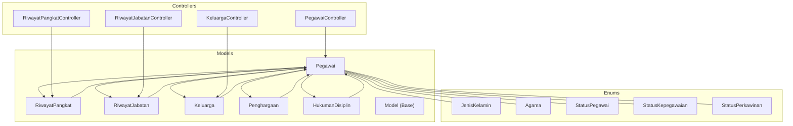
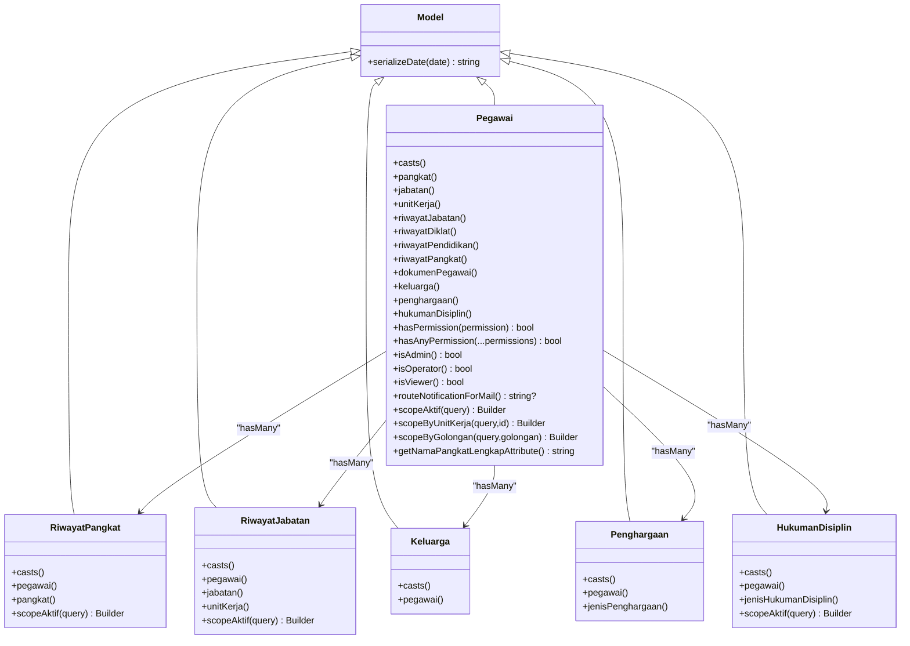
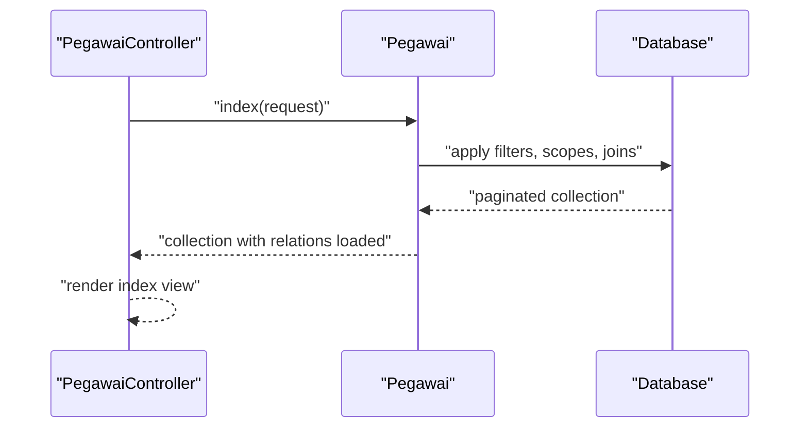
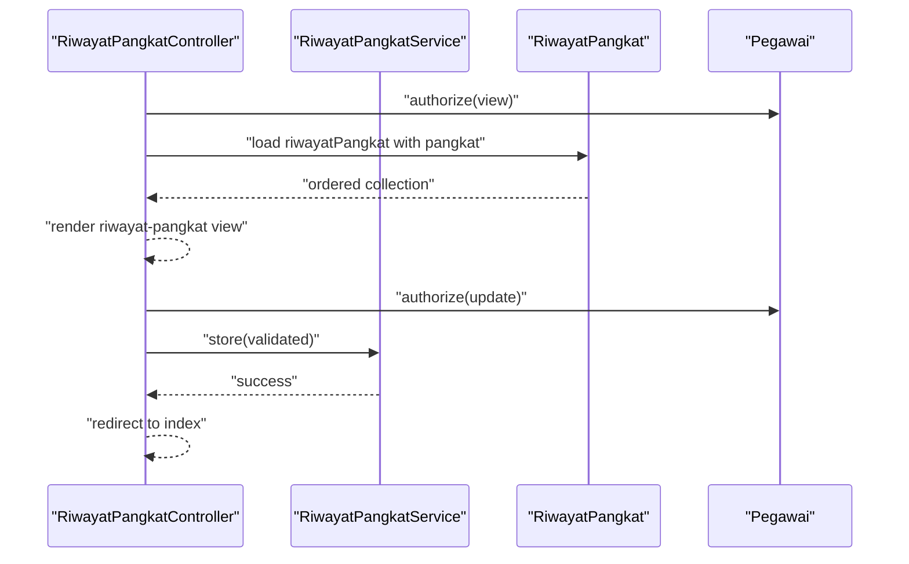
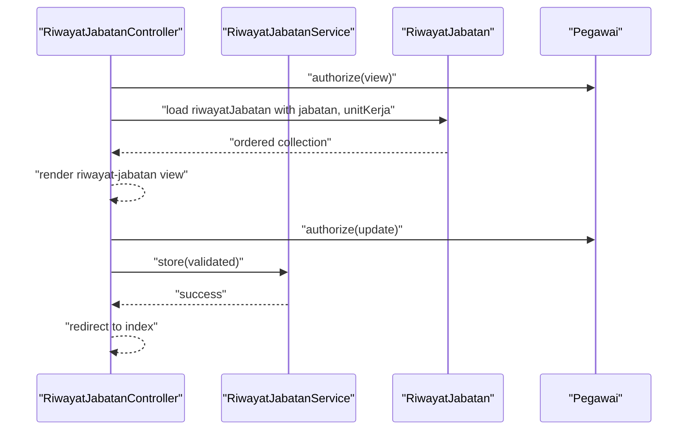
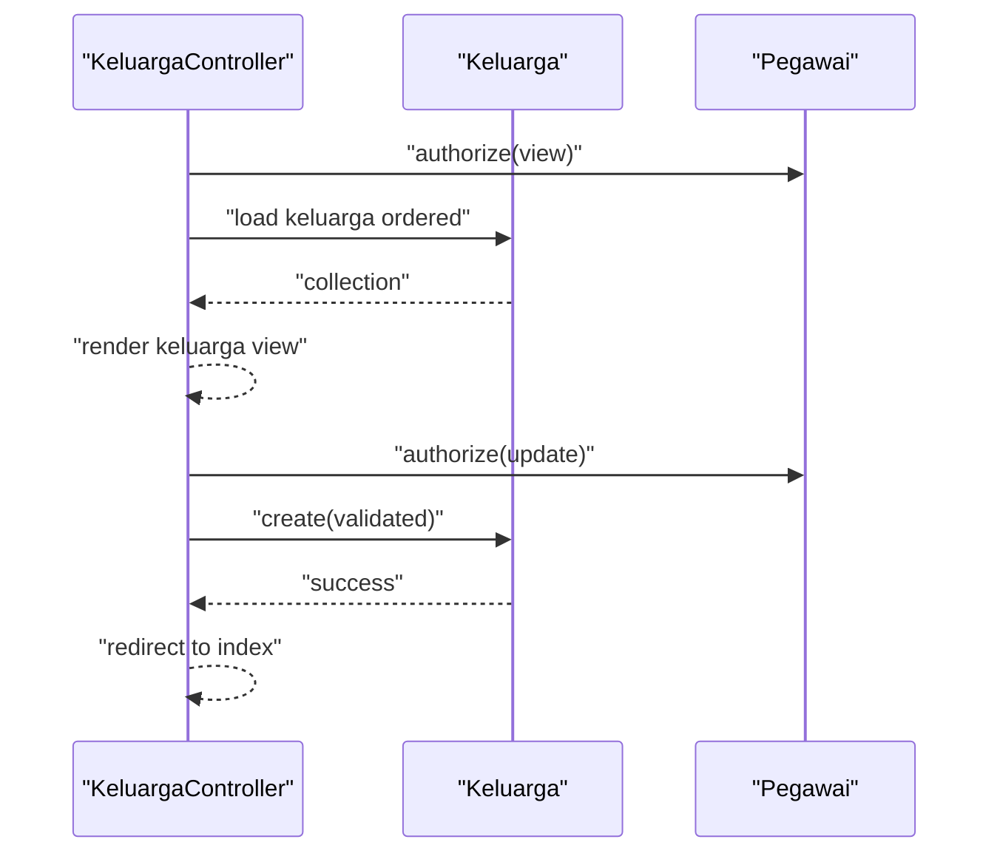
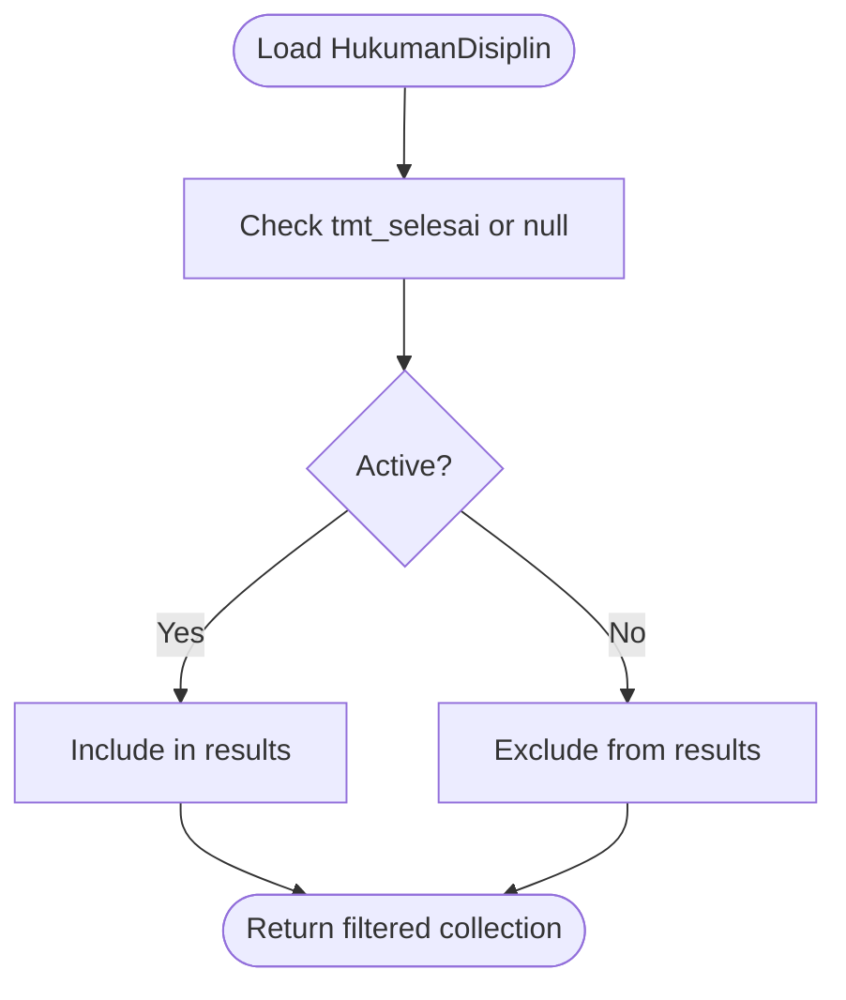
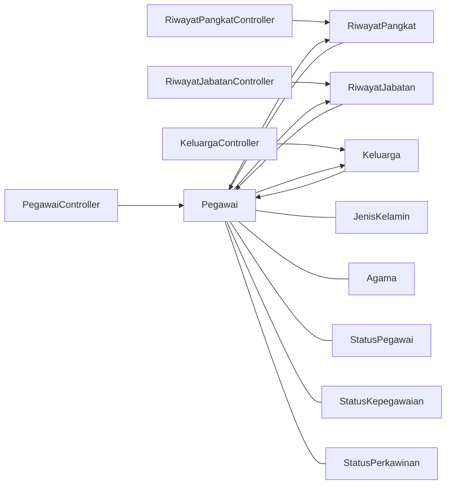

# Core Models

<cite>
**Referenced Files in This Document**
- [Pegawai.php](file://app/Models/Pegawai.php)
- [RiwayatPangkat.php](file://app/Models/RiwayatPangkat.php)
- [RiwayatJabatan.php](file://app/Models/RiwayatJabatan.php)
- [Keluarga.php](file://app/Models/Keluarga.php)
- [Penghargaan.php](file://app/Models/Penghargaan.php)
- [HukumanDisiplin.php](file://app/Models/HukumanDisiplin.php)
- [Model.php](file://app/Models/Model.php)
- [JenisKelamin.php](file://app/Enums/JenisKelamin.php)
- [Agama.php](file://app/Enums/Agama.php)
- [StatusPegawai.php](file://app/Enums/StatusPegawai.php)
- [StatusKepegawaian.php](file://app/Enums/StatusKepegawaian.php)
- [StatusPerkawinan.php](file://app/Enums/StatusPerkawinan.php)
- [PegawaiController.php](file://app/Http/Controllers/Kepegawaian/PegawaiController.php)
- [RiwayatPangkatController.php](file://app/Http/Controllers/Kepegawaian/RiwayatPangkatController.php)
- [RiwayatJabatanController.php](file://app/Http/Controllers/Kepegawaian/RiwayatJabatanController.php)
- [KeluargaController.php](file://app/Http/Controllers/Kepegawaian/KeluargaController.php)
</cite>

## Table of Contents
1. [Introduction](#introduction)
2. [Project Structure](#project-structure)
3. [Core Components](#core-components)
4. [Architecture Overview](#architecture-overview)
5. [Detailed Component Analysis](#detailed-component-analysis)
6. [Dependency Analysis](#dependency-analysis)
7. [Performance Considerations](#performance-considerations)
8. [Troubleshooting Guide](#troubleshooting-guide)
9. [Conclusion](#conclusion)

## Introduction
This document provides comprehensive data model documentation for the core HRIS entities centered around the Pegawai (employee) model. It covers the primary relational models used to manage employee records and their histories: RiwayatPangkat (rank history), RiwayatJabatan (position history), Keluarga (family dependents), Penghargaan (awards), and HukumanDisiplin (disciplinary actions). For each model, we define fields, data types, validation rules, business constraints, relationships, accessors, mutators, and query scopes. We also illustrate practical usage patterns in controllers and services to demonstrate how these models interact to support end-to-end employee management.

## Project Structure
The core models are located under app/Models and are built on top of a shared base model that standardizes serialization of dates. Enumerations under app/Enums define strongly typed attributes for gender, religion, marital status, employment status, and others. Controllers under app/Http/Controllers/Kepegawaian orchestrate CRUD operations and load related data for presentation.

**Diagram sources**
- [Pegawai.php:24-209](file://app/Models/Pegawai.php#L24-L209)
- [RiwayatPangkat.php:11-59](file://app/Models/RiwayatPangkat.php#L11-L59)
- [RiwayatJabatan.php:11-59](file://app/Models/RiwayatJabatan.php#L11-L59)
- [Keluarga.php:12-45](file://app/Models/Keluarga.php#L12-L45)
- [Penghargaan.php:10-44](file://app/Models/Penghargaan.php#L10-L44)
- [HukumanDisiplin.php:11-58](file://app/Models/HukumanDisiplin.php#L11-L58)
- [Model.php:8-19](file://app/Models/Model.php#L8-L19)
- [JenisKelamin.php:5-18](file://app/Enums/JenisKelamin.php#L5-L18)
- [Agama.php:5-26](file://app/Enums/Agama.php#L5-L26)
- [StatusPegawai.php:5-24](file://app/Enums/StatusPegawai.php#L5-L24)
- [StatusKepegawaian.php:5-20](file://app/Enums/StatusKepegawaian.php#L5-L20)
- [StatusPerkawinan.php:5-22](file://app/Enums/StatusPerkawinan.php#L5-L22)
- [PegawaiController.php:25-224](file://app/Http/Controllers/Kepegawaian/PegawaiController.php#L25-L224)
- [RiwayatPangkatController.php:17-118](file://app/Http/Controllers/Kepegawaian/RiwayatPangkatController.php#L17-L118)
- [RiwayatJabatanController.php:18-106](file://app/Http/Controllers/Kepegawaian/RiwayatJabatanController.php#L18-L106)
- [KeluargaController.php:15-91](file://app/Http/Controllers/Kepegawaian/KeluargaController.php#L15-L91)

**Section sources**
- [Pegawai.php:24-209](file://app/Models/Pegawai.php#L24-L209)
- [Model.php:8-19](file://app/Models/Model.php#L8-L19)

## Core Components
This section documents the five core models and their relationships to the Pegawai entity, along with supporting enums and base model behavior.

- Pegawai (central employee record)
  - Purpose: Stores personal and professional attributes, authentication credentials, and references to organizational units and roles.
  - Key fields: identifiers, biographical info, contact info, employment metadata, and foreign keys to reference tables.
  - Casts: date fields, enum casts for gender, religion, marital status, blood type, employment status, and personnel status; hashed password; 2FA and email verification timestamps.
  - Relationships: belongs to RefPangkat, RefJabatan, RefUnitKerja; many-to-many IAM roles via pivot; has many for all history and dependent entities.
  - Accessors: computed label for current rank.
  - Scopes: active employees, by unit, by rank code/golongan.
  - Permissions: checks role-based permissions and role slugs.
  - Hidden attributes: sensitive credentials and 2FA secrets.

- RiwayatPangkat (rank advancement history)
  - Purpose: Tracks formal rank promotions with dates, authority, and pay details.
  - Fields: references to Pegawai and RefPangkat, SK number and issuance date, take-into-service date, approving official, years/months of service, basic salary, active flag, and notes.
  - Casts: dates, integers for service duration, decimal for salary, boolean for active flag.
  - Relationships: belongs to Pegawai and RefPangkat.
  - Scopes: active records.

- RiwayatJabatan (position change history)
  - Purpose: Records job title and unit assignments with effective dates and approving authority.
  - Fields: references to Pegawai, RefJabatan, RefUnitKerja, SK number and date, take-into-service date, approving official, active flag, and notes.
  - Casts: dates, boolean for active flag.
  - Relationships: belongs to Pegawai, RefJabatan, RefUnitKerja.
  - Scopes: active records.

- Keluarga (family dependents)
  - Purpose: Maintains family members’ details linked to an employee.
  - Fields: references to Pegawai, relationship type, name, birthplace, birth date, gender, occupation, education, and notes.
  - Casts: enum for relationship and gender, date for birth.
  - Relationships: belongs to Pegawai.

- Penghargaan (awards)
  - Purpose: Documents awards given to employees with issuing authority and notes.
  - Fields: references to Pegawai and RefJenisPenghargaan, award name, SK number and date, issuing official, and notes.
  - Casts: date for SK issuance.
  - Relationships: belongs to Pegawai and RefJenisPenghargaan.

- HukumanDisiplin (disciplinary actions)
  - Purpose: Tracks disciplinary measures with effective period and notes.
  - Fields: references to Pegawai and RefJenisHukumanDisiplin, SK number and date, effective start/end dates, violation description, issuing official, and notes.
  - Casts: dates for SK and effective period.
  - Relationships: belongs to Pegawai and RefJenisHukumanDisiplin.
  - Scopes: active during current period.

- Base Model behavior
  - Serialization: ensures consistent datetime serialization for JSON/array responses.

- Enumerations
  - Strongly typed values for gender, religion, marital status, employment status, and personnel status.

**Section sources**
- [Pegawai.php:28-65](file://app/Models/Pegawai.php#L28-L65)
- [Pegawai.php:69-137](file://app/Models/Pegawai.php#L69-L137)
- [Pegawai.php:141-168](file://app/Models/Pegawai.php#L141-L168)
- [Pegawai.php:179-208](file://app/Models/Pegawai.php#L179-L208)
- [RiwayatPangkat.php:15-42](file://app/Models/RiwayatPangkat.php#L15-L42)
- [RiwayatPangkat.php:44-58](file://app/Models/RiwayatPangkat.php#L44-L58)
- [RiwayatJabatan.php:15-37](file://app/Models/RiwayatJabatan.php#L15-L37)
- [RiwayatJabatan.php:39-58](file://app/Models/RiwayatJabatan.php#L39-L58)
- [Keluarga.php:16-38](file://app/Models/Keluarga.php#L16-L38)
- [Penghargaan.php:14-32](file://app/Models/Penghargaan.php#L14-L32)
- [HukumanDisiplin.php:15-37](file://app/Models/HukumanDisiplin.php#L15-L37)
- [Model.php:14-17](file://app/Models/Model.php#L14-L17)
- [JenisKelamin.php:5-18](file://app/Enums/JenisKelamin.php#L5-L18)
- [Agama.php:5-26](file://app/Enums/Agama.php#L5-L26)
- [StatusPegawai.php:5-24](file://app/Enums/StatusPegawai.php#L5-L24)
- [StatusKepegawaian.php:5-20](file://app/Enums/StatusKepegawaian.php#L5-L20)
- [StatusPerkawinan.php:5-22](file://app/Enums/StatusPerkawinan.php#L5-L22)

## Architecture Overview
The core models form a hub-and-spoke architecture around Pegawai. Each history and detail model maintains a foreign key to Pegawai, enabling comprehensive lifecycle tracking. Enums enforce domain correctness, while scopes and accessors simplify common queries and computed presentations.

**Diagram sources**
- [Model.php:8-19](file://app/Models/Model.php#L8-L19)
- [Pegawai.php:24-209](file://app/Models/Pegawai.php#L24-L209)
- [RiwayatPangkat.php:11-59](file://app/Models/RiwayatPangkat.php#L11-L59)
- [RiwayatJabatan.php:11-59](file://app/Models/RiwayatJabatan.php#L11-L59)
- [Keluarga.php:12-45](file://app/Models/Keluarga.php#L12-L45)
- [Penghargaan.php:10-44](file://app/Models/Penghargaan.php#L10-L44)
- [HukumanDisiplin.php:11-58](file://app/Models/HukumanDisiplin.php#L11-L58)

## Detailed Component Analysis

### Pegawai Model
- Field definitions and data types
  - Identifiers and personal info: NIP, legacy NIP, full name, place/date of birth, gender (enum), religion (enum), marital status (enum), blood type (enum), address, phone, email.
  - Employment metadata: status in service (enum), personnel status (enum), CPNS/PNS dates, latest education, entry date, pension date, photo, notes, password (hashed).
  - References: ref_pangkat_id, ref_jabatan_id, ref_unit_kerja_id.
- Validation rules and constraints
  - Controlled by form requests in controllers; creation and updates are validated before persistence.
  - Password hashing is handled via cast; sensitive fields hidden from serialization.
- Relationships
  - Belongs to RefPangkat, RefJabatan, RefUnitKerja.
  - Many-to-many IAM roles via pivot; permission checks supported.
  - Has many: RiwayatJabatan, RiwayatDiklat, RiwayatPendidikan, RiwayatPangkat, DokumenPegawai, Keluarga, Penghargaan, HukumanDisiplin.
- Accessors and computed fields
  - Computed label combining rank name and code.
- Query scopes
  - Active employees, filter by unit, filter by rank code/golongan.
- Practical usage in controllers
  - Listing with filters, sorting by rank/jabatan via joins, loading related entities, creating/updating/deleting employees, and rendering detailed views with nested histories.

**Diagram sources**
- [PegawaiController.php:30-113](file://app/Http/Controllers/Kepegawaian/PegawaiController.php#L30-L113)
- [Pegawai.php:179-196](file://app/Models/Pegawai.php#L179-L196)

**Section sources**
- [Pegawai.php:28-65](file://app/Models/Pegawai.php#L28-L65)
- [Pegawai.php:69-137](file://app/Models/Pegawai.php#L69-L137)
- [Pegawai.php:141-168](file://app/Models/Pegawai.php#L141-L168)
- [Pegawai.php:179-208](file://app/Models/Pegawai.php#L179-L208)
- [PegawaiController.php:30-113](file://app/Http/Controllers/Kepegawaian/PegawaiController.php#L30-L113)

### RiwayatPangkat Model
- Field definitions and data types
  - Dates: SK issuance, take-into-service.
  - Numerics: years/months of service, salary (decimal).
  - Flags: active indicator.
  - Notes and approvals.
- Validation rules and constraints
  - Enforced by form requests; service layer may apply additional business rules (e.g., ensuring only one active record per employee).
- Relationships
  - Belongs to Pegawai and RefPangkat.
- Accessors/mutators
  - None defined; rely on casts and Eloquent behavior.
- Query scopes
  - Active records only.
- Practical usage in controllers/services
  - Listing with rank details, creating/updating/deleting entries, and ordering by active flag and effective date.

**Diagram sources**
- [RiwayatPangkatController.php:21-85](file://app/Http/Controllers/Kepegawaian/RiwayatPangkatController.php#L21-L85)
- [RiwayatPangkatController.php:87-118](file://app/Http/Controllers/Kepegawaian/RiwayatPangkatController.php#L87-L118)
- [RiwayatPangkat.php:44-58](file://app/Models/RiwayatPangkat.php#L44-L58)

**Section sources**
- [RiwayatPangkat.php:15-42](file://app/Models/RiwayatPangkat.php#L15-L42)
- [RiwayatPangkat.php:44-58](file://app/Models/RiwayatPangkat.php#L44-L58)
- [RiwayatPangkatController.php:21-85](file://app/Http/Controllers/Kepegawaian/RiwayatPangkatController.php#L21-L85)
- [RiwayatPangkatController.php:87-118](file://app/Http/Controllers/Kepegawaian/RiwayatPangkatController.php#L87-L118)

### RiwayatJabatan Model
- Field definitions and data types
  - Dates: SK issuance, take-into-service.
  - Flags: active indicator.
  - Approving official and notes.
- Validation rules and constraints
  - Enforced by form requests; service layer validates effective periods and uniqueness of active positions.
- Relationships
  - Belongs to Pegawai, RefJabatan, RefUnitKerja.
- Accessors/mutators
  - None defined; rely on casts and Eloquent behavior.
- Query scopes
  - Active records only.
- Practical usage in controllers/services
  - Listing with job and unit details, creating/updating/deleting entries, and ordering by active flag and effective date.

**Diagram sources**
- [RiwayatJabatanController.php:20-74](file://app/Http/Controllers/Kepegawaian/RiwayatJabatanController.php#L20-L74)
- [RiwayatJabatanController.php:76-106](file://app/Http/Controllers/Kepegawaian/RiwayatJabatanController.php#L76-L106)
- [RiwayatJabatan.php:39-58](file://app/Models/RiwayatJabatan.php#L39-L58)

**Section sources**
- [RiwayatJabatan.php:15-37](file://app/Models/RiwayatJabatan.php#L15-L37)
- [RiwayatJabatan.php:39-58](file://app/Models/RiwayatJabatan.php#L39-L58)
- [RiwayatJabatanController.php:20-74](file://app/Http/Controllers/Kepegawaian/RiwayatJabatanController.php#L20-L74)
- [RiwayatJabatanController.php:76-106](file://app/Http/Controllers/Kepegawaian/RiwayatJabatanController.php#L76-L106)

### Keluarga Model
- Field definitions and data types
  - Relationship type (enum), name, birthplace, birth date, gender (enum), occupation, education, notes.
- Validation rules and constraints
  - Enforced by form requests; ensure proper relationship types and dates.
- Relationships
  - Belongs to Pegawai.
- Accessors/mutators
  - None defined; rely on casts and Eloquent behavior.
- Query scopes
  - None defined; order by relationship type and name.
- Practical usage in controllers
  - Listing dependents with labels for relationship and gender, creating/updating/deleting entries.

**Diagram sources**
- [KeluargaController.php:17-53](file://app/Http/Controllers/Kepegawaian/KeluargaController.php#L17-L53)
- [KeluargaController.php:55-91](file://app/Http/Controllers/Kepegawaian/KeluargaController.php#L55-L91)
- [Keluarga.php:40-44](file://app/Models/Keluarga.php#L40-L44)

**Section sources**
- [Keluarga.php:16-38](file://app/Models/Keluarga.php#L16-L38)
- [Keluarga.php:40-44](file://app/Models/Keluarga.php#L40-L44)
- [KeluargaController.php:17-53](file://app/Http/Controllers/Kepegawaian/KeluargaController.php#L17-L53)
- [KeluargaController.php:55-91](file://app/Http/Controllers/Kepegawaian/KeluargaController.php#L55-L91)

### Penghargaan Model
- Field definitions and data types
  - Award name, SK number and date, issuing official, notes.
- Validation rules and constraints
  - Enforced by form requests; ensure award type reference exists.
- Relationships
  - Belongs to Pegawai and RefJenisPenghargaan.
- Accessors/mutators
  - None defined; rely on casts and Eloquent behavior.
- Query scopes
  - None defined.
- Practical usage
  - Listing with award type labels, creating/updating/deleting entries.

**Section sources**
- [Penghargaan.php:14-32](file://app/Models/Penghargaan.php#L14-L32)
- [Penghargaan.php:34-43](file://app/Models/Penghargaan.php#L34-L43)

### HukumanDisiplin Model
- Field definitions and data types
  - SK number and date, effective start/end dates, violation description, issuing official, notes.
- Validation rules and constraints
  - Enforced by form requests; ensure valid date ranges.
- Relationships
  - Belongs to Pegawai and RefJenisHukumanDisiplin.
- Accessors/mutators
  - None defined; rely on casts and Eloquent behavior.
- Query scopes
  - Active during current period (including indefinite).
- Practical usage
  - Listing with active status, creating/updating/deleting entries.

**Diagram sources**
- [HukumanDisiplin.php:49-57](file://app/Models/HukumanDisiplin.php#L49-L57)

**Section sources**
- [HukumanDisiplin.php:15-37](file://app/Models/HukumanDisiplin.php#L15-L37)
- [HukumanDisiplin.php:49-57](file://app/Models/HukumanDisiplin.php#L49-L57)

## Dependency Analysis
The following diagram shows how controllers depend on models and services, and how models depend on each other and on enums.

**Diagram sources**
- [PegawaiController.php:25-224](file://app/Http/Controllers/Kepegawaian/PegawaiController.php#L25-L224)
- [RiwayatPangkatController.php:17-118](file://app/Http/Controllers/Kepegawaian/RiwayatPangkatController.php#L17-L118)
- [RiwayatJabatanController.php:18-106](file://app/Http/Controllers/Kepegawaian/RiwayatJabatanController.php#L18-L106)
- [KeluargaController.php:15-91](file://app/Http/Controllers/Kepegawaian/KeluargaController.php#L15-L91)
- [Pegawai.php:24-209](file://app/Models/Pegawai.php#L24-L209)
- [RiwayatPangkat.php:11-59](file://app/Models/RiwayatPangkat.php#L11-L59)
- [RiwayatJabatan.php:11-59](file://app/Models/RiwayatJabatan.php#L11-L59)
- [Keluarga.php:12-45](file://app/Models/Keluarga.php#L12-L45)
- [JenisKelamin.php:5-18](file://app/Enums/JenisKelamin.php#L5-L18)
- [Agama.php:5-26](file://app/Enums/Agama.php#L5-L26)
- [StatusPegawai.php:5-24](file://app/Enums/StatusPegawai.php#L5-L24)
- [StatusKepegawaian.php:5-20](file://app/Enums/StatusKepegawaian.php#L5-L20)
- [StatusPerkawinan.php:5-22](file://app/Enums/StatusPerkawinan.php#L5-L22)

**Section sources**
- [PegawaiController.php:25-224](file://app/Http/Controllers/Kepegawaian/PegawaiController.php#L25-L224)
- [RiwayatPangkatController.php:17-118](file://app/Http/Controllers/Kepegawaian/RiwayatPangkatController.php#L17-L118)
- [RiwayatJabatanController.php:18-106](file://app/Http/Controllers/Kepegawaian/RiwayatJabatanController.php#L18-L106)
- [KeluargaController.php:15-91](file://app/Http/Controllers/Kepegawaian/KeluargaController.php#L15-L91)

## Performance Considerations
- Eager loading: Controllers load related entities to avoid N+1 queries (e.g., loading ranks, jobs, units, and histories).
- Scopes: Use of scopes reduces repeated filtering logic and improves readability.
- Casting: Proper casting avoids unnecessary conversions and ensures consistent serialization.
- Pagination: Controllers paginate results to limit memory usage and response sizes.
- Sorting: Sorting by related fields uses subqueries; ensure appropriate indexing on foreign keys and joined columns.

[No sources needed since this section provides general guidance]

## Troubleshooting Guide
- Permission errors
  - Controllers authorize actions using policies; ensure the authenticated user has the required permissions or roles.
- Foreign key mismatches
  - Ensure foreign keys (e.g., ref_pangkat_id, ref_jabatan_id, ref_unit_kerja_id) are set correctly when creating or updating records.
- Active record conflicts
  - RiwayatPangkat and RiwayatJabatan should maintain only one active record per employee; services should deactivate previous records before activating new ones.
- Date range issues
  - HukumanDisiplin active scope depends on tmt_selesai; ensure correct date values to reflect active penalties.
- Serialization
  - Base model ensures consistent datetime serialization; if unexpected date formats appear, verify serialization logic.

**Section sources**
- [PegawaiController.php:32-32](file://app/Http/Controllers/Kepegawaian/PegawaiController.php#L32-L32)
- [RiwayatPangkatController.php:89-105](file://app/Http/Controllers/Kepegawaian/RiwayatPangkatController.php#L89-L105)
- [RiwayatJabatanController.php:78-92](file://app/Http/Controllers/Kepegawaian/RiwayatJabatanController.php#L78-L92)
- [KeluargaController.php:68-89](file://app/Http/Controllers/Kepegawaian/KeluargaController.php#L68-L89)
- [HukumanDisiplin.php:49-57](file://app/Models/HukumanDisiplin.php#L49-L57)
- [Model.php:14-17](file://app/Models/Model.php#L14-L17)

## Conclusion
The core models provide a robust foundation for managing employee records and histories. By leveraging strong typing via enums, consistent casting, scoped queries, and eager loading, the system supports efficient and reliable employee management workflows. Controllers and services coordinate these models to deliver comprehensive functionality across personal details, career progression, dependents, awards, and discipline.

[No sources needed since this section summarizes without analyzing specific files]