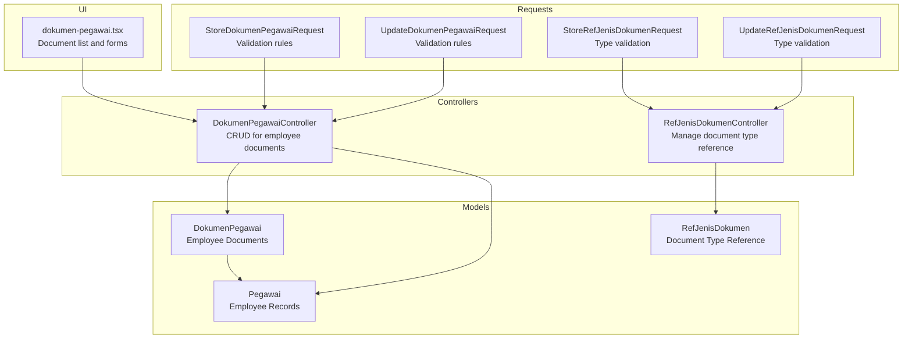
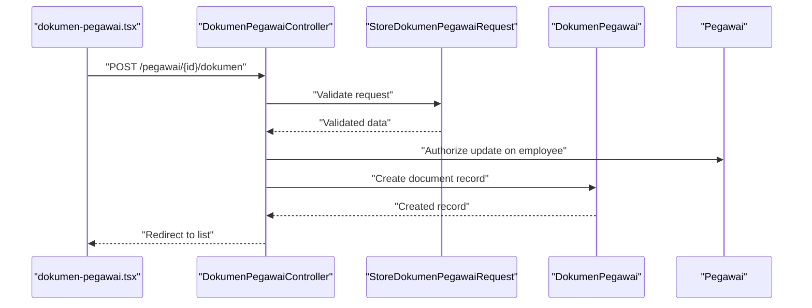
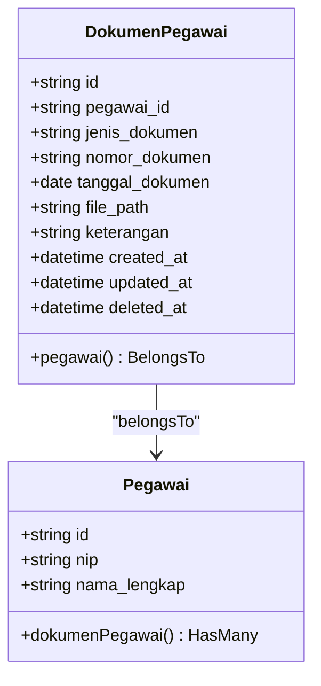
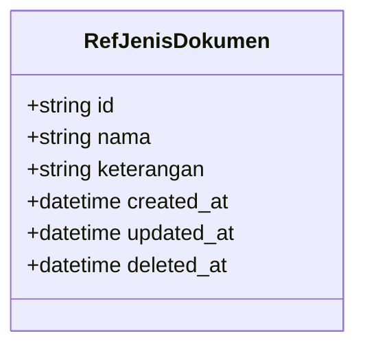
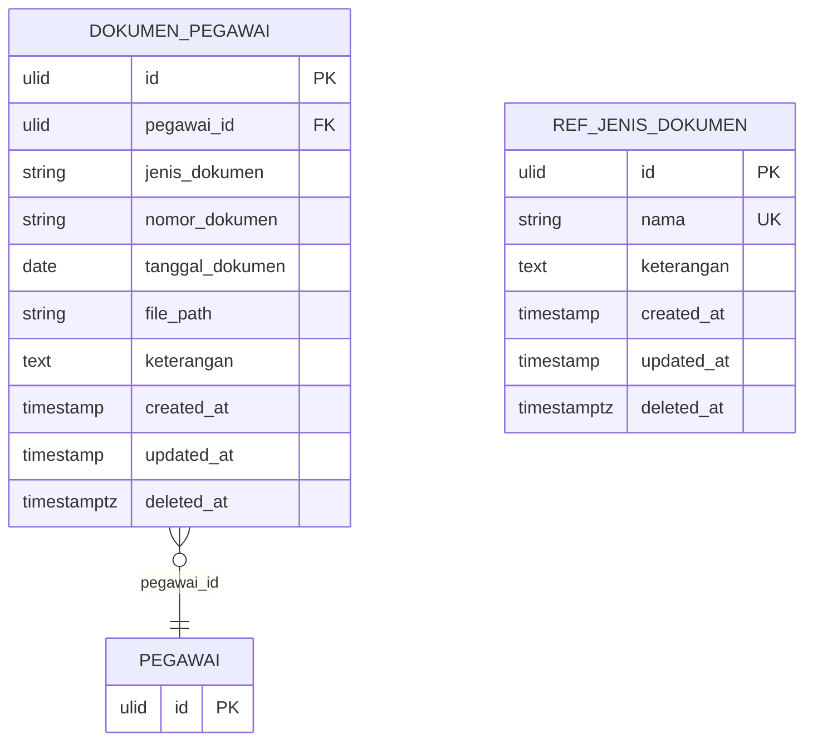
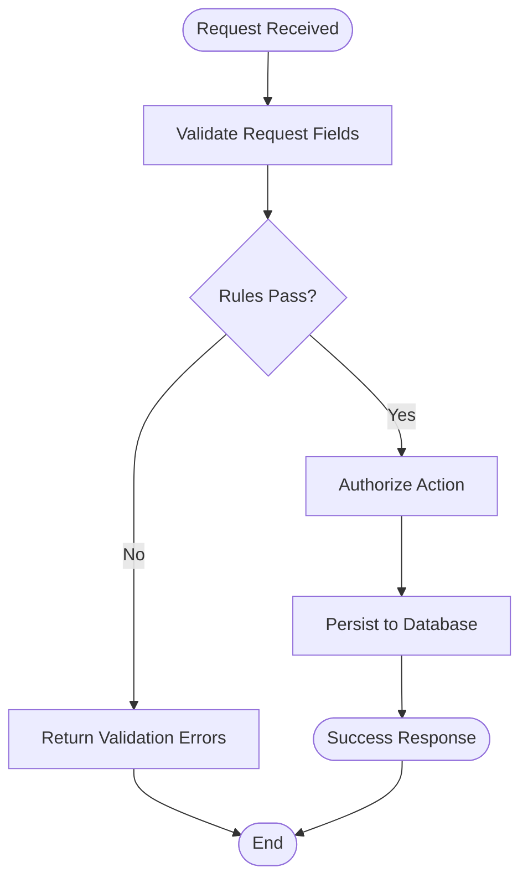
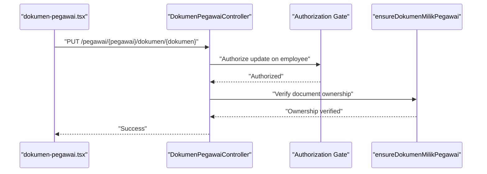
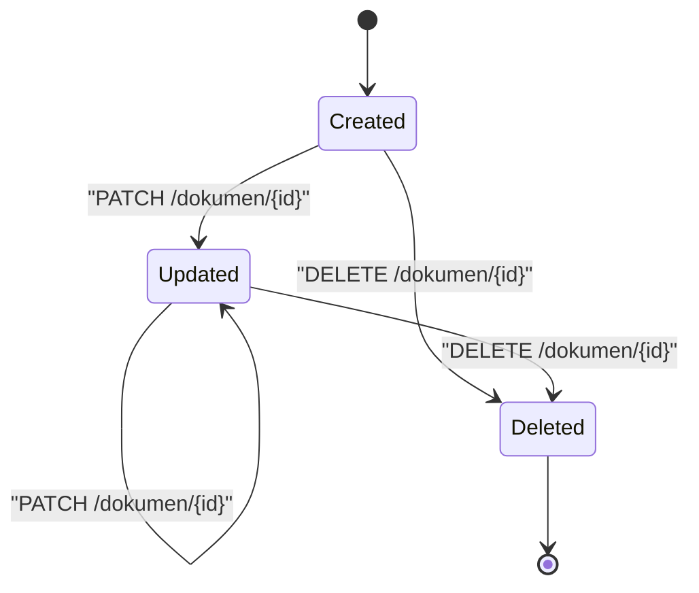
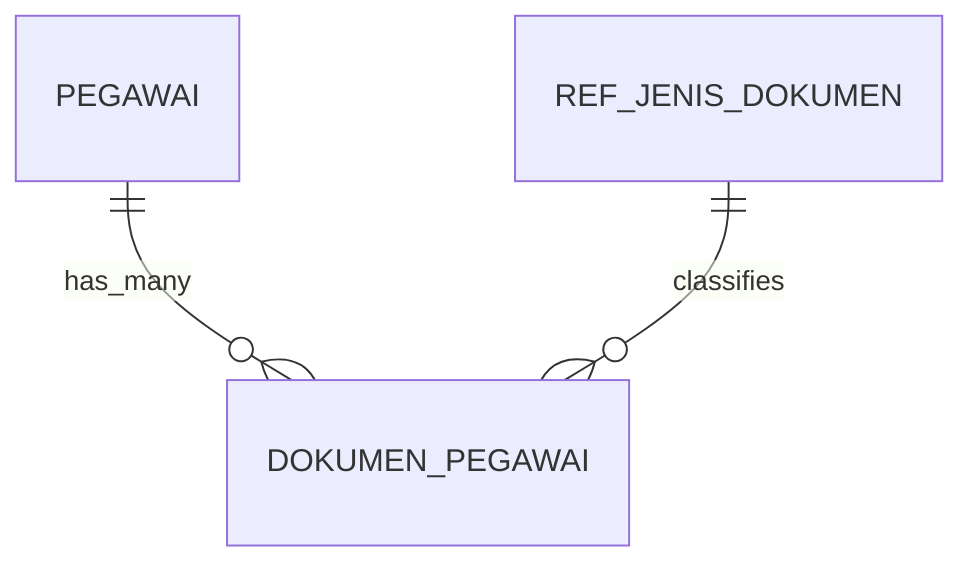
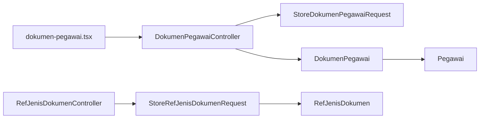

# Document Models

<cite>
**Referenced Files in This Document**
- [DokumenPegawai.php](file://app/Models/DokumenPegawai.php)
- [RefJenisDokumen.php](file://app/Models/RefJenisDokumen.php)
- [Pegawai.php](file://app/Models/Pegawai.php)
- [DokumenPegawaiController.php](file://app/Http/Controllers/Kepegawaian/DokumenPegawaiController.php)
- [RefJenisDokumenController.php](file://app/Http/Controllers/Referensi/RefJenisDokumenController.php)
- [StoreDokumenPegawaiRequest.php](file://app/Http/Requests/Kepegawaian/StoreDokumenPegawaiRequest.php)
- [UpdateDokumenPegawaiRequest.php](file://app/Http/Requests/Kepegawaian/UpdateDokumenPegawaiRequest.php)
- [StoreRefJenisDokumenRequest.php](file://app/Http/Requests/Referensi/StoreRefJenisDokumenRequest.php)
- [UpdateRefJenisDokumenRequest.php](file://app/Http/Requests/Referensi/UpdateRefJenisDokumenRequest.php)
- [RefJenisDokumenPolicy.php](file://app/Policies/RefJenisDokumenPolicy.php)
- [create_dokumen_pegawai_table.php](file://database/migrations/2026_03_15_032846_create_dokumen_pegawai_table.php)
- [create_ref_jenis_dokumen_table.php](file://database/migrations/2026_03_15_162757_create_ref_jenis_dokumen_table.php)
- [DokumenPegawaiFactory.php](file://database/factories/DokumenPegawaiFactory.php)
- [RefJenisDokumenFactory.php](file://database/factories/RefJenisDokumenFactory.php)
- [RefJenisDokumenSeeder.php](file://database/seeders/RefJenisDokumenSeeder.php)
- [dokumen-pegawai.tsx](file://resources/js/pages/kepegawaian/pegawai/dokumen-pegawai.tsx)
</cite>

## Table of Contents
1. [Introduction](#introduction)
2. [Project Structure](#project-structure)
3. [Core Components](#core-components)
4. [Architecture Overview](#architecture-overview)
5. [Detailed Component Analysis](#detailed-component-analysis)
6. [Dependency Analysis](#dependency-analysis)
7. [Performance Considerations](#performance-considerations)
8. [Troubleshooting Guide](#troubleshooting-guide)
9. [Conclusion](#conclusion)

## Introduction
This document provides comprehensive data model documentation for employee document management. It focuses on:
- DokumenPegawai: the core model for storing employee documents with metadata, file references, and status tracking
- RefJenisDokumen: the classification model for document types with validation rules
- Relationship patterns between documents and employee records
- Attachment handling and document lifecycle management
- Access control mechanisms and validation workflows
- Examples of document upload, validation, and retrieval processes

The goal is to enable developers and stakeholders to understand how documents are modeled, validated, stored, retrieved, and secured within the system.

## Project Structure
The document management feature spans backend Eloquent models, controllers, form requests, policies, migrations, factories, seeders, and frontend pages. The following diagram shows the high-level structure and relationships.

**Diagram sources**
- [DokumenPegawai.php:1-38](file://app/Models/DokumenPegawai.php#L1-L38)
- [RefJenisDokumen.php:1-29](file://app/Models/RefJenisDokumen.php#L1-L29)
- [Pegawai.php:119-122](file://app/Models/Pegawai.php#L119-L122)
- [DokumenPegawaiController.php:1-92](file://app/Http/Controllers/Kepegawaian/DokumenPegawaiController.php#L1-L92)
- [RefJenisDokumenController.php:1-78](file://app/Http/Controllers/Referensi/RefJenisDokumenController.php#L1-L78)
- [StoreDokumenPegawaiRequest.php:1-36](file://app/Http/Requests/Kepegawaian/StoreDokumenPegawaiRequest.php#L1-L36)
- [UpdateDokumenPegawaiRequest.php:1-6](file://app/Http/Requests/Kepegawaian/UpdateDokumenPegawaiRequest.php#L1-L6)
- [StoreRefJenisDokumenRequest.php:1-33](file://app/Http/Requests/Referensi/StoreRefJenisDokumenRequest.php#L1-L33)
- [UpdateRefJenisDokumenRequest.php:1-42](file://app/Http/Requests/Referensi/UpdateRefJenisDokumenRequest.php#L1-L42)
- [dokumen-pegawai.tsx:1-402](file://resources/js/pages/kepegawaian/pegawai/dokumen-pegawai.tsx#L1-L402)

**Section sources**
- [DokumenPegawai.php:1-38](file://app/Models/DokumenPegawai.php#L1-L38)
- [RefJenisDokumen.php:1-29](file://app/Models/RefJenisDokumen.php#L1-L29)
- [Pegawai.php:119-122](file://app/Models/Pegawai.php#L119-L122)
- [DokumenPegawaiController.php:1-92](file://app/Http/Controllers/Kepegawaian/DokumenPegawaiController.php#L1-L92)
- [RefJenisDokumenController.php:1-78](file://app/Http/Controllers/Referensi/RefJenisDokumenController.php#L1-L78)
- [StoreDokumenPegawaiRequest.php:1-36](file://app/Http/Requests/Kepegawaian/StoreDokumenPegawaiRequest.php#L1-L36)
- [UpdateDokumenPegawaiRequest.php:1-6](file://app/Http/Requests/Kepegawaian/UpdateDokumenPegawaiRequest.php#L1-L6)
- [StoreRefJenisDokumenRequest.php:1-33](file://app/Http/Requests/Referensi/StoreRefJenisDokumenRequest.php#L1-L33)
- [UpdateRefJenisDokumenRequest.php:1-42](file://app/Http/Requests/Referensi/UpdateRefJenisDokumenRequest.php#L1-L42)
- [dokumen-pegawai.tsx:1-402](file://resources/js/pages/kepegawaian/pegawai/dokumen-pegawai.tsx#L1-L402)

## Core Components
This section documents the primary data models and their attributes, relationships, and behaviors.

- DokumenPegawai
  - Purpose: Stores individual employee documents with metadata and optional file references
  - Key attributes:
    - pegawai_id: foreign key linking to employee record
    - jenis_dokumen: document type identifier (string, max 100)
    - nomor_dokumen: optional document number (string, max 100)
    - tanggal_dokumen: optional document date (date)
    - file_path: optional file path reference (string, max 500)
    - keterangan: optional description (text)
  - Relationships:
    - belongs to Pegawai
  - Behavior:
    - Uses ULIDs for identifiers
    - Soft deletes enabled
    - Date casting for tanggal_dokumen and deleted_at

- RefJenisDokumen
  - Purpose: Maintains document type classifications
  - Key attributes:
    - nama: document type name (unique)
    - keterangan: optional description (text)
  - Behavior:
    - Uses ULIDs for identifiers
    - Soft deletes enabled

- Pegawai
  - Purpose: Employee master record
  - Relationships:
    - has many DokumenPegawai (one-to-many)

**Section sources**
- [DokumenPegawai.php:10-37](file://app/Models/DokumenPegawai.php#L10-L37)
- [RefJenisDokumen.php:10-28](file://app/Models/RefJenisDokumen.php#L10-L28)
- [Pegawai.php:119-122](file://app/Models/Pegawai.php#L119-L122)

## Architecture Overview
The document management architecture follows a layered pattern:
- Frontend page renders the document list and forms
- Controllers orchestrate CRUD operations and enforce access control
- Form requests validate incoming data
- Models define relationships and persistence
- Migrations define database schema
- Factories and seeders support testing and development

**Diagram sources**
- [dokumen-pegawai.tsx:131-144](file://resources/js/pages/kepegawaian/pegawai/dokumen-pegawai.tsx#L131-L144)
- [DokumenPegawaiController.php:53-60](file://app/Http/Controllers/Kepegawaian/DokumenPegawaiController.php#L53-L60)
- [StoreDokumenPegawaiRequest.php:14-23](file://app/Http/Requests/Kepegawaian/StoreDokumenPegawaiRequest.php#L14-L23)
- [DokumenPegawai.php:10-37](file://app/Models/DokumenPegawai.php#L10-L37)
- [Pegawai.php:119-122](file://app/Models/Pegawai.php#L119-L122)

## Detailed Component Analysis

### DokumenPegawai Model
DokumenPegawai encapsulates employee document records with strong typing and safety features.

Key implementation patterns:
- Uses ULIDs for globally unique identifiers
- Soft deletes for non-destructive removal
- Date casting for temporal fields
- Fillable attributes restrict mass assignment surface
- Relationship method defines foreign key association

**Diagram sources**
- [DokumenPegawai.php:10-37](file://app/Models/DokumenPegawai.php#L10-L37)
- [Pegawai.php:119-122](file://app/Models/Pegawai.php#L119-L122)

**Section sources**
- [DokumenPegawai.php:10-37](file://app/Models/DokumenPegawai.php#L10-L37)

### RefJenisDokumen Model
RefJenisDokumen maintains document type reference data with uniqueness constraints.

Validation rules:
- nama: required, unique, max length 255
- keterangan: optional, max length 1000

**Diagram sources**
- [RefJenisDokumen.php:10-28](file://app/Models/RefJenisDokumen.php#L10-L28)

**Section sources**
- [RefJenisDokumen.php:10-28](file://app/Models/RefJenisDokumen.php#L10-L28)
- [StoreRefJenisDokumenRequest.php:16-22](file://app/Http/Requests/Referensi/StoreRefJenisDokumenRequest.php#L16-L22)
- [UpdateRefJenisDokumenRequest.php:17-30](file://app/Http/Requests/Referensi/UpdateRefJenisDokumenRequest.php#L17-L30)

### Database Schema
The migration files define the physical structure of document-related tables.

Schema characteristics:
- Primary keys use ULIDs for distributed systems compatibility
- Foreign key constraint ensures referential integrity
- Soft deletes add temporal safety
- Unique constraint on RefJenisDokumen.nama prevents duplicates

**Diagram sources**
- [create_dokumen_pegawai_table.php:11-21](file://database/migrations/2026_03_15_032846_create_dokumen_pegawai_table.php#L11-L21)
- [create_ref_jenis_dokumen_table.php:11-17](file://database/migrations/2026_03_15_162757_create_ref_jenis_dokumen_table.php#L11-L17)

**Section sources**
- [create_dokumen_pegawai_table.php:11-21](file://database/migrations/2026_03_15_032846_create_dokumen_pegawai_table.php#L11-L21)
- [create_ref_jenis_dokumen_table.php:11-17](file://database/migrations/2026_03_15_162757_create_ref_jenis_dokumen_table.php#L11-L17)

### Validation Workflows
Form requests define strict validation rules for document creation and updates.

Validation specifics:
- StoreDokumenPegawaiRequest enforces:
  - jenis_dokumen: required, string, max 100
  - nomor_dokumen: nullable, string, max 100
  - tanggal_dokumen: nullable, date
  - file_path: nullable, string, max 500
  - keterangan: nullable, string
- UpdateDokumenPegawaiRequest inherits the same rules as the store request

**Diagram sources**
- [StoreDokumenPegawaiRequest.php:14-23](file://app/Http/Requests/Kepegawaian/StoreDokumenPegawaiRequest.php#L14-L23)
- [UpdateDokumenPegawaiRequest.php:1-6](file://app/Http/Requests/Kepegawaian/UpdateDokumenPegawaiRequest.php#L1-L6)

**Section sources**
- [StoreDokumenPegawaiRequest.php:14-23](file://app/Http/Requests/Kepegawaian/StoreDokumenPegawaiRequest.php#L14-L23)
- [UpdateDokumenPegawaiRequest.php:1-6](file://app/Http/Requests/Kepegawaian/UpdateDokumenPegawaiRequest.php#L1-L6)

### Access Control Mechanisms
Access control is enforced at multiple layers:
- Controller gates:
  - View: requires permission to view the employee record
  - Update: requires permission to modify the employee record
- Additional guard: controller-level verification that the document belongs to the specified employee
- Policy inheritance: RefJenisDokumenPolicy extends a base policy for reference models

**Diagram sources**
- [DokumenPegawaiController.php:53-74](file://app/Http/Controllers/Kepegawaian/DokumenPegawaiController.php#L53-L74)
- [DokumenPegawaiController.php:87-90](file://app/Http/Controllers/Kepegawaian/DokumenPegawaiController.php#L87-L90)

**Section sources**
- [DokumenPegawaiController.php:19-26](file://app/Http/Controllers/Kepegawaian/DokumenPegawaiController.php#L19-L26)
- [DokumenPegawaiController.php:55-74](file://app/Http/Controllers/Kepegawaian/DokumenPegawaiController.php#L55-L74)
- [DokumenPegawaiController.php:87-90](file://app/Http/Controllers/Kepegawaian/DokumenPegawaiController.php#L87-L90)
- [RefJenisDokumenPolicy.php:7-43](file://app/Policies/RefJenisDokumenPolicy.php#L7-L43)

### Document Lifecycle Management
Lifecycle stages:
- Creation: validated data persisted under an employee
- Retrieval: ordered by type, then by most recent date and creation time
- Update: field-level updates with validation
- Deletion: soft delete with ownership verification

Ordering strategy:
- Documents are ordered by jenis_dokumen, then by tanggal_dokumen descending, then by created_at descending

**Diagram sources**
- [DokumenPegawaiController.php:21-26](file://app/Http/Controllers/Kepegawaian/DokumenPegawaiController.php#L21-L26)

**Section sources**
- [DokumenPegawaiController.php:21-26](file://app/Http/Controllers/Kepegawaian/DokumenPegawaiController.php#L21-L26)
- [DokumenPegawaiController.php:53-74](file://app/Http/Controllers/Kepegawaian/DokumenPegawaiController.php#L53-L74)
- [DokumenPegawaiController.php:76-85](file://app/Http/Controllers/Kepegawaian/DokumenPegawaiController.php#L76-L85)

### File Storage Integration
File handling:
- file_path stores a path reference (string) to the uploaded file
- The UI presents a link to the file when file_path is present
- No server-side file management logic is included in the referenced files

Integration considerations:
- The path should resolve to a publicly accessible location or require controlled access
- Consider using a dedicated storage disk and signed URLs for sensitive documents

**Section sources**
- [DokumenPegawai.php:16-23](file://app/Models/DokumenPegawai.php#L16-L23)
- [dokumen-pegawai.tsx:238-249](file://resources/js/pages/kepegawaian/pegawai/dokumen-pegawai.tsx#L238-L249)

### Relationship Patterns
- One-to-many: Pegawai has many DokumenPegawai
- Many-to-one: DokumenPegawai belongs to Pegawai
- Reference model: RefJenisDokumen provides document type taxonomy

**Diagram sources**
- [Pegawai.php:119-122](file://app/Models/Pegawai.php#L119-L122)
- [DokumenPegawai.php:33-36](file://app/Models/DokumenPegawai.php#L33-L36)

**Section sources**
- [Pegawai.php:119-122](file://app/Models/Pegawai.php#L119-L122)
- [DokumenPegawai.php:33-36](file://app/Models/DokumenPegawai.php#L33-L36)

### Examples

#### Example: Document Upload
- UI: User opens the document form in dokumen-pegawai.tsx
- Action: Submit creates a new document record
- Validation: StoreDokumenPegawaiRequest validates fields
- Authorization: Controller checks update permission on the employee
- Persistence: Controller creates the record under the specified employee

**Section sources**
- [dokumen-pegawai.tsx:131-144](file://resources/js/pages/kepegawaian/pegawai/dokumen-pegawai.tsx#L131-L144)
- [StoreDokumenPegawaiRequest.php:14-23](file://app/Http/Requests/Kepegawaian/StoreDokumenPegawaiRequest.php#L14-L23)
- [DokumenPegawaiController.php:53-60](file://app/Http/Controllers/Kepegawaian/DokumenPegawaiController.php#L53-L60)

#### Example: Document Retrieval
- UI: dokumen-pegawai.tsx loads the employee with associated documents
- Ordering: Documents are ordered by jenis_dokumen, tanggal_dokumen desc, created_at desc
- Presentation: UI displays document metadata and optional file link

**Section sources**
- [DokumenPegawaiController.php:17-51](file://app/Http/Controllers/Kepegawaian/DokumenPegawaiController.php#L17-L51)
- [dokumen-pegawai.tsx:214-277](file://resources/js/pages/kepegawaian/pegawai/dokumen-pegawai.tsx#L214-L277)

#### Example: Document Update
- UI: User edits a document row and submits the form
- Validation: UpdateDokumenPegawaiRequest applies the same rules as store
- Authorization: Controller verifies update permission and ownership
- Persistence: Record is updated with validated data

**Section sources**
- [UpdateDokumenPegawaiRequest.php:1-6](file://app/Http/Requests/Kepegawaian/UpdateDokumenPegawaiRequest.php#L1-L6)
- [DokumenPegawaiController.php:62-74](file://app/Http/Controllers/Kepegawaian/DokumenPegawaiController.php#L62-L74)

#### Example: Document Deletion
- UI: User clicks delete on a document row
- Authorization: Controller verifies update permission and ownership
- Persistence: Document is soft deleted

**Section sources**
- [DokumenPegawaiController.php:76-85](file://app/Http/Controllers/Kepegawaian/DokumenPegawaiController.php#L76-L85)

#### Example: Managing Document Types
- UI: Reference page for document types
- Validation: StoreRefJenisDokumenRequest enforces unique name and length limits
- Persistence: New document types are created and existing ones updated or deleted

**Section sources**
- [RefJenisDokumenController.php:15-31](file://app/Http/Controllers/Referensi/RefJenisDokumenController.php#L15-L31)
- [StoreRefJenisDokumenRequest.php:16-22](file://app/Http/Requests/Referensi/StoreRefJenisDokumenRequest.php#L16-L22)
- [UpdateRefJenisDokumenRequest.php:17-30](file://app/Http/Requests/Referensi/UpdateRefJenisDokumenRequest.php#L17-L30)

## Dependency Analysis
The following diagram shows dependencies among key components.

Observations:
- UI depends on controllers for all actions
- Controllers depend on form requests for validation
- Models define relationships and persistence
- Controllers enforce authorization and ownership checks

**Diagram sources**
- [dokumen-pegawai.tsx:131-144](file://resources/js/pages/kepegawaian/pegawai/dokumen-pegawai.tsx#L131-L144)
- [DokumenPegawaiController.php:53-60](file://app/Http/Controllers/Kepegawaian/DokumenPegawaiController.php#L53-L60)
- [StoreDokumenPegawaiRequest.php:14-23](file://app/Http/Requests/Kepegawaian/StoreDokumenPegawaiRequest.php#L14-L23)
- [DokumenPegawai.php:10-37](file://app/Models/DokumenPegawai.php#L10-L37)
- [Pegawai.php:119-122](file://app/Models/Pegawai.php#L119-L122)
- [RefJenisDokumenController.php:40-47](file://app/Http/Controllers/Referensi/RefJenisDokumenController.php#L40-L47)
- [StoreRefJenisDokumenRequest.php:16-22](file://app/Http/Requests/Referensi/StoreRefJenisDokumenRequest.php#L16-L22)
- [RefJenisDokumen.php:10-28](file://app/Models/RefJenisDokumen.php#L10-L28)

**Section sources**
- [DokumenPegawaiController.php:1-92](file://app/Http/Controllers/Kepegawaian/DokumenPegawaiController.php#L1-L92)
- [RefJenisDokumenController.php:1-78](file://app/Http/Controllers/Referensi/RefJenisDokumenController.php#L1-L78)

## Performance Considerations
- Indexing: Consider adding indexes on frequently filtered or joined columns (e.g., pegawai_id, jenis_dokumen) to improve query performance.
- Pagination: The reference controller paginates results; ensure appropriate page sizes for large datasets.
- Casting: Date casting reduces overhead in PHP land; keep cast definitions minimal and precise.
- Soft Deletes: Soft deletes add temporal filtering; ensure queries leverage scopes appropriately to avoid scanning deleted records unnecessarily.

## Troubleshooting Guide
Common issues and resolutions:
- Validation errors on document submission:
  - Ensure jenis_dokumen length does not exceed 100 characters
  - Ensure nomor_dokumen length does not exceed 100 characters
  - Ensure file_path length does not exceed 500 characters
  - Ensure tanggal_dokumen is a valid date when provided
- Ownership verification failures:
  - Confirm the document's pegawai_id matches the employee ID in the route
- Access denied:
  - Verify the user has update permission on the employee record
- Duplicate document type names:
  - Ensure nama is unique when creating or updating RefJenisDokumen entries

**Section sources**
- [StoreDokumenPegawaiRequest.php:14-34](file://app/Http/Requests/Kepegawaian/StoreDokumenPegawaiRequest.php#L14-L34)
- [StoreRefJenisDokumenRequest.php:16-31](file://app/Http/Requests/Referensi/StoreRefJenisDokumenRequest.php#L16-L31)
- [UpdateRefJenisDokumenRequest.php:17-40](file://app/Http/Requests/Referensi/UpdateRefJenisDokumenRequest.php#L17-L40)
- [DokumenPegawaiController.php:87-90](file://app/Http/Controllers/Kepegawaian/DokumenPegawaiController.php#L87-L90)

## Conclusion
The document management subsystem provides a robust foundation for storing and managing employee documents:
- Strong typing and validation ensure data integrity
- Clear separation of concerns across models, controllers, and requests
- Access control and ownership checks protect sensitive data
- Flexible ordering and retrieval patterns support common use cases
- Extensible reference model enables taxonomy maintenance

Future enhancements could include explicit file storage integration, signed URLs for secure file access, and additional indexing strategies for improved performance.