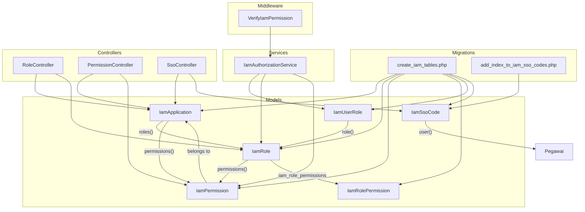
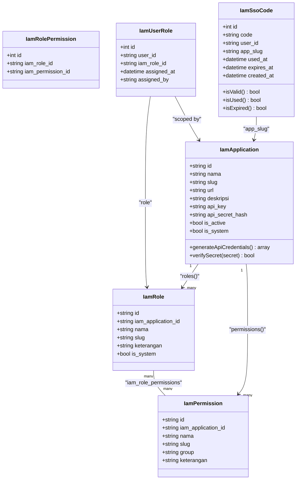
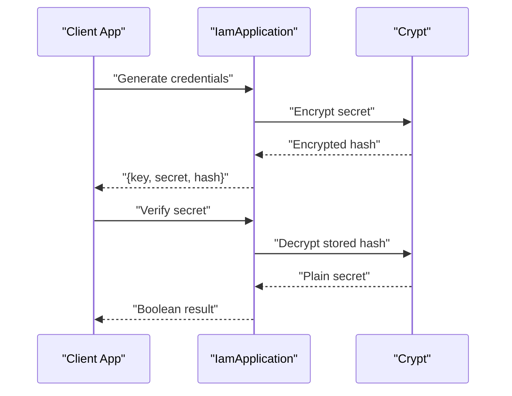
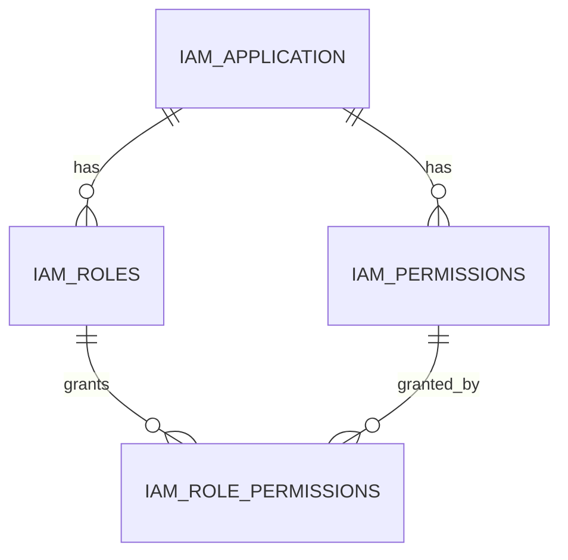
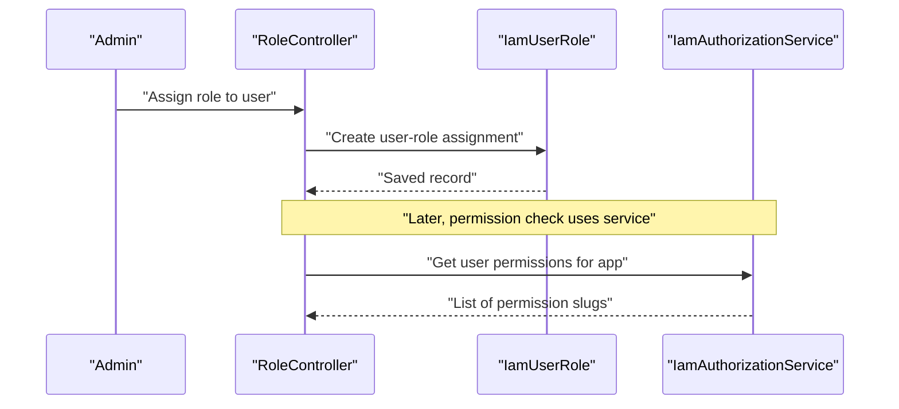
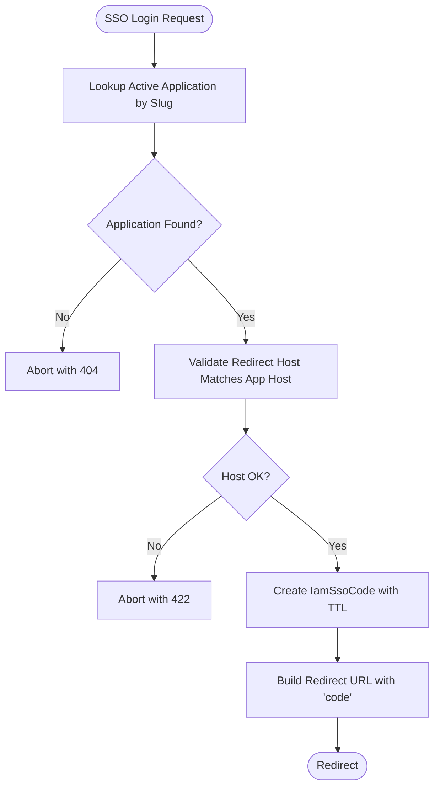
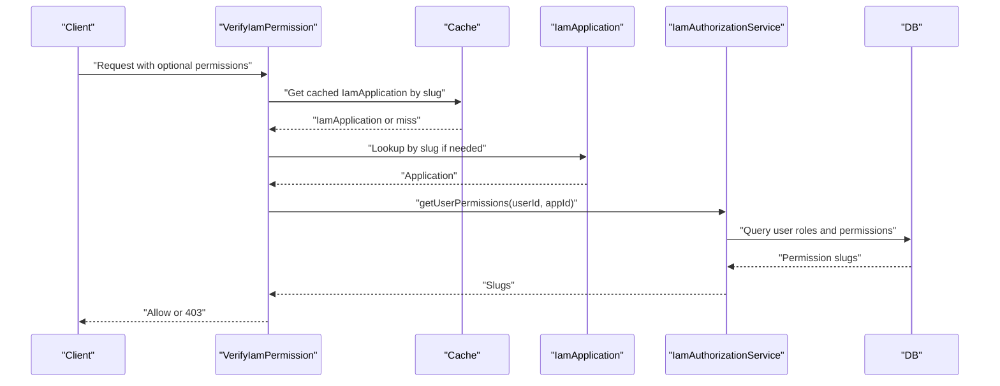
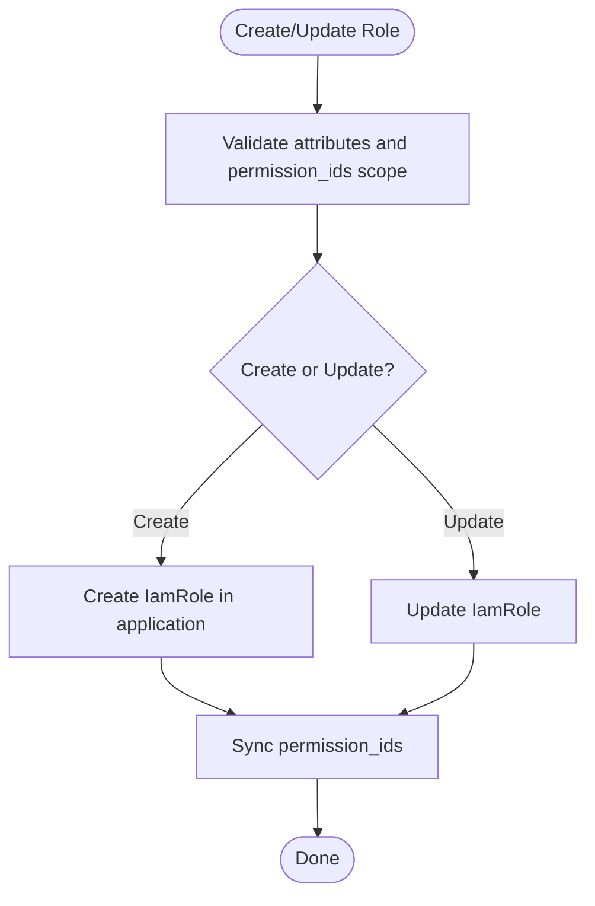
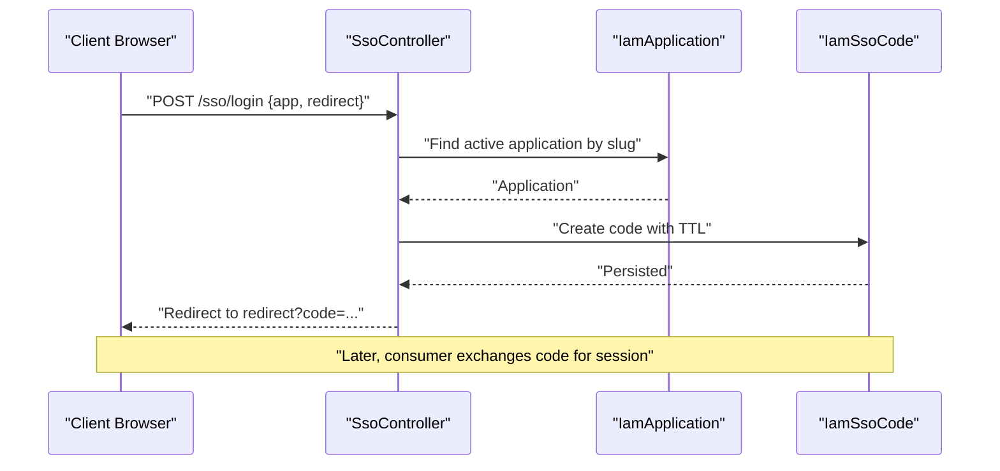
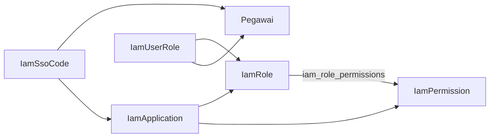

# IAM Models

<cite>
**Referenced Files in This Document**
- [IamApplication.php](file://app/Models/IamApplication.php)
- [IamPermission.php](file://app/Models/IamPermission.php)
- [IamRole.php](file://app/Models/IamRole.php)
- [IamRolePermission.php](file://app/Models/IamRolePermission.php)
- [IamUserRole.php](file://app/Models/IamUserRole.php)
- [IamSsoCode.php](file://app/Models/IamSsoCode.php)
- [create_iam_tables.php](file://database/migrations/2026_03_21_000001_create_iam_tables.php)
- [add_index_to_iam_sso_codes.php](file://database/migrations/2026_03_21_164400_add_index_to_iam_sso_codes.php)
- [IamAuthorizationService.php](file://app/Services/IamAuthorizationService.php)
- [VerifyIamPermission.php](file://app/Http/Middleware/VerifyIamPermission.php)
- [RoleController.php](file://app/Http/Controllers/Iam/RoleController.php)
- [PermissionController.php](file://app/Http/Controllers/Iam/PermissionController.php)
- [SsoController.php](file://app/Http/Controllers/SsoController.php)
- [IamValidateTest.php](file://tests/Feature/Iam/IamValidateTest.php)
- [IamModelsTest.php](file://tests/Feature/Iam/IamModelsTest.php)
- [iam.php](file://config/iam.php)
</cite>

## Table of Contents
1. [Introduction](#introduction)
2. [Project Structure](#project-structure)
3. [Core Components](#core-components)
4. [Architecture Overview](#architecture-overview)
5. [Detailed Component Analysis](#detailed-component-analysis)
6. [Dependency Analysis](#dependency-analysis)
7. [Performance Considerations](#performance-considerations)
8. [Troubleshooting Guide](#troubleshooting-guide)
9. [Conclusion](#conclusion)

## Introduction
This document describes the Identity and Access Management (IAM) data models used for multi-application authentication, role-based access control (RBAC), and single sign-on (SSO) session management. It focuses on:
- IamApplication for multi-application authentication and API credential management
- IamPermission and IamRole for RBAC
- IamRolePermission for permission-role relationships
- IamUserRole for user-role assignments
- IamSsoCode for SSO session tokens

It explains field definitions, security constraints, audit trails, and provides examples of permission validation, role assignment workflows, and SSO authentication flows.

## Project Structure
IAM models and supporting components are organized under:
- Models: app/Models/Iam*.php
- Migrations: database/migrations/*iam*.php
- Services: app/Services/IamAuthorizationService.php
- Middleware: app/Http/Middleware/VerifyIamPermission.php
- Controllers: app/Http/Controllers/Iam/* and app/Http/Controllers/SsoController.php
- Tests: tests/Feature/Iam/*
- Config: config/iam.php

**Diagram sources**
- [create_iam_tables.php:14-97](file://database/migrations/2026_03_21_000001_create_iam_tables.php#L14-L97)
- [add_index_to_iam_sso_codes.php:14-16](file://database/migrations/2026_03_21_164400_add_index_to_iam_sso_codes.php#L14-L16)
- [IamApplication.php:57-65](file://app/Models/IamApplication.php#L57-L65)
- [IamRole.php:23-36](file://app/Models/IamRole.php#L23-L36)
- [IamPermission.php:17-21](file://app/Models/IamPermission.php#L17-L21)
- [IamRolePermission.php:13-21](file://app/Models/IamRolePermission.php#L13-L21)
- [IamUserRole.php:18-31](file://app/Models/IamUserRole.php#L18-L31)
- [IamSsoCode.php:27-30](file://app/Models/IamSsoCode.php#L27-L30)
- [IamAuthorizationService.php:16-43](file://app/Services/IamAuthorizationService.php#L16-L43)
- [VerifyIamPermission.php:16-52](file://app/Http/Middleware/VerifyIamPermission.php#L16-L52)
- [RoleController.php:14-31](file://app/Http/Controllers/Iam/RoleController.php#L14-L31)
- [PermissionController.php:14-25](file://app/Http/Controllers/Iam/PermissionController.php#L14-L25)
- [SsoController.php:15-39](file://app/Http/Controllers/SsoController.php#L15-L39)

**Section sources**
- [create_iam_tables.php:14-97](file://database/migrations/2026_03_21_000001_create_iam_tables.php#L14-L97)
- [add_index_to_iam_sso_codes.php:14-16](file://database/migrations/2026_03_21_164400_add_index_to_iam_sso_codes.php#L14-L16)

## Core Components
This section documents each IAM model’s purpose, fields, relationships, and constraints.

- IamApplication
  - Purpose: Represents external applications integrated with the IAM system. Provides API credentials for HMAC signature verification.
  - Key fields: id, nama, slug, url, deskripsi, api_key, api_secret_hash, is_active, is_system, timestamps, soft deletes.
  - Security: api_secret_hash is encrypted and only decryptable for HMAC verification; hidden from JSON responses.
  - Behavior: Auto-generates api_key and api_secret_hash on creation; exposes generateApiCredentials and verifySecret helpers.
  - Relationships: Has many roles and permissions; belongs to none (root application entity).
  - Audit: Soft-deletes enabled; timestamps track creation/update/deletion.

- IamPermission
  - Purpose: Defines granular permissions scoped to an application.
  - Key fields: id, iam_application_id, nama, slug, group, keterangan, timestamps, soft deletes.
  - Constraints: Unique constraint on (iam_application_id, slug).
  - Relationships: Belongs to IamApplication.

- IamRole
  - Purpose: Groups permissions for assignment to users within an application.
  - Key fields: id, iam_application_id, nama, slug, keterangan, is_system, timestamps, soft deletes.
  - Constraints: Unique constraint on (iam_application_id, slug); boolean cast for is_system.
  - Relationships: Belongs to IamApplication; belongs to many IamPermission via iam_role_permissions.

- IamRolePermission
  - Purpose: Junction table linking roles to permissions.
  - Key fields: id, iam_role_id, iam_permission_id, timestamps.
  - Constraints: Unique constraint on (iam_role_id, iam_permission_id).

- IamUserRole
  - Purpose: Assigns roles to users (Pegawai) within an application context.
  - Key fields: id, user_id, iam_role_id, assigned_at, assigned_by, timestamps.
  - Constraints: Unique constraint on (user_id, iam_role_id); assigned_at defaults to current timestamp; assigned_by references another Pegawai.
  - Relationships: Belongs to IamRole; belongs to Pegawai (user) and assigned_by.

- IamSsoCode
  - Purpose: Stores short-lived SSO authorization codes for cross-application redirection.
  - Key fields: id, code, user_id, app_slug, used_at, expires_at, created_at.
  - Constraints: Unique code; app_slug indexed; updatedAt disabled (only created_at maintained).
  - Lifecycle: Tracks expiration and usage; supports pruning expired records older than 24 hours.

**Section sources**
- [IamApplication.php:12-95](file://app/Models/IamApplication.php#L12-L95)
- [IamPermission.php:9-21](file://app/Models/IamPermission.php#L9-L21)
- [IamRole.php:10-37](file://app/Models/IamRole.php#L10-L37)
- [IamRolePermission.php:7-22](file://app/Models/IamRolePermission.php#L7-L22)
- [IamUserRole.php:7-32](file://app/Models/IamUserRole.php#L7-L32)
- [IamSsoCode.php:9-52](file://app/Models/IamSsoCode.php#L9-L52)
- [create_iam_tables.php:14-97](file://database/migrations/2026_03_21_000001_create_iam_tables.php#L14-L97)

## Architecture Overview
IAM integrates three pillars:
- Multi-application authentication via IamApplication and HMAC signatures
- RBAC via IamRole and IamPermission with IamRolePermission as the bridge
- SSO via IamSsoCode for secure token exchange

**Diagram sources**
- [IamApplication.php:57-65](file://app/Models/IamApplication.php#L57-L65)
- [IamRole.php:28-36](file://app/Models/IamRole.php#L28-L36)
- [IamRolePermission.php:9-11](file://app/Models/IamRolePermission.php#L9-L11)
- [IamUserRole.php:9-11](file://app/Models/IamUserRole.php#L9-L11)
- [IamSsoCode.php:15-25](file://app/Models/IamSsoCode.php#L15-L25)

## Detailed Component Analysis

### IamApplication: Multi-application Authentication and API Credentials
- Responsibilities
  - Host identity for external applications
  - Generate and verify API credentials for HMAC signing
  - Enforce safe exposure of sensitive fields
- Fields and Security
  - api_key and api_secret_hash are unique and not exposed in JSON
  - verifySecret uses constant-time comparison against decrypted stored secret
- Lifecycle
  - Auto-generates credentials during creation if missing
  - Defaults is_system to false if unset
- Usage
  - Controllers and middleware rely on application lookup by slug
  - Used to compute HMAC signatures for API requests

**Diagram sources**
- [IamApplication.php:72-94](file://app/Models/IamApplication.php#L72-L94)

**Section sources**
- [IamApplication.php:16-26](file://app/Models/IamApplication.php#L16-L26)
- [IamApplication.php:33-50](file://app/Models/IamApplication.php#L33-L50)
- [IamApplication.php:85-94](file://app/Models/IamApplication.php#L85-L94)
- [IamModelsTest.php:41-68](file://tests/Feature/Iam/IamModelsTest.php#L41-L68)

### IamPermission and IamRole: RBAC Foundation
- IamPermission
  - Scoped to an application via iam_application_id
  - Unique slug per application ensures consistent permission identification
- IamRole
  - Groups permissions; scoped to an application
  - Unique slug per application; supports system roles flag
- IamRolePermission
  - Many-to-many junction with unique constraint to prevent duplicates

**Diagram sources**
- [create_iam_tables.php:28-66](file://database/migrations/2026_03_21_000001_create_iam_tables.php#L28-L66)
- [IamRole.php:28-36](file://app/Models/IamRole.php#L28-L36)
- [IamRolePermission.php:9-11](file://app/Models/IamRolePermission.php#L9-L11)

**Section sources**
- [IamPermission.php:13-21](file://app/Models/IamPermission.php#L13-L21)
- [IamRole.php:14-21](file://app/Models/IamRole.php#L14-L21)
- [create_iam_tables.php:42-66](file://database/migrations/2026_03_21_000001_create_iam_tables.php#L42-L66)

### IamUserRole: User-Role Assignment
- Purpose: Links a Pegawai user to an IamRole within a specific application context
- Constraints
  - Unique combination of user_id and iam_role_id
  - assigned_at defaults to current timestamp
  - assigned_by references another Pegawai (nullable)
- Relationships
  - Belongs to IamRole
  - Belongs to Pegawai (user) and assigned_by

**Diagram sources**
- [IamUserRole.php:9-11](file://app/Models/IamUserRole.php#L9-L11)
- [RoleController.php:14-31](file://app/Http/Controllers/Iam/RoleController.php#L14-L31)
- [IamAuthorizationService.php:16-26](file://app/Services/IamAuthorizationService.php#L16-L26)

**Section sources**
- [IamUserRole.php:9-16](file://app/Models/IamUserRole.php#L9-L16)
- [IamUserRole.php:18-31](file://app/Models/IamUserRole.php#L18-L31)
- [RoleController.php:14-31](file://app/Http/Controllers/Iam/RoleController.php#L14-L31)

### IamSsoCode: SSO Session Management
- Purpose: Issue short-lived authorization codes for cross-application SSO
- Fields and Lifecycle
  - code: unique 64-character token
  - user_id: references Pegawai
  - app_slug: target application identifier
  - used_at: marks consumption
  - expires_at: absolute expiry timestamp
  - created_at: issuance time
- Validation
  - isValid checks not expired and not used
  - Prunable records older than 24 hours
- Controller flow
  - Validates app and redirect host match
  - Generates code with TTL from config
  - Redirects to redirectUrl with code parameter

**Diagram sources**
- [SsoController.php:15-83](file://app/Http/Controllers/SsoController.php#L15-L83)
- [IamSsoCode.php:15-25](file://app/Models/IamSsoCode.php#L15-L25)
- [iam.php](file://config/iam.php#L6)

**Section sources**
- [IamSsoCode.php:13-25](file://app/Models/IamSsoCode.php#L13-L25)
- [IamSsoCode.php:32-45](file://app/Models/IamSsoCode.php#L32-L45)
- [SsoController.php:15-39](file://app/Http/Controllers/SsoController.php#L15-L39)
- [SsoController.php:60-83](file://app/Http/Controllers/SsoController.php#L60-L83)
- [iam.php](file://config/iam.php#L6)

### Permission Validation Workflow
- Middleware VerifyIamPermission
  - Resolves application by slug from config
  - Retrieves user permissions and roles via IamAuthorizationService
  - Enforces either presence of any role or specific permissions
- Service IamAuthorizationService
  - getUserPermissions aggregates permission slugs for a user in an application
  - getUserRoles aggregates role slugs for a user in an application

**Diagram sources**
- [VerifyIamPermission.php:16-52](file://app/Http/Middleware/VerifyIamPermission.php#L16-L52)
- [IamAuthorizationService.php:16-26](file://app/Services/IamAuthorizationService.php#L16-L26)
- [IamValidateTest.php:74-118](file://tests/Feature/Iam/IamValidateTest.php#L74-L118)

**Section sources**
- [VerifyIamPermission.php:16-52](file://app/Http/Middleware/VerifyIamPermission.php#L16-L52)
- [IamAuthorizationService.php:16-43](file://app/Services/IamAuthorizationService.php#L16-L43)
- [IamValidateTest.php:74-118](file://tests/Feature/Iam/IamValidateTest.php#L74-L118)

### Role Assignment Workflow
- Controller RoleController
  - Validates uniqueness of slug per application
  - Scopes permission_ids to the application
  - Syncs permissions to role after creation/update
- Data Integrity
  - Prevents modification/deletion of system roles
  - Enforces IDOR by checking ownership of role/application

**Diagram sources**
- [RoleController.php:14-51](file://app/Http/Controllers/Iam/RoleController.php#L14-L51)

**Section sources**
- [RoleController.php:14-51](file://app/Http/Controllers/Iam/RoleController.php#L14-L51)

### SSO Authentication Flow
- Controller SsoController
  - Validates app and redirect URL
  - Generates random 64-character code with TTL from config
  - Persists IamSsoCode and redirects to target with code
- Token Consumption
  - Subsequent flows consume the code, mark used_at, and enforce expiration

**Diagram sources**
- [SsoController.php:15-83](file://app/Http/Controllers/SsoController.php#L15-L83)
- [IamSsoCode.php:73-78](file://app/Models/IamSsoCode.php#L73-L78)
- [iam.php](file://config/iam.php#L6)

**Section sources**
- [SsoController.php:15-83](file://app/Http/Controllers/SsoController.php#L15-L83)
- [IamSsoCode.php:73-78](file://app/Models/IamSsoCode.php#L73-L78)

## Dependency Analysis
- Internal dependencies
  - IamRolePermission depends on IamRole and IamPermission
  - IamUserRole depends on IamRole and Pegawai
  - IamSsoCode depends on Pegawai and IamApplication via app_slug
- External dependencies
  - Cryptography for encrypt/decrypt and HMAC verification
  - Cache for application lookup
  - Database migrations define foreign keys and unique constraints

**Diagram sources**
- [create_iam_tables.php:56-97](file://database/migrations/2026_03_21_000001_create_iam_tables.php#L56-L97)
- [IamUserRole.php:18-31](file://app/Models/IamUserRole.php#L18-L31)
- [IamSsoCode.php:27-30](file://app/Models/IamSsoCode.php#L27-L30)

**Section sources**
- [create_iam_tables.php:56-97](file://database/migrations/2026_03_21_000001_create_iam_tables.php#L56-L97)

## Performance Considerations
- Indexing
  - IamSsoCode app_slug is indexed to accelerate lookups by application
- Caching
  - Application lookup by slug is cached for 1 hour to reduce repeated queries
- Querying
  - IamAuthorizationService aggregates permissions efficiently using eager loading and flatMap
- Pruning
  - IamSsoCode supports pruning to keep database size bounded

**Section sources**
- [add_index_to_iam_sso_codes.php:14-16](file://database/migrations/2026_03_21_164400_add_index_to_iam_sso_codes.php#L14-L16)
- [VerifyIamPermission.php:27-30](file://app/Http/Middleware/VerifyIamPermission.php#L27-L30)
- [IamAuthorizationService.php:18-25](file://app/Services/IamAuthorizationService.php#L18-L25)
- [IamSsoCode.php:48-51](file://app/Models/IamSsoCode.php#L48-L51)

## Troubleshooting Guide
- Application not found during SSO
  - Ensure the app slug exists and is_active is true
  - Confirm redirect host matches application URL host
- Permission validation fails
  - Verify user has at least one role in the application
  - Confirm requested permission slugs exist and belong to the application
- SSO code invalid or expired
  - Check expires_at and ensure code was not used (used_at is null)
  - Confirm TTL aligns with config setting
- API signature errors
  - Ensure X-App-Key matches api_key
  - Recompute HMAC using the decrypted api_secret_hash and correct payload format

**Section sources**
- [SsoController.php:26-30](file://app/Http/Controllers/SsoController.php#L26-L30)
- [SsoController.php:62-68](file://app/Http/Controllers/SsoController.php#L62-L68)
- [VerifyIamPermission.php:32-34](file://app/Http/Middleware/VerifyIamPermission.php#L32-L34)
- [IamSsoCode.php:32-45](file://app/Models/IamSsoCode.php#L32-L45)
- [IamValidateTest.php:94-118](file://tests/Feature/Iam/IamValidateTest.php#L94-L118)

## Conclusion
The IAM models provide a robust foundation for multi-application authentication, fine-grained RBAC, and secure SSO. The design emphasizes:
- Strong cryptographic handling of secrets and signatures
- Clear scoping of permissions and roles to applications
- Efficient querying and caching for runtime checks
- Safe lifecycle management for SSO codes with pruning

These components work together to support secure, scalable identity and access management across applications.