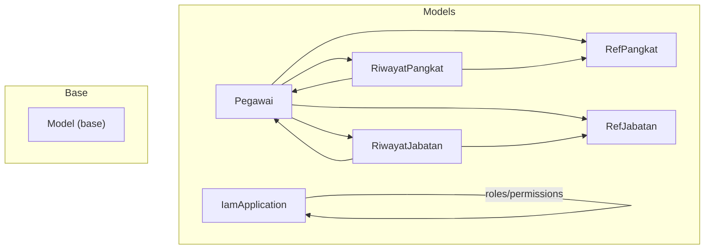
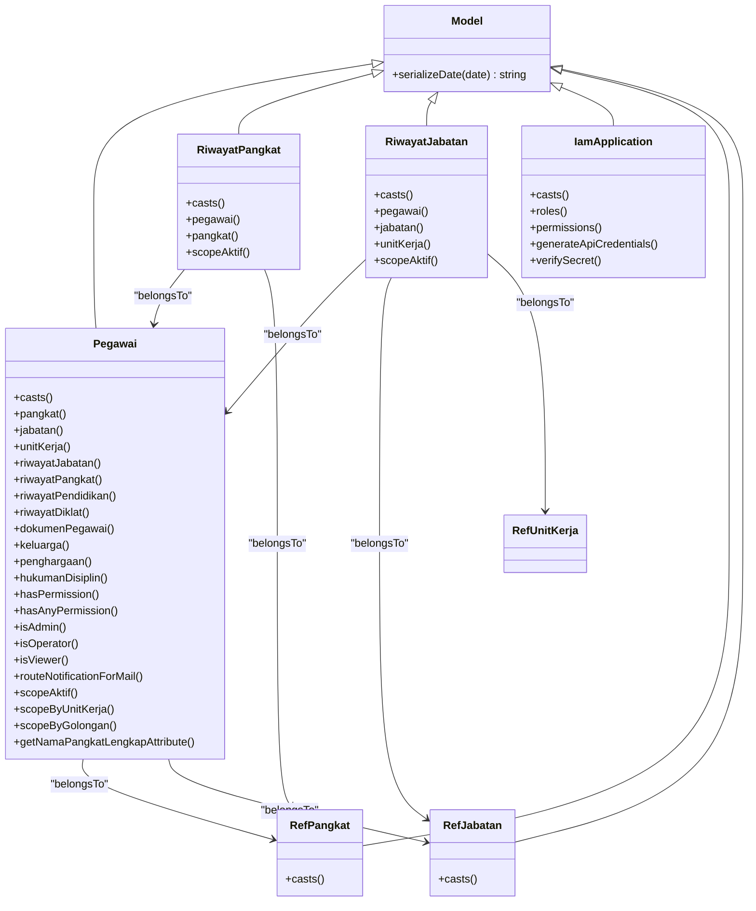
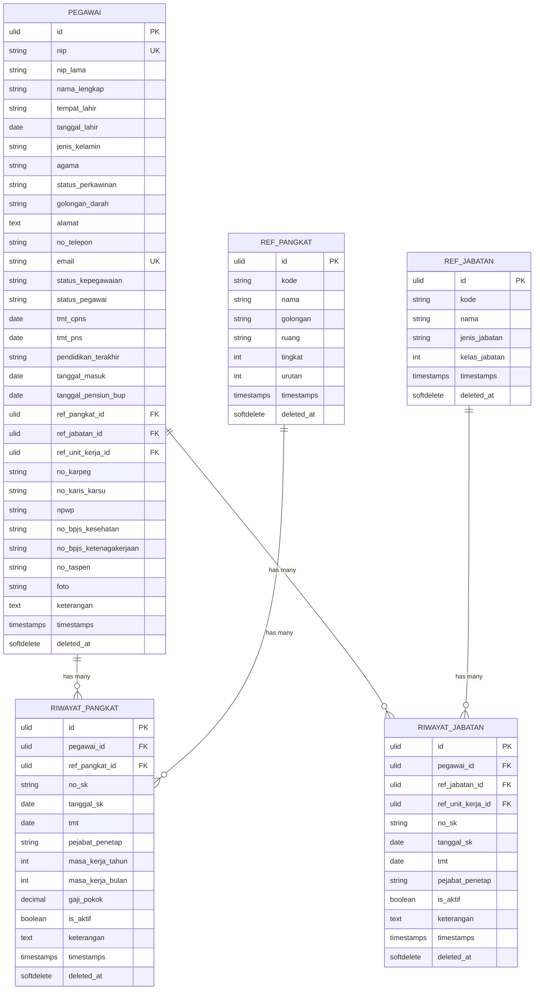
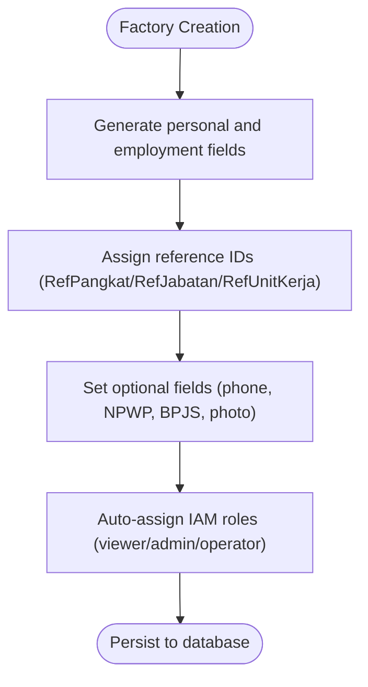
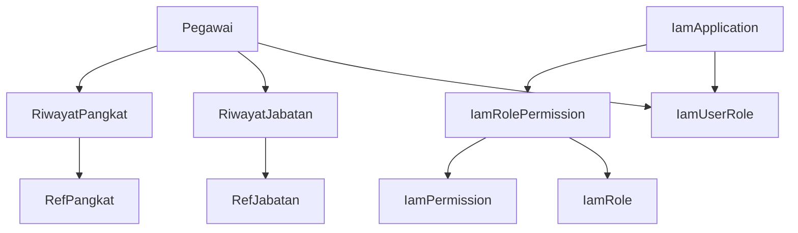

# Model Layer

<cite>
**Referenced Files in This Document**
- [Pegawai.php](file://app/Models/Pegawai.php)
- [RiwayatPangkat.php](file://app/Models/RiwayatPangkat.php)
- [RiwayatJabatan.php](file://app/Models/RiwayatJabatan.php)
- [IamApplication.php](file://app/Models/IamApplication.php)
- [Model.php](file://app/Models/Model.php)
- [RefPangkat.php](file://app/Models/RefPangkat.php)
- [RefJabatan.php](file://app/Models/RefJabatan.php)
- [create_pegawai_table.php](file://database/migrations/2026_03_15_024651_create_pegawai_table.php)
- [create_riwayat_jabatan_table.php](file://database/migrations/2026_03_15_030540_create_riwayat_jabatan_table.php)
- [create_riwayat_pangkat_table.php](file://database/migrations/2026_03_15_031012_create_riwayat_pangkat_table.php)
- [create_iam_tables.php](file://database/migrations/2026_03_21_000001_create_iam_tables.php)
- [PegawaiFactory.php](file://database/factories/PegawaiFactory.php)
- [RiwayatPangkatFactory.php](file://database/factories/RiwayatPangkatFactory.php)
- [RiwayatJabatanFactory.php](file://database/factories/RiwayatJabatanFactory.php)
- [IamApplicationFactory.php](file://database/factories/IamApplicationFactory.php)
- [JenisKelamin.php](file://app/Enums/JenisKelamin.php)
- [Agama.php](file://app/Enums/Agama.php)
- [StatusPegawai.php](file://app/Enums/StatusPegawai.php)
</cite>

## Table of Contents
1. [Introduction](#introduction)
2. [Project Structure](#project-structure)
3. [Core Components](#core-components)
4. [Architecture Overview](#architecture-overview)
5. [Detailed Component Analysis](#detailed-component-analysis)
6. [Dependency Analysis](#dependency-analysis)
7. [Performance Considerations](#performance-considerations)
8. [Troubleshooting Guide](#troubleshooting-guide)
9. [Conclusion](#conclusion)

## Introduction
This document provides comprehensive data model documentation for the Model Layer built on Laravel Eloquent ORM. It focuses on four primary models: Pegawai, RiwayatPangkat, RiwayatJabatan, and IamApplication. The documentation covers entity relationships, field definitions, data types, primary/foreign keys, indexes, constraints, validation rules, accessors, mutators, scopes, and relationship methods. It also includes database schema diagrams, sample data patterns, data access patterns, query optimization strategies, lifecycle management (soft deletes), and practical usage examples in controllers and services.

## Project Structure
The Model Layer is organized under app/Models with supporting enums, traits, and factories under database/factories. Migrations define the relational schema and constraints. The base Model class centralizes serialization behavior for consistent date/time output.



**Diagram sources**
- [Pegawai.php:24-209](file://app/Models/Pegawai.php#L24-L209)
- [RiwayatPangkat.php:11-59](file://app/Models/RiwayatPangkat.php#L11-L59)
- [RiwayatJabatan.php:11-59](file://app/Models/RiwayatJabatan.php#L11-L59)
- [IamApplication.php:12-96](file://app/Models/IamApplication.php#L12-L96)
- [RefPangkat.php:10-34](file://app/Models/RefPangkat.php#L10-L34)
- [RefJabatan.php:11-35](file://app/Models/RefJabatan.php#L11-L35)
- [Model.php:8-19](file://app/Models/Model.php#L8-L19)

**Section sources**
- [Pegawai.php:24-209](file://app/Models/Pegawai.php#L24-L209)
- [RiwayatPangkat.php:11-59](file://app/Models/RiwayatPangkat.php#L11-L59)
- [RiwayatJabatan.php:11-59](file://app/Models/RiwayatJabatan.php#L11-L59)
- [IamApplication.php:12-96](file://app/Models/IamApplication.php#L12-L96)
- [Model.php:8-19](file://app/Models/Model.php#L8-L19)

## Core Components
This section documents the four core models with their fields, casts, relationships, scopes, and special behaviors.

- Pegawai
  - Purpose: Core employee entity with authentication capabilities and soft deletes.
  - Key fields: identifiers, personal info, contact, employment status, dates, foreign keys to reference tables, and system-related fields.
  - Casts: date fields, enum casts for gender, religion, marital status, blood type, employment status, and boolean/password/date/time fields.
  - Relationships:
    - BelongsTo: RefPangkat (pangkat), RefJabatan (jabatan), RefUnitKerja (unitKerja).
    - HasMany: RiwayatJabatan, RiwayatPendidikan, RiwayatDiklat, RiwayatPangkat, DokumenPegawai, Keluarga, Penghargaan, HukumanDisiplin.
    - Many-to-many: IamRole via IamUserRole (pivot includes assignment timestamp).
  - Scopes: aktif, byUnitKerja, byGolongan.
  - Accessors: namaPangkatLengkapAttribute.
  - Special behaviors: permission checks via IAM roles, notification routing via routeNotificationForMail, soft deletes.

- RiwayatPangkat
  - Purpose: Records employee rank history with active flag and financial details.
  - Fields: foreign key to Pegawai, foreign key to RefPangkat, SK number and dates, TMT, issuing officer, work seniority, basic salary, active flag, and notes.
  - Casts: date fields, integer seniority, decimal salary, boolean active, datetime deleted_at.
  - Relationships: BelongsTo Pegawai, BelongsTo RefPangkat.
  - Scopes: aktif.

- RiwayatJabatan
  - Purpose: Records job position history with active flag and unit assignment.
  - Fields: foreign key to Pegawai, foreign keys to RefJabatan and RefUnitKerja, SK number and dates, TMT, issuing officer, active flag, and notes.
  - Casts: date fields, boolean active, datetime deleted_at.
  - Relationships: BelongsTo Pegawai, BelongsTo RefJabatan, BelongsTo RefUnitKerja.
  - Scopes: aktif.

- IamApplication
  - Purpose: IAM application registry with API credentials and role/permission management.
  - Fields: name, slug, URL, description, API key, encrypted API secret hash, activation/system flags.
  - Hidden fields: api_secret_hash.
  - Casts: boolean flags.
  - Relationships: HasMany IamRole, HasMany IamPermission.
  - Lifecycle: boot() auto-generates API credentials and default flags during creation.
  - Methods: generateApiCredentials(), verifySecret() using constant-time comparison.

**Section sources**
- [Pegawai.php:24-209](file://app/Models/Pegawai.php#L24-L209)
- [RiwayatPangkat.php:11-59](file://app/Models/RiwayatPangkat.php#L11-L59)
- [RiwayatJabatan.php:11-59](file://app/Models/RiwayatJabatan.php#L11-L59)
- [IamApplication.php:12-96](file://app/Models/IamApplication.php#L12-L96)

## Architecture Overview
The model layer integrates:
- Eloquent ORM with ULIDs as primary keys.
- Soft deletes across most models.
- Enum casts for domain-specific fields.
- IAM integration for permissions and roles.
- Reference tables (RefPangkat, RefJabatan) for standardized metadata.



**Diagram sources**
- [Model.php:8-19](file://app/Models/Model.php#L8-L19)
- [Pegawai.php:24-209](file://app/Models/Pegawai.php#L24-L209)
- [RiwayatPangkat.php:11-59](file://app/Models/RiwayatPangkat.php#L11-L59)
- [RiwayatJabatan.php:11-59](file://app/Models/RiwayatJabatan.php#L11-L59)
- [IamApplication.php:12-96](file://app/Models/IamApplication.php#L12-L96)
- [RefPangkat.php:10-34](file://app/Models/RefPangkat.php#L10-L34)
- [RefJabatan.php:11-35](file://app/Models/RefJabatan.php#L11-L35)

## Detailed Component Analysis

### Database Schema and Constraints
This section maps the physical schema to logical models and highlights primary keys, foreign keys, indexes, and constraints.



**Diagram sources**
- [create_pegawai_table.php:14-48](file://database/migrations/2026_03_15_024651_create_pegawai_table.php#L14-L48)
- [create_riwayat_pangkat_table.php:14-29](file://database/migrations/2026_03_15_031012_create_riwayat_pangkat_table.php#L14-L29)
- [create_riwayat_jabatan_table.php:14-27](file://database/migrations/2026_03_15_030540_create_riwayat_jabatan_table.php#L14-L27)
- [RefPangkat.php:15-32](file://app/Models/RefPangkat.php#L15-L32)
- [RefJabatan.php:16-32](file://app/Models/RefJabatan.php#L16-L32)

**Section sources**
- [create_pegawai_table.php:14-48](file://database/migrations/2026_03_15_024651_create_pegawai_table.php#L14-L48)
- [create_riwayat_pangkat_table.php:14-29](file://database/migrations/2026_03_15_031012_create_riwayat_pangkat_table.php#L14-L29)
- [create_riwayat_jabatan_table.php:14-27](file://database/migrations/2026_03_15_030540_create_riwayat_jabatan_table.php#L14-L27)
- [RefPangkat.php:15-32](file://app/Models/RefPangkat.php#L15-L32)
- [RefJabatan.php:16-32](file://app/Models/RefJabatan.php#L16-L32)

### IAM Application Schema and Relationships
IAM introduces application-level roles and permissions with a dedicated pivot table for user-role assignments and SSO codes.

```mermaid
erDiagram
IAM_APPLICATIONS {
ulid id PK
string nama
string slug UK
string url
text deskripsi
string api_key UK
string api_secret_hash
boolean is_active
boolean is_system
timestamps timestamps
softdelete deleted_at
}
IAM_ROLES {
ulid id PK
ulid iam_application_id FK
string nama
string slug
text keterangan
boolean is_system
timestamps timestamps
softdelete deleted_at
unique iam_application_id+slug
}
IAM_PERMISSIONS {
ulid id PK
ulid iam_application_id FK
string nama
string slug
string group
text keterangan
timestamps timestamps
softdelete deleted_at
unique iam_application_id+slug
}
IAM_ROLE_PERMISSIONS {
id PK
ulid iam_role_id FK
ulid iam_permission_id FK
timestamps timestamps
unique iam_role_id+iam_permission_id
}
IAM_USER_ROLES {
id PK
char user_id FK
ulid iam_role_id FK
timestamp assigned_at
char assigned_by FK
timestamps timestamps
unique user_id+iam_role_id
}
IAM_SSO_CODES {
id PK
string code UK
char user_id FK
string app_slug
timestamp used_at
timestamp expires_at
timestamp created_at
}
IAM_APPLICATIONS ||--o{ IAM_ROLES : "has many"
IAM_APPLICATIONS ||--o{ IAM_PERMISSIONS : "has many"
IAM_ROLES ||--o{ IAM_ROLE_PERMISSIONS : "has many"
IAM_PERMISSIONS ||--o{ IAM_ROLE_PERMISSIONS : "has many"
PEGAWAI ||--o{ IAM_USER_ROLES : "has many"
IAM_ROLES ||--o{ IAM_USER_ROLES : "belongs to many"
```

**Diagram sources**
- [create_iam_tables.php:14-98](file://database/migrations/2026_03_21_000001_create_iam_tables.php#L14-L98)

**Section sources**
- [create_iam_tables.php:14-98](file://database/migrations/2026_03_21_000001_create_iam_tables.php#L14-L98)
- [IamApplication.php:12-96](file://app/Models/IamApplication.php#L12-L96)

### Data Validation Rules and Accessors/Mutators
- Validation rules are enforced via FormRequest classes in app/Http/Requests. These requests validate incoming data before reaching models.
- Accessors and mutators:
  - Pegawai accessor: namaPangkatLengkapAttribute constructs a formatted string combining rank name and code when available.
  - Base Model serialization: serializeDate ensures consistent datetime formatting for JSON responses.
  - Enum casts: fields like jenis_kelamin, agama, status_perkawinan, golongan_darah, status_kepegawaian, status_pegawai are cast to enums for type safety and consistent representation.

**Section sources**
- [Pegawai.php:198-208](file://app/Models/Pegawai.php#L198-L208)
- [Model.php:14-17](file://app/Models/Model.php#L14-L17)
- [JenisKelamin.php:5-17](file://app/Enums/JenisKelamin.php#L5-L17)
- [Agama.php:5-25](file://app/Enums/Agama.php#L5-L25)
- [StatusPegawai.php:5-23](file://app/Enums/StatusPegawai.php#L5-L23)

### Sample Data Patterns
Factories demonstrate realistic sample data generation for models:
- PegawaiFactory: Generates realistic personal and employment details, assigns default viewer role, and supports admin/operator/viewer role assignments.
- RiwayatPangkatFactory: Creates rank history entries with SK numbers, dates, TMT, seniority, and salary.
- RiwayatJabatanFactory: Creates job history entries with unit assignments and active flags.
- IamApplicationFactory: Produces application records with generated API credentials and optional system/inactive states.



**Diagram sources**
- [PegawaiFactory.php:28-102](file://database/factories/PegawaiFactory.php#L28-L102)
- [RiwayatPangkatFactory.php:20-35](file://database/factories/RiwayatPangkatFactory.php#L20-L35)
- [RiwayatJabatanFactory.php:21-34](file://database/factories/RiwayatJabatanFactory.php#L21-L34)
- [IamApplicationFactory.php:21-36](file://database/factories/IamApplicationFactory.php#L21-L36)

**Section sources**
- [PegawaiFactory.php:28-162](file://database/factories/PegawaiFactory.php#L28-L162)
- [RiwayatPangkatFactory.php:20-37](file://database/factories/RiwayatPangkatFactory.php#L20-L37)
- [RiwayatJabatanFactory.php:21-36](file://database/factories/RiwayatJabatanFactory.php#L21-L36)
- [IamApplicationFactory.php:21-69](file://database/factories/IamApplicationFactory.php#L21-L69)

### Data Access Patterns and Query Optimization
- Eager loading: Use with() for relationships to prevent N+1 queries (e.g., load riwayatJabatan with pegawai).
- Scopes: Employ scopeAktif, scopeByUnitKerja, and scopeByGolongan to encapsulate common filters.
- Indexes: Unique constraints on nip and email in pegawai; unique composite indexes on iam_roles(slug, iam_application_id) and iam_permissions(slug, iam_application_id); unique indexes on iam_user_roles(user_id, iam_role_id).
- Soft deletes: All relevant models support soft deletes; ensure queries account for deleted_at when needed.
- Enum casts: Reduce ambiguity and improve query readability by casting categorical fields to enums.

**Section sources**
- [Pegawai.php:179-196](file://app/Models/Pegawai.php#L179-L196)
- [RiwayatPangkat.php:54-57](file://app/Models/RiwayatPangkat.php#L54-L57)
- [RiwayatJabatan.php:54-57](file://app/Models/RiwayatJabatan.php#L54-L57)
- [create_pegawai_table.php:16-27](file://database/migrations/2026_03_15_024651_create_pegawai_table.php#L16-L27)
- [create_iam_tables.php:39](file://database/migrations/2026_03_21_000001_create_iam_tables.php#L39)
- [create_iam_tables.php:53](file://database/migrations/2026_03_21_000001_create_iam_tables.php#L53)

### Data Lifecycle Management, Soft Deletes, and Audit Trails
- Soft deletes: Implemented across pegawai, riwayat_pangkat, riwayat_jabatan, and IAM tables. Use onlyTrashed() and withTrashed() to manage lifecycle.
- Audit considerations: Base Model serialization ensures consistent datetime formatting for JSON responses, aiding audit log readability.

**Section sources**
- [create_pegawai_table.php:47](file://database/migrations/2026_03_15_024651_create_pegawai_table.php#L47)
- [create_riwayat_pangkat_table.php:28](file://database/migrations/2026_03_15_031012_create_riwayat_pangkat_table.php#L28)
- [create_riwayat_jabatan_table.php:26](file://database/migrations/2026_03_15_030540_create_riwayat_jabatan_table.php#L26)
- [create_iam_tables.php:25](file://database/migrations/2026_03_21_000001_create_iam_tables.php#L25)
- [create_iam_tables.php:38](file://database/migrations/2026_03_21_000001_create_iam_tables.php#L38)
- [create_iam_tables.php:52](file://database/migrations/2026_03_21_000001_create_iam_tables.php#L52)
- [Model.php:14-17](file://app/Models/Model.php#L14-L17)

### Practical Examples in Controllers and Services
- Controllers commonly:
  - Use FormRequest classes to validate input before model creation/update.
  - Apply scopes (e.g., scopeAktif) to filter employees.
  - Eager-load relationships (e.g., riwayatJabatan, riwayatPangkat) to avoid N+1 queries.
- Services:
  - Encapsulate business logic for generating API credentials for IamApplication.
  - Implement permission checks via Pegawai::hasPermission() or hasAnyPermission() for IAM-aware authorization.

Note: Specific controller/service code is outside the referenced files; consult controller actions and service classes for concrete usage patterns.

## Dependency Analysis
This section maps model dependencies and relationships across the system.



**Diagram sources**
- [Pegawai.php:69-137](file://app/Models/Pegawai.php#L69-L137)
- [RiwayatPangkat.php:44-52](file://app/Models/RiwayatPangkat.php#L44-L52)
- [RiwayatJabatan.php:39-52](file://app/Models/RiwayatJabatan.php#L39-L52)
- [create_iam_tables.php:56-84](file://database/migrations/2026_03_21_000001_create_iam_tables.php#L56-L84)

**Section sources**
- [Pegawai.php:69-137](file://app/Models/Pegawai.php#L69-L137)
- [RiwayatPangkat.php:44-52](file://app/Models/RiwayatPangkat.php#L44-L52)
- [RiwayatJabatan.php:39-52](file://app/Models/RiwayatJabatan.php#L39-L52)
- [create_iam_tables.php:56-84](file://database/migrations/2026_03_21_000001_create_iam_tables.php#L56-L84)

## Performance Considerations
- Prefer eager loading with select() to limit columns when possible.
- Use scopes to encapsulate frequently used filters.
- Leverage enum casts to reduce string comparisons and improve query clarity.
- Soft deletes require careful joins; use withTrashed() or onlyTrashed() when necessary.
- Index unique constraints on frequently filtered fields (nip, email) to speed up lookups.

## Troubleshooting Guide
- Permission checks failing:
  - Ensure the user has an assigned IAM role via IamUserRole and that the role has associated permissions.
  - Verify slug values align with expected permission slugs.
- API credential verification failures:
  - Confirm api_secret_hash was generated and stored correctly.
  - Use verifySecret() method for constant-time comparison; avoid plain equality checks.
- Soft delete visibility:
  - When querying, include withTrashed() or check trashed records with onlyTrashed().

**Section sources**
- [Pegawai.php:141-168](file://app/Models/Pegawai.php#L141-L168)
- [IamApplication.php:85-94](file://app/Models/IamApplication.php#L85-L94)

## Conclusion
The Model Layer leverages Eloquent’s strengths with ULIDs, soft deletes, enum casts, and scopes to provide a robust, maintainable foundation. The documented relationships, constraints, and access patterns enable efficient querying and secure IAM integration. Following the recommended access patterns and performance tips ensures scalable operation across the application.