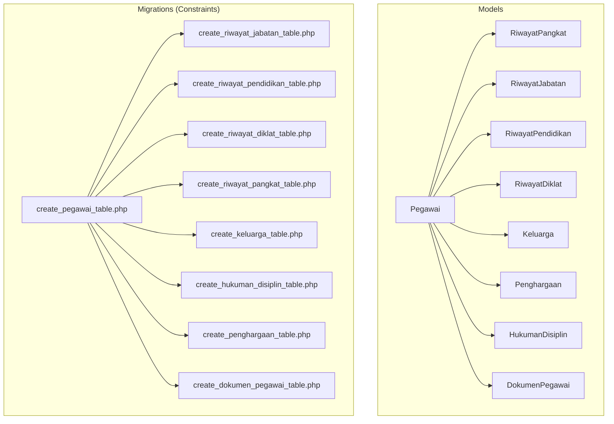
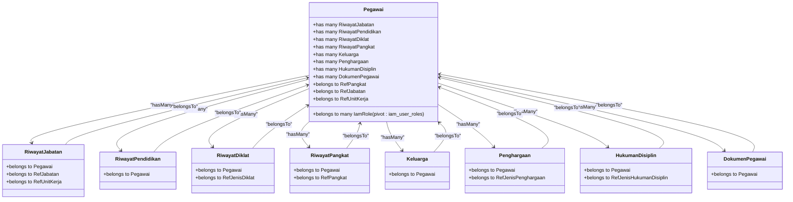
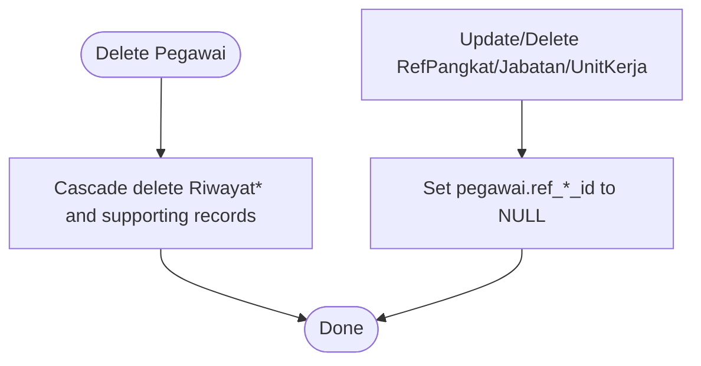

# Model Relationships

<cite>
**Referenced Files in This Document**
- [Pegawai.php](file://app/Models/Pegawai.php)
- [RiwayatPangkat.php](file://app/Models/RiwayatPangkat.php)
- [RiwayatJabatan.php](file://app/Models/RiwayatJabatan.php)
- [RiwayatPendidikan.php](file://app/Models/RiwayatPendidikan.php)
- [RiwayatDiklat.php](file://app/Models/RiwayatDiklat.php)
- [Keluarga.php](file://app/Models/Keluarga.php)
- [Penghargaan.php](file://app/Models/Penghargaan.php)
- [HukumanDisiplin.php](file://app/Models/HukumanDisiplin.php)
- [DokumenPegawai.php](file://app/Models/DokumenPegawai.php)
- [create_pegawai_table.php](file://database/migrations/2026_03_15_024651_create_pegawai_table.php)
- [create_riwayat_jabatan_table.php](file://database/migrations/2026_03_15_030540_create_riwayat_jabatan_table.php)
- [create_riwayat_pendidikan_table.php](file://database/migrations/2026_03_15_030821_create_riwayat_pendidikan_table.php)
- [create_riwayat_diklat_table.php](file://database/migrations/2026_03_15_030915_create_riwayat_diklat_table.php)
- [create_riwayat_pangkat_table.php](file://database/migrations/2026_03_15_031012_create_riwayat_pangkat_table.php)
- [create_keluarga_table.php](file://database/migrations/2026_03_15_032415_create_keluarga_table.php)
- [create_hukuman_disiplin_table.php](file://database/migrations/2026_03_15_032715_create_hukuman_disiplin_table.php)
- [create_penghargaan_table.php](file://database/migrations/2026_03_15_032747_create_penghargaan_table.php)
- [create_dokumen_pegawai_table.php](file://database/migrations/2026_03_15_032846_create_dokumen_pegawai_table.php)
</cite>

## Table of Contents
1. [Introduction](#introduction)
2. [Project Structure](#project-structure)
3. [Core Components](#core-components)
4. [Architecture Overview](#architecture-overview)
5. [Detailed Component Analysis](#detailed-component-analysis)
6. [Dependency Analysis](#dependency-analysis)
7. [Performance Considerations](#performance-considerations)
8. [Troubleshooting Guide](#troubleshooting-guide)
9. [Conclusion](#conclusion)

## Introduction
This document explains the Eloquent model relationships and database constraints centered on the Pegawai model. It covers how Pegawai relates to RiwayatPangkat, RiwayatJabatan, RiwayatPendidikan, RiwayatDiklat, Keluarga, Penghargaan, HukumanDisiplin, and DokumenPegawai. It also documents many-to-one (belongsTo), one-to-many (hasMany), many-to-many (belongsToMany), and soft-delete behaviors. Cascade deletion rules are derived from migration foreign keys. Finally, it provides relationship query patterns, eager loading strategies, and performance optimization techniques.

## Project Structure
The relevant models and their migrations are organized under app/Models and database/migrations respectively. Each related model defines a belongsTo relationship to Pegawai, and the migrations define foreign key constraints and cascade behaviors.

**Diagram sources**
- [Pegawai.php:24-137](file://app/Models/Pegawai.php#L24-L137)
- [RiwayatPangkat.php:11-52](file://app/Models/RiwayatPangkat.php#L11-L52)
- [RiwayatJabatan.php:11-52](file://app/Models/RiwayatJabatan.php#L11-L52)
- [RiwayatPendidikan.php:11-41](file://app/Models/RiwayatPendidikan.php#L11-L41)
- [RiwayatDiklat.php:10-50](file://app/Models/RiwayatDiklat.php#L10-L50)
- [Keluarga.php:12-44](file://app/Models/Keluarga.php#L12-L44)
- [Penghargaan.php:10-43](file://app/Models/Penghargaan.php#L10-L43)
- [HukumanDisiplin.php:11-47](file://app/Models/HukumanDisiplin.php#L11-L47)
- [DokumenPegawai.php:10-37](file://app/Models/DokumenPegawai.php#L10-L37)
- [create_pegawai_table.php:14-48](file://database/migrations/2026_03_15_024651_create_pegawai_table.php#L14-L48)
- [create_riwayat_jabatan_table.php:14-27](file://database/migrations/2026_03_15_030540_create_riwayat_jabatan_table.php#L14-L27)
- [create_riwayat_pendidikan_table.php:14-26](file://database/migrations/2026_03_15_030821_create_riwayat_pendidikan_table.php#L14-L26)
- [create_riwayat_diklat_table.php:14-29](file://database/migrations/2026_03_15_030915_create_riwayat_diklat_table.php#L14-L29)
- [create_riwayat_pangkat_table.php:14-29](file://database/migrations/2026_03_15_031012_create_riwayat_pangkat_table.php#L14-L29)
- [create_keluarga_table.php:14-27](file://database/migrations/2026_03_15_032415_create_keluarga_table.php#L14-L27)
- [create_hukuman_disiplin_table.php:14-27](file://database/migrations/2026_03_15_032715_create_hukuman_disiplin_table.php#L14-L27)
- [create_penghargaan_table.php:14-25](file://database/migrations/2026_03_15_032747_create_penghargaan_table.php#L14-L25)
- [create_dokumen_pegawai_table.php:11-21](file://database/migrations/2026_03_15_032846_create_dokumen_pegawai_table.php#L11-L21)

**Section sources**
- [Pegawai.php:24-137](file://app/Models/Pegawai.php#L24-L137)
- [create_pegawai_table.php:14-48](file://database/migrations/2026_03_15_024651_create_pegawai_table.php#L14-L48)

## Core Components
- Pegawai is the central model with multiple hasMany relationships to riwayat and supporting records, plus several belongsTo relationships to reference tables (pangkat, jabatan, unit kerja). It also exposes many-to-many relationships via IAM roles.
- Each related model defines a belongsTo relationship back to Pegawai, and migrations enforce foreign keys with cascade-on-delete for most child tables.

Key relationship patterns:
- belongsTo: Pegawai references RefPangkat, RefJabatan, RefUnitKerja via foreign keys.
- hasMany: Pegawai has many Riwayat* and supporting records.
- belongsToMany: Pegawai participates in IAM role assignments via pivot table iam_user_roles.

Cascade behaviors observed from migrations:
- RiwayatJabatan, RiwayatPendidikan, RiwayatDiklat, RiwayatPangkat, Keluarga, HukumanDisiplin, Penghargaan, DokumenPegawai: foreign key pegawai_id uses cascadeOnDelete.
- Reference foreign keys on Pegawai (ref_pangkat_id, ref_jabatan_id, ref_unit_kerja_id) use nullOnDelete.

**Section sources**
- [Pegawai.php:69-82](file://app/Models/Pegawai.php#L69-L82)
- [Pegawai.php:99-137](file://app/Models/Pegawai.php#L99-L137)
- [create_riwayat_jabatan_table.php:16](file://database/migrations/2026_03_15_030540_create_riwayat_jabatan_table.php#L16)
- [create_riwayat_pendidikan_table.php:16](file://database/migrations/2026_03_15_030821_create_riwayat_pendidikan_table.php#L16)
- [create_riwayat_diklat_table.php:16](file://database/migrations/2026_03_15_030915_create_riwayat_diklat_table.php#L16)
- [create_riwayat_pangkat_table.php:16](file://database/migrations/2026_03_15_031012_create_riwayat_pangkat_table.php#L16)
- [create_keluarga_table.php:16](file://database/migrations/2026_03_15_032415_create_keluarga_table.php#L16)
- [create_hukuman_disiplin_table.php:16](file://database/migrations/2026_03_15_032715_create_hukuman_disiplin_table.php#L16)
- [create_penghargaan_table.php:16](file://database/migrations/2026_03_15_032747_create_penghargaan_table.php#L16)
- [create_dokumen_pegawai_table.php:13](file://database/migrations/2026_03_15_032846_create_dokumen_pegawai_table.php#L13)
- [create_pegawai_table.php:35-37](file://database/migrations/2026_03_15_024651_create_pegawai_table.php#L35-L37)

## Architecture Overview
The relationships form a hub-and-spoke pattern around Pegawai. All “riwayat” and supporting records are children of Pegawai and inherit cascade deletion. Reference relationships on Pegawai point to static reference tables.

**Diagram sources**
- [Pegawai.php:69-137](file://app/Models/Pegawai.php#L69-L137)
- [RiwayatJabatan.php:39-52](file://app/Models/RiwayatJabatan.php#L39-L52)
- [RiwayatPendidikan.php:37-41](file://app/Models/RiwayatPendidikan.php#L37-L41)
- [RiwayatDiklat.php:41-49](file://app/Models/RiwayatDiklat.php#L41-L49)
- [RiwayatPangkat.php:44-52](file://app/Models/RiwayatPangkat.php#L44-L52)
- [Keluarga.php:40-43](file://app/Models/Keluarga.php#L40-L43)
- [Penghargaan.php:34-42](file://app/Models/Penghargaan.php#L34-L42)
- [HukumanDisiplin.php:39-47](file://app/Models/HukumanDisiplin.php#L39-L47)
- [DokumenPegawai.php:33-36](file://app/Models/DokumenPegawai.php#L33-L36)

## Detailed Component Analysis

### Pegawai Relationships
- belongsTo: RefPangkat, RefJabatan, RefUnitKerja via foreign keys ref_pangkat_id, ref_jabatan_id, ref_unit_kerja_id. Migrations set nullOnDelete for these references.
- hasMany: RiwayatJabatan, RiwayatPendidikan, RiwayatDiklat, RiwayatPangkat, Keluarga, Penghargaan, HukumanDisiplin, DokumenPegawai. Migrations set cascadeOnDelete for these.
- belongsToMany: Roles via iam_user_roles pivot; pivot includes assigned_at.

Cascade behavior summary:
- Deleting a Pegawai deletes all Riwayat* and supporting records due to cascadeOnDelete.
- Updating or deleting a reference row in Ref* sets the foreign key to NULL on Pegawai due to nullOnDelete.

Query patterns:
- Load all riwayat for a Pegawai: use riwayatJabatan(), riwayatPendidikan(), riwayatDiklat(), riwayatPangkat().
- Load supporting records: keluarga(), penghargaan(), hukumanDisiplin(), dokumenPegawai().
- Load references: pangkat(), jabatan(), unitKerja().
- Load roles: iamRoles() with pivot.

Eager loading strategies:
- Eager load riwayat collections to avoid N+1 queries.
- Eager load reference relations (pangkat, jabatan, unitKerja) when rendering lists.
- Use withPivot('assigned_at') when loading iamRoles().

**Section sources**
- [Pegawai.php:69-137](file://app/Models/Pegawai.php#L69-L137)
- [create_pegawai_table.php:35-37](file://database/migrations/2026_03_15_024651_create_pegawai_table.php#L35-L37)
- [create_riwayat_jabatan_table.php:16](file://database/migrations/2026_03_15_030540_create_riwayat_jabatan_table.php#L16)
- [create_riwayat_pendidikan_table.php:16](file://database/migrations/2026_03_15_030821_create_riwayat_pendidikan_table.php#L16)
- [create_riwayat_diklat_table.php:16](file://database/migrations/2026_03_15_030915_create_riwayat_diklat_table.php#L16)
- [create_riwayat_pangkat_table.php:16](file://database/migrations/2026_03_15_031012_create_riwayat_pangkat_table.php#L16)
- [create_keluarga_table.php:16](file://database/migrations/2026_03_15_032415_create_keluarga_table.php#L16)
- [create_hukuman_disiplin_table.php:16](file://database/migrations/2026_03_15_032715_create_hukuman_disiplin_table.php#L16)
- [create_penghargaan_table.php:16](file://database/migrations/2026_03_15_032747_create_penghargaan_table.php#L16)
- [create_dokumen_pegawai_table.php:13](file://database/migrations/2026_03_15_032846_create_dokumen_pegawai_table.php#L13)

### RiwayatJabatan
- belongsTo Pegawai, RefJabatan, RefUnitKerja.
- Scope: aktif filters rows where is_aktif is true.

Typical queries:
- Load active jabatan for a pegawai: whereHas('pegawai', fn($q) => $q->where('id', $id))->where('is_aktif', true).
- Eager load pegawai and jabatan/unitKerja to avoid N+1.

**Section sources**
- [RiwayatJabatan.php:39-57](file://app/Models/RiwayatJabatan.php#L39-L57)
- [create_riwayat_jabatan_table.php:14-27](file://database/migrations/2026_03_15_030540_create_riwayat_jabatan_table.php#L14-L27)

### RiwayatPendidikan
- belongsTo Pegawai.
- Casts include jenjang enum.

Typical queries:
- Load highest education per pegawai by ordering by tahun_lulus descending and taking first.
- Eager load pegawai when listing.

**Section sources**
- [RiwayatPendidikan.php:37-41](file://app/Models/RiwayatPendidikan.php#L37-L41)
- [create_riwayat_pendidikan_table.php:14-26](file://database/migrations/2026_03_15_030821_create_riwayat_pendidikan_table.php#L14-L26)

### RiwayatDiklat
- belongsTo Pegawai, RefJenisDiklat.
- Date casts for training dates.

Typical queries:
- Load diklat by date range using tanggal_mulai/tanggal_selesai.
- Eager load jenisDiklat when rendering lists.

**Section sources**
- [RiwayatDiklat.php:41-49](file://app/Models/RiwayatDiklat.php#L41-L49)
- [create_riwayat_diklat_table.php:14-29](file://database/migrations/2026_03_15_030915_create_riwayat_diklat_table.php#L14-L29)

### RiwayatPangkat
- belongsTo Pegawai, RefPangkat.
- Scope: aktif filters rows where is_aktif is true.

Typical queries:
- Load current pangkat: whereHas('pegawai', fn($q) => $q->where('id', $id))->where('is_aktif', true).
- Eager load pangkat when listing riwayat.

**Section sources**
- [RiwayatPangkat.php:44-57](file://app/Models/RiwayatPangkat.php#L44-L57)
- [create_riwayat_pangkat_table.php:14-29](file://database/migrations/2026_03_15_031012_create_riwayat_pangkat_table.php#L14-L29)

### Keluarga
- belongsTo Pegawai.
- Enums for hubungan dan jenis_kelamin.

Typical queries:
- Load family members ordered by relation type.
- Eager load pegawai when rendering family tab.

**Section sources**
- [Keluarga.php:40-43](file://app/Models/Keluarga.php#L40-L43)
- [create_keluarga_table.php:14-27](file://database/migrations/2026_03_15_032415_create_keluarga_table.php#L14-L27)

### Penghargaan
- belongsTo Pegawai, RefJenisPenghargaan.

Typical queries:
- Load awards by jenis_penghargaan slug via joins or whereHas on jenisPenghargaan.
- Eager load jenisPenghargaan when listing.

**Section sources**
- [Penghargaan.php:34-42](file://app/Models/Penghargaan.php#L34-L42)
- [create_penghargaan_table.php:14-25](file://database/migrations/2026_03_15_032747_create_penghargaan_table.php#L14-L25)

### HukumanDisiplin
- belongsTo Pegawai, RefJenisHukumanDisiplin.
- Scope: aktif filters rows where tmt_selesai is null or in the future.

Typical queries:
- Load active sanctions: hukumanDisiplin()->scopes(['aktif']).
- Eager load jenisHukumanDisiplin when listing.

**Section sources**
- [HukumanDisiplin.php:39-56](file://app/Models/HukumanDisiplin.php#L39-L56)
- [create_hukuman_disiplin_table.php:14-27](file://database/migrations/2026_03_15_032715_create_hukuman_disiplin_table.php#L14-L27)

### DokumenPegawai
- belongsTo Pegawai.

Typical queries:
- Load documents by jenis_dokumen or nomor_dokumen.
- Eager load pegawai when listing documents.

**Section sources**
- [DokumenPegawai.php:33-36](file://app/Models/DokumenPegawai.php#L33-L36)
- [create_dokumen_pegawai_table.php:11-21](file://database/migrations/2026_03_15_032846_create_dokumen_pegawai_table.php#L11-L21)

### Polymorphic Relationships
There are no polymorphic relationships defined in the examined models and migrations. All relationships are standard belongsTo/hasMany or belongsToMany via pivot tables.

[No sources needed since this section does not analyze specific files]

## Dependency Analysis
Foreign key dependencies and cascade rules:
- Riwayat* and supporting tables depend on Pegawai with cascadeOnDelete.
- Pegawai’s reference foreign keys (ref_pangkat_id, ref_jabatan_id, ref_unit_kerja_id) depend on Ref* tables with nullOnDelete.

**Diagram sources**
- [create_pegawai_table.php:35-37](file://database/migrations/2026_03_15_024651_create_pegawai_table.php#L35-L37)
- [create_riwayat_jabatan_table.php:16](file://database/migrations/2026_03_15_030540_create_riwayat_jabatan_table.php#L16)
- [create_riwayat_pendidikan_table.php:16](file://database/migrations/2026_03_15_030821_create_riwayat_pendidikan_table.php#L16)
- [create_riwayat_diklat_table.php:16](file://database/migrations/2026_03_15_030915_create_riwayat_diklat_table.php#L16)
- [create_riwayat_pangkat_table.php:16](file://database/migrations/2026_03_15_031012_create_riwayat_pangkat_table.php#L16)
- [create_keluarga_table.php:16](file://database/migrations/2026_03_15_032415_create_keluarga_table.php#L16)
- [create_hukuman_disiplin_table.php:16](file://database/migrations/2026_03_15_032715_create_hukuman_disiplin_table.php#L16)
- [create_penghargaan_table.php:16](file://database/migrations/2026_03_15_032747_create_penghargaan_table.php#L16)
- [create_dokumen_pegawai_table.php:13](file://database/migrations/2026_03_15_032846_create_dokumen_pegawai_table.php#L13)

**Section sources**
- [create_pegawai_table.php:35-37](file://database/migrations/2026_03_15_024651_create_pegawai_table.php#L35-L37)
- [create_riwayat_jabatan_table.php:16](file://database/migrations/2026_03_15_030540_create_riwayat_jabatan_table.php#L16)
- [create_riwayat_pendidikan_table.php:16](file://database/migrations/2026_03_15_030821_create_riwayat_pendidikan_table.php#L16)
- [create_riwayat_diklat_table.php:16](file://database/migrations/2026_03_15_030915_create_riwayat_diklat_table.php#L16)
- [create_riwayat_pangkat_table.php:16](file://database/migrations/2026_03_15_031012_create_riwayat_pangkat_table.php#L16)
- [create_keluarga_table.php:16](file://database/migrations/2026_03_15_032415_create_keluarga_table.php#L16)
- [create_hukuman_disiplin_table.php:16](file://database/migrations/2026_03_15_032715_create_hukuman_disiplin_table.php#L16)
- [create_penghargaan_table.php:16](file://database/migrations/2026_03_15_032747_create_penghargaan_table.php#L16)
- [create_dokumen_pegawai_table.php:13](file://database/migrations/2026_03_15_032846_create_dokumen_pegawai_table.php#L13)

## Performance Considerations
- Prefer eager loading hasMany relationships to avoid N+1 queries when rendering lists.
- Use whereHas on belongsTo relationships to filter parents efficiently.
- Use scopes (e.g., aktif on RiwayatPangkat and HukumanDisiplin) to encapsulate common filtering logic.
- Add indexes on frequently filtered foreign keys (e.g., pegawai_id, ref_*_id) if not auto-indexed by foreign key constraints.
- Use select only needed columns for list views to reduce payload.
- Batch operations for bulk inserts/updates on riwayat collections.

[No sources needed since this section provides general guidance]

## Troubleshooting Guide
Common issues and resolutions:
- Foreign key constraint errors when deleting a Pegawai: ensure cascadeOnDelete is intended; otherwise, delete child records first or adjust migration constraints.
- Null reference errors on Pegawai: if ref_pangkat_id/ref_jabatan_id/ref_unit_kerja_id are required, update migrations to remove nullOnDelete and ensure referential integrity.
- Missing related data: verify eager loading includes all necessary relationships; check scopes are applied when filtering.
- IAM permission checks failing: ensure iam_user_roles pivot exists and pivot column assigned_at is populated.

**Section sources**
- [create_pegawai_table.php:35-37](file://database/migrations/2026_03_15_024651_create_pegawai_table.php#L35-L37)
- [create_riwayat_jabatan_table.php:16](file://database/migrations/2026_03_15_030540_create_riwayat_jabatan_table.php#L16)
- [create_riwayat_pendidikan_table.php:16](file://database/migrations/2026_03_15_030821_create_riwayat_pendidikan_table.php#L16)
- [create_riwayat_diklat_table.php:16](file://database/migrations/2026_03_15_030915_create_riwayat_diklat_table.php#L16)
- [create_riwayat_pangkat_table.php:16](file://database/migrations/2026_03_15_031012_create_riwayat_pangkat_table.php#L16)
- [create_keluarga_table.php:16](file://database/migrations/2026_03_15_032415_create_keluarga_table.php#L16)
- [create_hukuman_disiplin_table.php:16](file://database/migrations/2026_03_15_032715_create_hukuman_disiplin_table.php#L16)
- [create_penghargaan_table.php:16](file://database/migrations/2026_03_15_032747_create_penghargaan_table.php#L16)
- [create_dokumen_pegawai_table.php:13](file://database/migrations/2026_03_15_032846_create_dokumen_pegawai_table.php#L13)

## Conclusion
The Pegawai model orchestrates a comprehensive set of related records through standard Eloquent patterns. Migrations enforce robust foreign key constraints with predictable cascade behaviors. By leveraging eager loading, scopes, and targeted filtering, applications can efficiently query and render pegawai-related data while maintaining referential integrity.