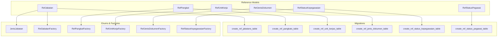
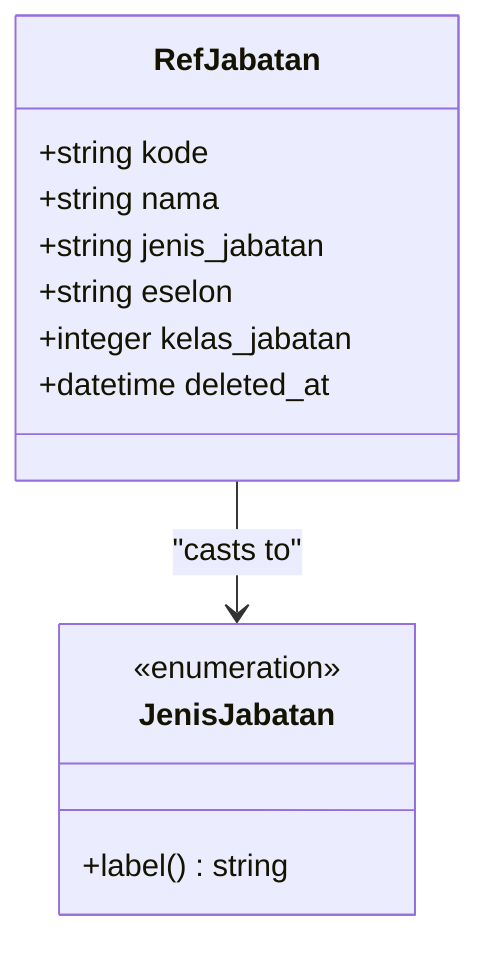
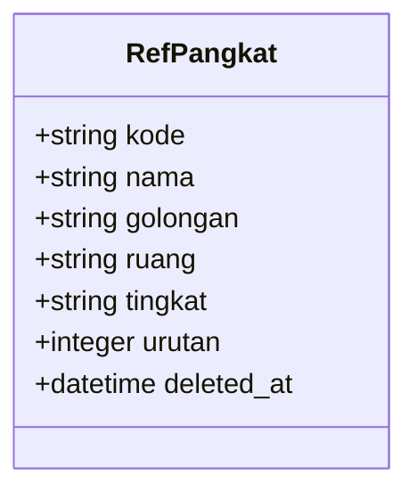
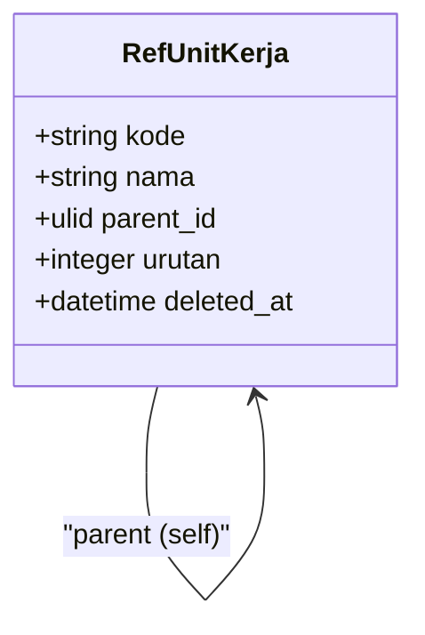
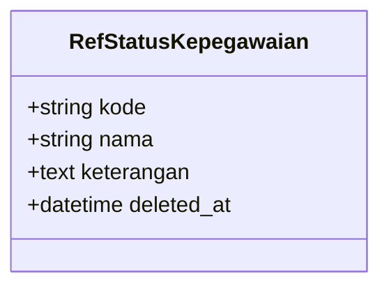
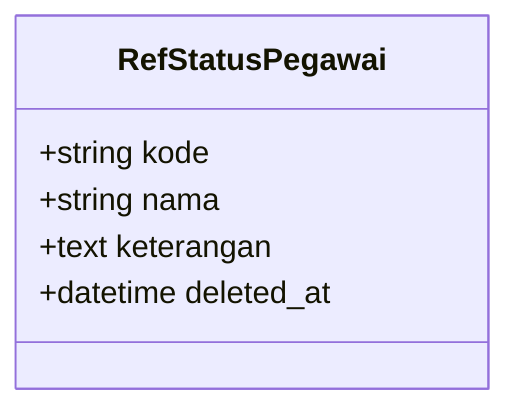
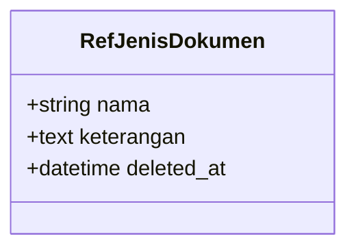
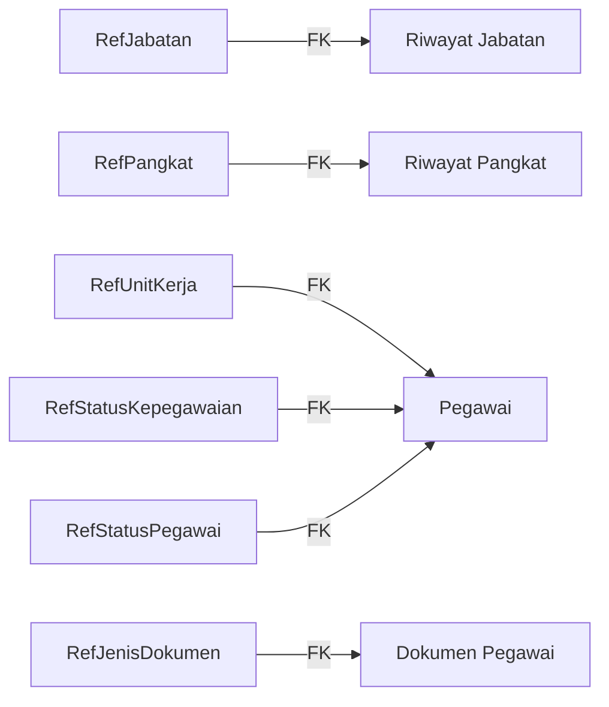

# Reference Data Models

<cite>
**Referenced Files in This Document**
- [RefJabatan.php](file://app/Models/RefJabatan.php)
- [RefPangkat.php](file://app/Models/RefPangkat.php)
- [RefUnitKerja.php](file://app/Models/RefUnitKerja.php)
- [RefStatusKepegawaian.php](file://app/Models/RefStatusKepegawaian.php)
- [RefStatusPegawai.php](file://app/Models/RefStatusPegawai.php)
- [RefJenisDokumen.php](file://app/Models/RefJenisDokumen.php)
- [2026_03_15_022210_create_ref_jabatans_table.php](file://database/migrations/2026_03_15_022210_create_ref_jabatans_table.php)
- [2026_03_15_022210_create_ref_pangkats_table.php](file://database/migrations/2026_03_15_022210_create_ref_pangkats_table.php)
- [2026_03_15_022210_create_ref_unit_kerjas_table.php](file://database/migrations/2026_03_15_022210_create_ref_unit_kerjas_table.php)
- [2026_03_15_162757_create_ref_jenis_dokumen_table.php](file://database/migrations/2026_03_15_162757_create_ref_jenis_dokumen_table.php)
- [2026_03_15_163309_create_ref_status_kepegawaian_table.php](file://database/migrations/2026_03_15_163309_create_ref_status_kepegawaian_table.php)
- [2026_03_15_163309_create_ref_status_pegawai_table.php](file://database/migrations/2026_03_15_163309_create_ref_status_pegawai_table.php)
- [JenisJabatan.php](file://app/Enums/JenisJabatan.php)
- [RefJabatanFactory.php](file://database/factories/RefJabatanFactory.php)
- [RefPangkatFactory.php](file://database/factories/RefPangkatFactory.php)
- [RefUnitKerjaFactory.php](file://database/factories/RefUnitKerjaFactory.php)
- [RefJenisDokumenFactory.php](file://database/factories/RefJenisDokumenFactory.php)
- [RefStatusKepegawaianFactory.php](file://database/factories/RefStatusKepegawaianFactory.php)
</cite>

## Table of Contents
1. [Introduction](#introduction)
2. [Project Structure](#project-structure)
3. [Core Components](#core-components)
4. [Architecture Overview](#architecture-overview)
5. [Detailed Component Analysis](#detailed-component-analysis)
6. [Dependency Analysis](#dependency-analysis)
7. [Performance Considerations](#performance-considerations)
8. [Troubleshooting Guide](#troubleshooting-guide)
9. [Conclusion](#conclusion)

## Introduction
This document provides comprehensive data model documentation for Reference Data Models that serve as static lookup tables and classifications across the Kepegawaian system. These models define standardized enumerations and controlled vocabularies used throughout the application to maintain data integrity and consistency. The focus areas include:
- Position types (RefJabatan)
- Rank classifications (RefPangkat)
- Organizational units (RefUnitKerja)
- Employment status (RefStatusKepegawaian)
- Employee classification (RefStatusPegawai)
- Document types (RefJenisDokumen)

These reference models act as authoritative sources for foreign key relationships in related domain entities, ensuring referential integrity and enabling predictable business logic across the system.

## Project Structure
The reference data models are implemented as Eloquent models with associated database migrations and factories. Each model defines:
- Table mapping and fillable attributes
- Attribute casting for type safety
- Optional soft deletes for historical preservation
- Relationships where applicable (notably hierarchical organization for RefUnitKerja)



**Diagram sources**
- [RefJabatan.php:1-35](file://app/Models/RefJabatan.php#L1-L35)
- [RefPangkat.php:1-34](file://app/Models/RefPangkat.php#L1-L34)
- [RefUnitKerja.php:1-49](file://app/Models/RefUnitKerja.php#L1-L49)
- [RefStatusKepegawaian.php:1-30](file://app/Models/RefStatusKepegawaian.php#L1-L30)
- [RefStatusPegawai.php:1-30](file://app/Models/RefStatusPegawai.php#L1-L30)
- [RefJenisDokumen.php:1-29](file://app/Models/RefJenisDokumen.php#L1-L29)
- [2026_03_15_022210_create_ref_jabatans_table.php:1-34](file://database/migrations/2026_03_15_022210_create_ref_jabatans_table.php#L1-L34)
- [2026_03_15_022210_create_ref_pangkats_table.php:1-35](file://database/migrations/2026_03_15_022210_create_ref_pangkats_table.php#L1-L35)
- [2026_03_15_022210_create_ref_unit_kerjas_table.php:1-33](file://database/migrations/2026_03_15_022210_create_ref_unit_kerjas_table.php#L1-L33)
- [2026_03_15_162757_create_ref_jenis_dokumen_table.php:1-25](file://database/migrations/2026_03_15_162757_create_ref_jenis_dokumen_table.php#L1-L25)
- [2026_03_15_163309_create_ref_status_kepegawaian_table.php:1-32](file://database/migrations/2026_03_15_163309_create_ref_status_kepegawaian_table.php#L1-L32)
- [2026_03_15_163309_create_ref_status_pegawai_table.php:1-32](file://database/migrations/2026_03_15_163309_create_ref_status_pegawai_table.php#L1-L32)
- [JenisJabatan.php:1-20](file://app/Enums/JenisJabatan.php#L1-L20)
- [RefJabatanFactory.php:1-34](file://database/factories/RefJabatanFactory.php#L1-L34)
- [RefPangkatFactory.php:1-37](file://database/factories/RefPangkatFactory.php#L1-L37)
- [RefUnitKerjaFactory.php:1-28](file://database/factories/RefUnitKerjaFactory.php#L1-L28)
- [RefJenisDokumenFactory.php:1-20](file://database/factories/RefJenisDokumenFactory.php#L1-L20)
- [RefStatusKepegawaianFactory.php:1-21](file://database/factories/RefStatusKepegawaianFactory.php#L1-L21)

**Section sources**
- [RefJabatan.php:1-35](file://app/Models/RefJabatan.php#L1-L35)
- [RefPangkat.php:1-34](file://app/Models/RefPangkat.php#L1-L34)
- [RefUnitKerja.php:1-49](file://app/Models/RefUnitKerja.php#L1-L49)
- [RefStatusKepegawaian.php:1-30](file://app/Models/RefStatusKepegawaian.php#L1-L30)
- [RefStatusPegawai.php:1-30](file://app/Models/RefStatusPegawai.php#L1-L30)
- [RefJenisDokumen.php:1-29](file://app/Models/RefJenisDokumen.php#L1-L29)

## Core Components
This section documents each reference model’s purpose, schema, and usage patterns.

- RefJabatan (Position Types)
  - Purpose: Defines job positions with classification (struktural, fungsional, pelaksana), optional elses level, and optional grade classification.
  - Key fields: kode (unique), nama, jenis_jabatan (enumerated), eselon (optional), kelas_jabatan (optional).
  - Validation pattern: Uses an enum for jenis_jabatan; eselon constrained to struktural positions; kelas_jabatan numeric.
  - Impact: Supports hierarchical and categorical queries for position assignments and promotions.

- RefPangkat (Rank Classifications)
  - Purpose: Encodes rank data including grade grouping, rank level, and ordering for progression.
  - Key fields: kode (unique), nama, golongan, ruang, tingkat, urutan (indexed).
  - Validation pattern: urutan indexed for ordering; structured naming aligned with administrative grading.
  - Impact: Enables consistent rank progression tracking and payroll calculations.

- RefUnitKerja (Organizational Units)
  - Purpose: Hierarchical organizational structure with parent-child relationships and ordering.
  - Key fields: kode (unique), nama, parent_id (self-referencing), urutan (indexed).
  - Relationships: parent(), children(), pegawai().
  - Validation pattern: Self-constraint via foreignUlid with null-on-delete; ordered children.
  - Impact: Provides organizational hierarchy for reporting and assignment routing.

- RefStatusKepegawaian (Employment Status)
  - Purpose: Standardized employment statuses (e.g., active, resigned).
  - Key fields: kode (unique), nama, keterangan (optional).
  - Validation pattern: Unique kode enforcement; soft-deleted for audit trail.
  - Impact: Ensures consistent employment state tracking across personnel records.

- RefStatusPegawai (Employee Classification)
  - Purpose: Classifies employees (e.g., PNS, PPPK) for policy and benefit applications.
  - Key fields: kode (unique), nama, keterangan (optional).
  - Validation pattern: Unique kode enforcement; soft-deleted for audit trail.
  - Impact: Drives eligibility rules and administrative workflows.

- RefJenisDokumen (Document Types)
  - Purpose: Lists allowable document categories for personnel documentation.
  - Key fields: nama, keterangan (optional).
  - Validation pattern: Soft-deleted; minimal constraints to allow flexible categorization.
  - Impact: Standardizes document taxonomy across personnel files.

**Section sources**
- [RefJabatan.php:1-35](file://app/Models/RefJabatan.php#L1-L35)
- [RefPangkat.php:1-34](file://app/Models/RefPangkat.php#L1-L34)
- [RefUnitKerja.php:1-49](file://app/Models/RefUnitKerja.php#L1-L49)
- [RefStatusKepegawaian.php:1-30](file://app/Models/RefStatusKepegawaian.php#L1-L30)
- [RefStatusPegawai.php:1-30](file://app/Models/RefStatusPegawai.php#L1-L30)
- [RefJenisDokumen.php:1-29](file://app/Models/RefJenisDokumen.php#L1-L29)

## Architecture Overview
The reference data models form a cohesive set of static lookups that feed downstream domain entities. They are designed with:
- Unique identifiers (ULIDs) for global uniqueness and obfuscation
- Soft deletes for historical auditing
- Enumerations and explicit casts for type safety
- Indexes on frequently queried fields (urutan, kode)
- Self-referencing for hierarchical organization (RefUnitKerja)

```mermaid
erDiagram
REF_JABATAN {
ulid id PK
string kode UK
string nama
string jenis_jabatan
string eselon
integer kelas_jabatan
datetime deleted_at
}
REF_PANGKAT {
ulid id PK
string kode UK
string nama
string golongan
string ruang
string tingkat
integer urutan I
datetime deleted_at
}
REF_UNIT_KERJA {
ulid id PK
string kode UK
string nama
ulid parent_id FK
integer urutan I
datetime deleted_at
}
REF_STATUS_KEPEGAWAIAN {
ulid id PK
string kode UK
string nama
text keterangan
datetime deleted_at
}
REF_STATUS_PEGAWAI {
ulid id PK
string kode UK
string nama
text keterangan
datetime deleted_at
}
REF_JENIS_DOKUMEN {
ulid id PK
string nama
text keterangan
datetime deleted_at
}
REF_UNIT_KERJA }o--|| REF_UNIT_KERJA : "parent"
```

**Diagram sources**
- [2026_03_15_022210_create_ref_jabatans_table.php:14-22](file://database/migrations/2026_03_15_022210_create_ref_jabatans_table.php#L14-L22)
- [2026_03_15_022210_create_ref_pangkats_table.php:14-23](file://database/migrations/2026_03_15_022210_create_ref_pangkats_table.php#L14-L23)
- [2026_03_15_022210_create_ref_unit_kerjas_table.php:14-21](file://database/migrations/2026_03_15_022210_create_ref_unit_kerjas_table.php#L14-L21)
- [2026_03_15_162757_create_ref_jenis_dokumen_table.php:11-16](file://database/migrations/2026_03_15_162757_create_ref_jenis_dokumen_table.php#L11-L16)
- [2026_03_15_163309_create_ref_status_kepegawaian_table.php:14-20](file://database/migrations/2026_03_15_163309_create_ref_status_kepegawaian_table.php#L14-L20)
- [2026_03_15_163309_create_ref_status_pegawai_table.php:14-19](file://database/migrations/2026_03_15_163309_create_ref_status_pegawai_table.php#L14-L19)

## Detailed Component Analysis

### RefJabatan (Position Types)
- Role: Defines position types and their classification (struktural, fungsional, pelaksana). Supports optional elses level and grade classification.
- Fields and types:
  - kode: string, unique
  - nama: string
  - jenis_jabatan: enum (struktural, fungsional, pelaksana)
  - eselon: string (nullable)
  - kelas_jabatan: integer (nullable)
- Relationships: None
- Validation patterns:
  - Enum casting ensures only valid position types
  - Eselon restricted to struktural positions
  - Unique kode enforced at database level
- Usage examples:
  - Used to classify positions during appointment and promotion decisions
  - Supports filtering by position category and grade for HR analytics



**Diagram sources**
- [RefJabatan.php:11-33](file://app/Models/RefJabatan.php#L11-L33)
- [JenisJabatan.php:5-19](file://app/Enums/JenisJabatan.php#L5-L19)

**Section sources**
- [RefJabatan.php:1-35](file://app/Models/RefJabatan.php#L1-L35)
- [2026_03_15_022210_create_ref_jabatans_table.php:1-34](file://database/migrations/2026_03_15_022210_create_ref_jabatans_table.php#L1-L34)
- [JenisJabatan.php:1-20](file://app/Enums/JenisJabatan.php#L1-L20)
- [RefJabatanFactory.php:1-34](file://database/factories/RefJabatanFactory.php#L1-L34)

### RefPangkat (Rank Classifications)
- Role: Encodes rank data including grade grouping, rank level, and ordering for progression.
- Fields and types:
  - kode: string, unique
  - nama: string
  - golongan: string
  - ruang: string
  - tingkat: string
  - urutan: integer, indexed
- Relationships: None
- Validation patterns:
  - urutan indexed for efficient ordering
  - Unique kode enforced at database level
- Usage examples:
  - Used to compute salary steps and progression timelines
  - Supports sorting ranks for reports and payroll systems



**Diagram sources**
- [RefPangkat.php:10-33](file://app/Models/RefPangkat.php#L10-L33)
- [2026_03_15_022210_create_ref_pangkats_table.php:1-35](file://database/migrations/2026_03_15_022210_create_ref_pangkats_table.php#L1-L35)

**Section sources**
- [RefPangkat.php:1-34](file://app/Models/RefPangkat.php#L1-L34)
- [2026_03_15_022210_create_ref_pangkats_table.php:1-35](file://database/migrations/2026_03_15_022210_create_ref_pangkats_table.php#L1-L35)
- [RefPangkatFactory.php:1-37](file://database/factories/RefPangkatFactory.php#L1-L37)

### RefUnitKerja (Organizational Units)
- Role: Hierarchical organizational structure supporting parent-child relationships and ordering.
- Fields and types:
  - kode: string, unique
  - nama: string
  - parent_id: ulid, self-referencing foreign key
  - urutan: integer, indexed
- Relationships:
  - parent(): BelongsTo RefUnitKerja
  - children(): HasMany RefUnitKerja ordered by urutan
  - pegawai(): HasMany Pegawai via ref_unit_kerja_id
- Validation patterns:
  - Self-constraint via foreignUlid with nullOnDelete
  - Unique kode enforced at database level
- Usage examples:
  - Used to build organizational charts and reporting hierarchies
  - Supports filtering employees by organizational unit



**Diagram sources**
- [RefUnitKerja.php:12-48](file://app/Models/RefUnitKerja.php#L12-L48)
- [2026_03_15_022210_create_ref_unit_kerjas_table.php:14-21](file://database/migrations/2026_03_15_022210_create_ref_unit_kerjas_table.php#L14-L21)

**Section sources**
- [RefUnitKerja.php:1-49](file://app/Models/RefUnitKerja.php#L1-L49)
- [2026_03_15_022210_create_ref_unit_kerjas_table.php:1-33](file://database/migrations/2026_03_15_022210_create_ref_unit_kerjas_table.php#L1-L33)
- [RefUnitKerjaFactory.php:1-28](file://database/factories/RefUnitKerjaFactory.php#L1-L28)

### RefStatusKepegawaian (Employment Status)
- Role: Standardized employment statuses used across personnel lifecycle events.
- Fields and types:
  - kode: string, unique
  - nama: string
  - keterangan: text (nullable)
- Relationships: None
- Validation patterns:
  - Unique kode enforced at database level
- Usage examples:
  - Used to filter active vs inactive employees
  - Supports reporting on workforce composition by status



**Diagram sources**
- [RefStatusKepegawaian.php:10-28](file://app/Models/RefStatusKepegawaian.php#L10-L28)
- [2026_03_15_163309_create_ref_status_kepegawaian_table.php:14-20](file://database/migrations/2026_03_15_163309_create_ref_status_kepegawaian_table.php#L14-L20)

**Section sources**
- [RefStatusKepegawaian.php:1-30](file://app/Models/RefStatusKepegawaian.php#L1-L30)
- [2026_03_15_163309_create_ref_status_kepegawaian_table.php:1-32](file://database/migrations/2026_03_15_163309_create_ref_status_kepegawaian_table.php#L1-L32)
- [RefStatusKepegawaianFactory.php:1-21](file://database/factories/RefStatusKepegawaianFactory.php#L1-L21)

### RefStatusPegawai (Employee Classification)
- Role: Classifies employees for policy and benefit applications.
- Fields and types:
  - kode: string, unique
  - nama: string
  - keterangan: text (nullable)
- Relationships: None
- Validation patterns:
  - Unique kode enforced at database level
- Usage examples:
  - Used to apply classification-specific rules (e.g., leave entitlements)
  - Supports segmentation for training and development programs



**Diagram sources**
- [RefStatusPegawai.php:10-28](file://app/Models/RefStatusPegawai.php#L10-L28)
- [2026_03_15_163309_create_ref_status_pegawai_table.php:14-19](file://database/migrations/2026_03_15_163309_create_ref_status_pegawai_table.php#L14-L19)

**Section sources**
- [RefStatusPegawai.php:1-30](file://app/Models/RefStatusPegawai.php#L1-L30)
- [2026_03_15_163309_create_ref_status_pegawai_table.php:1-32](file://database/migrations/2026_03_15_163309_create_ref_status_pegawai_table.php#L1-L32)

### RefJenisDokumen (Document Types)
- Role: Categorizes document types for personnel documentation workflows.
- Fields and types:
  - nama: string
  - keterangan: text (nullable)
- Relationships: None
- Validation patterns:
  - Soft-deleted for audit trail
- Usage examples:
  - Used to validate and organize uploaded documents
  - Supports document management and retrieval policies



**Diagram sources**
- [RefJenisDokumen.php:10-27](file://app/Models/RefJenisDokumen.php#L10-L27)
- [2026_03_15_162757_create_ref_jenis_dokumen_table.php:11-16](file://database/migrations/2026_03_15_162757_create_ref_jenis_dokumen_table.php#L11-L16)

**Section sources**
- [RefJenisDokumen.php:1-29](file://app/Models/RefJenisDokumen.php#L1-L29)
- [2026_03_15_162757_create_ref_jenis_dokumen_table.php:1-25](file://database/migrations/2026_03_15_162757_create_ref_jenis_dokumen_table.php#L1-L25)
- [RefJenisDokumenFactory.php:1-20](file://database/factories/RefJenisDokumenFactory.php#L1-L20)

## Dependency Analysis
The reference models are consumed by domain entities through foreign key relationships. While the referenced files for dependent models are not included here, the following diagram illustrates typical dependency relationships based on the reference model definitions:



**Diagram sources**
- [RefJabatan.php:1-35](file://app/Models/RefJabatan.php#L1-L35)
- [RefPangkat.php:1-34](file://app/Models/RefPangkat.php#L1-L34)
- [RefUnitKerja.php:1-49](file://app/Models/RefUnitKerja.php#L1-L49)
- [RefStatusKepegawaian.php:1-30](file://app/Models/RefStatusKepegawaian.php#L1-L30)
- [RefStatusPegawai.php:1-30](file://app/Models/RefStatusPegawai.php#L1-L30)
- [RefJenisDokumen.php:1-29](file://app/Models/RefJenisDokumen.php#L1-L29)

**Section sources**
- [RefJabatan.php:1-35](file://app/Models/RefJabatan.php#L1-L35)
- [RefPangkat.php:1-34](file://app/Models/RefPangkat.php#L1-L34)
- [RefUnitKerja.php:1-49](file://app/Models/RefUnitKerja.php#L1-L49)
- [RefStatusKepegawaian.php:1-30](file://app/Models/RefStatusKepegawaian.php#L1-L30)
- [RefStatusPegawai.php:1-30](file://app/Models/RefStatusPegawai.php#L1-L30)
- [RefJenisDokumen.php:1-29](file://app/Models/RefJenisDokumen.php#L1-L29)

## Performance Considerations
- Indexing: urutan is indexed in RefPangkat and RefUnitKerja to support ordering and tree traversal performance.
- Unique constraints: kode is unique across RefJabatan, RefPangkat, and RefStatusKepegawaian/RefStatusPegawai to prevent duplicates and enable fast lookups.
- Soft deletes: Applied consistently to preserve historical context without requiring expensive cascading deletions.
- Enum casting: Reduces storage overhead and improves query reliability by constraining values at the application level.

## Troubleshooting Guide
Common issues and resolutions:
- Duplicate kode errors: Ensure kode values are unique before insert/update operations.
- Invalid enum values: For RefJabatan, ensure jenis_jabatan matches allowed enumeration values.
- Self-reference anomalies: For RefUnitKerja, verify parent_id references existing nodes and avoid cycles.
- Ordering inconsistencies: Confirm urutan values are properly maintained when reordering organizational units.

Validation patterns observed in factories:
- Controlled generation of realistic values for testing and seeding
- Conditional population of fields based on enum or structural constraints

**Section sources**
- [RefJabatanFactory.php:1-34](file://database/factories/RefJabatanFactory.php#L1-L34)
- [RefPangkatFactory.php:1-37](file://database/factories/RefPangkatFactory.php#L1-L37)
- [RefUnitKerjaFactory.php:1-28](file://database/factories/RefUnitKerjaFactory.php#L1-L28)
- [RefJenisDokumenFactory.php:1-20](file://database/factories/RefJenisDokumenFactory.php#L1-L20)
- [RefStatusKepegawaianFactory.php:1-21](file://database/factories/RefStatusKepegawaianFactory.php#L1-L21)

## Conclusion
The Reference Data Models provide a robust foundation for maintaining consistent, auditable, and extensible classifications across the Kepegawaian system. Their design emphasizes:
- Clear field definitions with appropriate types and constraints
- Hierarchical modeling where applicable (RefUnitKerja)
- Enumerations and casting for data integrity
- Indexes and unique keys for performance and deduplication
- Soft deletes for historical preservation

By adhering to these reference models, downstream domain entities inherit reliable, standardized data that supports accurate reporting, compliance, and operational workflows.