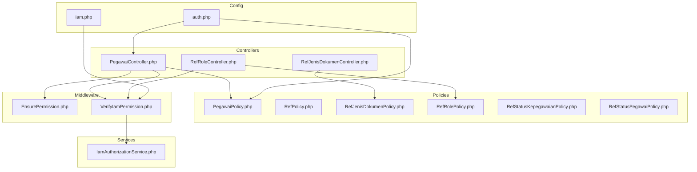
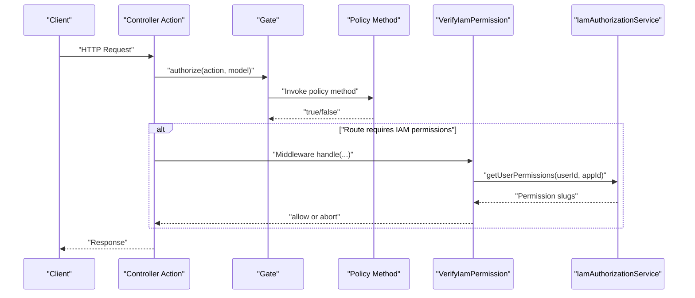
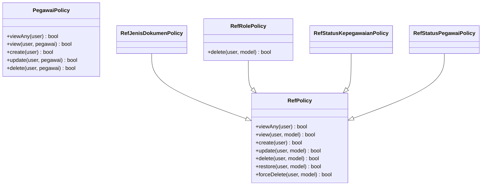
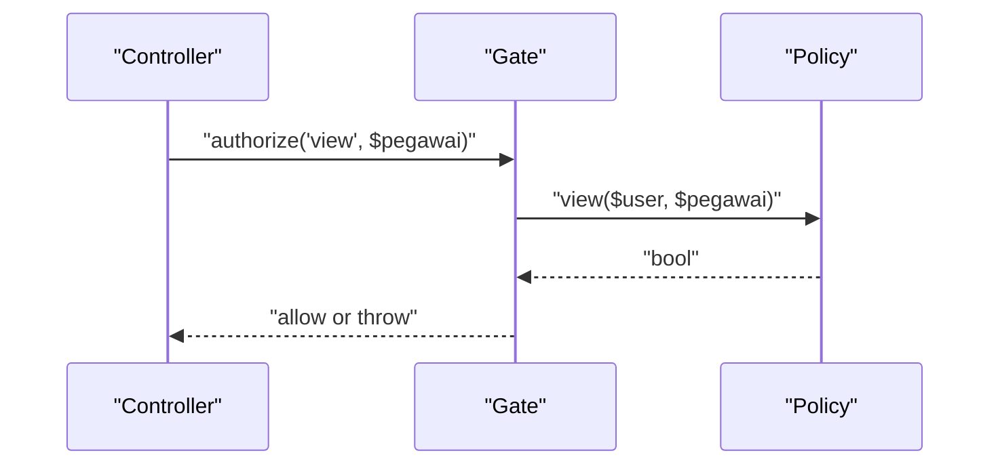
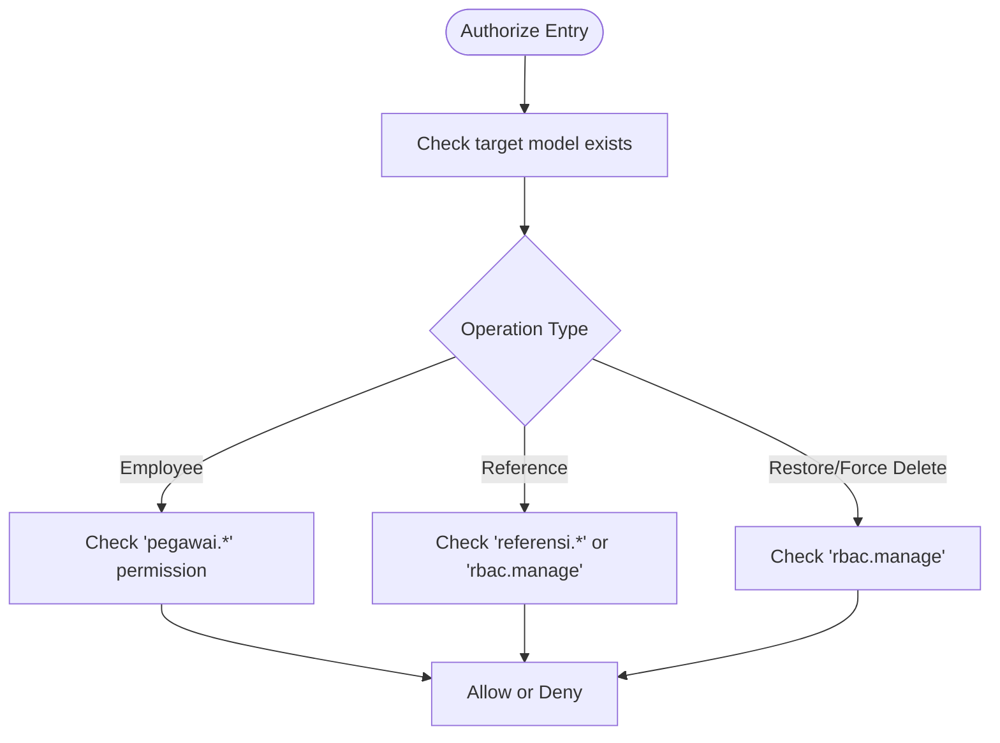
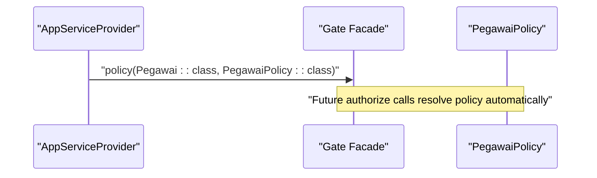
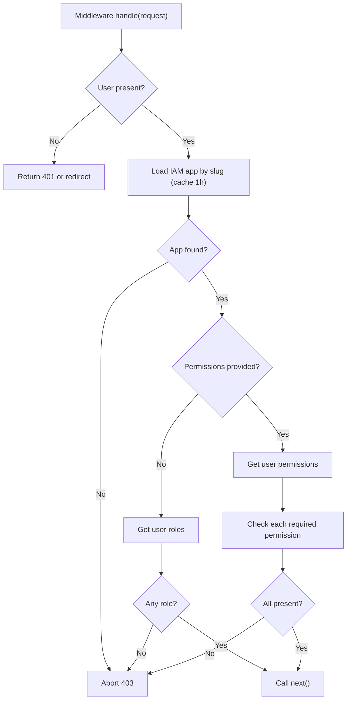
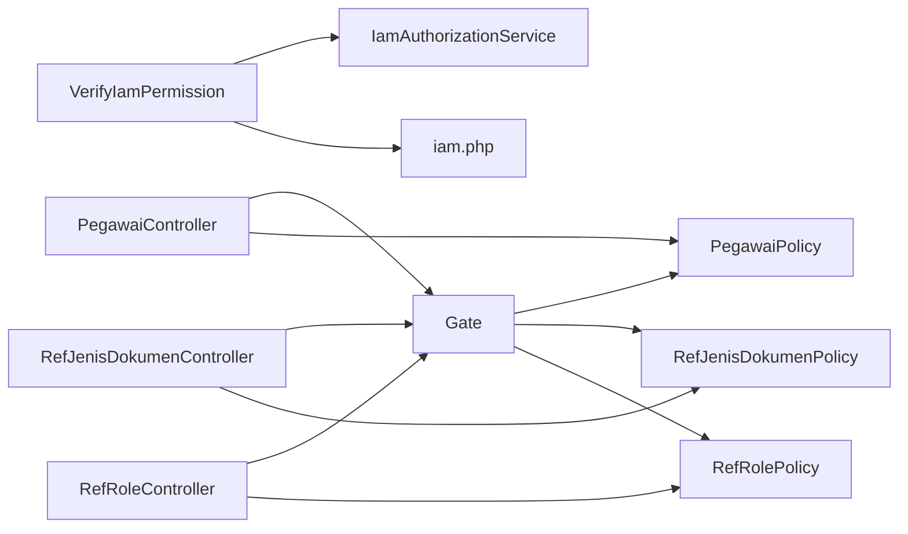

# Policy System

<cite>
**Referenced Files in This Document**
- [PegawaiPolicy.php](file://app/Policies/PegawaiPolicy.php)
- [RefPolicy.php](file://app/Policies/RefPolicy.php)
- [RefJenisDokumenPolicy.php](file://app/Policies/RefJenisDokumenPolicy.php)
- [RefRolePolicy.php](file://app/Policies/RefRolePolicy.php)
- [RefStatusKepegawaianPolicy.php](file://app/Policies/RefStatusKepegawaianPolicy.php)
- [RefStatusPegawaiPolicy.php](file://app/Policies/RefStatusPegawaiPolicy.php)
- [AppServiceProvider.php](file://app/Providers/AppServiceProvider.php)
- [PegawaiController.php](file://app/Http/Controllers/Kepegawaian/PegawaiController.php)
- [RefJenisDokumenController.php](file://app/Http/Controllers/Referensi/RefJenisDokumenController.php)
- [RefRoleController.php](file://app/Http/Controllers/Referensi/RefRoleController.php)
- [EnsurePermission.php](file://app/Http/Middleware/EnsurePermission.php)
- [VerifyIamPermission.php](file://app/Http/Middleware/VerifyIamPermission.php)
- [IamAuthorizationService.php](file://app/Services/IamAuthorizationService.php)
- [auth.php](file://config/auth.php)
- [iam.php](file://config/iam.php)
</cite>

## Table of Contents
1. [Introduction](#introduction)
2. [Project Structure](#project-structure)
3. [Core Components](#core-components)
4. [Architecture Overview](#architecture-overview)
5. [Detailed Component Analysis](#detailed-component-analysis)
6. [Dependency Analysis](#dependency-analysis)
7. [Performance Considerations](#performance-considerations)
8. [Troubleshooting Guide](#troubleshooting-guide)
9. [Conclusion](#conclusion)

## Introduction
This document explains the Policy System used for authorization logic in the application. It covers policy class design, gate integration, and authorization rule definition. It documents the implementation of:
- PegawaiPolicy for employee data access
- RefPolicy as a base for reference data policies
- Specific Ref*Policy classes for reference management (e.g., RefJenisDokumenPolicy, RefRolePolicy, RefStatusKepegawaianPolicy, RefStatusPegawaiPolicy)

It also describes policy registration, automatic policy resolution, relationship-based authorization patterns, testing strategies, authorization debugging, and performance optimization techniques.

## Project Structure
The Policy System spans several directories and files:
- Policies under app/Policies define authorization rules per model
- Controllers under app/Http/Controllers invoke authorization gates
- Middleware under app/Http/Middleware enforces permissions at the route level
- Services under app/Services encapsulate IAM permission retrieval
- Configuration under config defines authentication model and IAM app slug

**Diagram sources**
- [PegawaiPolicy.php:1-34](file://app/Policies/PegawaiPolicy.php#L1-L34)
- [RefPolicy.php:1-44](file://app/Policies/RefPolicy.php#L1-L44)
- [RefJenisDokumenPolicy.php:1-44](file://app/Policies/RefJenisDokumenPolicy.php#L1-L44)
- [RefRolePolicy.php:1-49](file://app/Policies/RefRolePolicy.php#L1-L49)
- [RefStatusKepegawaianPolicy.php:1-44](file://app/Policies/RefStatusKepegawaianPolicy.php#L1-L44)
- [RefStatusPegawaiPolicy.php:1-44](file://app/Policies/RefStatusPegawaiPolicy.php#L1-L44)
- [PegawaiController.php:1-224](file://app/Http/Controllers/Kepegawaian/PegawaiController.php#L1-L224)
- [RefJenisDokumenController.php:1-78](file://app/Http/Controllers/Referensi/RefJenisDokumenController.php#L1-L78)
- [RefRoleController.php:1-132](file://app/Http/Controllers/Referensi/RefRoleController.php#L1-L132)
- [EnsurePermission.php:1-37](file://app/Http/Middleware/EnsurePermission.php#L1-L37)
- [VerifyIamPermission.php:1-54](file://app/Http/Middleware/VerifyIamPermission.php#L1-L54)
- [IamAuthorizationService.php:1-45](file://app/Services/IamAuthorizationService.php#L1-L45)
- [auth.php:1-118](file://config/auth.php#L1-L118)
- [iam.php:1-9](file://config/iam.php#L1-L9)

**Section sources**
- [PegawaiPolicy.php:1-34](file://app/Policies/PegawaiPolicy.php#L1-L34)
- [RefPolicy.php:1-44](file://app/Policies/RefPolicy.php#L1-L44)
- [RefJenisDokumenPolicy.php:1-44](file://app/Policies/RefJenisDokumenPolicy.php#L1-L44)
- [RefRolePolicy.php:1-49](file://app/Policies/RefRolePolicy.php#L1-L49)
- [RefStatusKepegawaianPolicy.php:1-44](file://app/Policies/RefStatusKepegawaianPolicy.php#L1-L44)
- [RefStatusPegawaiPolicy.php:1-44](file://app/Policies/RefStatusPegawaiPolicy.php#L1-L44)
- [PegawaiController.php:1-224](file://app/Http/Controllers/Kepegawaian/PegawaiController.php#L1-L224)
- [RefJenisDokumenController.php:1-78](file://app/Http/Controllers/Referensi/RefJenisDokumenController.php#L1-L78)
- [RefRoleController.php:1-132](file://app/Http/Controllers/Referensi/RefRoleController.php#L1-L132)
- [EnsurePermission.php:1-37](file://app/Http/Middleware/EnsurePermission.php#L1-L37)
- [VerifyIamPermission.php:1-54](file://app/Http/Middleware/VerifyIamPermission.php#L1-L54)
- [IamAuthorizationService.php:1-45](file://app/Services/IamAuthorizationService.php#L1-L45)
- [auth.php:1-118](file://config/auth.php#L1-L118)
- [iam.php:1-9](file://config/iam.php#L1-L9)

## Core Components
- Policy classes define authorization rules for models:
  - PegawaiPolicy: employee CRUD and view rules using permission slugs
  - RefPolicy: shared reference data rules with fallback RBAC manage permissions
  - Ref*Policy subclasses: specialized reference models inheriting base rules
- Gate integration:
  - Controllers call Gate::authorize(...) to enforce policies
  - Middleware validates permissions at the route level
- Authorization service:
  - IamAuthorizationService retrieves user permissions and roles scoped to an IAM application
- Configuration:
  - auth.php sets the user model to Pegawai
  - iam.php configures the application slug used for IAM scoping

Key authorization logic patterns:
- Permission-based checks via user->hasPermission or user->hasAnyPermission
- Existence checks on target models before update/delete operations
- RBAC manage override for sensitive operations (restore/force delete)

**Section sources**
- [PegawaiPolicy.php:9-32](file://app/Policies/PegawaiPolicy.php#L9-L32)
- [RefPolicy.php:9-42](file://app/Policies/RefPolicy.php#L9-L42)
- [RefJenisDokumenPolicy.php:7-43](file://app/Policies/RefJenisDokumenPolicy.php#L7-L43)
- [RefRolePolicy.php:8-47](file://app/Policies/RefRolePolicy.php#L8-L47)
- [RefStatusKepegawaianPolicy.php:7-43](file://app/Policies/RefStatusKepegawaianPolicy.php#L7-L43)
- [RefStatusPegawaiPolicy.php:7-43](file://app/Policies/RefStatusPegawaiPolicy.php#L7-L43)
- [PegawaiController.php:32-221](file://app/Http/Controllers/Kepegawaian/PegawaiController.php#L32-L221)
- [RefJenisDokumenController.php:17-76](file://app/Http/Controllers/Referensi/RefJenisDokumenController.php#L17-L76)
- [RefRoleController.php:19-129](file://app/Http/Controllers/Referensi/RefRoleController.php#L19-L129)
- [EnsurePermission.php:11-35](file://app/Http/Middleware/EnsurePermission.php#L11-L35)
- [VerifyIamPermission.php:16-51](file://app/Http/Middleware/VerifyIamPermission.php#L16-L51)
- [IamAuthorizationService.php:16-43](file://app/Services/IamAuthorizationService.php#L16-L43)
- [auth.php:64-74](file://config/auth.php#L64-L74)
- [iam.php](file://config/iam.php#L7)

## Architecture Overview
The Policy System integrates with the controller layer, gate, middleware, and IAM service to enforce authorization consistently across the application.

**Diagram sources**
- [PegawaiController.php:32-221](file://app/Http/Controllers/Kepegawaian/PegawaiController.php#L32-L221)
- [RefJenisDokumenController.php:17-76](file://app/Http/Controllers/Referensi/RefJenisDokumenController.php#L17-L76)
- [RefRoleController.php:19-129](file://app/Http/Controllers/Referensi/RefRoleController.php#L19-L129)
- [EnsurePermission.php:11-35](file://app/Http/Middleware/EnsurePermission.php#L11-L35)
- [VerifyIamPermission.php:16-51](file://app/Http/Middleware/VerifyIamPermission.php#L16-L51)
- [IamAuthorizationService.php:16-25](file://app/Services/IamAuthorizationService.php#L16-L25)

## Detailed Component Analysis

### Policy Class Design and Inheritance
- Base reference policy pattern:
  - RefPolicy centralizes CRUD permissions and existence checks
  - Subclasses inherit base rules and override selectively (e.g., RefRolePolicy disallows deleting system roles)
- Employee data policy:
  - PegawaiPolicy uses model-specific permission slugs for employee records

**Diagram sources**
- [RefPolicy.php:7-43](file://app/Policies/RefPolicy.php#L7-L43)
- [PegawaiPolicy.php:7-33](file://app/Policies/PegawaiPolicy.php#L7-L33)
- [RefJenisDokumenPolicy.php:7-43](file://app/Policies/RefJenisDokumenPolicy.php#L7-L43)
- [RefRolePolicy.php:8-47](file://app/Policies/RefRolePolicy.php#L8-L47)
- [RefStatusKepegawaianPolicy.php:7-43](file://app/Policies/RefStatusKepegawaianPolicy.php#L7-L43)
- [RefStatusPegawaiPolicy.php:7-43](file://app/Policies/RefStatusPegawaiPolicy.php#L7-L43)

**Section sources**
- [RefPolicy.php:9-42](file://app/Policies/RefPolicy.php#L9-L42)
- [PegawaiPolicy.php:9-32](file://app/Policies/PegawaiPolicy.php#L9-L32)
- [RefJenisDokumenPolicy.php:9-41](file://app/Policies/RefJenisDokumenPolicy.php#L9-L41)
- [RefRolePolicy.php:32-36](file://app/Policies/RefRolePolicy.php#L32-L36)
- [RefStatusKepegawaianPolicy.php:9-31](file://app/Policies/RefStatusKepegawaianPolicy.php#L9-L31)
- [RefStatusPegawaiPolicy.php:9-31](file://app/Policies/RefStatusPegawaiPolicy.php#L9-L31)

### Gate Integration and Controller Usage
- Controllers invoke authorization via:
  - Gate::authorize('viewAny', Pegawai::class)
  - $this->authorize('create', RefJenisDokumen::class) or Gate::authorize(...)
- This triggers automatic policy resolution based on the model class

**Diagram sources**
- [PegawaiController.php:32-221](file://app/Http/Controllers/Kepegawaian/PegawaiController.php#L32-L221)
- [RefJenisDokumenController.php:17-76](file://app/Http/Controllers/Referensi/RefJenisDokumenController.php#L17-L76)
- [PegawaiPolicy.php:14-16](file://app/Policies/PegawaiPolicy.php#L14-L16)
- [RefPolicy.php:14-16](file://app/Policies/RefPolicy.php#L14-L16)

**Section sources**
- [PegawaiController.php:32-221](file://app/Http/Controllers/Kepegawaian/PegawaiController.php#L32-L221)
- [RefJenisDokumenController.php:17-76](file://app/Http/Controllers/Referensi/RefJenisDokumenController.php#L17-L76)

### Authorization Rule Definition
- Employee rules:
  - viewAny/view require 'pegawai.view'
  - create requires 'pegawai.create'
  - update/delete require 'pegawai.update'/'pegawai.delete' and the target exists
- Reference rules:
  - viewAny/view/update/delete require either 'referensi.view' or 'rbac.manage'
  - create/restore/forceDelete require 'referensi.create' or 'rbac.manage'
  - restore/forceDelete require 'rbac.manage' regardless of model
- Role-specific overrides:
  - RefRolePolicy disallows deletion of system roles

**Diagram sources**
- [PegawaiPolicy.php:9-32](file://app/Policies/PegawaiPolicy.php#L9-L32)
- [RefPolicy.php:9-42](file://app/Policies/RefPolicy.php#L9-L42)
- [RefRolePolicy.php:32-36](file://app/Policies/RefRolePolicy.php#L32-L36)

**Section sources**
- [PegawaiPolicy.php:9-32](file://app/Policies/PegawaiPolicy.php#L9-L32)
- [RefPolicy.php:9-42](file://app/Policies/RefPolicy.php#L9-L42)
- [RefRolePolicy.php:32-36](file://app/Policies/RefRolePolicy.php#L32-L36)

### Policy Registration and Automatic Resolution
- Policy registration:
  - AppServiceProvider registers the employee policy for the Pegawai model
- Automatic resolution:
  - Gate resolves the appropriate policy class based on the model passed to authorize
- Authentication model:
  - auth.php configures the user provider to use the Pegawai model

**Diagram sources**
- [AppServiceProvider.php](file://app/Providers/AppServiceProvider.php#L30)
- [auth.php:64-74](file://config/auth.php#L64-L74)

**Section sources**
- [AppServiceProvider.php](file://app/Providers/AppServiceProvider.php#L30)
- [auth.php:64-74](file://config/auth.php#L64-L74)

### Relationship-Based Authorization Patterns
- Controllers load related data after authorization to avoid redundant checks
  - Example: loading riwayatPangkat, riwayatJabatan, keluarga, penghargaan, hukumanDisiplin, dokumenPegawai after authorization
- This pattern ensures authorization occurs first, then data is enriched for presentation

**Section sources**
- [PegawaiController.php:157-168](file://app/Http/Controllers/Kepegawaian/PegawaiController.php#L157-L168)

### Middleware-Based Authorization
- EnsurePermission middleware:
  - Validates that the current user has any of the required permissions
  - Supports comma-separated permission lists and trims entries
- VerifyIamPermission middleware:
  - Resolves the IAM application by slug from config
  - Retrieves user roles or permissions via IamAuthorizationService
  - Caches the application lookup for 1 hour
  - Aborts with 401/403 depending on request expectation

**Diagram sources**
- [EnsurePermission.php:11-35](file://app/Http/Middleware/EnsurePermission.php#L11-L35)
- [VerifyIamPermission.php:16-51](file://app/Http/Middleware/VerifyIamPermission.php#L16-L51)
- [IamAuthorizationService.php:16-25](file://app/Services/IamAuthorizationService.php#L16-L25)
- [iam.php](file://config/iam.php#L7)

**Section sources**
- [EnsurePermission.php:11-35](file://app/Http/Middleware/EnsurePermission.php#L11-L35)
- [VerifyIamPermission.php:16-51](file://app/Http/Middleware/VerifyIamPermission.php#L16-L51)
- [IamAuthorizationService.php:16-43](file://app/Services/IamAuthorizationService.php#L16-L43)
- [iam.php](file://config/iam.php#L7)

### Concrete Examples from the Codebase
- Employee authorization:
  - Index action authorizes 'viewAny' on the Pegawai model
  - Show action authorizes 'view' on a specific Pegawai record
  - Store action authorizes 'create' on the Pegawai model
  - Edit/Update actions authorize 'update' on a specific Pegawai record
  - Destroy action authorizes 'delete' on a specific Pegawai record
- Reference authorization:
  - RefJenisDokumenController index/create/store/edit/update/destroy authorize 'viewAny'/'create'/'update'/'delete' respectively on RefJenisDokumen
- Role authorization:
  - RefRoleController index/create/edit/update/destroy authorize 'viewAny'/'create'/'update'/'delete' on RefRole
  - Deletion includes a special guard against system roles

**Section sources**
- [PegawaiController.php:32-221](file://app/Http/Controllers/Kepegawaian/PegawaiController.php#L32-L221)
- [RefJenisDokumenController.php:17-76](file://app/Http/Controllers/Referensi/RefJenisDokumenController.php#L17-L76)
- [RefRoleController.php:19-129](file://app/Http/Controllers/Referensi/RefRoleController.php#L19-L129)

## Dependency Analysis
- Controllers depend on:
  - Gate for authorization enforcement
  - Policies for rule evaluation
  - Middleware for route-level checks
- Policies depend on:
  - User model capabilities (hasPermission/hasAnyPermission)
  - Target model existence checks
- Middleware depends on:
  - IamAuthorizationService for permission/role retrieval
  - Config for application slug
  - Cache for application lookup

**Diagram sources**
- [PegawaiController.php:32-221](file://app/Http/Controllers/Kepegawaian/PegawaiController.php#L32-L221)
- [RefJenisDokumenController.php:17-76](file://app/Http/Controllers/Referensi/RefJenisDokumenController.php#L17-L76)
- [RefRoleController.php:19-129](file://app/Http/Controllers/Referensi/RefRoleController.php#L19-L129)
- [PegawaiPolicy.php:9-32](file://app/Policies/PegawaiPolicy.php#L9-L32)
- [RefJenisDokumenPolicy.php:9-41](file://app/Policies/RefJenisDokumenPolicy.php#L9-L41)
- [RefRolePolicy.php:32-36](file://app/Policies/RefRolePolicy.php#L32-L36)
- [VerifyIamPermission.php:16-51](file://app/Http/Middleware/VerifyIamPermission.php#L16-L51)
- [IamAuthorizationService.php:16-25](file://app/Services/IamAuthorizationService.php#L16-L25)
- [iam.php](file://config/iam.php#L7)

**Section sources**
- [PegawaiController.php:32-221](file://app/Http/Controllers/Kepegawaian/PegawaiController.php#L32-L221)
- [RefJenisDokumenController.php:17-76](file://app/Http/Controllers/Referensi/RefJenisDokumenController.php#L17-L76)
- [RefRoleController.php:19-129](file://app/Http/Controllers/Referensi/RefRoleController.php#L19-L129)
- [VerifyIamPermission.php:16-51](file://app/Http/Middleware/VerifyIamPermission.php#L16-L51)

## Performance Considerations
- Cache application lookup:
  - VerifyIamPermission caches the IAM application by slug for 1 hour to reduce database queries
- Minimize permission checks:
  - Prefer batched permission retrieval via IamAuthorizationService.getUserPermissions
- Avoid unnecessary model loads:
  - Perform authorization before heavy eager-loading in controllers
- Middleware early exit:
  - Ensure route-level middleware fails fast on missing/unauthorized users

**Section sources**
- [VerifyIamPermission.php:27-30](file://app/Http/Middleware/VerifyIamPermission.php#L27-L30)
- [IamAuthorizationService.php:16-25](file://app/Services/IamAuthorizationService.php#L16-L25)

## Troubleshooting Guide
- Unauthorized access errors:
  - Confirm user has required permission slugs
  - For route-level checks, ensure EnsurePermission or VerifyIamPermission middleware is applied
- Missing permissions:
  - Verify IAM application slug matches configuration and that the user belongs to roles granting permissions
- System role protection:
  - RefRolePolicy prevents deletion of system roles; check the is_system flag before attempting delete
- Debugging steps:
  - Log or inspect user permissions returned by IamAuthorizationService
  - Temporarily bypass middleware to isolate controller vs middleware failures
  - Confirm policy registration in AppServiceProvider and model-to-policy mapping

**Section sources**
- [VerifyIamPermission.php:16-51](file://app/Http/Middleware/VerifyIamPermission.php#L16-L51)
- [IamAuthorizationService.php:16-43](file://app/Services/IamAuthorizationService.php#L16-L43)
- [RefRolePolicy.php:32-36](file://app/Policies/RefRolePolicy.php#L32-L36)

## Conclusion
The Policy System leverages Laravel’s Gate and policy classes to enforce fine-grained authorization across employee and reference data. It uses permission slugs for granular controls, an RBAC manage fallback for administrative operations, and middleware for route-level enforcement. The system is extensible through a base RefPolicy and supports performance optimizations via caching and efficient permission retrieval.