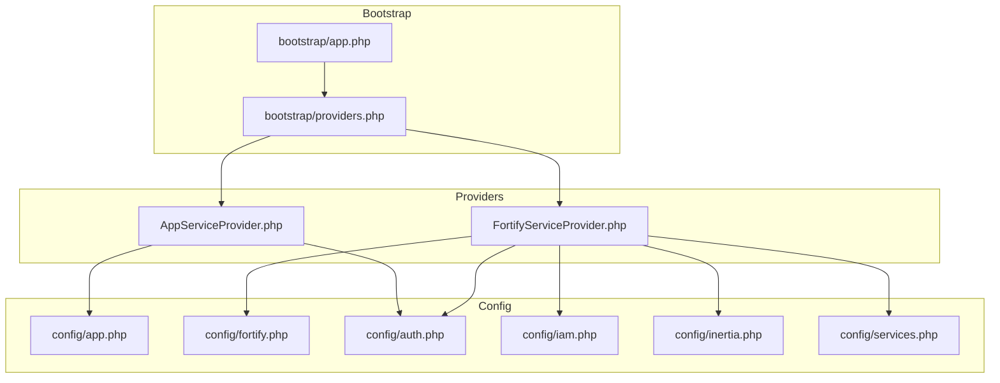
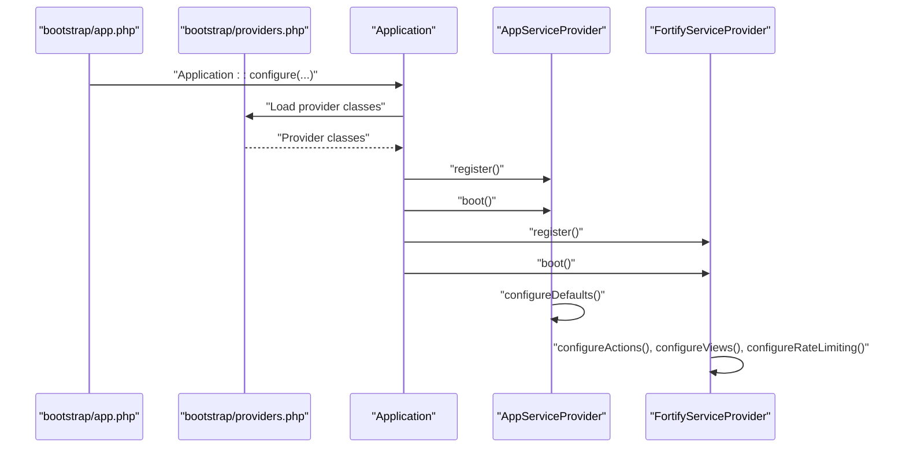
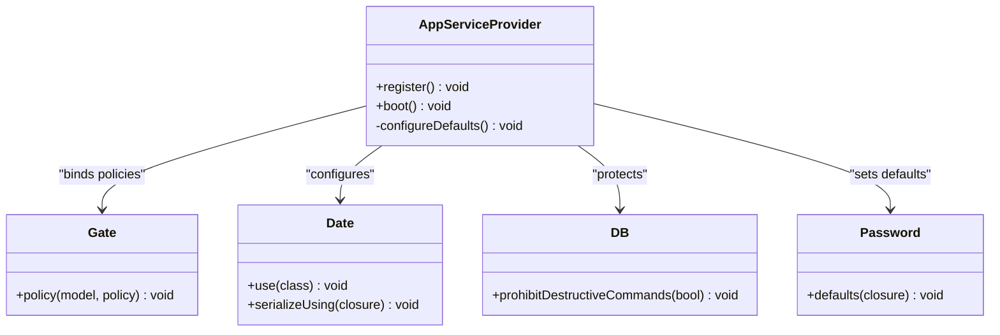
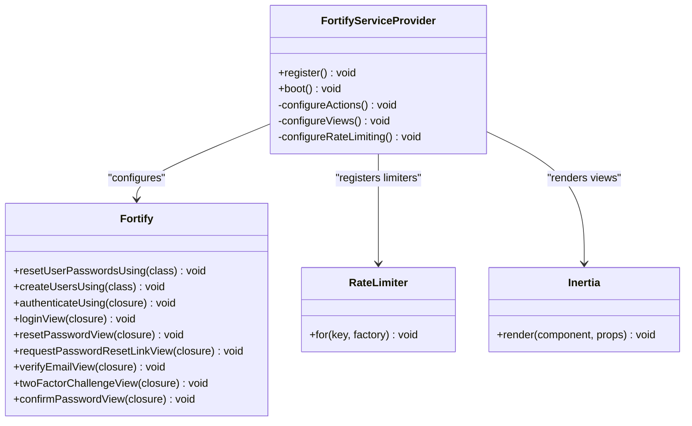
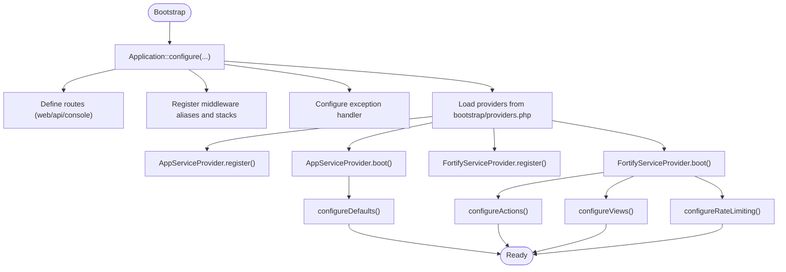
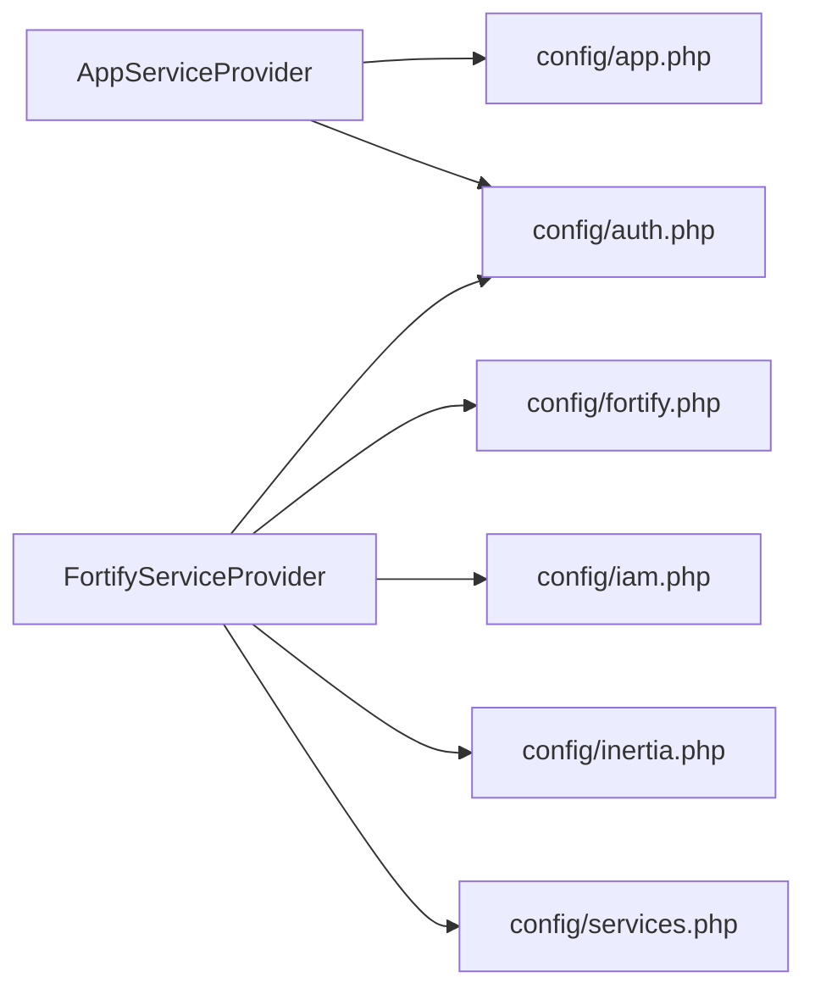

# Provider & Configuration

<cite>
**Referenced Files in This Document**
- [AppServiceProvider.php](file://app/Providers/AppServiceProvider.php)
- [FortifyServiceProvider.php](file://app/Providers/FortifyServiceProvider.php)
- [app.php](file://bootstrap/app.php)
- [providers.php](file://bootstrap/providers.php)
- [app.php](file://config/app.php)
- [auth.php](file://config/auth.php)
- [fortify.php](file://config/fortify.php)
- [services.php](file://config/services.php)
- [iam.php](file://config/iam.php)
- [inertia.php](file://config/inertia.php)
- [composer.json](file://composer.json)
- [phpunit.xml](file://phpunit.xml)
- [TestCase.php](file://tests/TestCase.php)
</cite>

## Table of Contents
1. [Introduction](#introduction)
2. [Project Structure](#project-structure)
3. [Core Components](#core-components)
4. [Architecture Overview](#architecture-overview)
5. [Detailed Component Analysis](#detailed-component-analysis)
6. [Dependency Analysis](#dependency-analysis)
7. [Performance Considerations](#performance-considerations)
8. [Troubleshooting Guide](#troubleshooting-guide)
9. [Conclusion](#conclusion)
10. [Appendices](#appendices)

## Introduction
This document focuses on Laravel service provider implementation and application configuration management within the Kepegawaian application. It explains how providers register and bootstrap services, how the dependency injection container is bound, and how application configuration is loaded and managed. It documents the provider implementation patterns used in this codebase, including the core AppServiceProvider for foundational bindings and the FortifyServiceProvider for authentication services. It also covers the application bootstrap process, service registration patterns, configuration caching strategies, provider testing approaches, configuration management best practices, and application initialization patterns.

## Project Structure
The provider and configuration system centers around:
- Providers: app/Providers/AppServiceProvider.php and app/Providers/FortifyServiceProvider.php
- Bootstrap: bootstrap/app.php and bootstrap/providers.php
- Configuration: config/*.php files for application, authentication, Fortify, IAM, Inertia, and third-party services
- Composer scripts and environment orchestration: composer.json and phpunit.xml
- Testing foundation: tests/TestCase.php

**Diagram sources**
- [app.php:1-35](file://bootstrap/app.php#L1-L35)
- [providers.php:1-10](file://bootstrap/providers.php#L1-L10)
- [AppServiceProvider.php:1-60](file://app/Providers/AppServiceProvider.php#L1-L60)
- [FortifyServiceProvider.php:1-102](file://app/Providers/FortifyServiceProvider.php#L1-L102)
- [app.php:1-127](file://config/app.php#L1-L127)
- [auth.php:1-118](file://config/auth.php#L1-L118)
- [fortify.php:1-157](file://config/fortify.php#L1-L157)
- [iam.php:1-9](file://config/iam.php#L1-L9)
- [inertia.php:1-56](file://config/inertia.php#L1-L56)
- [services.php:1-39](file://config/services.php#L1-L39)

**Section sources**
- [app.php:1-35](file://bootstrap/app.php#L1-L35)
- [providers.php:1-10](file://bootstrap/providers.php#L1-L10)

## Core Components
- AppServiceProvider: Registers application-wide policies, configures default behaviors for production readiness, and sets up serialization and validation defaults.
- FortifyServiceProvider: Configures authentication actions, views, and rate limiting tailored to the application’s user model and requirements.

Key responsibilities:
- Provider lifecycle: register() for container bindings and boot() for runtime configuration.
- Configuration loading: reading from config files and environment variables.
- Environment-specific settings: production vs development toggles for security and validation.

**Section sources**
- [AppServiceProvider.php:15-60](file://app/Providers/AppServiceProvider.php#L15-L60)
- [FortifyServiceProvider.php:18-102](file://app/Providers/FortifyServiceProvider.php#L18-L102)

## Architecture Overview
The application initializes through bootstrap/app.php, which configures routing, middleware, and exception handling. It then loads providers from bootstrap/providers.php. Each provider contributes bindings and bootstraps services according to its role.

**Diagram sources**
- [app.php:11-34](file://bootstrap/app.php#L11-L34)
- [providers.php:6-9](file://bootstrap/providers.php#L6-L9)
- [AppServiceProvider.php:20-58](file://app/Providers/AppServiceProvider.php#L20-L58)
- [FortifyServiceProvider.php:23-100](file://app/Providers/FortifyServiceProvider.php#L23-L100)

## Detailed Component Analysis

### AppServiceProvider
Responsibilities:
- Policy registration for domain models.
- Production-ready defaults for date handling, destructive command protection, and password validation rules.

Implementation highlights:
- Policy binding ensures authorization logic is enforced for the Pegawai model.
- Date facade configuration standardizes serialization format and immutability behavior.
- DB protection prevents destructive commands in production environments.
- Password validation defaults increase security posture in production.

**Diagram sources**
- [AppServiceProvider.php:15-58](file://app/Providers/AppServiceProvider.php#L15-L58)
- [auth.php:64-74](file://config/auth.php#L64-L74)

**Section sources**
- [AppServiceProvider.php:28-58](file://app/Providers/AppServiceProvider.php#L28-L58)
- [auth.php:64-74](file://config/auth.php#L64-L74)

### FortifyServiceProvider
Responsibilities:
- Authentication actions: user creation and password reset actions.
- Custom authentication logic using NIP and password against the Pegawai model.
- Inertia-based view rendering for authentication screens.
- Rate limiting for login and two-factor challenges.

Implementation highlights:
- Uses Fortify APIs to register actions and views.
- Implements a custom authenticateUsing closure to integrate with the Pegawai model.
- Defines rate limiters keyed by username/IP combinations.

**Diagram sources**
- [FortifyServiceProvider.php:18-100](file://app/Providers/FortifyServiceProvider.php#L18-L100)
- [fortify.php:146-154](file://config/fortify.php#L146-L154)

**Section sources**
- [FortifyServiceProvider.php:31-100](file://app/Providers/FortifyServiceProvider.php#L31-L100)
- [auth.php:64-74](file://config/auth.php#L64-L74)

### Application Bootstrap and Provider Registration
- bootstrap/app.php configures routing, middleware aliasing, cookie encryption, and middleware stacks.
- bootstrap/providers.php lists provider classes to be registered and booted by the framework.

**Diagram sources**
- [app.php:11-34](file://bootstrap/app.php#L11-L34)
- [providers.php:6-9](file://bootstrap/providers.php#L6-L9)
- [AppServiceProvider.php:20-58](file://app/Providers/AppServiceProvider.php#L20-L58)
- [FortifyServiceProvider.php:23-100](file://app/Providers/FortifyServiceProvider.php#L23-L100)

**Section sources**
- [app.php:11-34](file://bootstrap/app.php#L11-L34)
- [providers.php:6-9](file://bootstrap/providers.php#L6-L9)

### Configuration Loading and Environment-Specific Settings
- config/app.php: application metadata, environment, debug, URL, timezone, locale, encryption key, and maintenance driver/store.
- config/auth.php: authentication defaults, guards, providers, password reset configuration, and timeouts.
- config/fortify.php: Fortify guard, password broker, username/email, home path, middleware, rate limiters, and feature flags.
- config/iam.php: IAM token and SSO code TTLs, and application slug.
- config/inertia.php: SSR enablement and testing page paths.
- config/services.php: third-party service credentials.

Environment variables drive configuration values, enabling environment-specific behavior without changing code.

**Section sources**
- [app.php:16-126](file://config/app.php#L16-L126)
- [auth.php:18-115](file://config/auth.php#L18-L115)
- [fortify.php:18-154](file://config/fortify.php#L18-L154)
- [iam.php:4-8](file://config/iam.php#L4-L8)
- [inertia.php:18-53](file://config/inertia.php#L18-L53)
- [services.php:17-36](file://config/services.php#L17-L36)

## Dependency Analysis
Provider-to-configuration and provider-to-framework dependencies:
- AppServiceProvider depends on config/app.php for environment and maintenance settings, config/auth.php for policy registration, and Laravel facades for Date, DB, Gate, and Validation.
- FortifyServiceProvider depends on config/fortify.php for guard/password broker, config/auth.php for the user provider, config/iam.php for token lifetimes, config/inertia.php for SSR and testing, and Laravel/Fortify APIs for actions, views, and rate limiting.

**Diagram sources**
- [AppServiceProvider.php:15-58](file://app/Providers/AppServiceProvider.php#L15-L58)
- [FortifyServiceProvider.php:18-100](file://app/Providers/FortifyServiceProvider.php#L18-L100)
- [app.php:16-126](file://config/app.php#L16-L126)
- [auth.php:18-115](file://config/auth.php#L18-L115)
- [fortify.php:18-154](file://config/fortify.php#L18-L154)
- [iam.php:4-8](file://config/iam.php#L4-L8)
- [inertia.php:18-53](file://config/inertia.php#L18-L53)
- [services.php:17-36](file://config/services.php#L17-L36)

**Section sources**
- [AppServiceProvider.php:15-58](file://app/Providers/AppServiceProvider.php#L15-L58)
- [FortifyServiceProvider.php:18-100](file://app/Providers/FortifyServiceProvider.php#L18-L100)

## Performance Considerations
- Provider boot ordering matters: ensure heavy or slow boot tasks are deferred until needed.
- Use environment checks to avoid unnecessary work in non-production environments.
- Keep rate limiters tuned to prevent abuse without impacting legitimate traffic.
- Prefer lazy-loading of expensive services via closures or deferred bindings.

[No sources needed since this section provides general guidance]

## Troubleshooting Guide
Common areas to verify:
- Provider registration: ensure providers are listed in bootstrap/providers.php and autoload is up to date.
- Environment variables: confirm APP_ENV, APP_DEBUG, APP_KEY, and IAM_* variables are set appropriately.
- Authentication model: verify the user provider model in config/auth.php matches the intended model.
- Fortify features: check config/fortify.php features and rate limiter keys.
- Testing environment: review phpunit.xml environment overrides for consistent test runs.

**Section sources**
- [providers.php:6-9](file://bootstrap/providers.php#L6-L9)
- [app.php:16-100](file://config/app.php#L16-L100)
- [auth.php:64-74](file://config/auth.php#L64-L74)
- [fortify.php:146-154](file://config/fortify.php#L146-L154)
- [iam.php:4-8](file://config/iam.php#L4-L8)
- [phpunit.xml:20-35](file://phpunit.xml#L20-L35)

## Conclusion
The Kepegawaian application employs a clean separation of concerns through dedicated providers:
- AppServiceProvider centralizes production-ready defaults and policy registration.
- FortifyServiceProvider encapsulates authentication logic, views, and rate limiting tailored to the Pegawai model.
Together with bootstrap/app.php and bootstrap/providers.php, this structure enables predictable application initialization, robust configuration management, and maintainable provider testing strategies.

[No sources needed since this section summarizes without analyzing specific files]

## Appendices

### Provider Testing Approaches
- Use the shared test base class to conditionally skip tests when specific Fortify features are disabled.
- Leverage phpunit.xml environment overrides to isolate tests and speed up execution.

**Section sources**
- [TestCase.php:8-16](file://tests/TestCase.php#L8-L16)
- [phpunit.xml:20-35](file://phpunit.xml#L20-L35)

### Configuration Caching Strategies
- Use Laravel’s configuration caching to improve boot performance in production.
- Keep environment-specific values in .env and config files to avoid hardcoding.
- Validate cache regeneration after configuration changes.

[No sources needed since this section provides general guidance]

### Application Initialization Patterns
- Centralize routing and middleware configuration in bootstrap/app.php.
- Register providers in bootstrap/providers.php for explicit control.
- Use composer scripts to automate setup and testing.

**Section sources**
- [app.php:11-34](file://bootstrap/app.php#L11-L34)
- [providers.php:6-9](file://bootstrap/providers.php#L6-L9)
- [composer.json:43-97](file://composer.json#L43-L97)