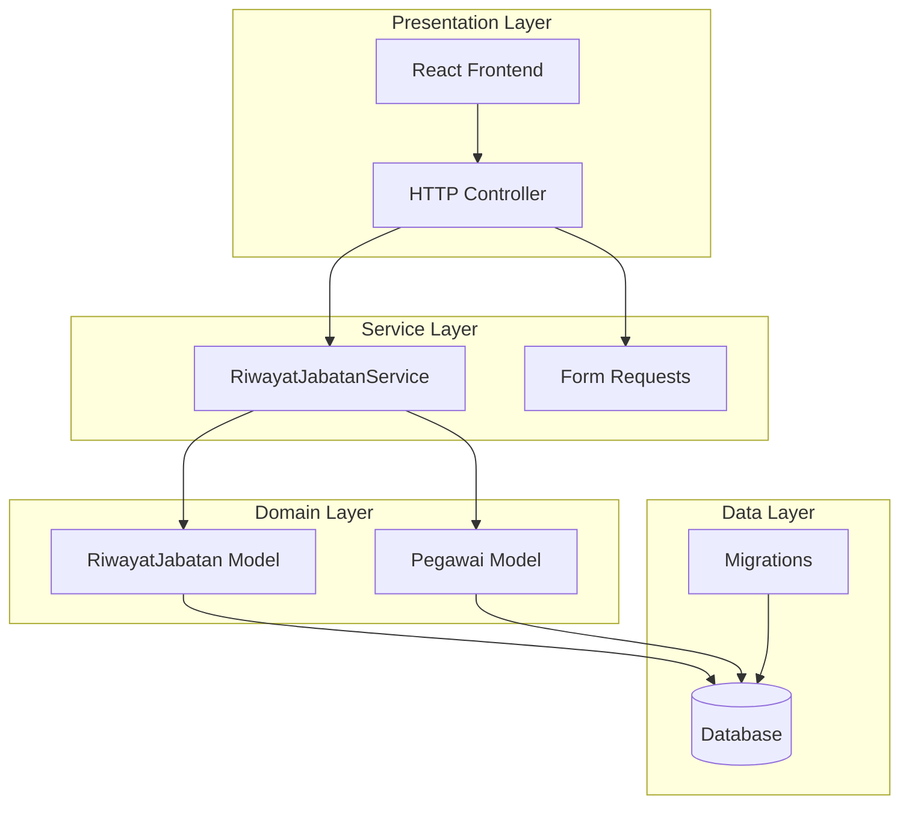
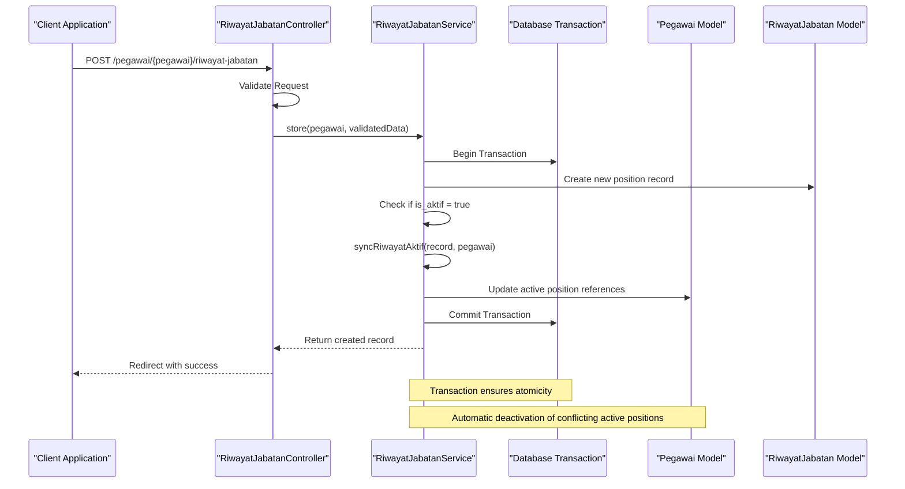
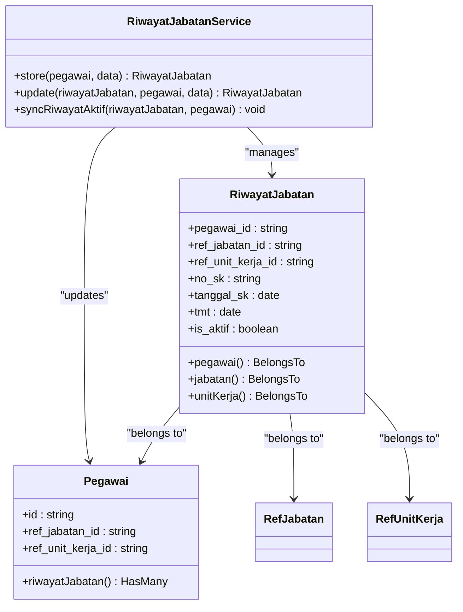
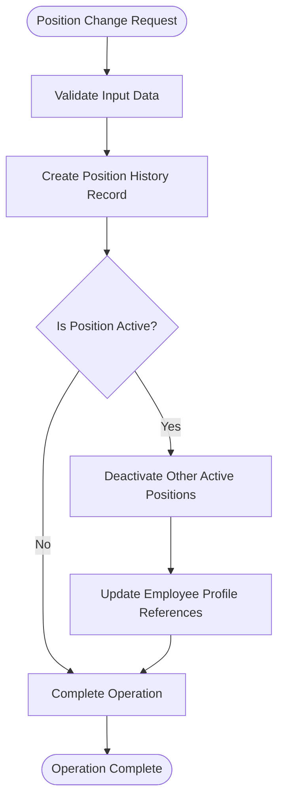
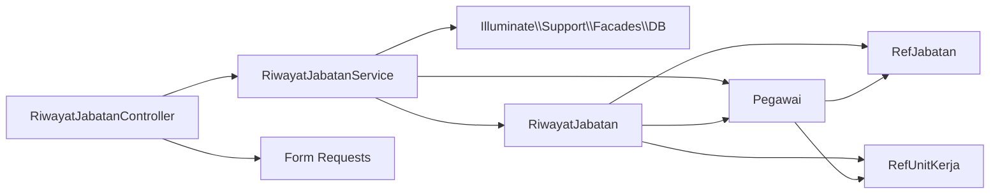

# Career History Service

<cite>
**Referenced Files in This Document**
- [RiwayatJabatanService.php](file://app/Services/RiwayatJabatanService.php)
- [RiwayatJabatan.php](file://app/Models/RiwayatJabatan.php)
- [RiwayatJabatanController.php](file://app/Http/Controllers/Kepegawaian/RiwayatJabatanController.php)
- [StoreRiwayatJabatanRequest.php](file://app/Http/Requests/Kepegawaian/StoreRiwayatJabatanRequest.php)
- [UpdateRiwayatJabatanRequest.php](file://app/Http/Requests/Kepegawaian/UpdateRiwayatJabatanRequest.php)
- [create_riwayat_jabatan_table.php](file://database/migrations/2026_03_15_030540_create_riwayat_jabatan_table.php)
- [create_pegawai_table.php](file://database/migrations/2026_03_15_024651_create_pegawai_table.php)
- [Pegawai.php](file://app/Models/Pegawai.php)
- [riwayat-jabatan.tsx](file://resources/js/pages/kepegawaian/pegawai/riwayat-jabatan.tsx)
- [RiwayatJabatanServiceTest.php](file://tests/Unit/Services/RiwayatJabatanServiceTest.php)
- [RiwayatJabatanTest.php](file://tests/Feature/Kepegawaian/RiwayatJabatanTest.php)
</cite>

## Table of Contents
1. [Introduction](#introduction)
2. [Project Structure](#project-structure)
3. [Core Components](#core-components)
4. [Architecture Overview](#architecture-overview)
5. [Detailed Component Analysis](#detailed-component-analysis)
6. [Dependency Analysis](#dependency-analysis)
7. [Performance Considerations](#performance-considerations)
8. [Troubleshooting Guide](#troubleshooting-guide)
9. [Conclusion](#conclusion)

## Introduction
This document provides comprehensive documentation for the RiwayatJabatanService class, which manages career progression tracking and position history for employees. The service ensures chronological consistency in position histories, validates career progression sequences, maintains historical position data, and synchronizes active position references with employee profiles. It integrates tightly with the employee profile management system and provides robust validation for organizational policy compliance.

The service operates within a transactional context to guarantee data integrity during position change operations, automatically deactivating conflicting active positions and updating employee profile references accordingly.

## Project Structure
The career history service is part of a larger HR management system with clear separation of concerns:

**Diagram sources**
- [RiwayatJabatanService.php:1-50](file://app/Services/RiwayatJabatanService.php#L1-L50)
- [RiwayatJabatanController.php:1-106](file://app/Http/Controllers/Kepegawaian/RiwayatJabatanController.php#L1-L106)
- [RiwayatJabatan.php:1-59](file://app/Models/RiwayatJabatan.php#L1-L59)

**Section sources**
- [RiwayatJabatanService.php:1-50](file://app/Services/RiwayatJabatanService.php#L1-L50)
- [RiwayatJabatanController.php:1-106](file://app/Http/Controllers/Kepegawaian/RiwayatJabatanController.php#L1-L106)

## Core Components
The RiwayatJabatanService class consists of three primary methods that handle position history operations:

### Service Methods
- **store**: Creates new position history records with transactional safety
- **update**: Updates existing position history with validation and synchronization
- **syncRiwayatAktif**: Synchronizes active position references across related records

### Data Model Relationships
The service interacts with multiple models through well-defined relationships:
- RiwayatJabatan belongs to Pegawai (employee)
- RiwayatJabatan belongs to RefJabatan (position reference)
- RiwayatJabatan belongs to RefUnitKerja (department reference)
- Pegawai has many RiwayatJabatan records

**Section sources**
- [RiwayatJabatanService.php:9-48](file://app/Services/RiwayatJabatanService.php#L9-L48)
- [RiwayatJabatan.php:39-57](file://app/Models/RiwayatJabatan.php#L39-L57)
- [Pegawai.php:99-102](file://app/Models/Pegawai.php#L99-L102)

## Architecture Overview
The service follows a layered architecture pattern with clear separation between presentation, service, and persistence layers:

**Diagram sources**
- [RiwayatJabatanController.php:76-83](file://app/Http/Controllers/Kepegawaian/RiwayatJabatanController.php#L76-L83)
- [RiwayatJabatanService.php:11-22](file://app/Services/RiwayatJabatanService.php#L11-L22)
- [RiwayatJabatanService.php:37-48](file://app/Services/RiwayatJabatanService.php#L37-L48)

## Detailed Component Analysis

### RiwayatJabatanService Class
The service implements a focused set of operations for managing position history with strong data integrity guarantees.

#### Core Method Implementations

**Store Method**
The store method creates new position history records within a database transaction, ensuring atomic operations. When a new position becomes active, it triggers automatic synchronization to maintain data consistency.

**Update Method**
The update method provides controlled modification of existing position records while preserving transactional integrity. It performs the same synchronization logic as the store operation when activating positions.

**SyncRiwayatAktif Method**
This critical method enforces organizational policy by ensuring only one active position record exists per employee. It deactivates all conflicting active records and updates the employee's profile references to match the newly activated position.

**Diagram sources**
- [RiwayatJabatanService.php:9-48](file://app/Services/RiwayatJabatanService.php#L9-L48)
- [RiwayatJabatan.php:11-52](file://app/Models/RiwayatJabatan.php#L11-L52)
- [Pegawai.php:24-102](file://app/Models/Pegawai.php#L24-L102)

#### Position History Validation Logic
The service implements several validation mechanisms to ensure chronological consistency and organizational compliance:

**Chronological Consistency**
- TMT (Time of Taking Office) validation ensures proper sequencing of position changes
- Date validation prevents future-dated entries that would disrupt historical accuracy
- Sequential validation ensures each new position logically follows previous positions

**Organizational Policy Compliance**
- Single active position enforcement prevents overlapping concurrent positions
- Reference validation ensures all position and department references are valid
- Audit trail maintenance through soft deletes preserves historical context

**Section sources**
- [RiwayatJabatanService.php:37-48](file://app/Services/RiwayatJabatanService.php#L37-L48)
- [StoreRiwayatJabatanRequest.php:14-26](file://app/Http/Requests/Kepegawaian/StoreRiwayatJabatanRequest.php#L14-L26)
- [UpdateRiwayatJabatanRequest.php:14-26](file://app/Http/Requests/Kepegawaian/UpdateRiwayatJabatanRequest.php#L14-L26)

### Data Integrity and Audit Trail Management
The service maintains comprehensive audit trails through multiple mechanisms:

**Transaction-Based Atomicity**
All position history operations occur within database transactions, ensuring either complete success or complete rollback. This prevents partial updates that could compromise data integrity.

**Soft Delete Implementation**
Position history records use soft deletes, allowing administrators to maintain complete historical context while removing records from active consideration. This approach preserves audit trails and enables historical analysis.

**Reference Integrity**
Foreign key constraints ensure that all position and department references remain valid throughout the lifecycle of position history records.

**Section sources**
- [RiwayatJabatanService.php:13-21](file://app/Services/RiwayatJabatanService.php#L13-L21)
- [create_riwayat_jabatan_table.php:14-27](file://database/migrations/2026_03_15_030540_create_riwayat_jabatan_table.php#L14-L27)
- [RiwayatJabatan.php:13-13](file://app/Models/RiwayatJabatan.php#L13-L13)

### Integration with Employee Profile Management
The service seamlessly integrates with the broader employee profile management system:

**Active Position Synchronization**
When a position becomes active, the service automatically updates the employee's profile to reflect the current position and department. This ensures consistency across the entire system.

**Hierarchical Data Flow**

**Diagram sources**
- [RiwayatJabatanService.php:16-18](file://app/Services/RiwayatJabatanService.php#L16-L18)
- [RiwayatJabatanService.php:39-47](file://app/Services/RiwayatJabatanService.php#L39-L47)

**Section sources**
- [RiwayatJabatanService.php:37-48](file://app/Services/RiwayatJabatanService.php#L37-L48)
- [Pegawai.php:74-82](file://app/Models/Pegawai.php#L74-L82)

## Dependency Analysis
The service has minimal external dependencies, focusing on core Laravel functionality and internal models:

**Diagram sources**
- [RiwayatJabatanService.php:5-7](file://app/Services/RiwayatJabatanService.php#L5-L7)
- [RiwayatJabatanController.php:12](file://app/Http/Controllers/Kepegawaian/RiwayatJabatanController.php#L12)

The service demonstrates low coupling with high cohesion, making it maintainable and testable. Dependencies are primarily through Laravel's Eloquent ORM and database transaction management.

**Section sources**
- [RiwayatJabatanService.php:1-50](file://app/Services/RiwayatJabatanService.php#L1-L50)
- [RiwayatJabatanController.php:1-106](file://app/Http/Controllers/Kepegawaian/RiwayatJabatanController.php#L1-L106)

## Performance Considerations
The service is designed for optimal performance through several architectural decisions:

**Database Transaction Efficiency**
- Single transaction per operation minimizes database overhead
- Batch updates for deactivating conflicting records reduce query count
- Index-friendly foreign key operations leverage database optimization

**Memory Usage Optimization**
- Lazy loading through Eloquent relationships prevents unnecessary data loading
- Selective field retrieval in controller responses reduces memory footprint
- Efficient query scopes minimize database load

**Scalability Factors**
- ULID-based identifiers prevent hot-spotting in high-concurrency scenarios
- Soft deletes enable historical analysis without performance impact
- Transaction isolation ensures data consistency under concurrent access

## Troubleshooting Guide

### Common Issues and Solutions

**Concurrent Position Changes**
When multiple position changes occur simultaneously, the service ensures only one active position remains through automatic deactivation of conflicting records. This prevents race conditions and maintains data integrity.

**Validation Failures**
Input validation occurs at multiple levels:
- Form request validation ensures data format correctness
- Database constraints enforce referential integrity
- Business logic validation prevents logical inconsistencies

**Audit Trail Preservation**
Soft deletes maintain complete historical context while preventing conflicts with active records. This enables comprehensive auditing and historical analysis.

**Section sources**
- [RiwayatJabatanServiceTest.php:30-47](file://tests/Unit/Services/RiwayatJabatanServiceTest.php#L30-L47)
- [RiwayatJabatanTest.php:60-94](file://tests/Feature/Kepegawaian/RiwayatJabatanTest.php#L60-L94)

### Error Handling Patterns
The service implements consistent error handling through Laravel's built-in mechanisms:
- Database transaction rollback on failures
- Validation error propagation to user interface
- Graceful handling of missing or invalid references

## Conclusion
The RiwayatJabatanService class provides a robust foundation for career progression tracking and position history management. Its transactional design ensures data integrity, while its integration with employee profile management maintains consistency across the entire system. The service's focus on validation, audit trail preservation, and organizational policy compliance makes it suitable for production environments requiring reliable HR data management.

Key strengths include:
- Atomic transactional operations ensuring data consistency
- Automatic conflict resolution for concurrent position changes
- Comprehensive validation at multiple layers
- Maintained audit trails through soft deletes
- Seamless integration with broader employee management systems

The service's design supports future enhancements for advanced career progression analytics, policy validation, and integration with external systems while maintaining backward compatibility and operational reliability.