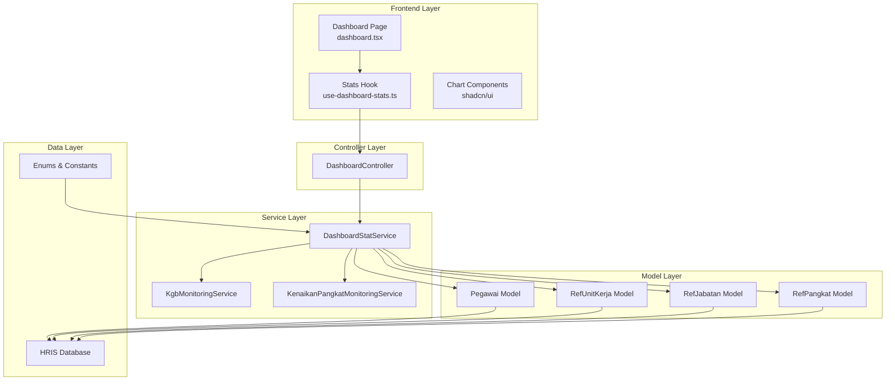
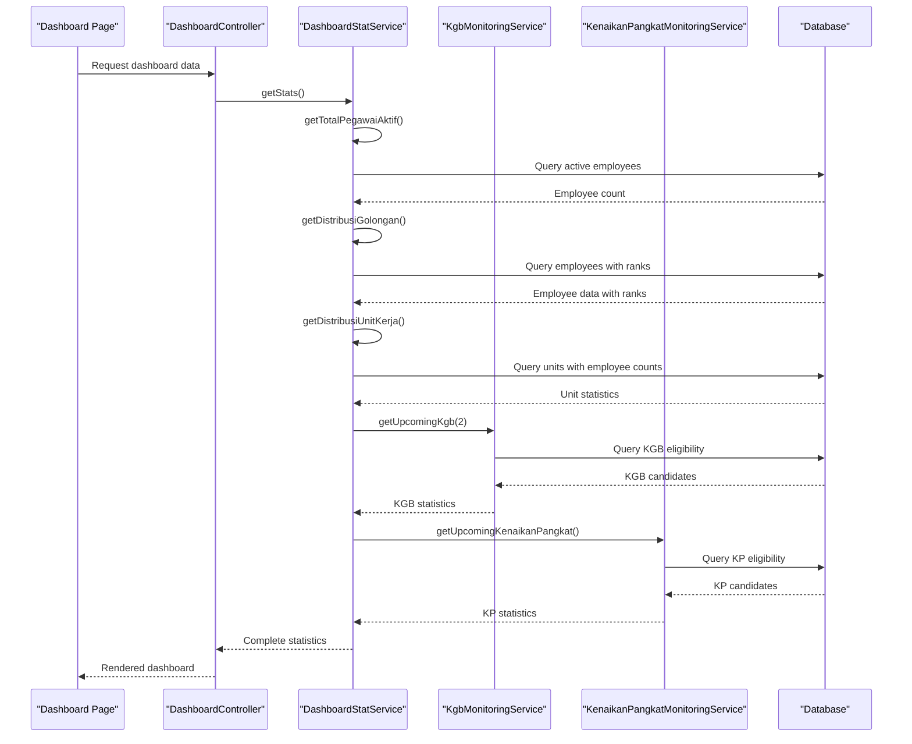
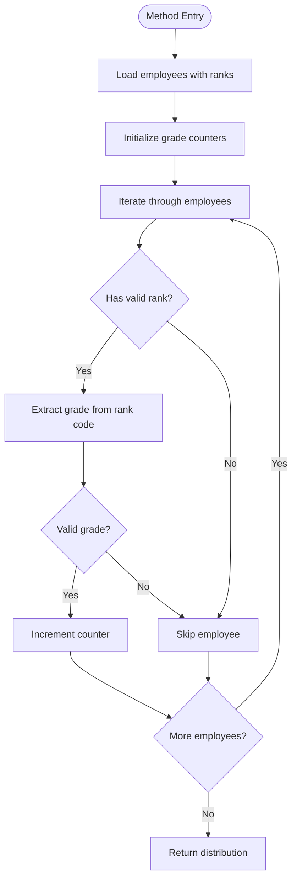
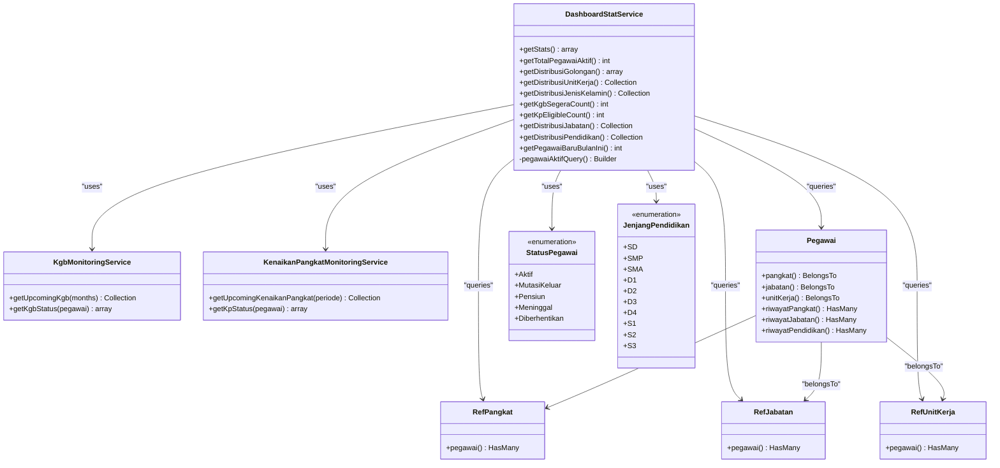

# Dashboard Statistics Service

<cite>
**Referenced Files in This Document**
- [DashboardStatService.php](file://app/Services/DashboardStatService.php)
- [DashboardController.php](file://app/Http/Controllers/DashboardController.php)
- [use-dashboard-stats.ts](file://resources/js/hooks/use-dashboard-stats.ts)
- [dashboard.tsx](file://resources/js/pages/dashboard.tsx)
- [KgbMonitoringService.php](file://app/Services/KgbMonitoringService.php)
- [KenaikanPangkatMonitoringService.php](file://app/Services/KenaikanPangkatMonitoringService.php)
- [Pegawai.php](file://app/Models/Pegawai.php)
- [StatusPegawai.php](file://app/Enums/StatusPegawai.php)
- [JenjangPendidikan.php](file://app/Enums/JenjangPendidikan.php)
- [DashboardStatServiceTest.php](file://tests/Unit/Services/DashboardStatServiceTest.php)
</cite>

## Table of Contents
1. [Introduction](#introduction)
2. [Project Structure](#project-structure)
3. [Core Components](#core-components)
4. [Architecture Overview](#architecture-overview)
5. [Detailed Component Analysis](#detailed-component-analysis)
6. [Dependency Analysis](#dependency-analysis)
7. [Performance Considerations](#performance-considerations)
8. [Troubleshooting Guide](#troubleshooting-guide)
9. [Conclusion](#conclusion)

## Introduction

The DashboardStatService class serves as the central analytics engine for the HRIS (Human Resource Information System) dashboard, aggregating and processing HR data to provide meaningful insights for administrative decision-making. This service transforms raw HRIS data into structured statistical reports that power the dashboard visualization components, enabling managers to quickly understand workforce demographics, career progression patterns, and upcoming HR events.

The service operates on a comprehensive dataset spanning employee demographics, organizational structure, career progression, and HR compliance indicators. It provides real-time statistics that reflect the current state of the organization's human capital, with special emphasis on upcoming KGB (Kenaikan Gaji Berkala) and Kenaikan Pangkat (Promotion) events that require administrative attention.

## Project Structure

The dashboard statistics functionality follows a layered architecture pattern within the Laravel application:

**Diagram sources**
- [DashboardController.php:10-18](file://app/Http/Controllers/DashboardController.php#L10-L18)
- [DashboardStatService.php:14-29](file://app/Services/DashboardStatService.php#L14-L29)

**Section sources**
- [DashboardStatService.php:1-148](file://app/Services/DashboardStatService.php#L1-L148)
- [DashboardController.php:1-19](file://app/Http/Controllers/DashboardController.php#L1-L19)

## Core Components

The DashboardStatService consists of nine primary statistical calculation methods, each designed to extract specific insights from the HRIS data:

### Primary Statistical Methods

1. **getTotalPegawaiAktif()** - Counts active employees
2. **getDistribusiGolongan()** - Analyzes pension grade distribution
3. **getDistribusiUnitKerja()** - Shows organizational structure breakdown
4. **getDistribusiJenisKelamin()** - Gender demographics analysis
5. **getKgbSegeraCount()** - Upcoming salary increment notifications
6. **getKpEligibleCount()** - Promotion eligibility tracking
7. **getDistribusiJabatan()** - Position hierarchy analysis
8. **getDistribusiPendidikan()** - Educational qualification distribution
9. **getPegawaiBaruBulanIni()** - Recent hire tracking

Each method employs specific data aggregation patterns optimized for performance and accuracy, utilizing Laravel's Eloquent ORM capabilities and specialized monitoring services for HR compliance events.

**Section sources**
- [DashboardStatService.php:16-29](file://app/Services/DashboardStatService.php#L16-L29)

## Architecture Overview

The dashboard statistics service implements a modular architecture that separates concerns between data extraction, processing, and presentation:

**Diagram sources**
- [DashboardController.php:12-16](file://app/Http/Controllers/DashboardController.php#L12-L16)
- [DashboardStatService.php:16-29](file://app/Services/DashboardStatService.php#L16-L29)
- [KgbMonitoringService.php:14-52](file://app/Services/KgbMonitoringService.php#L14-L52)
- [KenaikanPangkatMonitoringService.php:13-62](file://app/Services/KenaikanPangkatMonitoringService.php#L13-L62)

## Detailed Component Analysis

### getTotalPegawaiAktif() - Active Employee Count

This method provides the foundation statistic for the dashboard, representing the current workforce size. The implementation uses a scoped query that filters employees based on their active status enumeration.

**Processing Logic:**
- Applies `pegawaiAktifQuery()` scope to ensure only active employees are counted
- Uses Eloquent's `count()` method for efficient database-level counting
- Leverages the `StatusPegawai::Aktif` enum for type-safe filtering

**Performance Characteristics:**
- Single database query with WHERE clause filtering
- Minimal memory footprint during execution
- Fast execution regardless of dataset size

**Section sources**
- [DashboardStatService.php:31-34](file://app/Services/DashboardStatService.php#L31-L34)
- [StatusPegawai.php:7](file://app/Enums/StatusPegawai.php#L7)

### getDistribusiGolongan() - Pension Grade Distribution

This method analyzes the distribution of employees across pension grades (I, II, III, IV), providing insights into workforce seniority patterns and retirement planning implications.

**Data Aggregation Pattern:**
- Executes a query with eager loading (`with('pangkat')`) to minimize N+1 queries
- Processes results in PHP to categorize employees by rank code
- Handles missing rank data gracefully by excluding incomplete records

**Algorithm Implementation:**

**Diagram sources**
- [DashboardStatService.php:36-60](file://app/Services/DashboardStatService.php#L36-L60)

**Performance Considerations:**
- Single query with JOIN operation for rank data
- In-memory processing with O(n) complexity
- Efficient grade extraction using string manipulation

**Section sources**
- [DashboardStatService.php:36-60](file://app/Services/DashboardStatService.php#L36-L60)

### getDistribusiUnitKerja() - Organizational Structure Analysis

This method provides insights into the distribution of employees across organizational units, helping administrators understand departmental composition and resource allocation.

**Query Optimization:**
- Uses `withCount()` to efficiently calculate employee counts per unit
- Implements `orderByDesc('pegawai_count')` for database-level sorting
- Limits results to top 6 units using `take(6)` for dashboard visualization constraints

**Data Processing:**
- Maps raw query results to standardized array format
- Extracts unit name and calculated employee count
- Maintains consistent data structure for frontend consumption

**Performance Characteristics:**
- Single optimized query with COUNT aggregation
- Database-level sorting and limiting reduces memory usage
- Efficient for large organizational structures

**Section sources**
- [DashboardStatService.php:62-73](file://app/Services/DashboardStatService.php#L62-L73)

### getDistribusiJenisKelamin() - Gender Demographics

This method analyzes gender distribution among active employees, providing essential diversity metrics for HR planning and compliance reporting.

**SQL Aggregation Strategy:**
- Employs `selectRaw('jenis_kelamin, count(*) as total')` for efficient grouping
- Uses `groupBy('jenis_kelamin')` for database-level aggregation
- Leverages enum casting for consistent gender value representation

**Data Transformation:**
- Maps raw database results to standardized frontend format
- Converts enum values to display-friendly labels
- Ensures consistent data structure across different gender categories

**Performance Benefits:**
- Database-level aggregation minimizes PHP processing overhead
- Single query with GROUP BY operation
- Efficient memory usage for demographic calculations

**Section sources**
- [DashboardStatService.php:75-85](file://app/Services/DashboardStatService.php#L75-L85)

### getKgbSegeraCount() - Upcoming Salary Increment Tracking

This method integrates with the KGB monitoring service to identify employees whose next salary increment (KGB) is approaching, requiring administrative attention.

**Integration Pattern:**
- Utilizes Laravel's service container for dependency injection
- Calls `getUpcomingKgb(2)` with 2-month threshold for "segera" (urgent) classification
- Leverages existing monitoring service logic for accurate KGB calculation

**Business Logic:**
- KGB occurs every 2 years based on employee's last rank promotion
- Threshold-based classification for urgent vs. upcoming increments
- Integration with existing KGB monitoring infrastructure

**Performance Implications:**
- Delegates complex KGB calculation to specialized monitoring service
- Reuses existing database queries and business logic
- Minimizes code duplication and maintenance overhead

**Section sources**
- [DashboardStatService.php:87-90](file://app/Services/DashboardStatService.php#L87-L90)
- [KgbMonitoringService.php:14-52](file://app/Services/KgbMonitoringService.php#L14-L52)

### getKpEligibleCount() - Promotion Eligibility Analysis

This method tracks employees who are eligible for promotion (Kenaikan Pangkat), providing crucial information for career advancement planning and resource allocation.

**Eligibility Calculation:**
- Integrates with KenaikanPangkatMonitoringService for accurate eligibility determination
- Filters results to count employees meeting "Sudah Eligible" criteria
- Considers 4-year promotion cycle based on current rank

**Monitoring Integration:**
- Leverages existing KP monitoring service for business logic accuracy
- Uses standardized eligibility status classification
- Ensures consistency with formal promotion procedures

**Performance Characteristics:**
- Reuses existing KP monitoring service logic
- Efficient filtering of pre-calculated results
- Minimal additional computational overhead

**Section sources**
- [DashboardStatService.php:92-98](file://app/Services/DashboardStatService.php#L92-L98)
- [KenaikanPangkatMonitoringService.php:13-62](file://app/Services/KenaikanPangkatMonitoringService.php#L13-L62)

### getDistribusiJabatan() - Position Hierarchy Analysis

This method analyzes the distribution of employees across different job positions, providing insights into organizational hierarchy and position utilization.

**Data Processing Strategy:**
- Eager loads position relationships to minimize query overhead
- Groups employees by position ID for efficient aggregation
- Calculates position counts and retrieves position names

**Visualization Optimization:**
- Sorts results by employee count in descending order
- Limits to top 6 positions for dashboard display constraints
- Provides position names with fallback for undefined positions

**Performance Benefits:**
- Single query with GROUP BY operation
- Database-level sorting and limiting
- Efficient memory usage for position analysis

**Section sources**
- [DashboardStatService.php:100-113](file://app/Services/DashboardStatService.php#L100-L113)

### getDistribusiPendidikan() - Educational Qualification Distribution

This method analyzes the educational qualifications of active employees, providing insights for training program planning and competency assessment.

**Enum-Based Processing:**
- Utilizes `JenjangPendidikan::tryFrom()` for safe enum conversion
- Falls back to uppercase string processing for unknown values
- Provides display-friendly labels through enum `label()` method

**Data Aggregation Pattern:**
- Filters out employees with null education values
- Groups employees by education level for accurate counting
- Sorts results by employee count for meaningful visualization

**Quality Assurance:**
- Graceful handling of unknown education values
- Consistent labeling through enum system
- Comprehensive coverage of all education levels

**Section sources**
- [DashboardStatService.php:115-131](file://app/Services/DashboardStatService.php#L115-L131)
- [JenjangPendidikan.php:18-32](file://app/Enums/JenjangPendidikan.php#L18-L32)

### getPegawaiBaruBulanIni() - Recent Hire Tracking

This method identifies new employees hired within the current month, providing insights for onboarding activities and orientation program planning.

**Temporal Filtering:**
- Uses Carbon date comparison for current month/year filtering
- Employs `whereMonth()` and `whereYear()` for precise temporal boundaries
- Ensures accurate monthly hiring trend analysis

**Performance Characteristics:**
- Single query with date-based filtering
- Efficient database-level temporal comparison
- Minimal processing overhead for recent hire identification

**Section sources**
- [DashboardStatService.php:133-141](file://app/Services/DashboardStatService.php#L133-L141)

## Dependency Analysis

The DashboardStatService maintains strategic dependencies that enable comprehensive HR analytics while maintaining separation of concerns:

**Diagram sources**
- [DashboardStatService.php:14-147](file://app/Services/DashboardStatService.php#L14-L147)
- [KgbMonitoringService.php:12-99](file://app/Services/KgbMonitoringService.php#L12-L99)
- [KenaikanPangkatMonitoringService.php:11-121](file://app/Services/KenaikanPangkatMonitoringService.php#L11-L121)
- [Pegawai.php:24-137](file://app/Models/Pegawai.php#L24-L137)

**Section sources**
- [DashboardStatService.php:5-12](file://app/Services/DashboardStatService.php#L5-L12)
- [Pegawai.php:67-82](file://app/Models/Pegawai.php#L67-L82)

## Performance Considerations

The DashboardStatService implements several optimization strategies to ensure efficient operation even with growing HRIS datasets:

### Query Optimization Strategies

1. **Eager Loading**: Strategic use of `with()` and `withCount()` to prevent N+1 query problems
2. **Database-Level Aggregation**: Leveraging SQL GROUP BY and COUNT operations for efficient calculations
3. **Selective Field Retrieval**: Using `selectRaw()` for targeted data extraction
4. **Query Limiting**: Applying `take()` and `orderByDesc()` for performance optimization

### Memory Management

- **Streaming Results**: Using `get()` with eager loading for controlled memory usage
- **Collection Processing**: Converting arrays to collections for efficient manipulation
- **Temporary Variables**: Minimizing intermediate array creation during processing

### Caching Opportunities

While the current implementation focuses on real-time data, potential caching strategies could include:
- Statistical snapshots stored with timestamps
- Incremental updates based on change detection
- Hierarchical caching for frequently accessed distributions

### Scalability Considerations

- **Pagination Integration**: Ready for pagination implementation as dataset grows
- **Index Optimization**: Database indexes for frequently queried fields
- **Query Profiling**: Built-in mechanisms for identifying performance bottlenecks

## Troubleshooting Guide

### Common Issues and Solutions

**Empty Distribution Results**
- Verify enum values match database entries
- Check for null values in related fields
- Ensure proper eager loading of relationships

**Performance Degradation**
- Monitor query execution times
- Implement database indexing for frequently filtered fields
- Consider query result caching for static distributions

**Missing Employee Data**
- Validate enum casting in model definitions
- Check relationship configurations
- Verify data integrity in reference tables

**Section sources**
- [DashboardStatServiceTest.php:19-127](file://tests/Unit/Services/DashboardStatServiceTest.php#L19-L127)

## Conclusion

The DashboardStatService represents a sophisticated analytics solution that transforms complex HRIS data into actionable insights for organizational decision-making. Through its comprehensive suite of statistical methods, the service provides administrators with real-time visibility into workforce demographics, career progression patterns, and upcoming HR compliance requirements.

The service's architecture demonstrates best practices in database optimization, enum-based data processing, and integration with specialized monitoring services. Its modular design ensures maintainability while providing the flexibility needed for evolving HR analytics requirements.

Key strengths include:
- **Performance Optimization**: Efficient query patterns and memory management
- **Data Integrity**: Robust enum-based processing and graceful error handling
- **Scalability**: Modular architecture ready for growth and enhancement
- **Integration**: Seamless coordination with existing monitoring services

The service successfully bridges the gap between raw HR data and meaningful business insights, enabling data-driven HR management decisions while maintaining system performance and reliability.