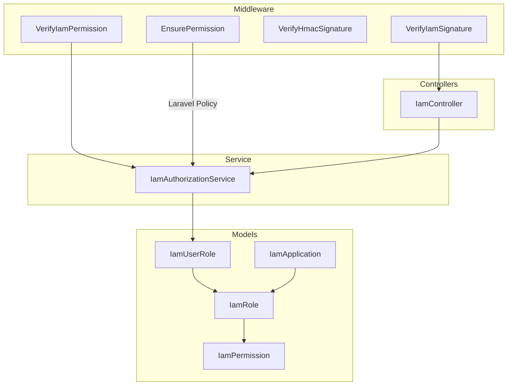
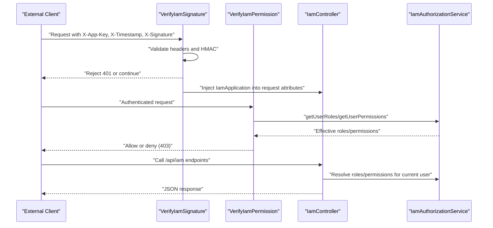
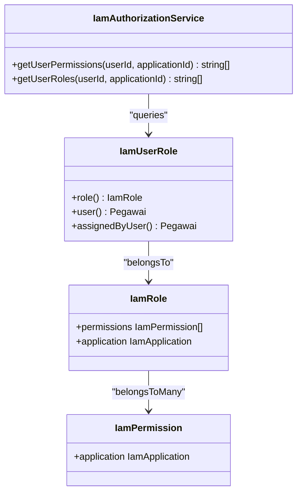
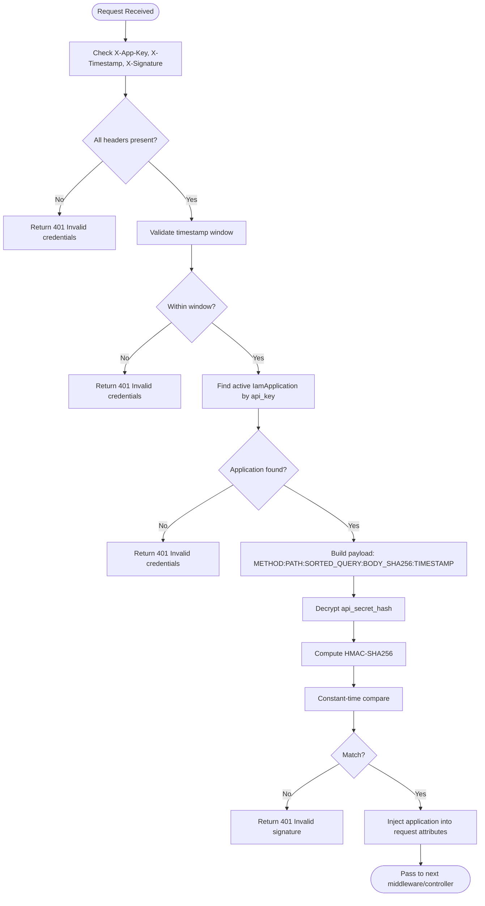
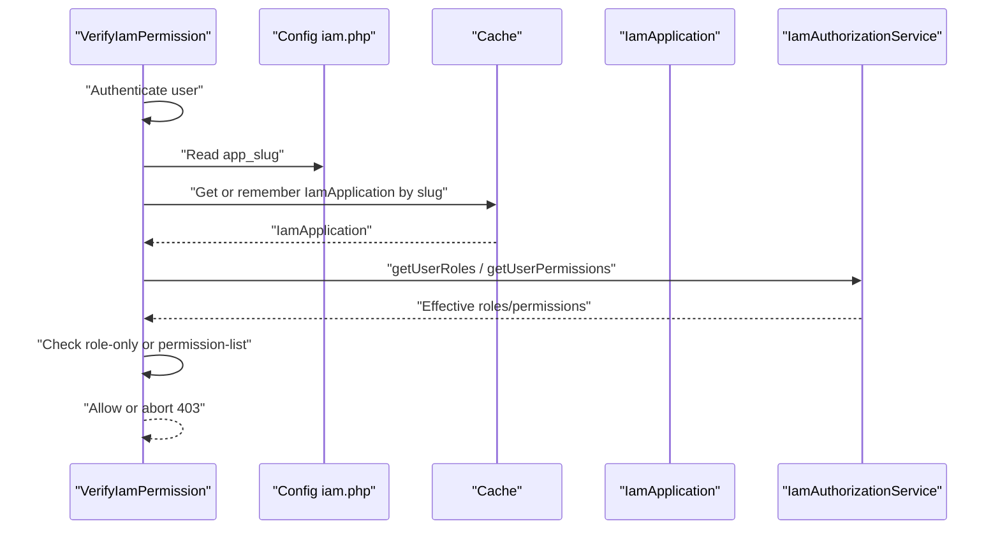
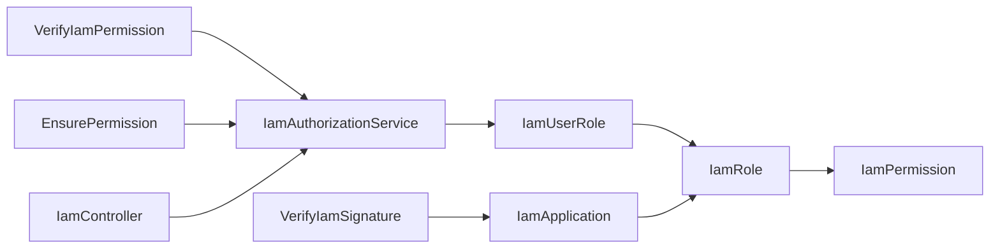

# IAM Authorization Service

<cite>
**Referenced Files in This Document**
- [IamAuthorizationService.php](file://app/Services/IamAuthorizationService.php)
- [VerifyIamSignature.php](file://app/Http/Middleware/VerifyIamSignature.php)
- [VerifyIamPermission.php](file://app/Http/Middleware/VerifyIamPermission.php)
- [VerifyHmacSignature.php](file://app/Http/Middleware/VerifyHmacSignature.php)
- [EnsurePermission.php](file://app/Http/Middleware/EnsurePermission.php)
- [IamController.php](file://app/Http/Controllers/Api/IamController.php)
- [IamApplication.php](file://app/Models/IamApplication.php)
- [IamUserRole.php](file://app/Models/IamUserRole.php)
- [IamRole.php](file://app/Models/IamRole.php)
- [IamPermission.php](file://app/Models/IamPermission.php)
- [2026_03_21_000001_create_iam_tables.php](file://database/migrations/2026_03_21_000001_create_iam_tables.php)
- [2026_03_21_000003_drop_old_rbac_tables.php](file://database/migrations/2026_03_21_000003_drop_old_rbac_tables.php)
- [iam.php](file://config/iam.php)
- [VerifyIamSignatureTest.php](file://tests/Feature/Iam/VerifyIamSignatureTest.php)
- [VerifyIamPermissionTest.php](file://tests/Feature/Iam/VerifyIamPermissionTest.php)
</cite>

## Table of Contents
1. [Introduction](#introduction)
2. [Project Structure](#project-structure)
3. [Core Components](#core-components)
4. [Architecture Overview](#architecture-overview)
5. [Detailed Component Analysis](#detailed-component-analysis)
6. [Dependency Analysis](#dependency-analysis)
7. [Performance Considerations](#performance-considerations)
8. [Troubleshooting Guide](#troubleshooting-guide)
9. [Conclusion](#conclusion)

## Introduction
This document provides comprehensive documentation for the IamAuthorizationService class and the broader Identity and Access Management (IAM) authorization system. It explains how the service validates IAM tokens, checks user permissions, and enforces access control policies. It covers method implementations for token validation, permission verification, role-based access control, and API security checks. Examples of HMAC signature verification, application authentication flows, and permission inheritance patterns are included, along with security considerations, error handling strategies, and integration with Laravel’s authorization system.

## Project Structure
The IAM authorization system spans several layers:
- Middleware for application authentication and permission enforcement
- A dedicated authorization service to compute user roles and permissions
- Eloquent models representing applications, roles, permissions, and user-role assignments
- Controllers exposing endpoints for token validation, permission checks, logout, and SSO code exchange
- Configuration and database migrations defining the IAM schema

**Diagram sources**
- [VerifyIamSignature.php:11-61](file://app/Http/Middleware/VerifyIamSignature.php#L11-L61)
- [VerifyIamPermission.php:12-54](file://app/Http/Middleware/VerifyIamPermission.php#L12-L54)
- [VerifyHmacSignature.php:17-65](file://app/Http/Middleware/VerifyHmacSignature.php#L17-L65)
- [EnsurePermission.php:9-37](file://app/Http/Middleware/EnsurePermission.php#L9-L37)
- [IamAuthorizationService.php:7-45](file://app/Services/IamAuthorizationService.php#L7-L45)
- [IamController.php:13-91](file://app/Http/Controllers/Api/IamController.php#L13-L91)
- [IamApplication.php:12-96](file://app/Models/IamApplication.php#L12-L96)
- [IamUserRole.php:7-33](file://app/Models/IamUserRole.php#L7-L33)
- [IamRole.php:10-38](file://app/Models/IamRole.php#L10-L38)
- [IamPermission.php:9-22](file://app/Models/IamPermission.php#L9-L22)

**Section sources**
- [IamAuthorizationService.php:7-45](file://app/Services/IamAuthorizationService.php#L7-L45)
- [VerifyIamSignature.php:11-61](file://app/Http/Middleware/VerifyIamSignature.php#L11-L61)
- [VerifyIamPermission.php:12-54](file://app/Http/Middleware/VerifyIamPermission.php#L12-L54)
- [VerifyHmacSignature.php:17-65](file://app/Http/Middleware/VerifyHmacSignature.php#L17-L65)
- [EnsurePermission.php:9-37](file://app/Http/Middleware/EnsurePermission.php#L9-L37)
- [IamController.php:13-91](file://app/Http/Controllers/Api/IamController.php#L13-L91)
- [IamApplication.php:12-96](file://app/Models/IamApplication.php#L12-L96)
- [IamUserRole.php:7-33](file://app/Models/IamUserRole.php#L7-L33)
- [IamRole.php:10-38](file://app/Models/IamRole.php#L10-L38)
- [IamPermission.php:9-22](file://app/Models/IamPermission.php#L9-L22)
- [2026_03_21_000001_create_iam_tables.php:14-98](file://database/migrations/2026_03_21_000001_create_iam_tables.php#L14-L98)
- [2026_03_21_000003_drop_old_rbac_tables.php:7-35](file://database/migrations/2026_03_21_000003_drop_old_rbac_tables.php#L7-L35)
- [iam.php:4-8](file://config/iam.php#L4-L8)

## Core Components
- IamAuthorizationService: Central service for computing effective user roles and permissions scoped to an application.
- VerifyIamSignature: Validates external application credentials and HMAC signatures for API requests.
- VerifyIamPermission: Enforces IAM-based permissions and roles for routes.
- VerifyHmacSignature: Validates HMAC signatures for internal/integrations requiring signed requests.
- EnsurePermission: Enforces Laravel policy-based permissions for local authorization.
- IamController: Exposes endpoints for token validation, permission checks, logout, and SSO code exchange.
- Models: IamApplication, IamUserRole, IamRole, IamPermission define the RBAC schema and relationships.

Key responsibilities:
- Token validation and SSO token issuance
- Permission and role resolution per application
- HMAC signature verification with timing-safe comparisons
- Anti-replay protection via timestamp windows
- Integration with Laravel Sanctum and authorization policies

**Section sources**
- [IamAuthorizationService.php:7-45](file://app/Services/IamAuthorizationService.php#L7-L45)
- [VerifyIamSignature.php:11-61](file://app/Http/Middleware/VerifyIamSignature.php#L11-L61)
- [VerifyIamPermission.php:12-54](file://app/Http/Middleware/VerifyIamPermission.php#L12-L54)
- [VerifyHmacSignature.php:17-65](file://app/Http/Middleware/VerifyHmacSignature.php#L17-L65)
- [EnsurePermission.php:9-37](file://app/Http/Middleware/EnsurePermission.php#L9-L37)
- [IamController.php:13-91](file://app/Http/Controllers/Api/IamController.php#L13-L91)

## Architecture Overview
The IAM authorization architecture integrates middleware, a central authorization service, and controllers to secure API endpoints and enforce access control.

**Diagram sources**
- [VerifyIamSignature.php:15-59](file://app/Http/Middleware/VerifyIamSignature.php#L15-L59)
- [VerifyIamPermission.php:16-52](file://app/Http/Middleware/VerifyIamPermission.php#L16-L52)
- [IamController.php:17-44](file://app/Http/Controllers/Api/IamController.php#L17-L44)
- [IamAuthorizationService.php:16-43](file://app/Services/IamAuthorizationService.php#L16-L43)

## Detailed Component Analysis

### IamAuthorizationService
Responsibilities:
- Compute user roles for a given application
- Compute user permissions for a given application
- Deduplicate and normalize results

Implementation highlights:
- Uses IamUserRole to traverse to roles and permissions
- Applies application scoping via role association
- Returns arrays of slugs for downstream middleware and controllers

**Diagram sources**
- [IamAuthorizationService.php:7-45](file://app/Services/IamAuthorizationService.php#L7-L45)
- [IamUserRole.php:7-33](file://app/Models/IamUserRole.php#L7-L33)
- [IamRole.php:10-38](file://app/Models/IamRole.php#L10-L38)
- [IamPermission.php:9-22](file://app/Models/IamPermission.php#L9-L22)

**Section sources**
- [IamAuthorizationService.php:16-43](file://app/Services/IamAuthorizationService.php#L16-L43)
- [IamUserRole.php:18-31](file://app/Models/IamUserRole.php#L18-L31)
- [IamRole.php:28-36](file://app/Models/IamRole.php#L28-L36)
- [IamPermission.php:17-21](file://app/Models/IamPermission.php#L17-L21)

### VerifyIamSignature (Application Authentication)
Responsibilities:
- Validate presence of required headers
- Enforce timestamp window to prevent replay attacks
- Locate active application by API key
- Recompute HMAC payload and compare signatures using timing-safe comparison
- Inject resolved application into request attributes

Security controls:
- Header validation and early rejection
- Cryptographic secret decryption for HMAC computation
- Constant-time comparison to mitigate timing attacks
- Application activation flag enforced

**Diagram sources**
- [VerifyIamSignature.php:15-59](file://app/Http/Middleware/VerifyIamSignature.php#L15-L59)
- [IamApplication.php:72-94](file://app/Models/IamApplication.php#L72-L94)

**Section sources**
- [VerifyIamSignature.php:15-59](file://app/Http/Middleware/VerifyIamSignature.php#L15-L59)
- [IamApplication.php:37-49](file://app/Models/IamApplication.php#L37-L49)
- [VerifyIamSignatureTest.php:14-118](file://tests/Feature/Iam/VerifyIamSignatureTest.php#L14-L118)

### VerifyIamPermission (IAM Permission Enforcement)
Responsibilities:
- Enforce authenticated access
- Resolve target application by slug from configuration
- Optionally enforce roles-only or permission-list checks
- Cache application lookup for performance

Behavior:
- Without parameters: requires user to have at least one role in the application
- With parameters: requires user to have all specified permissions in the application

**Diagram sources**
- [VerifyIamPermission.php:16-52](file://app/Http/Middleware/VerifyIamPermission.php#L16-L52)
- [iam.php:7-8](file://config/iam.php#L7-L8)
- [IamAuthorizationService.php:16-43](file://app/Services/IamAuthorizationService.php#L16-L43)

**Section sources**
- [VerifyIamPermission.php:16-52](file://app/Http/Middleware/VerifyIamPermission.php#L16-L52)
- [VerifyIamPermissionTest.php:10-60](file://tests/Feature/Iam/VerifyIamPermissionTest.php#L10-L60)
- [iam.php:7-8](file://config/iam.php#L7-L8)

### EnsurePermission (Laravel Policy-Based Permissions)
Responsibilities:
- Enforce Laravel policy-based permissions for local authorization
- Supports comma-separated permission lists and trimming
- Redirects guests or aborts with 401/403 depending on request expectation

Integration:
- Works alongside IAM middleware for layered authorization
- Useful for local features not governed by IAM roles/permissions

**Section sources**
- [EnsurePermission.php:11-35](file://app/Http/Middleware/EnsurePermission.php#L11-L35)

### VerifyHmacSignature (Internal HMAC Validation)
Responsibilities:
- Validates HMAC signatures for internal integrations
- Enforces timestamp window and configuration checks
- Uses a configurable secret key for signature computation

Security controls:
- Configured secret key validation
- Timing-safe comparison
- Anti-replay via timestamp window

**Section sources**
- [VerifyHmacSignature.php:25-63](file://app/Http/Middleware/VerifyHmacSignature.php#L25-L63)

### IamController (Token Validation, Permission Checks, Logout, SSO Exchange)
Endpoints:
- GET /api/iam/validate: Returns user info, roles, permissions, and token expiry
- GET /api/iam/check?permission=...: Checks if user has a specific permission
- POST /api/iam/logout: Invalidates current token
- POST /api/iam/exchange-code: Exchanges a one-time SSO code for a scoped token

Token scoping:
- Tokens are issued with application-scoped abilities (e.g., app:kepegawaian)

SSO flow:
- Atomic update of SSO code with validity checks
- Scoped token creation with configured TTL

**Section sources**
- [IamController.php:17-91](file://app/Http/Controllers/Api/IamController.php#L17-L91)
- [iam.php:5-7](file://config/iam.php#L5-L7)

## Dependency Analysis
IAM authorization depends on:
- Middleware chain for authentication and authorization
- Central authorization service for role/permission resolution
- Models and relationships for RBAC
- Configuration for application scoping and token lifetimes
- Database schema supporting applications, roles, permissions, and user-role assignments

**Diagram sources**
- [VerifyIamSignature.php:29-33](file://app/Http/Middleware/VerifyIamSignature.php#L29-L33)
- [VerifyIamPermission.php:26-30](file://app/Http/Middleware/VerifyIamPermission.php#L26-L30)
- [IamAuthorizationService.php:18-22](file://app/Services/IamAuthorizationService.php#L18-L22)
- [IamController.php:25-26](file://app/Http/Controllers/Api/IamController.php#L25-L26)
- [IamApplication.php:57-65](file://app/Models/IamApplication.php#L57-L65)
- [IamUserRole.php:18-21](file://app/Models/IamUserRole.php#L18-L21)
- [IamRole.php:28-36](file://app/Models/IamRole.php#L28-L36)
- [IamPermission.php:17-21](file://app/Models/IamPermission.php#L17-L21)

**Section sources**
- [2026_03_21_000001_create_iam_tables.php:14-98](file://database/migrations/2026_03_21_000001_create_iam_tables.php#L14-L98)
- [2026_03_21_000003_drop_old_rbac_tables.php:11-23](file://database/migrations/2026_03_21_000003_drop_old_rbac_tables.php#L11-L23)

## Performance Considerations
- Cache application lookup: The permission middleware caches the resolved application by slug for one hour to reduce database queries.
- Efficient queries: The authorization service uses eager loading of role permissions to minimize N+1 queries.
- Minimal overhead: Middleware short-circuits on missing headers or invalid signatures to avoid unnecessary work.

Recommendations:
- Keep permission slugs concise and consistent to optimize comparisons.
- Monitor cache hit rates for application lookups in high-traffic scenarios.
- Consider indexing frequently queried columns if scaling horizontally.

**Section sources**
- [VerifyIamPermission.php:28-30](file://app/Http/Middleware/VerifyIamPermission.php#L28-L30)
- [IamAuthorizationService.php:20-22](file://app/Services/IamAuthorizationService.php#L20-L22)

## Troubleshooting Guide
Common issues and resolutions:
- Missing headers: Requests without required headers are rejected with 401. Ensure X-App-Key, X-Timestamp, and X-Signature are present.
- Expired timestamp: Requests outside the allowed window are rejected. Align clocks and ensure minimal drift.
- Invalid signature: Verify HMAC payload construction and secret correctness. Use timing-safe comparison to avoid false positives.
- Unknown API key: Confirm the application exists and is active. Check encryption/decryption of secrets.
- Permission denied: Confirm the user has the required roles/permissions in the target application. Use the check endpoint to debug.
- Configuration errors: Missing HMAC secret leads to 500. Set the required configuration value.

Validation references:
- HMAC signature tests demonstrate expected behavior for valid and invalid cases.
- Permission enforcement tests validate guest handling, role-only checks, and permission-list enforcement.

**Section sources**
- [VerifyIamSignature.php:21-27](file://app/Http/Middleware/VerifyIamSignature.php#L21-L27)
- [VerifyIamSignature.php:44-53](file://app/Http/Middleware/VerifyIamSignature.php#L44-L53)
- [VerifyIamSignatureTest.php:14-118](file://tests/Feature/Iam/VerifyIamSignatureTest.php#L14-L118)
- [VerifyIamPermissionTest.php:36-60](file://tests/Feature/Iam/VerifyIamPermissionTest.php#L36-L60)

## Conclusion
The IamAuthorizationService and associated middleware form a robust IAM authorization system that:
- Secures API endpoints with HMAC-based application authentication
- Enforces role-based and permission-based access control
- Integrates seamlessly with Laravel Sanctum and authorization policies
- Provides efficient, cached resolution of user roles and permissions scoped to applications
- Supports SSO flows with one-time codes and scoped tokens

Adopting these patterns ensures strong security, maintainable authorization logic, and clear separation of concerns across the application.