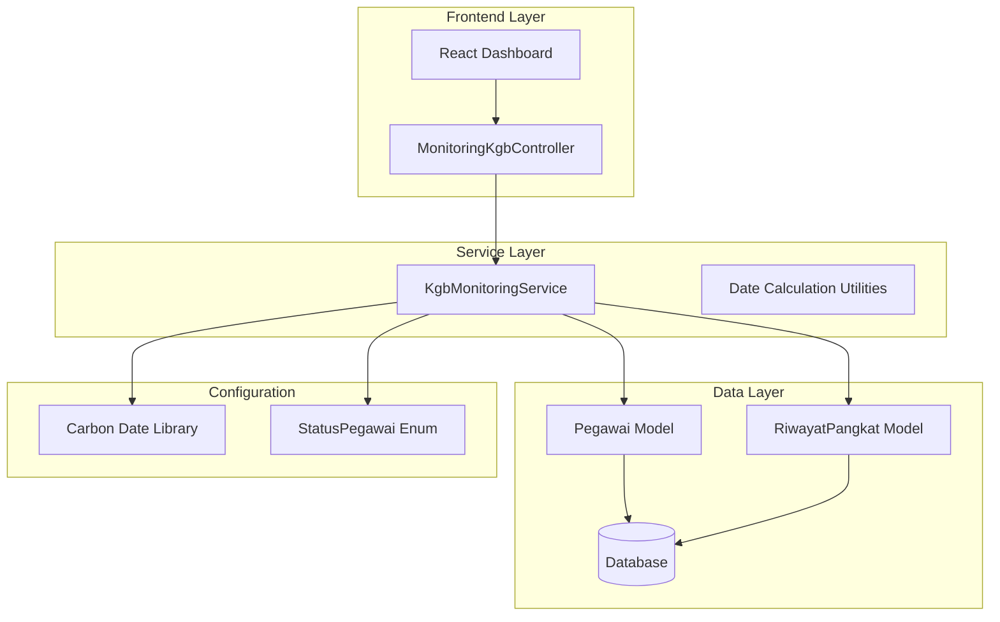
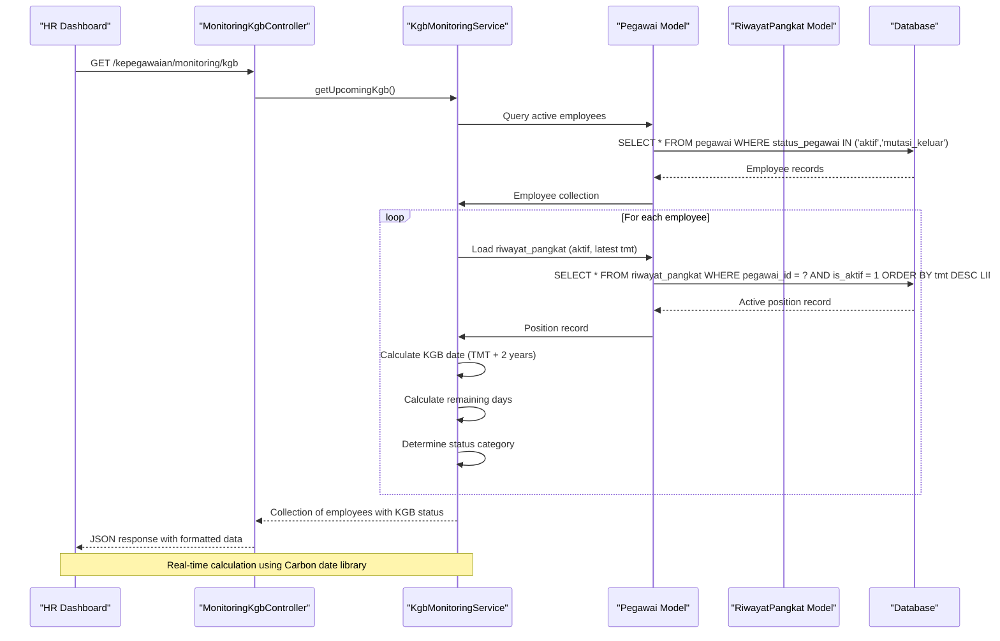
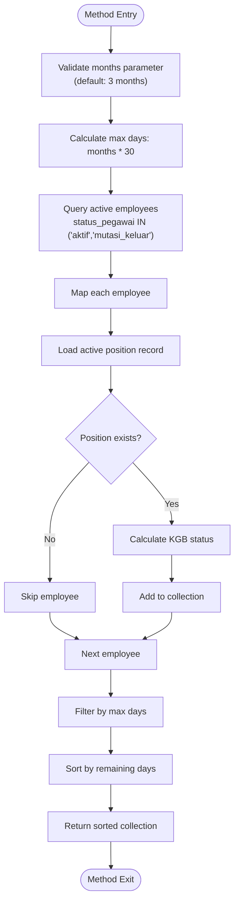
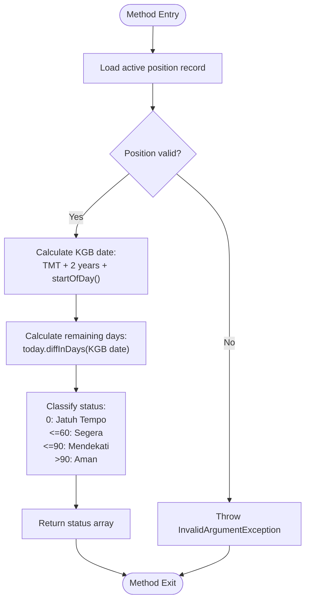
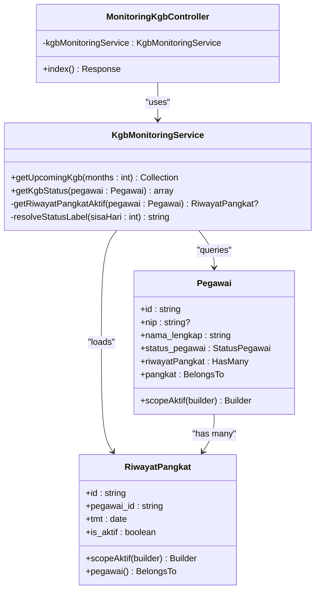
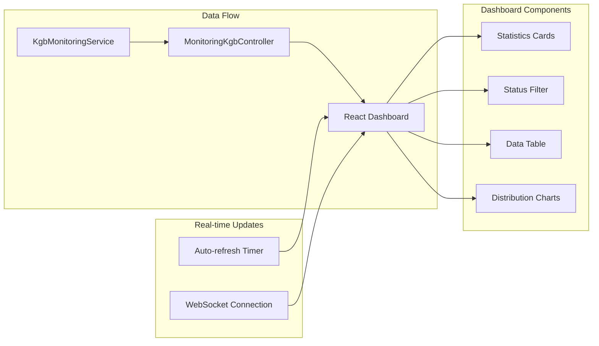
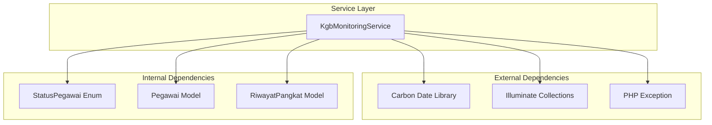

# KGB Monitoring Service

<cite>
**Referenced Files in This Document**
- [KgbMonitoringService.php](file://app/Services/KgbMonitoringService.php)
- [MonitoringKgbController.php](file://app/Http/Controllers/Monitoring/MonitoringKgbController.php)
- [index.tsx](file://resources/js/pages/kepegawaian/monitoring/kgb/index.tsx)
- [KgbMonitoringTest.php](file://tests/Feature/Monitoring/KgbMonitoringTest.php)
- [Pegawai.php](file://app/Models/Pegawai.php)
- [RiwayatPangkat.php](file://app/Models/RiwayatPangkat.php)
- [dashboard.tsx](file://resources/js/pages/dashboard.tsx)
</cite>

## Table of Contents
1. [Introduction](#introduction)
2. [Project Structure](#project-structure)
3. [Core Components](#core-components)
4. [Architecture Overview](#architecture-overview)
5. [Detailed Component Analysis](#detailed-component-analysis)
6. [Dependency Analysis](#dependency-analysis)
7. [Performance Considerations](#performance-considerations)
8. [Troubleshooting Guide](#troubleshooting-guide)
9. [Conclusion](#conclusion)

## Introduction

The KGB Monitoring Service is a specialized service component designed to track and monitor Kenaikan Gaji Berkala (Annual Salary Increment) eligibility for government employees. This service calculates when employees become eligible for salary increments based on their current position and employment history, providing real-time monitoring capabilities for human resources management.

The service operates on the principle that government employees are eligible for annual salary increments every two years, calculated from their last position assignment date. It generates comprehensive reports showing upcoming eligibility dates, remaining time until eligibility, and risk categorization for proactive HR management.

## Project Structure

The KGB Monitoring Service is integrated into a larger HR management system with the following key architectural components:

**Diagram sources**
- [KgbMonitoringService.php:12-100](file://app/Services/KgbMonitoringService.php#L12-L100)
- [MonitoringKgbController.php:10-31](file://app/Http/Controllers/Monitoring/MonitoringKgbController.php#L10-L31)

**Section sources**
- [KgbMonitoringService.php:1-100](file://app/Services/KgbMonitoringService.php#L1-L100)
- [MonitoringKgbController.php:1-31](file://app/Http/Controllers/Monitoring/MonitoringKgbController.php#L1-L31)

## Core Components

### KgbMonitoringService Class

The central service class implements the core business logic for KGB eligibility tracking. It provides methods for calculating eligibility dates, determining remaining time, and categorizing upcoming events.

Key responsibilities include:
- **Eligibility Calculation**: Determining when employees become eligible for KGB based on position assignment dates
- **Timeline Generation**: Creating comprehensive KGB timelines for dashboard visualization
- **Status Classification**: Categorizing upcoming events into risk levels (Jatuh Tempo, Segera, Mendekati, Aman)
- **Batch Processing**: Efficiently processing large employee datasets for monitoring

### MonitoringKgbController

The controller serves as the HTTP interface between the frontend and the service layer, handling request processing and response formatting for the monitoring dashboard.

### Frontend Integration

The React-based frontend provides interactive dashboards with filtering, sorting, and real-time updates for KGB monitoring data.

**Section sources**
- [KgbMonitoringService.php:12-100](file://app/Services/KgbMonitoringService.php#L12-L100)
- [MonitoringKgbController.php:10-31](file://app/Http/Controllers/Monitoring/MonitoringKgbController.php#L10-L31)

## Architecture Overview

The KGB Monitoring Service follows a layered architecture pattern with clear separation of concerns:

**Diagram sources**
- [MonitoringKgbController.php:16-30](file://app/Http/Controllers/Monitoring/MonitoringKgbController.php#L16-L30)
- [KgbMonitoringService.php:14-52](file://app/Services/KgbMonitoringService.php#L14-L52)

**Section sources**
- [MonitoringKgbController.php:10-31](file://app/Http/Controllers/Monitoring/MonitoringKgbController.php#L10-L31)
- [KgbMonitoringService.php:12-100](file://app/Services/KgbMonitoringService.php#L12-L100)

## Detailed Component Analysis

### KgbMonitoringService Implementation

The service implements sophisticated date calculation algorithms with comprehensive error handling and edge case management.

#### Core Methods Analysis

**getUpcomingKgb Method**

**getKgbStatus Method**

**resolveStatusLabel Method**
The status resolution algorithm implements a tiered classification system:
- **Sudah Jatuh Tempo**: 0 days remaining (past due)
- **Segera**: 1-60 days remaining (immediate action required)
- **Mendekati**: 61-90 days remaining (approaching deadline)
- **Aman**: 91+ days remaining (safe period)

**Section sources**
- [KgbMonitoringService.php:14-100](file://app/Services/KgbMonitoringService.php#L14-L100)

### Data Models Integration

The service integrates with the application's data models to access employee and position information:

**Diagram sources**
- [KgbMonitoringService.php:12-100](file://app/Services/KgbMonitoringService.php#L12-L100)
- [Pegawai.php:24-209](file://app/Models/Pegawai.php#L24-L209)
- [RiwayatPangkat.php:11-59](file://app/Models/RiwayatPangkat.php#L11-L59)

**Section sources**
- [Pegawai.php:98-137](file://app/Models/Pegawai.php#L98-L137)
- [RiwayatPangkat.php:54-57](file://app/Models/RiwayatPangkat.php#L54-L57)

### Frontend Dashboard Integration

The monitoring dashboard provides comprehensive visualization of KGB data with interactive filtering and real-time updates:

**Diagram sources**
- [index.tsx:87-248](file://resources/js/pages/kepegawaian/monitoring/kgb/index.tsx#L87-L248)
- [MonitoringKgbController.php:16-30](file://app/Http/Controllers/Monitoring/MonitoringKgbController.php#L16-L30)

**Section sources**
- [index.tsx:62-100](file://resources/js/pages/kepegawaian/monitoring/kgb/index.tsx#L62-L100)
- [dashboard.tsx:87-114](file://resources/js/pages/dashboard.tsx#L87-L114)

## Dependency Analysis

The KGB Monitoring Service has well-defined dependencies that ensure maintainability and testability:

**Diagram sources**
- [KgbMonitoringService.php:5-10](file://app/Services/KgbMonitoringService.php#L5-L10)

### Coupling and Cohesion Analysis

The service demonstrates excellent cohesion around KGB monitoring functionality while maintaining loose coupling with external dependencies. The design allows for easy testing and potential extension for additional monitoring features.

**Section sources**
- [KgbMonitoringService.php:1-11](file://app/Services/KgbMonitoringService.php#L1-L11)

## Performance Considerations

### Batch Processing Optimization

The service implements several performance optimization strategies for handling large employee datasets efficiently:

**Database Query Optimization**
- Uses Eloquent relationships with proper indexing
- Implements eager loading to prevent N+1 query problems
- Applies appropriate filters to reduce dataset size early in the process

**Memory Management**
- Processes employees in batches rather than loading all records simultaneously
- Uses collection methods that minimize memory footprint
- Implements lazy evaluation where possible

**Calculation Efficiency**
- Leverages Carbon library for efficient date arithmetic
- Minimizes repeated calculations through caching mechanisms
- Uses mathematical operations instead of complex loops

### Edge Case Handling

The service includes comprehensive edge case handling for robust operation:

**Invalid Data Scenarios**
- Employees without active position records are gracefully skipped
- Invalid date formats are handled with appropriate error messages
- Division by zero scenarios are prevented through validation

**Boundary Condition Management**
- Leap year calculations are handled automatically by the date library
- Month boundary conditions are managed through proper date arithmetic
- Timezone considerations are addressed through standardized date handling

**Section sources**
- [KgbMonitoringService.php:58-60](file://app/Services/KgbMonitoringService.php#L58-L60)
- [KgbMonitoringService.php:83-98](file://app/Services/KgbMonitoringService.php#L83-L98)

## Troubleshooting Guide

### Common Issues and Solutions

**Issue: Employees without position records appearing in results**
- **Cause**: Missing active position records in the database
- **Solution**: Verify that all employees have valid position assignments
- **Prevention**: Implement database constraints to prevent orphaned records

**Issue: Incorrect KGB dates being calculated**
- **Cause**: Manual date manipulation bypassing the service logic
- **Solution**: Ensure all date calculations use the service's built-in methods
- **Prevention**: Centralize date calculations in the service layer

**Issue: Performance degradation with large datasets**
- **Cause**: Inefficient database queries or excessive memory usage
- **Solution**: Implement pagination and optimize database indexes
- **Prevention**: Monitor query performance regularly

### Debugging Strategies

**Logging and Monitoring**
- Implement structured logging for key calculation points
- Monitor query execution times and memory usage
- Track error rates and exception frequencies

**Data Validation**
- Validate input data before processing
- Implement data quality checks for position records
- Monitor for data inconsistencies in real-time

**Section sources**
- [KgbMonitoringTest.php:28-92](file://tests/Feature/Monitoring/KgbMonitoringTest.php#L28-L92)

## Conclusion

The KGB Monitoring Service represents a well-architected solution for tracking government employee salary increment eligibility. Its implementation demonstrates strong adherence to software engineering principles including separation of concerns, testability, and maintainability.

The service successfully addresses the core requirements of KGB eligibility tracking through:

**Technical Excellence**
- Robust date calculation algorithms with comprehensive edge case handling
- Efficient batch processing capabilities for large-scale deployments
- Comprehensive error handling and validation mechanisms
- Clean separation between business logic and presentation layers

**Operational Benefits**
- Real-time monitoring capabilities for proactive HR management
- Interactive dashboard with filtering and sorting functionality
- Automated status classification for risk assessment
- Integration with existing HR systems and workflows

**Extensibility**
- Modular design allows for easy addition of new monitoring features
- Well-defined interfaces support future enhancements
- Comprehensive testing ensures reliable evolution of functionality

The service provides a solid foundation for KGB monitoring that can be extended and adapted as organizational needs evolve while maintaining high standards of reliability and performance.