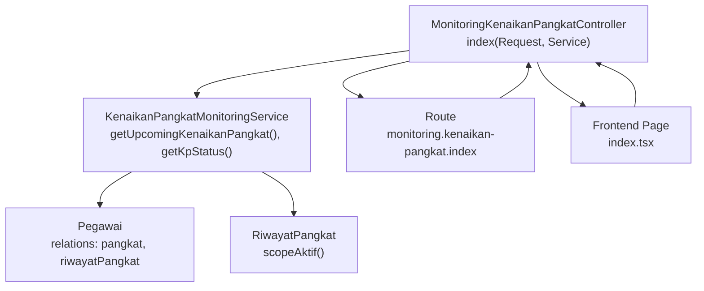
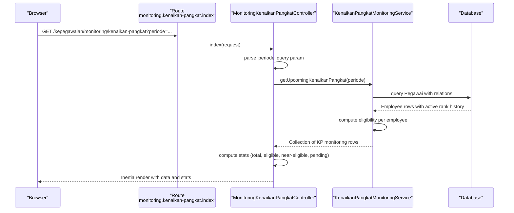
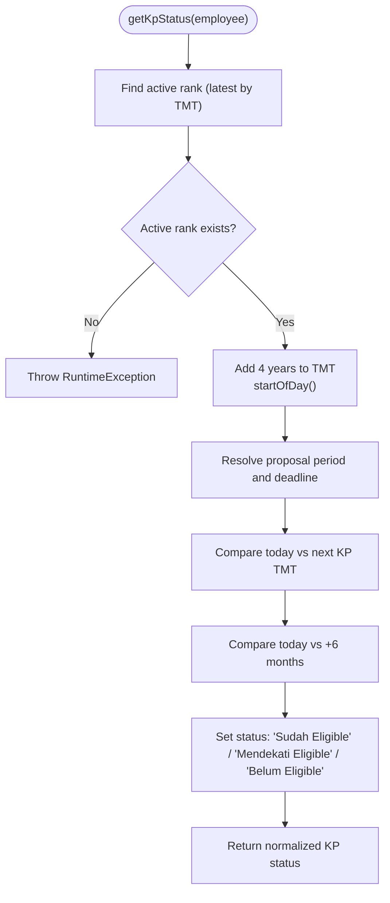
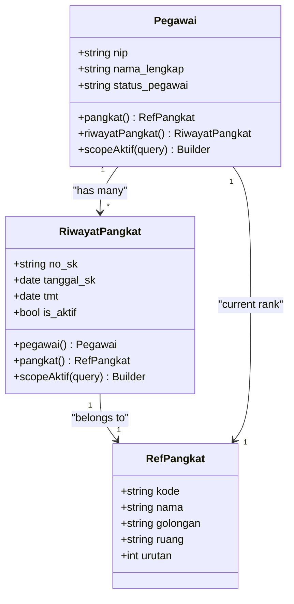
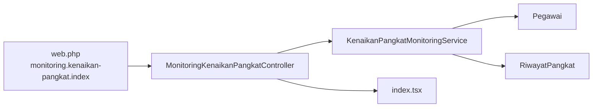

# Promotion Monitoring Service

<cite>
**Referenced Files in This Document**
- [KenaikanPangkatMonitoringService.php](file://app/Services/KenaikanPangkatMonitoringService.php)
- [MonitoringKenaikanPangkatController.php](file://app/Http/Controllers/Monitoring/MonitoringKenaikanPangkatController.php)
- [Pegawai.php](file://app/Models/Pegawai.php)
- [RiwayatPangkat.php](file://app/Models/RiwayatPangkat.php)
- [StatusPegawai.php](file://app/Enums/StatusPegawai.php)
- [index.tsx](file://resources/js/pages/kepegawaian/monitoring/kenaikan-pangkat/index.tsx)
- [web.php](file://routes/web.php)
- [2026_03_15_031012_create_riwayat_pangkat_table.php](file://database/migrations/2026_03_15_031012_create_riwayat_pangkat_table.php)
- [2026_03_15_024651_create_pegawai_table.php](file://database/migrations/2026_03_15_024651_create_pegawai_table.php)
- [KenaikanPangkatMonitoringTest.php](file://tests/Feature/Monitoring/KenaikanPangkatMonitoringTest.php)
</cite>

## Table of Contents
1. [Introduction](#introduction)
2. [Project Structure](#project-structure)
3. [Core Components](#core-components)
4. [Architecture Overview](#architecture-overview)
5. [Detailed Component Analysis](#detailed-component-analysis)
6. [Dependency Analysis](#dependency-analysis)
7. [Performance Considerations](#performance-considerations)
8. [Troubleshooting Guide](#troubleshooting-guide)
9. [Conclusion](#conclusion)

## Introduction
This document provides comprehensive documentation for the KenaikanPangkatMonitoringService class, which monitors employee eligibility for rank advancement (KP) and tracks promotion timelines. The service calculates promotion eligibility based on active rank records, determines promotion periods and deadlines, and generates a dashboard-ready dataset for the monitoring interface. It integrates with the backend controller and frontend dashboard to present upcoming promotions, eligibility status, and submission deadlines.

## Project Structure
The promotion monitoring feature spans backend services, models, controllers, routing, and the frontend dashboard:

- Backend service: KenaikanPangkatMonitoringService
- Domain models: Pegawai, RiwayatPangkat, RefPangkat
- Controller: MonitoringKenaikanPangkatController
- Routing: web.php
- Frontend dashboard: index.tsx page
- Tests: KenaikanPangkatMonitoringTest

**Diagram sources**
- [MonitoringKenaikanPangkatController.php:13-30](file://app/Http/Controllers/Monitoring/MonitoringKenaikanPangkatController.php#L13-L30)
- [KenaikanPangkatMonitoringService.php:13-62](file://app/Services/KenaikanPangkatMonitoringService.php#L13-L62)
- [Pegawai.php:114-117](file://app/Models/Pegawai.php#L114-L117)
- [RiwayatPangkat.php:54-57](file://app/Models/RiwayatPangkat.php#L54-L57)
- [web.php:42-43](file://routes/web.php#L42-L43)
- [index.tsx:72-76](file://resources/js/pages/kepegawaian/monitoring/kenaikan-pangkat/index.tsx#L72-L76)

**Section sources**
- [MonitoringKenaikanPangkatController.php:11-31](file://app/Http/Controllers/Monitoring/MonitoringKenaikanPangkatController.php#L11-L31)
- [KenaikanPangkatMonitoringService.php:11-122](file://app/Services/KenaikanPangkatMonitoringService.php#L11-L122)
- [Pegawai.php:24-209](file://app/Models/Pegawai.php#L24-L209)
- [RiwayatPangkat.php:11-59](file://app/Models/RiwayatPangkat.php#L11-L59)
- [web.php:42-43](file://routes/web.php#L42-L43)
- [index.tsx:72-306](file://resources/js/pages/kepegawaian/monitoring/kenaikan-pangkat/index.tsx#L72-L306)

## Core Components
- KenaikanPangkatMonitoringService: Central service for generating KP monitoring data and eligibility status.
- MonitoringKenaikanPangkatController: Handles HTTP requests and renders the monitoring dashboard with statistics and filtered lists.
- Pegawai model: Provides relations to current rank and active rank history.
- RiwayatPangkat model: Stores rank promotion records with an active flag and TMT dates.
- Frontend dashboard: Presents monitoring data with filtering by period and eligibility status.

Key responsibilities:
- Build a collection of employees eligible for KP monitoring (excluding retirees and deceased).
- Determine next KP TMT based on active rank TMT plus four years.
- Resolve proposal period and deadline based on next KP TMT.
- Compute eligibility status and remaining days until deadline.
- Support filtering by April/October KP periods.

**Section sources**
- [KenaikanPangkatMonitoringService.php:13-122](file://app/Services/KenaikanPangkatMonitoringService.php#L13-L122)
- [MonitoringKenaikanPangkatController.php:13-30](file://app/Http/Controllers/Monitoring/MonitoringKenaikanPangkatController.php#L13-L30)
- [Pegawai.php:114-117](file://app/Models/Pegawai.php#L114-L117)
- [RiwayatPangkat.php:54-57](file://app/Models/RiwayatPangkat.php#L54-L57)
- [index.tsx:72-306](file://resources/js/pages/kepegawaian/monitoring/kenaikan-pangkat/index.tsx#L72-L306)

## Architecture Overview
The service orchestrates data retrieval and computation, returning a normalized dataset consumed by the dashboard. The controller fetches optional period filters, delegates to the service, and computes summary statistics for the UI.

**Diagram sources**
- [web.php:42-43](file://routes/web.php#L42-L43)
- [MonitoringKenaikanPangkatController.php:13-30](file://app/Http/Controllers/Monitoring/MonitoringKenaikanPangkatController.php#L13-L30)
- [KenaikanPangkatMonitoringService.php:13-62](file://app/Services/KenaikanPangkatMonitoringService.php#L13-L62)

## Detailed Component Analysis

### KenaikanPangkatMonitoringService
Responsibilities:
- Retrieve employees excluding retirees/deceased.
- Load active rank history with latest TMT.
- Compute next KP TMT (active TMT + 4 years).
- Resolve proposal period ("April YYYY" or "October YYYY") and submission deadline.
- Determine eligibility thresholds (past due vs. within 6 months).
- Normalize output fields for the dashboard.

Core methods:
- getUpcomingKenaikanPangkat(?string $periode): Builds the monitoring list with optional April/October filter.
- getKpStatus(Pegawai $pegawai): Computes eligibility, next KP TMT, proposal period, deadline, and remaining days.
- resolvePeriodeUsulDanBatas(CarbonInterface $tmtKpBerikutnya): Determines proposal period and deadline based on next KP TMT.

Processing logic highlights:
- Excludes employees whose status is pensiun, meninggal, or diberhentikan.
- Uses the most recent active rank record to derive eligibility.
- Applies strict date comparisons using Carbon for period resolution and deadlines.
- Filters by requested KP period (april or oktober) when provided.

Edge cases handled:
- Employees without active rank history are excluded from the list.
- Throws a runtime exception if an employee lacks an active rank record (ensures data integrity).
- Gracefully filters out employees whose next KP period does not match the requested filter.

**Diagram sources**
- [KenaikanPangkatMonitoringService.php:64-95](file://app/Services/KenaikanPangkatMonitoringService.php#L64-L95)
- [KenaikanPangkatMonitoringService.php:97-120](file://app/Services/KenaikanPangkatMonitoringService.php#L97-L120)

**Section sources**
- [KenaikanPangkatMonitoringService.php:13-122](file://app/Services/KenaikanPangkatMonitoringService.php#L13-L122)

### MonitoringKenaikanPangkatController
Responsibilities:
- Extract the "periode" query parameter (april/oktober).
- Delegate to the service to build the monitoring list.
- Compute KP statistics for the dashboard.
- Render the Inertia page with data and stats.

Integration points:
- Route binding to monitoring.kenaikan-pangkat.index.
- Passing selectedPeriode to the frontend for pre-selection.

**Section sources**
- [MonitoringKenaikanPangkatController.php:13-30](file://app/Http/Controllers/Monitoring/MonitoringKenaikanPangkatController.php#L13-L30)
- [web.php:42-43](file://routes/web.php#L42-L43)

### Frontend Dashboard (index.tsx)
Responsibilities:
- Display total, eligible, near-eligible, and pending counts.
- Provide filters for KP period (all, april, oktober) and eligibility status.
- Render a table with NIP, name, current rank, TMT, next KP TMT, proposal period, deadline, and status badges.
- Show remaining days until deadline with positive/negative indication.

User interaction:
- Changing filters triggers a router.get request to refresh data while preserving state.

**Section sources**
- [index.tsx:72-306](file://resources/js/pages/kepegawaian/monitoring/kenaikan-pangkat/index.tsx#L72-L306)

### Data Models and Relations
- Pegawai: Has many RiwayatPangkat; belongs to RefPangkat for current rank; includes scopes for active status and filtering.
- RiwayatPangkat: Belongs to Pegawai and RefPangkat; includes scopeAktif to filter active records; stores TMT and metadata.
- StatusPegawai enum: Defines non-active statuses that exclude employees from monitoring.

**Diagram sources**
- [Pegawai.php:69-117](file://app/Models/Pegawai.php#L69-L117)
- [RiwayatPangkat.php:44-57](file://app/Models/RiwayatPangkat.php#L44-L57)
- [2026_03_15_024651_create_pegawai_table.php:35](file://database/migrations/2026_03_15_024651_create_pegawai_table.php#L35)
- [2026_03_15_031012_create_riwayat_pangkat_table.php:16-17](file://database/migrations/2026_03_15_031012_create_riwayat_pangkat_table.php#L16-L17)

**Section sources**
- [Pegawai.php:24-209](file://app/Models/Pegawai.php#L24-L209)
- [RiwayatPangkat.php:11-59](file://app/Models/RiwayatPangkat.php#L11-L59)
- [2026_03_15_024651_create_pegawai_table.php:14-48](file://database/migrations/2026_03_15_024651_create_pegawai_table.php#L14-L48)
- [2026_03_15_031012_create_riwayat_pangkat_table.php:14-29](file://database/migrations/2026_03_15_031012_create_riwayat_pangkat_table.php#L14-L29)

## Dependency Analysis
- Controller depends on KenaikanPangkatMonitoringService for data computation.
- Service depends on Eloquent models and enums for data retrieval and validation.
- Frontend depends on controller-provided props for rendering and filtering.
- Routes bind the controller action to the monitoring endpoint.

**Diagram sources**
- [web.php:42-43](file://routes/web.php#L42-L43)
- [MonitoringKenaikanPangkatController.php:13-30](file://app/Http/Controllers/Monitoring/MonitoringKenaikanPangkatController.php#L13-L30)
- [KenaikanPangkatMonitoringService.php:13-62](file://app/Services/KenaikanPangkatMonitoringService.php#L13-L62)

**Section sources**
- [web.php:42-43](file://routes/web.php#L42-L43)
- [MonitoringKenaikanPangkatController.php:13-30](file://app/Http/Controllers/Monitoring/MonitoringKenaikanPangkatController.php#L13-L30)
- [KenaikanPangkatMonitoringService.php:13-122](file://app/Services/KenaikanPangkatMonitoringService.php#L13-L122)

## Performance Considerations
- Eager loading: The service eager-loads riwayatPangkat with an active scope and orders by TMT descending to efficiently pick the latest active record per employee.
- Filtering: Excluding non-active statuses early reduces dataset size.
- Date arithmetic: Using Carbon for date math avoids repeated conversions and ensures consistent timezone handling.
- Pagination: For very large datasets, consider adding pagination at the controller level to limit payload size.
- Indexing: Ensure database indexes exist on frequently queried columns (e.g., is_aktif, tmt, status_pegawai) to optimize queries.
- Caching: For read-heavy dashboards, consider caching KP lists with appropriate invalidation on rank updates.

## Troubleshooting Guide
Common issues and resolutions:
- No active rank history: Employees without an active rank record are excluded. Ensure RiwayatPangkat entries exist and marked active.
- Missing active rank exception: If an employee has no active rank, a runtime exception is thrown. Verify data integrity and that at least one RiwayatPangkat is active.
- Incorrect period filtering: Confirm the "periode" query parameter is either "april" or "oktober". Other values are treated as "all".
- Excluded statuses: Employees with status pensiun, meninggal, or diberhentikan are intentionally excluded from monitoring.
- Deadline calculation: Ensure the current date context is correct during testing to validate deadline computations.

Validation references:
- Eligibility and period tests demonstrate expected behavior for April/October periods and deadline calculations.
- Monitoring controller test verifies the Inertia response shape and statistics.

**Section sources**
- [KenaikanPangkatMonitoringService.php:73-75](file://app/Services/KenaikanPangkatMonitoringService.php#L73-L75)
- [KenaikanPangkatMonitoringTest.php:35-60](file://tests/Feature/Monitoring/KenaikanPangkatMonitoringTest.php#L35-L60)
- [KenaikanPangkatMonitoringTest.php:88-103](file://tests/Feature/Monitoring/KenaikanPangkatMonitoringTest.php#L88-L103)
- [KenaikanPangkatMonitoringTest.php:105-121](file://tests/Feature/Monitoring/KenaikanPangkatMonitoringTest.php#L105-L121)

## Conclusion
The KenaikanPangkatMonitoringService provides a robust foundation for KP eligibility monitoring and promotion timeline tracking. It leverages active rank history to compute next KP dates, resolves proposal periods and deadlines, and delivers a filtered dataset suitable for the monitoring dashboard. The controller and frontend integrate seamlessly to present actionable insights, with built-in filtering and statistics. For large-scale deployments, consider pagination, indexing, and caching to maintain responsiveness.