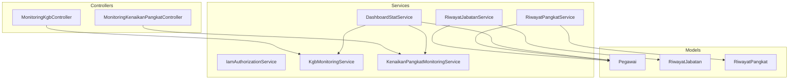
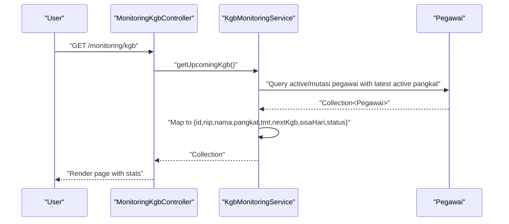
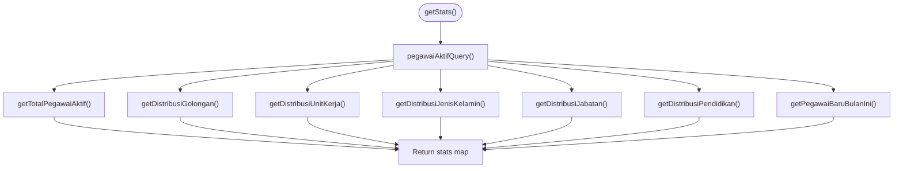
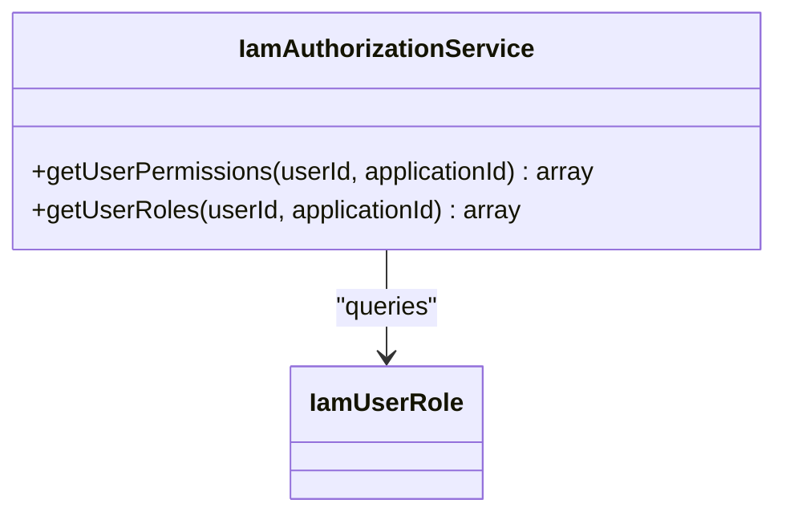
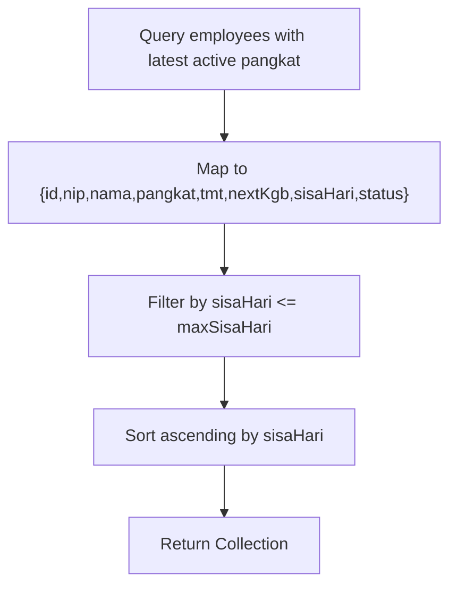
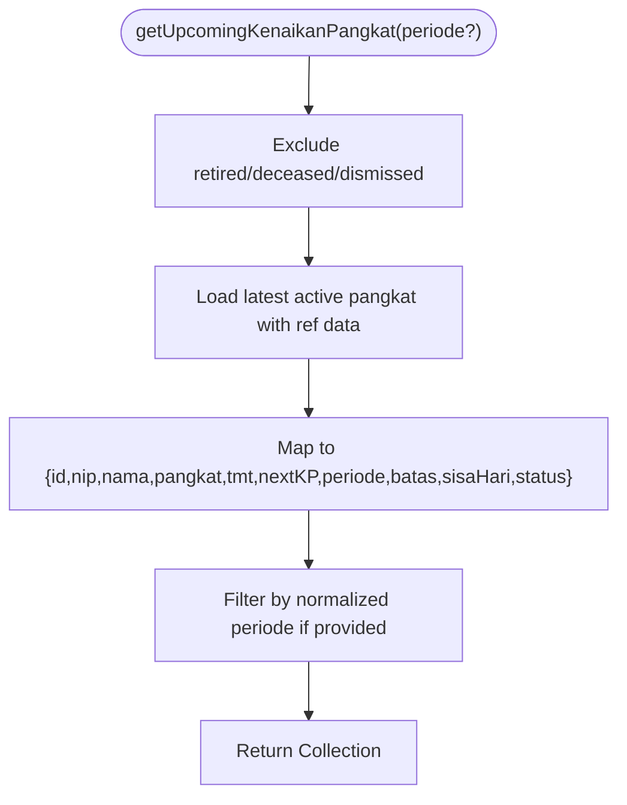
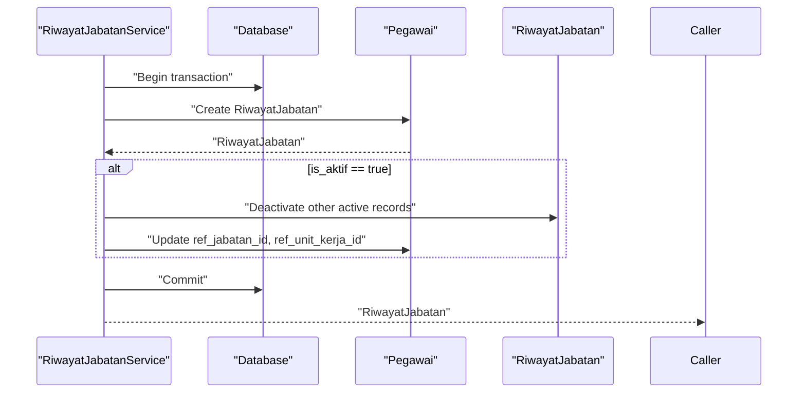
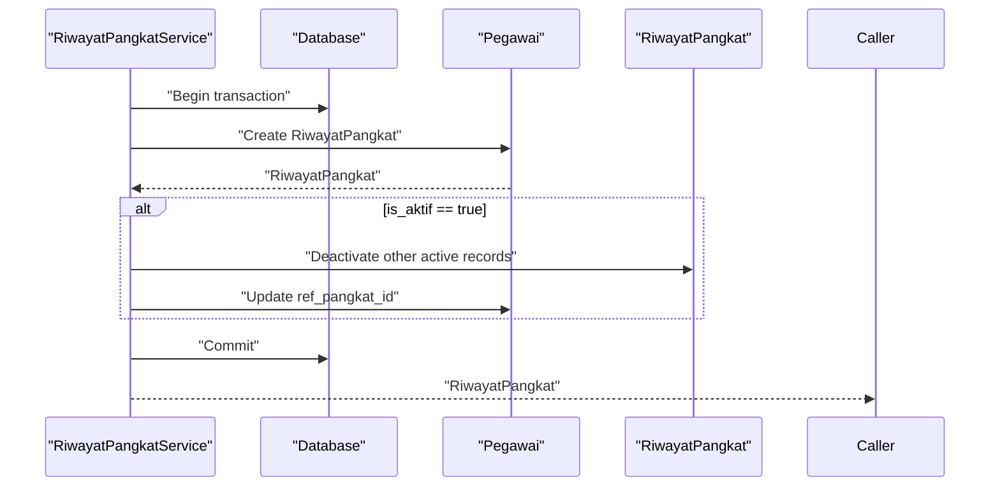
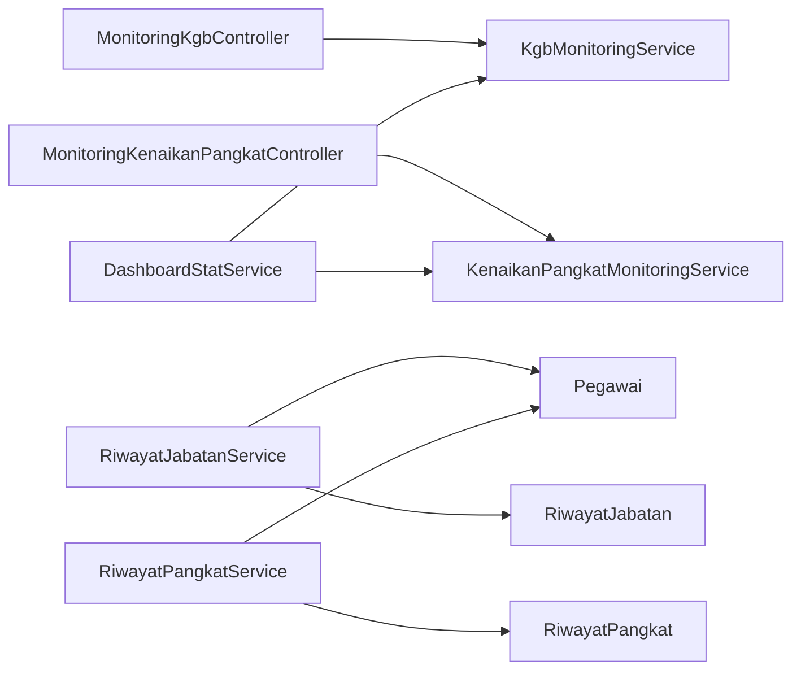

# Service Layer

<cite>
**Referenced Files in This Document**
- [DashboardStatService.php](file://app/Services/DashboardStatService.php)
- [IamAuthorizationService.php](file://app/Services/IamAuthorizationService.php)
- [KgbMonitoringService.php](file://app/Services/KgbMonitoringService.php)
- [KenaikanPangkatMonitoringService.php](file://app/Services/KenaikanPangkatMonitoringService.php)
- [RiwayatJabatanService.php](file://app/Services/RiwayatJabatanService.php)
- [RiwayatPangkatService.php](file://app/Services/RiwayatPangkatService.php)
- [MonitoringKgbController.php](file://app/Http/Controllers/Monitoring/MonitoringKgbController.php)
- [MonitoringKenaikanPangkatController.php](file://app/Http/Controllers/Monitoring/MonitoringKenaikanPangkatController.php)
- [Pegawai.php](file://app/Models/Pegawai.php)
- [DashboardStatServiceTest.php](file://tests/Unit/Services/DashboardStatServiceTest.php)
- [RiwayatJabatanServiceTest.php](file://tests/Unit/Services/RiwayatJabatanServiceTest.php)
- [RiwayatPangkatServiceTest.php](file://tests/Unit/Services/RiwayatPangkatServiceTest.php)
- [AppServiceProvider.php](file://app/Providers/AppServiceProvider.php)
- [JenjangPendidikan.php](file://app/Enums/JenjangPendidikan.php)
- [StatusPegawai.php](file://app/Enums/StatusPegawai.php)
</cite>

## Table of Contents
1. [Introduction](#introduction)
2. [Project Structure](#project-structure)
3. [Core Components](#core-components)
4. [Architecture Overview](#architecture-overview)
5. [Detailed Component Analysis](#detailed-component-analysis)
6. [Dependency Analysis](#dependency-analysis)
7. [Performance Considerations](#performance-considerations)
8. [Troubleshooting Guide](#troubleshooting-guide)
9. [Conclusion](#conclusion)

## Introduction
This document focuses on the Service Layer and its business logic implementation patterns. It explains how services encapsulate domain rules, coordinate data transformations, orchestrate external integrations, and manage transactions. It documents four key services:
- DashboardStatService: Analytics aggregator for HR dashboards
- IamAuthorizationService: Authorization queries for IAM roles and permissions
- KgbMonitoringService: KGB (promotion to next pay grade) eligibility tracking
- RiwayatJabatanService: Career progression record lifecycle and synchronization

It also covers service composition, dependency injection, error handling, transaction management, testing strategies, and performance optimization techniques grounded in the actual codebase.

## Project Structure
The Service Layer resides under app/Services and is consumed by controllers and tests. Controllers demonstrate constructor injection and request-scoped instantiation. Models define relations leveraged by services. Tests illustrate mocking and transactional verification.

**Diagram sources**
- [MonitoringKgbController.php:10-31](file://app/Http/Controllers/Monitoring/MonitoringKgbController.php#L10-L31)
- [MonitoringKenaikanPangkatController.php:11-31](file://app/Http/Controllers/Monitoring/MonitoringKenaikanPangkatController.php#L11-L31)
- [DashboardStatService.php:14-147](file://app/Services/DashboardStatService.php#L14-L147)
- [IamAuthorizationService.php:7-44](file://app/Services/IamAuthorizationService.php#L7-L44)
- [KgbMonitoringService.php:12-99](file://app/Services/KgbMonitoringService.php#L12-L99)
- [KenaikanPangkatMonitoringService.php:11-121](file://app/Services/KenaikanPangkatMonitoringService.php#L11-L121)
- [RiwayatJabatanService.php:9-49](file://app/Services/RiwayatJabatanService.php#L9-L49)
- [RiwayatPangkatService.php:9-54](file://app/Services/RiwayatPangkatService.php#L9-L54)
- [Pegawai.php:24-137](file://app/Models/Pegawai.php#L24-L137)

**Section sources**
- [MonitoringKgbController.php:10-31](file://app/Http/Controllers/Monitoring/MonitoringKgbController.php#L10-L31)
- [MonitoringKenaikanPangkatController.php:11-31](file://app/Http/Controllers/Monitoring/MonitoringKenaikanPangkatController.php#L11-L31)
- [DashboardStatService.php:14-147](file://app/Services/DashboardStatService.php#L14-L147)
- [IamAuthorizationService.php:7-44](file://app/Services/IamAuthorizationService.php#L7-L44)
- [KgbMonitoringService.php:12-99](file://app/Services/KgbMonitoringService.php#L12-L99)
- [KenaikanPangkatMonitoringService.php:11-121](file://app/Services/KenaikanPangkatMonitoringService.php#L11-L121)
- [RiwayatJabatanService.php:9-49](file://app/Services/RiwayatJabatanService.php#L9-L49)
- [RiwayatPangkatService.php:9-54](file://app/Services/RiwayatPangkatService.php#L9-L54)
- [Pegawai.php:24-137](file://app/Models/Pegawai.php#L24-L137)

## Core Components
- DashboardStatService: Aggregates counts and distributions for dashboard widgets, composing KGB and KP monitoring services and leveraging model relations and enums.
- IamAuthorizationService: Resolves user roles and permissions scoped to an application via relational queries.
- KgbMonitoringService: Computes KGB due dates and eligibility windows, returning structured lists for UI rendering.
- KenaikanPangkatMonitoringService: Computes KP (promotion to next rank) eligibility and period boundaries.
- RiwayatJabatanService: Manages creation, updates, and synchronization of active career records with the base employee record.
- RiwayatPangkatService: Manages creation, updates, and synchronization of active pay-grade records with the base employee record.

**Section sources**
- [DashboardStatService.php:14-147](file://app/Services/DashboardStatService.php#L14-L147)
- [IamAuthorizationService.php:7-44](file://app/Services/IamAuthorizationService.php#L7-L44)
- [KgbMonitoringService.php:12-99](file://app/Services/KgbMonitoringService.php#L12-L99)
- [KenaikanPangkatMonitoringService.php:11-121](file://app/Services/KenaikanPangkatMonitoringService.php#L11-L121)
- [RiwayatJabatanService.php:9-49](file://app/Services/RiwayatJabatanService.php#L9-L49)
- [RiwayatPangkatService.php:9-54](file://app/Services/RiwayatPangkatService.php#L9-L54)

## Architecture Overview
The Service Layer sits between controllers and persistence/models. Controllers inject or receive services via constructor injection or request-time instantiation. Services encapsulate business rules, compose other services, and return normalized data structures for presentation.

**Diagram sources**
- [MonitoringKgbController.php:16-30](file://app/Http/Controllers/Monitoring/MonitoringKgbController.php#L16-L30)
- [KgbMonitoringService.php:14-52](file://app/Services/KgbMonitoringService.php#L14-L52)
- [Pegawai.php:99-117](file://app/Models/Pegawai.php#L99-L117)

**Section sources**
- [MonitoringKgbController.php:10-31](file://app/Http/Controllers/Monitoring/MonitoringKgbController.php#L10-L31)
- [KgbMonitoringService.php:12-99](file://app/Services/KgbMonitoringService.php#L12-L99)
- [Pegawai.php:24-137](file://app/Models/Pegawai.php#L24-L137)

## Detailed Component Analysis

### DashboardStatService
- Purpose: Consolidate dashboard metrics by querying active employees and related references.
- Composition:
  - Uses KgbMonitoringService and KenaikanPangkatMonitoringService instances resolved via the container.
  - Leverages model relations (pangkat, jabatan, unit kerja) and enums (JenjangPendidikan, StatusPegawai).
- Data processing:
  - Groups and aggregates by unit, gender, position, education level.
  - Filters by current month for new hires.
- External integration:
  - Delegates KGB and KP eligibility counts to dedicated monitoring services.

**Diagram sources**
- [DashboardStatService.php:16-146](file://app/Services/DashboardStatService.php#L16-L146)
- [KgbMonitoringService.php:14-52](file://app/Services/KgbMonitoringService.php#L14-L52)
- [KenaikanPangkatMonitoringService.php:13-62](file://app/Services/KenaikanPangkatMonitoringService.php#L13-L62)
- [JenjangPendidikan.php:5-33](file://app/Enums/JenjangPendidikan.php#L5-L33)
- [StatusPegawai.php:5-23](file://app/Enums/StatusPegawai.php#L5-L23)

**Section sources**
- [DashboardStatService.php:14-147](file://app/Services/DashboardStatService.php#L14-L147)
- [KgbMonitoringService.php:12-99](file://app/Services/KgbMonitoringService.php#L12-L99)
- [KenaikanPangkatMonitoringService.php:11-121](file://app/Services/KenaikanPangkatMonitoringService.php#L11-L121)
- [JenjangPendidikan.php:5-33](file://app/Enums/JenjangPendidikan.php#L5-L33)
- [StatusPegawai.php:5-23](file://app/Enums/StatusPegawai.php#L5-L23)

### IamAuthorizationService
- Purpose: Resolve effective roles and permissions for a user within a specific IAM application.
- Implementation pattern:
  - Uses eager loading of role-permission relationships.
  - Flattens slugs, deduplicates, and returns arrays for downstream checks.
- Encapsulation:
  - Centralizes repeated logic previously duplicated in controllers and middleware.

**Diagram sources**
- [IamAuthorizationService.php:7-44](file://app/Services/IamAuthorizationService.php#L7-L44)

**Section sources**
- [IamAuthorizationService.php:7-44](file://app/Services/IamAuthorizationService.php#L7-L44)

### KgbMonitoringService
- Purpose: Compute upcoming KGB dates and categorize urgency.
- Business rules:
  - Calculates next KGB date from the latest active pay-grade TMT plus two years.
  - Determines status categories based on remaining days thresholds.
- Error handling:
  - Throws an invalid argument exception when no active pay-grade exists.
- Data flow:
  - Loads active and mutasi-out employees with latest active pay-grade.
  - Maps to normalized records with computed fields.

**Diagram sources**
- [KgbMonitoringService.php:14-52](file://app/Services/KgbMonitoringService.php#L14-L52)
- [KgbMonitoringService.php:54-70](file://app/Services/KgbMonitoringService.php#L54-L70)

**Section sources**
- [KgbMonitoringService.php:12-99](file://app/Services/KgbMonitoringService.php#L12-L99)

### KenaikanPangkatMonitoringService
- Purpose: Compute KP eligibility and proposal periods.
- Business rules:
  - Derives next KP date from latest active pay-grade TMT plus four years.
  - Determines proposal period (April/October) and deadline boundaries.
  - Classifies eligibility status based on elapsed time vs. near-eligibility window.
- Data flow:
  - Excludes retirees/deceased/dismissed employees.
  - Normalizes period filter to April/October buckets.

**Diagram sources**
- [KenaikanPangkatMonitoringService.php:13-62](file://app/Services/KenaikanPangkatMonitoringService.php#L13-L62)
- [KenaikanPangkatMonitoringService.php:64-95](file://app/Services/KenaikanPangkatMonitoringService.php#L64-L95)
- [KenaikanPangkatMonitoringService.php:97-120](file://app/Services/KenaikanPangkatMonitoringService.php#L97-L120)

**Section sources**
- [KenaikanPangkatMonitoringService.php:11-121](file://app/Services/KenaikanPangkatMonitoringService.php#L11-L121)

### RiwayatJabatanService
- Purpose: Manage career progression records and keep the base employee record synchronized.
- Transaction management:
  - Wraps creation/update in a database transaction.
- Synchronization:
  - When a record becomes active, deactivates other active records for the same employee and updates the employee’s current position and unit references.
- Error handling:
  - Relies on Eloquent updates; no explicit exceptions thrown by the service.

**Diagram sources**
- [RiwayatJabatanService.php:11-22](file://app/Services/RiwayatJabatanService.php#L11-L22)
- [RiwayatJabatanService.php:37-48](file://app/Services/RiwayatJabatanService.php#L37-L48)

**Section sources**
- [RiwayatJabatanService.php:9-49](file://app/Services/RiwayatJabatanService.php#L9-L49)

### RiwayatPangkatService
- Purpose: Manage pay-grade promotion records and synchronize the base employee record.
- Transaction management:
  - Ensures atomicity for creation/update and subsequent deactivation of other active records.
- Synchronization:
  - When a record becomes active, deactivates others and updates the employee’s current pay-grade reference.
- Robustness:
  - Forces boolean cast for activation flag during store/update.

**Diagram sources**
- [RiwayatPangkatService.php:11-22](file://app/Services/RiwayatPangkatService.php#L11-L22)
- [RiwayatPangkatService.php:39-53](file://app/Services/RiwayatPangkatService.php#L39-L53)

**Section sources**
- [RiwayatPangkatService.php:9-54](file://app/Services/RiwayatPangkatService.php#L9-L54)

## Dependency Analysis
- Controller-to-Service injection:
  - MonitoringKgbController demonstrates constructor injection of KgbMonitoringService.
  - MonitoringKenaikanPangkatController receives KenaikanPangkatMonitoringService via request-time instantiation.
- Service-to-Service composition:
  - DashboardStatService composes KgbMonitoringService and KenaikanPangkatMonitoringService via the container.
- Service-to-Model relations:
  - Services rely on model relations (e.g., riwayatJabatan, riwayatPangkat, pangkat, jabatan) and scopes (e.g., aktif).
- Provider defaults:
  - AppServiceProvider configures immutable date handling and production-safe DB command policies.

**Diagram sources**
- [MonitoringKgbController.php:12-14](file://app/Http/Controllers/Monitoring/MonitoringKgbController.php#L12-L14)
- [MonitoringKenaikanPangkatController.php](file://app/Http/Controllers/Monitoring/MonitoringKenaikanPangkatController.php#L13)
- [DashboardStatService.php:89-97](file://app/Services/DashboardStatService.php#L89-L97)
- [RiwayatJabatanService.php:9-49](file://app/Services/RiwayatJabatanService.php#L9-L49)
- [RiwayatPangkatService.php:9-54](file://app/Services/RiwayatPangkatService.php#L9-L54)
- [Pegawai.php:99-137](file://app/Models/Pegawai.php#L99-L137)

**Section sources**
- [MonitoringKgbController.php:10-31](file://app/Http/Controllers/Monitoring/MonitoringKgbController.php#L10-L31)
- [MonitoringKenaikanPangkatController.php:11-31](file://app/Http/Controllers/Monitoring/MonitoringKenaikanPangkatController.php#L11-L31)
- [DashboardStatService.php:87-98](file://app/Services/DashboardStatService.php#L87-L98)
- [RiwayatJabatanService.php:9-49](file://app/Services/RiwayatJabatanService.php#L9-L49)
- [RiwayatPangkatService.php:9-54](file://app/Services/RiwayatPangkatService.php#L9-L54)
- [Pegawai.php:24-137](file://app/Models/Pegawai.php#L24-L137)
- [AppServiceProvider.php:28-58](file://app/Providers/AppServiceProvider.php#L28-L58)

## Performance Considerations
- Eager loading: Services load related records (e.g., latest active pay-grade) to avoid N+1 queries.
- Selective aggregation: DashboardStatService groups and maps results server-side to reduce payload sizes.
- Threshold filtering: KGB/KP services filter by remaining days to limit result sets.
- Transactions: RiwayatJabatanService and RiwayatPangkatService wrap updates in transactions to minimize partial writes and ensure referential consistency.
- Immutable dates: Provider configuration ensures predictable date serialization and immutability in production.

[No sources needed since this section provides general guidance]

## Troubleshooting Guide
- Missing active pay-grade:
  - KgbMonitoringService throws an invalid argument exception when no active pay-grade exists; ensure employees have a valid active record before invoking status computation.
- KP eligibility calculation:
  - KenaikanPangkatMonitoringService throws a runtime exception if no active pay-grade is found; verify data integrity and TMT values.
- Transaction failures:
  - RiwayatJabatanService and RiwayatPangkatService rely on database transactions; check for constraint violations or invalid foreign keys.
- Testing mocks:
  - DashboardStatService tests mock KGB/KP monitoring services to isolate dashboard logic; replicate this pattern when testing service compositions.

**Section sources**
- [KgbMonitoringService.php:54-70](file://app/Services/KgbMonitoringService.php#L54-L70)
- [KenaikanPangkatMonitoringService.php:64-75](file://app/Services/KenaikanPangkatMonitoringService.php#L64-L75)
- [RiwayatJabatanService.php:11-22](file://app/Services/RiwayatJabatanService.php#L11-L22)
- [RiwayatPangkatService.php:11-22](file://app/Services/RiwayatPangkatService.php#L11-L22)
- [DashboardStatServiceTest.php:71-91](file://tests/Unit/Services/DashboardStatServiceTest.php#L71-L91)

## Conclusion
The Service Layer cleanly separates business logic from controllers and persistence. Services encapsulate domain rules, compose other services, manage transactions, and return normalized data structures. Dependency injection is applied consistently, with controller constructors and request-time instantiation. Testing strategies leverage mocking and transactional assertions to validate correctness and performance characteristics.