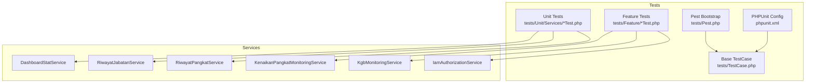
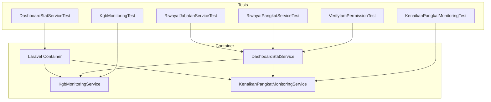
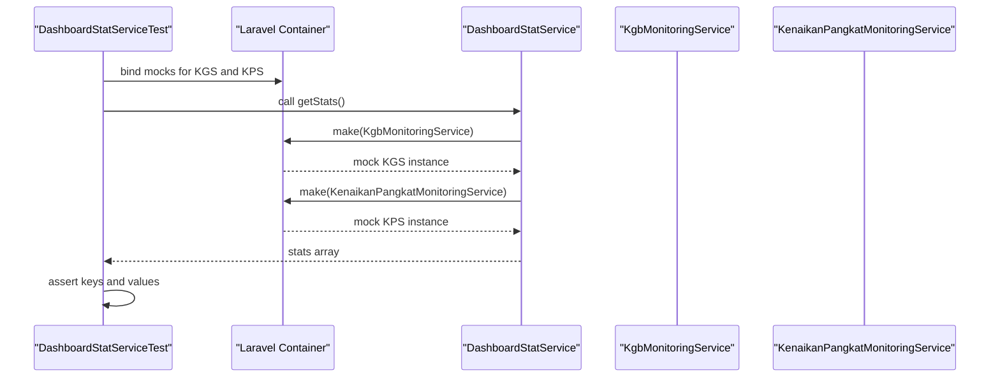
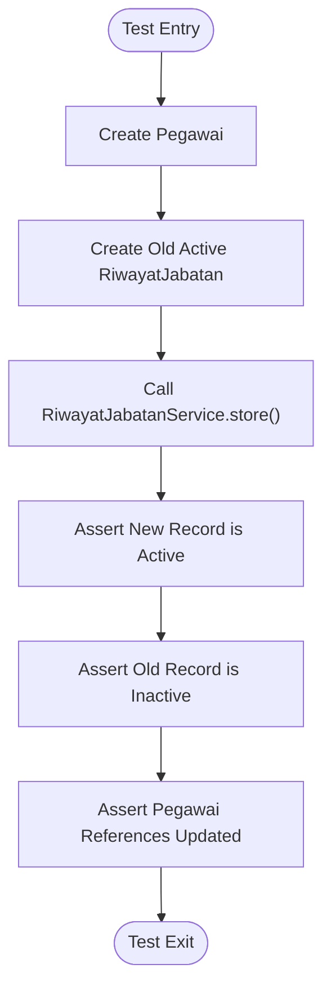
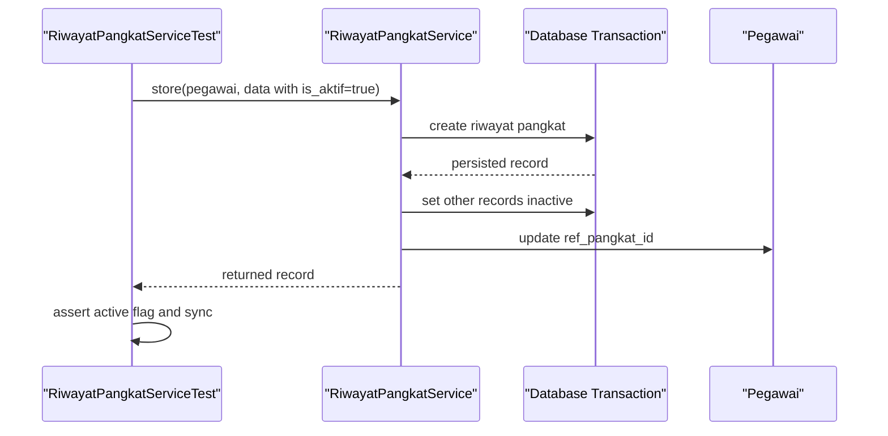
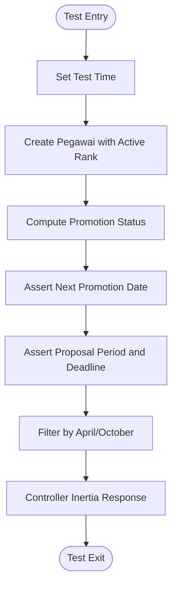
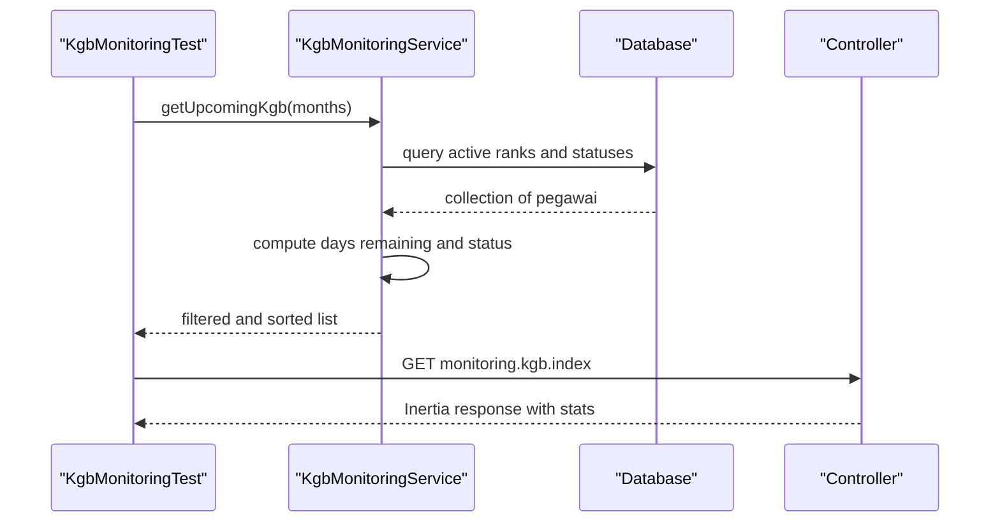
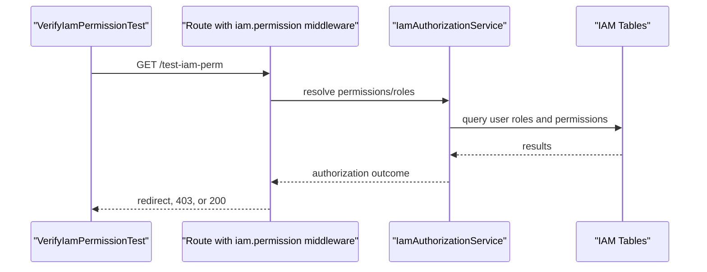
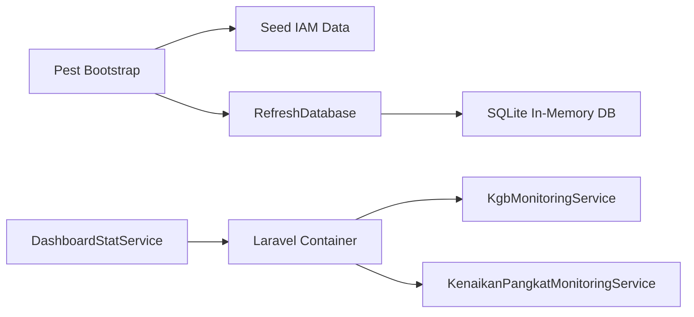

# Service Testing Patterns

<cite>
**Referenced Files in This Document**
- [DashboardStatService.php](file://app/Services/DashboardStatService.php)
- [IamAuthorizationService.php](file://app/Services/IamAuthorizationService.php)
- [KenaikanPangkatMonitoringService.php](file://app/Services/KenaikanPangkatMonitoringService.php)
- [KgbMonitoringService.php](file://app/Services/KgbMonitoringService.php)
- [RiwayatJabatanService.php](file://app/Services/RiwayatJabatanService.php)
- [RiwayatPangkatService.php](file://app/Services/RiwayatPangkatService.php)
- [DashboardStatServiceTest.php](file://tests/Unit/Services/DashboardStatServiceTest.php)
- [RiwayatJabatanServiceTest.php](file://tests/Unit/Services/RiwayatJabatanServiceTest.php)
- [RiwayatPangkatServiceTest.php](file://tests/Unit/Services/RiwayatPangkatServiceTest.php)
- [KenaikanPangkatMonitoringTest.php](file://tests/Feature/Monitoring/KenaikanPangkatMonitoringTest.php)
- [KgbMonitoringTest.php](file://tests/Feature/Monitoring/KgbMonitoringTest.php)
- [VerifyIamPermissionTest.php](file://tests/Feature/Iam/VerifyIamPermissionTest.php)
- [Pest.php](file://tests/Pest.php)
- [TestCase.php](file://tests/TestCase.php)
- [phpunit.xml](file://phpunit.xml)
- [composer.json](file://composer.json)
</cite>

## Table of Contents
1. [Introduction](#introduction)
2. [Project Structure](#project-structure)
3. [Core Components](#core-components)
4. [Architecture Overview](#architecture-overview)
5. [Detailed Component Analysis](#detailed-component-analysis)
6. [Dependency Analysis](#dependency-analysis)
7. [Performance Considerations](#performance-considerations)
8. [Troubleshooting Guide](#troubleshooting-guide)
9. [Conclusion](#conclusion)
10. [Appendices](#appendices)

## Introduction
This document presents comprehensive testing patterns and best practices for the service layer. It focuses on unit testing, dependency mocking, integration testing, and performance considerations for services that interact with databases, external APIs, and complex business logic. Examples are drawn from statistical services, authorization services, and monitoring services to illustrate robust test design, assertion strategies, and container resolution techniques.

## Project Structure
The repository organizes tests by type and feature:
- Unit tests under tests/Unit focus on isolated service logic and deterministic assertions.
- Feature tests under tests/Feature validate integration with controllers, middleware, and domain workflows.
- Shared test infrastructure is centralized in tests/TestCase.php and configured via tests/Pest.php and phpunit.xml.

**Diagram sources**
- [DashboardStatServiceTest.php](file://tests/Unit/Services/DashboardStatServiceTest.php)
- [RiwayatJabatanServiceTest.php](file://tests/Unit/Services/RiwayatJabatanServiceTest.php)
- [RiwayatPangkatServiceTest.php](file://tests/Unit/Services/RiwayatPangkatServiceTest.php)
- [KenaikanPangkatMonitoringTest.php](file://tests/Feature/Monitoring/KenaikanPangkatMonitoringTest.php)
- [KgbMonitoringTest.php](file://tests/Feature/Monitoring/KgbMonitoringTest.php)
- [VerifyIamPermissionTest.php](file://tests/Feature/Iam/VerifyIamPermissionTest.php)
- [Pest.php](file://tests/Pest.php)
- [TestCase.php](file://tests/TestCase.php)
- [phpunit.xml](file://phpunit.xml)

**Section sources**
- [phpunit.xml:1-38](file://phpunit.xml#L1-L38)
- [composer.json:1-116](file://composer.json#L1-L116)

## Core Components
This section outlines the service layer under test and highlights testing strategies per component.

- DashboardStatService
  - Responsibilities: Aggregates dashboard metrics from multiple models and delegates upcoming KGB/KP counts to monitoring services.
  - Testing approach: Unit test validates computed distributions and counts; mocks monitoring services to isolate logic and control external dependencies.
  - Key methods: getStats, getDistribusiGolongan, getDistribusiUnitKerja, getDistribusiJenisKelamin, getKgbSegeraCount, getKpEligibleCount, getPegawaiBaruBulanIni.

- RiwayatJabatanService
  - Responsibilities: Manages Jabatan history with transactional integrity and synchronizes active references to the Pegawai model.
  - Testing approach: Unit tests validate transaction boundaries, sync behavior, and data propagation across related records.
  - Key methods: store, update, syncRiwayatAktif.

- RiwayatPangkatService
  - Responsibilities: Manages Pangkat history with transactional integrity and ensures single active record per Pegawai.
  - Testing approach: Unit tests validate transactional creation/update and synchronization of active rank.
  - Key methods: store, update, syncAktifRiwayatPangkat.

- KenaikanPangkatMonitoringService
  - Responsibilities: Computes eligibility and deadlines for next promotion periods based on active rank TMT.
  - Testing approach: Feature tests validate date arithmetic, filtering, and controller integration; uses factories and Carbon stubbing.
  - Key methods: getUpcomingKenaikanPangkat, getKpStatus.

- KgbMonitoringService
  - Responsibilities: Computes days remaining until next KGB and categorizes urgency.
  - Testing approach: Feature tests validate status computation, filtering, and Inertia response shape.
  - Key methods: getUpcomingKgb, getKgbStatus.

- IamAuthorizationService
  - Responsibilities: Resolves user permissions and roles scoped to an application.
  - Testing approach: Feature tests validate middleware authorization and route protection.
  - Key methods: getUserPermissions, getUserRoles.

**Section sources**
- [DashboardStatService.php:1-148](file://app/Services/DashboardStatService.php#L1-L148)
- [RiwayatJabatanService.php:1-50](file://app/Services/RiwayatJabatanService.php#L1-L50)
- [RiwayatPangkatService.php:1-55](file://app/Services/RiwayatPangkatService.php#L1-L55)
- [KenaikanPangkatMonitoringService.php:1-122](file://app/Services/KenaikanPangkatMonitoringService.php#L1-L122)
- [KgbMonitoringService.php:1-100](file://app/Services/KgbMonitoringService.php#L1-L100)
- [IamAuthorizationService.php:1-45](file://app/Services/IamAuthorizationService.php#L1-L45)

## Architecture Overview
The testing architecture leverages Pest for expressive tests, shared base classes for common setup, and Laravel’s container for dependency resolution. Mocking and service substitution enable isolation of unit tests while feature tests exercise end-to-end flows.

**Diagram sources**
- [DashboardStatService.php:87-98](file://app/Services/DashboardStatService.php#L87-L98)
- [DashboardStatServiceTest.php:71-91](file://tests/Unit/Services/DashboardStatServiceTest.php#L71-L91)
- [KgbMonitoringService.php:14-52](file://app/Services/KgbMonitoringService.php#L14-L52)
- [KenaikanPangkatMonitoringService.php:13-62](file://app/Services/KenaikanPangkatMonitoringService.php#L13-L62)
- [KgbMonitoringTest.php:1-120](file://tests/Feature/Monitoring/KgbMonitoringTest.php#L1-L120)
- [KenaikanPangkatMonitoringTest.php:1-122](file://tests/Feature/Monitoring/KenaikanPangkatMonitoringTest.php#L1-L122)

## Detailed Component Analysis

### DashboardStatService Testing Pattern
- Strategy
  - Isolate service logic by substituting monitoring services with lightweight mocks to control external dependencies.
  - Use factories to construct deterministic datasets for counts and distributions.
  - Stub time-sensitive computations with Carbon test helpers to ensure reproducible outcomes.
- Assertions
  - Structural checks: assert presence of expected keys and shapes.
  - Value checks: assert computed counts and distribution totals.
- Dependencies
  - Uses container resolution to instantiate monitoring services; substitute during tests to avoid real-time calculations.

**Diagram sources**
- [DashboardStatServiceTest.php:71-127](file://tests/Unit/Services/DashboardStatServiceTest.php#L71-L127)
- [DashboardStatService.php:87-98](file://app/Services/DashboardStatService.php#L87-L98)

**Section sources**
- [DashboardStatServiceTest.php:1-128](file://tests/Unit/Services/DashboardStatServiceTest.php#L1-L128)
- [DashboardStatService.php:16-147](file://app/Services/DashboardStatService.php#L16-L147)

### RiwayatJabatanService Testing Pattern
- Strategy
  - Transactional boundary testing: verify that creating/updating activates a record and deactivates others.
  - Data propagation: ensure the Pegawai record reflects the latest active references after sync.
  - Deterministic factories: supply controlled data to simulate real-world scenarios.
- Assertions
  - Existence and ownership checks for created records.
  - Deactivation of previously active records.
  - Updated references on the Pegawai entity.

**Diagram sources**
- [RiwayatJabatanServiceTest.php:30-47](file://tests/Unit/Services/RiwayatJabatanServiceTest.php#L30-L47)
- [RiwayatJabatanService.php:11-48](file://app/Services/RiwayatJabatanService.php#L11-L48)

**Section sources**
- [RiwayatJabatanServiceTest.php:1-92](file://tests/Unit/Services/RiwayatJabatanServiceTest.php#L1-L92)
- [RiwayatJabatanService.php:1-50](file://app/Services/RiwayatJabatanService.php#L1-L50)

### RiwayatPangkatService Testing Pattern
- Strategy
  - Validate transactional persistence and active record synchronization.
  - Normalize boolean inputs to ensure consistent behavior when values are missing or truthy.
  - Freshness checks after update to ensure subsequent operations see the latest state.
- Assertions
  - Active flag normalization and deactivation of other active records.
  - Updated Pegawai reference after activation.

**Diagram sources**
- [RiwayatPangkatServiceTest.php:28-49](file://tests/Unit/Services/RiwayatPangkatServiceTest.php#L28-L49)
- [RiwayatPangkatService.php:11-53](file://app/Services/RiwayatPangkatService.php#L11-L53)

**Section sources**
- [RiwayatPangkatServiceTest.php:1-96](file://tests/Unit/Services/RiwayatPangkatServiceTest.php#L1-L96)
- [RiwayatPangkatService.php:1-55](file://app/Services/RiwayatPangkatService.php#L1-L55)

### KenaikanPangkatMonitoringService Testing Pattern
- Strategy
  - Date arithmetic and eligibility thresholds validated under controlled time contexts.
  - Filtering by promotion period (April/October) tested with varied TMT dates.
  - Controller integration verified via Inertia assertions.
- Assertions
  - Next promotion date derived from TMT plus four years.
  - Period and deadline resolution aligned with calendar quarters.
  - Exclusion of retirees and employees without active rank history.

**Diagram sources**
- [KenaikanPangkatMonitoringTest.php:35-103](file://tests/Feature/Monitoring/KenaikanPangkatMonitoringTest.php#L35-L103)
- [KenaikanPangkatMonitoringService.php:64-95](file://app/Services/KenaikanPangkatMonitoringService.php#L64-L95)

**Section sources**
- [KenaikanPangkatMonitoringTest.php:1-122](file://tests/Feature/Monitoring/KenaikanPangkatMonitoringTest.php#L1-L122)
- [KenaikanPangkatMonitoringService.php:1-122](file://app/Services/KenaikanPangkatMonitoringService.php#L1-L122)

### KgbMonitoringService Testing Pattern
- Strategy
  - Urgency classification based on days remaining until next KGB.
  - Filtering by time window and status inclusion/exclusion criteria.
  - Controller integration with Inertia response verification.
- Assertions
  - Computed next KGB date from TMT minus two years.
  - Status labels mapped to day ranges.
  - List filtered by remaining days threshold.

**Diagram sources**
- [KgbMonitoringTest.php:94-119](file://tests/Feature/Monitoring/KgbMonitoringTest.php#L94-L119)
- [KgbMonitoringService.php:14-52](file://app/Services/KgbMonitoringService.php#L14-L52)

**Section sources**
- [KgbMonitoringTest.php:1-120](file://tests/Feature/Monitoring/KgbMonitoringTest.php#L1-L120)
- [KgbMonitoringService.php:1-100](file://app/Services/KgbMonitoringService.php#L1-L100)

### IamAuthorizationService Testing Pattern
- Strategy
  - Middleware authorization validated through route guards and role/permission assignments.
  - IAM seeder data preloaded to ensure consistent application context.
- Assertions
  - Guest redirection to login.
  - Forbidden responses for users without roles or permissions.
  - Successful access for authorized users.

**Diagram sources**
- [VerifyIamPermissionTest.php:32-59](file://tests/Feature/Iam/VerifyIamPermissionTest.php#L32-L59)
- [IamAuthorizationService.php:16-43](file://app/Services/IamAuthorizationService.php#L16-L43)

**Section sources**
- [VerifyIamPermissionTest.php:1-60](file://tests/Feature/Iam/VerifyIamPermissionTest.php#L1-L60)
- [IamAuthorizationService.php:1-45](file://app/Services/IamAuthorizationService.php#L1-L45)

## Dependency Analysis
- Container Resolution
  - Services are resolved via the Laravel container; tests substitute dependencies to isolate units.
  - Example: DashboardStatService constructs monitoring services through the container and is mocked in unit tests.
- External Dependencies
  - Time-sensitive logic relies on Carbon stubbing to ensure deterministic outcomes.
  - Database-backed services rely on factories and transactions to maintain test isolation.
- Test Infrastructure
  - Pest bootstrap seeds IAM data and applies RefreshDatabase across feature tests.
  - PHPUnit configuration sets SQLite in-memory database and environment variables for consistent runs.

**Diagram sources**
- [Pest.php:9-15](file://tests/Pest.php#L9-L15)
- [phpunit.xml:20-36](file://phpunit.xml#L20-L36)
- [DashboardStatService.php:87-98](file://app/Services/DashboardStatService.php#L87-L98)

**Section sources**
- [Pest.php:1-16](file://tests/Pest.php#L1-L16)
- [phpunit.xml:1-38](file://phpunit.xml#L1-L38)
- [DashboardStatService.php:87-98](file://app/Services/DashboardStatService.php#L87-L98)

## Performance Considerations
- Favor unit tests for pure logic and aggregation to minimize database overhead.
- Use container substitution to avoid heavy external service calls during unit tests.
- For integration tests, limit dataset sizes and leverage factories to reduce fixture costs.
- Prefer in-memory SQLite for database tests to speed up test execution.
- Avoid excessive time-dependent computations in hot paths; stub time when feasible.

## Troubleshooting Guide
- Time-sensitive failures
  - Symptom: Tests fail intermittently due to current date.
  - Fix: Use Carbon test helpers to pin time in tests.
  - Reference: [KenaikanPangkatMonitoringTest.php:36-45](file://tests/Feature/Monitoring/KenaikanPangkatMonitoringTest.php#L36-L45), [KgbMonitoringTest.php:29-41](file://tests/Feature/Monitoring/KgbMonitoringTest.php#L29-L41)
- Missing IAM data in middleware tests
  - Symptom: Authorization tests fail due to missing application or roles.
  - Fix: Ensure IAM seeder is executed in beforeEach hooks.
  - Reference: [Pest.php:11-14](file://tests/Pest.php#L11-L14)
- Transactional inconsistencies
  - Symptom: Active record synchronization fails after update.
  - Fix: Verify transaction boundaries and fresh record retrieval.
  - Reference: [RiwayatPangkatServiceTest.php:66-95](file://tests/Unit/Services/RiwayatPangkatServiceTest.php#L66-L95), [RiwayatJabatanServiceTest.php:49-72](file://tests/Unit/Services/RiwayatJabatanServiceTest.php#L49-L72)
- Container dependency resolution
  - Symptom: Service under test resolves unexpected instances.
  - Fix: Bind mocks via the container in tests.
  - Reference: [DashboardStatServiceTest.php:71-91](file://tests/Unit/Services/DashboardStatServiceTest.php#L71-L91)

**Section sources**
- [KenaikanPangkatMonitoringTest.php:35-46](file://tests/Feature/Monitoring/KenaikanPangkatMonitoringTest.php#L35-L46)
- [KgbMonitoringTest.php:28-41](file://tests/Feature/Monitoring/KgbMonitoringTest.php#L28-L41)
- [Pest.php:11-14](file://tests/Pest.php#L11-L14)
- [RiwayatPangkatServiceTest.php:66-95](file://tests/Unit/Services/RiwayatPangkatServiceTest.php#L66-L95)
- [RiwayatJabatanServiceTest.php:49-72](file://tests/Unit/Services/RiwayatJabatanServiceTest.php#L49-L72)
- [DashboardStatServiceTest.php:71-91](file://tests/Unit/Services/DashboardStatServiceTest.php#L71-L91)

## Conclusion
Effective service testing combines unit isolation with targeted integration checks. By substituting dependencies, stubbing time, and leveraging factories, teams can achieve reliable, fast, and maintainable tests. The patterns demonstrated here apply broadly across statistical, authorization, and monitoring services, ensuring robust coverage of business logic and data synchronization.

## Appendices
- Test data setup
  - Use factories to create minimal, deterministic datasets for each scenario.
  - Pre-seed IAM data for authorization tests.
- Assertion strategies
  - Combine structural and value assertions for complex collections.
  - Validate controller responses with Inertia assertions for frontend-backend integration.
- Performance testing approaches
  - Measure unit test suites with minimal fixtures.
  - Use profiling tools to identify slow queries in integration tests.
  - Consider benchmarking container-bound services when mocking is not feasible.