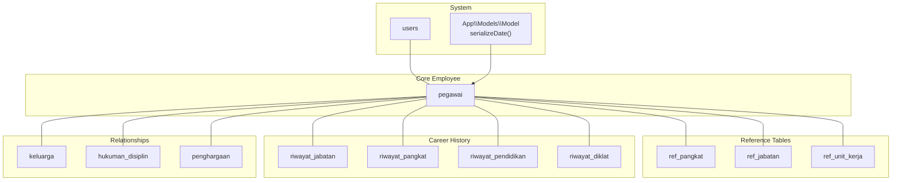
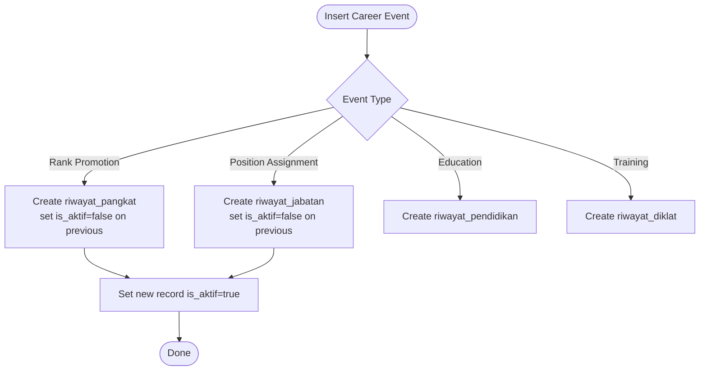
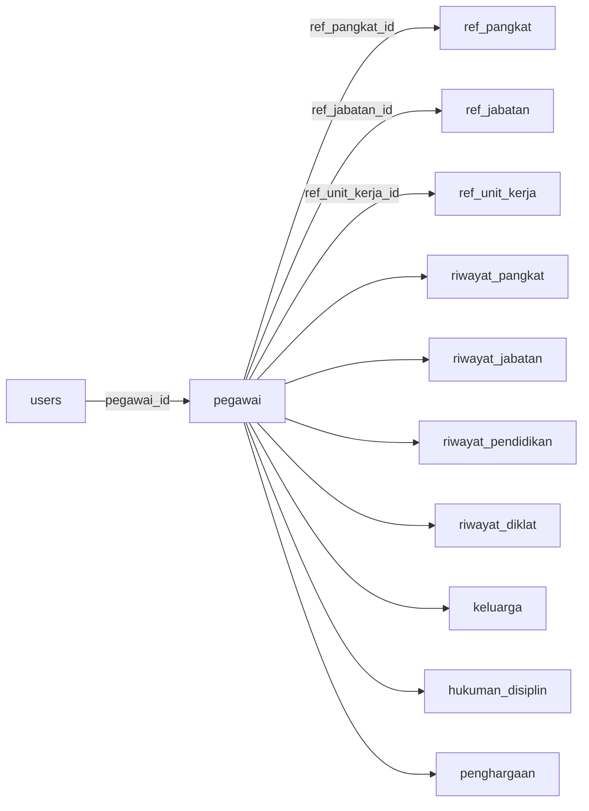

# Core Entity Relationships

<cite>
**Referenced Files in This Document**
- [2026_03_15_024651_create_pegawai_table.php](file://database/migrations/2026_03_15_024651_create_pegawai_table.php)
- [2026_03_15_024652_add_pegawai_id_to_users_table.php](file://database/migrations/2026_03_15_024652_add_pegawai_id_to_users_table.php)
- [2026_03_15_022210_create_ref_pangkats_table.php](file://database/migrations/2026_03_15_022210_create_ref_pangkats_table.php)
- [2026_03_15_022210_create_ref_jabatans_table.php](file://database/migrations/2026_03_15_022210_create_ref_jabatans_table.php)
- [2026_03_15_022210_create_ref_unit_kerjas_table.php](file://database/migrations/2026_03_15_022210_create_ref_unit_kerjas_table.php)
- [2026_03_15_030540_create_riwayat_jabatan_table.php](file://database/migrations/2026_03_15_030540_create_riwayat_jabatan_table.php)
- [2026_03_15_030821_create_riwayat_pendidikan_table.php](file://database/migrations/2026_03_15_030821_create_riwayat_pendidikan_table.php)
- [2026_03_15_030915_create_riwayat_diklat_table.php](file://database/migrations/2026_03_15_030915_create_riwayat_diklat_table.php)
- [2026_03_15_031012_create_riwayat_pangkat_table.php](file://database/migrations/2026_03_15_031012_create_riwayat_pangkat_table.php)
- [2026_03_15_032415_create_keluarga_table.php](file://database/migrations/2026_03_15_032415_create_keluarga_table.php)
- [2026_03_15_032715_create_hukuman_disiplin_table.php](file://database/migrations/2026_03_15_032715_create_hukuman_disiplin_table.php)
- [2026_03_15_032747_create_penghargaan_table.php](file://database/migrations/2026_03_15_032747_create_penghargaan_table.php)
- [Pegawai.php](file://app/Models/Pegawai.php)
- [Model.php](file://app/Models/Model.php)
</cite>

## Table of Contents
1. [Introduction](#introduction)
2. [Project Structure](#project-structure)
3. [Core Components](#core-components)
4. [Architecture Overview](#architecture-overview)
5. [Detailed Component Analysis](#detailed-component-analysis)
6. [Dependency Analysis](#dependency-analysis)
7. [Performance Considerations](#performance-considerations)
8. [Troubleshooting Guide](#troubleshooting-guide)
9. [Conclusion](#conclusion)

## Introduction
This document describes the core employee entity relationships in the Kepegawaian Apps database. It focuses on the primary employee record (pegawai), its personal and demographic attributes, employment status fields, and biometric identifiers. It also documents the complex foreign key relationships with reference tables (ref_pangkat, ref_jabatan, ref_unit_kerja) and the career progression tracking through riwayat_pangkat, riwayat_jabatan, riwayat_pendidikan, and riwayat_diklat. Family relationship management is covered via the keluarga table, while disciplinary actions and awards are tracked through hukuman_disiplin and penghargaan. The document outlines data validation rules, unique constraints, soft delete behavior, and temporal data management for career timelines.

## Project Structure
The data model is implemented using Laravel migrations and Eloquent models. The central employee table is pegawai, with supporting reference tables and history/relationship tables. The application’s base model ensures consistent date serialization for JSON responses.



**Diagram sources**
- [2026_03_15_024651_create_pegawai_table.php:14-48](file://database/migrations/2026_03_15_024651_create_pegawai_table.php#L14-L48)
- [2026_03_15_024652_add_pegawai_id_to_users_table.php:14-17](file://database/migrations/2026_03_15_024652_add_pegawai_id_to_users_table.php#L14-L17)
- [2026_03_15_022210_create_ref_pangkats_table.php:14-24](file://database/migrations/2026_03_15_022210_create_ref_pangkats_table.php#L14-L24)
- [2026_03_15_022210_create_ref_jabatans_table.php:14-23](file://database/migrations/2026_03_15_022210_create_ref_jabatans_table.php#L14-L23)
- [2026_03_15_022210_create_ref_unit_kerjas_table.php:14-22](file://database/migrations/2026_03_15_022210_create_ref_unit_kerjas_table.php#L14-L22)
- [2026_03_15_030540_create_riwayat_jabatan_table.php:14-27](file://database/migrations/2026_03_15_030540_create_riwayat_jabatan_table.php#L14-L27)
- [2026_03_15_030821_create_riwayat_pendidikan_table.php:14-26](file://database/migrations/2026_03_15_030821_create_riwayat_pendidikan_table.php#L14-L26)
- [2026_03_15_030915_create_riwayat_diklat_table.php:14-29](file://database/migrations/2026_03_15_030915_create_riwayat_diklat_table.php#L14-L29)
- [2026_03_15_031012_create_riwayat_pangkat_table.php:14-29](file://database/migrations/2026_03_15_031012_create_riwayat_pangkat_table.php#L14-L29)
- [2026_03_15_032415_create_keluarga_table.php:14-27](file://database/migrations/2026_03_15_032415_create_keluarga_table.php#L14-L27)
- [2026_03_15_032715_create_hukuman_disiplin_table.php:14-27](file://database/migrations/2026_03_15_032715_create_hukuman_disiplin_table.php#L14-L27)
- [2026_03_15_032747_create_penghargaan_table.php:14-25](file://database/migrations/2026_03_15_032747_create_penghargaan_table.php#L14-L25)
- [Model.php:14-17](file://app/Models/Model.php#L14-L17)

**Section sources**
- [2026_03_15_024651_create_pegawai_table.php:14-48](file://database/migrations/2026_03_15_024651_create_pegawai_table.php#L14-L48)
- [Model.php:14-17](file://app/Models/Model.php#L14-L17)

## Core Components
This section documents the primary pegawai table and its relationships, along with supporting reference and history tables.

- Primary table: pegawai
  - Identity and contact: id (ulid), nip (unique), nip_lama, nama_lengkap, tempat_lahir, tanggal_lahir, jenis_kelamin, agama, status_perkawinan, golongan_darah, alamat, no_telepon, email (unique)
  - Employment status: status_kepegawaian, status_pegawai, tmt_cpns, tmt_pns, pendidikan_terakhir, tanggal_masuk, tanggal_pensiun_bup
  - Position and assignment: ref_pangkat_id (foreign), ref_jabatan_id (foreign), ref_unit_kerja_id (foreign)
  - Administrative identifiers: no_karpeg, no_karis_karsu, npwp, no_bpjs_kesehatan, no_bpjs_ketenagakerjaan, no_taspen
  - Biometric identifiers: foto
  - Audit and lifecycle: timestamps, softDeletes
  - Authentication linkage: users.pegawai_id references pegawai.id

- Reference tables
  - ref_pangkat: kode (unique), nama, golongan, ruang, tingkat, urutan (indexed)
  - ref_jabatan: kode (unique), nama, jenis_jabatan, eselon, kelas_jabatan
  - ref_unit_kerja: kode (unique), nama, parent_id (self-reference), urutan (indexed)

- Career history tables
  - riwayat_pangkat: pegawai_id, ref_pangkat_id, no_sk, tanggal_sk, tmt, pejabat_penetap, masa_kerja_tahun, masa_kerja_bulan, gaji_pokok, is_aktif, keterangan, timestamps, softDeletes
  - riwayat_jabatan: pegawai_id, ref_jabatan_id, ref_unit_kerja_id, no_sk, tanggal_sk, tmt, pejabat_penetap, is_aktif, keterangan, timestamps, softDeletes
  - riwayat_pendidikan: pegawai_id, jenjang, nama_sekolah, jurusan, tahun_lulus, no_ijazah, tanggal_ijazah, keterangan, timestamps, softDeletes
  - riwayat_diklat: pegawai_id, ref_jenis_diklat_id, nama_diklat, penyelenggara, tempat, tanggal_mulai, tanggal_selesai, jam_pelajaran, no_sertifikat, tanggal_sertifikat, keterangan, timestamps, softDeletes

- Relationships and auxiliary tables
  - keluarga: pegawai_id, hubungan, nama, tempat_lahir, tanggal_lahir, jenis_kelamin, pekerjaan, pendidikan, keterangan, timestamps, softDeletes
  - hukuman_disiplin: pegawai_id, ref_jenis_hukuman_disiplin_id, no_sk, tanggal_sk, tmt_berlaku, tmt_selesai, pelanggaran, pejabat_penetap, keterangan, timestamps, softDeletes
  - penghargaan: pegawai_id, ref_jenis_penghargaan_id, nama_penghargaan, no_sk, tanggal_sk, pejabat_penetap, keterangan, timestamps, softDeletes

- Validation and constraints
  - Unique constraints: pegawai.nip, pegawai.email, ref_pangkat.kode, ref_jabatan.kode, ref_unit_kerja.kode
  - Foreign keys: pegawai.ref_pangkat_id, pegawai.ref_jabatan_id, pegawai.ref_unit_kerja_id; history tables link to pegawai and reference tables; users.pegawai_id links to pegawai.id
  - Soft deletes: all tables except users support softDeletes
  - Temporal fields: dates for birth, appointments, SK issuance, training, awards, and penalties
  - Enum-like casting: several fields cast to enums via Eloquent casts

- Temporal data management
  - Career timelines are managed through ordered historical records with effective dates (tmt, tanggal_sk, tanggal_mulai, tanggal_selesai) and activity flags (is_aktif)
  - Soft deletes preserve historical audit trails while allowing logical archival

**Section sources**
- [2026_03_15_024651_create_pegawai_table.php:14-48](file://database/migrations/2026_03_15_024651_create_pegawai_table.php#L14-L48)
- [2026_03_15_024652_add_pegawai_id_to_users_table.php:14-17](file://database/migrations/2026_03_15_024652_add_pegawai_id_to_users_table.php#L14-L17)
- [2026_03_15_022210_create_ref_pangkats_table.php:14-24](file://database/migrations/2026_03_15_022210_create_ref_pangkats_table.php#L14-L24)
- [2026_03_15_022210_create_ref_jabatans_table.php:14-23](file://database/migrations/2026_03_15_022210_create_ref_jabatans_table.php#L14-L23)
- [2026_03_15_022210_create_ref_unit_kerjas_table.php:14-22](file://database/migrations/2026_03_15_022210_create_ref_unit_kerjas_table.php#L14-L22)
- [2026_03_15_030540_create_riwayat_jabatan_table.php:14-27](file://database/migrations/2026_03_15_030540_create_riwayat_jabatan_table.php#L14-L27)
- [2026_03_15_030821_create_riwayat_pendidikan_table.php:14-26](file://database/migrations/2026_03_15_030821_create_riwayat_pendidikan_table.php#L14-L26)
- [2026_03_15_030915_create_riwayat_diklat_table.php:14-29](file://database/migrations/2026_03_15_030915_create_riwayat_diklat_table.php#L14-L29)
- [2026_03_15_031012_create_riwayat_pangkat_table.php:14-29](file://database/migrations/2026_03_15_031012_create_riwayat_pangkat_table.php#L14-L29)
- [2026_03_15_032415_create_keluarga_table.php:14-27](file://database/migrations/2026_03_15_032415_create_keluarga_table.php#L14-L27)
- [2026_03_15_032715_create_hukuman_disiplin_table.php:14-27](file://database/migrations/2026_03_15_032715_create_hukuman_disiplin_table.php#L14-L27)
- [2026_03_15_032747_create_penghargaan_table.php:14-25](file://database/migrations/2026_03_15_032747_create_penghargaan_table.php#L14-L25)

## Architecture Overview
The architecture centers around the pegawai entity and its relationships to reference tables and history tables. The users table links to pegawai to enable authentication and role-based access control. The base model enforces consistent date serialization for API responses.

```mermaid
classDiagram
class Pegawai {
+string id
+string nip
+string nip_lama
+string nama_lengkap
+string tempat_lahir
+date tanggal_lahir
+string jenis_kelamin
+string agama
+string status_perkawinan
+string golongan_darah
+string alamat
+string no_telepon
+string email
+string status_kepegawaian
+string status_pegawai
+date tmt_cpns
+date tmt_pns
+string pendidikan_terakhir
+date tanggal_masuk
+date tanggal_pensiun_bup
+string no_karpeg
+string no_karis_karsu
+string npwp
+string no_bpjs_kesehatan
+string no_bpjs_ketenagakerjaan
+string no_taspen
+string foto
+string keterangan
+ulid ref_pangkat_id
+ulid ref_jabatan_id
+ulid ref_unit_kerja_id
+timestamps
+softDeletes
}
class RefPangkat {
+string id
+string kode
+string nama
+string golongan
+string ruang
+string tingkat
+int urutan
+timestamps
+softDeletes
}
class RefJabatan {
+string id
+string kode
+string nama
+string jenis_jabatan
+string eselon
+int kelas_jabatan
+timestamps
+softDeletes
}
class RefUnitKerja {
+string id
+string kode
+string nama
+string parent_id
+int urutan
+timestamps
+softDeletes
}
class RiwayatPangkat {
+string id
+ulid pegawai_id
+ulid ref_pangkat_id
+string no_sk
+date tanggal_sk
+date tmt
+string pejabat_penetap
+int masa_kerja_tahun
+int masa_kerja_bulan
+decimal gaji_pokok
+bool is_aktif
+string keterangan
+timestamps
+softDeletes
}
class RiwayatJabatan {
+string id
+ulid pegawai_id
+ulid ref_jabatan_id
+ulid ref_unit_kerja_id
+string no_sk
+date tanggal_sk
+date tmt
+string pejabat_penetap
+bool is_aktif
+string keterangan
+timestamps
+softDeletes
}
class RiwayatPendidikan {
+string id
+ulid pegawai_id
+string jenjang
+string nama_sekolah
+string jurusan
+int tahun_lulus
+string no_ijazah
+date tanggal_ijazah
+string keterangan
+timestamps
+softDeletes
}
class RiwayatDiklat {
+string id
+ulid pegawai_id
+ulid ref_jenis_diklat_id
+string nama_diklat
+string penyelenggara
+string tempat
+date tanggal_mulai
+date tanggal_selesai
+int jam_pelajaran
+string no_sertifikat
+date tanggal_sertifikat
+string keterangan
+timestamps
+softDeletes
}
class Keluarga {
+string id
+ulid pegawai_id
+string hubungan
+string nama
+string tempat_lahir
+date tanggal_lahir
+string jenis_kelamin
+string pekerjaan
+string pendidikan
+string keterangan
+timestamps
+softDeletes
}
class HukumanDisiplin {
+string id
+ulid pegawai_id
+ulid ref_jenis_hukuman_disiplin_id
+string no_sk
+date tanggal_sk
+date tmt_berlaku
+date tmt_selesai
+string pelanggaran
+string pejabat_penetap
+string keterangan
+timestamps
+softDeletes
}
class Penghargaan {
+string id
+ulid pegawai_id
+ulid ref_jenis_penghargaan_id
+string nama_penghargaan
+string no_sk
+date tanggal_sk
+string pejabat_penetap
+string keterangan
+timestamps
+softDeletes
}
class Users {
+string id
+string name
+string email
+string pegawai_id
+timestamps
}
Pegawai ||--|| RefPangkat : "ref_pangkat_id"
Pegawai ||--|| RefJabatan : "ref_jabatan_id"
Pegawai ||--|| RefUnitKerja : "ref_unit_kerja_id"
Pegawai ||--o{ RiwayatPangkat : "pegawai_id"
Pegawai ||--o{ RiwayatJabatan : "pegawai_id"
Pegawai ||--o{ RiwayatPendidikan : "pegawai_id"
Pegawai ||--o{ RiwayatDiklat : "pegawai_id"
Pegawai ||--o{ Keluarga : "pegawai_id"
Pegawai ||--o{ HukumanDisiplin : "pegawai_id"
Pegawai ||--o{ Penghargaan : "pegawai_id"
Users }|--|| Pegawai : "pegawai_id"
```

**Diagram sources**
- [Pegawai.php:24-208](file://app/Models/Pegawai.php#L24-L208)
- [2026_03_15_024651_create_pegawai_table.php:14-48](file://database/migrations/2026_03_15_024651_create_pegawai_table.php#L14-L48)
- [2026_03_15_024652_add_pegawai_id_to_users_table.php:14-17](file://database/migrations/2026_03_15_024652_add_pegawai_id_to_users_table.php#L14-L17)
- [2026_03_15_022210_create_ref_pangkats_table.php:14-24](file://database/migrations/2026_03_15_022210_create_ref_pangkats_table.php#L14-L24)
- [2026_03_15_022210_create_ref_jabatans_table.php:14-23](file://database/migrations/2026_03_15_022210_create_ref_jabatans_table.php#L14-L23)
- [2026_03_15_022210_create_ref_unit_kerjas_table.php:14-22](file://database/migrations/2026_03_15_022210_create_ref_unit_kerjas_table.php#L14-L22)
- [2026_03_15_030540_create_riwayat_jabatan_table.php:14-27](file://database/migrations/2026_03_15_030540_create_riwayat_jabatan_table.php#L14-L27)
- [2026_03_15_030821_create_riwayat_pendidikan_table.php:14-26](file://database/migrations/2026_03_15_030821_create_riwayat_pendidikan_table.php#L14-L26)
- [2026_03_15_030915_create_riwayat_diklat_table.php:14-29](file://database/migrations/2026_03_15_030915_create_riwayat_diklat_table.php#L14-L29)
- [2026_03_15_031012_create_riwayat_pangkat_table.php:14-29](file://database/migrations/2026_03_15_031012_create_riwayat_pangkat_table.php#L14-L29)
- [2026_03_15_032415_create_keluarga_table.php:14-27](file://database/migrations/2026_03_15_032415_create_keluarga_table.php#L14-L27)
- [2026_03_15_032715_create_hukuman_disiplin_table.php:14-27](file://database/migrations/2026_03_15_032715_create_hukuman_disiplin_table.php#L14-L27)
- [2026_03_15_032747_create_penghargaan_table.php:14-25](file://database/migrations/2026_03_15_032747_create_penghargaan_table.php#L14-L25)

## Detailed Component Analysis

### Employee Entity (pegawai)
- Purpose: Central record for employee identity, demographics, employment status, and administrative identifiers.
- Key fields:
  - Personal: nip (unique), nip_lama, nama_lengkap, tempat_lahir, tanggal_lahir, jenis_kelamin, agama, status_perkawinan, golongan_darah, alamat, no_telepon, email (unique)
  - Employment: status_kepegawaian, status_pegawai, tmt_cpns, tmt_pns, pendidikan_terakhir, tanggal_masuk, tanggal_pensiun_bup
  - Assignment: ref_pangkat_id, ref_jabatan_id, ref_unit_kerja_id
  - Administrative: no_karpeg, no_karis_karsu, npwp, no_bpjs_kesehatan, no_bpjs_ketenagakerjaan, no_taspen
  - Biometric: foto
  - Audit: timestamps, softDeletes
- Relationships:
  - Belongs to ref_pangkat, ref_jabatan, ref_unit_kerja via foreign keys
  - Has many of riwayat_pangkat, riwayat_jabatan, riwayat_pendidikan, riwayat_diklat, keluarga, hukuman_disiplin, penghargaan
  - Linked to users via users.pegawai_id
- Validation and constraints:
  - Unique constraints on nip and email
  - Foreign keys with null-on-delete for reference relations
  - Soft deletes enabled
- Temporal management:
  - Effective dates for appointments and SKs
  - Flags to mark current assignments (is_aktif)

**Section sources**
- [2026_03_15_024651_create_pegawai_table.php:14-48](file://database/migrations/2026_03_15_024651_create_pegawai_table.php#L14-L48)
- [Pegawai.php:69-82](file://app/Models/Pegawai.php#L69-L82)
- [Pegawai.php:99-137](file://app/Models/Pegawai.php#L99-L137)

### Reference Tables
- ref_pangkat
  - Purpose: Stores ranks with unique codes and ordering metadata
  - Constraints: kode is unique; urutan is indexed
- ref_jabatan
  - Purpose: Stores job positions with classification (jenis_jabatan), optional eselon and kelas_jabatan
  - Constraints: kode is unique
- ref_unit_kerja
  - Purpose: Stores organizational units with hierarchical parent reference and ordering
  - Constraints: kode is unique; parent_id self-references ref_unit_kerja with null-on-delete

**Section sources**
- [2026_03_15_022210_create_ref_pangkats_table.php:14-24](file://database/migrations/2026_03_15_022210_create_ref_pangkats_table.php#L14-L24)
- [2026_03_15_022210_create_ref_jabatans_table.php:14-23](file://database/migrations/2026_03_15_022210_create_ref_jabatans_table.php#L14-L23)
- [2026_03_15_022210_create_ref_unit_kerjas_table.php:14-22](file://database/migrations/2026_03_15_022210_create_ref_unit_kerjas_table.php#L14-L22)

### Career Progression Tracking
- riwayat_pangkat
  - Tracks rank promotions with SK details, effective date (tmt), masa kerja, and salary
  - Uses is_aktif to indicate current rank
- riwayat_jabatan
  - Tracks position assignments with unit assignment and effective date
  - Uses is_aktif to indicate current position
- riwayat_pendidikan
  - Records educational background with institution, major, graduation year, and credentials
- riwayat_diklat
  - Records training events with provider, venue, schedule, and certification



**Diagram sources**
- [2026_03_15_031012_create_riwayat_pangkat_table.php:14-29](file://database/migrations/2026_03_15_031012_create_riwayat_pangkat_table.php#L14-L29)
- [2026_03_15_030540_create_riwayat_jabatan_table.php:14-27](file://database/migrations/2026_03_15_030540_create_riwayat_jabatan_table.php#L14-L27)
- [2026_03_15_030821_create_riwayat_pendidikan_table.php:14-26](file://database/migrations/2026_03_15_030821_create_riwayat_pendidikan_table.php#L14-L26)
- [2026_03_15_030915_create_riwayat_diklat_table.php:14-29](file://database/migrations/2026_03_15_030915_create_riwayat_diklat_table.php#L14-L29)

**Section sources**
- [2026_03_15_031012_create_riwayat_pangkat_table.php:14-29](file://database/migrations/2026_03_15_031012_create_riwayat_pangkat_table.php#L14-L29)
- [2026_03_15_030540_create_riwayat_jabatan_table.php:14-27](file://database/migrations/2026_03_15_030540_create_riwayat_jabatan_table.php#L14-L27)
- [2026_03_15_030821_create_riwayat_pendidikan_table.php:14-26](file://database/migrations/2026_03_15_030821_create_riwayat_pendidikan_table.php#L14-L26)
- [2026_03_15_030915_create_riwayat_diklat_table.php:14-29](file://database/migrations/2026_03_15_030915_create_riwayat_diklat_table.php#L14-L29)

### Family Relationship Management (keluarga)
- Purpose: Manage dependents and family members associated with an employee
- Fields: hubungan, nama, tempat_lahir, tanggal_lahir, jenis_kelamin, pekerjaan, pendidikan, keterangan
- Lifecycle: soft deletes supported

**Section sources**
- [2026_03_15_032415_create_keluarga_table.php:14-27](file://database/migrations/2026_03_15_032415_create_keluarga_table.php#L14-L27)

### Disciplinary and Award Tracking
- hukuman_disiplin
  - Records disciplinary actions with SK number/date, enforcement period, and details
- penghargaan
  - Records awards with name, SK details, and issuing authority

**Section sources**
- [2026_03_15_032715_create_hukuman_disiplin_table.php:14-27](file://database/migrations/2026_03_15_032715_create_hukuman_disiplin_table.php#L14-L27)
- [2026_03_15_032747_create_penghargaan_table.php:14-25](file://database/migrations/2026_03_15_032747_create_penghargaan_table.php#L14-L25)

### Authentication Linkage (users ↔ pegawai)
- users.pegawai_id references pegawai.id with null-on-delete
- Enables authentication and IAM integration for employees

**Section sources**
- [2026_03_15_024652_add_pegawai_id_to_users_table.php:14-17](file://database/migrations/2026_03_15_024652_add_pegawai_id_to_users_table.php#L14-L17)

## Dependency Analysis
The following diagram shows the primary dependencies among core entities and their relationships to reference and history tables.



**Diagram sources**
- [2026_03_15_024652_add_pegawai_id_to_users_table.php:14-17](file://database/migrations/2026_03_15_024652_add_pegawai_id_to_users_table.php#L14-L17)
- [2026_03_15_024651_create_pegawai_table.php:35-37](file://database/migrations/2026_03_15_024651_create_pegawai_table.php#L35-L37)
- [2026_03_15_030540_create_riwayat_jabatan_table.php:16-18](file://database/migrations/2026_03_15_030540_create_riwayat_jabatan_table.php#L16-L18)
- [2026_03_15_030821_create_riwayat_pendidikan_table.php:16-16](file://database/migrations/2026_03_15_030821_create_riwayat_pendidikan_table.php#L16-L16)
- [2026_03_15_030915_create_riwayat_diklat_table.php:16-17](file://database/migrations/2026_03_15_030915_create_riwayat_diklat_table.php#L16-L17)
- [2026_03_15_031012_create_riwayat_pangkat_table.php:16-17](file://database/migrations/2026_03_15_031012_create_riwayat_pangkat_table.php#L16-L17)
- [2026_03_15_032415_create_keluarga_table.php:16-16](file://database/migrations/2026_03_15_032415_create_keluarga_table.php#L16-L16)
- [2026_03_15_032715_create_hukuman_disiplin_table.php:16-16](file://database/migrations/2026_03_15_032715_create_hukuman_disiplin_table.php#L16-L16)
- [2026_03_15_032747_create_penghargaan_table.php:16-16](file://database/migrations/2026_03_15_032747_create_penghargaan_table.php#L16-L16)

**Section sources**
- [2026_03_15_024651_create_pegawai_table.php:35-37](file://database/migrations/2026_03_15_024651_create_pegawai_table.php#L35-L37)
- [2026_03_15_024652_add_pegawai_id_to_users_table.php:14-17](file://database/migrations/2026_03_15_024652_add_pegawai_id_to_users_table.php#L14-L17)

## Performance Considerations
- Indexing
  - ref_pangkat.urutan and ref_unit_kerja.urutan are indexed to support ordering and hierarchy traversal.
- Soft deletes
  - Enable logical archival without physical removal; consider periodic cleanup or partitioning for large histories.
- Temporal queries
  - Use is_aktif flags and effective date comparisons to efficiently fetch current assignments and active periods.
- Cascading deletes
  - History tables cascade on pegawai deletion to maintain referential integrity; ensure batch operations are considered for performance.

[No sources needed since this section provides general guidance]

## Troubleshooting Guide
- Unique constraint violations
  - nip or email uniqueness failures indicate duplicate entries; resolve duplicates or update accordingly.
- Foreign key constraint errors
  - Ensure reference IDs (ref_pangkat_id, ref_jabatan_id, ref_unit_kerja_id) exist and match ulid format.
- Soft delete visibility
  - Queries must account for deleted_at; use appropriate scopes or filters to include/exclude soft-deleted records.
- Date serialization
  - Confirm consistent date/time serialization via the base model for API responses.

**Section sources**
- [2026_03_15_024651_create_pegawai_table.php:16-27](file://database/migrations/2026_03_15_024651_create_pegawai_table.php#L16-L27)
- [Model.php:14-17](file://app/Models/Model.php#L14-L17)

## Conclusion
The Kepegawaian Apps data model centers on the pegawai entity with robust relationships to reference tables and comprehensive career history tracking. Unique constraints, foreign keys, soft deletes, and temporal fields ensure data integrity and auditability. The model supports efficient querying of current assignments via is_aktif flags and effective dates, while maintaining historical records for compliance and reporting.