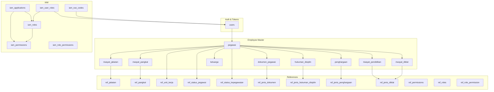
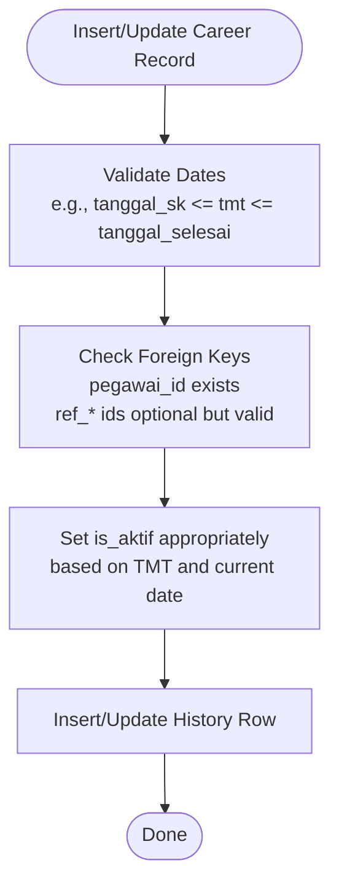
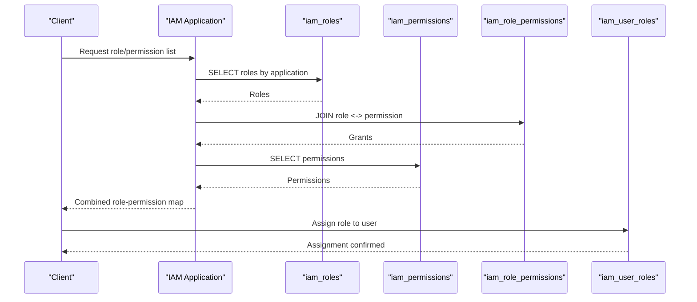
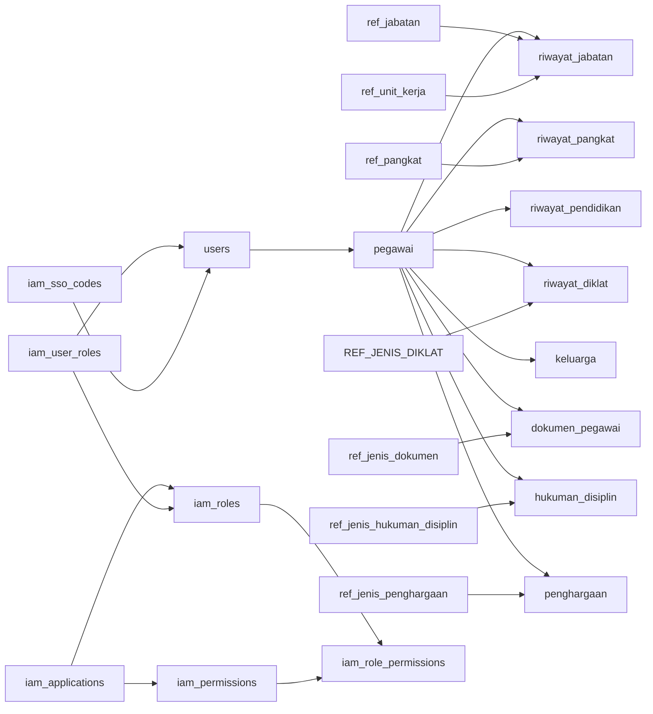

# Database Design

<cite>
**Referenced Files in This Document**
- [2026_03_15_024651_create_pegawai_table.php](file://database/migrations/2026_03_15_024651_create_pegawai_table.php)
- [2026_03_15_024652_add_pegawai_id_to_users_table.php](file://database/migrations/2026_03_15_024652_add_pegawai_id_to_users_table.php)
- [2026_03_15_030540_create_riwayat_jabatan_table.php](file://database/migrations/2026_03_15_030540_create_riwayat_jabatan_table.php)
- [2026_03_15_030821_create_riwayat_pendidikan_table.php](file://database/migrations/2026_03_15_030821_create_riwayat_pendidikan_table.php)
- [2026_03_15_030915_create_riwayat_diklat_table.php](file://database/migrations/2026_03_15_030915_create_riwayat_diklat_table.php)
- [2026_03_15_031012_create_riwayat_pangkat_table.php](file://database/migrations/2026_03_15_031012_create_riwayat_pangkat_table.php)
- [2026_03_15_032415_create_keluarga_table.php](file://database/migrations/2026_03_15_032415_create_keluarga_table.php)
- [2026_03_15_022210_create_ref_jabatans_table.php](file://database/migrations/2026_03_15_022210_create_ref_jabatans_table.php)
- [2026_03_15_022210_create_ref_pangkats_table.php](file://database/migrations/2026_03_15_022210_create_ref_pangkats_table.php)
- [2026_03_15_022210_create_ref_unit_kerjas_table.php](file://database/migrations/2026_03_15_022210_create_ref_unit_kerjas_table.php)
- [2026_03_15_164127_create_ref_permissions_table.php](file://database/migrations/2026_03_15_164127_create_ref_permissions_table.php)
- [2026_03_15_164127_create_ref_roles_table.php](file://database/migrations/2026_03_15_164127_create_ref_roles_table.php)
- [2026_03_15_164128_create_ref_role_permission_table.php](file://database/migrations/2026_03_15_164128_create_ref_role_permission_table.php)
- [2026_03_21_000001_create_iam_tables.php](file://database/migrations/2026_03_21_000001_create_iam_tables.php)
- [2026_03_15_162757_create_ref_jenis_dokumen_table.php](file://database/migrations/2026_03_15_162757_create_ref_jenis_dokumen_table.php)
- [2026_03_15_032715_create_hukuman_disiplin_table.php](file://database/migrations/2026_03_15_032715_create_hukuman_disiplin_table.php)
- [2026_03_15_032747_create_penghargaan_table.php](file://database/migrations/2026_03_15_032747_create_penghargaan_table.php)
- [2026_03_15_032846_create_dokumen_pegawai_table.php](file://database/migrations/2026_03_15_032846_create_dokumen_pegawai_table.php)
- [2026_03_15_163309_create_ref_status_kepegawaian_table.php](file://database/migrations/2026_03_15_163309_create_ref_status_kepegawaian_table.php)
- [2026_03_15_163309_create_ref_status_pegawai_table.php](file://database/migrations/2026_03_15_163309_create_ref_status_pegawai_table.php)
- [2026_03_15_164810_add_status_fk_to_pegawai_table.php](file://database/migrations/2026_03_15_164810_add_status_fk_to_pegawai_table.php)
- [2026_03_15_164916_add_ref_status_fks_to_pegawai_table.php](file://database/migrations/2026_03_15_164916_add_ref_status_fks_to_pegawai_table.php)
- [2026_03_18_074901_create_personal_access_tokens_table.php](file://database/migrations/2026_03_18_074901_create_personal_access_tokens_table.php)
- [2026_03_21_061552_change_iam_applications_api_secret_hash_to_text.php](file://database/migrations/2026_03_21_061552_change_iam_applications_api_secret_hash_to_text.php)
- [2026_03_21_164400_add_index_to_iam_sso_codes.php](file://database/migrations/2026_03_21_164400_add_index_to_iam_sso_codes.php)
- [2026_03_15_023317_add_role_to_users_table.php](file://database/migrations/2026_03_15_023317_add_role_to_users_table.php)
- [2026_03_16_040952_migrate_users_role_to_ref_role_id.php](file://database/migrations/2026_03_16_040952_migrate_users_role_to_ref_role_id.php)
- [2026_03_16_060000_convert_pegawai_to_authenticatable.php](file://database/migrations/2026_03_16_060000_convert_pegawai_to_authenticatable.php)
- [2026_03_21_000003_drop_old_rbac_tables.php](file://database/migrations/2026_03_21_000003_drop_old_rbac_tables.php)
- [2026_03_15_022211_create_ref_jenis_hukuman_disiplins_table.php](file://database/migrations/2026_03_15_022211_create_ref_jenis_hukuman_disiplins_table.php)
- [2026_03_15_022211_create_ref_jenis_penghargaans_table.php](file://database/migrations/2026_03_15_022211_create_ref_jenis_penghargaans_table.php)
- [2026_03_15_022210_create_ref_jenis_diklats_table.php](file://database/migrations/2026_03_15_022210_create_ref_jenis_diklats_table.php)
- [2026_03_15_022210_create_ref_jenis_dokumen_table.php](file://database/migrations/2026_03_15_022210_create_ref_jenis_dokumen_table.php)
- [2026_03_15_022210_create_ref_unit_kerjas_table.php](file://database/migrations/2026_03_15_022210_create_ref_unit_kerjas_table.php)
- [2026_03_15_024651_create_pegawai_table.php](file://database/migrations/2026_03_15_024651_create_pegawai_table.php)
- [2026_03_15_030540_create_riwayat_jabatan_table.php](file://database/migrations/2026_03_15_030540_create_riwayat_jabatan_table.php)
- [2026_03_15_030821_create_riwayat_pendidikan_table.php](file://database/migrations/2026_03_15_030821_create_riwayat_pendidikan_table.php)
- [2026_03_15_030915_create_riwayat_diklat_table.php](file://database/migrations/2026_03_15_030915_create_riwayat_diklat_table.php)
- [2026_03_15_031012_create_riwayat_pangkat_table.php](file://database/migrations/2026_03_15_031012_create_riwayat_pangkat_table.php)
- [2026_03_15_032415_create_keluarga_table.php](file://database/migrations/2026_03_15_032415_create_keluarga_table.php)
- [2026_03_15_022210_create_ref_jabatans_table.php](file://database/migrations/2026_03_15_022210_create_ref_jabatans_table.php)
- [2026_03_15_022210_create_ref_pangkats_table.php](file://database/migrations/2026_03_15_022210_create_ref_pangkats_table.php)
- [2026_03_15_022210_create_ref_unit_kerjas_table.php](file://database/migrations/2026_03_15_022210_create_ref_unit_kerjas_table.php)
- [2026_03_15_164127_create_ref_permissions_table.php](file://database/migrations/2026_03_15_164127_create_ref_permissions_table.php)
- [2026_03_15_164127_create_ref_roles_table.php](file://database/migrations/2026_03_15_164127_create_ref_roles_table.php)
- [2026_03_15_164128_create_ref_role_permission_table.php](file://database/migrations/2026_03_15_164128_create_ref_role_permission_table.php)
- [2026_03_21_000001_create_iam_tables.php](file://database/migrations/2026_03_21_000001_create_iam_tables.php)
- [2026_03_15_162757_create_ref_jenis_dokumen_table.php](file://database/migrations/2026_03_15_162757_create_ref_jenis_dokumen_table.php)
- [2026_03_15_032715_create_hukuman_disiplin_table.php](file://database/migrations/2026_03_15_032715_create_hukuman_disiplin_table.php)
- [2026_03_15_032747_create_penghargaan_table.php](file://database/migrations/2026_03_15_032747_create_penghargaan_table.php)
- [2026_03_15_032846_create_dokumen_pegawai_table.php](file://database/migrations/2026_03_15_032846_create_dokumen_pegawai_table.php)
- [2026_03_15_163309_create_ref_status_kepegawaian_table.php](file://database/migrations/2026_03_15_163309_create_ref_status_kepegawaian_table.php)
- [2026_03_15_163309_create_ref_status_pegawai_table.php](file://database/migrations/2026_03_15_163309_create_ref_status_pegawai_table.php)
- [2026_03_15_164810_add_status_fk_to_pegawai_table.php](file://database/migrations/2026_03_15_164810_add_status_fk_to_pegawai_table.php)
- [2026_03_15_164916_add_ref_status_fks_to_pegawai_table.php](file://database/migrations/2026_03_15_164916_add_ref_status_fks_to_pegawai_table.php)
- [2026_03_18_074901_create_personal_access_tokens_table.php](file://database/migrations/2026_03_18_074901_create_personal_access_tokens_table.php)
- [2026_03_21_061552_change_iam_applications_api_secret_hash_to_text.php](file://database/migrations/2026_03_21_061552_change_iam_applications_api_secret_hash_to_text.php)
- [2026_03_21_164400_add_index_to_iam_sso_codes.php](file://database/migrations/2026_03_21_164400_add_index_to_iam_sso_codes.php)
- [2026_03_15_023317_add_role_to_users_table.php](file://database/migrations/2026_03_15_023317_add_role_to_users_table.php)
- [2026_03_16_040952_migrate_users_role_to_ref_role_id.php](file://database/migrations/2026_03_16_040952_migrate_users_role_to_ref_role_id.php)
- [2026_03_16_060000_convert_pegawai_to_authenticatable.php](file://database/migrations/2026_03_16_060000_convert_pegawai_to_authenticatable.php)
- [2026_03_21_000003_drop_old_rbac_tables.php](file://database/migrations/2026_03_21_000003_drop_old_rbac_tables.php)
</cite>

## Table of Contents
1. [Introduction](#introduction)
2. [Project Structure](#project-structure)
3. [Core Components](#core-components)
4. [Architecture Overview](#architecture-overview)
5. [Detailed Component Analysis](#detailed-component-analysis)
6. [Dependency Analysis](#dependency-analysis)
7. [Performance Considerations](#performance-considerations)
8. [Troubleshooting Guide](#troubleshooting-guide)
9. [Conclusion](#conclusion)
10. [Appendices](#appendices)

## Introduction
This document describes the relational data model for the Kepegawaian Apps, focusing on employee records, career progression, and Identity and Access Management (IAM) subsystems. It documents entity relationships, field definitions, data types, primary and foreign keys, indexes, constraints, referential integrity rules, validation and business rules enforced via database constraints, data access patterns, query optimization strategies, performance considerations, data lifecycle and retention, archival rules, migration paths and version management for schema evolution, and data security and access control through database-level restrictions.

## Project Structure
The database schema is primarily defined by Laravel migrations under database/migrations. The schema is organized around:
- Employee master data (pegawai) and related personal/career history tables
- Reference tables (refs) for job titles, ranks, units, statuses, permissions, roles, and document types
- IAM tables for applications, roles, permissions, role-permission assignments, user roles, and SSO codes
- Supporting tokens and status reference tables



**Diagram sources**
- [2026_03_15_024651_create_pegawai_table.php:14-48](file://database/migrations/2026_03_15_024651_create_pegawai_table.php#L14-L48)
- [2026_03_15_030540_create_riwayat_jabatan_table.php:14-27](file://database/migrations/2026_03_15_030540_create_riwayat_jabatan_table.php#L14-L27)
- [2026_03_15_031012_create_riwayat_pangkat_table.php:14-29](file://database/migrations/2026_03_15_031012_create_riwayat_pangkat_table.php#L14-L29)
- [2026_03_15_030821_create_riwayat_pendidikan_table.php:14-26](file://database/migrations/2026_03_15_030821_create_riwayat_pendidikan_table.php#L14-L26)
- [2026_03_15_030915_create_riwayat_diklat_table.php:14-29](file://database/migrations/2026_03_15_030915_create_riwayat_diklat_table.php#L14-L29)
- [2026_03_15_032415_create_keluarga_table.php:14-27](file://database/migrations/2026_03_15_032415_create_keluarga_table.php#L14-L27)
- [2026_03_15_032846_create_dokumen_pegawai_table.php:14-27](file://database/migrations/2026_03_15_032846_create_dokumen_pegawai_table.php#L14-L27)
- [2026_03_15_032715_create_hukuman_disiplin_table.php:14-27](file://database/migrations/2026_03_15_032715_create_hukuman_disiplin_table.php#L14-L27)
- [2026_03_15_032747_create_penghargaan_table.php:14-27](file://database/migrations/2026_03_15_032747_create_penghargaan_table.php#L14-L27)
- [2026_03_15_022210_create_ref_jabatans_table.php:14-23](file://database/migrations/2026_03_15_022210_create_ref_jabatans_table.php#L14-L23)
- [2026_03_15_022210_create_ref_pangkats_table.php:14-24](file://database/migrations/2026_03_15_022210_create_ref_pangkats_table.php#L14-L24)
- [2026_03_15_022210_create_ref_unit_kerjas_table.php:14-22](file://database/migrations/2026_03_15_022210_create_ref_unit_kerjas_table.php#L14-L22)
- [2026_03_15_163309_create_ref_status_pegawai_table.php:14-21](file://database/migrations/2026_03_15_163309_create_ref_status_pegawai_table.php#L14-L21)
- [2026_03_15_163309_create_ref_status_kepegawaian_table.php:14-21](file://database/migrations/2026_03_15_163309_create_ref_status_kepegawaian_table.php#L14-L21)
- [2026_03_15_162757_create_ref_jenis_dokumen_table.php:11-17](file://database/migrations/2026_03_15_162757_create_ref_jenis_dokumen_table.php#L11-L17)
- [2026_03_15_022211_create_ref_jenis_hukuman_disiplins_table.php:14-21](file://database/migrations/2026_03_15_022211_create_ref_jenis_hukuman_disiplins_table.php#L14-L21)
- [2026_03_15_022211_create_ref_jenis_penghargaans_table.php:14-21](file://database/migrations/2026_03_15_022211_create_ref_jenis_penghargaans_table.php#L14-L21)
- [2026_03_15_022210_create_ref_jenis_diklats_table.php:14-21](file://database/migrations/2026_03_15_022210_create_ref_jenis_diklats_table.php#L14-L21)
- [2026_03_21_000001_create_iam_tables.php:14-98](file://database/migrations/2026_03_21_000001_create_iam_tables.php#L14-L98)
- [2026_03_15_024652_add_pegawai_id_to_users_table.php:14-17](file://database/migrations/2026_03_15_024652_add_pegawai_id_to_users_table.php#L14-L17)

**Section sources**
- [2026_03_15_024651_create_pegawai_table.php:14-48](file://database/migrations/2026_03_15_024651_create_pegawai_table.php#L14-L48)
- [2026_03_21_000001_create_iam_tables.php:14-98](file://database/migrations/2026_03_21_000001_create_iam_tables.php#L14-L98)

## Core Components
This section outlines the principal entities and their attributes, constraints, and relationships.

- Employee master (pegawai)
  - Primary key: ulid id
  - Unique constraints: nip, email
  - Nullable foreign keys: ref_pangkat_id, ref_jabatan_id, ref_unit_kerja_id
  - Soft deletes enabled
  - Additional identifiers: no_karpeg, no_karis_karsu, npwp, no_bpjs_kesehatan, no_bpjs_ketenagakerjaan, no_taspen
  - Personal and employment metadata: nama_lengkap, tempat_lahir, tanggal_lahir, jenis_kelamin, agama, status_perkawinan, golongan_darah, alamat, no_telepon, status_kepegawaian, status_pegawai, tmt_cpns, tmt_pns, pendidikan_terakhir, tanggal_masuk, tanggal_pensiun_bup, foto, keterangan
  - Timestamps: created_at, updated_at, deleted_at

- Career progression tables
  - Riwayat Jabatan (riwayat_jabatan): foreign key pegawai_id; nullable ref_jabatan_id and ref_unit_kerja_id; is_aktif flag; soft deletes
  - Riwayat Pangkat (riwayat_pangkat): foreign key pegawai_id; nullable ref_pangkat_id; masa kerja years/months; gaji_pokok decimal; is_aktif flag; soft deletes
  - Riwayat Pendidikan (riwayat_pendidikan): foreign key pegawai_id; jenjang, nama_sekolah, jurusan, tahun_lulus, no_ijazah, tanggal_ijazah; soft deletes
  - Riwayat Diklat (riwayat_diklat): foreign key pegawai_id; nullable ref_jenis_diklat_id; nama_diklat, penyelenggara, tempat, tanggal_mulai/selesai, jam_pelajaran, no_sertifikat, tanggal_sertifikat; soft deletes
  - Keluarga (keluarga): foreign key pegawai_id; hubungan, nama, tempat_lahir, tanggal_lahir, jenis_kelamin, pekerjaan, pendidikan; soft deletes
  - Dokumen Pegawai (dokumen_pegawai): foreign key pegawai_id; nullable ref_jenis_dokumen_id; soft deletes
  - Hukuman Disiplin (hukuman_disiplin): foreign key pegawai_id; nullable ref_jenis_hukuman_disiplin_id; soft deletes
  - Penghargaan (penghargaan): foreign key pegawai_id; nullable ref_jenis_penghargaan_id; soft deletes

- Reference tables
  - ref_jabatan: kode unique, nama, jenis_jabatan, eselon, kelas_jabatan; soft deletes
  - ref_pangkat: kode unique, nama, golongan, ruang, tingkat, urutan indexed; soft deletes
  - ref_unit_kerja: kode unique, nama, parent_id self-FK; urutan indexed; soft deletes
  - ref_status_pegawai: unique nama; soft deletes
  - ref_status_kepegawaian: unique nama; soft deletes
  - ref_jenis_dokumen: nama; soft deletes
  - ref_jenis_hukuman_disiplin: nama; soft deletes
  - ref_jenis_penghargaan: nama; soft deletes
  - ref_jenis_diklat: nama; soft deletes
  - ref_permissions: unique nama; group; soft deletes
  - ref_roles: unique nama; is_system; soft deletes
  - ref_role_permission: composite unique (ref_role_id, ref_permission_id); soft deletes

- IAM tables
  - iam_applications: slug unique, url, api_key unique, api_secret_hash text, is_active, is_system; soft deletes
  - iam_roles: unique (iam_application_id, slug); is_system; soft deletes
  - iam_permissions: unique (iam_application_id, slug); group; soft deletes
  - iam_role_permissions: unique (iam_role_id, iam_permission_id); soft deletes
  - iam_user_roles: unique (user_id, iam_role_id); timestamps; assigned_at; assigned_by; foreign keys to pegawai and iam_roles; soft deletes
  - iam_sso_codes: unique code; expires_at; used_at; foreign key to pegawai; soft deletes

- Authentication and tokens
  - users: role string default viewer; optional pegawai_id foreign key to pegawai; soft deletes
  - personal_access_tokens: tokenable relations; soft deletes

Constraints and referential integrity:
- All foreign keys use ulid except users.pegawai_id is char(26) matching ulid short form stored in users.user_id.
- Cascade-on-delete for child tables referencing pegawai.
- Null-on-delete for nullable reference relationships (e.g., ref_pangkat_id).
- Unique combinations for application-scoped slugs and role-permission mappings.
- Indexes on frequently filtered/reference columns (ref_pangkat.urutan, ref_unit_kerja.urutan).

**Section sources**
- [2026_03_15_024651_create_pegawai_table.php:14-48](file://database/migrations/2026_03_15_024651_create_pegawai_table.php#L14-L48)
- [2026_03_15_030540_create_riwayat_jabatan_table.php:14-27](file://database/migrations/2026_03_15_030540_create_riwayat_jabatan_table.php#L14-L27)
- [2026_03_15_031012_create_riwayat_pangkat_table.php:14-29](file://database/migrations/2026_03_15_031012_create_riwayat_pangkat_table.php#L14-L29)
- [2026_03_15_030821_create_riwayat_pendidikan_table.php:14-26](file://database/migrations/2026_03_15_030821_create_riwayat_pendidikan_table.php#L14-L26)
- [2026_03_15_030915_create_riwayat_diklat_table.php:14-29](file://database/migrations/2026_03_15_030915_create_riwayat_diklat_table.php#L14-L29)
- [2026_03_15_032415_create_keluarga_table.php:14-27](file://database/migrations/2026_03_15_032415_create_keluarga_table.php#L14-L27)
- [2026_03_15_032846_create_dokumen_pegawai_table.php:14-27](file://database/migrations/2026_03_15_032846_create_dokumen_pegawai_table.php#L14-L27)
- [2026_03_15_032715_create_hukuman_disiplin_table.php:14-27](file://database/migrations/2026_03_15_032715_create_hukuman_disiplin_table.php#L14-L27)
- [2026_03_15_032747_create_penghargaan_table.php:14-27](file://database/migrations/2026_03_15_032747_create_penghargaan_table.php#L14-L27)
- [2026_03_15_022210_create_ref_jabatans_table.php:14-23](file://database/migrations/2026_03_15_022210_create_ref_jabatans_table.php#L14-L23)
- [2026_03_15_022210_create_ref_pangkats_table.php:14-24](file://database/migrations/2026_03_15_022210_create_ref_pangkats_table.php#L14-L24)
- [2026_03_15_022210_create_ref_unit_kerjas_table.php:14-22](file://database/migrations/2026_03_15_022210_create_ref_unit_kerjas_table.php#L14-L22)
- [2026_03_15_163309_create_ref_status_pegawai_table.php:14-21](file://database/migrations/2026_03_15_163309_create_ref_status_pegawai_table.php#L14-L21)
- [2026_03_15_163309_create_ref_status_kepegawaian_table.php:14-21](file://database/migrations/2026_03_15_163309_create_ref_status_kepegawaian_table.php#L14-L21)
- [2026_03_15_162757_create_ref_jenis_dokumen_table.php:11-17](file://database/migrations/2026_03_15_162757_create_ref_jenis_dokumen_table.php#L11-L17)
- [2026_03_15_022211_create_ref_jenis_hukuman_disiplins_table.php:14-21](file://database/migrations/2026_03_15_022211_create_ref_jenis_hukuman_disiplins_table.php#L14-L21)
- [2026_03_15_022211_create_ref_jenis_penghargaans_table.php:14-21](file://database/migrations/2026_03_15_022211_create_ref_jenis_penghargaans_table.php#L14-L21)
- [2026_03_15_022210_create_ref_jenis_diklats_table.php:14-21](file://database/migrations/2026_03_15_022210_create_ref_jenis_diklats_table.php#L14-L21)
- [2026_03_21_000001_create_iam_tables.php:14-98](file://database/migrations/2026_03_21_000001_create_iam_tables.php#L14-L98)
- [2026_03_15_024652_add_pegawai_id_to_users_table.php:14-17](file://database/migrations/2026_03_15_024652_add_pegawai_id_to_users_table.php#L14-L17)

## Architecture Overview
The database architecture separates concerns into:
- Employee domain: pegawai and its history tables
- Reference domain: normalized lookup tables for jobs, ranks, units, statuses, and document types
- IAM domain: application-scoped roles and permissions with user-role assignments and SSO code management
- Authentication and tokens: users table linked to pegawai, personal access tokens

```mermaid
erDiagram
PEGAWAI {
ulid id PK
string nip UK
string email UK
string nama_lengkap
date tanggal_lahir
string jenis_kelamin
string agama
string status_perkawinan
string golongan_darah
text alamat
string no_telepon
string status_kepegawaian
string status_pegawai
date tmt_cpns
date tmt_pns
string pendidikan_terakhir
date tanggal_masuk
date tanggal_pensiun_bup
ulid ref_pangkat_id FK
ulid ref_jabatan_id FK
ulid ref_unit_kerja_id FK
string no_karpeg
string no_karis_karsu
string npwp
string no_bpjs_kesehatan
string no_bpjs_ketenagakerjaan
string no_taspen
string foto
text keterangan
timestamp created_at
timestamp updated_at
timestamp deleted_at
}
RIWAYAT_JABATAN {
ulid id PK
ulid pegawai_id FK
ulid ref_jabatan_id FK
ulid ref_unit_kerja_id FK
string no_sk
date tanggal_sk
date tmt
string pejabat_penetap
boolean is_aktif
text keterangan
timestamp created_at
timestamp updated_at
timestamp deleted_at
}
RIWAYAT_PANGKAT {
ulid id PK
ulid pegawai_id FK
ulid ref_pangkat_id FK
string no_sk
date tanggal_sk
date tmt
string pejabat_penetap
int masa_kerja_tahun
int masa_kerja_bulan
decimal gaji_pokok
boolean is_aktif
text keterangan
timestamp created_at
timestamp updated_at
timestamp deleted_at
}
RIWAYAT_PENDIDIKAN {
ulid id PK
ulid pegawai_id FK
string jenjang
string nama_sekolah
string jurusan
int tahun_lulus
string no_ijazah
date tanggal_ijazah
text keterangan
timestamp created_at
timestamp updated_at
timestamp deleted_at
}
RIWAYAT_DIKLAT {
ulid id PK
ulid pegawai_id FK
ulid ref_jenis_diklat_id FK
string nama_diklat
string penyelenggara
string tempat
date tanggal_mulai
date tanggal_selesai
int jam_pelajaran
string no_sertifikat
date tanggal_sertifikat
text keterangan
timestamp created_at
timestamp updated_at
timestamp deleted_at
}
KELUARGA {
ulid id PK
ulid pegawai_id FK
string hubungan
string nama
date tanggal_lahir
string jenis_kelamin
string pekerjaan
string pendidikan
text keterangan
timestamp created_at
timestamp updated_at
timestamp deleted_at
}
DOKUMEN_PEGAWAI {
ulid id PK
ulid pegawai_id FK
ulid ref_jenis_dokumen_id FK
string nama_file
string deskripsi
timestamp created_at
timestamp updated_at
timestamp deleted_at
}
HUKUMAN_DISIPLIN {
ulid id PK
ulid pegawai_id FK
ulid ref_jenis_hukuman_disiplin_id FK
string no_sk
date tanggal_sk
date tmt
string pejabat_penetap
text keterangan
timestamp created_at
timestamp updated_at
timestamp deleted_at
}
PENGAHARGAAN {
ulid id PK
ulid pegawai_id FK
ulid ref_jenis_penghargaan_id FK
string nama_penghargaan
date tanggal_perolehan
string pemberi
text keterangan
timestamp created_at
timestamp updated_at
timestamp deleted_at
}
REF_JABATAN {
ulid id PK
string kode UK
string nama
string jenis_jabatan
string eselon
int kelas_jabatan
timestamp created_at
timestamp updated_at
timestamp deleted_at
}
REF_PANGKAT {
ulid id PK
string kode UK
string nama
string golongan
string ruang
string tingkat
int urutan I
timestamp created_at
timestamp updated_at
timestamp deleted_at
}
REF_UNIT_KERJA {
ulid id PK
string kode UK
string nama
ulid parent_id FK
int urutan I
timestamp created_at
timestamp updated_at
timestamp deleted_at
}
REF_STATUS_PEGAWAI {
ulid id PK
string nama UK
text keterangan
timestamp created_at
timestamp updated_at
timestamp deleted_at
}
REF_STATUS_KEPEGAWAIAN {
ulid id PK
string nama UK
text keterangan
timestamp created_at
timestamp updated_at
timestamp deleted_at
}
REF_JENIS_DOKUMEN {
ulid id PK
string nama
text keterangan
timestamp created_at
timestamp updated_at
timestamp deleted_at
}
REF_JENIS_HUKUMAN_DISIPLIN {
ulid id PK
string nama
text keterangan
timestamp created_at
timestamp updated_at
timestamp deleted_at
}
REF_JENIS_PENGHARGAAN {
ulid id PK
string nama
text keterangan
timestamp created_at
timestamp updated_at
timestamp deleted_at
}
REF_JENIS_DIKLAT {
ulid id PK
string nama
text keterangan
timestamp created_at
timestamp updated_at
timestamp deleted_at
}
REF_PERMISSIONS {
ulid id PK
string nama UK
string group
text keterangan
timestamp created_at
timestamp updated_at
timestamp deleted_at
}
REF_ROLES {
ulid id PK
string nama UK
text keterangan
boolean is_system
timestamp created_at
timestamp updated_at
timestamp deleted_at
}
REF_ROLE_PERMISSION {
int id PK
ulid ref_role_id FK
ulid ref_permission_id FK
}
IAM_APPLICATIONS {
ulid id PK
string nama
string slug UK
string url
text deskripsi
string api_key UK
text api_secret_hash
boolean is_active
boolean is_system
timestamp created_at
timestamp updated_at
timestamp deleted_at
}
IAM_ROLES {
ulid id PK
ulid iam_application_id FK
string nama
string slug
text keterangan
boolean is_system
timestamp created_at
timestamp updated_at
timestamp deleted_at
}
IAM_PERMISSIONS {
ulid id PK
ulid iam_application_id FK
string nama
string slug
string group
text keterangan
timestamp created_at
timestamp updated_at
timestamp deleted_at
}
IAM_ROLE_PERMISSIONS {
int id PK
ulid iam_role_id FK
ulid iam_permission_id FK
}
IAM_USER_ROLES {
int id PK
char user_id FK
ulid iam_role_id FK
timestamp assigned_at
char assigned_by FK
timestamp created_at
timestamp updated_at
}
IAM_SSO_CODES {
int id PK
string code UK
char user_id FK
string app_slug
timestamp used_at
timestamp expires_at
timestamp created_at
}
USERS {
char id PK
string role
char pegawai_id FK
timestamp created_at
timestamp updated_at
timestamp deleted_at
}
PEGAWAI ||--o{ RIWAYAT_JABATAN : "has"
PEGAWAI ||--o{ RIWAYAT_PANGKAT : "has"
PEGAWAI ||--o{ RIWAYAT_PENDIDIKAN : "has"
PEGAWAI ||--o{ RIWAYAT_DIKLAT : "has"
PEGAWAI ||--o{ KELUARGA : "has"
PEGAWAI ||--o{ DOKUMEN_PEGAWAI : "has"
PEGAWAI ||--o{ HUKUMAN_DISIPLIN : "has"
PEGAWAI ||--o{ PENGAHARGAAN : "has"
REF_JABATAN ||--o{ RIWAYAT_JABATAN : "referenced_by"
REF_PANGKAT ||--o{ RIWAYAT_PANGKAT : "referenced_by"
REF_JENIS_DIKLAT ||--o{ RIWAYAT_DIKLAT : "referenced_by"
REF_JENIS_DOKUMEN ||--o{ DOKUMEN_PEGAWAI : "referenced_by"
REF_JENIS_HUKUMAN_DISIPLIN ||--o{ HUKUMAN_DISIPLIN : "referenced_by"
REF_JENIS_PENGHARGAAN ||--o{ PENGAHARGAAN : "referenced_by"
REF_UNIT_KERJA ||--o{ RIWAYAT_JABATAN : "referenced_by"
REF_UNIT_KERJA ||--o{ PEGAWAI : "referenced_by"
REF_STATUS_PEGAWAI ||--o{ PEGAWAI : "referenced_by"
REF_STATUS_KEPEGAWAIAN ||--o{ PEGAWAI : "referenced_by"
IAM_APPLICATIONS ||--o{ IAM_ROLES : "owns"
IAM_APPLICATIONS ||--o{ IAM_PERMISSIONS : "owns"
IAM_ROLES ||--o{ IAM_ROLE_PERMISSIONS : "grants"
IAM_PERMISSIONS ||--o{ IAM_ROLE_PERMISSIONS : "granted_by"
IAM_USER_ROLES ||--o{ IAM_ROLES : "assigns_to"
IAM_USER_ROLES ||--o{ USERS : "assigns_to"
IAM_SSO_CODES ||--o{ USERS : "links_to"
```

**Diagram sources**
- [2026_03_15_024651_create_pegawai_table.php:14-48](file://database/migrations/2026_03_15_024651_create_pegawai_table.php#L14-L48)
- [2026_03_15_030540_create_riwayat_jabatan_table.php:14-27](file://database/migrations/2026_03_15_030540_create_riwayat_jabatan_table.php#L14-L27)
- [2026_03_15_031012_create_riwayat_pangkat_table.php:14-29](file://database/migrations/2026_03_15_031012_create_riwayat_pangkat_table.php#L14-L29)
- [2026_03_15_030821_create_riwayat_pendidikan_table.php:14-26](file://database/migrations/2026_03_15_030821_create_riwayat_pendidikan_table.php#L14-L26)
- [2026_03_15_030915_create_riwayat_diklat_table.php:14-29](file://database/migrations/2026_03_15_030915_create_riwayat_diklat_table.php#L14-L29)
- [2026_03_15_032415_create_keluarga_table.php:14-27](file://database/migrations/2026_03_15_032415_create_keluarga_table.php#L14-L27)
- [2026_03_15_032846_create_dokumen_pegawai_table.php:14-27](file://database/migrations/2026_03_15_032846_create_dokumen_pegawai_table.php#L14-L27)
- [2026_03_15_032715_create_hukuman_disiplin_table.php:14-27](file://database/migrations/2026_03_15_032715_create_hukuman_disiplin_table.php#L14-L27)
- [2026_03_15_032747_create_penghargaan_table.php:14-27](file://database/migrations/2026_03_15_032747_create_penghargaan_table.php#L14-L27)
- [2026_03_15_022210_create_ref_jabatans_table.php:14-23](file://database/migrations/2026_03_15_022210_create_ref_jabatans_table.php#L14-L23)
- [2026_03_15_022210_create_ref_pangkats_table.php:14-24](file://database/migrations/2026_03_15_022210_create_ref_pangkats_table.php#L14-L24)
- [2026_03_15_022210_create_ref_unit_kerjas_table.php:14-22](file://database/migrations/2026_03_15_022210_create_ref_unit_kerjas_table.php#L14-L22)
- [2026_03_15_163309_create_ref_status_pegawai_table.php:14-21](file://database/migrations/2026_03_15_163309_create_ref_status_pegawai_table.php#L14-L21)
- [2026_03_15_163309_create_ref_status_kepegawaian_table.php:14-21](file://database/migrations/2026_03_15_163309_create_ref_status_kepegawaian_table.php#L14-L21)
- [2026_03_15_162757_create_ref_jenis_dokumen_table.php:11-17](file://database/migrations/2026_03_15_162757_create_ref_jenis_dokumen_table.php#L11-L17)
- [2026_03_15_022211_create_ref_jenis_hukuman_disiplins_table.php:14-21](file://database/migrations/2026_03_15_022211_create_ref_jenis_hukuman_disiplins_table.php#L14-L21)
- [2026_03_15_022211_create_ref_jenis_penghargaans_table.php:14-21](file://database/migrations/2026_03_15_022211_create_ref_jenis_penghargaans_table.php#L14-L21)
- [2026_03_15_022210_create_ref_jenis_diklats_table.php:14-21](file://database/migrations/2026_03_15_022210_create_ref_jenis_diklats_table.php#L14-L21)
- [2026_03_21_000001_create_iam_tables.php:14-98](file://database/migrations/2026_03_21_000001_create_iam_tables.php#L14-L98)
- [2026_03_15_024652_add_pegawai_id_to_users_table.php:14-17](file://database/migrations/2026_03_15_024652_add_pegawai_id_to_users_table.php#L14-L17)

## Detailed Component Analysis

### Employee Master (pegawai)
- Purpose: Central employee record with personal, demographic, and employment metadata.
- Keys and constraints:
  - Primary key: ulid id
  - Unique: nip, email
  - Nullable foreign keys: ref_pangkat_id, ref_jabatan_id, ref_unit_kerja_id
  - Soft deletes
- Typical queries:
  - Search by nip/email
  - Join with ref_* tables for display
  - Filter by status fields and dates
- Validation/business rules:
  - NIP and email uniqueness enforced at DB level
  - TMT CPNS/PNS and other date fields validated by application requests
  - Foreign keys ensure valid reference entries

**Section sources**
- [2026_03_15_024651_create_pegawai_table.php:14-48](file://database/migrations/2026_03_15_024651_create_pegawai_table.php#L14-L48)

### Career Progression Tables
- Riwayat Jabatan
  - Tracks job history with SK issuance, effective dates, and active flag
  - Links to ref_jabatan and ref_unit_kerja
- Riwayat Pangkat
  - Tracks rank promotions with SK, TMT, masa kerja, and salary
  - Active flag indicates current rank
- Riwayat Pendidikan
  - Academic history with school, major, graduation year, and certificate info
- Riwayat Diklat
  - Training records with provider, venue, duration, and certificate
- Keluarga
  - Dependent and family member details
- Dokumen Pegawai
  - Attachments categorized by ref_jenis_dokumen
- Hukuman Disiplin and Penghargaan
  - Disciplinary actions and awards with SK/TMT and issuer details



**Diagram sources**
- [2026_03_15_030540_create_riwayat_jabatan_table.php:14-27](file://database/migrations/2026_03_15_030540_create_riwayat_jabatan_table.php#L14-L27)
- [2026_03_15_031012_create_riwayat_pangkat_table.php:14-29](file://database/migrations/2026_03_15_031012_create_riwayat_pangkat_table.php#L14-L29)
- [2026_03_15_030915_create_riwayat_diklat_table.php:14-29](file://database/migrations/2026_03_15_030915_create_riwayat_diklat_table.php#L14-L29)

**Section sources**
- [2026_03_15_030540_create_riwayat_jabatan_table.php:14-27](file://database/migrations/2026_03_15_030540_create_riwayat_jabatan_table.php#L14-L27)
- [2026_03_15_031012_create_riwayat_pangkat_table.php:14-29](file://database/migrations/2026_03_15_031012_create_riwayat_pangkat_table.php#L14-L29)
- [2026_03_15_030821_create_riwayat_pendidikan_table.php:14-26](file://database/migrations/2026_03_15_030821_create_riwayat_pendidikan_table.php#L14-L26)
- [2026_03_15_030915_create_riwayat_diklat_table.php:14-29](file://database/migrations/2026_03_15_030915_create_riwayat_diklat_table.php#L14-L29)
- [2026_03_15_032415_create_keluarga_table.php:14-27](file://database/migrations/2026_03_15_032415_create_keluarga_table.php#L14-L27)
- [2026_03_15_032846_create_dokumen_pegawai_table.php:14-27](file://database/migrations/2026_03_15_032846_create_dokumen_pegawai_table.php#L14-L27)
- [2026_03_15_032715_create_hukuman_disiplin_table.php:14-27](file://database/migrations/2026_03_15_032715_create_hukuman_disiplin_table.php#L14-L27)
- [2026_03_15_032747_create_penghargaan_table.php:14-27](file://database/migrations/2026_03_15_032747_create_penghargaan_table.php#L14-L27)

### Reference Tables
- ref_jabatan: hierarchical unit classification via eselon/kelas_jabatan
- ref_pangkat: ordered by urutan for promotion sequencing
- ref_unit_kerja: tree structure via parent_id for organizational hierarchy
- ref_status_pegawai and ref_status_kepegawaian: categorical statuses for employees
- ref_jenis_dokumen, ref_jenis_hukuman_disiplin, ref_jenis_penghargaan, ref_jenis_diklat: enumerations for categorization

**Section sources**
- [2026_03_15_022210_create_ref_jabatans_table.php:14-23](file://database/migrations/2026_03_15_022210_create_ref_jabatans_table.php#L14-L23)
- [2026_03_15_022210_create_ref_pangkats_table.php:14-24](file://database/migrations/2026_03_15_022210_create_ref_pangkats_table.php#L14-L24)
- [2026_03_15_022210_create_ref_unit_kerjas_table.php:14-22](file://database/migrations/2026_03_15_022210_create_ref_unit_kerjas_table.php#L14-L22)
- [2026_03_15_163309_create_ref_status_pegawai_table.php:14-21](file://database/migrations/2026_03_15_163309_create_ref_status_pegawai_table.php#L14-L21)
- [2026_03_15_163309_create_ref_status_kepegawaian_table.php:14-21](file://database/migrations/2026_03_15_163309_create_ref_status_kepegawaian_table.php#L14-L21)
- [2026_03_15_162757_create_ref_jenis_dokumen_table.php:11-17](file://database/migrations/2026_03_15_162757_create_ref_jenis_dokumen_table.php#L11-L17)
- [2026_03_15_022211_create_ref_jenis_hukuman_disiplins_table.php:14-21](file://database/migrations/2026_03_15_022211_create_ref_jenis_hukuman_disiplins_table.php#L14-L21)
- [2026_03_15_022211_create_ref_jenis_penghargaans_table.php:14-21](file://database/migrations/2026_03_15_022211_create_ref_jenis_penghargaans_table.php#L14-L21)
- [2026_03_15_022210_create_ref_jenis_diklats_table.php:14-21](file://database/migrations/2026_03_15_022210_create_ref_jenis_diklats_table.php#L14-L21)

### IAM Subsystem
- Application-scoped roles and permissions
- User-role assignments with assignment timestamps and assigner
- SSO code lifecycle with expiry and usage tracking
- Constraints:
  - Unique application+slug for roles and permissions
  - Unique user+role assignment
  - Foreign keys enforce referential integrity across domains



**Diagram sources**
- [2026_03_21_000001_create_iam_tables.php:14-98](file://database/migrations/2026_03_21_000001_create_iam_tables.php#L14-L98)

**Section sources**
- [2026_03_21_000001_create_iam_tables.php:14-98](file://database/migrations/2026_03_21_000001_create_iam_tables.php#L14-L98)

### Authentication and Tokens
- users table extended with role and optional pegawai_id linking to pegawai
- personal_access_tokens for API authentication
- Migration evolves users.role to reference ref_roles via a separate migration

**Section sources**
- [2026_03_15_023317_add_role_to_users_table.php:14-16](file://database/migrations/2026_03_15_023317_add_role_to_users_table.php#L14-L16)
- [2026_03_16_040952_migrate_users_role_to_ref_role_id.php](file://database/migrations/2026_03_16_040952_migrate_users_role_to_ref_role_id.php)
- [2026_03_16_060000_convert_pegawai_to_authenticatable.php](file://database/migrations/2026_03_16_060000_convert_pegawai_to_authenticatable.php)
- [2026_03_18_074901_create_personal_access_tokens_table.php](file://database/migrations/2026_03_18_074901_create_personal_access_tokens_table.php)
- [2026_03_21_000003_drop_old_rbac_tables.php](file://database/migrations/2026_03_21_000003_drop_old_rbac_tables.php)

## Dependency Analysis
- Child-to-parent dependencies:
  - riwayat_* tables depend on pegawai
  - riwayat_diklat, dokumen_pegawai, hukuman_disiplin, penghargaan depend on ref_* enumerations
  - riwayat_jabatan depends on ref_jabatan and ref_unit_kerja
  - riwayat_pangkat depends on ref_pangkat
- IAM dependencies:
  - iam_roles and iam_permissions scoped by iam_applications
  - iam_user_roles links users to roles
  - iam_sso_codes link users to applications
- Indexes and performance:
  - ref_pangkat.urutan and ref_unit_kerja.urutan indexed for ordering and filtering
  - Unique constraints on application-scoped slugs and user+role combinations
- Referential integrity:
  - Foreign keys cascade on delete for history tables
  - Null-on-delete for optional reference relationships



**Diagram sources**
- [2026_03_15_024651_create_pegawai_table.php:14-48](file://database/migrations/2026_03_15_024651_create_pegawai_table.php#L14-L48)
- [2026_03_15_030540_create_riwayat_jabatan_table.php:14-27](file://database/migrations/2026_03_15_030540_create_riwayat_jabatan_table.php#L14-L27)
- [2026_03_15_031012_create_riwayat_pangkat_table.php:14-29](file://database/migrations/2026_03_15_031012_create_riwayat_pangkat_table.php#L14-L29)
- [2026_03_15_030915_create_riwayat_diklat_table.php:14-29](file://database/migrations/2026_03_15_030915_create_riwayat_diklat_table.php#L14-L29)
- [2026_03_15_032846_create_dokumen_pegawai_table.php:14-27](file://database/migrations/2026_03_15_032846_create_dokumen_pegawai_table.php#L14-L27)
- [2026_03_15_032715_create_hukuman_disiplin_table.php:14-27](file://database/migrations/2026_03_15_032715_create_hukuman_disiplin_table.php#L14-L27)
- [2026_03_15_032747_create_penghargaan_table.php:14-27](file://database/migrations/2026_03_15_032747_create_penghargaan_table.php#L14-L27)
- [2026_03_21_000001_create_iam_tables.php:14-98](file://database/migrations/2026_03_21_000001_create_iam_tables.php#L14-L98)

**Section sources**
- [2026_03_15_022210_create_ref_pangkats_table.php:21-21](file://database/migrations/2026_03_15_022210_create_ref_pangkats_table.php#L21-L21)
- [2026_03_15_022210_create_ref_unit_kerjas_table.php:19-19](file://database/migrations/2026_03_15_022210_create_ref_unit_kerjas_table.php#L19-L19)

## Performance Considerations
- Indexes
  - ref_pangkat.urutan and ref_unit_kerja.urutan are indexed to support ordering and filtering in queries
- Query patterns
  - Denormalized display joins are common; ensure covering indexes for frequent filter/select lists
  - Soft-deleted rows should be filtered by default in views; consider scopes in application code
- Storage and data types
  - ulid primary keys offer distributed uniqueness and are efficient for sharding scenarios
  - Decimal precision for financial fields (gaji_pokok) ensures accurate arithmetic
- Concurrency and locking
  - Batch inserts for history tables should leverage transactions
  - IAM role assignment updates should be idempotent and use unique constraints to prevent duplicates

[No sources needed since this section provides general guidance]

## Troubleshooting Guide
- Common constraint violations
  - Unique violations on nip/email in pegawai
  - Unique violations on application-scoped slug combinations in IAM
  - Foreign key violations when inserting history records without valid pegawai_id
- Soft deletes
  - Queries must account for deleted_at fields; ensure application logic filters soft-deleted rows unless explicitly retrieving archived data
- IAM lifecycle
  - SSO codes must be checked for expiry and usage; expired or used codes should not be reused
- Data cleanup
  - Archive historical records by moving to read-only partitions or external storage after retention periods

**Section sources**
- [2026_03_15_024651_create_pegawai_table.php:16-16](file://database/migrations/2026_03_15_024651_create_pegawai_table.php#L16-L16)
- [2026_03_15_024651_create_pegawai_table.php:27-27](file://database/migrations/2026_03_15_024651_create_pegawai_table.php#L27-L27)
- [2026_03_21_000001_create_iam_tables.php:39-39](file://database/migrations/2026_03_21_000001_create_iam_tables.php#L39-L39)
- [2026_03_21_000001_create_iam_tables.php:65-65](file://database/migrations/2026_03_21_000001_create_iam_tables.php#L65-L65)
- [2026_03_21_164400_add_index_to_iam_sso_codes.php](file://database/migrations/2026_03_21_164400_add_index_to_iam_sso_codes.php)

## Conclusion
The Kepegawaian Apps database schema is designed around a clean separation of employee master data, career progression history, reference enumerations, and an application-scoped IAM subsystem. Strong referential integrity, unique constraints, and indexes support reliable reporting and efficient queries. The schema supports soft deletes, hierarchical organization, and robust identity governance. Future enhancements can focus on partitioning historical tables, adding audit trails, and optimizing IAM queries with materialized role-permission maps.

[No sources needed since this section summarizes without analyzing specific files]

## Appendices

### Data Lifecycle, Retention, and Archival
- Retention policy guidelines (conceptual):
  - Employee records: retain indefinitely with soft deletes; archive historical career data after 5–10 years depending on legal requirements
  - Documents and attachments: retain per regulatory period; apply automated archival to cold storage
  - IAM audit logs: retain per compliance; purge expired SSO codes immediately after expiry
- Archival strategy:
  - Move archived riwayat_* and dokumen_pegawai rows to read-only partitions or external cold storage
  - Maintain reference tables for historical reporting while purging obsolete enumerations

[No sources needed since this section provides general guidance]

### Data Validation and Business Rules
- Validation rules enforced at DB level:
  - Uniqueness of nip and email in pegawai
  - Uniqueness of application-scoped slugs for roles and permissions
  - Unique user-role assignments
- Business rules:
  - is_aktif flags in riwayat_jabatan and riwayat_pangkat reflect current positions/ranks
  - Effective date ranges validated by application requests
  - Hierarchical organization via ref_unit_kerja parent_id

**Section sources**
- [2026_03_15_024651_create_pegawai_table.php:16-16](file://database/migrations/2026_03_15_024651_create_pegawai_table.php#L16-L16)
- [2026_03_15_024651_create_pegawai_table.php:27-27](file://database/migrations/2026_03_15_024651_create_pegawai_table.php#L27-L27)
- [2026_03_21_000001_create_iam_tables.php:39-39](file://database/migrations/2026_03_21_000001_create_iam_tables.php#L39-L39)
- [2026_03_21_000001_create_iam_tables.php:65-65](file://database/migrations/2026_03_21_000001_create_iam_tables.php#L65-L65)

### Data Access Patterns and Query Optimization
- Access patterns:
  - Employee detail page: join pegawai with ref_* and latest is_aktif records
  - Career timeline: order riwayat_* by TMT
  - IAM dashboard: join iam_user_roles with iam_roles and iam_permissions
- Optimization tips:
  - Add indexes on frequently filtered columns (e.g., ref_pangkat.urutan, ref_unit_kerja.urutan)
  - Use covering indexes for common SELECT lists
  - Apply pagination and limit results for large datasets

[No sources needed since this section provides general guidance]

### Schema Evolution and Migration Management
- Versioning:
  - Migrations are timestamped; follow chronological order for applying changes
- Migration examples:
  - Adding pegawai_id to users and enforcing foreign key constraints
  - Converting pegawai to authenticatable and migrating legacy roles to ref_roles
  - IAM schema creation and subsequent adjustments (e.g., changing api_secret_hash type, adding indexes)
- Best practices:
  - Always test migrations on staging
  - Use reversible migrations where possible
  - Document breaking changes and deprecation notices

**Section sources**
- [2026_03_15_024652_add_pegawai_id_to_users_table.php:14-17](file://database/migrations/2026_03_15_024652_add_pegawai_id_to_users_table.php#L14-L17)
- [2026_03_16_040952_migrate_users_role_to_ref_role_id.php](file://database/migrations/2026_03_16_040952_migrate_users_role_to_ref_role_id.php)
- [2026_03_16_060000_convert_pegawai_to_authenticatable.php](file://database/migrations/2026_03_16_060000_convert_pegawai_to_authenticatable.php)
- [2026_03_21_061552_change_iam_applications_api_secret_hash_to_text.php](file://database/migrations/2026_03_21_061552_change_iam_applications_api_secret_hash_to_text.php)
- [2026_03_21_164400_add_index_to_iam_sso_codes.php](file://database/migrations/2026_03_21_164400_add_index_to_iam_sso_codes.php)
- [2026_03_21_000003_drop_old_rbac_tables.php](file://database/migrations/2026_03_21_000003_drop_old_rbac_tables.php)

### Data Security and Privacy Controls
- Database-level controls:
  - Unique constraints on sensitive identifiers (nip, email)
  - Soft deletes to preserve audit trails
  - IAM role-permission scoping to least-privilege
- Access control:
  - Users linked to pegawai via foreign key
  - SSO codes expire automatically; track usage to prevent replay attacks
- Privacy:
  - Restrict access to personal data via IAM roles
  - Apply row-level security where supported by the database engine

**Section sources**
- [2026_03_15_024651_create_pegawai_table.php:16-16](file://database/migrations/2026_03_15_024651_create_pegawai_table.php#L16-L16)
- [2026_03_15_024651_create_pegawai_table.php:27-27](file://database/migrations/2026_03_15_024651_create_pegawai_table.php#L27-L27)
- [2026_03_21_000001_create_iam_tables.php:88-97](file://database/migrations/2026_03_21_000001_create_iam_tables.php#L88-L97)