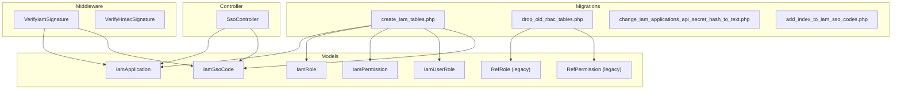
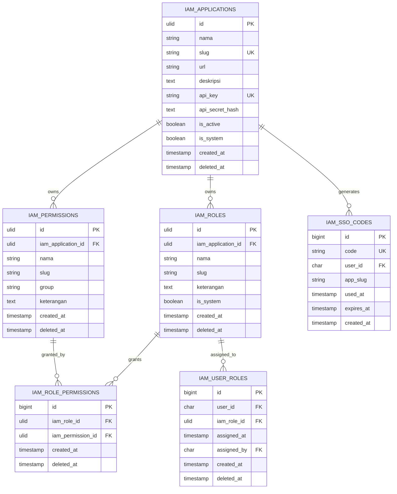
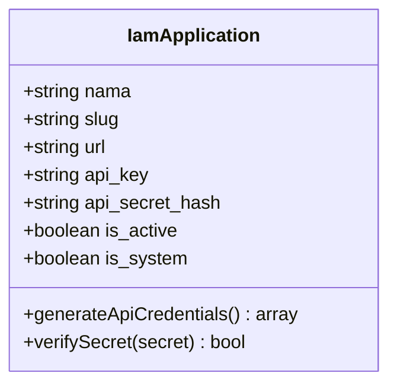
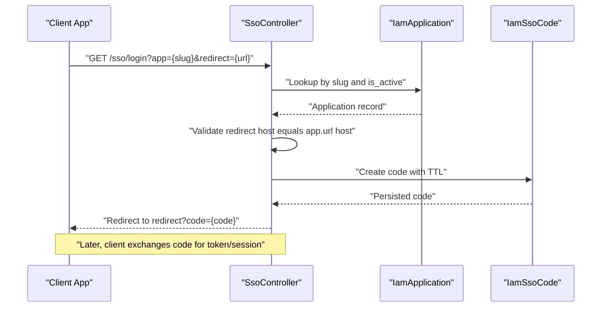
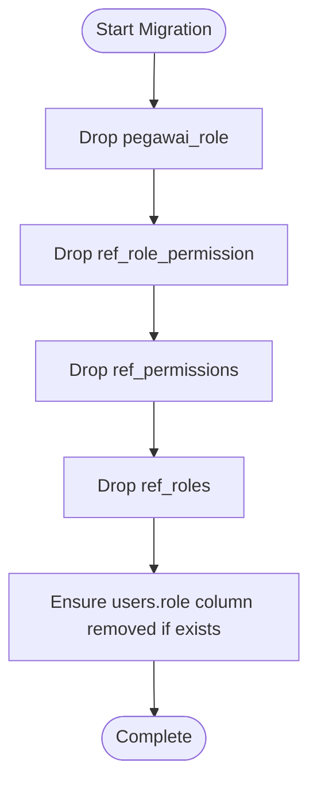
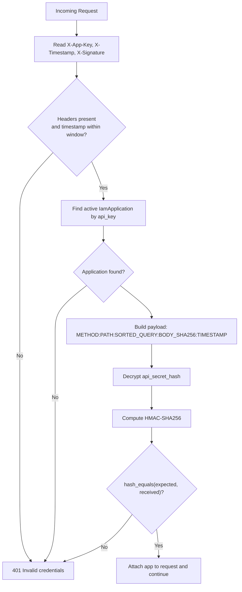
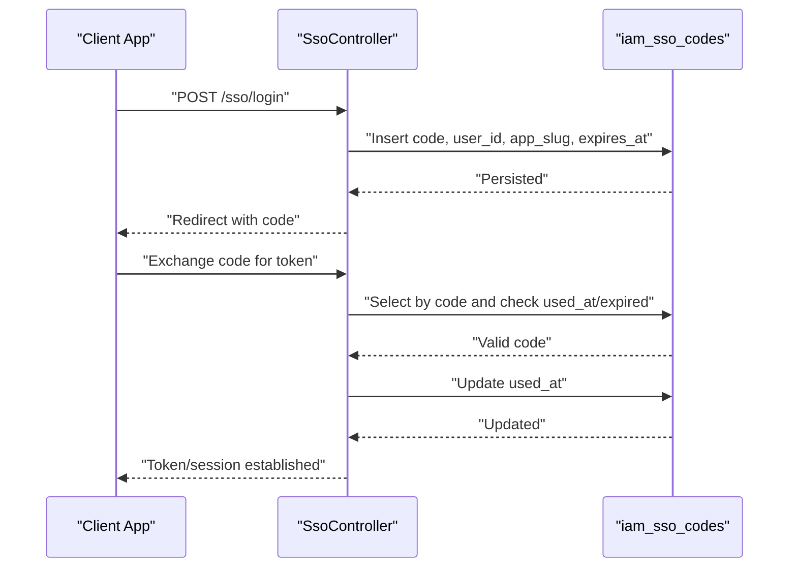
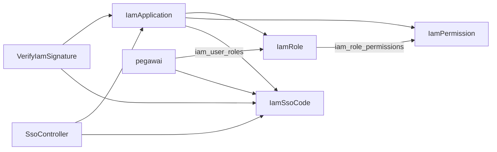

# IAM Database Schema

<cite>
**Referenced Files in This Document**
- [2026_03_21_000001_create_iam_tables.php](file://database/migrations/2026_03_21_000001_create_iam_tables.php)
- [2026_03_21_000003_drop_old_rbac_tables.php](file://database/migrations/2026_03_21_000003_drop_old_rbac_tables.php)
- [2026_03_21_061552_change_iam_applications_api_secret_hash_to_text.php](file://database/migrations/2026_03_21_061552_change_iam_applications_api_secret_hash_to_text.php)
- [2026_03_21_164400_add_index_to_iam_sso_codes.php](file://database/migrations/2026_03_21_164400_add_index_to_iam_sso_codes.php)
- [IamApplication.php](file://app/Models/IamApplication.php)
- [IamSsoCode.php](file://app/Models/IamSsoCode.php)
- [IamRole.php](file://app/Models/IamRole.php)
- [IamPermission.php](file://app/Models/IamPermission.php)
- [RefPermission.php](file://app/Models/RefPermission.php)
- [RefRole.php](file://app/Models/RefRole.php)
- [IamAuthorizationService.php](file://app/Services/IamAuthorizationService.php)
- [VerifyIamSignature.php](file://app/Http/Middleware/VerifyIamSignature.php)
- [VerifyHmacSignature.php](file://app/Http/Middleware/VerifyHmacSignature.php)
- [SsoController.php](file://app/Http/Controllers/SsoController.php)
- [iam.php](file://config/iam.php)
</cite>

## Table of Contents
1. [Introduction](#introduction)
2. [Project Structure](#project-structure)
3. [Core Components](#core-components)
4. [Architecture Overview](#architecture-overview)
5. [Detailed Component Analysis](#detailed-component-analysis)
6. [Dependency Analysis](#dependency-analysis)
7. [Performance Considerations](#performance-considerations)
8. [Troubleshooting Guide](#troubleshooting-guide)
9. [Conclusion](#conclusion)
10. [Appendices](#appendices)

## Introduction
This document provides comprehensive data model documentation for the Identity and Access Management (IAM) subsystem in the Kepegawaian Apps system. It covers:
- Multi-application authentication via the i_am_applications table and API credential lifecycle
- IAM Single Sign-On (SSO) implementation using iam_sso_codes with secure code generation, expiration, and validation
- Relational Role-Based Access Control (RBAC) migration from legacy ref_* tables to the new iam_* structure
- Database-level security measures including API secret hashing, HMAC signature verification, and pruning of expired SSO codes
- Indexing strategies, foreign key relationships, and integration patterns with external authentication systems
- Operational guidance for SSO code lifecycle, token validation, and retention policies

## Project Structure
The IAM schema is defined and evolved through Laravel migrations and supported by Eloquent models and middleware. The primary schema elements are:
- Application registry and credentials
- Roles and permissions scoped to applications
- User-to-role assignments
- SSO code lifecycle and validation
- Legacy RBAC tables dropped after migration

**Diagram sources**
- [2026_03_21_000001_create_iam_tables.php:14-97](file://database/migrations/2026_03_21_000001_create_iam_tables.php#L14-L97)
- [2026_03_21_000003_drop_old_rbac_tables.php:11-22](file://database/migrations/2026_03_21_000003_drop_old_rbac_tables.php#L11-L22)
- [IamApplication.php:12-95](file://app/Models/IamApplication.php#L12-L95)
- [IamSsoCode.php:9-52](file://app/Models/IamSsoCode.php#L9-L52)
- [VerifyIamSignature.php:11-60](file://app/Http/Middleware/VerifyIamSignature.php#L11-L60)
- [VerifyHmacSignature.php:17-64](file://app/Http/Middleware/VerifyHmacSignature.php#L17-L64)
- [SsoController.php:13-84](file://app/Http/Controllers/SsoController.php#L13-L84)

**Section sources**
- [2026_03_21_000001_create_iam_tables.php:1-113](file://database/migrations/2026_03_21_000001_create_iam_tables.php#L1-L113)
- [2026_03_21_000003_drop_old_rbac_tables.php:1-35](file://database/migrations/2026_03_21_000003_drop_old_rbac_tables.php#L1-L35)

## Core Components
This section documents the core IAM database entities and their relationships.

- i_am_applications
  - Purpose: Registry of client applications with API credentials and metadata
  - Key fields: id (ULID), nama, slug (unique), url, deskripsi, api_key (unique), api_secret_hash, is_active, is_system, timestamps, soft deletes
  - Security: api_secret_hash stored as encrypted text; sensitive fields hidden from JSON
  - Lifecycle: auto-generated credentials during creation; secrets retrievable for HMAC verification

- iam_roles
  - Purpose: Application-scoped roles
  - Key fields: id (ULID), iam_application_id (FK), nama, slug, keterangan, is_system, timestamps, soft deletes
  - Constraints: unique constraint on (iam_application_id, slug)

- iam_permissions
  - Purpose: Application-scoped permissions
  - Key fields: id (ULID), iam_application_id (FK), nama, slug, group, keterangan, timestamps, soft deletes
  - Constraints: unique constraint on (iam_application_id, slug)

- iam_role_permissions
  - Purpose: Many-to-many relationship between roles and permissions
  - Key fields: id, iam_role_id (FK), iam_permission_id (FK), timestamps
  - Constraints: unique constraint on (iam_role_id, iam_permission_id)

- iam_user_roles
  - Purpose: Assignments of roles to users (pegawai)
  - Key fields: id, user_id (pegawai.id), iam_role_id (FK), assigned_at, assigned_by (pegawai.id), timestamps
  - Constraints: unique constraint on (user_id, iam_role_id); cascading deletes on role and user

- iam_sso_codes
  - Purpose: Temporary SSO authorization codes bound to a user and application
  - Key fields: id, code (unique, 64 chars), user_id (pegawai.id), app_slug, used_at, expires_at, created_at
  - Lifecycle: generated with TTL; marked used upon exchange; pruned after expiry

**Section sources**
- [2026_03_21_000001_create_iam_tables.php:14-97](file://database/migrations/2026_03_21_000001_create_iam_tables.php#L14-L97)
- [IamApplication.php:12-95](file://app/Models/IamApplication.php#L12-L95)
- [IamSsoCode.php:9-52](file://app/Models/IamSsoCode.php#L9-L52)

## Architecture Overview
The IAM architecture integrates application registration, RBAC, and SSO flows with middleware-driven security checks.

**Diagram sources**
- [2026_03_21_000001_create_iam_tables.php:14-97](file://database/migrations/2026_03_21_000001_create_iam_tables.php#L14-L97)

## Detailed Component Analysis

### i_am_applications: Multi-application Authentication
- Structure and constraints
  - Unique slug and api_key ensure discoverability and prevent collisions
  - api_secret_hash stored as encrypted text to support retrieval for HMAC verification
  - is_active and is_system flags control visibility and system-level privileges
- Credential lifecycle
  - Auto-generation during creation if missing
  - Secrets are decryptable only for HMAC verification and never exposed in responses
- Security implications
  - Hidden sensitive fields
  - Constant-time comparison for secret verification

**Diagram sources**
- [IamApplication.php:12-95](file://app/Models/IamApplication.php#L12-L95)

**Section sources**
- [IamApplication.php:12-95](file://app/Models/IamApplication.php#L12-L95)
- [2026_03_21_061552_change_iam_applications_api_secret_hash_to_text.php:14-16](file://database/migrations/2026_03_21_061552_change_iam_applications_api_secret_hash_to_text.php#L14-L16)

### IAM SSO Implementation: iam_sso_codes
- Purpose and lifecycle
  - Temporary authorization codes with strict TTL
  - Validation ensures unused and non-expired state before exchange
  - Pruning removes expired records older than a day
- Redirect safety
  - Enforces same-host redirect policy for registered application URL
- Expiration and usage tracking
  - used_at indicates successful exchange
  - expires_at governs validity window

**Diagram sources**
- [SsoController.php:15-83](file://app/Http/Controllers/SsoController.php#L15-L83)
- [IamSsoCode.php:9-52](file://app/Models/IamSsoCode.php#L9-L52)
- [IamApplication.php:12-95](file://app/Models/IamApplication.php#L12-L95)

**Section sources**
- [SsoController.php:15-83](file://app/Http/Controllers/SsoController.php#L15-L83)
- [IamSsoCode.php:9-52](file://app/Models/IamSsoCode.php#L9-L52)
- [2026_03_21_164400_add_index_to_iam_sso_codes.php:14-16](file://database/migrations/2026_03_21_164400_add_index_to_iam_sso_codes.php#L14-L16)

### RBAC Migration: From Legacy ref_* to iam_*
- Legacy tables
  - ref_roles, ref_permissions, ref_role_permission, pegawai_role
- New tables
  - iam_roles, iam_permissions, iam_role_permissions, iam_user_roles
- Migration steps
  - Drop legacy tables after pivot and parent tables are removed
  - Ensure users.role column removal if present
- Data continuity
  - User-to-role assignments moved to iam_user_roles with foreign keys to pegawai and iam_roles

**Diagram sources**
- [2026_03_21_000003_drop_old_rbac_tables.php:11-22](file://database/migrations/2026_03_21_000003_drop_old_rbac_tables.php#L11-L22)

**Section sources**
- [2026_03_21_000003_drop_old_rbac_tables.php:1-35](file://database/migrations/2026_03_21_000003_drop_old_rbac_tables.php#L1-L35)
- [IamRole.php:10-37](file://app/Models/IamRole.php#L10-L37)
- [IamPermission.php:9-21](file://app/Models/IamPermission.php#L9-L21)

### Database-Level Security Measures
- API secret hashing
  - api_secret_hash stored as encrypted value; retrievable only for HMAC verification
  - verifySecret uses constant-time comparison to mitigate timing attacks
- HMAC signature verification
  - VerifyIamSignature constructs payload from method, path, sorted query string, body SHA-256, and timestamp
  - Uses decrypted secret to compute HMAC-SHA256 and compares with received signature
  - Rejects requests outside timestamp window (default 300 seconds)
- Audit and pruning
  - iam_sso_codes prunes expired rows older than 24 hours
  - used_at and expires_at track usage and validity

**Diagram sources**
- [VerifyIamSignature.php:15-59](file://app/Http/Middleware/VerifyIamSignature.php#L15-L59)
- [IamApplication.php:85-94](file://app/Models/IamApplication.php#L85-L94)

**Section sources**
- [VerifyIamSignature.php:11-60](file://app/Http/Middleware/VerifyIamSignature.php#L11-L60)
- [IamApplication.php:85-94](file://app/Models/IamApplication.php#L85-L94)
- [IamSsoCode.php:47-51](file://app/Models/IamSsoCode.php#L47-L51)

### SSO Code Lifecycle Management and Token Validation
- Generation
  - SsoController generates a random 64-character code with TTL from configuration
  - Validates redirect host matches application URL host
  - Persists code with expires_at and app_slug
- Exchange and validation
  - Subsequent flows validate code is unused and not expired
  - Mark code as used after successful exchange
- Token TTL
  - Configurable via iam.php; defaults to 60 seconds for SSO codes

**Diagram sources**
- [SsoController.php:60-83](file://app/Http/Controllers/SsoController.php#L60-L83)
- [IamSsoCode.php:32-45](file://app/Models/IamSsoCode.php#L32-L45)

**Section sources**
- [SsoController.php:15-83](file://app/Http/Controllers/SsoController.php#L15-L83)
- [IamSsoCode.php:32-45](file://app/Models/IamSsoCode.php#L32-L45)
- [iam.php:5-7](file://config/iam.php#L5-L7)

### Integration Patterns with External Authentication Systems
- API signature verification
  - Applications sign requests using HMAC-SHA256 with decrypted api_secret_hash
  - Server reconstructs payload deterministically and verifies signature
- SSO redirection
  - After login, server redirects clients back to registered application URL with code parameter
  - Host validation prevents open redirect risks
- Middleware integration
  - VerifyIamSignature applied to protected API endpoints
  - VerifyHmacSignature used for internal or attendance-related integrations requiring HMAC verification

**Section sources**
- [VerifyIamSignature.php:15-59](file://app/Http/Middleware/VerifyIamSignature.php#L15-L59)
- [VerifyHmacSignature.php:25-62](file://app/Http/Middleware/VerifyHmacSignature.php#L25-L62)
- [SsoController.php:60-83](file://app/Http/Controllers/SsoController.php#L60-L83)

## Dependency Analysis
This section maps dependencies among IAM entities and supporting components.

**Diagram sources**
- [2026_03_21_000001_create_iam_tables.php:28-97](file://database/migrations/2026_03_21_000001_create_iam_tables.php#L28-L97)
- [VerifyIamSignature.php:11-60](file://app/Http/Middleware/VerifyIamSignature.php#L11-L60)
- [SsoController.php:13-84](file://app/Http/Controllers/SsoController.php#L13-L84)

**Section sources**
- [2026_03_21_000001_create_iam_tables.php:28-97](file://database/migrations/2026_03_21_000001_create_iam_tables.php#L28-L97)
- [IamAuthorizationService.php:16-43](file://app/Services/IamAuthorizationService.php#L16-L43)

## Performance Considerations
- Indexing strategies
  - iam_sso_codes.app_slug indexed to accelerate lookup by application slug
- Query patterns
  - RBAC queries leverage eager loading of role-permission relationships to minimize N+1 issues
- Pruning
  - Automatic pruning of expired SSO codes reduces table growth and improves lookup performance

**Section sources**
- [2026_03_21_164400_add_index_to_iam_sso_codes.php:14-16](file://database/migrations/2026_03_21_164400_add_index_to_iam_sso_codes.php#L14-L16)
- [IamAuthorizationService.php:16-43](file://app/Services/IamAuthorizationService.php#L16-L43)
- [IamSsoCode.php:47-51](file://app/Models/IamSsoCode.php#L47-L51)

## Troubleshooting Guide
- 401 Invalid credentials during API calls
  - Verify X-App-Key, X-Timestamp, and X-Signature headers are present
  - Confirm timestamp is within 300-second window
  - Ensure application is active and api_key exists
  - Check that api_secret_hash decryption succeeds
- Signature mismatch errors
  - Ensure deterministic payload construction: METHOD:PATH:SORTED_QUERY:BODY_SHA256:TIMESTAMP
  - Confirm secret used for HMAC matches decrypted api_secret_hash
- SSO redirect failures
  - Redirect URL host must match application URL host
  - Verify SSO code TTL and usage state (unused and not expired)
- Pruning of SSO codes
  - Expired codes older than 24 hours are pruned automatically; ensure scheduling of pruning jobs if relying on manual cleanup

**Section sources**
- [VerifyIamSignature.php:21-53](file://app/Http/Middleware/VerifyIamSignature.php#L21-L53)
- [SsoController.php:62-68](file://app/Http/Controllers/SsoController.php#L62-L68)
- [IamSsoCode.php:32-45](file://app/Models/IamSsoCode.php#L32-L45)
- [IamSsoCode.php:47-51](file://app/Models/IamSsoCode.php#L47-L51)

## Conclusion
The IAM schema in Kepegawaian Apps establishes a robust foundation for multi-application authentication, secure SSO, and relational RBAC. By combining encrypted API secrets, deterministic HMAC signatures, strict SSO code validation, and careful indexing, the system balances security and performance. The migration from legacy ref_* tables to iam_* tables streamlines RBAC while preserving user role assignments and permission sets.

## Appendices

### Configuration Reference
- iam.php
  - token_ttl_hours: default token lifetime for issued tokens
  - sso_code_ttl_seconds: default TTL for SSO codes
  - app_slug: default application identifier

**Section sources**
- [iam.php:4-8](file://config/iam.php#L4-L8)