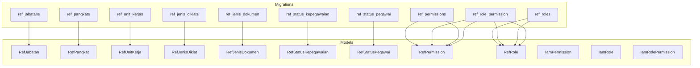
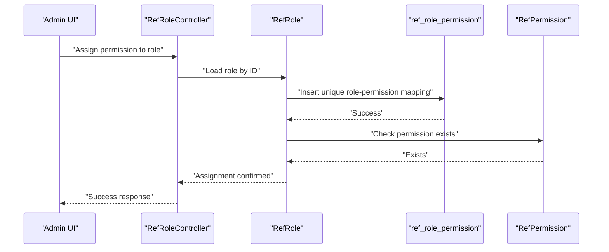
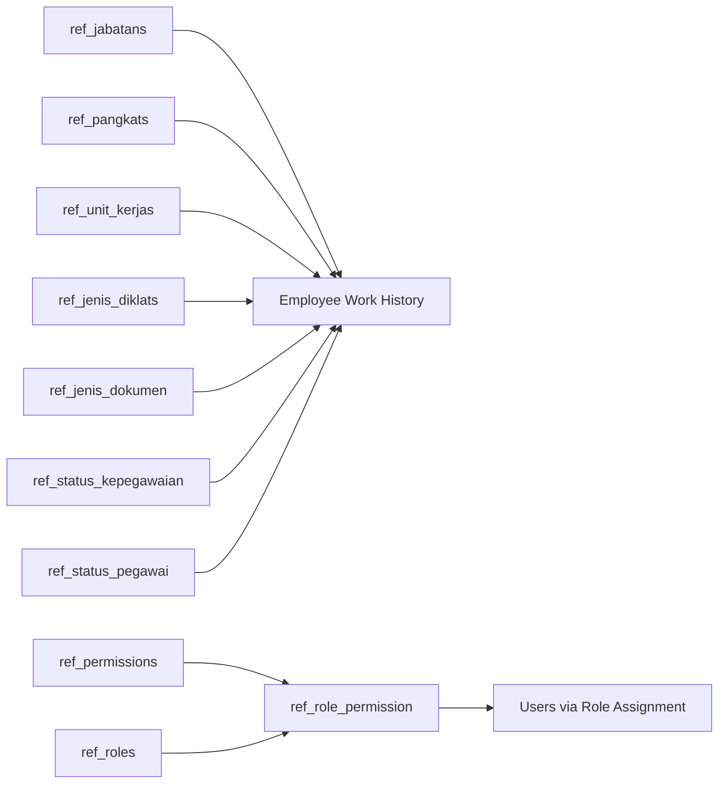

# Reference Data Schema

<cite>
**Referenced Files in This Document**
- [create_ref_jabatans_table.php](file://database/migrations/2026_03_15_022210_create_ref_jabatans_table.php)
- [create_ref_pangkats_table.php](file://database/migrations/2026_03_15_022210_create_ref_pangkats_table.php)
- [create_ref_unit_kerjas_table.php](file://database/migrations/2026_03_15_022210_create_ref_unit_kerjas_table.php)
- [create_ref_jenis_diklats_table.php](file://database/migrations/2026_03_15_022210_create_ref_jenis_diklats_table.php)
- [create_ref_jenis_dokumen_table.php](file://database/migrations/2026_03_15_162757_create_ref_jenis_dokumen_table.php)
- [create_ref_status_kepegawaian_table.php](file://database/migrations/2026_03_15_163309_create_ref_status_kepegawaian_table.php)
- [create_ref_status_pegawai_table.php](file://database/migrations/2026_03_15_163309_create_ref_status_pegawai_table.php)
- [create_ref_permissions_table.php](file://database/migrations/2026_03_15_164127_create_ref_permissions_table.php)
- [create_ref_roles_table.php](file://database/migrations/2026_03_15_164127_create_ref_roles_table.php)
- [create_ref_role_permission_table.php](file://database/migrations/2026_03_15_164128_create_ref_role_permission_table.php)
- [RefPermission.php](file://app/Models/RefPermission.php)
- [RefRole.php](file://app/Models/RefRole.php)
- [IamPermission.php](file://app/Models/IamPermission.php)
- [IamRole.php](file://app/Models/IamRole.php)
- [IamRolePermission.php](file://app/Models/IamRolePermission.php)
- [RefJabatan.php](file://app/Models/RefJabatan.php)
- [RefPangkat.php](file://app/Models/RefPangkat.php)
- [RefUnitKerja.php](file://app/Models/RefUnitKerja.php)
- [RefJenisDokumen.php](file://app/Models/RefJenisDokumen.php)
- [RefStatusKepegawaian.php](file://app/Models/RefStatusKepegawaian.php)
- [RefStatusPegawai.php](file://app/Models/RefStatusPegawai.php)
- [RefJenisDiklat.php](file://app/Models/RefJenisDiklat.php)
- [RefJenisHukumanDisiplin.php](file://app/Models/RefJenisHukumanDisiplin.php)
- [RefJenisPenghargaan.php](file://app/Models/RefJenisPenghargaan.php)
- [RefJenisDokumenController.php](file://app/Http/Controllers/Referensi/RefJenisDokumenController.php)
- [RefRoleController.php](file://app/Http/Controllers/Iam/RefRoleController.php)
- [RefStatusKepegawaianController.php](file://app/Http/Controllers/Referensi/RefStatusKepegawaianController.php)
- [RefStatusPegawaiController.php](file://app/Http/Controllers/Referensi/RefStatusPegawaiController.php)
- [RefJenisDokumenSeeder.php](file://database/seeders/RefJenisDokumenSeeder.php)
- [RefStatusKepegawaianSeeder.php](file://database/seeders/RefStatusKepegawaianSeeder.php)
- [RefStatusPegawaiSeeder.php](file://database/seeders/RefStatusPegawaiSeeder.php)
- [RefPermissionSeeder.php](file://database/seeders/RefPermissionSeeder.php)
- [RefRoleSeeder.php](file://database/seeders/RefRoleSeeder.php)
- [RefJabatanSeeder.php](file://database/seeders/RefJabatanSeeder.php)
- [RefPangkatSeeder.php](file://database/seeders/RefPangkatSeeder.php)
- [RefUnitKerjaSeeder.php](file://database/seeders/RefUnitKerjaSeeder.php)
- [RefJenisDiklatSeeder.php](file://database/seeders/RefJenisDiklatSeeder.php)
- [RefJenisHukumanDisiplinSeeder.php](file://database/seeders/RefJenisHukumanDisiplinSeeder.php)
- [RefJenisPenghargaanSeeder.php](file://database/seeders/RefJenisPenghargaanSeeder.php)
</cite>

## Table of Contents
1. [Introduction](#introduction)
2. [Project Structure](#project-structure)
3. [Core Components](#core-components)
4. [Architecture Overview](#architecture-overview)
5. [Detailed Component Analysis](#detailed-component-analysis)
6. [Dependency Analysis](#dependency-analysis)
7. [Performance Considerations](#performance-considerations)
8. [Troubleshooting Guide](#troubleshooting-guide)
9. [Conclusion](#conclusion)

## Introduction
This document describes the reference data schema that powers static lookup values and classification hierarchies in the Kepegawaian Apps database. It covers position and rank classifications, organizational unit hierarchy, training and document types, employment and employee statuses, and the authorization framework for roles and permissions. The focus is on understanding table structures, relationships, constraints, and how reference data maintains consistency across the system, including many-to-many relationships between roles and permissions.

## Project Structure
The reference data schema is implemented via Laravel migrations and Eloquent models. Migrations define the database tables, while models encapsulate relationships and business logic. Controllers and seeders support CRUD operations and initial data population.



**Diagram sources**
- [create_ref_jabatans_table.php:1-34](file://database/migrations/2026_03_15_022210_create_ref_jabatans_table.php#L1-L34)
- [create_ref_pangkats_table.php:1-35](file://database/migrations/2026_03_15_022210_create_ref_pangkats_table.php#L1-L35)
- [create_ref_unit_kerjas_table.php:1-33](file://database/migrations/2026_03_15_022210_create_ref_unit_kerjas_table.php#L1-L33)
- [create_ref_jenis_diklats_table.php:1-34](file://database/migrations/2026_03_15_022210_create_ref_jenis_diklats_table.php#L1-L34)
- [create_ref_jenis_dokumen_table.php:1-25](file://database/migrations/2026_03_15_162757_create_ref_jenis_dokumen_table.php#L1-L25)
- [create_ref_status_kepegawaian_table.php:1-32](file://database/migrations/2026_03_15_163309_create_ref_status_kepegawaian_table.php#L1-L32)
- [create_ref_status_pegawai_table.php:1-32](file://database/migrations/2026_03_15_163309_create_ref_status_pegawai_table.php#L1-L32)
- [create_ref_permissions_table.php:1-26](file://database/migrations/2026_03_15_164127_create_ref_permissions_table.php#L1-L26)
- [create_ref_roles_table.php:1-26](file://database/migrations/2026_03_15_164127_create_ref_roles_table.php#L1-L26)
- [create_ref_role_permission_table.php:1-25](file://database/migrations/2026_03_15_164128_create_ref_role_permission_table.php#L1-L25)
- [RefJabatan.php](file://app/Models/RefJabatan.php)
- [RefPangkat.php](file://app/Models/RefPangkat.php)
- [RefUnitKerja.php](file://app/Models/RefUnitKerja.php)
- [RefJenisDiklat.php](file://app/Models/RefJenisDiklat.php)
- [RefJenisDokumen.php](file://app/Models/RefJenisDokumen.php)
- [RefStatusKepegawaian.php](file://app/Models/RefStatusKepegawaian.php)
- [RefStatusPegawai.php](file://app/Models/RefStatusPegawai.php)
- [RefPermission.php](file://app/Models/RefPermission.php)
- [RefRole.php](file://app/Models/RefRole.php)
- [IamPermission.php](file://app/Models/IamPermission.php)
- [IamRole.php](file://app/Models/IamRole.php)
- [IamRolePermission.php](file://app/Models/IamRolePermission.php)

**Section sources**
- [create_ref_jabatans_table.php:1-34](file://database/migrations/2026_03_15_022210_create_ref_jabatans_table.php#L1-L34)
- [create_ref_pangkats_table.php:1-35](file://database/migrations/2026_03_15_022210_create_ref_pangkats_table.php#L1-L35)
- [create_ref_unit_kerjas_table.php:1-33](file://database/migrations/2026_03_15_022210_create_ref_unit_kerjas_table.php#L1-L33)
- [create_ref_jenis_diklats_table.php:1-34](file://database/migrations/2026_03_15_022210_create_ref_jenis_diklats_table.php#L1-L34)
- [create_ref_jenis_dokumen_table.php:1-25](file://database/migrations/2026_03_15_162757_create_ref_jenis_dokumen_table.php#L1-L25)
- [create_ref_status_kepegawaian_table.php:1-32](file://database/migrations/2026_03_15_163309_create_ref_status_kepegawaian_table.php#L1-L32)
- [create_ref_status_pegawai_table.php:1-32](file://database/migrations/2026_03_15_163309_create_ref_status_pegawai_table.php#L1-L32)
- [create_ref_permissions_table.php:1-26](file://database/migrations/2026_03_15_164127_create_ref_permissions_table.php#L1-L26)
- [create_ref_roles_table.php:1-26](file://database/migrations/2026_03_15_164127_create_ref_roles_table.php#L1-L26)
- [create_ref_role_permission_table.php:1-25](file://database/migrations/2026_03_15_164128_create_ref_role_permission_table.php#L1-L25)

## Core Components
This section documents the primary reference tables and their roles in the system.

- ref_jabatans: Position classifications with attributes such as code, name, type, level (eselon), and classification number. Unique constraints on code ensure consistent identification.
- ref_pangkats: Rank classifications with code, name, grade (golongan), room/rank (ruang), tier (tingkat), and ordered sequence for sorting.
- ref_unit_kerjas: Organizational unit hierarchy with parent-child relationships and ordering for tree traversal.
- ref_jenis_diklats: Training type classifications for employee education and certification records.
- ref_jenis_dokumen: Document type classifications for attachment categorization.
- ref_status_kepegawaian: Employment status codes and descriptions for administrative categorization.
- ref_status_pegawai: Employee status codes and descriptions for current employment state.
- ref_permissions: Authorization permission definitions grouped optionally for access control.
- ref_roles: Role definitions with optional system flag for platform-level roles.
- ref_role_permission: Many-to-many junction table linking roles to permissions with uniqueness constraint.

Each table uses ulid identifiers, soft deletes, and timestamps for auditability and safe archival.

**Section sources**
- [create_ref_jabatans_table.php:14-23](file://database/migrations/2026_03_15_022210_create_ref_jabatans_table.php#L14-L23)
- [create_ref_pangkats_table.php:14-24](file://database/migrations/2026_03_15_022210_create_ref_pangkats_table.php#L14-L24)
- [create_ref_unit_kerjas_table.php:14-22](file://database/migrations/2026_03_15_022210_create_ref_unit_kerjas_table.php#L14-L22)
- [create_ref_jenis_diklats_table.php:14-23](file://database/migrations/2026_03_15_022210_create_ref_jenis_diklats_table.php#L14-L23)
- [create_ref_jenis_dokumen_table.php:11-17](file://database/migrations/2026_03_15_162757_create_ref_jenis_dokumen_table.php#L11-L17)
- [create_ref_status_kepegawaian_table.php:14-21](file://database/migrations/2026_03_15_163309_create_ref_status_kepegawaian_table.php#L14-L21)
- [create_ref_status_pegawai_table.php:14-21](file://database/migrations/2026_03_15_163309_create_ref_status_pegawai_table.php#L14-L21)
- [create_ref_permissions_table.php:11-18](file://database/migrations/2026_03_15_164127_create_ref_permissions_table.php#L11-L18)
- [create_ref_roles_table.php:11-18](file://database/migrations/2026_03_15_164127_create_ref_roles_table.php#L11-L18)
- [create_ref_role_permission_table.php:11-17](file://database/migrations/2026_03_15_164128_create_ref_role_permission_table.php#L11-L17)

## Architecture Overview
The reference data architecture separates domain-specific classifications from authorization metadata. Domain tables (positions, ranks, units, statuses) provide lookup values used across employee records. Authorization tables (permissions, roles, role-permission mapping) enforce access control.

```mermaid
erDiagram
REF_JABATAN {
ulid id PK
string kode UK
string nama
string jenis_jabatan
string eselon
int kelas_jabatan
datetime created_at
datetime deleted_at
}
REF_PANGKAT {
ulid id PK
string kode UK
string nama
string golongan
string ruang
string tingkat
int urutan IX
datetime created_at
datetime deleted_at
}
REF_UNIT_KERJA {
ulid id PK
string kode UK
string nama
ulid parent_id FK
int urutan IX
datetime created_at
datetime deleted_at
}
REF_JENIS_DOKUMEN {
ulid id PK
string nama
text keterangan
datetime created_at
datetime deleted_at
}
REF_STATUS_KEPEGAWAIAN {
ulid id PK
string kode UK
string nama
text keterangan
datetime created_at
datetime deleted_at
}
REF_STATUS_PEGAWAI {
ulid id PK
string kode UK
string nama
text keterangan
datetime created_at
datetime deleted_at
}
REF_PERMISSIONS {
ulid id PK
string nama UK
string group
text keterangan
datetime created_at
datetime deleted_at
}
REF_ROLES {
ulid id PK
string nama UK
text keterangan
boolean is_system
datetime created_at
datetime deleted_at
}
REF_ROLE_PERMISSION {
bigint id PK
ulid ref_role_id FK
ulid ref_permission_id FK
datetime created_at
}
REF_UNIT_KERJA ||--o| REF_UNIT_KERJA : "parent_child"
REF_ROLE_PERMISSION }o--|| REF_ROLES : "assigns"
REF_ROLE_PERMISSION }o--|| REF_PERMISSIONS : "grants"
```

**Diagram sources**
- [create_ref_jabatans_table.php:14-23](file://database/migrations/2026_03_15_022210_create_ref_jabatans_table.php#L14-L23)
- [create_ref_pangkats_table.php:14-24](file://database/migrations/2026_03_15_022210_create_ref_pangkats_table.php#L14-L24)
- [create_ref_unit_kerjas_table.php:14-22](file://database/migrations/2026_03_15_022210_create_ref_unit_kerjas_table.php#L14-L22)
- [create_ref_jenis_dokumen_table.php:11-17](file://database/migrations/2026_03_15_162757_create_ref_jenis_dokumen_table.php#L11-L17)
- [create_ref_status_kepegawaian_table.php:14-21](file://database/migrations/2026_03_15_163309_create_ref_status_kepegawaian_table.php#L14-L21)
- [create_ref_status_pegawai_table.php:14-21](file://database/migrations/2026_03_15_163309_create_ref_status_pegawai_table.php#L14-L21)
- [create_ref_permissions_table.php:11-18](file://database/migrations/2026_03_15_164127_create_ref_permissions_table.php#L11-L18)
- [create_ref_roles_table.php:11-18](file://database/migrations/2026_03_15_164127_create_ref_roles_table.php#L11-L18)
- [create_ref_role_permission_table.php:11-17](file://database/migrations/2026_03_15_164128_create_ref_role_permission_table.php#L11-L17)

## Detailed Component Analysis

### Position Classifications (ref_jabatans)
- Purpose: Define job positions with classification attributes (type, level, class).
- Keys and constraints: Unique code ensures consistent lookup; soft deletes enable historical auditing.
- Usage: Linked to employee work history (e.g., riwayat jabatan) to maintain accurate position records over time.

**Section sources**
- [create_ref_jabatans_table.php:14-23](file://database/migrations/2026_03_15_022210_create_ref_jabatans_table.php#L14-L23)
- [RefJabatan.php](file://app/Models/RefJabatan.php)

### Rank Classifications (ref_pangkats)
- Purpose: Define ranks with standardized attributes (grade, room, tier) and ordering for progression rules.
- Keys and constraints: Unique code; indexed sequence supports ordered retrieval and comparisons.
- Usage: Used in promotion and salary progression tracking.

**Section sources**
- [create_ref_pangkats_table.php:14-24](file://database/migrations/2026_03_15_022210_create_ref_pangkats_table.php#L14-L24)
- [RefPangkat.php](file://app/Models/RefPangkat.php)

### Organizational Units (ref_unit_kerjas)
- Purpose: Hierarchical organizational structure with parent-child relationships.
- Keys and constraints: Unique code; self-reference via parent_id with cascade deletion; indexed order for tree traversal.
- Usage: Supports department/unit assignment and reporting relationships.

**Section sources**
- [create_ref_unit_kerjas_table.php:14-22](file://database/migrations/2026_03_15_022210_create_ref_unit_kerjas_table.php#L14-L22)
- [RefUnitKerja.php](file://app/Models/RefUnitKerja.php)

### Training Types (ref_jenis_diklats)
- Purpose: Categorize training events for employee education records.
- Keys and constraints: Standard structure with soft deletes for archival.
- Usage: Associates with training history entries.

**Section sources**
- [create_ref_jenis_diklats_table.php:14-23](file://database/migrations/2026_03_15_022210_create_ref_jenis_diklats_table.php#L14-L23)
- [RefJenisDiklat.php](file://app/Models/RefJenisDiklat.php)

### Document Types (ref_jenis_dokumen)
- Purpose: Classify supporting documents attached to employee profiles.
- Keys and constraints: Unique-friendly naming; optional description for context.
- Usage: Drives UI selection and validation for document uploads.

**Section sources**
- [create_ref_jenis_dokumen_table.php:11-17](file://database/migrations/2026_03_15_162757_create_ref_jenis_dokumen_table.php#L11-L17)
- [RefJenisDokumen.php](file://app/Models/RefJenisDokumen.php)

### Employment Status (ref_status_kepegawaian)
- Purpose: Administrative employment status codes and descriptions.
- Keys and constraints: Unique code and name; supports consistent categorization across HR processes.
- Usage: Linked to employee records to reflect official status.

**Section sources**
- [create_ref_status_kepegawaian_table.php:14-21](file://database/migrations/2026_03_15_163309_create_ref_status_kepegawaian_table.php#L14-L21)
- [RefStatusKepegawaian.php](file://app/Models/RefStatusKepegawaian.php)

### Employee Status (ref_status_pegawai)
- Purpose: Current employee status (e.g., active, resigned).
- Keys and constraints: Unique code and name; supports lifecycle tracking.
- Usage: Integrated into employee records for visibility and filtering.

**Section sources**
- [create_ref_status_pegawai_table.php:14-21](file://database/migrations/2026_03_15_163309_create_ref_status_pegawai_table.php#L14-L21)
- [RefStatusPegawai.php](file://app/Models/RefStatusPegawai.php)

### Authorization Framework
The authorization framework consists of permissions, roles, and a many-to-many mapping table. Roles can be system-defined, and permissions are grouped optionally for UI and policy organization.

```mermaid
classDiagram
class RefRole {
+string nama
+string keterangan
+bool is_system
+hasPermission(permissionName) bool
+permissions() BelongsToMany
+pegawai() BelongsToMany
}
class RefPermission {
+string nama
+string group
+string keterangan
+roles() BelongsToMany
}
class IamRole {
+string nama
+string slug
+bool is_system
+application() BelongsTo
+permissions() BelongsToMany
}
class IamPermission {
+string nama
+string slug
+string group
+string keterangan
+application() BelongsTo
}
class IamRolePermission {
+iam_role_id
+iam_permission_id
+role() BelongsTo
+permission() BelongsTo
}
RefRole "1" --o{ RefPermission : "many-to-many via ref_role_permission"
IamRole "1" --o{ IamPermission : "many-to-many via iam_role_permissions"
```

**Diagram sources**
- [RefRole.php:11-43](file://app/Models/RefRole.php#L11-L43)
- [RefPermission.php:11-29](file://app/Models/RefPermission.php#L11-L29)
- [IamRole.php:10-37](file://app/Models/IamRole.php#L10-L37)
- [IamPermission.php:9-21](file://app/Models/IamPermission.php#L9-L21)
- [IamRolePermission.php:7-22](file://app/Models/IamRolePermission.php#L7-L22)

**Section sources**
- [create_ref_permissions_table.php:11-18](file://database/migrations/2026_03_15_164127_create_ref_permissions_table.php#L11-L18)
- [create_ref_roles_table.php:11-18](file://database/migrations/2026_03_15_164127_create_ref_roles_table.php#L11-L18)
- [create_ref_role_permission_table.php:11-17](file://database/migrations/2026_03_15_164128_create_ref_role_permission_table.php#L11-L17)
- [RefRole.php:11-43](file://app/Models/RefRole.php#L11-L43)
- [RefPermission.php:11-29](file://app/Models/RefPermission.php#L11-L29)
- [IamRole.php:10-37](file://app/Models/IamRole.php#L10-L37)
- [IamPermission.php:9-21](file://app/Models/IamPermission.php#L9-L21)
- [IamRolePermission.php:7-22](file://app/Models/IamRolePermission.php#L7-L22)

### Many-to-Many Relationship: Roles and Permissions
The ref_role_permission table enforces a many-to-many relationship between roles and permissions with a unique composite key to prevent duplicates. Deletion cascades ensure referential integrity.



**Diagram sources**
- [create_ref_role_permission_table.php:11-17](file://database/migrations/2026_03_15_164128_create_ref_role_permission_table.php#L11-L17)
- [RefRole.php:28-42](file://app/Models/RefRole.php#L28-L42)
- [RefPermission.php:25-28](file://app/Models/RefPermission.php#L25-L28)
- [RefRoleController.php](file://app/Http/Controllers/Iam/RefRoleController.php)

**Section sources**
- [create_ref_role_permission_table.php:11-17](file://database/migrations/2026_03_15_164128_create_ref_role_permission_table.php#L11-L17)
- [RefRole.php:28-42](file://app/Models/RefRole.php#L28-L42)
- [RefPermission.php:25-28](file://app/Models/RefPermission.php#L25-L28)

### Hierarchical Relationships and Consistency
- Organizational hierarchy: Parent-child relationships in ref_unit_kerjas enable tree navigation and reporting structures.
- Classification consistency: Unique codes and names across ref_jabatans, ref_pangkats, ref_status_kepegawaian, and ref_status_pegawai ensure referential integrity when linked to employee records.
- Soft deletes: All reference tables support archival without losing historical context.

**Section sources**
- [create_ref_unit_kerjas_table.php:18-21](file://database/migrations/2026_03_15_022210_create_ref_unit_kerjas_table.php#L18-L21)
- [create_ref_jabatans_table.php:16-17](file://database/migrations/2026_03_15_022210_create_ref_jabatans_table.php#L16-L17)
- [create_ref_pangkats_table.php:16-17](file://database/migrations/2026_03_15_022210_create_ref_pangkats_table.php#L16-L17)
- [create_ref_status_kepegawaian_table.php:16-17](file://database/migrations/2026_03_15_163309_create_ref_status_kepegawaian_table.php#L16-L17)
- [create_ref_status_pegawai_table.php:16-17](file://database/migrations/2026_03_15_163309_create_ref_status_pegawai_table.php#L16-L17)

### Data Population Strategies
- Seeders: Dedicated seeder classes populate initial reference data for all categories, ensuring baseline consistency across environments.
- Controllers: CRUD controllers manage creation, updates, and deletions for reference records, enforcing unique constraints and validation rules at the application layer.
- Batch operations: Seeders can be extended to support environment-specific datasets and controlled updates.

**Section sources**
- [RefJenisDokumenSeeder.php](file://database/seeders/RefJenisDokumenSeeder.php)
- [RefStatusKepegawaianSeeder.php](file://database/seeders/RefStatusKepegawaianSeeder.php)
- [RefStatusPegawaiSeeder.php](file://database/seeders/RefStatusPegawaiSeeder.php)
- [RefPermissionSeeder.php](file://database/seeders/RefPermissionSeeder.php)
- [RefRoleSeeder.php](file://database/seeders/RefRoleSeeder.php)
- [RefJabatanSeeder.php](file://database/seeders/RefJabatanSeeder.php)
- [RefPangkatSeeder.php](file://database/seeders/RefPangkatSeeder.php)
- [RefUnitKerjaSeeder.php](file://database/seeders/RefUnitKerjaSeeder.php)
- [RefJenisDiklatSeeder.php](file://database/seeders/RefJenisDiklatSeeder.php)
- [RefJenisHukumanDisiplinSeeder.php](file://database/seeders/RefJenisHukumanDisiplinSeeder.php)
- [RefJenisPenghargaanSeeder.php](file://database/seeders/RefJenisPenghargaanSeeder.php)
- [RefJenisDokumenController.php](file://app/Http/Controllers/Referensi/RefJenisDokumenController.php)
- [RefStatusKepegawaianController.php](file://app/Http/Controllers/Referensi/RefStatusKepegawaianController.php)
- [RefStatusPegawaiController.php](file://app/Http/Controllers/Referensi/RefStatusPegawaiController.php)
- [RefRoleController.php](file://app/Http/Controllers/Iam/RefRoleController.php)

### Validation Rules and Business Constraints
- Uniqueness: Codes and names are constrained to be unique across ref_jabatans, ref_pangkats, ref_status_kepegawaian, ref_status_pegawai, and ref_permissions to avoid ambiguity.
- Hierarchies: Parent-child relationships in ref_unit_kerjas rely on foreign key constraints with null-on-delete behavior to preserve orphaned nodes when parents are removed.
- Indexing: Ordering fields (e.g., urutan) are indexed to optimize tree traversal and sorting operations.
- Soft deletes: All reference tables support soft deletes for compliance and auditability.

**Section sources**
- [create_ref_jabatans_table.php:16-22](file://database/migrations/2026_03_15_022210_create_ref_jabatans_table.php#L16-L22)
- [create_ref_pangkats_table.php](file://database/migrations/2026_03_15_022210_create_ref_pangkats_table.php#L21)
- [create_ref_unit_kerjas_table.php:18-19](file://database/migrations/2026_03_15_022210_create_ref_unit_kerjas_table.php#L18-L19)
- [create_ref_permissions_table.php](file://database/migrations/2026_03_15_164127_create_ref_permissions_table.php#L13)
- [create_ref_status_kepegawaian_table.php](file://database/migrations/2026_03_15_163309_create_ref_status_kepegawaian_table.php#L16)
- [create_ref_status_pegawai_table.php](file://database/migrations/2026_03_15_163309_create_ref_status_pegawai_table.php#L16)

### Impact of Reference Data Changes on Existing Employee Records
- Position and rank changes: Updates to ref_jabatans or ref_pangkats do not retroactively alter historical assignments; however, future promotions or appointments must reference valid current codes.
- Status changes: Modifying ref_status_kepegawaian or ref_status_pegawai affects visibility and filtering but does not erase historical employment periods.
- Organizational changes: Re-parenting or reordering ref_unit_kerjas impacts reporting relationships; ensure historical assignments remain intact via soft deletes and archival.
- Authorization changes: Removing a permission from a role revokes access for users with that role; adding permissions expands capabilities accordingly.

**Section sources**
- [create_ref_jabatans_table.php:16-17](file://database/migrations/2026_03_15_022210_create_ref_jabatans_table.php#L16-L17)
- [create_ref_pangkats_table.php:16-17](file://database/migrations/2026_03_15_022210_create_ref_pangkats_table.php#L16-L17)
- [create_ref_unit_kerjas_table.php:18-19](file://database/migrations/2026_03_15_022210_create_ref_unit_kerjas_table.php#L18-L19)
- [create_ref_status_kepegawaian_table.php:16-17](file://database/migrations/2026_03_15_163309_create_ref_status_kepegawaian_table.php#L16-L17)
- [create_ref_status_pegawai_table.php:16-17](file://database/migrations/2026_03_15_163309_create_ref_status_pegawai_table.php#L16-L17)

### User Interface Validation Influence
- Unique constraints drive client-side validation to prevent duplicate submissions.
- Hierarchical selects for ref_unit_kerjas improve UX by showing parent-child relationships.
- Grouped permissions aid in organizing access controls in admin interfaces.
- Soft-deleted records can be restored or reviewed via archive views, reducing accidental data loss.

**Section sources**
- [create_ref_unit_kerjas_table.php:18-19](file://database/migrations/2026_03_15_022210_create_ref_unit_kerjas_table.php#L18-L19)
- [create_ref_permissions_table.php](file://database/migrations/2026_03_15_164127_create_ref_permissions_table.php#L14)
- [RefRoleController.php](file://app/Http/Controllers/Iam/RefRoleController.php)

## Dependency Analysis
The reference data schema exhibits clear separation of concerns:
- Domain reference tables depend on unique keys and soft deletes for consistency.
- Authorization tables depend on many-to-many mapping for flexible access control.
- No circular dependencies were identified among the reference tables.



**Diagram sources**
- [create_ref_jabatans_table.php:14-23](file://database/migrations/2026_03_15_022210_create_ref_jabatans_table.php#L14-L23)
- [create_ref_pangkats_table.php:14-24](file://database/migrations/2026_03_15_022210_create_ref_pangkats_table.php#L14-L24)
- [create_ref_unit_kerjas_table.php:14-22](file://database/migrations/2026_03_15_022210_create_ref_unit_kerjas_table.php#L14-L22)
- [create_ref_jenis_diklats_table.php:14-23](file://database/migrations/2026_03_15_022210_create_ref_jenis_diklats_table.php#L14-L23)
- [create_ref_jenis_dokumen_table.php:11-17](file://database/migrations/2026_03_15_162757_create_ref_jenis_dokumen_table.php#L11-L17)
- [create_ref_status_kepegawaian_table.php:14-21](file://database/migrations/2026_03_15_163309_create_ref_status_kepegawaian_table.php#L14-L21)
- [create_ref_status_pegawai_table.php:14-21](file://database/migrations/2026_03_15_163309_create_ref_status_pegawai_table.php#L14-L21)
- [create_ref_permissions_table.php:11-18](file://database/migrations/2026_03_15_164127_create_ref_permissions_table.php#L11-L18)
- [create_ref_roles_table.php:11-18](file://database/migrations/2026_03_15_164127_create_ref_roles_table.php#L11-L18)
- [create_ref_role_permission_table.php:11-17](file://database/migrations/2026_03_15_164128_create_ref_role_permission_table.php#L11-L17)

**Section sources**
- [create_ref_role_permission_table.php:11-17](file://database/migrations/2026_03_15_164128_create_ref_role_permission_table.php#L11-L17)

## Performance Considerations
- Indexes: Use indexed fields (e.g., urutan) for efficient sorting and tree traversal.
- Unique constraints: Enforce uniqueness at the database level to prevent costly deduplication checks.
- Soft deletes: Enable fast restoration and auditing without rebuilding tables.
- Many-to-many joins: Keep ref_role_permission minimal and indexed for quick permission checks.

## Troubleshooting Guide
- Duplicate entries: Violations of unique constraints (codes/names) indicate invalid data; reconcile with existing records.
- Orphaned nodes: After deleting parent units, verify child units remain accessible via soft delete restoration.
- Permission access issues: Confirm role-permission mappings exist and are not soft-deleted; check system role flags if applicable.
- UI validation errors: Ensure form submissions respect unique constraints and hierarchical selections.

**Section sources**
- [create_ref_jabatans_table.php](file://database/migrations/2026_03_15_022210_create_ref_jabatans_table.php#L16)
- [create_ref_pangkats_table.php](file://database/migrations/2026_03_15_022210_create_ref_pangkats_table.php#L21)
- [create_ref_unit_kerjas_table.php:18-19](file://database/migrations/2026_03_15_022210_create_ref_unit_kerjas_table.php#L18-L19)
- [create_ref_permissions_table.php](file://database/migrations/2026_03_15_164127_create_ref_permissions_table.php#L13)
- [create_ref_status_kepegawaian_table.php](file://database/migrations/2026_03_15_163309_create_ref_status_kepegawaian_table.php#L16)
- [create_ref_status_pegawai_table.php](file://database/migrations/2026_03_15_163309_create_ref_status_pegawai_table.php#L16)

## Conclusion
The reference data schema establishes a robust foundation for consistent lookups and classifications across Kepegawaian Apps. By leveraging unique constraints, hierarchical structures, and soft deletes, it ensures data integrity and auditability. The many-to-many authorization model enables flexible access control, while controllers and seeders support reliable data lifecycle management. Proper adherence to constraints and careful change management minimizes disruption to existing employee records and maintains system reliability.