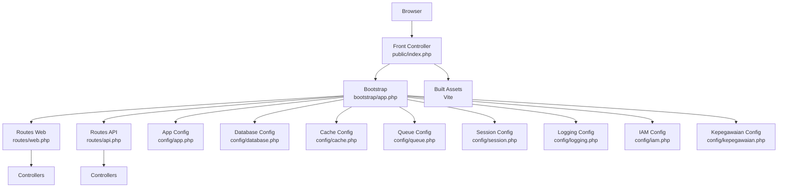
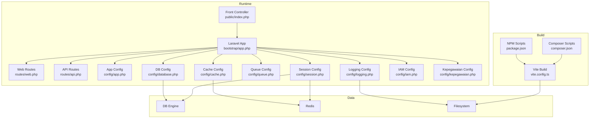
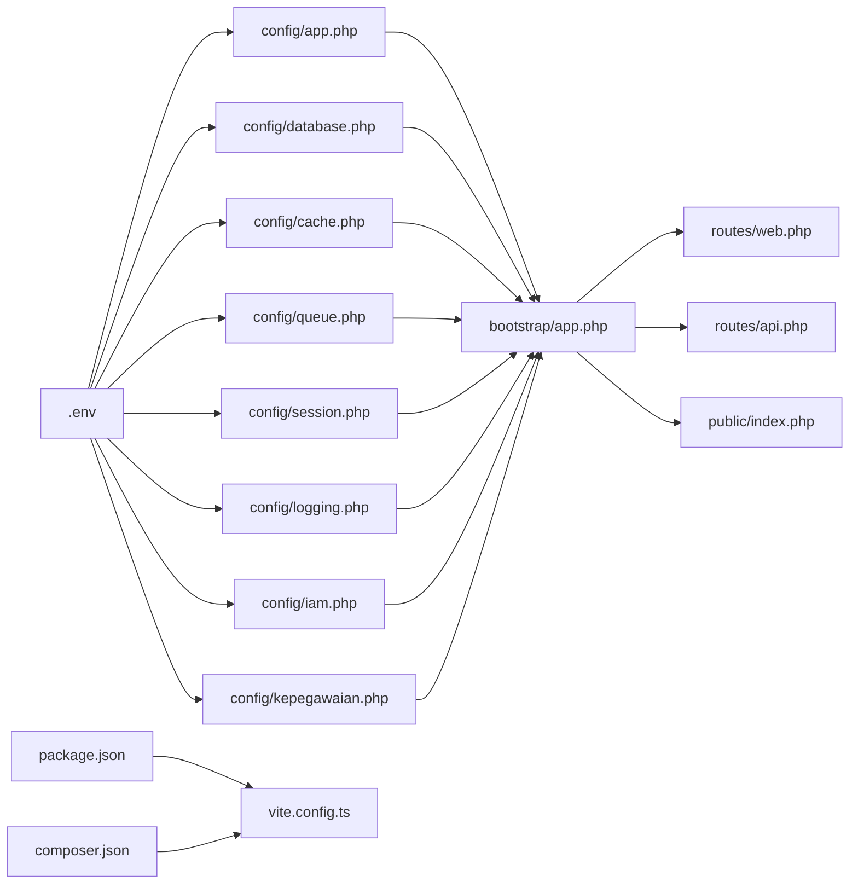

# Deployment and Configuration

<cite>
**Referenced Files in This Document**
- [config/app.php](file://config/app.php)
- [config/database.php](file://config/database.php)
- [config/cache.php](file://config/cache.php)
- [config/queue.php](file://config/queue.php)
- [config/session.php](file://config/session.php)
- [config/logging.php](file://config/logging.php)
- [config/iam.php](file://config/iam.php)
- [config/kepegawaian.php](file://config/kepegawaian.php)
- [bootstrap/app.php](file://bootstrap/app.php)
- [routes/web.php](file://routes/web.php)
- [routes/api.php](file://routes/api.php)
- [public/index.php](file://public/index.php)
- [vite.config.ts](file://vite.config.ts)
- [package.json](file://package.json)
- [composer.json](file://composer.json)
</cite>

## Table of Contents
1. [Introduction](#introduction)
2. [Project Structure](#project-structure)
3. [Core Components](#core-components)
4. [Architecture Overview](#architecture-overview)
5. [Detailed Component Analysis](#detailed-component-analysis)
6. [Dependency Analysis](#dependency-analysis)
7. [Performance Considerations](#performance-considerations)
8. [Troubleshooting Guide](#troubleshooting-guide)
9. [Conclusion](#conclusion)
10. [Appendices](#appendices)

## Introduction
This document provides comprehensive deployment and configuration guidance for the Kepegawaian Apps system. It explains environment configuration, database setup, asset compilation, production environment variables, cache and queue processing, build pipeline, monitoring, performance tuning, scaling, backups, and disaster recovery. The content is grounded in the repository’s configuration and build scripts to ensure accuracy and operational alignment with the codebase.

## Project Structure
Kepegawaian Apps is a Laravel-based application with an Inertia.js frontend. The runtime entrypoint is the front controller, routing through Laravel to controllers and React pages. Build assets are managed via Vite with React and TailwindCSS plugins. Configuration is environment-driven across application, database, cache, queue, session, logging, IAM, and kepegawaian modules.

**Diagram sources**
- [public/index.php:1-21](file://public/index.php#L1-L21)
- [bootstrap/app.php:11-35](file://bootstrap/app.php#L11-L35)
- [routes/web.php:1-139](file://routes/web.php#L1-L139)
- [routes/api.php:1-48](file://routes/api.php#L1-L48)
- [config/app.php:1-127](file://config/app.php#L1-L127)
- [config/database.php:1-185](file://config/database.php#L1-L185)
- [config/cache.php:1-118](file://config/cache.php#L1-L118)
- [config/queue.php:1-130](file://config/queue.php#L1-L130)
- [config/session.php:1-218](file://config/session.php#L1-L218)
- [config/logging.php:1-133](file://config/logging.php#L1-L133)
- [config/iam.php:1-9](file://config/iam.php#L1-L9)
- [config/kepegawaian.php:1-17](file://config/kepegawaian.php#L1-L17)

**Section sources**
- [public/index.php:1-21](file://public/index.php#L1-L21)
- [bootstrap/app.php:11-35](file://bootstrap/app.php#L11-L35)
- [routes/web.php:1-139](file://routes/web.php#L1-L139)
- [routes/api.php:1-48](file://routes/api.php#L1-L48)
- [config/app.php:1-127](file://config/app.php#L1-L127)
- [config/database.php:1-185](file://config/database.php#L1-L185)
- [config/cache.php:1-118](file://config/cache.php#L1-L118)
- [config/queue.php:1-130](file://config/queue.php#L1-L130)
- [config/session.php:1-218](file://config/session.php#L1-L218)
- [config/logging.php:1-133](file://config/logging.php#L1-L133)
- [config/iam.php:1-9](file://config/iam.php#L1-L9)
- [config/kepegawaian.php:1-17](file://config/kepegawaian.php#L1-L17)

## Core Components
- Environment configuration: application name, environment, debug, URL, timezone, locale, encryption key, maintenance mode driver/store.
- Database connections: sqlite, mysql, mariadb, pgsql, sqlsrv; Redis client and options; migration repository table.
- Cache stores: array, database, file, memcached, redis, dynamodb, octane, failover; key prefix.
- Queue backends: sync, database, beanstalkd, sqs, redis; job batching; failed jobs driver.
- Session driver and cookie policy: file, cookie, database, memcached, redis, dynamodb; lifetime, encrypt, store, cookie name/path/domain/secure/httpOnly/same_site/partitioned.
- Logging channels: stack, single, daily, slack, syslog, stderr, papertrail, emergency; deprecation channel.
- IAM module: token TTL, SSO code TTL, app slug.
- Kepegawaian module: HMAC secret for attendance integration.
- Build pipeline: Composer scripts for setup/dev/dev:ssr/test; Vite configuration for React/Tailwind/Wayfinder.

**Section sources**
- [config/app.php:1-127](file://config/app.php#L1-L127)
- [config/database.php:1-185](file://config/database.php#L1-L185)
- [config/cache.php:1-118](file://config/cache.php#L1-L118)
- [config/queue.php:1-130](file://config/queue.php#L1-L130)
- [config/session.php:1-218](file://config/session.php#L1-L218)
- [config/logging.php:1-133](file://config/logging.php#L1-L133)
- [config/iam.php:1-9](file://config/iam.php#L1-L9)
- [config/kepegawaian.php:1-17](file://config/kepegawaian.php#L1-L17)
- [composer.json:43-98](file://composer.json#L43-L98)
- [vite.config.ts:1-28](file://vite.config.ts#L1-L28)

## Architecture Overview
The deployment architecture comprises:
- Web server serving the front controller and static assets.
- Laravel application handling routing, middleware, controllers, and model interactions.
- Database for persistent data and queues for asynchronous jobs.
- Optional Redis for caching and session storage.
- Asset pipeline built via Vite with React and TailwindCSS.

**Diagram sources**
- [public/index.php:1-21](file://public/index.php#L1-L21)
- [bootstrap/app.php:11-35](file://bootstrap/app.php#L11-L35)
- [routes/web.php:1-139](file://routes/web.php#L1-L139)
- [routes/api.php:1-48](file://routes/api.php#L1-L48)
- [config/app.php:1-127](file://config/app.php#L1-L127)
- [config/database.php:1-185](file://config/database.php#L1-L185)
- [config/cache.php:1-118](file://config/cache.php#L1-L118)
- [config/queue.php:1-130](file://config/queue.php#L1-L130)
- [config/session.php:1-218](file://config/session.php#L1-L218)
- [config/logging.php:1-133](file://config/logging.php#L1-L133)
- [config/iam.php:1-9](file://config/iam.php#L1-L9)
- [config/kepegawaian.php:1-17](file://config/kepegawaian.php#L1-L17)
- [vite.config.ts:1-28](file://vite.config.ts#L1-L28)
- [package.json:1-77](file://package.json#L1-L77)
- [composer.json:43-98](file://composer.json#L43-L98)

## Detailed Component Analysis

### Environment Configuration
- Application identity and behavior are controlled via environment variables loaded by configuration files.
- Critical variables include application name, environment, debug flag, URL, timezone, locale, encryption key, and maintenance mode driver/store.
- Ensure APP_KEY is generated and set in production; maintain APP_PREVIOUS_KEYS for seamless key rotation.

Practical deployment steps:
- Generate application key during setup.
- Set APP_ENV to production and APP_DEBUG to false.
- Configure APP_URL to the production hostname.
- Set APP_LOCALE and APP_FALLBACK_LOCALE per regional requirements.

**Section sources**
- [config/app.php:16-124](file://config/app.php#L16-L124)
- [composer.json:44-51](file://composer.json#L44-L51)

### Database Setup
- Supported drivers: sqlite, mysql, mariadb, pgsql, sqlsrv.
- SSL/TLS options for MySQL/MariaDB via PDO attributes.
- Redis client, cluster, prefix, persistence, and retry/backoff algorithms.
- Migration repository table and Redis cache/database keyspace separation.

Production guidance:
- Prefer mysql/mariadb or pgsql for production; configure DB_URL or individual host/port/credentials.
- Enable strict mode and appropriate charset/collation.
- For Redis, set REDIS_CLIENT, REDIS_CLUSTER, REDIS_PREFIX, and tune max_retries/backoff.
- Use dedicated databases for cache and default operations if applicable.

**Section sources**
- [config/database.php:20-184](file://config/database.php#L20-L184)

### Cache Configuration
- Default store is database; alternatives include array, file, memcached, redis, dynamodb, octane, failover.
- Key prefix derived from APP_NAME to avoid collisions across applications.
- Redis cache connection can be separated from default for isolation.

Operational tips:
- In clustered environments, use redis or database stores.
- For high-throughput scenarios, prefer redis with tuned retry/backoff.
- Use failover store to maintain resilience.

**Section sources**
- [config/cache.php:18-116](file://config/cache.php#L18-L116)

### Queue Processing
- Default connection is database; alternatives include sync, beanstalkd, sqs, redis.
- Job batching and failed jobs storage are configurable.
- Retry timing and after_commit behavior can be adjusted per driver.

Deployment checklist:
- Choose a persistent queue backend (redis recommended for production).
- Configure QUEUE_CONNECTION and driver-specific variables.
- Run queue workers in production; monitor failed_jobs table.
- Tune retry_after and block_for settings for the selected driver.

**Section sources**
- [config/queue.php:16-128](file://config/queue.php#L16-L128)

### Session Management
- Default driver is database; supports file, cookie, memcached, redis, dynamodb.
- Cookie policy includes name, path, domain, secure, httpOnly, sameSite, partitioned.
- Lifetime and encryption settings are environment-driven.

Security and scalability:
- Use database or redis-backed sessions for distributed deployments.
- Set SESSION_SECURE_COOKIE=true and appropriate sameSite policies behind HTTPS.
- Adjust SESSION_LIFETIME according to business requirements.

**Section sources**
- [config/session.php:21-216](file://config/session.php#L21-L216)

### Logging and Monitoring
- Default channel stack; single/daily rotation; slack, syslog, stderr, papertrail, emergency.
- Deprecations channel and tracing can be enabled.
- Centralized logging improves incident response and auditability.

Implementation notes:
- Configure LOG_CHANNEL=daily or LOG_CHANNEL=stack for production.
- Integrate Slack/Papertrail for alerts and long-term retention.
- Rotate logs by days and set appropriate log level.

**Section sources**
- [config/logging.php:21-130](file://config/logging.php#L21-L130)

### IAM and Kepegawaian Integration
- IAM token TTL and SSO code TTL are configurable.
- App slug for IAM scoping.
- Kepegawaian HMAC secret for verifying attendance-qr-system signatures.

Operational guidance:
- Align IAM_TOKEN_TTL_HOURS and IAM_SSO_CODE_TTL with security policies.
- Keep ATTENDANCE_HMAC_SECRET synchronized between systems.

**Section sources**
- [config/iam.php:4-8](file://config/iam.php#L4-L8)
- [config/kepegawaian.php:15](file://config/kepegawaian.php#L15)

### Build Pipeline and Asset Compilation
- Vite configuration integrates Laravel plugin, React compiler, TailwindCSS, and Wayfinder.
- NPM scripts for dev/build/build:ssr/lint/format/types checking.
- Composer scripts orchestrate installation, key generation, migrations, and builds.

Production build process:
- Install dependencies and generate APP_KEY.
- Run migrations and build assets for production.
- Serve compiled assets via web server or CDN.

**Section sources**
- [vite.config.ts:1-28](file://vite.config.ts#L1-L28)
- [package.json:5-14](file://package.json#L5-L14)
- [composer.json:43-51](file://composer.json#L43-L51)

### API Security and Routing
- API routes for attendance integration and IAM endpoints are protected by Sanctum, signature verification, and rate limiting.
- Throttling tiers are applied per endpoint sensitivity.

Security posture:
- Enforce HTTPS in production.
- Use Sanctum tokens for authenticated endpoints.
- Apply HMAC verification for attendance APIs.
- Configure rate limits aligned with traffic profiles.

**Section sources**
- [routes/api.php:19-48](file://routes/api.php#L19-L48)

### Front Controller and Bootstrap
- Front controller delegates to Laravel bootstrap and handles maintenance mode.
- Bootstrap registers routing, middleware aliases, and exception handling.

Operational note:
- Ensure maintenance.php is absent in production or properly managed during updates.

**Section sources**
- [public/index.php:8-21](file://public/index.php#L8-L21)
- [bootstrap/app.php:11-35](file://bootstrap/app.php#L11-L35)

## Dependency Analysis
The application depends on environment-driven configuration for database, cache, queue, session, logging, IAM, and kepegawaian modules. The build pipeline depends on Composer and NPM scripts, while runtime routing depends on Laravel’s router and middleware stack.

**Diagram sources**
- [config/app.php:1-127](file://config/app.php#L1-L127)
- [config/database.php:1-185](file://config/database.php#L1-L185)
- [config/cache.php:1-118](file://config/cache.php#L1-L118)
- [config/queue.php:1-130](file://config/queue.php#L1-L130)
- [config/session.php:1-218](file://config/session.php#L1-L218)
- [config/logging.php:1-133](file://config/logging.php#L1-L133)
- [config/iam.php:1-9](file://config/iam.php#L1-L9)
- [config/kepegawaian.php:1-17](file://config/kepegawaian.php#L1-L17)
- [bootstrap/app.php:11-35](file://bootstrap/app.php#L11-L35)
- [routes/web.php:1-139](file://routes/web.php#L1-L139)
- [routes/api.php:1-48](file://routes/api.php#L1-L48)
- [public/index.php:1-21](file://public/index.php#L1-L21)
- [package.json:1-77](file://package.json#L1-L77)
- [composer.json:43-98](file://composer.json#L43-L98)
- [vite.config.ts:1-28](file://vite.config.ts#L1-L28)

**Section sources**
- [config/app.php:1-127](file://config/app.php#L1-L127)
- [config/database.php:1-185](file://config/database.php#L1-L185)
- [config/cache.php:1-118](file://config/cache.php#L1-L118)
- [config/queue.php:1-130](file://config/queue.php#L1-L130)
- [config/session.php:1-218](file://config/session.php#L1-L218)
- [config/logging.php:1-133](file://config/logging.php#L1-L133)
- [config/iam.php:1-9](file://config/iam.php#L1-L9)
- [config/kepegawaian.php:1-17](file://config/kepegawaian.php#L1-L17)
- [bootstrap/app.php:11-35](file://bootstrap/app.php#L11-L35)
- [routes/web.php:1-139](file://routes/web.php#L1-L139)
- [routes/api.php:1-48](file://routes/api.php#L1-L48)
- [public/index.php:1-21](file://public/index.php#L1-L21)
- [package.json:1-77](file://package.json#L1-L77)
- [composer.json:43-98](file://composer.json#L43-L98)
- [vite.config.ts:1-28](file://vite.config.ts#L1-L28)

## Performance Considerations
- Database: enable strict mode, proper charset/collation, and connection pooling; use dedicated DB for cache if needed.
- Cache: prefer redis for low-latency caching; tune key prefix and retry/backoff; use failover store.
- Queue: choose redis for production; adjust retry_after and block_for; monitor failed_jobs.
- Sessions: use database or redis-backed sessions; set secure/httpOnly/sameSite appropriately.
- Logging: daily rotation and centralized sinks reduce local I/O and improve observability.
- Build: pre-build assets and serve via CDN; enable compression; minimize bundle size with tree-shaking and code splitting.

[No sources needed since this section provides general guidance]

## Troubleshooting Guide
Common issues and remedies:
- Application key missing: run setup script to generate APP_KEY.
- Database connectivity errors: verify DB_CONNECTION, DB_HOST, DB_PORT, DB_DATABASE, DB_USERNAME, DB_PASSWORD; check SSL/TLS settings for MySQL/MariaDB.
- Cache/store failures: switch to database or redis; confirm CACHE_STORE and prefixes; validate Redis connectivity.
- Queue worker problems: confirm QUEUE_CONNECTION and driver settings; inspect failed_jobs; scale workers horizontally.
- Session issues: ensure SESSION_DRIVER alignment; check cookie domain/path/secure flags; validate database table existence.
- Logging anomalies: set LOG_CHANNEL=daily; configure Slack/Papertrail; review log levels and retention.
- API throttling: adjust throttle middleware values for endpoints; verify rate limit quotas.
- Asset build failures: reinstall dependencies; rebuild assets; clear node_modules/.vite cache.

**Section sources**
- [composer.json:44-51](file://composer.json#L44-L51)
- [config/database.php:20-184](file://config/database.php#L20-L184)
- [config/cache.php:18-116](file://config/cache.php#L18-L116)
- [config/queue.php:16-128](file://config/queue.php#L16-L128)
- [config/session.php:21-216](file://config/session.php#L21-L216)
- [config/logging.php:21-130](file://config/logging.php#L21-L130)
- [routes/api.php:19-48](file://routes/api.php#L19-L48)
- [vite.config.ts:1-28](file://vite.config.ts#L1-L28)
- [package.json:5-14](file://package.json#L5-L14)

## Conclusion
Deploying Kepegawaian Apps requires careful environment configuration, robust database and cache/queue backends, secure session and logging policies, and a reliable build pipeline. Production readiness hinges on selecting appropriate drivers, tuning performance parameters, enforcing security measures, and establishing monitoring and alerting. The provided configuration files and scripts offer a solid foundation for repeatable, scalable deployments.

[No sources needed since this section summarizes without analyzing specific files]

## Appendices

### A. Production Environment Variables Checklist
- Application
  - APP_ENV=production
  - APP_DEBUG=false
  - APP_URL=https://your-domain
  - APP_KEY (generated)
  - APP_LOCALE=en
  - APP_FALLBACK_LOCALE=en
  - APP_MAINTENANCE_DRIVER=file or cache
  - APP_MAINTENANCE_STORE=database or cache
- Database
  - DB_CONNECTION=mysql or pgsql
  - DB_HOST, DB_PORT, DB_DATABASE, DB_USERNAME, DB_PASSWORD
  - DB_URL (alternative)
  - MYSQL_ATTR_SSL_CA (for TLS)
- Cache
  - CACHE_STORE=redis or database
  - CACHE_PREFIX (derived from APP_NAME)
- Queue
  - QUEUE_CONNECTION=redis or database
  - REDIS_* or DB_* queue settings
- Session
  - SESSION_DRIVER=database or redis
  - SESSION_LIFETIME=minutes
  - SESSION_SECURE_COOKIE=true
  - SESSION_SAME_SITE=lax or strict
- Logging
  - LOG_CHANNEL=daily or stack
  - LOG_LEVEL=info or warn
- IAM
  - IAM_TOKEN_TTL_HOURS=8
  - IAM_SSO_CODE_TTL=60
  - IAM_APP_SLUG=kepegawaian
- Kepegawaian
  - ATTENDANCE_HMAC_SECRET (shared with attendance-qr-system)

**Section sources**
- [config/app.php:16-124](file://config/app.php#L16-L124)
- [config/database.php:20-184](file://config/database.php#L20-L184)
- [config/cache.php:18-116](file://config/cache.php#L18-L116)
- [config/queue.php:16-128](file://config/queue.php#L16-L128)
- [config/session.php:21-216](file://config/session.php#L21-L216)
- [config/logging.php:21-130](file://config/logging.php#L21-L130)
- [config/iam.php:4-8](file://config/iam.php#L4-L8)
- [config/kepegawaian.php:15](file://config/kepegawaian.php#L15)

### B. Build and Release Workflow
- Local development
  - npm run dev
  - php artisan queue:listen
- Production build
  - npm run build
  - php artisan migrate --force
  - php artisan config:cache
  - php artisan route:cache
  - php artisan view:cache
- Asset optimization
  - Vite build with React/Tailwind/Wayfinder
  - Serve compiled assets via web server or CDN

**Section sources**
- [package.json:5-14](file://package.json#L5-L14)
- [composer.json:44-51](file://composer.json#L44-L51)
- [vite.config.ts:1-28](file://vite.config.ts#L1-L28)

### C. Scaling and High Availability
- Horizontal scaling
  - Stateless web servers; shared database and Redis.
  - Use load balancer; enable sticky sessions only if required.
- Database
  - Master-slave replication; read replicas for reporting.
- Cache/Queue
  - Redis cluster; multiple queue workers.
- Sessions
  - Redis-backed sessions for distributed state.
- Observability
  - Daily logs, Slack/Papertrail integration, metrics collection.

[No sources needed since this section provides general guidance]

### D. Backup and Disaster Recovery
- Database
  - Automated snapshots; offsite archival; point-in-time recovery.
- Application
  - Versioned artifact builds; immutable deployments.
- Secrets
  - Encrypted secrets vault; periodic rotation; audit logs.
- DR Plan
  - Multi-region deployment; failover DNS; RTO/RPO targets.

[No sources needed since this section provides general guidance]