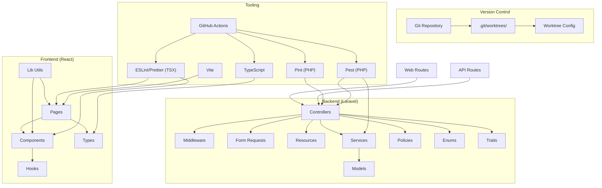
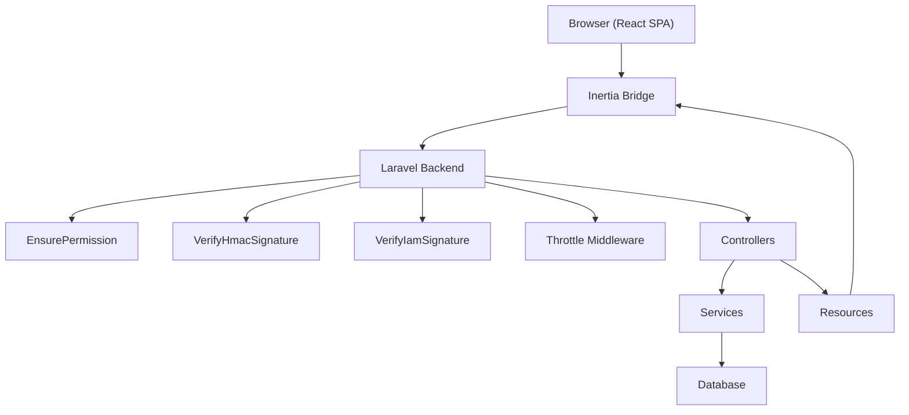
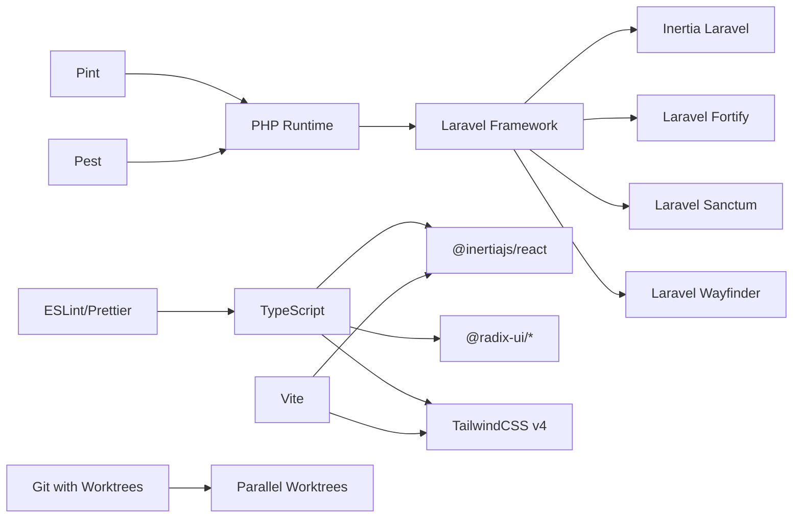

# Development Guidelines

<cite>
**Referenced Files in This Document**
- [composer.json](file://composer.json)
- [package.json](file://package.json)
- [pint.json](file://pint.json)
- [eslint.config.js](file://eslint.config.js)
- [tsconfig.json](file://tsconfig.json)
- [vite.config.ts](file://vite.config.ts)
- [.editorconfig](file://.editorconfig)
- [phpunit.xml](file://phpunit.xml)
- [routes/web.php](file://routes/web.php)
- [routes/api.php](file://routes/api.php)
- [.github/workflows/lint.yml](file://.github/workflows/lint.yml)
- [.github/workflows/tests.yml](file://.github/workflows/tests.yml)
- [config/app.php](file://config/app.php)
- [config/kepegawaian.php](file://config/kepegawaian.php)
- [config/iam.php](file://config/iam.php)
- [app/Http/Controllers/Controller.php](file://app/Http/Controllers/Controller.php)
- [app/Http/Middleware/EnsurePermission.php](file://app/Http/Middleware/EnsurePermission.php)
- [app/Http/Middleware/VerifyHmacSignature.php](file://app/Http/Middleware/VerifyHmacSignature.php)
- [app/Http/Middleware/VerifyIamSignature.php](file://app/Http/Middleware/VerifyIamSignature.php)
- [app/Http/Resources/PegawaiApiResource.php](file://app/Http/Resources/PegawaiApiResource.php)
- [app/Services/DashboardStatService.php](file://app/Services/DashboardStatService.php)
- [app/Concerns/PasswordValidationRules.php](file://app/Concerns/PasswordValidationRules.php)
- [app/Concerns/PegawaiValidationRules.php](file://app/Concerns/PegawaiValidationRules.php)
- [app/Concerns/ProfileValidationRules.php](file://app/Concerns/ProfileValidationRules.php)
- [app/Enums/Agama.php](file://app/Enums/Agama.php)
- [app/Enums/JenisKelamin.php](file://app/Enums/JenisKelamin.php)
- [resources/js/components/kepegawaian/crud-form-card.tsx](file://resources/js/components/kepegawaian/crud-form-card.tsx)
- [resources/js/components/kepegawaian/crud-layout.tsx](file://resources/js/components/kepegawaian/crud-layout.tsx)
- [resources/js/components/kepegawaian/crud-table.tsx](file://resources/js/components/kepegawaian/crud-table.tsx)
- [resources/js/components/kepegawaian/multi-step-form.tsx](file://resources/js/components/kepegawaian/multi-step-form.tsx)
- [resources/js/hooks/use-dashboard-stats.ts](file://resources/js/hooks/use-dashboard-stats.ts)
- [resources/js/lib/utils.ts](file://resources/js/lib/utils.ts)
- [resources/js/types/global.d.ts](file://resources/js/types/global.d.ts)
- [resources/js/types/kepegawaian.ts](file://resources/js/types/kepegawaian.ts)
- [resources/js/types/ui.ts](file://resources/js/types/ui.ts)
- [resources/js/pages/kepegawaian/pegawai/index.tsx](file://resources/js/pages/kepegawaian/pegawai/index.tsx)
- [resources/js/pages/kepegawaian/pegawai/create.tsx](file://resources/js/pages/kepegawaian/pegawai/create.tsx)
- [resources/js/pages/kepegawaian/pegawai/show.tsx](file://resources/js/pages/kepegawaian/pegawai/show.tsx)
- [resources/js/pages/kepegawaian/pegawai/edit.tsx](file://resources/js/pages/kepegawaian/pegawai/edit.tsx)
- [resources/js/pages/referensi/jenis-dokumen/index.tsx](file://resources/js/pages/referensi/jenis-dokumen/index.tsx)
- [resources/js/pages/referensi/jenis-dokumen/create.tsx](file://resources/js/pages/referensi/jenis-dokumen/create.tsx)
- [resources/js/pages/referensi/jenis-dokumen/edit.tsx](file://resources/js/pages/referensi/jenis-dokumen/edit.tsx)
- [resources/js/pages/dashboard.tsx](file://resources/js/pages/dashboard.tsx)
- [resources/js/app.tsx](file://resources/js/app.tsx)
- [resources/js/ssr.tsx](file://resources/js/ssr.tsx)
- [tests/Feature/Kepegawaian/PegawaiControllerTest.php](file://tests/Feature/Kepegawaian/PegawaiControllerTest.php)
- [tests/Feature/Api/PegawaiApiTest.php](file://tests/Feature/Api/PegawaiApiTest.php)
- [tests/Unit/Services/RiwayatJabatanServiceTest.php](file://tests/Unit/Services/RiwayatJabatanServiceTest.php)
- [tests/TestCase.php](file://tests/TestCase.php)
- [.gitignore](file://.gitignore)
- [.git/config](file://.git/config)
- [docs/plans/2026-03-16-relational-role-migration.md](file://docs/plans/2026-03-16-relational-role-migration.md)
</cite>

## Update Summary
**Changes Made**
- Updated Git workflow section to include Git worktrees configuration and modern parallel development practices
- Added comprehensive Git worktrees implementation guidelines for isolated development environments
- Enhanced development workflow documentation with practical Git worktrees usage examples
- Updated troubleshooting section with Git worktrees-specific guidance

## Table of Contents
1. [Introduction](#introduction)
2. [Project Structure](#project-structure)
3. [Core Components](#core-components)
4. [Architecture Overview](#architecture-overview)
5. [Detailed Component Analysis](#detailed-component-analysis)
6. [Dependency Analysis](#dependency-analysis)
7. [Performance Considerations](#performance-considerations)
8. [Troubleshooting Guide](#troubleshooting-guide)
9. [Conclusion](#conclusion)
10. [Appendices](#appendices)

## Introduction
This document defines development guidelines for the Kepegawaian Apps team. It consolidates coding standards, architectural patterns, and development workflow practices across Laravel (PHP) and React (TypeScript/TSX). It covers tooling (Pint, ESLint/Prettier, TypeScript, Vite), testing (Pest), CI/CD (GitHub Actions), middleware-driven security, service patterns, validation rules, and frontend component composition. The goal is to ensure consistent, maintainable, and secure development for both new and experienced contributors.

**Updated** Enhanced with Git worktrees configuration for improved version control practices and modern parallel development environments.

## Project Structure
The project follows a layered Laravel architecture with a React frontend powered by Vite. Key areas:
- Backend: Controllers, Requests, Resources, Services, Policies, Enums, Concerns, Middleware, and Models under app/.
- Frontend: React components, pages, hooks, types, and UI primitives under resources/js/.
- Routing: Web and API routes under routes/, with IAM and attendance integration.
- Testing: Pest-based unit and feature tests under tests/.
- Tooling: Composer scripts for setup, dev, lint, and test; NPM scripts for frontend lint/format/types; GitHub Actions for CI.
- Version Control: Git with worktrees support for isolated parallel development environments.



**Diagram sources**
- [routes/web.php:1-139](file://routes/web.php#L1-L139)
- [routes/api.php:1-48](file://routes/api.php#L1-L48)
- [composer.json:43-98](file://composer.json#L43-L98)
- [package.json:5-14](file://package.json#L5-L14)
- [.github/workflows/lint.yml:20-50](file://.github/workflows/lint.yml#L20-L50)
- [.github/workflows/tests.yml:17-57](file://.github/workflows/tests.yml#L17-L57)
- [.gitignore:29-30](file://.gitignore#L29-L30)

**Section sources**
- [routes/web.php:1-139](file://routes/web.php#L1-L139)
- [routes/api.php:1-48](file://routes/api.php#L1-L48)
- [composer.json:43-98](file://composer.json#L43-L98)
- [package.json:5-14](file://package.json#L5-L14)
- [.github/workflows/lint.yml:20-50](file://.github/workflows/lint.yml#L20-L50)
- [.github/workflows/tests.yml:17-57](file://.github/workflows/tests.yml#L17-L57)
- [.gitignore:29-30](file://.gitignore#L29-L30)

## Core Components
- Coding Standards
  - PHP: Pint with Laravel preset enforces consistent formatting.
  - TypeScript/TSX: ESLint with stylistic rules, import ordering, and Prettier compatibility; TypeScript strict mode enabled.
  - EditorConfig ensures uniform line endings, indentation, and whitespace trimming.
- Development Workflow
  - Composer scripts for setup, dev with concurrent processes, SSR, lint, and test.
  - NPM scripts for frontend build, dev, lint, format, and type checking.
  - GitHub Actions for automated linting and testing across PHP versions.
  - Git worktrees for isolated parallel development environments.
- Security and Validation
  - Middleware-driven controls: permission checks, HMAC verification, IAM signature verification, rate limiting.
  - Validation rules centralized in Concerns traits for consistent enforcement.
- Frontend Patterns
  - Component composition via shared CRUD components, layout wrappers, and UI primitives.
  - Hooks encapsulate reusable state/logic (e.g., dashboard stats).
  - Strongly typed pages and shared types for domain entities and UI.

**Updated** Added Git worktrees configuration for improved version control practices and parallel development environments.

**Section sources**
- [pint.json:1-4](file://pint.json#L1-L4)
- [eslint.config.js:27-132](file://eslint.config.js#L27-L132)
- [tsconfig.json:116-122](file://tsconfig.json#L116-L122)
- [.editorconfig:1-19](file://.editorconfig#L1-L19)
- [composer.json:43-98](file://composer.json#L43-L98)
- [package.json:5-14](file://package.json#L5-L14)
- [.github/workflows/lint.yml:20-50](file://.github/workflows/lint.yml#L20-L50)
- [.github/workflows/tests.yml:17-57](file://.github/workflows/tests.yml#L17-L57)
- [app/Http/Middleware/EnsurePermission.php](file://app/Http/Middleware/EnsurePermission.php)
- [app/Http/Middleware/VerifyHmacSignature.php](file://app/Http/Middleware/VerifyHmacSignature.php)
- [app/Http/Middleware/VerifyIamSignature.php](file://app/Http/Middleware/VerifyIamSignature.php)
- [app/Concerns/PasswordValidationRules.php](file://app/Concerns/PasswordValidationRules.php)
- [app/Concerns/PegawaiValidationRules.php](file://app/Concerns/PegawaiValidationRules.php)
- [app/Concerns/ProfileValidationRules.php](file://app/Concerns/ProfileValidationRules.php)
- [resources/js/components/kepegawaian/crud-form-card.tsx](file://resources/js/components/kepegawaian/crud-form-card.tsx)
- [resources/js/hooks/use-dashboard-stats.ts](file://resources/js/hooks/use-dashboard-stats.ts)
- [resources/js/types/global.d.ts](file://resources/js/types/global.d.ts)
- [resources/js/types/kepegawaian.ts](file://resources/js/types/kepegawaian.ts)
- [resources/js/types/ui.ts](file://resources/js/types/ui.ts)
- [.gitignore:29-30](file://.gitignore#L29-L30)

## Architecture Overview
The system uses Inertia.js to render React pages server-side while leveraging Laravel for routing, middleware, and backend services. API endpoints integrate with external systems using layered security (HTTPS, Sanctum, HMAC, throttling). IAM endpoints enforce signature verification and scoped permissions.



**Diagram sources**
- [routes/web.php:31-63](file://routes/web.php#L31-L63)
- [routes/api.php:21-47](file://routes/api.php#L21-L47)
- [app/Http/Middleware/EnsurePermission.php](file://app/Http/Middleware/EnsurePermission.php)
- [app/Http/Middleware/VerifyHmacSignature.php](file://app/Http/Middleware/VerifyHmacSignature.php)
- [app/Http/Middleware/VerifyIamSignature.php](file://app/Http/Middleware/VerifyIamSignature.php)
- [app/Http/Controllers/Controller.php](file://app/Http/Controllers/Controller.php)

**Section sources**
- [routes/web.php:1-139](file://routes/web.php#L1-L139)
- [routes/api.php:1-48](file://routes/api.php#L1-L48)
- [app/Http/Middleware/EnsurePermission.php](file://app/Http/Middleware/EnsurePermission.php)
- [app/Http/Middleware/VerifyHmacSignature.php](file://app/Http/Middleware/VerifyHmacSignature.php)
- [app/Http/Middleware/VerifyIamSignature.php](file://app/Http/Middleware/VerifyIamSignature.php)
- [app/Http/Controllers/Controller.php](file://app/Http/Controllers/Controller.php)

## Detailed Component Analysis

### PHP Coding Standards with Pint
- Preset: Laravel preset applied via Pint configuration.
- Scripts: Composer provides lint and lint:check targets to enforce formatting consistently across the backend.
- EditorConfig: Ensures consistent line endings, indentation, and trailing whitespace handling.

Best practices:
- Run formatting before committing: composer lint or npm run format for frontend.
- Keep Pint and ESLint rules aligned to avoid conflicts.

**Section sources**
- [pint.json:1-4](file://pint.json#L1-L4)
- [composer.json:61-66](file://composer.json#L61-L66)
- [.editorconfig:1-19](file://.editorconfig#L1-L19)

### TypeScript and Frontend Conventions
- ESLint configuration:
  - React flat recommended configs with JSX runtime.
  - Import ordering and consistent type imports.
  - Stylistic rules for padding around control statements and brace style.
  - Prettier compatibility rules disabled.
- TypeScript strict mode enabled with isolated modules and esModuleInterop.
- Vite plugin chain includes React compiler, TailwindCSS, and Wayfinder integration.

Frontend component patterns:
- CRUD components: form cards, tables, and multi-step forms enable consistent data entry and listing.
- Layouts: dedicated layouts for app, auth, and settings contexts.
- Hooks: encapsulate reusable logic (e.g., dashboard stats).
- Types: strongly typed domain entities and UI primitives.

**Section sources**
- [eslint.config.js:27-132](file://eslint.config.js#L27-L132)
- [tsconfig.json:116-122](file://tsconfig.json#L116-L122)
- [vite.config.ts:1-28](file://vite.config.ts#L1-L28)
- [resources/js/components/kepegawaian/crud-form-card.tsx](file://resources/js/components/kepegawaian/crud-form-card.tsx)
- [resources/js/components/kepegawaian/crud-table.tsx](file://resources/js/components/kepegawaian/crud-table.tsx)
- [resources/js/components/kepegawaian/multi-step-form.tsx](file://resources/js/components/kepegawaian/multi-step-form.tsx)
- [resources/js/hooks/use-dashboard-stats.ts](file://resources/js/hooks/use-dashboard-stats.ts)
- [resources/js/types/kepegawaian.ts](file://resources/js/types/kepegawaian.ts)
- [resources/js/types/ui.ts](file://resources/js/types/ui.ts)

### Validation Rules and Concerns
Validation logic is centralized in Concerns traits to ensure reuse and consistency across controllers and requests.

- PasswordValidationRules: encapsulates password policy rules.
- PegawaiValidationRules: centralizes rules for employee-related validations.
- ProfileValidationRules: handles profile update validations.

Recommendations:
- Prefer using these concerns in Form Requests to keep controllers thin.
- Extend or reuse validation rules when adding new endpoints.

**Section sources**
- [app/Concerns/PasswordValidationRules.php](file://app/Concerns/PasswordValidationRules.php)
- [app/Concerns/PegawaiValidationRules.php](file://app/Concerns/PegawaiValidationRules.php)
- [app/Concerns/ProfileValidationRules.php](file://app/Concerns/ProfileValidationRules.php)

### Middleware-Driven Security
Security is enforced through layered middleware:
- EnsurePermission: authorizes access based on IAM permissions.
- VerifyHmacSignature: validates HMAC-SHA256 signatures for attendance integration.
- VerifyIamSignature: validates IAM endpoint signatures.
- Throttle: rate-limiting for sensitive endpoints.

API route protections:
- Attendance integration endpoints use Sanctum, HMAC, and throttle middleware.
- IAM endpoints use signature verification and stricter throttling.

**Section sources**
- [routes/api.php:21-47](file://routes/api.php#L21-L47)
- [app/Http/Middleware/EnsurePermission.php](file://app/Http/Middleware/EnsurePermission.php)
- [app/Http/Middleware/VerifyHmacSignature.php](file://app/Http/Middleware/VerifyHmacSignature.php)
- [app/Http/Middleware/VerifyIamSignature.php](file://app/Http/Middleware/VerifyIamSignature.php)
- [config/kepegawaian.php:14-16](file://config/kepegawaian.php#L14-L16)
- [config/iam.php:4-8](file://config/iam.php#L4-L8)

### Service Layer and Domain Logic
Services encapsulate business logic and coordinate between controllers and models. Examples:
- DashboardStatService: computes statistics for dashboards.
- RiwayatJabatanService and RiwayatPangkatService: handle related domain computations.

Guidelines:
- Keep controllers thin; delegate business logic to services.
- Return Resource objects for consistent API responses.

**Section sources**
- [app/Services/DashboardStatService.php](file://app/Services/DashboardStatService.php)
- [app/Http/Resources/PegawaiApiResource.php](file://app/Http/Resources/PegawaiApiResource.php)
- [tests/Unit/Services/RiwayatJabatanServiceTest.php](file://tests/Unit/Services/RiwayatJabatanServiceTest.php)

### Frontend Page Composition and Routing
- Pages are organized by feature (kepegawaian, referensi, settings, self-service).
- CRUD pages leverage shared components (form-card, table, multi-step form).
- Routing uses Inertia resources with explicit names and parameters.

Patterns:
- Use CRUD components for listing and forms.
- Leverage typed props and shared UI types for consistency.

**Section sources**
- [resources/js/pages/kepegawaian/pegawai/index.tsx](file://resources/js/pages/kepegawaian/pegawai/index.tsx)
- [resources/js/pages/kepegawaian/pegawai/create.tsx](file://resources/js/pages/kepegawaian/pegawai/create.tsx)
- [resources/js/pages/kepegawaian/pegawai/show.tsx](file://resources/js/pages/kepegawaian/pegawai/show.tsx)
- [resources/js/pages/kepegawaian/pegawai/edit.tsx](file://resources/js/pages/kepegawaian/pegawai/edit.tsx)
- [resources/js/pages/referensi/jenis-dokumen/index.tsx](file://resources/js/pages/referensi/jenis-dokumen/index.tsx)
- [resources/js/pages/referensi/jenis-dokumen/create.tsx](file://resources/js/pages/referensi/jenis-dokumen/create.tsx)
- [resources/js/pages/referensi/jenis-dokumen/edit.tsx](file://resources/js/pages/referensi/jenis-dokumen/edit.tsx)
- [resources/js/components/kepegawaian/crud-form-card.tsx](file://resources/js/components/kepegawaian/crud-form-card.tsx)
- [resources/js/components/kepegawaian/crud-table.tsx](file://resources/js/components/kepegawaian/crud-table.tsx)
- [resources/js/components/kepegawaian/multi-step-form.tsx](file://resources/js/components/kepegawaian/multi-step-form.tsx)

### Git Worktrees Configuration and Parallel Development
**Updated** The project now supports Git worktrees for isolated parallel development environments.

#### Git Worktrees Setup
Git worktrees enable multiple development environments simultaneously:

1. **Directory Configuration**: The repository includes `.worktrees/` in `.gitignore` to prevent worktree directories from being tracked by the main repository.

2. **Worktree Creation**: Use the following command to create a new worktree for isolated development:
   ```bash
   git worktree add .worktrees/feature-name -b feature/feature-name
   ```

3. **Worktree Location Verification**: Verify worktree location and ignore safety:
   ```bash
   ls -d .worktrees 2>/dev/null || ls -d worktrees 2>/dev/null
   git check-ignore -q .worktrees || git check-ignore -q worktrees
   ```

4. **Isolated Development Benefits**:
   - Clean baseline verification with `git status --short`
   - Parallel feature development without affecting main branch
   - Isolated testing and debugging environments
   - Safe rollback capabilities per worktree

#### Modern Git Practices for Parallel Development
- **Branch Isolation**: Each feature gets its own worktree and branch
- **Clean Baseline**: Verify worktree cleanliness before starting work
- **Atomic Commits**: Use the atomic commit strategy for major changes
- **Cross-Environment Testing**: Test changes across multiple worktrees

**Section sources**
- [.gitignore:29-30](file://.gitignore#L29-L30)
- [docs/plans/2026-03-16-relational-role-migration.md:51-71](file://docs/plans/2026-03-16-relational-role-migration.md#L51-L71)
- [docs/plans/2026-03-16-relational-role-migration.md:13](file://docs/plans/2026-03-16-relational-role-migration.md#L13)

### Testing Practices with Pest
- PHPUnit configuration sets up SQLite in-memory database and disables telemetry services for fast CI runs.
- Pest is configured as the test framework with Laravel plugin.
- Tests are split into Unit and Feature suites, covering controllers, services, enums, and models.

Recommended practices:
- Write Feature tests for controller flows and API endpoints.
- Write Unit tests for services and pure logic.
- Use factories and seeders for deterministic test data.

**Section sources**
- [phpunit.xml:1-38](file://phpunit.xml#L1-L38)
- [composer.json:28-29](file://composer.json#L28-L29)
- [tests/Feature/Kepegawaian/PegawaiControllerTest.php](file://tests/Feature/Kepegawaian/PegawaiControllerTest.php)
- [tests/Feature/Api/PegawaiApiTest.php](file://tests/Feature/Api/PegawaiApiTest.php)
- [tests/TestCase.php](file://tests/TestCase.php)

### Contribution Workflow and CI/CD
- Local development: use composer dev for concurrent server, queue, logs, and Vite; or dev:ssr for SSR builds.
- Formatting and linting: composer lint and npm scripts for frontend.
- CI: lint workflow runs Pint and frontend formatting/lint; tests workflow runs Pest across PHP versions.
- Git worktrees: use for isolated parallel development environments.

Recommended process:
- Run composer test locally to ensure all checks pass.
- Use Git worktrees for major feature development.
- Open PRs against develop/main; ensure CI passes before merging.

**Section sources**
- [composer.json:52-60](file://composer.json#L52-L60)
- [composer.json:74-78](file://composer.json#L74-L78)
- [.github/workflows/lint.yml:20-50](file://.github/workflows/lint.yml#L20-L50)
- [.github/workflows/tests.yml:17-57](file://.github/workflows/tests.yml#L17-L57)
- [.gitignore:29-30](file://.gitignore#L29-L30)

## Dependency Analysis
- Backend dependencies: Inertia, Fortify, Sanctum, Wayfinder, and testing/quality tools.
- Frontend dependencies: React, Inertia React, Radix UI, TailwindCSS v4, TypeScript, Vite, Playwright for E2E.
- Tooling interop: Pint for PHP, ESLint/Prettier for TSX, TypeScript compiler, Vite bundler.
- Version control: Git with worktrees support for parallel development.



**Diagram sources**
- [composer.json:11-30](file://composer.json#L11-L30)
- [package.json:15-76](file://package.json#L15-L76)
- [vite.config.ts:1-28](file://vite.config.ts#L1-L28)
- [.gitignore:29-30](file://.gitignore#L29-L30)

**Section sources**
- [composer.json:11-30](file://composer.json#L11-L30)
- [package.json:15-76](file://package.json#L15-L76)
- [vite.config.ts:1-28](file://vite.config.ts#L1-L28)
- [.gitignore:29-30](file://.gitignore#L29-L30)

## Performance Considerations
- Use SSR build for initial page loads when appropriate (dev:ssr script).
- Prefer lightweight components and lazy loading for heavy pages.
- Centralize repeated logic in hooks and services to reduce duplication.
- Keep TypeScript strict mode enabled to catch potential performance pitfalls early.
- Use resource transformations to minimize payload sizes in API responses.
- Git worktrees enable parallel development without impacting main branch performance.

## Troubleshooting Guide
Common issues and resolutions:
- Formatting/Lint Failures
  - Run composer lint and npm run format:check to identify issues; fix according to Pint and ESLint rules.
- Test Failures
  - Use phpunit.xml configuration to ensure SQLite in-memory database and minimal environment settings.
  - Run ./vendor/bin/pest to execute tests locally.
- Middleware Access Denied
  - Ensure EnsurePermission and IAM signature verification pass; verify IAM token TTL and SSO code TTL settings.
- HMAC Validation Errors
  - Confirm ATTENDANCE_HMAC_SECRET matches the external system's secret.
- Git Worktrees Issues
  - **Worktree Directory Not Found**: Verify worktree location with `ls -d .worktrees 2>/dev/null`
  - **Ignore Safety**: Check if worktree directory is properly ignored with `git check-ignore -q .worktrees`
  - **Clean Baseline**: Ensure worktree has no pending changes with `git status --short`
  - **Worktree Creation**: Use proper syntax: `git worktree add .worktrees/feature-name -b feature/feature-name`

**Updated** Added Git worktrees troubleshooting section with specific commands and solutions.

**Section sources**
- [composer.json:61-66](file://composer.json#L61-L66)
- [package.json:9-13](file://package.json#L9-L13)
- [phpunit.xml:20-36](file://phpunit.xml#L20-L36)
- [config/iam.php:4-8](file://config/iam.php#L4-L8)
- [config/kepegawaian.php:14-16](file://config/kepegawaian.php#L14-L16)
- [docs/plans/2026-03-16-relational-role-migration.md:57-71](file://docs/plans/2026-03-16-relational-role-migration.md#L57-L71)

## Conclusion
These guidelines establish a consistent, secure, and maintainable development process for Kepegawaian Apps. By adhering to Pint and ESLint/Prettier standards, leveraging middleware-driven security, composing React components thoughtfully, following the testing and CI practices outlined here, and utilizing Git worktrees for parallel development environments, the team can deliver reliable features efficiently.

**Updated** Enhanced with Git worktrees configuration for improved version control practices and modern parallel development workflows.

## Appendices

### A. PHP Coding Standards Quick Reference
- Use Pint with Laravel preset.
- Keep line endings LF, indent with spaces (4), trim trailing whitespace.
- Run composer lint before committing.

**Section sources**
- [pint.json:1-4](file://pint.json#L1-L4)
- [.editorconfig:3-9](file://.editorconfig#L3-L9)
- [composer.json:61-66](file://composer.json#L61-L66)

### B. TypeScript/TSX Conventions Quick Reference
- Strict TypeScript mode enabled.
- ESLint rules for import order, consistent type imports, and stylistic padding.
- Prettier compatibility rules disabled; rely on ESLint for formatting.

**Section sources**
- [tsconfig.json:86-109](file://tsconfig.json#L86-L109)
- [eslint.config.js:64-95](file://eslint.config.js#L64-L95)
- [eslint.config.js:121-131](file://eslint.config.js#L121-L131)

### C. Frontend Component Patterns Quick Reference
- CRUD components: form-card, table, multi-step form.
- Layouts: app, auth, settings.
- Hooks: encapsulate reusable logic (e.g., dashboard stats).
- Types: domain entities and UI types.

**Section sources**
- [resources/js/components/kepegawaian/crud-form-card.tsx](file://resources/js/components/kepegawaian/crud-form-card.tsx)
- [resources/js/components/kepegawaian/crud-table.tsx](file://resources/js/components/kepegawaian/crud-table.tsx)
- [resources/js/components/kepegawaian/multi-step-form.tsx](file://resources/js/components/kepegawaian/multi-step-form.tsx)
- [resources/js/hooks/use-dashboard-stats.ts](file://resources/js/hooks/use-dashboard-stats.ts)
- [resources/js/types/kepegawaian.ts](file://resources/js/types/kepegawaian.ts)
- [resources/js/types/ui.ts](file://resources/js/types/ui.ts)

### D. Security and Validation Quick Reference
- Middleware: EnsurePermission, VerifyHmacSignature, VerifyIamSignature, Throttle.
- Validation rules: PasswordValidationRules, PegawaiValidationRules, ProfileValidationRules.
- API protections: Sanctum + HMAC + throttle for attendance; signature + throttle for IAM.

**Section sources**
- [app/Http/Middleware/EnsurePermission.php](file://app/Http/Middleware/EnsurePermission.php)
- [app/Http/Middleware/VerifyHmacSignature.php](file://app/Http/Middleware/VerifyHmacSignature.php)
- [app/Http/Middleware/VerifyIamSignature.php](file://app/Http/Middleware/VerifyIamSignature.php)
- [app/Concerns/PasswordValidationRules.php](file://app/Concerns/PasswordValidationRules.php)
- [app/Concerns/PegawaiValidationRules.php](file://app/Concerns/PegawaiValidationRules.php)
- [app/Concerns/ProfileValidationRules.php](file://app/Concerns/ProfileValidationRules.php)
- [routes/api.php:21-47](file://routes/api.php#L21-L47)

### E. Testing Quick Reference
- Suites: Unit and Feature.
- Environment: SQLite in-memory database, array stores for cache/session.
- Framework: Pest with Laravel plugin.

**Section sources**
- [phpunit.xml:7-19](file://phpunit.xml#L7-L19)
- [phpunit.xml:20-36](file://phpunit.xml#L20-L36)
- [composer.json:28-29](file://composer.json#L28-L29)

### F. CI/CD Quick Reference
- Lint workflow: PHP Pint, frontend format, frontend lint.
- Tests workflow: PHP 8.4/8.5, Node 22, Pest execution.

**Section sources**
- [.github/workflows/lint.yml:20-50](file://.github/workflows/lint.yml#L20-L50)
- [.github/workflows/tests.yml:17-57](file://.github/workflows/tests.yml#L17-L57)

### G. Git Worktrees Implementation Guide
**Updated** Comprehensive guide for implementing Git worktrees in the Kepegawaian Apps project.

#### Implementation Steps
1. **Verify Worktree Location**
   ```bash
   ls -d .worktrees 2>/dev/null || ls -d worktrees 2>/dev/null
   ```

2. **Check Ignore Safety**
   ```bash
   git check-ignore -q .worktrees || git check-ignore -q worktrees
   ```

3. **Create New Worktree**
   ```bash
   git worktree add .worktrees/relational-role-migration -b feature/relational-role-migration
   ```

4. **Verify Clean Baseline**
   ```bash
   git status --short
   ```

#### Best Practices
- Use descriptive worktree names that reflect the feature being developed
- Always verify clean baseline before starting work
- Use atomic commit strategy for major changes
- Keep worktrees synchronized with main branch regularly
- Remove worktrees when no longer needed: `git worktree remove .worktrees/name`

#### Troubleshooting
- **Worktree Already Exists**: Remove existing worktree before creating new one
- **Permission Denied**: Ensure proper file permissions for worktree directory
- **Sync Issues**: Regularly merge main branch into worktree branch

**Section sources**
- [docs/plans/2026-03-16-relational-role-migration.md:51-71](file://docs/plans/2026-03-16-relational-role-migration.md#L51-L71)
- [.gitignore:29-30](file://.gitignore#L29-L30)