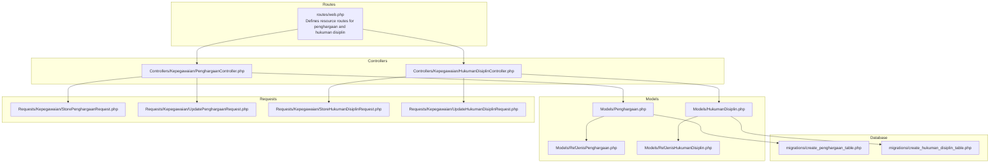
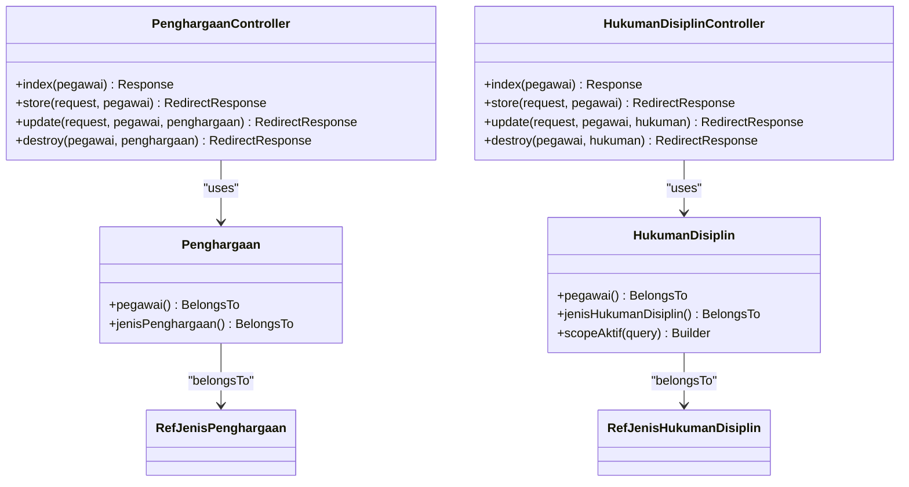
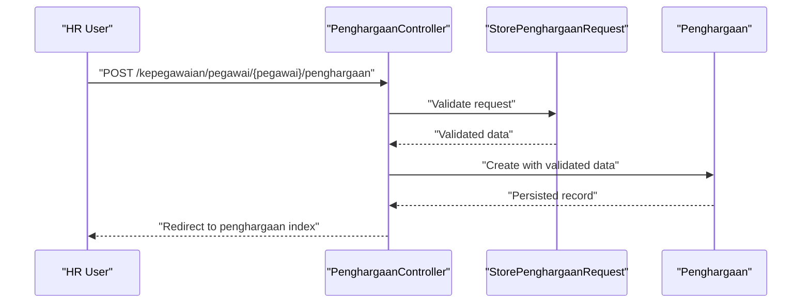
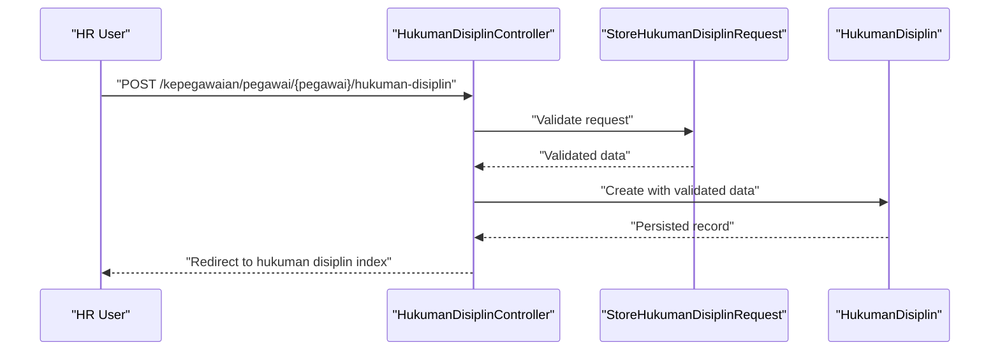
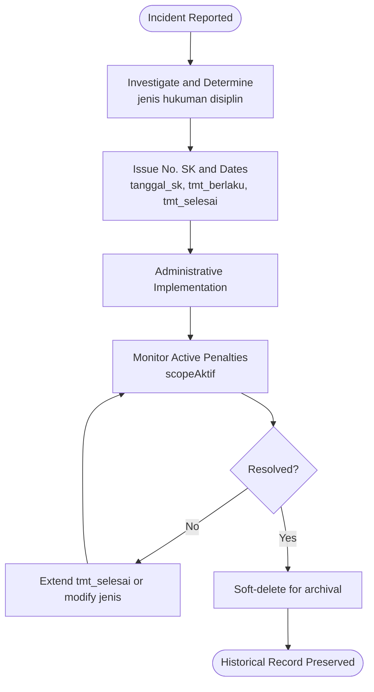
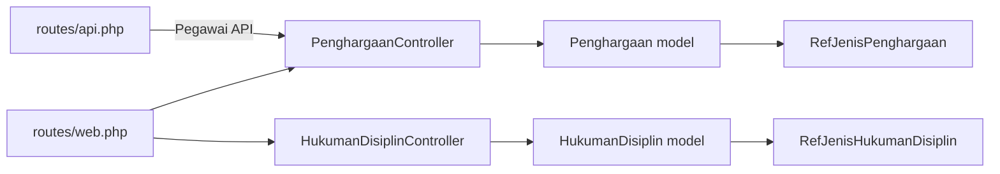
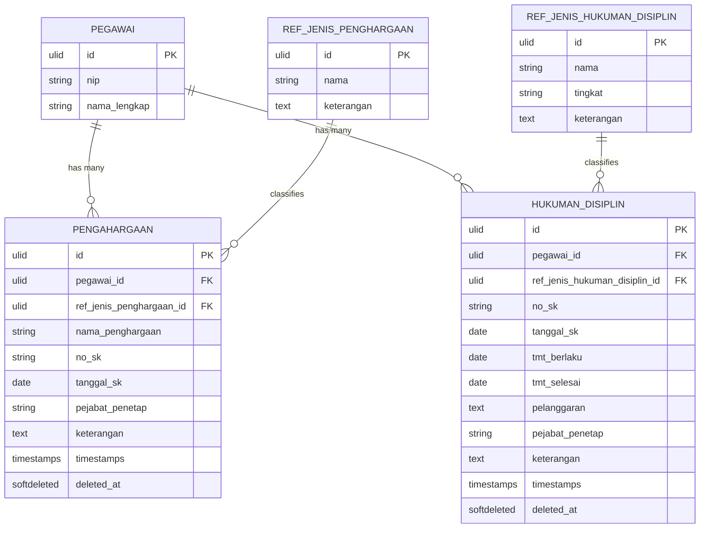

# Awards and Disciplinary Actions

<cite>
**Referenced Files in This Document**
- [PenghargaanController.php](file://app/Http/Controllers/Kepegawaian/PenghargaanController.php)
- [HukumanDisiplinController.php](file://app/Http/Controllers/Kepegawaian/HukumanDisiplinController.php)
- [Penghargaan.php](file://app/Models/Penghargaan.php)
- [HukumanDisiplin.php](file://app/Models/HukumanDisiplin.php)
- [RefJenisPenghargaan.php](file://app/Models/RefJenisPenghargaan.php)
- [RefJenisHukumanDisiplin.php](file://app/Models/RefJenisHukumanDisiplin.php)
- [StorePenghargaanRequest.php](file://app/Http/Requests/Kepegawaian/StorePenghargaanRequest.php)
- [UpdatePenghargaanRequest.php](file://app/Http/Requests/Kepegawaian/UpdatePenghargaanRequest.php)
- [StoreHukumanDisiplinRequest.php](file://app/Http/Requests/Kepegawaian/StoreHukumanDisiplinRequest.php)
- [UpdateHukumanDisiplinRequest.php](file://app/Http/Requests/Kepegawaian/UpdateHukumanDisiplinRequest.php)
- [create_penghargaan_table.php](file://database/migrations/2026_03_15_032747_create_penghargaan_table.php)
- [create_hukuman_disiplin_table.php](file://database/migrations/2026_03_15_032715_create_hukuman_disiplin_table.php)
- [web.php](file://routes/web.php)
- [api.php](file://routes/api.php)
</cite>

## Table of Contents
1. [Introduction](#introduction)
2. [Project Structure](#project-structure)
3. [Core Components](#core-components)
4. [Architecture Overview](#architecture-overview)
5. [Detailed Component Analysis](#detailed-component-analysis)
6. [Dependency Analysis](#dependency-analysis)
7. [Performance Considerations](#performance-considerations)
8. [Troubleshooting Guide](#troubleshooting-guide)
9. [Conclusion](#conclusion)
10. [Appendices](#appendices)

## Introduction
This document explains the Awards and Disciplinary Actions management system designed to maintain records of employee achievements (penghargaan), commendations, and corrective measures (hukuman disiplin) throughout their career. It covers the conceptual purpose of preserving prestasi kerja (work performance) history, the implementation details for tracking award and punishment records, classification via jenis (type) references, issuing authority validation, and documentation requirements. It also provides practical examples for award nomination and disciplinary investigation workflows, and outlines the complete lifecycle from incident reporting to resolution and archival.

## Project Structure
The system is implemented as part of the Kepegawaian module with dedicated controllers, models, form requests, and database migrations. Routes expose CRUD endpoints for penghargaan and hukuman disiplin under the kepegawaian namespace. The UI integrates with Inertia for server-rendered pages and React components.

**Diagram sources**
- [web.php:84-88](file://routes/web.php#L84-L88)
- [PenghargaanController.php:16](file://app/Http/Controllers/Kepegawaian/PenghargaanController.php#L16)
- [HukumanDisiplinController.php:16](file://app/Http/Controllers/Kepegawaian/HukumanDisiplinController.php#L16)
- [Penghargaan.php:10](file://app/Models/Penghargaan.php#L10)
- [HukumanDisiplin.php:11](file://app/Models/HukumanDisiplin.php#L11)
- [RefJenisPenghargaan.php:10](file://app/Models/RefJenisPenghargaan.php#L10)
- [RefJenisHukumanDisiplin.php:10](file://app/Models/RefJenisHukumanDisiplin.php#L10)
- [StorePenghargaanRequest.php:7](file://app/Http/Requests/Kepegawaian/StorePenghargaanRequest.php#L7)
- [UpdatePenghargaanRequest.php:7](file://app/Http/Requests/Kepegawaian/UpdatePenghargaanRequest.php#L7)
- [StoreHukumanDisiplinRequest.php:7](file://app/Http/Requests/Kepegawaian/StoreHukumanDisiplinRequest.php#L7)
- [UpdateHukumanDisiplinRequest.php:7](file://app/Http/Requests/Kepegawaian/UpdateHukumanDisiplinRequest.php#L7)
- [create_penghargaan_table.php:14](file://database/migrations/2026_03_15_032747_create_penghargaan_table.php#L14)
- [create_hukuman_disiplin_table.php:14](file://database/migrations/2026_03_15_032715_create_hukuman_disiplin_table.php#L14)

**Section sources**
- [web.php:65-104](file://routes/web.php#L65-L104)

## Core Components
- PenghargaanController: Manages penghargaan CRUD for a pegawai, renders lists, validates permissions, and maps data for the UI.
- HukumanDisiplinController: Manages hukuman disiplin CRUD for a pegawai, renders lists, validates permissions, and maps data for the UI.
- Penghargaan model: Defines fillable attributes, date casting, soft deletes, and relationships to Pegawai and RefJenisPenghargaan.
- HukumanDisiplin model: Defines fillable attributes, date casting, soft deletes, relationships to Pegawai and RefJenisHukumanDisiplin, and an aktif scope for current penalties.
- RefJenisPenghargaan and RefJenisHukumanDisiplin: Reference tables for jenis classification with optional foreign keys in related records.
- Form requests: Validation rules and messages for penghargaan and hukuman disiplin creation and updates.

**Section sources**
- [PenghargaanController.php:16](file://app/Http/Controllers/Kepegawaian/PenghargaanController.php#L16)
- [HukumanDisiplinController.php:16](file://app/Http/Controllers/Kepegawaian/HukumanDisiplinController.php#L16)
- [Penghargaan.php:10-44](file://app/Models/Penghargaan.php#L10-L44)
- [HukumanDisiplin.php:11-58](file://app/Models/HukumanDisiplin.php#L11-L58)
- [RefJenisPenghargaan.php:10-29](file://app/Models/RefJenisPenghargaan.php#L10-L29)
- [RefJenisHukumanDisiplin.php:10-30](file://app/Models/RefJenisHukumanDisiplin.php#L10-L30)
- [StorePenghargaanRequest.php:7-39](file://app/Http/Requests/Kepegawaian/StorePenghargaanRequest.php#L7-L39)
- [UpdatePenghargaanRequest.php:7-39](file://app/Http/Requests/Kepegawaian/UpdatePenghargaanRequest.php#L7-L39)
- [StoreHukumanDisiplinRequest.php:7-45](file://app/Http/Requests/Kepegawaian/StoreHukumanDisiplinRequest.php#L7-L45)
- [UpdateHukumanDisiplinRequest.php:7-45](file://app/Http/Requests/Kepegawaian/UpdateHukumanDisiplinRequest.php#L7-L45)

## Architecture Overview
The system follows a layered MVC pattern with explicit separation of concerns:
- Routes define resource endpoints for penghargaan and hukuman disiplin.
- Controllers handle authorization, request validation, and orchestrate model operations.
- Models encapsulate persistence, relationships, and scopes.
- Form requests enforce validation rules and localized messages.
- Database migrations define schema and constraints.

**Diagram sources**
- [PenghargaanController.php:16-90](file://app/Http/Controllers/Kepegawaian/PenghargaanController.php#L16-L90)
- [HukumanDisiplinController.php:16-91](file://app/Http/Controllers/Kepegawaian/HukumanDisiplinController.php#L16-L91)
- [Penghargaan.php:10-44](file://app/Models/Penghargaan.php#L10-L44)
- [HukumanDisiplin.php:11-58](file://app/Models/HukumanDisiplin.php#L11-L58)
- [RefJenisPenghargaan.php:10-29](file://app/Models/RefJenisPenghargaan.php#L10-L29)
- [RefJenisHukumanDisiplin.php:10-30](file://app/Models/RefJenisHukumanDisiplin.php#L10-L30)

## Detailed Component Analysis

### Penghargaan Management (Award Tracking)
Purpose:
- Record and manage awards (penghargaan) tied to a pegawai’s career history.
- Support classification via ref_jenis_penghargaan_id and document issuance details.

Implementation highlights:
- Controller index fetches penghargaan ordered by tanggal_sk desc and nama_penghargaan asc, mapping URLs for update/delete.
- Store and update use validated requests; destroy enforces ownership.
- Model casts tanggal_sk to date and supports soft deletes; belongs to Pegawai and RefJenisPenghargaan.

**Diagram sources**
- [PenghargaanController.php:54-61](file://app/Http/Controllers/Kepegawaian/PenghargaanController.php#L54-L61)
- [StorePenghargaanRequest.php:7-39](file://app/Http/Requests/Kepegawaian/StorePenghargaanRequest.php#L7-L39)
- [Penghargaan.php:10-44](file://app/Models/Penghargaan.php#L10-L44)

Practical example: Award nomination process
- Step 1: Select jenis penghargaan from RefJenisPenghargaan options.
- Step 2: Enter nama_penghargaan, no_sk, tanggal_sk, pejabat_penetap, and keterangan.
- Step 3: Submit via controller store endpoint; validation ensures required fields and length constraints.
- Step 4: View in penghargaan index with chronological ordering.

Documentation requirements:
- Required: ref_jenis_penghargaan_id (optional in store, but recommended), nama_penghargaan, no_sk (optional), tanggal_sk (date), pejabat_penetap (optional), keterangan (optional).
- Optional: Soft-deletion support allows archival without permanent removal.

**Section sources**
- [PenghargaanController.php:18-52](file://app/Http/Controllers/Kepegawaian/PenghargaanController.php#L18-L52)
- [PenghargaanController.php:54-61](file://app/Http/Controllers/Kepegawaian/PenghargaanController.php#L54-L61)
- [Penghargaan.php:16-32](file://app/Models/Penghargaan.php#L16-L32)
- [create_penghargaan_table.php:14-25](file://database/migrations/2026_03_15_032747_create_penghargaan_table.php#L14-L25)
- [StorePenghargaanRequest.php:14-24](file://app/Http/Requests/Kepegawaian/StorePenghargaanRequest.php#L14-L24)

### Hukuman Disiplin Management (Disciplinary Actions)
Purpose:
- Track disciplinary actions (hukuman disiplin) with temporal validity (tmt_berlaku/tmt_selesai), classification, and detailed pelanggaran.
- Provide an aktif scope to filter currently effective penalties.

Implementation highlights:
- Controller index orders by tmt_berlaku desc and lists hukuman disiplin with update/delete URLs.
- Store and update enforce validation; destroy enforces ownership.
- Model defines date casts for tanggal_sk, tmt_berlaku, and tmt_selesai; includes scopeAktif to filter active penalties.

**Diagram sources**
- [HukumanDisiplinController.php:55-62](file://app/Http/Controllers/Kepegawaian/HukumanDisiplinController.php#L55-L62)
- [StoreHukumanDisiplinRequest.php:7-45](file://app/Http/Requests/Kepegawaian/StoreHukumanDisiplinRequest.php#L7-L45)
- [HukumanDisiplin.php:11-58](file://app/Models/HukumanDisiplin.php#L11-L58)

Practical example: Disciplinary investigation workflow
- Step 1: Select jenis hukuman disiplin from RefJenisHukumanDisiplin options.
- Step 2: Fill no_sk, tanggal_sk, tmt_berlaku, tmt_selesai (after or equal tmt_berlaku), pelanggaran (reason), pejabat_penetap, and keterangan.
- Step 3: Submit via controller store endpoint; validation ensures required fields and temporal consistency.
- Step 4: Review in hukuman disiplin index; use scopeAktif to filter currently effective penalties.

Documentation requirements:
- Required: ref_jenis_hukuman_disiplin_id (optional in store, but recommended), no_sk, tanggal_sk, tmt_berlaku, tmt_selesai (nullable), pelanggaran, pejabat_penetap (optional), keterangan (optional).
- Optional: Soft-deletion support for archival.

**Section sources**
- [HukumanDisiplinController.php:18-52](file://app/Http/Controllers/Kepegawaian/HukumanDisiplinController.php#L18-L52)
- [HukumanDisiplinController.php:55-62](file://app/Http/Controllers/Kepegawaian/HukumanDisiplinController.php#L55-L62)
- [HukumanDisiplin.php:17-37](file://app/Models/HukumanDisiplin.php#L17-L37)
- [create_hukuman_disiplin_table.php:14-27](file://database/migrations/2026_03_15_032715_create_hukuman_disiplin_table.php#L14-L27)
- [StoreHukumanDisiplinRequest.php:14-25](file://app/Http/Requests/Kepegawaian/StoreHukumanDisiplinRequest.php#L14-L25)

### Type Classification and Issuing Authority Validation
- Penghargaan and Hukuman Disiplin both support optional ref_jenis_* foreign keys to classify entries via RefJenisPenghargaan and RefJenisHukumanDisiplin.
- Issuing authority is captured in pejabat_penetap (optional) and validated through form requests.
- Controllers enforce authorization via policies and gates before performing updates or deletions.

**Section sources**
- [Penghargaan.php:39-42](file://app/Models/Penghargaan.php#L39-L42)
- [HukumanDisiplin.php:44-47](file://app/Models/HukumanDisiplin.php#L44-L47)
- [RefJenisPenghargaan.php:17-20](file://app/Models/RefJenisPenghargaan.php#L17-L20)
- [RefJenisHukumanDisiplin.php:17-21](file://app/Models/RefJenisHukumanDisiplin.php#L17-L21)
- [PenghargaanController.php:56-58](file://app/Http/Controllers/Kepegawaian/PenghargaanController.php#L56-L58)
- [HukumanDisiplinController.php:57-59](file://app/Http/Controllers/Kepegawaian/HukumanDisiplinController.php#L57-L59)

### Lifecycle: From Reporting to Resolution and Archival
Conceptual flow:
- Reporting: Capture incident details (e.g., pelanggaran) and supporting documents.
- Investigation: Gather facts, determine jenis hukuman disiplin, and decide tmt_berlaku/tmt_selesai.
- Decision: Issue no_sk with tanggal_sk and pejabat_penetap.
- Implementation: Apply administrative actions aligned with jenis hukuman disiplin.
- Monitoring: Use scopeAktif to track currently effective penalties.
- Resolution: Close case; set tmt_selesai appropriately.
- Archival: Soft-delete records for historical preservation.

[No sources needed since this diagram shows conceptual workflow, not actual code structure]

## Dependency Analysis
- Controllers depend on models and form requests for validation and persistence.
- Models depend on reference tables for jenis classification.
- Routes bind resource endpoints to controllers.
- API routes provide external integration points for employee data retrieval.

**Diagram sources**
- [web.php:84-88](file://routes/web.php#L84-L88)
- [PenghargaanController.php:16-90](file://app/Http/Controllers/Kepegawaian/PenghargaanController.php#L16-L90)
- [HukumanDisiplinController.php:16-91](file://app/Http/Controllers/Kepegawaian/HukumanDisiplinController.php#L16-L91)
- [Penghargaan.php:10-44](file://app/Models/Penghargaan.php#L10-L44)
- [HukumanDisiplin.php:11-58](file://app/Models/HukumanDisiplin.php#L11-L58)
- [RefJenisPenghargaan.php:10-29](file://app/Models/RefJenisPenghargaan.php#L10-L29)
- [RefJenisHukumanDisiplin.php:10-30](file://app/Models/RefJenisHukumanDisiplin.php#L10-L30)
- [api.php:22-31](file://routes/api.php#L22-L31)

**Section sources**
- [web.php:65-104](file://routes/web.php#L65-L104)
- [api.php:21-47](file://routes/api.php#L21-L47)

## Performance Considerations
- Index queries order penghargaan by tanggal_sk desc and nama_penghargaan asc; ensure appropriate indexing on tanggal_sk and nama_penghargaan for optimal sorting.
- Hukuman disiplin index orders by tmt_berlaku desc; consider indexing tmt_berlaku for efficient retrieval.
- The aktif scope filters by tmt_selesai null or future dates; ensure indexes on tmt_selesai for fast evaluation.
- Soft deletes are enabled; archive frequently accessed historical records to keep active tables lean.

[No sources needed since this section provides general guidance]

## Troubleshooting Guide
Common validation errors and remedies:
- Penghargaan
  - Invalid jenis penghargaan selection: Ensure ref_jenis_penghargaan_id exists in ref_jenis_penghargaan.
  - Missing nama_penghargaan: Provide a non-empty string with max 255 characters.
  - Invalid tanggal_sk: Provide a valid date format.
- Hukuman Disiplin
  - Missing no_sk, tanggal_sk, tmt_berlaku, pelanggaran: Provide required fields.
  - Invalid tmt_selesai: Ensure tmt_selesai is a valid date and after or equal tmt_berlaku.
  - Invalid jenis hukuman disiplin selection: Ensure ref_jenis_hukuman_disiplin_id exists in ref_jenis_hukuman_disiplin.

Ownership enforcement:
- Both controllers verify that the penghargaan/hukuman disiplin belongs to the target pegawai before update or delete.

**Section sources**
- [StorePenghargaanRequest.php:14-24](file://app/Http/Requests/Kepegawaian/StorePenghargaanRequest.php#L14-L24)
- [UpdatePenghargaanRequest.php:14-24](file://app/Http/Requests/Kepegawaian/UpdatePenghargaanRequest.php#L14-L24)
- [StoreHukumanDisiplinRequest.php:14-25](file://app/Http/Requests/Kepegawaian/StoreHukumanDisiplinRequest.php#L14-L25)
- [UpdateHukumanDisiplinRequest.php:14-25](file://app/Http/Requests/Kepegawaian/UpdateHukumanDisiplinRequest.php#L14-L25)
- [PenghargaanController.php:85-88](file://app/Http/Controllers/Kepegawaian/PenghargaanController.php#L85-L88)
- [HukumanDisiplinController.php:86-89](file://app/Http/Controllers/Kepegawaian/HukumanDisiplinController.php#L86-L89)

## Conclusion
The Awards and Disciplinary Actions system provides a robust foundation for managing penghargaan and hukuman disiplin records. It emphasizes classification via jenis references, strict validation, temporal accuracy, and archival through soft deletes. The modular design enables clear separation of concerns, while the UI-friendly controller responses streamline HR workflows for both recognition and corrective measures.

## Appendices

### Data Model Overview

**Diagram sources**
- [create_penghargaan_table.php:14-25](file://database/migrations/2026_03_15_032747_create_penghargaan_table.php#L14-L25)
- [create_hukuman_disiplin_table.php:14-27](file://database/migrations/2026_03_15_032715_create_hukuman_disiplin_table.php#L14-L27)
- [RefJenisPenghargaan.php:17-20](file://app/Models/RefJenisPenghargaan.php#L17-L20)
- [RefJenisHukumanDisiplin.php:17-21](file://app/Models/RefJenisHukumanDisiplin.php#L17-L21)
- [Penghargaan.php:16-24](file://app/Models/Penghargaan.php#L16-L24)
- [HukumanDisiplin.php:17-27](file://app/Models/HukumanDisiplin.php#L17-L27)