# Career Progression Analytics

<cite>
**Referenced Files in This Document**
- [RiwayatJabatanService.php](file://app/Services/RiwayatJabatanService.php)
- [RiwayatPangkatService.php](file://app/Services/RiwayatPangkatService.php)
- [RiwayatJabatanController.php](file://app/Http/Controllers/Kepegawaian/RiwayatJabatanController.php)
- [RiwayatPangkatController.php](file://app/Http/Controllers/Kepegawaian/RiwayatPangkatController.php)
- [RiwayatJabatan.php](file://app/Models/RiwayatJabatan.php)
- [RiwayatPangkat.php](file://app/Models/RiwayatPangkat.php)
- [Pegawai.php](file://app/Models/Pegawai.php)
- [riwayat-jabatan.tsx](file://resources/js/pages/kepegawaian/pegawai/riwayat-jabatan.tsx)
- [riwayat-pangkat.tsx](file://resources/js/pages/kepegawaian/pegawai/riwayat-pangkat.tsx)
- [riwayat-jabatan-tab.tsx](file://resources/js/components/pegawai-tabs/riwayat-jabatan-tab.tsx)
- [riwayat-pangkat-tab.tsx](file://resources/js/components/pegawai-tabs/riwayat-pangkat-tab.tsx)
- [2026_03_15_030540_create_riwayat_jabatan_table.php](file://database/migrations/2026_03_15_030540_create_riwayat_jabatan_table.php)
- [2026_03_15_031012_create_riwayat_pangkat_table.php](file://database/migrations/2026_03_15_031012_create_riwayat_pangkat_table.php)
</cite>

## Table of Contents
1. [Introduction](#introduction)
2. [Project Structure](#project-structure)
3. [Core Components](#core-components)
4. [Architecture Overview](#architecture-overview)
5. [Detailed Component Analysis](#detailed-component-analysis)
6. [Dependency Analysis](#dependency-analysis)
7. [Performance Considerations](#performance-considerations)
8. [Troubleshooting Guide](#troubleshooting-guide)
9. [Conclusion](#conclusion)
10. [Appendices](#appendices)

## Introduction
This document describes the Career Progression Analytics system with a focus on tracking and visualizing employee career trajectories. It documents the analytical capabilities around RiwayatJabatanService and RiwayatPangkatService, including timeline analysis, progression pattern recognition, and eligibility calculations. It also explains how masa kerja (service years), promotion intervals, and career milestones are computed, and how historical records integrate with real-time analytics dashboards. Practical examples illustrate career timeline visualization, progression speed analysis, and comparative benchmarking. Guidance is provided for designing frontend components for interactive timelines, statistical trend analysis, and exportable career progression reports.

## Project Structure
The Career Progression Analytics spans backend services and models, controllers for persistence and presentation, and frontend pages/components for visualization and interaction. The backend encapsulates business logic for managing active career positions and ranks, while the frontend renders timelines and supports editing and analytics.

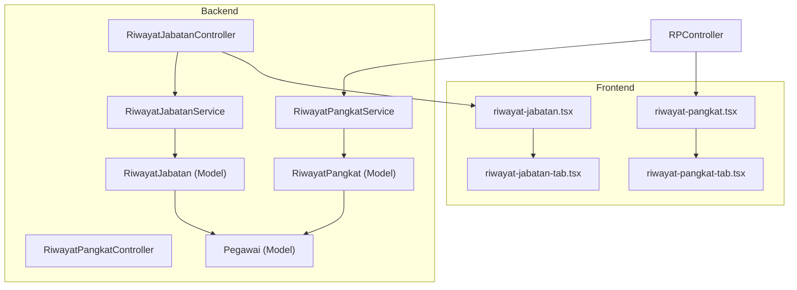

**Diagram sources**
- [RiwayatJabatanController.php:18-106](file://app/Http/Controllers/Kepegawaian/RiwayatJabatanController.php#L18-L106)
- [RiwayatPangkatController.php:17-118](file://app/Http/Controllers/Kepegawaian/RiwayatPangkatController.php#L17-L118)
- [RiwayatJabatanService.php:9-50](file://app/Services/RiwayatJabatanService.php#L9-L50)
- [RiwayatPangkatService.php:9-55](file://app/Services/RiwayatPangkatService.php#L9-L55)
- [RiwayatJabatan.php:11-59](file://app/Models/RiwayatJabatan.php#L11-L59)
- [RiwayatPangkat.php:11-59](file://app/Models/RiwayatPangkat.php#L11-L59)
- [Pegawai.php:24-209](file://app/Models/Pegawai.php#L24-L209)
- [riwayat-jabatan.tsx:102-506](file://resources/js/pages/kepegawaian/pegawai/riwayat-jabatan.tsx#L102-L506)
- [riwayat-pangkat.tsx:113-526](file://resources/js/pages/kepegawaian/pegawai/riwayat-pangkat.tsx#L113-L526)
- [riwayat-jabatan-tab.tsx:8-55](file://resources/js/components/pegawai-tabs/riwayat-jabatan-tab.tsx#L8-L55)
- [riwayat-pangkat-tab.tsx:8-58](file://resources/js/components/pegawai-tabs/riwayat-pangkat-tab.tsx#L8-L58)

**Section sources**
- [RiwayatJabatanController.php:18-106](file://app/Http/Controllers/Kepegawaian/RiwayatJabatanController.php#L18-L106)
- [RiwayatPangkatController.php:17-118](file://app/Http/Controllers/Kepegawaian/RiwayatPangkatController.php#L17-L118)
- [RiwayatJabatanService.php:9-50](file://app/Services/RiwayatJabatanService.php#L9-L50)
- [RiwayatPangkatService.php:9-55](file://app/Services/RiwayatPangkatService.php#L9-L55)
- [riwayat-jabatan.tsx:102-506](file://resources/js/pages/kepegawaian/pegawai/riwayat-jabatan.tsx#L102-L506)
- [riwayat-pangkat.tsx:113-526](file://resources/js/pages/kepegawaian/pegawai/riwayat-pangkat.tsx#L113-L526)

## Core Components
- RiwayatJabatanService: Manages creation and updates of position history entries and ensures only one active position per employee at a time.
- RiwayatPangkatService: Manages rank history entries, computes masa kerja fields, and ensures only one active rank per employee at a time.
- Controllers: Expose endpoints for viewing, creating, updating, and deleting career records; prepare data for frontend rendering.
- Models: Define schema, relationships, casting, and scopes for career records and employee aggregation.
- Frontend Pages/Components: Render interactive timelines, forms for editing, and summary cards for quick insights.

Key analytical capabilities:
- Timeline analysis: chronological ordering by effective date and record timestamps.
- Active status synchronization: automatic deactivation of previous records when a new active record is set.
- Eligibility indicators: derived from masa kerja and rank progression rules.

**Section sources**
- [RiwayatJabatanService.php:9-50](file://app/Services/RiwayatJabatanService.php#L9-L50)
- [RiwayatPangkatService.php:9-55](file://app/Services/RiwayatPangkatService.php#L9-L55)
- [RiwayatJabatanController.php:18-106](file://app/Http/Controllers/Kepegawaian/RiwayatJabatanController.php#L18-L106)
- [RiwayatPangkatController.php:17-118](file://app/Http/Controllers/Kepegawaian/RiwayatPangkatController.php#L17-L118)
- [RiwayatJabatan.php:11-59](file://app/Models/RiwayatJabatan.php#L11-L59)
- [RiwayatPangkat.php:11-59](file://app/Models/RiwayatPangkat.php#L11-L59)
- [riwayat-jabatan.tsx:102-506](file://resources/js/pages/kepegawaian/pegawai/riwayat-jabatan.tsx#L102-L506)
- [riwayat-pangkat.tsx:113-526](file://resources/js/pages/kepegawaian/pegawai/riwayat-pangkat.tsx#L113-L526)

## Architecture Overview
The system follows a layered architecture:
- Presentation Layer: Inertia-driven React pages and tab components render career timelines and forms.
- Application Layer: Controllers orchestrate requests, authorize actions, and delegate persistence to services.
- Domain Layer: Services encapsulate business rules for active record synchronization and masa kerja handling.
- Data Layer: Eloquent models define schema, relationships, and scopes; migrations enforce database structure.

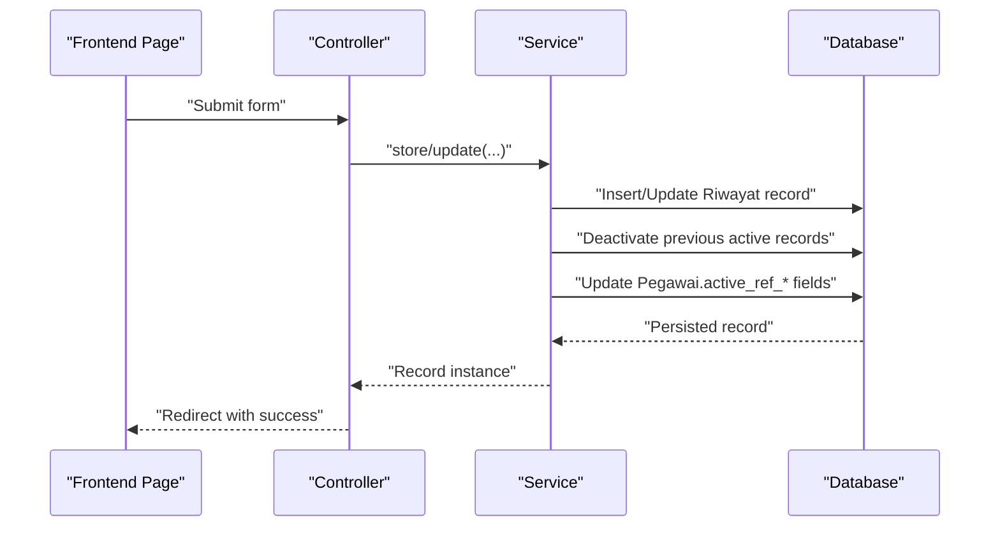

**Diagram sources**
- [RiwayatJabatanController.php:76-93](file://app/Http/Controllers/Kepegawaian/RiwayatJabatanController.php#L76-L93)
- [RiwayatPangkatController.php:87-105](file://app/Http/Controllers/Kepegawaian/RiwayatPangkatController.php#L87-L105)
- [RiwayatJabatanService.php:11-35](file://app/Services/RiwayatJabatanService.php#L11-L35)
- [RiwayatPangkatService.php:11-37](file://app/Services/RiwayatPangkatService.php#L11-L37)
- [RiwayatJabatan.php:17-27](file://app/Models/RiwayatJabatan.php#L17-L27)
- [RiwayatPangkat.php:17-29](file://app/Models/RiwayatPangkat.php#L17-L29)

## Detailed Component Analysis

### RiwayatJabatanService
Responsibilities:
- Persist new position history entries atomically.
- Synchronize active status so only one position is active per employee.
- Update the employee’s current position and unit metadata when an active record is saved.

Implementation highlights:
- Transactional persistence ensures data consistency during updates.
- Active record deactivation for the same employee except the current record.
- Employee-level field updates for current position and unit.

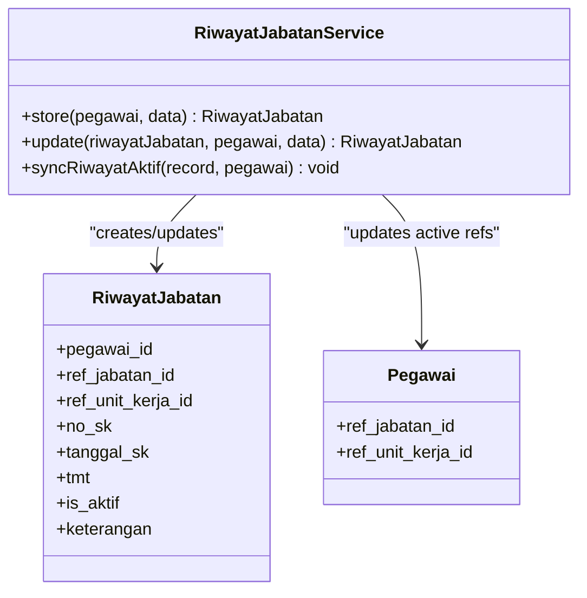

**Diagram sources**
- [RiwayatJabatanService.php:9-50](file://app/Services/RiwayatJabatanService.php#L9-L50)
- [RiwayatJabatan.php:11-59](file://app/Models/RiwayatJabatan.php#L11-L59)
- [Pegawai.php:24-209](file://app/Models/Pegawai.php#L24-L209)

**Section sources**
- [RiwayatJabatanService.php:9-50](file://app/Services/RiwayatJabatanService.php#L9-L50)
- [RiwayatJabatan.php:17-37](file://app/Models/RiwayatJabatan.php#L17-L37)
- [Pegawai.php:69-82](file://app/Models/Pegawai.php#L69-L82)

### RiwayatPangkatService
Responsibilities:
- Persist rank history entries with masa kerja fields and active status.
- Ensure only one active rank per employee at a time.
- Update the employee’s current rank metadata upon activation.

Implementation highlights:
- Explicit casting of active flag to boolean.
- Active rank deactivation for the same employee except the current record.
- Employee-level field updates for current rank.

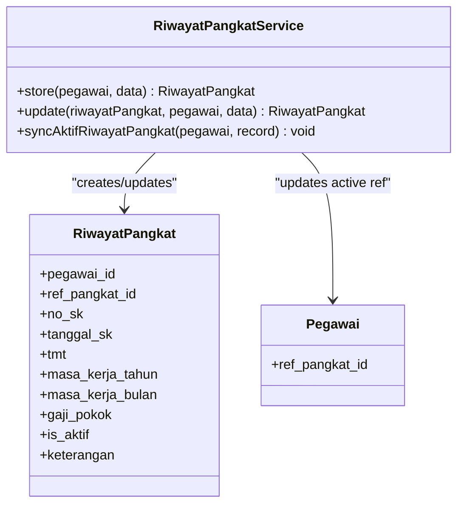

**Diagram sources**
- [RiwayatPangkatService.php:9-55](file://app/Services/RiwayatPangkatService.php#L9-L55)
- [RiwayatPangkat.php:11-59](file://app/Models/RiwayatPangkat.php#L11-L59)
- [Pegawai.php:69-72](file://app/Models/Pegawai.php#L69-L72)

**Section sources**
- [RiwayatPangkatService.php:9-55](file://app/Services/RiwayatPangkatService.php#L9-L55)
- [RiwayatPangkat.php:17-41](file://app/Models/RiwayatPangkat.php#L17-L41)
- [Pegawai.php:69-72](file://app/Models/Pegawai.php#L69-L72)

### Timeline Analysis and Ordering
Controllers order records by active status first, then by effective date (tmt), and finally by creation timestamp to ensure deterministic presentation. This supports:
- Chronological visualization of career events.
- Clear identification of current position/rank.
- Stable sorting across sessions.

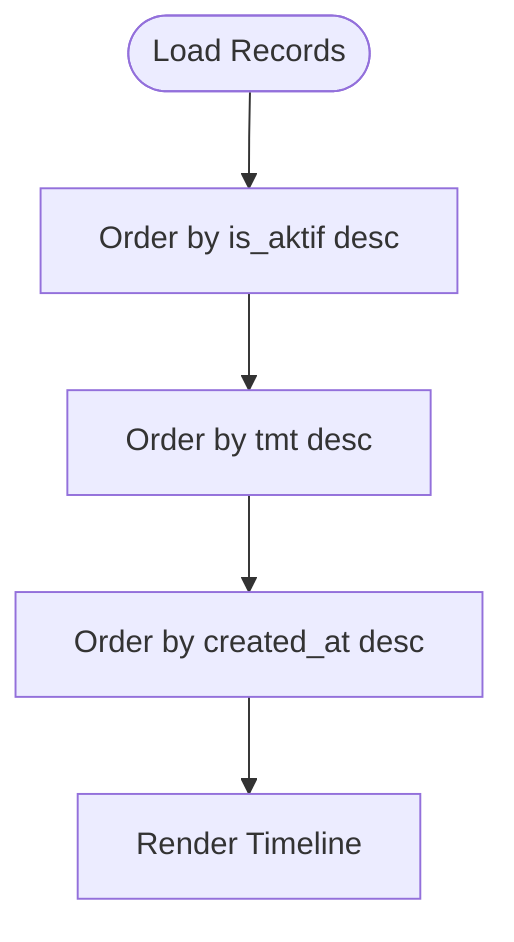

**Diagram sources**
- [RiwayatJabatanController.php:35-40](file://app/Http/Controllers/Kepegawaian/RiwayatJabatanController.php#L35-L40)
- [RiwayatPangkatController.php:40-45](file://app/Http/Controllers/Kepegawaian/RiwayatPangkatController.php#L40-L45)

**Section sources**
- [RiwayatJabatanController.php:35-40](file://app/Http/Controllers/Kepegawaian/RiwayatJabatanController.php#L35-L40)
- [RiwayatPangkatController.php:40-45](file://app/Http/Controllers/Kepegawaian/RiwayatPangkatController.php#L40-L45)

### Eligibility Calculations and Career Milestones
Eligibility indicators commonly derive from masa kerja and rank progression rules. The system stores masa_kerja_tahun and masa_kerja_bulan in the rank history, enabling:
- Minimum service duration checks for promotions.
- Milestone tracking aligned to rank progression schedules.
- Comparative analytics across employees.

Note: Promotion rules and milestone thresholds are not embedded in the provided code; they should be enforced by business logic external to the models/services, using the stored masa kerja fields.

**Section sources**
- [RiwayatPangkat.php:24-25](file://app/Models/RiwayatPangkat.php#L24-L25)
- [2026_03_15_031012_create_riwayat_pangkat_table.php:22-23](file://database/migrations/2026_03_15_031012_create_riwayat_pangkat_table.php#L22-L23)

### Practical Examples

#### Career Timeline Visualization
- Frontend pages render chronological lists of position and rank changes with status badges and metadata.
- The tab components present compact summaries suitable for employee detail views.

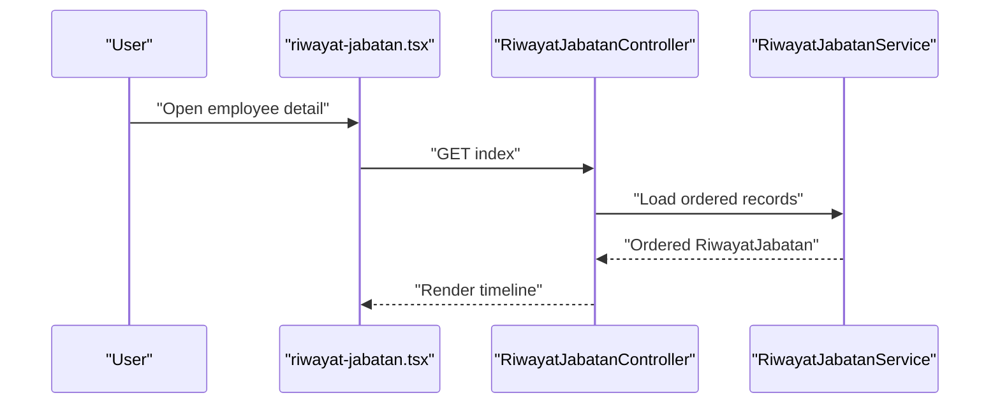

**Diagram sources**
- [riwayat-jabatan.tsx:102-506](file://resources/js/pages/kepegawaian/pegawai/riwayat-jabatan.tsx#L102-L506)
- [RiwayatJabatanController.php:20-74](file://app/Http/Controllers/Kepegawaian/RiwayatJabatanController.php#L20-L74)
- [RiwayatJabatanService.php:11-22](file://app/Services/RiwayatJabatanService.php#L11-L22)

**Section sources**
- [riwayat-jabatan.tsx:102-506](file://resources/js/pages/kepegawaian/pegawai/riwayat-jabatan.tsx#L102-L506)
- [riwayat-jabatan-tab.tsx:8-55](file://resources/js/components/pegawai-tabs/riwayat-jabatan-tab.tsx#L8-L55)

#### Progression Speed Analysis
- Compute time between consecutive promotions by subtracting tmt dates.
- Aggregate average intervals per employee or department for benchmarking.

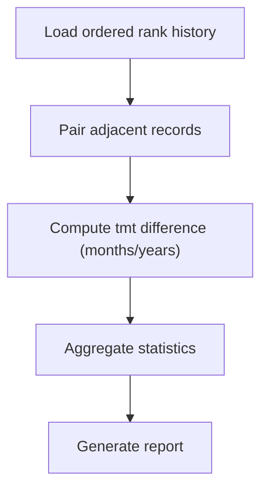

[No sources needed since this diagram shows conceptual workflow, not actual code structure]

#### Comparative Career Benchmarking
- Compare masa kerja at key milestones across employees.
- Normalize by rank progression schedules to assess relative advancement.

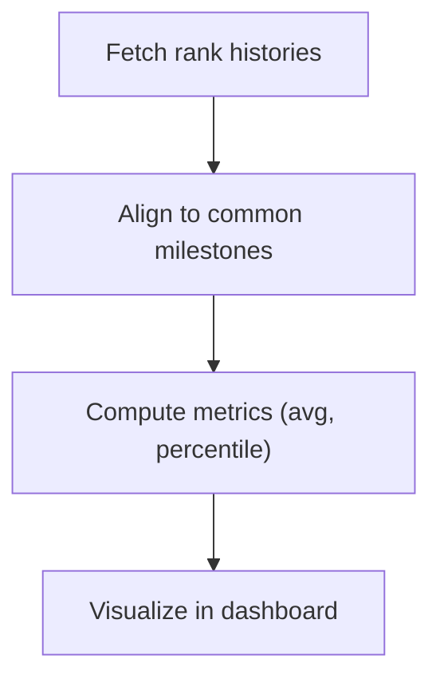

[No sources needed since this diagram shows conceptual workflow, not actual code structure]

### Succession Planning Support
- Identify candidates with required masa kerja and recent promotions.
- Track internal mobility by analyzing position transitions and unit transfers.

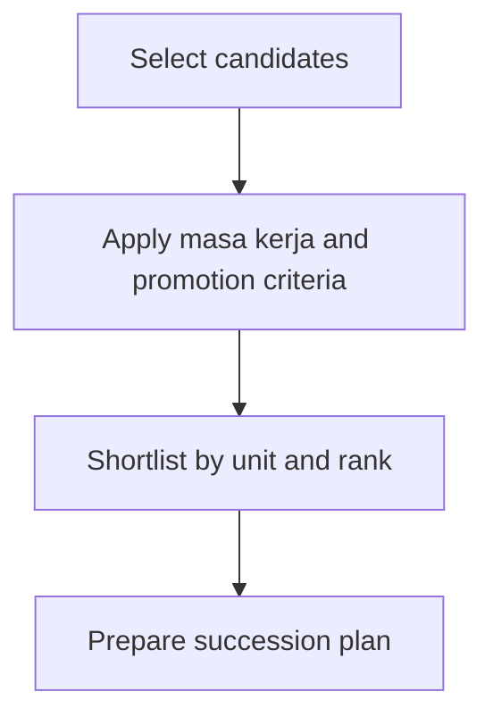

[No sources needed since this diagram shows conceptual workflow, not actual code structure]

## Dependency Analysis
The system exhibits clear separation of concerns:
- Controllers depend on services for business logic.
- Services depend on models for persistence and on the employee model for metadata updates.
- Frontend pages depend on controller-provided props and Inertia routing.

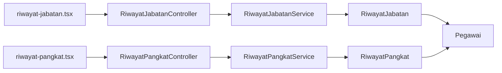

**Diagram sources**
- [RiwayatJabatanController.php:12-12](file://app/Http/Controllers/Kepegawaian/RiwayatJabatanController.php#L12-L12)
- [RiwayatPangkatController.php:11-11](file://app/Http/Controllers/Kepegawaian/RiwayatPangkatController.php#L11-L11)
- [RiwayatJabatanService.php:5-7](file://app/Services/RiwayatJabatanService.php#L5-L7)
- [RiwayatPangkatService.php:5-7](file://app/Services/RiwayatPangkatService.php#L5-L7)
- [RiwayatJabatan.php:39-52](file://app/Models/RiwayatJabatan.php#L39-L52)
- [RiwayatPangkat.php:44-52](file://app/Models/RiwayatPangkat.php#L44-L52)
- [Pegawai.php:99-117](file://app/Models/Pegawai.php#L99-L117)

**Section sources**
- [RiwayatJabatanController.php:12-12](file://app/Http/Controllers/Kepegawaian/RiwayatJabatanController.php#L12-L12)
- [RiwayatPangkatController.php:11-11](file://app/Http/Controllers/Kepegawaian/RiwayatPangkatController.php#L11-L11)
- [RiwayatJabatanService.php:5-7](file://app/Services/RiwayatJabatanService.php#L5-L7)
- [RiwayatPangkatService.php:5-7](file://app/Services/RiwayatPangkatService.php#L5-L7)
- [RiwayatJabatan.php:39-52](file://app/Models/RiwayatJabatan.php#L39-L52)
- [RiwayatPangkat.php:44-52](file://app/Models/RiwayatPangkat.php#L44-L52)
- [Pegawai.php:99-117](file://app/Models/Pegawai.php#L99-L117)

## Performance Considerations
- Indexing: Ensure foreign keys and frequently queried columns (pegawai_id, tmt, is_aktif) are indexed at the database level.
- Sorting: Controllers already apply deterministic ordering; avoid redundant client-side sorting.
- Transactions: Services wrap updates to prevent partial states; keep payloads minimal to reduce transaction duration.
- Frontend: Paginate long timelines and lazy-load additional details to improve responsiveness.

[No sources needed since this section provides general guidance]

## Troubleshooting Guide
Common scenarios:
- Early promotion tracking: Verify that the active flag is correctly toggled and that only one active record exists per employee.
- Career plateau detection: Monitor extended periods without masa kerja increases or promotions; use frontend filters to isolate plateaus.
- Succession planning: Cross-reference masa kerja thresholds with rank progression rules and position availability.

Operational tips:
- Confirm active record synchronization after updates.
- Validate date fields (tmt, tanggal_sk) to ensure correct chronological ordering.
- Use tab components for quick verification of summarized timelines.

**Section sources**
- [RiwayatJabatanService.php:37-48](file://app/Services/RiwayatJabatanService.php#L37-L48)
- [RiwayatPangkatService.php:39-53](file://app/Services/RiwayatPangkatService.php#L39-L53)
- [riwayat-jabatan-tab.tsx:8-55](file://resources/js/components/pegawai-tabs/riwayat-jabatan-tab.tsx#L8-L55)
- [riwayat-pangkat-tab.tsx:8-58](file://resources/js/components/pegawai-tabs/riwayat-pangkat-tab.tsx#L8-L58)

## Conclusion
The Career Progression Analytics system integrates robust backend services with intuitive frontend components to visualize and analyze employee career trajectories. RiwayatJabatanService and RiwayatPangkatService ensure accurate active record management and timely updates to employee metadata. Controllers and models provide deterministic ordering and rich casting for timeline analysis. Frontend pages and tab components deliver interactive experiences for editing, viewing, and deriving insights from career records. By leveraging masa kerja fields and structured timelines, organizations can track progression speed, detect plateaus, and support succession planning.

[No sources needed since this section summarizes without analyzing specific files]

## Appendices

### Data Model Overview
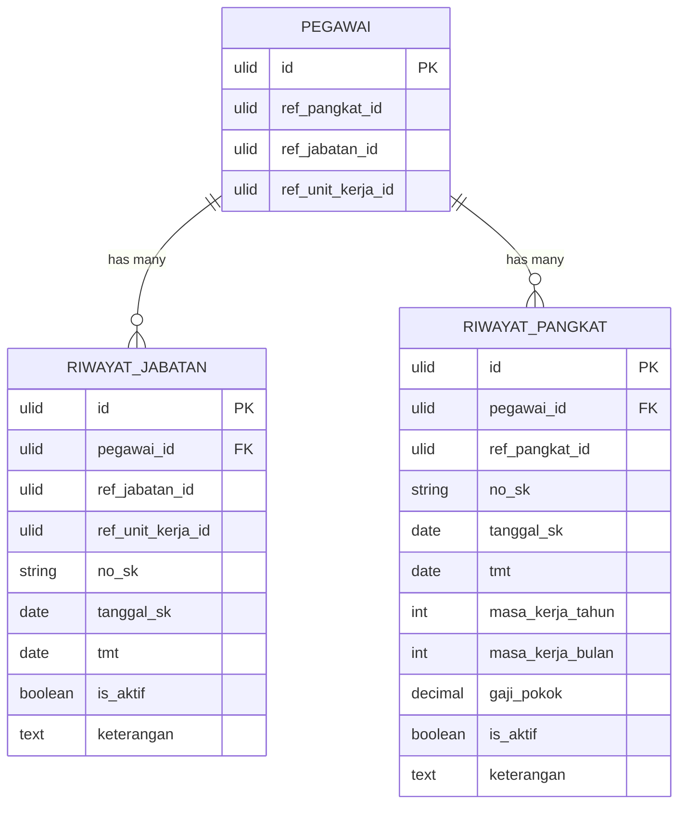

**Diagram sources**
- [Pegawai.php:28-39](file://app/Models/Pegawai.php#L28-L39)
- [RiwayatJabatan.php:15-27](file://app/Models/RiwayatJabatan.php#L15-L27)
- [RiwayatPangkat.php:15-29](file://app/Models/RiwayatPangkat.php#L15-L29)

### Frontend Component Design Guidance
- Interactive Timeline Display:
  - Use a vertical timeline component to render chronological events with status badges.
  - Allow drill-down to event details and edit actions.
- Statistical Trend Analysis:
  - Provide filters for unit, rank, and date ranges.
  - Visualize average promotion intervals and masa kerja distributions.
- Exportable Reports:
  - Offer CSV/Excel exports of timelines and computed metrics.
  - Include headers for audit trails and compliance.

[No sources needed since this section provides general guidance]