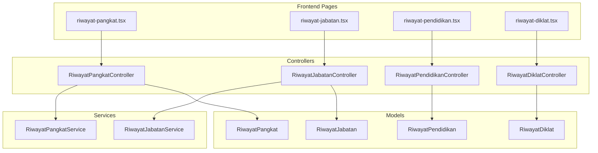
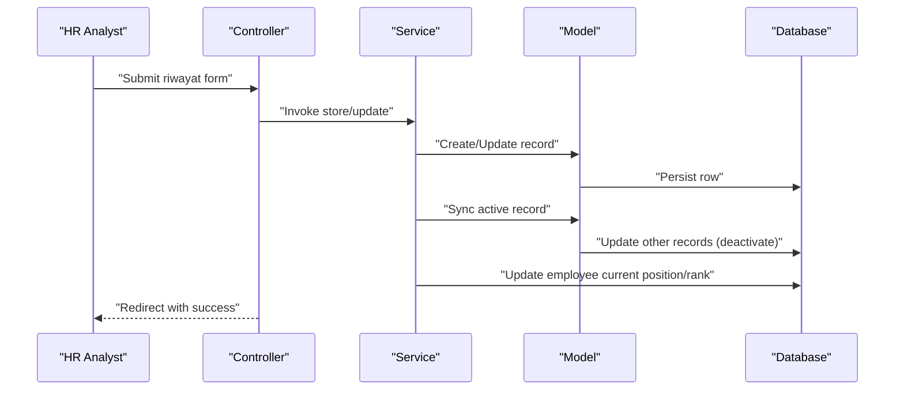
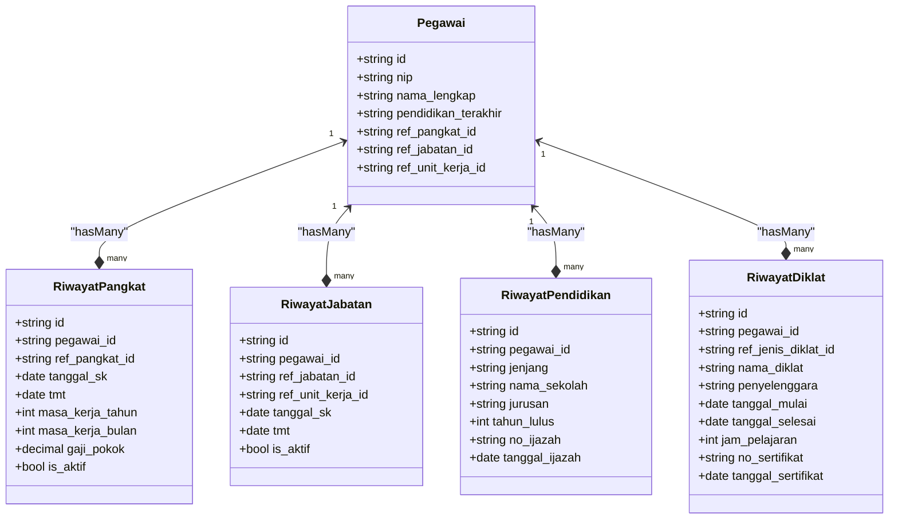
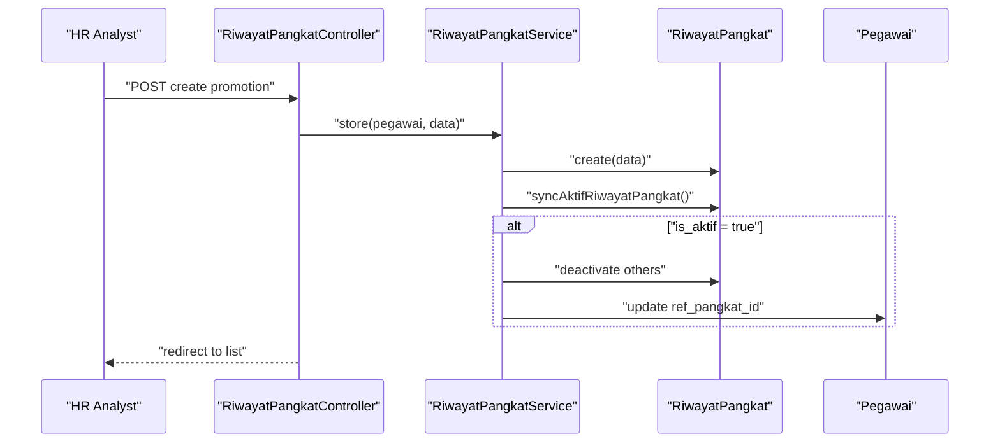
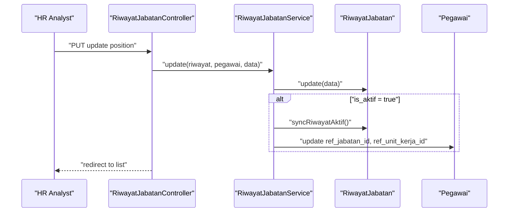
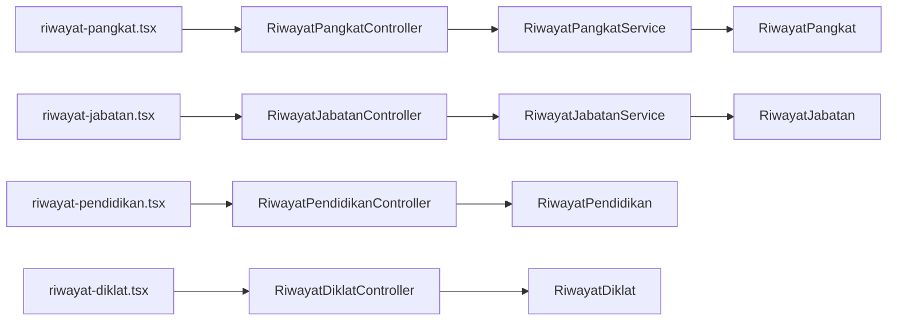

# Career Progression Tracking

<cite>
**Referenced Files in This Document**
- [RiwayatPangkatController.php](file://app/Http/Controllers/Kepegawaian/RiwayatPangkatController.php)
- [RiwayatJabatanController.php](file://app/Http/Controllers/Kepegawaian/RiwayatJabatanController.php)
- [RiwayatPendidikanController.php](file://app/Http/Controllers/Kepegawaian/RiwayatPendidikanController.php)
- [RiwayatDiklatController.php](file://app/Http/Controllers/Kepegawaian/RiwayatDiklatController.php)
- [RiwayatPangkat.php](file://app/Models/RiwayatPangkat.php)
- [RiwayatJabatan.php](file://app/Models/RiwayatJabatan.php)
- [RiwayatPendidikan.php](file://app/Models/RiwayatPendidikan.php)
- [RiwayatDiklat.php](file://app/Models/RiwayatDiklat.php)
- [RiwayatPangkatService.php](file://app/Services/RiwayatPangkatService.php)
- [RiwayatJabatanService.php](file://app/Services/RiwayatJabatanService.php)
- [riwayat-pangkat.tsx](file://resources/js/pages/kepegawaian/pegawai/riwayat-pangkat.tsx)
- [riwayat-jabatan.tsx](file://resources/js/pages/kepegawaian/pegawai/riwayat-jabatan.tsx)
- [riwayat-pendidikan.tsx](file://resources/js/pages/kepegawaian/pegawai/riwayat-pendidikan.tsx)
- [riwayat-diklat.tsx](file://resources/js/pages/kepegawaian/pegawai/riwayat-diklat.tsx)
- [2026_03_15_030540_create_riwayat_jabatan_table.php](file://database/migrations/2026_03_15_030540_create_riwayat_jabatan_table.php)
- [2026_03_15_030821_create_riwayat_pendidikan_table.php](file://database/migrations/2026_03_15_030821_create_riwayat_pendidikan_table.php)
- [2026_03_15_030915_create_riwayat_diklat_table.php](file://database/migrations/2026_03_15_030915_create_riwayat_diklat_table.php)
- [2026_03_15_031012_create_riwayat_pangkat_table.php](file://database/migrations/2026_03_15_031012_create_riwayat_pangkat_table.php)
- [JenjangPendidikan.php](file://app/Enums/JenjangPendidikan.php)
</cite>

## Table of Contents
1. [Introduction](#introduction)
2. [Project Structure](#project-structure)
3. [Core Components](#core-components)
4. [Architecture Overview](#architecture-overview)
5. [Detailed Component Analysis](#detailed-component-analysis)
6. [Dependency Analysis](#dependency-analysis)
7. [Performance Considerations](#performance-considerations)
8. [Troubleshooting Guide](#troubleshooting-guide)
9. [Conclusion](#conclusion)
10. [Appendices](#appendices)

## Introduction
This document explains the Career Progression Tracking system designed to maintain comprehensive employee advancement records. It covers the purpose of detailed career history, including rank promotions (pangkat), position changes (jabatan), education records, and professional training (diklat). The documentation provides conceptual overviews for HR analysts and technical details for developers implementing or extending career progression algorithms. Terminology follows the codebase, including masa kerja (service years), kenaikan pangkat (promotion), and riwayat profesional (professional history).

## Project Structure
The system is organized around four primary “riwayat” (history) types:
- Riwayat Pangkat (Rank Promotion History)
- Riwayat Jabatan (Position History)
- Riwayat Pendidikan (Education History)
- Riwayat Diklat (Professional Training History)

Each history type comprises:
- Backend controller handling requests and rendering Inertia views
- Eloquent model defining schema, casts, and relationships
- Service class managing business logic and synchronization of active records
- Frontend page component providing CRUD forms and lists

**Diagram sources**
- [RiwayatPangkatController.php:17-118](file://app/Http/Controllers/Kepegawaian/RiwayatPangkatController.php#L17-L118)
- [RiwayatJabatanController.php:18-106](file://app/Http/Controllers/Kepegawaian/RiwayatJabatanController.php#L18-L106)
- [RiwayatPendidikanController.php:16-93](file://app/Http/Controllers/Kepegawaian/RiwayatPendidikanController.php#L16-L93)
- [RiwayatDiklatController.php:16-92](file://app/Http/Controllers/Kepegawaian/RiwayatDiklatController.php#L16-L92)
- [RiwayatPangkatService.php:9-55](file://app/Services/RiwayatPangkatService.php#L9-L55)
- [RiwayatJabatanService.php:9-50](file://app/Services/RiwayatJabatanService.php#L9-L50)
- [RiwayatPangkat.php:11-59](file://app/Models/RiwayatPangkat.php#L11-L59)
- [RiwayatJabatan.php:11-59](file://app/Models/RiwayatJabatan.php#L11-L59)
- [RiwayatPendidikan.php:11-42](file://app/Models/RiwayatPendidikan.php#L11-L42)
- [RiwayatDiklat.php:10-51](file://app/Models/RiwayatDiklat.php#L10-L51)
- [riwayat-pangkat.tsx:113-526](file://resources/js/pages/kepegawaian/pegawai/riwayat-pangkat.tsx#L113-L526)
- [riwayat-jabatan.tsx:102-506](file://resources/js/pages/kepegawaian/pegawai/riwayat-jabatan.tsx#L102-L506)
- [riwayat-pendidikan.tsx:91-441](file://resources/js/pages/kepegawaian/pegawai/riwayat-pendidikan.tsx#L91-L441)
- [riwayat-diklat.tsx:103-498](file://resources/js/pages/kepegawaian/pegawai/riwayat-diklat.tsx#L103-L498)

**Section sources**
- [RiwayatPangkatController.php:17-118](file://app/Http/Controllers/Kepegawaian/RiwayatPangkatController.php#L17-L118)
- [RiwayatJabatanController.php:18-106](file://app/Http/Controllers/Kepegawaian/RiwayatJabatanController.php#L18-L106)
- [RiwayatPendidikanController.php:16-93](file://app/Http/Controllers/Kepegawaian/RiwayatPendidikanController.php#L16-L93)
- [RiwayatDiklatController.php:16-92](file://app/Http/Controllers/Kepegawaian/RiwayatDiklatController.php#L16-L92)

## Core Components
This section documents the four core “riwayat” components, focusing on data models, controller logic, and frontend form components.

### Riwayat Pangkat (Rank Promotion)
Purpose:
- Record rank promotions with masa kerja (service years), tmt (taking office date), gaji pokok (basic salary), and is_aktif (active flag).
- Synchronize active rank to the employee record upon saving/updating.

Key implementation details:
- Model fields include masa_kerja_tahun, masa_kerja_bulan, gaji_pokok, and is_aktif.
- Service enforces single active record per employee and updates the employee’s current rank.
- Controller renders a paginated, sortable list and exposes create/edit dialogs.
- Frontend form supports selecting ref_pangkat_id, dates, masa kerja breakdown, gaji pokok, and toggling is_aktif.

Practical example:
- After a promotion, the system marks the new RiwayatPangkat as active and deactivates previous entries for the same employee.

**Section sources**
- [RiwayatPangkat.php:11-59](file://app/Models/RiwayatPangkat.php#L11-L59)
- [RiwayatPangkatService.php:9-55](file://app/Services/RiwayatPangkatService.php#L9-L55)
- [RiwayatPangkatController.php:17-118](file://app/Http/Controllers/Kepegawaian/RiwayatPangkatController.php#L17-L118)
- [riwayat-pangkat.tsx:113-526](file://resources/js/pages/kepegawaian/pegawai/riwayat-pangkat.tsx#L113-L526)

### Riwayat Jabatan (Position)
Purpose:
- Track position changes with ref_jabatan_id and ref_unit_kerja_id, including tmt and is_aktif.
- Synchronize active position and unit to the employee record.

Key implementation details:
- Model fields include ref_jabatan_id, ref_unit_kerja_id, no_sk, tanggal_sk, tmt, and is_aktif.
- Service ensures only one active position/unit per employee and updates the employee’s current jabatan and unit_kerja.
- Controller provides a paginated list with sorting by is_aktif, tmt, and tanggal_sk.
- Frontend form includes selection of jabatan and unit kerja, mandatory SK dates, and optional pejabat_penetap.

Practical example:
- When a pegawai moves to a new unit or position, the system sets is_aktif=true for the new RiwayatJabatan and deactivates prior entries.

**Section sources**
- [RiwayatJabatan.php:11-59](file://app/Models/RiwayatJabatan.php#L11-L59)
- [RiwayatJabatanService.php:9-50](file://app/Services/RiwayatJabatanService.php#L9-L50)
- [RiwayatJabatanController.php:18-106](file://app/Http/Controllers/Kepegawaian/RiwayatJabatanController.php#L18-L106)
- [riwayat-jabatan.tsx:102-506](file://resources/js/pages/kepegawaian/pegawai/riwayat-jabatan.tsx#L102-L506)

### Riwayat Pendidikan (Education)
Purpose:
- Capture formal education with jenjang (level), institution, major, graduation year, and credentials.
- Uses an enum for standardized jenjang values.

Key implementation details:
- Model includes jenjang (enum), nama_sekolah, jurusan, tahun_lulus, no_ijazah, tanggal_ijazah, and keterangan.
- Controller orders by descending tahun_lulus, tanggal_ijazah, and created_at.
- Frontend form uses a select populated from JenjangPendidikan enum cases.

Practical example:
- Add successive education levels; latest entry informs the employee’s pendidikan_terakhir.

**Section sources**
- [RiwayatPendidikan.php:11-42](file://app/Models/RiwayatPendidikan.php#L11-L42)
- [JenjangPendidikan.php:5-34](file://app/Enums/JenjangPendidikan.php#L5-L34)
- [RiwayatPendidikanController.php:16-93](file://app/Http/Controllers/Kepegawaian/RiwayatPendidikanController.php#L16-L93)
- [riwayat-pendidikan.tsx:91-441](file://resources/js/pages/kepegawaian/pegawai/riwayat-pendidikan.tsx#L91-L441)

### Riwayat Diklat (Professional Training)
Purpose:
- Record professional training events with jenis_diklat_id, provider, venue, period, and certificate details.

Key implementation details:
- Model fields include ref_jenis_diklat_id, nama_diklat, penyelenggara, tempat, tanggal_mulai, tanggal_selesai, jam_pelajaran, no_sertifikat, tanggal_sertifikat, and keterangan.
- Controller orders by descending tanggal_mulai.
- Frontend form includes mandatory dates and optional certificate fields.

Practical example:
- Track training hours and certificates to support continuing education requirements.

**Section sources**
- [RiwayatDiklat.php:10-51](file://app/Models/RiwayatDiklat.php#L10-L51)
- [RiwayatDiklatController.php:16-92](file://app/Http/Controllers/Kepegawaian/RiwayatDiklatController.php#L16-L92)
- [riwayat-diklat.tsx:103-498](file://resources/js/pages/kepegawaian/pegawai/riwayat-diklat.tsx#L103-L498)

## Architecture Overview
The system follows a layered architecture:
- Controllers orchestrate requests, authorize access, and render Inertia pages.
- Services encapsulate business rules (e.g., active record synchronization).
- Models define persistence, relationships, and scopes.
- Frontend pages manage forms, state, and user interactions.

**Diagram sources**
- [RiwayatPangkatController.php:87-105](file://app/Http/Controllers/Kepegawaian/RiwayatPangkatController.php#L87-L105)
- [RiwayatPangkatService.php:11-53](file://app/Services/RiwayatPangkatService.php#L11-L53)
- [RiwayatJabatanController.php:76-93](file://app/Http/Controllers/Kepegawaian/RiwayatJabatanController.php#L76-L93)
- [RiwayatJabatanService.php:11-48](file://app/Services/RiwayatJabatanService.php#L11-L48)

## Detailed Component Analysis

### Data Models and Relationships

**Diagram sources**
- [RiwayatPangkat.php:11-59](file://app/Models/RiwayatPangkat.php#L11-L59)
- [RiwayatJabatan.php:11-59](file://app/Models/RiwayatJabatan.php#L11-L59)
- [RiwayatPendidikan.php:11-42](file://app/Models/RiwayatPendidikan.php#L11-L42)
- [RiwayatDiklat.php:10-51](file://app/Models/RiwayatDiklat.php#L10-L51)

**Section sources**
- [RiwayatPangkat.php:11-59](file://app/Models/RiwayatPangkat.php#L11-L59)
- [RiwayatJabatan.php:11-59](file://app/Models/RiwayatJabatan.php#L11-L59)
- [RiwayatPendidikan.php:11-42](file://app/Models/RiwayatPendidikan.php#L11-L42)
- [RiwayatDiklat.php:10-51](file://app/Models/RiwayatDiklat.php#L10-L51)

### Promotion Lifecycle (Riwayat Pangkat)

**Diagram sources**
- [RiwayatPangkatController.php:87-105](file://app/Http/Controllers/Kepegawaian/RiwayatPangkatController.php#L87-L105)
- [RiwayatPangkatService.php:11-53](file://app/Services/RiwayatPangkatService.php#L11-L53)
- [RiwayatPangkat.php:44-57](file://app/Models/RiwayatPangkat.php#L44-L57)

**Section sources**
- [RiwayatPangkatService.php:39-53](file://app/Services/RiwayatPangkatService.php#L39-L53)
- [RiwayatPangkatController.php:40-84](file://app/Http/Controllers/Kepegawaian/RiwayatPangkatController.php#L40-L84)

### Position Change Lifecycle (Riwayat Jabatan)

**Diagram sources**
- [RiwayatJabatanController.php:85-93](file://app/Http/Controllers/Kepegawaian/RiwayatJabatanController.php#L85-L93)
- [RiwayatJabatanService.php:24-48](file://app/Services/RiwayatJabatanService.php#L24-L48)
- [RiwayatJabatan.php:54-57](file://app/Models/RiwayatJabatan.php#L54-L57)

**Section sources**
- [RiwayatJabatanService.php:37-48](file://app/Services/RiwayatJabatanService.php#L37-L48)
- [RiwayatJabatanController.php:35-73](file://app/Http/Controllers/Kepegawaian/RiwayatJabatanController.php#L35-L73)

### Education and Training Forms
Frontend pages provide consistent CRUD experiences:
- RiwayatPangkat: Select ref_pangkat_id, enter dates, masa kerja breakdown, gaji pokok, and is_aktif.
- RiwayatJabatan: Select ref_jabatan_id and ref_unit_kerja_id, mandatory SK dates, optional pejabat_penetap.
- RiwayatPendidikan: Select jenjang from enum, fill school, major, graduation year, and optional ijazah details.
- RiwayatDiklat: Select jenis_diklat_id, fill provider, venue, training period, JP, and optional certificate.

**Section sources**
- [riwayat-pangkat.tsx:325-522](file://resources/js/pages/kepegawaian/pegawai/riwayat-pangkat.tsx#L325-L522)
- [riwayat-jabatan.tsx:333-502](file://resources/js/pages/kepegawaian/pegawai/riwayat-jabatan.tsx#L333-L502)
- [riwayat-pendidikan.tsx:293-437](file://resources/js/pages/kepegawaian/pegawai/riwayat-pendidikan.tsx#L293-L437)
- [riwayat-diklat.tsx:302-494](file://resources/js/pages/kepegawaian/pegawai/riwayat-diklat.tsx#L302-L494)

## Dependency Analysis
- Controllers depend on Services for business logic and on Models for persistence.
- Services encapsulate synchronization of active records and update employee attributes.
- Models define foreign keys to reference tables (ref_pangkat, ref_jabatan, ref_unit_kerja, ref_jenis_diklat).
- Frontend pages depend on controller-provided props (storeUrl, ref options, items) and use Inertia for navigation.

**Diagram sources**
- [RiwayatPangkatController.php:17-118](file://app/Http/Controllers/Kepegawaian/RiwayatPangkatController.php#L17-L118)
- [RiwayatJabatanController.php:18-106](file://app/Http/Controllers/Kepegawaian/RiwayatJabatanController.php#L18-L106)
- [RiwayatPendidikanController.php:16-93](file://app/Http/Controllers/Kepegawaian/RiwayatPendidikanController.php#L16-L93)
- [RiwayatDiklatController.php:16-92](file://app/Http/Controllers/Kepegawaian/RiwayatDiklatController.php#L16-L92)
- [RiwayatPangkatService.php:9-55](file://app/Services/RiwayatPangkatService.php#L9-L55)
- [RiwayatJabatanService.php:9-50](file://app/Services/RiwayatJabatanService.php#L9-L50)
- [riwayat-pangkat.tsx:113-526](file://resources/js/pages/kepegawaian/pegawai/riwayat-pangkat.tsx#L113-L526)
- [riwayat-jabatan.tsx:102-506](file://resources/js/pages/kepegawaian/pegawai/riwayat-jabatan.tsx#L102-L506)
- [riwayat-pendidikan.tsx:91-441](file://resources/js/pages/kepegawaian/pegawai/riwayat-pendidikan.tsx#L91-L441)
- [riwayat-diklat.tsx:103-498](file://resources/js/pages/kepegawaian/pegawai/riwayat-diklat.tsx#L103-L498)

**Section sources**
- [RiwayatPangkatService.php:39-53](file://app/Services/RiwayatPangkatService.php#L39-L53)
- [RiwayatJabatanService.php:37-48](file://app/Services/RiwayatJabatanService.php#L37-L48)

## Performance Considerations
- Sorting and filtering: Controllers order lists by is_aktif, tmt, tanggal_sk, and created timestamps to optimize display and reduce client-side sorting overhead.
- Active record synchronization: Services update only necessary rows to avoid unnecessary writes.
- Soft deletes: Models use soft deletes to retain audit trails without costly cascading deletes.
- Enum casting: Using enum casting for jenjang reduces storage and improves query readability.

[No sources needed since this section provides general guidance]

## Troubleshooting Guide
Common issues and resolutions:
- Duplicate active records: Ensure only one is_aktif=true per employee. Services automatically deactivate others when a new active record is saved.
- Permission errors: Controllers authorize actions via policies; verify user permissions for view/update.
- Data validation: Form components enforce required fields; backend requests validate payloads.
- Deletion safety: Confirm deletion prompts prevent accidental removal of riwayat entries.

**Section sources**
- [RiwayatPangkatService.php:39-53](file://app/Services/RiwayatPangkatService.php#L39-L53)
- [RiwayatJabatanService.php:37-48](file://app/Services/RiwayatJabatanService.php#L37-L48)
- [riwayat-pangkat.tsx:176-184](file://resources/js/pages/kepegawaian/pegawai/riwayat-pangkat.tsx#L176-L184)
- [riwayat-jabatan.tsx:165-173](file://resources/js/pages/kepegawaian/pegawai/riwayat-jabatan.tsx#L165-L173)
- [riwayat-pendidikan.tsx:153-161](file://resources/js/pages/kepegawaian/pegawai/riwayat-pendidikan.tsx#L153-L161)
- [riwayat-diklat.tsx:166-174](file://resources/js/pages/kepegawaian/pegawai/riwayat-diklat.tsx#L166-L174)

## Conclusion
The Career Progression Tracking system provides a robust foundation for maintaining detailed employee advancement records across ranks, positions, education, and training. Its layered design separates concerns, enforces business rules through services, and delivers intuitive frontend experiences. By leveraging active record synchronization and consistent data models, the system supports accurate career timeline visualization and eligibility calculations essential for HR operations.

[No sources needed since this section summarizes without analyzing specific files]

## Appendices

### Database Schema Overview
- riwayat_pangkat: Stores rank promotion history with masa_kerja breakdown and gaji_pokok.
- riwayat_jabatan: Tracks position and unit changes with tmt and is_aktif.
- riwayat_pendidikan: Captures formal education with jenjang enum and credential dates.
- riwayat_diklat: Records professional training with provider, venue, and certificate metadata.

**Section sources**
- [2026_03_15_031012_create_riwayat_pangkat_table.php:14-29](file://database/migrations/2026_03_15_031012_create_riwayat_pangkat_table.php#L14-L29)
- [2026_03_15_030540_create_riwayat_jabatan_table.php:14-27](file://database/migrations/2026_03_15_030540_create_riwayat_jabatan_table.php#L14-L27)
- [2026_03_15_030821_create_riwayat_pendidikan_table.php:14-26](file://database/migrations/2026_03_15_030821_create_riwayat_pendidikan_table.php#L14-L26)
- [2026_03_15_030915_create_riwayat_diklat_table.php:14-29](file://database/migrations/2026_03_15_030915_create_riwayat_diklat_table.php#L14-L29)